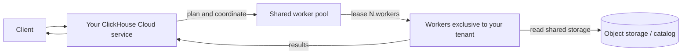
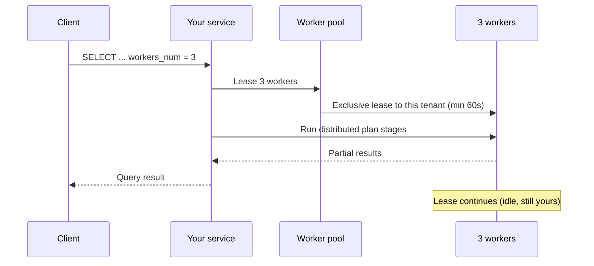
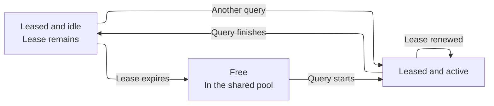
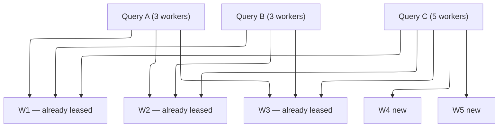

import { PrivatePreviewBadge } from "/snippets/pt-BR/components/PrivatePreviewBadge/PrivatePreviewBadge.jsx";

<PrivatePreviewBadge />

<Note>
  O On-Demand Compute está em private preview. Ele não é coberto pelos SLOs ou SLAs do ClickHouse Cloud e podem se aplicar limitações conhecidas e desconhecidas. Consulte [Limitações](#limitations).

  [Entre na lista de espera](https://clickhouse.com/cloud/on-demand-compute-waitlist).
</Note>

O On-Demand Compute é uma capability do ClickHouse Cloud que oferece a um service (um tenant) processamento adicional para workloads compatíveis, sem exigir que você redimensione ou provisione outro service. Esse trabalho é executado em workers do ClickHouse, fora do processamento do próprio service. Os workers vêm de um pool gerenciado compartilhado entre tenants, mas cada worker é atribuído a apenas um tenant por vez.

Durante o private preview, o On-Demand Compute oferece suporte a consultas `SELECT` elegíveis. Você habilita uma consulta por meio de settings, e o ClickHouse atribui workers do pool para executá-la por meio do seu service e endpoint existentes. As background operations fazem parte da capability como um todo, mas não têm suporte no private preview.

Isso é diferente da [separação de processamento](/pt-BR/products/cloud/features/infrastructure/warehouses). Um warehouse oferece processamento dedicado e de longa duração por meio de múltiplos services que compartilham dados. O On-Demand Compute oferece workers temporários de um pool compartilhado, por meio do seu service existente. Durante o private preview, você solicita esse processamento no nível da consulta.

## Quando usar o On-Demand Compute {#when-to-use-on-demand-compute}

Durante o private preview, use o On-Demand Compute para consultas `SELECT` elegíveis e de uso intensivo de computação que você queira executar fora do compute do primary service:

* **Consultas ad hoc e de analistas:** execute consultas `SELECT` de uso intensivo de computação em workers adicionais.
* **Workloads de leitura não críticas:** tire leituras selecionadas do primary service.
* **Consultas em lago de dados:** consulte dados compatíveis do Apache Iceberg, Delta Lake ou `SharedMergeTree` em workers adicionais.
* **Compute adicional temporário:** solicite workers para consultas elegíveis sem redimensionar o primary service.

O private preview oferece suporte apenas a consultas `SELECT`. Os workers não executam consultas `INSERT`, DDL, mutações nem background operations.

## Como funciona {#how-it-works}



1. Você envia uma consulta `SELECT` elegível ao seu ClickHouse Cloud service. Seu endpoint, sua authentication e sua configuração de RBAC permanecem inalterados.
2. O service monta um plano de consulta distribuída e solicita ao pool gerenciado o número especificado de workers.
3. O ClickHouse atribui workers disponíveis ao seu service.
4. Os workers executam os stages do plano atribuídos pelo distributed planner e leem dados do armazenamento compatível.
5. Seu service coordena a consulta e retorna o resultado ao client.

Durante o private preview, cada worker tem `8 vCPUs` e `32 GiB` de memória. Use `distributed_plan_workers_num` para especificar quantos workers a consulta solicita.

## Usando compute sob demanda {#using-on-demand-compute}

### Settings {#settings}

Adicione essas configurações na consulta, no usuário ou em um SETTINGS PROFILE.

| Setting                        | Valor obrigatório     | Finalidade                                                                                                                                     |
| ------------------------------ | --------------------- | ---------------------------------------------------------------------------------------------------------------------------------------------- |
| `make_distributed_plan`        | Sim                   | Habilita o distributed query plan experimental. Obrigatório para o On-Demand Compute.                                                          |
| `distributed_plan_workers_num` | Sim                   | Número de workers a serem alocados para esta consulta. Se for `0` (o padrão), a consulta é executada no seu service, e não no pool de workers. |
| `enable_parallel_replicas`     | Sim (defina como `0`) | Parallel replicas são incompatíveis com o distributed plan.                                                                                    |

<Tip>
  Durante o preview, defina as configurações no nível da consulta ou crie um usuário separado com configurações diferentes. Assim fica evidente quais instruções usam o On-Demand Compute, e você evita herdar os default profiles do Cloud, que habilitam parallel replicas.
</Tip>

### Exemplo {#example}

```sql
SELECT
    sum(l_extendedprice * l_discount) AS revenue
FROM lineitem
WHERE
    l_shipdate >= DATE '1994-01-01'
    AND l_shipdate < DATE '1994-01-01' + INTERVAL 1 YEAR
    AND l_discount BETWEEN 0.06 - 0.01 AND 0.06 + 0.01
    AND l_quantity < 24
SETTINGS
    make_distributed_plan = 1,
    distributed_plan_workers_num = 3,
    enable_parallel_replicas = 0
```

Essa consulta solicita três workers. O número de workers que o ClickHouse disponibiliza depende do limite do private preview e da capacidade disponível do pool.

### Leasing de workers {#worker-leasing}

Um lease de worker dura no mínimo 60 segundos. O ClickHouse renova o lease automaticamente enquanto uma consulta está em execução.

Após a conclusão da consulta, os workers permanecem atribuídos ao service até que o lease expire. Outra consulta elegível do mesmo service pode reutilizar esses workers enquanto o lease estiver ativo, de modo que o ClickHouse não precisa solicitar novos workers.

Quando o lease expira, o ClickHouse libera os workers do service e os encerra.



Após o término da consulta, os três workers permanecem em lease para o seu tenant, porém ociosos, até que o lease expire.



Se você enviar outra consulta enquanto esses workers ainda estiverem sob lease, eles poderão ser reutilizados imediatamente (sem cold start).

Se o lease tiver expirado, o ClickHouse devolve os workers ao pool (eles são encerrados em vez de ficarem idle para outro tenant).

### Consultas concorrentes {#concurrent-queries}

Consultas concorrentes do mesmo ClickHouse Cloud service podem compartilhar os workers atribuídos. O ClickHouse solicita workers adicionais somente quando uma consulta requer mais workers do que os já atribuídos ao service.

Por exemplo, se duas consultas concorrentes solicitarem três workers cada, elas podem compartilhar os mesmos três workers. Se outra consulta solicitar cinco workers, o ClickHouse pode usar os três workers atribuídos e solicitar mais dois do pool.

Veja o exemplo abaixo:

```sql
SELECT ... SETTINGS make_distributed_plan = 1, distributed_plan_workers_num = 3, ...;
SELECT ... SETTINGS make_distributed_plan = 1, distributed_plan_workers_num = 3, ...;
```

Elas compartilham os mesmos três workers.

Se uma terceira consulta concorrente solicitar cinco workers:

```sql
SELECT ... SETTINGS make_distributed_plan = 1, distributed_plan_workers_num = 5, ...;
```

Essa consulta é executada nos três workers existentes, além de dois workers recém-obtidos por lease.



### Quando o pool não consegue atender à requisição {#pool-capacity}

A disponibilidade de workers é de melhor esforço durante o private preview. Se houver menos workers disponíveis do que o solicitado, a consulta é executada com os workers que o ClickHouse conseguir atribuir. Por exemplo, uma requisição de cinco workers pode ser executada com três.

Se nenhum worker puder ser alocado, a consulta falha:

```text
No stateless workers available for tenant 'bronzeaws-cm-72': the discovery service leased none.
```

Tente executar a consulta novamente. Se o problema persistir, entre em contato com a equipe de conta da ClickHouse — o pool de preview pode estar esgotado ou dimensionado incorretamente.

## Monitoring {#monitoring}

Use a `system.query_log` no seu service para saber quantos workers foram alocados à sua consulta.

### Número de workers alocados {#worker-provided}

```sql
SELECT
    ProfileEvents['StatelessWorkerRequested'],
    ProfileEvents['StatelessWorkerProvided']
FROM clusterAllReplicas(default, system.query_log)
WHERE query_id = '<YOUR_QUERY_ID>'
  AND type != 'QueryStart';
```

<Tip>
  Defina `log_comment = 'on-demand'` (ou um nome de workload) nas queries On-Demand para poder filtrá-las sem precisar fazer o parsing de `Settings`.
</Tip>

## Regiões disponíveis {#available-regions}

Os workers de compute sob demanda (On-Demand Compute) são executados na mesma região do seu ClickHouse Cloud service. Durante o private preview, o recurso estará inicialmente disponível em provedores de Cloud e regiões selecionados. Ao se inscrever na lista de espera, você pode indicar o provedor e a região de sua preferência para que a ClickHouse avalie sua elegibilidade.

## Preço {#pricing}

Durante o private preview, o compute sob demanda é gratuito, sujeito a um limite de uso (consulte [Limitações](#limitations)). Fale com a account team da ClickHouse caso precise que esse limite seja aumentado.

O preço será definido quando o preview terminar. Os participantes do preview serão notificados antes de o recurso ser promovido para beta e antes do início de qualquer cobrança.

O modelo previsto é o mesmo do compute do ClickHouse Cloud: você paga pelo compute que utiliza (tempo de worker alocado), e não por dados varridos ou linhas lidas.

## Limitações {#limitations}

As limitações a seguir se aplicam durante o private preview. Outras limitações podem se aplicar. Relate comportamentos inesperados ao suporte do ClickHouse ou à sua account team.

* **Apenas consultas `SELECT`.** Os workers não executam consultas `INSERT`, mutações, DDL nem background operations.
* **Dados com suporte.** O private preview oferece suporte a Apache Iceberg, Delta Lake e `SharedMergeTree`.
* **Parallel replicas.** As parallel replicas devem estar desabilitadas.
* **Tamanho do worker.** Cada worker tem `8 vCPUs` e `32 GiB` de memória.
* **Limite de workers.** Cada consulta pode solicitar até cinco workers durante o private preview.
* **Capacidade do pool.** A disponibilidade de workers é de melhor esforço. Uma consulta pode receber menos workers do que solicitou. Se nenhum worker estiver disponível, a consulta falha.
* **Desempenho.** O desempenho varia conforme a consulta. A atribuição de workers, o planejamento distribuído e a transferência dos estágios do plano podem adicionar latência. Alguns formatos de consulta podem apresentar desempenho inferior ao da execução no primary service.
* **Compatibilidade de consultas.** O distributed planner não consegue executar remotamente todos os query plans. Consultas sem suporte podem retornar uma exceção `SUPPORT_IS_DISABLED`.

As falhas mais comuns são as seguintes:

| Área                                                                   | O que acontece                                                                    |
| ---------------------------------------------------------------------- | --------------------------------------------------------------------------------- |
| Parallel replicas                                                      | Rejeitadas; desabilite as configurações acima.                                    |
| Window functions com `PARTITION BY`                                    | Geralmente rejeitadas até que o planner consiga fazer shuffle pela partition key. |
| Leituras de tabelas `system`                                           | Não são baseadas em armazenamento compartilhado.                                  |
| Correlated subqueries em alguns formatos                               | Podem ser rejeitadas ou reescritas de forma menos eficiente.                      |
| Projeções, skip indexes na leitura de dados e compilação de expressões | São desativados para a consulta, em vez de gerar uma exceção.                     |

## Roadmap {#roadmap}

O On-Demand Compute é apenas o começo. Trabalhos em andamento ou planejados:

* Eliminar limitações conhecidas (lacunas de `SUPPORT_IS_DISABLED`).
* Pools com workers de tamanhos diferentes.
* Estabilizar o desempenho de consultas em comparação com a execução stateful.
* Suporte a background merge.
* Precificação.
* Calibração do escalonador automático do pool de workers.
* Métricas e monitoramento no Console.
* Permissões dedicadas para o On-Demand Compute.

## Segurança {#security}

O On-Demand Compute não altera a forma como você se conecta ao ClickHouse Cloud. Os clientes continuam se autenticando no seu serviço. Os workers nunca expõem um query endpoint público.

Roles e permissões dedicadas do On-Demand não fazem parte da prévia (consulte o [Roadmap](#roadmap)). Até lá, qualquer pessoa que consiga executar `SELECT` com as configurações acima no seu serviço pode usar workers, respeitando a quota da prévia.

## FAQ {#faq}

<AccordionGroup>
  <Accordion title="O On-Demand Compute é open source?">
    Não. Trata-se de uma arquitetura do ClickHouse Cloud: ClickHouse server (distributed plan), data plane (pool de workers e leases) e control plane. A configuração experimental `make_distributed_plan` existe no ClickHouse, mas o pool compartilhado de workers e a execução sem estado são exclusivos do Cloud.
  </Accordion>

  <Accordion title="Preciso de uma versão específica para participar do private preview?">
    Sim. A equipe da ClickHouse confirmará se o seu service precisa de um upgrade antes de participar do private preview. Upgrades adicionais podem ser necessários durante o preview.
  </Accordion>

  <Accordion title="Como será o preço?">
    Não há cobrança adicional durante o private preview, respeitados os limites do preview. O preço das fases posteriores de lançamento será divulgado antes de qualquer cobrança. Dito isso, o preço segue a mesma filosofia do ClickHouse Cloud: cobrar pelo compute utilizado, e não pelo volume de dados escaneados ou pelas linhas lidas. As taxas exatas serão publicadas antes do início do billing em GA ou beta.
  </Accordion>

  <Accordion title="Posso usar isso em produção?">
    Você pode executar workloads reais, mas este é um private preview: há limitações conhecidas e desconhecidas, e não existe SLO/SLA para a disponibilidade do pool de workers. A ClickHouse tem o compromisso de apoiar os primeiros adotantes; trate o recurso como preview, e não como uma garantia de produção.
  </Accordion>

  <Accordion title="Qual a diferença em relação ao autoscaling do meu service?">
    O autoscaling altera o compute atribuído ao seu primary service. Durante o private preview, o On-Demand Compute concede a consultas `SELECT` elegíveis acesso temporário a workers de um pool gerenciado, sem alterar o tamanho do primary service. O autoscaling gerencia a capacidade contínua do service, enquanto o On-Demand Compute fornece compute temporário para workloads específicos.
  </Accordion>

  <Accordion title="Qual a diferença em relação a um warehouse ou à compute-compute separation?">
    A compute-compute separation fornece compute dedicado por meio de múltiplos serviços do ClickHouse Cloud que compartilham dados. Já o On-Demand Compute fornece compute temporário de um pool gerenciado por meio do seu service já existente. Durante o private preview, esse compute é solicitado no nível da consulta. A capability mais ampla foi projetada para dar suporte tanto à query execution quanto a background operations.
  </Accordion>

  <Accordion title="Onde posso tirar dúvidas?">
    Fale com o seu account team; ele o apresentará ao product manager do On-Demand Compute.
  </Accordion>

  <Accordion title="Onde posso relatar bugs?">
    Abra um ticket de suporte (severidade 3) ou relate ao product manager. Inclua o `query_id` e a exceção completa.
  </Accordion>

  <Accordion title="Isso está disponível no ClickHouse BYOC ou no ClickHouse Private?">
    Não. O private preview não está disponível no ClickHouse BYOC nem no ClickHouse Private.
  </Accordion>
</AccordionGroup>