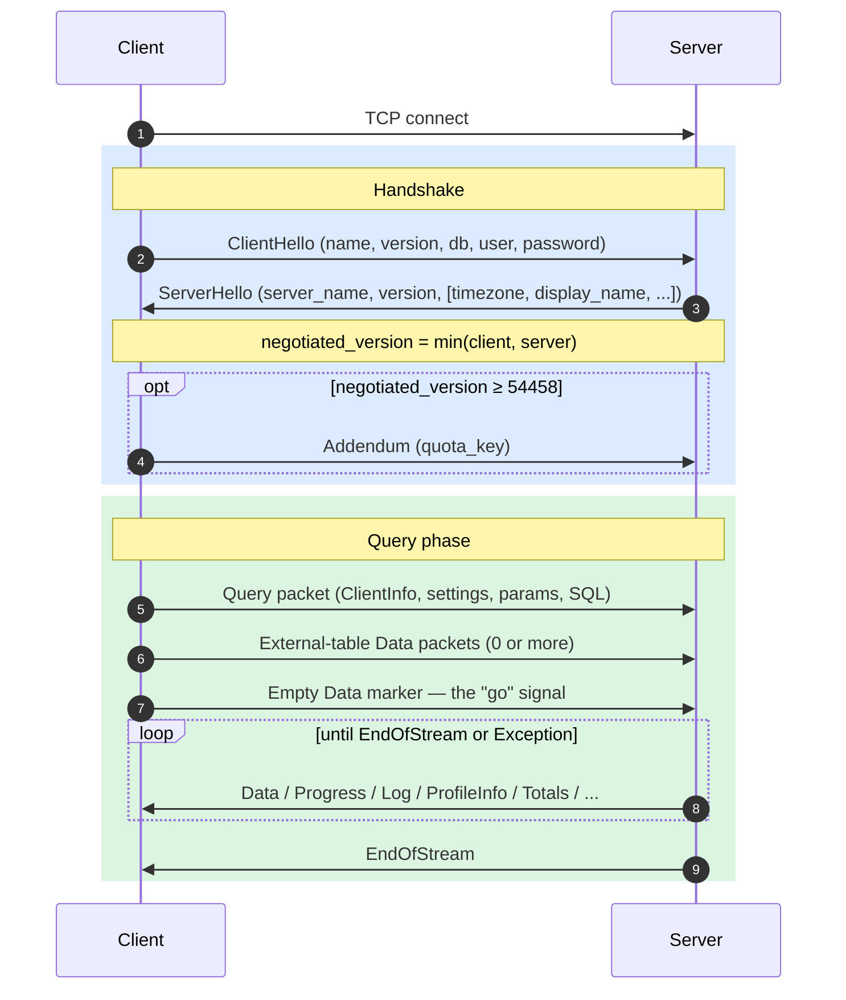
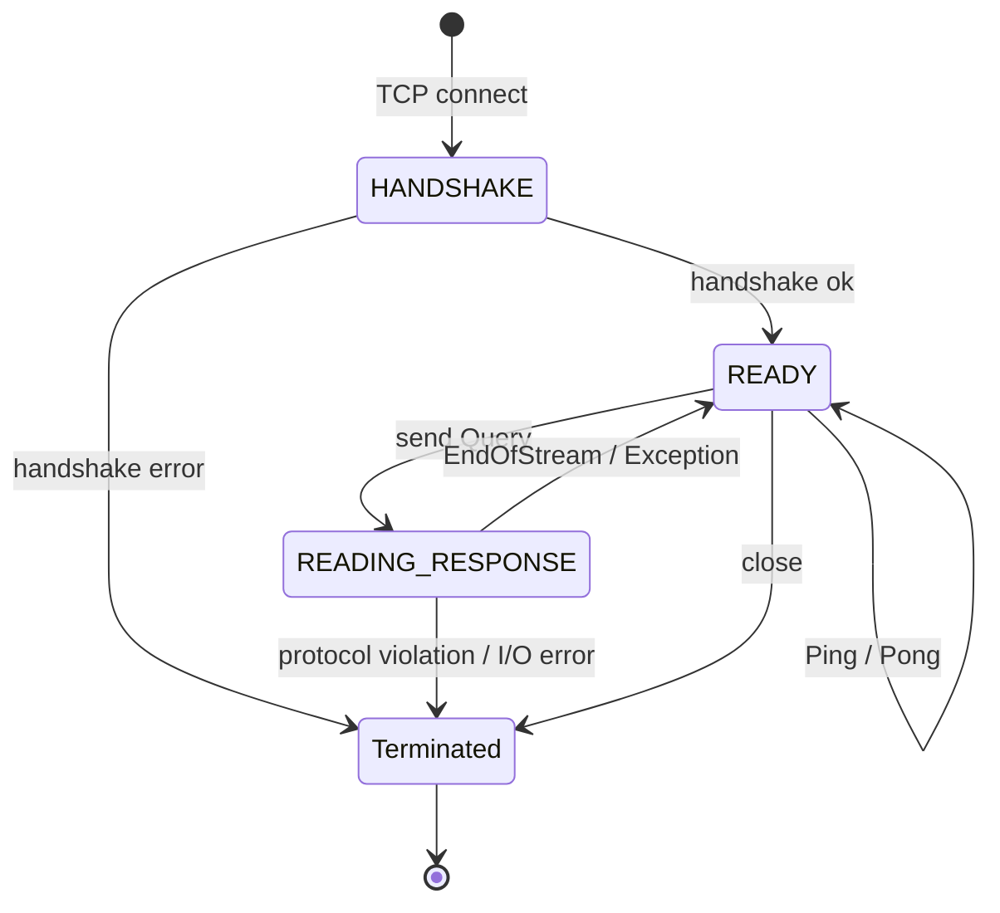
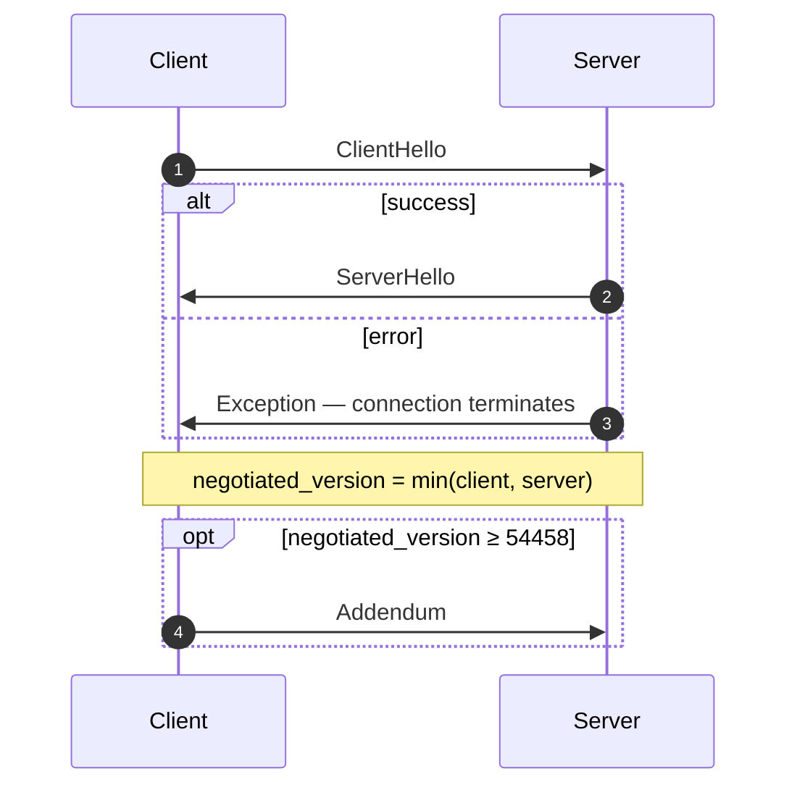
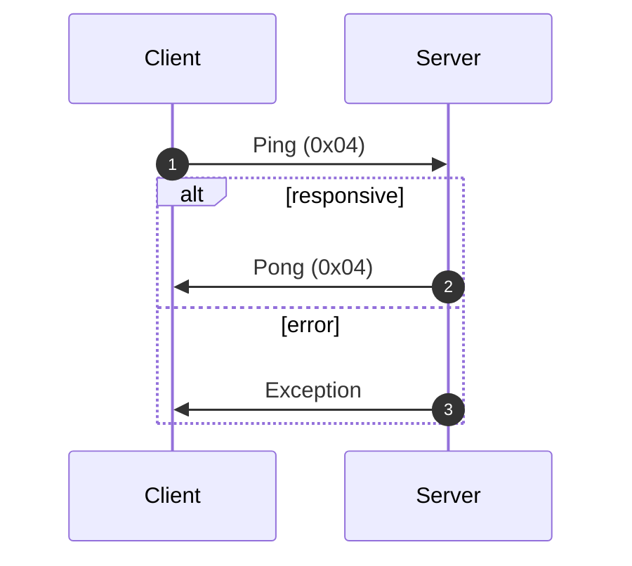
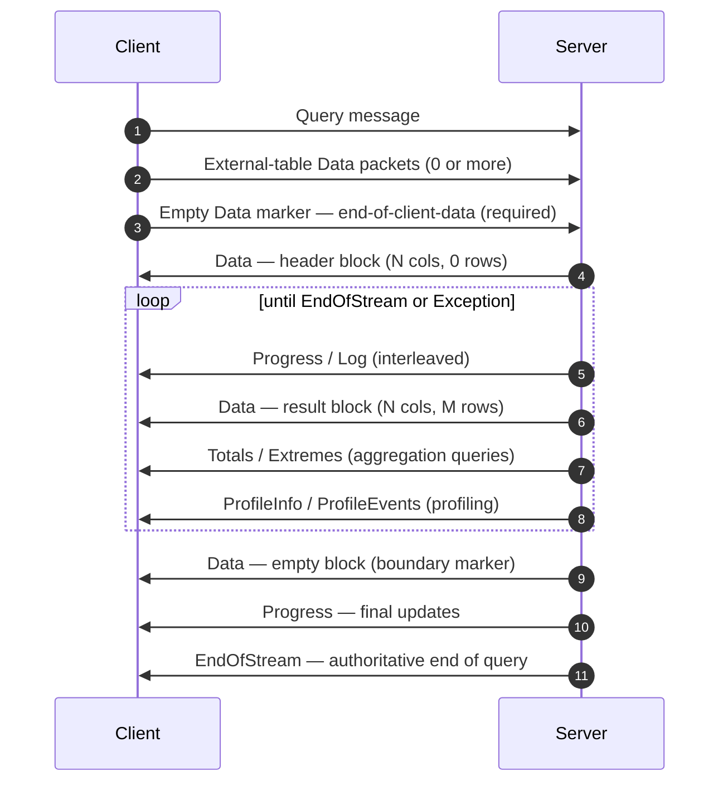
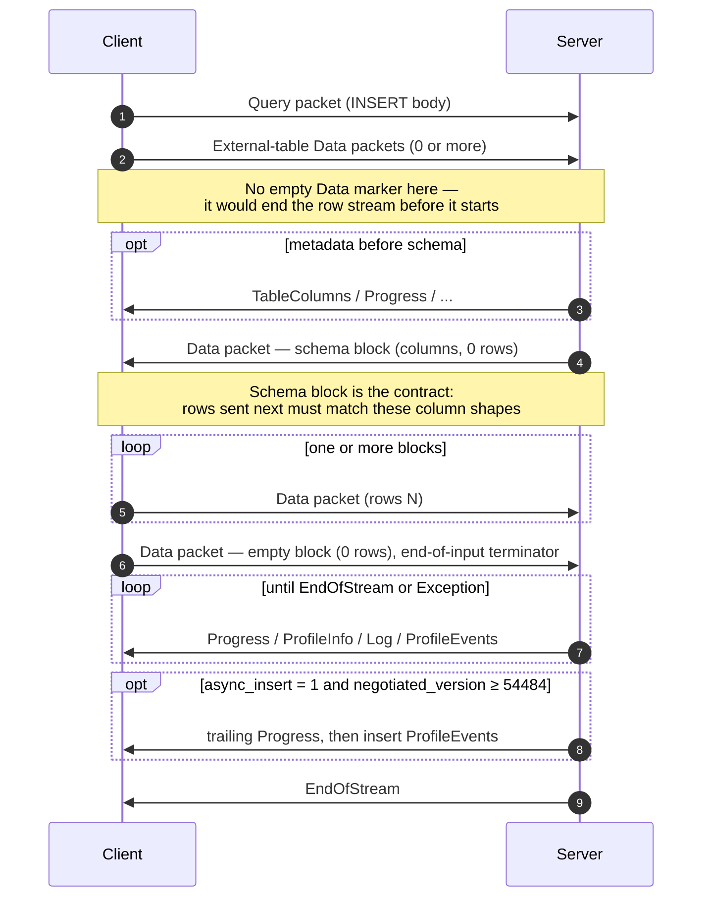
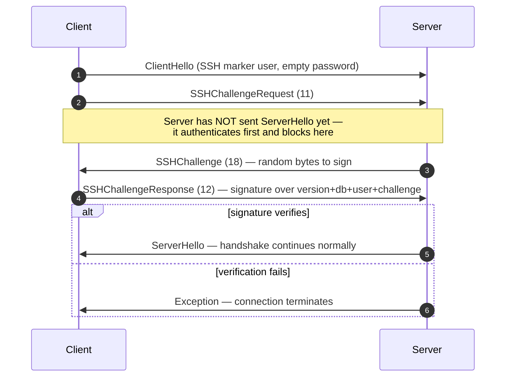

O protocolo nativo é o protocolo binário e orientado a conexão usado por clientes e servidores do ClickHouse para se comunicarem via TCP. Ele transporta consultas SQL, dados de resultado, cargas úteis de `INSERT`, telemetria de execução e sinais de erro. É o protocolo usado pelo cliente de linha de comando, pelo driver nativo em C++ e pela maioria dos drivers nativos de terceiros.

Esta página trata do protocolo em si: o enquadramento de pacotes, a máquina de estados da conexão, a negociação de versão e o corpo de cada mensagem que não seja `Block`. Os bytes dentro dos pacotes da família `Data` (o `Block`, suas colunas e as codificações de cada tipo) são um assunto à parte, documentado na especificação do [Native Format](/pt-BR/resources/develop-contribute/native-protocol/format).

<Info>
  **Especificação complementar**

  Esta página é metade de um par e é publicada junto com a especificação complementar do [Native Format](/pt-BR/resources/develop-contribute/native-protocol/format). As duas especificações dividem o trabalho de forma clara: esta página cobre a camada de pacotes e de transporte; a especificação do Native Format cobre os bytes dentro dos pacotes da família `Data`.
</Info>

Algumas propriedades valem para todo o protocolo. Ele é binário e posicional: não há marcadores de campo, exceto dentro de `BlockInfo`, então um único byte fora do lugar dessincroniza tudo o que vem depois. Ele é stateful, e cada conexão TCP processa uma consulta por vez — não há multiplexação. Inteiros de largura fixa são little-endian.

## Visão geral {#overview}

| Propriedade       | Valor                                                                                                  |
| ----------------- | ------------------------------------------------------------------------------------------------------ |
| Transporte        | TCP, opcionalmente encapsulado em TLS                                                                  |
| Ordem de bytes    | Little-endian para inteiros de largura fixa                                                            |
| Codificação       | Binária e posicional (sem marcadores de campo, exceto em `BlockInfo`)                                  |
| Modelo de conexão | Stateful, uma consulta por vez, sem multiplexação                                                      |
| Versionamento     | Negociado no handshake; funcionalidades individuais condicionadas à versão                             |
| Formato de dados  | O [Native Format](/pt-BR/resources/develop-contribute/native-protocol/format) para todos os dados tabulares |

Toda mensagem no wire começa com um código de tipo de pacote `VarUInt`, seguido por um corpo cuja estrutura depende desse código e da versão do protocolo negociada.

Uma conexão passa por três fases: um handshake único, seguido de qualquer número de trocas `Ping` ou `Query` e, por fim, o encerramento:



O protocolo TCP nativo sempre transporta dados tabulares no Native Format, independentemente de qualquer cláusula `FORMAT` no SQL. A reformatação para `RowBinary`, `CSV`, `JSON` etc. cabe ao cliente, que a realiza depois de decodificar os blocos Native. (A interface HTTP usa um caminho de código diferente, que *de fato* respeita a cláusula `FORMAT`; o HTTP não é abordado aqui.)

## Segurança {#security}

### Segurança de transporte (TLS) {#transport-security}

O TLS opera na camada de transporte, abaixo do protocolo. Quando ele está habilitado, todo o stream TCP é criptografado, e as mensagens do protocolo são idênticas byte a byte, com ou sem o uso de TLS.

### Autenticação {#authentication}

A autenticação ocorre durante o handshake, na mensagem [`ClientHello`](#clienthello). Os campos `user` e `password` trafegam como strings em texto simples; por isso, é a criptografia na camada de transporte (TLS) que protege as credenciais em trânsito.

O servidor interpreta um campo `user` vazio como o usuário de sessão padrão configurado: a configuração de servidor `default_session_user` (cujo valor default é `default`), que pode ser sobrescrita por listener na seção `protocols`. Se o servidor estiver configurado com um usuário de sessão padrão vazio, ou se for anterior à versão 26.8, um campo `user` vazio será rejeitado com uma exceção. Observe que o `clickhouse-client` nunca envia um nome de usuário vazio: ele o substitui por `default` no lado do cliente.

A autenticação SSH por desafio-resposta está disponível a partir da versão de protocolo 54466. Consulte [Autenticação SSH por desafio-resposta](#ssh-authentication).

### Segredo entre servidores {#inter-server-secret}

Na execução de consultas distribuídas, os servidores se autenticam entre si comprovando que conhecem um segredo compartilhado — sem transmitir o segredo pelo wire. Cada Query carrega um `auth_hash` SHA-256 de 32 bytes no campo 4 de [`Query`](#query), calculado a partir de um salt, um nonce, o segredo configurado e a consulta; o servidor receptor recalcula esse valor e o compara. Esse comportamento depende da feature `INTERSERVER_SECRET` (v54441). Clientes externos sempre enviam uma string vazia nesse campo. Consulte [Autenticação entre servidores](#inter-server-authentication).

## Versionamento e feature gates {#versioning-and-feature-gates}

### Negociação de versão {#version-negotiation}

Durante o handshake, tanto o cliente quanto o servidor informam a versão máxima do protocolo com a qual são compatíveis. A **versão negociada** é a menor das duas:

```text
negotiated_version = min(client_version, server_version)
```

Todas as mensagens seguintes usam a versão negociada para determinar quais campos estão presentes no wire.

### Feature gates {#feature-gates}

Uma funcionalidade é identificada pela versão do protocolo em que foi introduzida e fica **ativa** quando a versão negociada é maior ou igual a esse número.

<Warning>
  Quando uma funcionalidade está ativa, seus campos **devem** estar presentes no wire. Como o protocolo é estritamente posicional, omitir um campo controlado por feature gate corrompe o fluxo de bytes de todos os campos subsequentes.
</Warning>

### Tabela de funcionalidades {#feature-table}

| Recurso                                                      | Versão | Afeta                                 | Impacto no wire                                                                                                                                                                                                                                                                                                                                                                                                                                                                                                                                                                                                                                                                                                                                                                                                    |
| ------------------------------------------------------------ | ------ | ------------------------------------- | ------------------------------------------------------------------------------------------------------------------------------------------------------------------------------------------------------------------------------------------------------------------------------------------------------------------------------------------------------------------------------------------------------------------------------------------------------------------------------------------------------------------------------------------------------------------------------------------------------------------------------------------------------------------------------------------------------------------------------------------------------------------------------------------------------------------ |
| BLOCK&#95;INFO                                               | all    | Block                                 | Adiciona o prefixo BlockInfo (`is_overflows`, `bucket_number`) a cada Block.                                                                                                                                                                                                                                                                                                                                                                                                                                                                                                                                                                                                                                                                                                                                       |
| CLIENT&#95;INFO                                              | 54032  | Query                                 | Adiciona o bloco ClientInfo ao corpo do Query.                                                                                                                                                                                                                                                                                                                                                                                                                                                                                                                                                                                                                                                                                                                                                                     |
| TIMEZONE                                                     | 54058  | ServerHello                           | Adiciona o campo `timezone` ao ServerHello.                                                                                                                                                                                                                                                                                                                                                                                                                                                                                                                                                                                                                                                                                                                                                                        |
| QUOTA&#95;KEY&#95;IN&#95;CLIENT&#95;INFO                     | 54060  | ClientInfo                            | Adiciona o campo `quota_key` ao ClientInfo.                                                                                                                                                                                                                                                                                                                                                                                                                                                                                                                                                                                                                                                                                                                                                                        |
| DISPLAY&#95;NAME                                             | 54372  | ServerHello                           | Adiciona o campo `display_name` ao ServerHello.                                                                                                                                                                                                                                                                                                                                                                                                                                                                                                                                                                                                                                                                                                                                                                    |
| VERSION&#95;PATCH                                            | 54401  | ServerHello, ClientInfo               | Adiciona o campo `version_patch` a ambos.                                                                                                                                                                                                                                                                                                                                                                                                                                                                                                                                                                                                                                                                                                                                                                          |
| SERVER&#95;LOGS                                              | 54406  | Log                                   | O servidor emite pacotes Log quando `send_logs_level` está definido.                                                                                                                                                                                                                                                                                                                                                                                                                                                                                                                                                                                                                                                                                                                                               |
| COLUMN&#95;DEFAULTS&#95;METADATA                             | 54410  | TableColumns                          | O servidor pode enviar o pacote [`TableColumns`](#tablecolumns) (tipo 11) com metadados de valores padrão das colunas antes do bloco de esquema de INSERT/entrada. Enviado somente quando a versão negociada é ≥ 54410 **e** `input_format_defaults_for_omitted_fields` está habilitado. Abaixo dessa versão, o pacote nunca é enviado; os clientes não devem aguardá-lo.                                                                                                                                                                                                                                                                                                                                                                                                                                          |
| WRITE&#95;CLIENT&#95;INFO                                    | 54420  | Progress                              | Adiciona `wrote_rows` e `wrote_bytes` ao Progress. (Apesar do nome, este recurso **não** controla o bloco ClientInfo — quem faz isso é o `CLIENT_INFO` (v54032).)                                                                                                                                                                                                                                                                                                                                                                                                                                                                                                                                                                                                                                                  |
| SETTINGS&#95;SERIALIZED&#95;AS&#95;STRINGS                   | 54429  | Query (codificação das configurações) | Altera **como** a lista de configurações, sempre presente, é codificada; **não** determina se as configurações são enviadas. A partir da v54429, cada configuração é gravada como `(name, flags, value-as-string)`; peers mais antigos gravam `(name, type-specific-binary-value)`, sem flags. Consulte [Setting](#setting).                                                                                                                                                                                                                                                                                                                                                                                                                                                                                       |
| INTERSERVER&#95;SECRET                                       | 54441  | Query                                 | Adiciona ao Query o campo inter-servidor `auth_hash` — um SHA-256 com salt calculado sobre o segredo do cluster, e não o segredo bruto. Clientes externos enviam uma string vazia. Consulte [Autenticação inter-servidor](#inter-server-authentication).                                                                                                                                                                                                                                                                                                                                                                                                                                                                                                                                                           |
| OPEN&#95;TELEMETRY                                           | 54442  | ClientInfo                            | Adiciona o contexto de rastreamento do OpenTelemetry ao ClientInfo.                                                                                                                                                                                                                                                                                                                                                                                                                                                                                                                                                                                                                                                                                                                                                |
| DISTRIBUTED&#95;DEPTH                                        | 54448  | ClientInfo                            | Adiciona o campo `distributed_depth` ao ClientInfo.                                                                                                                                                                                                                                                                                                                                                                                                                                                                                                                                                                                                                                                                                                                                                                |
| INITIAL&#95;QUERY&#95;START&#95;TIME                         | 54449  | ClientInfo                            | Adiciona o campo `initial_time` (Int64, largura fixa).                                                                                                                                                                                                                                                                                                                                                                                                                                                                                                                                                                                                                                                                                                                                                             |
| PROFILE&#95;EVENTS                                           | 54451  | ProfileEvents                         | O servidor emite pacotes ProfileEvents durante a execução da consulta.                                                                                                                                                                                                                                                                                                                                                                                                                                                                                                                                                                                                                                                                                                                                             |
| PARALLEL&#95;REPLICAS                                        | 54453  | ClientInfo                            | Adiciona ao ClientInfo campos de coordenação de réplicas paralelas.                                                                                                                                                                                                                                                                                                                                                                                                                                                                                                                                                                                                                                                                                                                                                |
| CUSTOM&#95;SERIALIZATION                                     | 54454  | Block (Column)                        | Adiciona o byte `has_custom_serialization` após a string de tipo de cada coluna.                                                                                                                                                                                                                                                                                                                                                                                                                                                                                                                                                                                                                                                                                                                                   |
| ADDENDUM                                                     | 54458  | Handshake                             | O cliente envia um adendo (`quota_key`) após a troca de handshake.                                                                                                                                                                                                                                                                                                                                                                                                                                                                                                                                                                                                                                                                                                                                                 |
| PARAMETERS                                                   | 54459  | Query                                 | Adiciona a lista de parâmetros ao corpo do Query.                                                                                                                                                                                                                                                                                                                                                                                                                                                                                                                                                                                                                                                                                                                                                                  |
| SERVER&#95;QUERY&#95;TIME&#95;IN&#95;PROGRESS                | 54460  | Progress                              | Adiciona o campo `elapsed_ns` ao Progress.                                                                                                                                                                                                                                                                                                                                                                                                                                                                                                                                                                                                                                                                                                                                                                         |
| PASSWORD&#95;COMPLEXITY&#95;RULES                            | 54461  | ServerHello                           | Adiciona ao ServerHello uma lista de padrões regex da política de senhas, acompanhados de mensagens legíveis.                                                                                                                                                                                                                                                                                                                                                                                                                                                                                                                                                                                                                                                                                                      |
| INTERSERVER&#95;SECRET&#95;V2                                | 54462  | ServerHello                           | Adiciona um nonce `UInt64` de 8 bytes ao ServerHello. Usado na assinatura de consultas inter-servidor; clientes externos o decodificam e o ignoram.                                                                                                                                                                                                                                                                                                                                                                                                                                                                                                                                                                                                                                                                |
| TOTAL&#95;BYTES&#95;IN&#95;PROGRESS                          | 54463  | Progress                              | Adiciona o campo `total_bytes_to_read` (VarUInt) ao Progress, entre `total_rows` e `wrote_rows`.                                                                                                                                                                                                                                                                                                                                                                                                                                                                                                                                                                                                                                                                                                                   |
| TIMEZONE&#95;UPDATES                                         | 54464  | TimezoneUpdate                        | Adiciona o pacote de servidor `TimezoneUpdate` (tipo 17). Corpo: uma única `String` com o fuso horário da sessão. Enviado somente pelo inicializador da função de tabela `input`, logo após o bloco de esquema de entrada, para que o cliente interprete as linhas que envia de acordo com o `session_timezone` do servidor. Consulte [TimezoneUpdate](#timezoneupdate).                                                                                                                                                                                                                                                                                                                                                                                                                                           |
| SPARSE&#95;SERIALIZATION                                     | 54465  | Block (Column)                        | O servidor pode definir `has_custom_serialization = 1` e emitir uma coluna com codificação esparsa. Formato no wire: kind de 1 byte (0x01 = SPARSE), seguido de um fluxo de offsets VarUInt terminado por EOG e, por fim, os valores não padrão codificados de forma densa no tipo interno. Consulte [kind&#95;stack e codificação esparsa](/pt-BR/resources/develop-contribute/native-protocol/format#kind-stack-and-sparse-encoding).                                                                                                                                                                                                                                                                                                                                                                                  |
| SSH&#95;AUTHENTICATION                                       | 54466  | Fluxo de autenticação                 | Adiciona autenticação SSH por desafio-resposta. Opcional: para ativá-la, o cliente envia um `user` no formato `" SSH KEY AUTHENTICATION " + <real_user>` com senha vazia. Consulte [Autenticação SSH por desafio-resposta](#ssh-authentication).                                                                                                                                                                                                                                                                                                                                                                                                                                                                                                                                                                   |
| TABLE&#95;READ&#95;ONLY&#95;CHECK                            | 54467  | TablesStatusResponse                  | Adiciona uma flag `is_readonly` à linha de cada tabela no TablesStatusResponse. Para clientes externos que não enviam `TablesStatusRequest`, nada muda no wire.                                                                                                                                                                                                                                                                                                                                                                                                                                                                                                                                                                                                                                                    |
| SYSTEM&#95;KEYWORDS&#95;TABLE                                | 54468  | tabelas de sistema                    | O servidor preenche `system.keywords` para que o `clickhouse-client` canônico possa autocompletar palavras-chave. Nenhuma alteração no wire do protocolo nativo.                                                                                                                                                                                                                                                                                                                                                                                                                                                                                                                                                                                                                                                   |
| ROWS&#95;BEFORE&#95;AGGREGATION                              | 54469  | ProfileInfo                           | Adiciona `applied_aggregation` (Bool) e `rows_before_aggregation` (VarUInt) ao final do ProfileInfo, nessa ordem.                                                                                                                                                                                                                                                                                                                                                                                                                                                                                                                                                                                                                                                                                                  |
| CHUNKED&#95;PROTOCOL                                         | 54470  | Enquadramento da conexão              | O enquadramento em fragmentos por pacote envolve o corpo de cada pacote. Negociado no Addendum. O ServerHello informa a preferência do servidor para cada direção; o Addendum informa a escolha final do cliente. Consulte [enquadramento em fragmentos](#chunked-framing).                                                                                                                                                                                                                                                                                                                                                                                                                                                                                                                                        |
| VERSIONED&#95;PARALLEL&#95;REPLICAS&#95;PROTOCOL             | 54471  | ServerHello, Addendum                 | Ambos os lados trocam uma versão `VarUInt` do protocolo de coordenação de réplicas paralelas. O campo do ServerHello fica posicionado **imediatamente após `protocol_version`** (antes de `timezone`). O campo do Addendum é anexado após as strings do protocolo em chunks. Valor atual: `8` (`DBMS_PARALLEL_REPLICAS_PROTOCOL_VERSION`). A versão `8` adiciona [`MergeTreeAllRangesAnnouncementResponse`](#mergetreeallrangesannouncementresponse) (pacote de cliente `14`): quando a versão negociada de réplicas paralelas é `≥ 8`, o iniciador responde a cada anúncio de seguidor em modo diferente de `Default` com a lista autoritativa de partes para aquele stream, e o seguidor aguarda essa resposta antes de emitir requisições de leitura. Abaixo de `8`, o anúncio é enviado sem aguardar resposta. |
| INTERSERVER&#95;EXTERNALLY&#95;GRANTED&#95;ROLES             | 54472  | Query                                 | Adiciona um campo `String external_roles` ao corpo do Query, entre o terminador de configurações e o hash do segredo interserver. Clientes externos enviam uma lista de funções vazia (um único byte `0x00`, ou seja, VarUInt 0 dentro de um envelope String).                                                                                                                                                                                                                                                                                                                                                                                                                                                                                                                                                     |
| V2&#95;DYNAMIC&#95;AND&#95;JSON&#95;SERIALIZATION            | 54473  | Corpo da coluna                       | O servidor pode emitir serialização V2 para os tipos de coluna `Dynamic` e `JSON` — isso determina qual versão de `state_prefix` eles usam. Consulte [tipos versionados](/pt-BR/resources/develop-contribute/native-protocol/format#versioned-types).                                                                                                                                                                                                                                                                                                                                                                                                                                                                                                                                                                    |
| SERVER&#95;SETTINGS                                          | 54474  | ServerHello                           | O servidor transmite suas configurações não padrão como uma lista ao final do ServerHello, após `nonce`. Formato: triplas `(key, flags, value)` terminadas por uma chave vazia — igual à lista de configurações do pacote Query.                                                                                                                                                                                                                                                                                                                                                                                                                                                                                                                                                                                   |
| QUERY&#95;AND&#95;LINE&#95;NUMBERS                           | 54475  | ClientInfo                            | Adiciona `script_query_number` (VarUInt) e `script_line_number` (VarUInt) ao final do ClientInfo. Usado pelo clickhouse-client para atribuir erros em scripts com várias instruções; clientes externos enviam `0, 0`.                                                                                                                                                                                                                                                                                                                                                                                                                                                                                                                                                                                              |
| JWT&#95;IN&#95;INTERSERVER                                   | 54476  | ClientInfo                            | Adiciona um UInt8 de presença de JWT + um `String jwt` opcional ao final do ClientInfo. Clientes externos (sem JWT) enviam o byte `0x00`. (Escrito como `DBMS_MIN_REVISON_WITH_JWT_IN_INTERSERVER` em C++ — observe o erro de digitação no nome da constante.)                                                                                                                                                                                                                                                                                                                                                                                                                                                                                                                                                     |
| QUERY&#95;PLAN&#95;SERIALIZATION                             | 54477  | ServerHello, pacote QueryPlan         | O ServerHello anexa `VarUInt query_plan_serialization_version` após as configurações do servidor. Também introduz `ClientPacket::QueryPlan` (código `13`) para entrega entre servidores de planos de consulta pré-construídos — clientes externos nunca o enviam. A versão `10` da serialização de plano de consulta prefixa o plano serializado com `VarUInt max_threads` e `Bool concurrency_control`; quando algum deles não está no valor padrão, os iniciadores enviam o SQL para peers abaixo da versão `10`, de modo que o peer construa seu plano a partir das configurações da consulta transmitidas.                                                                                                                                                                                                     |
| PARALLEL&#95;BLOCK&#95;MARSHALLING                           | 54478  | Bloco (Coluna)                        | O servidor pode encapsular colunas em `ColumnBLOB` (comprimidas inline) para processamento paralelo. Ocorre apenas quando a consulta tem compressão habilitada AND `rows > 1`; caso contrário, aplica-se o formato wire regular da coluna. Clientes que nunca habilitam compressão em pacotes Query de saída não veem mudança no wire.                                                                                                                                                                                                                                                                                                                                                                                                                                                                             |
| VERSIONED&#95;CLUSTER&#95;FUNCTION&#95;PROTOCOL              | 54479  | ServerHello                           | Adiciona `VarUInt cluster_function_protocol_version` ao final do ServerHello. Usado para funções de tabela `*Cluster` (`s3Cluster` etc.). Valor atual: `8` (`DBMS_CLUSTER_PROCESSING_PROTOCOL_VERSION`); a versão `7` é reservada para um recurso de repositório privado (compactação Iceberg), e a `8` adiciona um `read_source_index` opcional ao payload de tarefa de leitura de cluster entre servidores (o corpo de `ReadTaskResponse`, que permanece não especificado aqui — veja abaixo). Clientes externos decodificam e ignoram.                                                                                                                                                                                                                                                                          |
| OUT&#95;OF&#95;ORDER&#95;BUCKETS&#95;IN&#95;AGGREGATION      | 54480  | BlockInfo                             | Adiciona o campo 3 (`out_of_order_buckets: Vec<Int32>`) ao fluxo de campos marcados do BlockInfo. Decodificado como `[VarUInt count][Int32]*count`. Clientes externos não emitem esse campo; o decodificador lê qualquer lista não vazia que o servidor envie.                                                                                                                                                                                                                                                                                                                                                                                                                                                                                                                                                     |
| COMPRESSED&#95;LOGS&#95;PROFILE&#95;EVENTS&#95;COLUMNS       | 54481  | Log, ProfileEvents, TableColumns      | O servidor pode encapsular os corpos dos pacotes [`Log`](#log), [`ProfileEvents`](#profileevents) e [`TableColumns`](#tablecolumns) no [quadro de compressão](/pt-BR/resources/develop-contribute/native-protocol/format#compression-frame). Nesta versão, os três corpos passam pelo mesmo caminho de saída opcionalmente comprimido, que só se torna um quadro de compressão real quando a consulta tem `compression = true`. Clientes que nunca habilitam compressão em pacotes Query de saída não veem mudança no wire.                                                                                                                                                                                                                                                                                              |
| REPLICATED&#95;SERIALIZATION                                 | 54482  | Bloco (Coluna)                        | O servidor pode emitir colunas com kind&#95;stack `0x04 = REPLICATED` — uma forma compacta no estilo de dicionário para valores repetidos — consulte [kind&#95;stack e codificação esparsa](/pt-BR/resources/develop-contribute/native-protocol/format#kind-stack-and-sparse-encoding). Abaixo desta versão, o escritor expandia essas colunas antes de enviá-las. Decodificado por meio de busca por índice (`elements[indexes[i]]` por linha); são suportados tipos folha, além de tipos internos `Nullable`/`Array`/`Tuple`/`Map`/`Nested`/`LowCardinality`.                                                                                                                                                                                                                                                          |
| NULLABLE&#95;SPARSE&#95;SERIALIZATION                        | 54483  | Bloco (Coluna)                        | Combina a serialização esparsa com `Nullable(T)`. Abaixo desta versão, o escritor expandia a forma esparsa de colunas Nullable antes de enviá-las; a partir da v54483, os dados no wire são esparsos sobre Nullable. Consulte [kind&#95;stack e codificação esparsa](/pt-BR/resources/develop-contribute/native-protocol/format#kind-stack-and-sparse-encoding).                                                                                                                                                                                                                                                                                                                                                                                                                                                         |
| PROGRESS&#95;IN&#95;ASYNC&#95;INSERT                         | 54484  | Progress (INSERT)                     | Em um INSERT **assíncrono** (`async_insert = 1`), depois que o insert é descarregado, o servidor envia um pacote [`Progress`](#progress) extra e, em seguida, os `ProfileEvents` do insert, antes de `EndOfStream`. Condicionado à versão *negociada* ≥ 54484; abaixo dela, o servidor omite esse Progress final. O formato wire do Progress não muda — apenas a emissão é nova. Na prática, o incremento carrega o tempo decorrido; os contadores de linhas gravadas são reportados pelos ProfileEvents que o acompanham. Um cliente que já consome pacotes Progress intercalados não precisa de mudança de formato, apenas tolerar mais um pacote.                                                                                                                                                               |
| CLIENT&#95;AGENT&#95;IN&#95;CLIENT&#95;INFO                  | 54485  | ClientInfo                            | Adiciona um `String` `client_agent` ao final do ClientInfo. O cliente canônico detecta automaticamente um identificador de agente a partir do seu ambiente (por exemplo, `claude-code`, `cursor`, `gemini-cli` ou o valor da variável `AGENT`); um cliente externo que não detecte nada envia uma string vazia. Obrigatório quando a versão negociada é ≥ 54485 — omiti-lo dessincroniza o restante do pacote Query.                                                                                                                                                                                                                                                                                                                                                                                               |
| INTERNAL&#95;QUERY&#95;FLAG                                  | 54486  | ClientInfo                            | Adiciona um `UInt8` `is_internal` ao final do ClientInfo. `1` para uma consulta interna do servidor (não emitida pelo usuário), propagado para consultas remotas para que suas linhas em `system.query_log` sejam marcadas como internas; clientes externos enviam `0`. Obrigatório quando a versão negociada é ≥ 54486 — omiti-lo dessincroniza o restante do pacote Query.                                                                                                                                                                                                                                                                                                                                                                                                                                       |
| INTERSERVER&#95;CURRENT&#95;ROLES                            | 54488  | ClientInfo                            | Adiciona ao final do ClientInfo uma lista String opcional `current_roles` (`[UInt8 present]` e, se `1`, `[VarUInt count][String]*count`) e, para consultas entre servidores, estende o `auth_hash` para cobrir a lista serializada. Carrega os nomes das funções ativas (habilitadas) do iniciador, para que um nó secundário aplique as políticas de linha da mesma forma, em vez de recorrer às funções padrão do usuário. Preenchido apenas para consultas entre servidores e somente quando `push_external_roles_in_interserver_queries = 1`; clientes externos enviam `0` (ausente). Obrigatório quando a versão negociada é ≥ 54488 — omitir o byte de presença dessincroniza o restante do pacote Query.                                                                                                    |
| CURRENT&#95;AGGREGATION&#95;VARIANT&#95;SELECTION&#95;METHOD | 54489  | Agregação (buckets de dois níveis)    | O método de agregação para uma única chave `String` segue `enable_packed_string_keys_in_aggregation`. Um peer abaixo desta revisão sempre usa o método compactado e não conhece a configuração, então trocar buckets de dois níveis com ele colocaria a mesma chave em buckets diferentes. O iniciador adota uma postura segura para esse peer: zera os limiares de dois níveis para ele e redistribui por conta própria os blocos de nível único em buckets. A comparação é feita com a revisão do peer, e não com sua versão, porque o método pode mudar dentro de um mesmo release. Sem mudança no wire do protocolo nativo.                                                                                                                                                                                    |
| HTTP&#95;HANDLER&#95;IN&#95;CLIENT&#95;INFO                  | 54490  | ClientInfo                            | Adiciona `http_handler_name` e `http_request_url` (ambos `String`) ao ramo **HTTP** do ClientInfo, imediatamente após `http_referer`. Eles carregam o nome do handler HTTP definido em SQL correspondente e a URL da requisição, para que `currentHandler`/`currentRequestURL` e as colunas `http_handler_name`/`http_request_url` de `system.query_log` permaneçam preenchidos em shards remotos para consultas distribuídas de handlers. Escritos apenas quando `query_interface = HTTP` (strings vazias para uma consulta HTTP sem handler); obrigatórios quando a versão negociada é ≥ 54490 — omiti-los dessincroniza o restante do pacote Query.                                                                                                                                                             |
| QUANTILE&#95;DETERMINISTIC&#95;SKIP&#95;DEGREE               | 54491  | Bloco (Coluna)                        | Eleva a versão de estado de `AggregateFunction(quantileDeterministic, ...)` (e das variantes `quantiles`/`median`) de `0` para `1`, o que anexa um `UInt8 skip_degree` ao final de cada estado serializado. Apenas o payload de estado dessa função de agregação muda; o enquadramento da coluna não é alterado, e todas as outras funções de agregação mantêm suas próprias versões. Abaixo desta revisão, o escritor emite estados da versão `0`, então um peer mais antigo não é afetado.                                                                                                                                                                                                                                                                                                                       |
| STRING&#95;WITH&#95;SIZE&#95;STREAM&#95;SERIALIZATION        | 54492  | Bloco (Coluna)                        | Colunas `String` passam do layout com prefixo de comprimento por valor para um fluxo separado de offsets cumulativos de bytes (o mesmo layout de offsets usado por `Array`), enviado como está: `[UInt64 × num_rows offsets][data blob]`. Condicionado à revisão negociada; abaixo de 54492, o escritor usa os prefixos de comprimento por valor. O wire não carrega nenhum marcador por coluna para isso — ambos os peers o derivam apenas da revisão. Consulte [layout de coluna String](/pt-BR/resources/develop-contribute/native-protocol/format#string-type).                                                                                                                                                                                                                                                      |

## Envelope do pacote {#packet-envelope}

Toda mensagem transmitida no wire compartilha a mesma estrutura externa, em ambas as direções:

```text
[VarUInt: packet_type_code]    always encoded as VarUInt
[message body]                 format depends on packet_type_code
```

As tabelas completas de tipos de pacote estão na [referência de tipos de pacote](#packet-type-reference).

O tipo de pacote é um `VarUInt`, e não um byte de largura fixa. Para valores abaixo de 128, um `VarUInt` gera o mesmo byte único, mas as implementações devem usar a codificação `VarUInt` para continuarem compatíveis caso futuros tipos de pacote cheguem a 128 ou mais.

A [referência de mensagens](#message-reference) documenta apenas o **corpo** de cada pacote, ou seja, os bytes que vêm depois do código do tipo de pacote. A numeração dos campos começa em 1, a partir do primeiro campo do corpo.

### Enquadramento por fragmentos (v54470+) {#chunked-framing}

Quando a funcionalidade `CHUNKED_PROTOCOL` é **negociada** (consulte [o handshake](#handshake-phase)), cada pacote transmitido no wire é encapsulado em enquadramento por fragmentos. O encapsulamento é **por direção**: cliente→servidor e servidor→cliente são negociados separadamente e podem acabar operando em modos diferentes (por fragmentos ou sem enquadramento).

Layout wire de cada pacote:

```text
<chunk>...   one or more chunks; their payloads concatenated form the whole packet
[u32 LE = 0] zero-size terminator marking end of packet
```

Layout wire por fragmento:

```text
[u32 LE: chunk_size]   chunk_size in [1, UINT32_MAX]
[chunk_size bytes]     packet bytes (see note below)
```

O `VarUInt` do tipo de pacote fica **dentro** do stream fragmentado: ele é o primeiro byte da carga útil do pacote (o primeiro byte do primeiro fragmento), e não um byte separado enviado antes do enquadramento. A carga útil do fragmento de cada pacote é o `[VarUInt packet_type_code][message body]` completo do [envelope do pacote](#packet-envelope). Se um cliente deixar o tipo de pacote fora do stream fragmentado, o peer lerá esse byte de tipo como o primeiro byte do tamanho `u32` do fragmento, o que dessincroniza a conexão.

Um único pacote pode ser dividido em vários fragmentos se o buffer de gravação encher no meio do pacote; a divisão pode ocorrer em qualquer ponto, inclusive dentro do `VarUInt` do tipo de pacote. O leitor concatena as cargas úteis dos fragmentos e trata o zero final de 4 bytes como uma fronteira de pacote transparente: ele o consome, mas não o repassa a quem estiver lendo os corpos dos pacotes.

Pacotes sem corpo também são encapsulados: um pacote de um único byte, como `Ping` ou `Pong`, passa a ser `[u32 size = 1][0x04][u32 0]` depois que a fragmentação é negociada. Qualquer descrição de &quot;um único byte no wire&quot; em outras partes desta página refere-se à forma anterior à fragmentação.

**Negociação.** O ServerHello e o Addendum carregam, cada um, dois campos `String`, um para cada direção, com valores do conjunto `{"chunked", "notchunked", "chunked_optional", "notchunked_optional"}`:

* `chunked` / `notchunked` são estritos: o lado em questão exige exatamente esse modo.
* As variantes `_optional` são flexíveis: aceitam o modo que o outro lado escolher.

O valor acordado para cada direção é calculado par a par:

| Preferência do servidor | Preferência do cliente | Acordado                                             |
| ----------------------- | ---------------------- | ---------------------------------------------------- |
| `*_optional`            | qualquer               | segue o CLIENTE (seu `starts_with("chunked")`)       |
| qualquer                | `*_optional`           | segue o SERVIDOR                                     |
| `chunked` estrito       | `chunked` estrito      | `chunked`                                            |
| `notchunked` estrito    | `notchunked` estrito   | `notchunked`                                         |
| divergência estrita     | divergência estrita    | **erro de protocolo** — a conexão DEVE ser encerrada |

No lado do cliente, a preferência de ENVIO do cliente é negociada com a preferência de RECEBIMENTO do servidor, e vice-versa.

**Momento da troca.** As strings de negociação trafegam no wire sem enquadramento: ClientHello → ServerHello (preferências do servidor) → Addendum (valores negociados pelo cliente). A mudança para o enquadramento vale para todos os bytes enviados *depois* do flush do Addendum. O próprio Addendum, o ClientHello e o ServerHello são sempre enviados sem enquadramento.

## Ciclo de vida da conexão {#connection-lifecycle}

Em qualquer momento, uma conexão está em exatamente um destes quatro estados: `HANDSHAKE`, `READY`, `READING_RESPONSE` ou encerrada. Como o protocolo não oferece multiplexação, um cliente que envia uma nova requisição antes de terminar de ler a resposta anterior intercala bytes no wire e corrompe o fluxo de dados.

### Estados {#states}



O caminho feliz segue em linha reta — `HANDSHAKE → READY → READING_RESPONSE → READY` — com o laço de `Ping`/`Pong` no próprio estado e todas as transições de falha convergindo para um único estado final, `Terminated`.

| Estado             | Descrição                                                                                                                                                                                                                                                                                                                                                                                                                                                                                                                              |
| ------------------ | -------------------------------------------------------------------------------------------------------------------------------------------------------------------------------------------------------------------------------------------------------------------------------------------------------------------------------------------------------------------------------------------------------------------------------------------------------------------------------------------------------------------------------------- |
| `HANDSHAKE`        | Estado inicial após a abertura da conexão TCP. Somente mensagens de [handshake](#handshake-phase) são válidas. Passa para `READY` em caso de sucesso ou é encerrado em caso de falha.                                                                                                                                                                                                                                                                                                                                                  |
| `READY`            | Idle. O cliente pode enviar [Ping](#ping-phase), [Query](#query-phase) ou fechar a conexão. A conexão pode permanecer em `READY` indefinidamente (sujeita a `idle_connection_timeout`; consulte [limites de conexão](#connection-limits)). Um pacote `Data` (2) ou `Scalar` (7) neste estado é uma violação de protocolo: o servidor encerra a conexão sem decodificar o corpo do pacote e sem enviar antes um pacote `Exception`. Como o corpo não é lido, o cliente pode receber um reset de TCP em vez de um encerramento ordenado. |
| `READING_RESPONSE` | Estado assumido quando o cliente envia uma Query. O cliente deve consumir todo o fluxo de resposta do servidor antes de voltar para `READY`. O único pacote cliente→servidor permitido neste estado é Cancel (não especificado nesta página).                                                                                                                                                                                                                                                                                          |
| Terminated         | A conexão não pode mais ser usada. O cliente deve abrir uma nova conexão TCP e reiniciar o handshake.                                                                                                                                                                                                                                                                                                                                                                                                                                  |

### Fase de handshake {#handshake-phase}

Realiza a autenticação e negocia a versão do protocolo. Ocorre exatamente uma vez por conexão, antes de qualquer outra etapa.

A conexão TCP acabou de ser aberta e nenhuma mensagem foi trocada ainda. O fluxo é o seguinte:



1. O cliente envia [`ClientHello`](#clienthello) com a versão máxima de protocolo que suporta.

2. O cliente lê a resposta e faz o encaminhamento de acordo com o tipo de pacote:

   | Tipo de pacote  | Ação                                                                                                                        |
   | --------------- | --------------------------------------------------------------------------------------------------------------------------- |
   | `Hello` (0)     | Decodifique [`ServerHello`](#serverhello). Calcule `negotiated_version = min(client_ver, server_ver)`. Siga para o passo 3. |
   | `Exception` (2) | Decodifique [`Exception`](#exception). Retorne-o como erro e encerre a conexão.                                             |
   | qualquer outro  | Violação de protocolo. Encerre a conexão.                                                                                   |

3. Se `negotiated_version ≥ 54458` (o recurso `ADDENDUM`), o cliente envia um [`Addendum`](#addendum). Essa decisão se baseia na versão **negociada**, e não na versão declarada pelo cliente.

Em caso de sucesso, a conexão passa para `READY`; em caso de erro, ela é encerrada.

### Fase de Ping {#ping-phase}

Uma verificação de atividade (liveness) no nível da aplicação, independente do keepalive do TCP. Uma ida e volta de Ping/Pong bem-sucedida confirma que a conexão TCP está ativa nos dois sentidos e que o servidor está respondendo. O Ping é sem estado e não está associado a nenhuma consulta, portanto vários Pings sequenciais são independentes entre si.

A partir de `READY`, o fluxo é o seguinte:



1. O cliente envia [`Ping`](#ping).
2. O cliente lê a resposta:

   | Tipo de pacote  | Ação                                                       |
   | --------------- | ---------------------------------------------------------- |
   | `Pong` (4)      | Liveness confirmada. Volte para `READY`.                   |
   | `Exception` (2) | Decodifique [`Exception`](#exception) e retorne como erro. |
   | qualquer outro  | Violação de protocolo.                                     |

### Fase de consulta {#query-phase}

O cliente envia uma instrução SQL; o servidor retorna, via streaming, blocos de resultado e telemetria de execução. A resposta é uma sequência de pacotes encerrada por exatamente um `EndOfStream` ou `Exception`.

A partir de `READY`, o fluxo é o seguinte:



Em caso de erro em qualquer etapa, o servidor envia um `Exception` em vez de `EndOfStream`, o que encerra a consulta.

1. O cliente envia [`Query`](#query) com um `query_id` único (normalmente um UUID).
2. O cliente envia as tabelas externas, se houver, e, em seguida, o marcador Data vazio. O pacote Data vazio tem `table_name = ""`, `num_columns = 0`, `num_rows = 0`. O servidor só começa a executar a consulta depois de receber esse marcador. Uma tabela externa pode ser dividida em vários pacotes `Data` com o mesmo `table_name`; o primeiro deles define o schema da tabela, e todos os pacotes seguintes com esse nome devem conter os mesmos nomes e tipos de coluna, na mesma ordem. Caso contrário, o servidor rejeita a consulta com `INCORRECT_DATA` (consulte [Data](#data)).
3. O cliente passa para `READING_RESPONSE` e descarrega seu buffer de escrita.
4. O cliente lê os pacotes de resposta em loop, fazendo o encaminhamento de acordo com o tipo:

   | Tipo de pacote       | Ação                                                                                                                                                                                                          |
   | -------------------- | ------------------------------------------------------------------------------------------------------------------------------------------------------------------------------------------------------------- |
   | `Data` (1)           | Decodifique o bloco. O primeiro Data é o cabeçalho de schema; os seguintes são blocos de resultado (acumule-os); um bloco vazio é um marcador de fronteira. `num_rows == 0` **não** indica o fim da consulta. |
   | `Progress` (3)       | Métricas de execução. Cada pacote é um **incremento** em relação ao anterior — acumule os valores localmente.                                                                                                 |
   | `EndOfStream` (5)    | Consulta concluída. Saia do loop e retorne a `READY`.                                                                                                                                                         |
   | `ProfileInfo` (6)    | Dados de profiling pós-execução.                                                                                                                                                                              |
   | `Totals` (7)         | Bloco de totais da agregação (mesmo formato wire que Data).                                                                                                                                                   |
   | `Extremes` (8)       | Bloco de valores mínimos/máximos (mesmo formato wire que Data).                                                                                                                                               |
   | `Log` (10)           | Linha de log do servidor.                                                                                                                                                                                     |
   | `TableColumns` (11)  | Metadados de valores padrão das colunas.                                                                                                                                                                      |
   | `ProfileEvents` (14) | Contadores de desempenho.                                                                                                                                                                                     |
   | `Exception` (2)      | Decodifique e retorne como erro. Saia do loop e retorne a `READY`.                                                                                                                                            |
   | qualquer outro       | Inesperado durante a fase de consulta. Encerre a conexão.                                                                                                                                                     |

Após um `EndOfStream` ou um `Exception` tratado, a conexão retorna a `READY`. Uma violação de protocolo ou um erro de E/S encerra a conexão.

<Note>
  O caso `num_rows == 0` costuma confundir quem está criando uma nova implementação. Um bloco com zero linhas é um marcador de fronteira ou um cabeçalho de schema, e não um sinal de fim de stream. Somente `EndOfStream` ou `Exception` encerram a resposta.
</Note>

### Fase de INSERT {#insert-phase}

A fase de INSERT é a [fase de consulta](#query-phase) com duas trocas adicionais. O cliente envia uma instrução `INSERT`; o servidor responde com um **bloco de esquema** que descreve a tabela de destino; o cliente transmite pacotes Data com as linhas e, em seguida, o marcador Data vazio; o servidor encerra com `EndOfStream` ou `Exception`.

A partir de `READY`, o SQL é um `INSERT` no formato `INSERT INTO <table> [(<cols>)] VALUES`, sem um literal `VALUES (...)` embutido, já que os dados das linhas trafegam pelos pacotes Data. O fluxo:



1. O cliente envia [`Query`](#query) com `body` definido como o SQL de INSERT.
2. O cliente envia eventuais tabelas externas (raro em INSERT). Diferentemente da [fase de consulta](#query-phase), aqui ele **não** envia um marcador Data vazio. O pacote `Query` do `INSERT` é enviado com dados pendentes, então o bloco vazio de fim de dados fica adiado para o passo 5; enviá-lo antes do bloco de esquema faria o servidor interpretá-lo como o fim do stream de linhas, concluir o INSERT sem nenhuma linha e, em seguida, analisar o primeiro pacote real de linhas como um pacote de nível superior avulso.
3. O cliente consome os pacotes de metadados (TableColumns, Progress, ProfileInfo, Log, ProfileEvents) até ler o pacote Data de esquema — um Block com 0 linhas, mas com a estrutura completa das colunas (nomes e tipos). O bloco de esquema funciona como contrato: as linhas que o cliente enviar em seguida devem corresponder a esses formatos de coluna.
4. O cliente envia o(s) bloco(s) de dados. Para cada bloco, ele grava `VarUInt(ClientPacket::Data = 2)`, depois `String("")` para o nome vazio da tabela externa e, por fim, o Block. Os tipos de coluna devem corresponder, por posição, às colunas do bloco de esquema.
5. O cliente envia o terminador de fim de entrada: um pacote Data com um Block vazio (0 colunas, 0 linhas).
6. O cliente consome o stream de resposta até `EndOfStream` (sucesso) ou `Exception` (falha).

**Inserção assíncrona (v54484+).** Quando a consulta inclui `async_insert = 1`, o servidor enfileira as linhas e faz o flush delas como parte de um lote. A partir da versão negociada 54484 (`PROGRESS_IN_ASYNC_INSERT`), após a conclusão do flush, o servidor emite um pacote [`Progress`](#progress) adicional, seguido imediatamente pelos `ProfileEvents` do insert e, depois, por `EndOfStream`. Em versões anteriores à 54484, o servidor omite esse Progress final. O pacote é um `Progress` comum; como o servidor redefine o pipeline da consulta antes de incorporar as contagens de gravação, na prática o incremento traz apenas o tempo decorrido, e as estatísticas de linhas e bytes gravados chegam ao cliente pelos `ProfileEvents` que o acompanham. Um cliente que já consome pacotes Progress intercalados no passo 6 só precisa aceitar mais um pacote.

A conexão volta ao estado `READY` ao receber `EndOfStream` ou uma `Exception` tratada. Violações de protocolo e erros de E/S encerram a conexão.

## Referência de mensagens {#message-reference}

Os campos são listados na ordem de wire. A coluna `Type` utiliza:

* `VarUInt` — inteiro sem sinal de comprimento variável (consulte [VarUInt](/pt-BR/resources/develop-contribute/native-protocol/format#varuint)).
* `String` — bytes prefixados por um VarUInt (consulte [String](/pt-BR/resources/develop-contribute/native-protocol/format#string)).
* `UInt8`, `Int32` etc. — inteiros little-endian de largura fixa.
* `Bool` — um único byte, `0x00` ou `0x01`.

A coluna `Role` indica quem usa cada campo:

* **client** — definido por clientes externos.
* **entre servidores** — relevante apenas para a comunicação entre servidores; clientes externos escrevem um valor default.
* **universal** — usado por ambos.

Estas tabelas documentam apenas o corpo de cada pacote, após o código do tipo de pacote.

### ClientHello (tipo de pacote 0) {#clienthello}

cliente → servidor. A primeira mensagem enviada após a abertura da conexão TCP.

| # | Campo                | Tipo    | Função     | Descrição                                                                                                                                                                                                                                   |
| - | -------------------- | ------- | --------- | ------------------------------------------------------------------------------------------------------------------------------------------------------------------------------------------------------------------------------------------- |
| 1 | client&#95;name      | String  | universal | Identificador do cliente (por exemplo, `"clickhouse-client"`)                                                                                                                                                                               |
| 2 | version&#95;major    | VarUInt | universal | Versão principal do cliente                                                                                                                                                                                                                 |
| 3 | version&#95;minor    | VarUInt | universal | Versão secundária do cliente                                                                                                                                                                                                                |
| 4 | protocol&#95;version | VarUInt | universal | Versão máxima do protocolo compatível com o cliente                                                                                                                                                                                         |
| 5 | database             | String  | universal | Nome do banco de dados padrão                                                                                                                                                                                                               |
| 6 | user                 | String  | universal | Nome de usuário para autenticação. Se vazio, é usado o usuário de sessão padrão do servidor (configuração de servidor `default_session_user`; rejeitado por servidores anteriores à versão 26.8). Consulte [Autenticação](#authentication). |
| 7 | password             | String  | universal | Senha (em texto simples)                                                                                                                                                                                                                    |

### ServerHello (tipo de pacote 0) {#serverhello}

Servidor → Cliente. A resposta ao ClientHello quando a autenticação é bem-sucedida.

| #  | Campo                                          | Tipo      | Função         | Condição                                                  | Descrição                                                                                                                                                                                                                                                                                                                                                                                                                                                                                               |
| -- | ---------------------------------------------- | --------- | ------------- | --------------------------------------------------------- | ------------------------------------------------------------------------------------------------------------------------------------------------------------------------------------------------------------------------------------------------------------------------------------------------------------------------------------------------------------------------------------------------------------------------------------------------------------------------------------------------------- |
| 1  | server&#95;name                                | String    | universal     | sempre                                                    | Identificador do servidor                                                                                                                                                                                                                                                                                                                                                                                                                                                                               |
| 2  | version&#95;major                              | VarUInt   | universal     | sempre                                                    | Versão principal do servidor                                                                                                                                                                                                                                                                                                                                                                                                                                                                            |
| 3  | version&#95;minor                              | VarUInt   | universal     | sempre                                                    | Versão secundária do servidor                                                                                                                                                                                                                                                                                                                                                                                                                                                                           |
| 4  | protocol&#95;version                           | VarUInt   | universal     | sempre                                                    | Versão do protocolo do servidor                                                                                                                                                                                                                                                                                                                                                                                                                                                                         |
| 4a | parallel&#95;replicas&#95;protocol&#95;version | VarUInt   | universal     | VERSIONED&#95;PARALLEL&#95;REPLICAS&#95;PROTOCOL (v54471) | Versão do protocolo de coordenação de réplicas paralelas do servidor. **Posição no wire: imediatamente após `protocol_version`**, antes de `timezone`. Atual: `8`.                                                                                                                                                                                                                                                                                                                                      |
| 5  | timezone                                       | String    | universal     | TIMEZONE (v54058)                                         | Fuso horário do servidor (por exemplo, `"UTC"`)                                                                                                                                                                                                                                                                                                                                                                                                                                                         |
| 6  | display&#95;name                               | String    | universal     | DISPLAY&#95;NAME (v54372)                                 | Nome do servidor legível por humanos                                                                                                                                                                                                                                                                                                                                                                                                                                                                    |
| 7  | version&#95;patch                              | VarUInt   | universal     | VERSION&#95;PATCH (v54401)                                | Versão de patch do servidor                                                                                                                                                                                                                                                                                                                                                                                                                                                                             |
| 8  | proto&#95;send&#95;chunked&#95;srv             | String    | universal     | CHUNKED&#95;PROTOCOL (v54470)                             | Fragmentação de saída preferida pelo servidor. Um destes valores: `"chunked"`, `"notchunked"`, `"chunked_optional"`, `"notchunked_optional"`. Consulte [enquadramento por fragmentos](#chunked-framing). **Fica ANTES de `password_complexity_rules` no wire, embora seu gate de versão seja mais alto.**                                                                                                                                                                                                  |
| 9  | proto&#95;recv&#95;chunked&#95;srv             | String    | universal     | CHUNKED&#95;PROTOCOL (v54470)                             | Fragmentação de entrada preferida pelo servidor. Mesmo conjunto de valores do campo 8.                                                                                                                                                                                                                                                                                                                                                                                                                  |
| 10 | password&#95;complexity&#95;rules              | Rule[]    | universal     | PASSWORD&#95;COMPLEXITY&#95;RULES (v54461)                | Política de senhas do servidor. `VarUInt count` seguido de `count × Rule`. Veja abaixo.                                                                                                                                                                                                                                                                                                                                                                                                                 |
| 11 | nonce                                          | UInt64    | entre servidores | INTERSERVER&#95;SECRET&#95;V2 (v54462)                    | Nonce aleatório de 8 bytes em LE. É usado pelo esquema de assinatura de consultas entre servidores do servidor. Clientes externos DEVEM decodificá-lo (para manter o fluxo alinhado) e DEVERIAM ignorar o valor.                                                                                                                                                                                                                                                                                           |
| 12 | server&#95;settings                            | Setting[] | universal     | SERVER&#95;SETTINGS (v54474)                              | Transmissão das configurações não padrão do servidor. Formato: zero ou mais triplas `(String key, VarUInt flags, String value)`, terminadas por uma chave vazia. Igual à [lista de configurações do pacote Query](#setting).                                                                                                                                                                                                                                                                            |
| 13 | query&#95;plan&#95;serialization&#95;version   | VarUInt   | universal     | QUERY&#95;PLAN&#95;SERIALIZATION (v54477)                 | Versão de serialização do plano de consulta suportada pelo servidor. Clientes externos a decodificam e ignoram.                                                                                                                                                                                                                                                                                                                                                                                         |
| 14 | cluster&#95;function&#95;protocol&#95;version  | VarUInt   | universal     | VERSIONED&#95;CLUSTER&#95;FUNCTION&#95;PROTOCOL (v54479)  | Versão do protocolo das funções de tabela `*Cluster` do servidor. Atual: `8`. O valor determina a presença de campos adicionais na carga útil da tarefa de leitura de cluster entre servidores (o corpo `ReadTaskResponse`, que não é especificado em outro lugar); a versão `7` é reservada para um recurso de repositório privado (compactação Iceberg), e a `8` adiciona um `read_source_index` opcional. Clientes externos não participam de leituras de cluster — eles decodificam e ignoram este campo. |

**Rule** — um elemento de `password_complexity_rules`:

| # | Campo   | Tipo   | Descrição                                                                        |
| - | ------- | ------ | -------------------------------------------------------------------------------- |
| 1 | pattern | String | Padrão de expressão regular ao qual uma senha válida deve corresponder.          |
| 2 | message | String | Explicação legível por humanos exibida quando uma senha não atende a esta regra. |

A lista reflete a configuração da política de senhas definida pelo operador do servidor e tem caráter apenas informativo — o servidor não aplica essas regras durante o handshake. Um cliente que ofereça a funcionalidade de alterar/definir senha pode usar as regras para apontar erros antes de enviar ao servidor uma senha fora da política.

<Note>
  Para limitar o uso de recursos diante de um servidor hostil ou mal configurado, restrinja o `count` decodificado a 256 entradas e cada String `pattern` e `message` a 4096 bytes. Um `count` igual a `0` (sem pares em seguida) é o caso mais comum em servidores sem política de senhas configurada.
</Note>

### Adendo (sem tipo de pacote) {#addendum}

cliente → servidor, condicionado a `ADDENDUM` (v54458). Enviado logo após a conclusão do handshake. Não é um tipo de pacote distinto — os campos vão on the wire em formato bruto, sem o byte de prefixo de tipo de pacote.

| # | Campo                                          | Tipo    | Função     | Condição                                                  | Descrição                                                                                                                                                                                                                                                                                |
| - | ---------------------------------------------- | ------- | --------- | --------------------------------------------------------- | ---------------------------------------------------------------------------------------------------------------------------------------------------------------------------------------------------------------------------------------------------------------------------------------- |
| 1 | quota&#95;key                                  | String  | universal | sempre                                                    | Chave de cota de recursos para cotas por chave do lado do servidor. Clientes que não usam cota por chave enviam uma string vazia.                                                                                                                                                        |
| 2 | proto&#95;send&#95;chunked                     | String  | universal | CHUNKED&#95;PROTOCOL (v54470)                             | Fragmentação de saída negociada pelo cliente: `"chunked"` ou `"notchunked"`. Calculada com base em `proto_recv_chunked_srv` do ServerHello.                                                                                                                                              |
| 3 | proto&#95;recv&#95;chunked                     | String  | universal | CHUNKED&#95;PROTOCOL (v54470)                             | Fragmentação de entrada negociada pelo cliente. Calculada com base em `proto_send_chunked_srv`.                                                                                                                                                                                          |
| 4 | parallel&#95;replicas&#95;protocol&#95;version | VarUInt | universal | VERSIONED&#95;PARALLEL&#95;REPLICAS&#95;PROTOCOL (v54471) | Versão do protocolo de coordenação de réplicas paralelas compatível com o cliente. Clientes externos que não participam de consultas distribuídas DEVEM, ainda assim, enviar uma versão válida (atualmente `8`) para que a verificação de compatibilidade do servidor seja bem-sucedida. |

A mudança para o enquadramento fragmentado só passa a valer *depois* que este Adendo é descarregado (flush) — o Adendo em si não é enquadrado.

### Ping (tipo de pacote 4) {#ping}

cliente → servidor. Sem corpo — o pacote é um único byte `0x04` antes do enquadramento por fragmentos; quando a fragmentação é negociada, esse byte passa a ser a carga útil, de um único byte, de um fragmento (consulte [enquadramento por fragmentos](#chunked-framing)).

### Pong (tipo de pacote 4) {#pong}

Servidor → Cliente. Sem corpo — o pacote consiste em um único byte `0x04` antes do enquadramento por fragmentos; quando a fragmentação é negociada, esse byte se torna a carga útil de um byte de um fragmento (consulte [enquadramento por fragmentos](#chunked-framing)).

### Exception (tipo de pacote 2) {#exception}

servidor → cliente. Enviado quando o servidor encontra um erro em qualquer fase.

| # | Campo                     | Tipo   | Função     | Descrição                                                                     |
| - | ------------------------- | ------ | --------- | ----------------------------------------------------------------------------- |
| 1 | code                      | Int32  | universal | Código de erro                                                                |
| 2 | name                      | String | universal | Classe da exceção (por exemplo, `"DB::Exception"`)                            |
| 3 | message                   | String | universal | Mensagem de erro legível por humanos                                          |
| 4 | stack&#95;trace           | String | universal | Stack trace do lado do servidor                                               |
| 5 | has&#95;nested (obsoleto) | Bool   | universal | Byte de compatibilidade obsoleto. É sempre gravado como `false` pelo servidor |

### Query (tipo de pacote 1) {#query}

cliente → servidor.

| #  | Campo              | Tipo        | Função            | Condição                                                  | Descrição                                                                                                                                                                                                                                                                                                                                                       |
| -- | ------------------ | ----------- | ---------------- | --------------------------------------------------------- | --------------------------------------------------------------------------------------------------------------------------------------------------------------------------------------------------------------------------------------------------------------------------------------------------------------------------------------------------------------- |
| 1  | query&#95;id       | String      | universal        | sempre                                                    | Identificador único da consulta (UUID)                                                                                                                                                                                                                                                                                                                          |
| 2  | client&#95;info    | ClientInfo  | universal        | CLIENT&#95;INFO (v54032)                                  | Consulte [ClientInfo](#clientinfo)                                                                                                                                                                                                                                                                                                                              |
| 3  | settings           | Setting[]   | universal        | sempre                                                    | Consulte [Setting](#setting). **Sempre presente** (terminado por uma chave vazia); apenas a *codificação* de cada configuração depende da versão — consulte a nota sobre codificação em [Setting](#setting). O cliente não deve omitir este campo em versões negociadas inferiores a `54429`.                                                                   |
| 3a | external&#95;roles | String      | universal        | INTERSERVER&#95;EXTERNALLY&#95;GRANTED&#95;ROLES (v54472) | Lista serializada de nomes de funções concedidas externamente. Lista vazia = byte `0x00` (VarUInt 0) encapsulado em um envelope String (`[VarUInt 1][0x00]` na transmissão). Clientes externos sempre enviam uma lista vazia.                                                                                                                                   |
| 4  | auth&#95;hash      | String      | entre servidores | INTERSERVER&#95;SECRET (v54441)                           | Hash de autenticação entre servidores — **não** é o segredo do cluster em texto puro. Consulte [Autenticação entre servidores](#inter-server-authentication) abaixo. Clientes externos (e qualquer `InitialQuery`) enviam uma string vazia.                                                                                                                     |
| 5  | stage              | VarUInt     | universal        | sempre                                                    | Etapa de processamento da consulta. `0` = FetchColumns, `1` = WithMergeableState, `2` = Complete, `3` = WithMergeableStateAfterAggregation, `4` = WithMergeableStateAfterAggregationAndLimit, `7` = QueryPlan. Os valores `3`/`4` aparecem em consultas distribuídas; `7` acompanha um plano de consulta serializado. Clientes externos normalmente enviam `2`. |
| 6  | compression        | VarUInt     | universal        | sempre                                                    | 0 = desabilitado, 1 = habilitado                                                                                                                                                                                                                                                                                                                                |
| 7  | query&#95;body     | String      | universal        | sempre                                                    | Texto SQL                                                                                                                                                                                                                                                                                                                                                       |
| 8  | parameters         | Parameter[] | cliente          | PARAMETERS (v54459)                                       | Consulte [Parameter](#parameter). Terminado por uma chave vazia.                                                                                                                                                                                                                                                                                                |

### ClientInfo (embutido em Query) {#clientinfo}

Cliente → Servidor, embutido no corpo de Query (campo 2). Condicionado por `CLIENT_INFO` (v54032). (Alguns campos de ClientInfo são condicionados por versões posteriores, conforme indicado em cada campo abaixo.)

| #  | Campo                                 | Tipo                      | Função           | Condição                                                  | Descrição                                                                                                                                                                                                                                                                                                                                                                                                                                                                                                                                                                                                                                                                                                                                                                                                                                                                 |
| -- | ------------------------------------- | ------------------------- | ---------------- | --------------------------------------------------------- | ------------------------------------------------------------------------------------------------------------------------------------------------------------------------------------------------------------------------------------------------------------------------------------------------------------------------------------------------------------------------------------------------------------------------------------------------------------------------------------------------------------------------------------------------------------------------------------------------------------------------------------------------------------------------------------------------------------------------------------------------------------------------------------------------------------------------------------------------------------------------- |
| 1  | query&#95;kind                        | UInt8                     | universal        | sempre                                                    | 0 = NoQuery, 1 = InitialQuery, 2 = SecondaryQuery. Clientes externos enviam `1`.                                                                                                                                                                                                                                                                                                                                                                                                                                                                                                                                                                                                                                                                                                                                                                                          |
| 2  | initial&#95;user                      | String                    | universal        | sempre                                                    | Usuário que iniciou a consulta                                                                                                                                                                                                                                                                                                                                                                                                                                                                                                                                                                                                                                                                                                                                                                                                                                            |
| 3  | initial&#95;query&#95;id              | String                    | universal        | sempre                                                    | ID da consulta original                                                                                                                                                                                                                                                                                                                                                                                                                                                                                                                                                                                                                                                                                                                                                                                                                                                   |
| 4  | initial&#95;address                   | String                    | universal        | sempre                                                    | Endereço de socket do cliente de origem. O servidor nunca resolve esse valor (não há resolução de hostname nem de nome de serviço). Para uma `SECONDARY_QUERY` (em que o valor é mantido e utilizado, por exemplo, em `system.query_log` e na autenticação entre servidores), a sintaxe aceita é IPv4 `a.b.c.d:port` ou IPv6 entre colchetes `[addr]:port`, sendo o host um IP literal e a porta um número decimal no intervalo `0..65535`; outros formatos (por exemplo, `localhost:9000`, `host:http`, `:9000` ou um caminho de socket UNIX como `/tmp/ch.sock`) são rejeitados com `INCORRECT_DATA`. Para uma `INITIAL_QUERY`, o servidor sobrescreve esse campo com o endereço real do peer, portanto qualquer valor é aceito (um valor que não seja um `ip:port` simples é substituído pelo padrão `0.0.0.0:0`). Clientes externos devem enviar o próprio `ip:port`. |
| 5  | initial&#95;time                      | Int64                     | cliente          | INITIAL&#95;QUERY&#95;START&#95;TIME (v54449)             | Horário de início da consulta (microssegundos). Largura fixa de 8 bytes, e não VarUInt                                                                                                                                                                                                                                                                                                                                                                                                                                                                                                                                                                                                                                                                                                                                                                                    |
| 6  | query&#95;interface                   | UInt8                     | universal        | sempre                                                    | 1 = TCP, 2 = HTTP                                                                                                                                                                                                                                                                                                                                                                                                                                                                                                                                                                                                                                                                                                                                                                                                                                                         |
| 7  | os&#95;user                           | String                    | cliente          | se interface = TCP                                        | Nome de usuário do SO                                                                                                                                                                                                                                                                                                                                                                                                                                                                                                                                                                                                                                                                                                                                                                                                                                                     |
| 8  | client&#95;hostname                   | String                    | cliente          | se interface = TCP                                        | Hostname da máquina cliente                                                                                                                                                                                                                                                                                                                                                                                                                                                                                                                                                                                                                                                                                                                                                                                                                                               |
| 9  | client&#95;name                       | String                    | cliente          | se interface = TCP                                        | Nome da aplicação cliente                                                                                                                                                                                                                                                                                                                                                                                                                                                                                                                                                                                                                                                                                                                                                                                                                                                 |
| 10 | version&#95;major                     | VarUInt                   | universal        | se interface = TCP                                        | Versão principal do cliente                                                                                                                                                                                                                                                                                                                                                                                                                                                                                                                                                                                                                                                                                                                                                                                                                                               |
| 11 | version&#95;minor                     | VarUInt                   | universal        | se interface = TCP                                        | Versão secundária do cliente                                                                                                                                                                                                                                                                                                                                                                                                                                                                                                                                                                                                                                                                                                                                                                                                                                              |
| 12 | protocol&#95;version                  | VarUInt                   | universal        | se interface = TCP                                        | A versão do protocolo TCP do próprio cliente de origem (`DBMS_TCP_PROTOCOL_VERSION`), **não** a versão negociada. A revisão do par determina apenas quais campos estão presentes; este valor é a versão compilada no iniciador, portanto, quando um cliente mais recente se comunica com um servidor mais antigo, ele pode ser maior do que a revisão negociada/do servidor.                                                                                                                                                                                                                                                                                                                                                                                                                                                                                              |
| 13 | quota&#95;key                         | String                    | universal        | QUOTA&#95;KEY&#95;IN&#95;CLIENT&#95;INFO (v54060)         | Chave de cota de recursos para cotas por chave no lado do servidor. Clientes que não usam uma cota por chave enviam uma string vazia.                                                                                                                                                                                                                                                                                                                                                                                                                                                                                                                                                                                                                                                                                                                                     |
| 14 | distributed&#95;depth                 | VarUInt                   | entre servidores | DISTRIBUTED&#95;DEPTH (v54448)                            | Profundidade de aninhamento da consulta distribuída. Clientes externos enviam `0`.                                                                                                                                                                                                                                                                                                                                                                                                                                                                                                                                                                                                                                                                                                                                                                                        |
| 15 | version&#95;patch                     | VarUInt                   | universal        | VERSION&#95;PATCH (v54401), somente TCP                   | Versão de patch do cliente                                                                                                                                                                                                                                                                                                                                                                                                                                                                                                                                                                                                                                                                                                                                                                                                                                                |
| 16 | open&#95;telemetry                    | (abaixo)                  | cliente          | OPEN&#95;TELEMETRY (v54442)                               | Contexto de rastreamento. Clientes sem rastreamento enviam `0`.                                                                                                                                                                                                                                                                                                                                                                                                                                                                                                                                                                                                                                                                                                                                                                                                           |
| 17 | collaborate&#95;with&#95;initiator    | VarUInt                   | entre servidores | PARALLEL&#95;REPLICAS (v54453)                            | Bool como VarUInt. Clientes externos enviam `0`.                                                                                                                                                                                                                                                                                                                                                                                                                                                                                                                                                                                                                                                                                                                                                                                                                          |
| 18 | count&#95;participating&#95;replicas  | VarUInt                   | entre servidores | PARALLEL&#95;REPLICAS (v54453)                            | Clientes externos enviam `0`.                                                                                                                                                                                                                                                                                                                                                                                                                                                                                                                                                                                                                                                                                                                                                                                                                                             |
| 19 | number&#95;of&#95;current&#95;replica | VarUInt                   | entre servidores | PARALLEL&#95;REPLICAS (v54453)                            | Clientes externos enviam `0`.                                                                                                                                                                                                                                                                                                                                                                                                                                                                                                                                                                                                                                                                                                                                                                                                                                             |
| 20 | script&#95;query&#95;number           | VarUInt                   | cliente          | QUERY&#95;AND&#95;LINE&#95;NUMBERS (v54475)               | Posição da instrução (indexada a partir de 1) em um script com várias instruções. Clientes externos enviam `0`.                                                                                                                                                                                                                                                                                                                                                                                                                                                                                                                                                                                                                                                                                                                                                           |
| 21 | script&#95;line&#95;number            | VarUInt                   | cliente          | QUERY&#95;AND&#95;LINE&#95;NUMBERS (v54475)               | Número da linha no script de origem, começando em 1. Clientes externos enviam `0`.                                                                                                                                                                                                                                                                                                                                                                                                                                                                                                                                                                                                                                                                                                                                                                                        |
| 22 | jwt&#95;present                       | UInt8                     | entre servidores | JWT&#95;IN&#95;INTERSERVER (v54476)                       | `0` = sem JWT; `1` = o JWT vem em seguida. Clientes externos sem autenticação JWT enviam `0`.                                                                                                                                                                                                                                                                                                                                                                                                                                                                                                                                                                                                                                                                                                                                                                             |
| 23 | jwt                                   | String                    | entre servidores | JWT&#95;IN&#95;INTERSERVER (v54476), se jwt&#95;present=1 | Bearer token JWT, presente somente quando o field 22 = `1`.                                                                                                                                                                                                                                                                                                                                                                                                                                                                                                                                                                                                                                                                                                                                                                                                               |
| 24 | client&#95;agent                      | String                    | cliente          | CLIENT&#95;AGENT&#95;IN&#95;CLIENT&#95;INFO (v54485)      | Campo final. Identificador da ferramenta/agente do cliente, detectado automaticamente a partir do ambiente (por exemplo, `claude-code`, `cursor`, `gemini-cli` ou a variável de ambiente `AGENT`). Clientes externos sem agente detectado enviam uma string vazia. Presente no caminho normal de Query a partir da versão negociada ≥ 54485 (enviado em todas as interfaces, não apenas no TCP).                                                                                                                                                                                                                                                                                                                                                                                                                                                                          |
| 25 | is&#95;internal                       | UInt8                     | cliente          | INTERNAL&#95;QUERY&#95;FLAG (v54486)                      | Campo final. `1` para uma consulta interna do servidor (não emitida pelo usuário), propagado para consultas remotas para identificá-las como internas em `system.query_log`; independente de `query_kind` (campo 1). Clientes externos enviam `0`. Presente a partir da versão negociada ≥ 54486 (enviado em todas as interfaces, não apenas no TCP).                                                                                                                                                                                                                                                                                                                                                                                                                                                                                                                     |
| 26 | current&#95;roles                     | UInt8 [+ lista de String] | entre servidores | INTERSERVER&#95;CURRENT&#95;ROLES (v54488)                | Campo final. `[UInt8 present]` e, quando `present = 1`, uma lista `[VarUInt count][String]*count` com os nomes das funções ativas (habilitadas) do iniciador. Permite que um nó secundário aplique as row policies com base nas funções do iniciador, e não nas funções padrão do usuário. Preenchido somente em consultas entre servidores e apenas quando `push_external_roles_in_interserver_queries = 1`; caso contrário, e para clientes externos, `present = 0`. O byte de presença é obrigatório quando a versão negociada é ≥ 54488 (enviado em todas as interfaces, não apenas TCP). Em consultas entre servidores, a lista serializada também é dobrada no `auth_hash` (consulte [Autenticação entre servidores](#inter-server-authentication)).                                                                                                                |

<Info>
  **Layout dependente da interface (campos 7–12)**

  Os campos 7–12 acima correspondem à ramificação **TCP**. Quando `query_interface` (campo 6) **não** é TCP, esses campos são *substituídos* por um layout wire diferente — não se trata apenas de omissões opcionais; por isso, um decodificador deve ramificar com base no campo 6.

  * `query_interface = 2` (**HTTP**): em vez disso, são gravadas as informações da requisição HTTP encaminhada pelo servidor — `http_method` (`UInt8`), `http_user_agent` (`String`), depois `forwarded_for` (`String`, condicionado a `X_FORWARDED_FOR_IN_CLIENT_INFO` v54443), `http_referer` (`String`, condicionado a `REFERER_IN_CLIENT_INFO` v54447) e, por fim, `http_handler_name` (`String`) e `http_request_url` (`String`) (ambos condicionados a `HTTP_HANDLER_IN_CLIENT_INFO` v54490, nessa ordem). Os campos `os_user`/`client_hostname`/`client_name`/`version_*`/`protocol_version` não estão presentes. Os dois últimos contêm o nome do HTTP handler definido em SQL correspondente e a URL da requisição, para que cheguem preservados aos shards remotos (ficam vazios em uma consulta HTTP sem handler).
  * Qualquer outra interface: nenhum dos campos TCP (7–12) nem dos campos HTTP é gravado; o stream continua diretamente com `quota_key`.

  Após essa ramificação, o layout volta a ser comum: `quota_key` (campo 13) e `distributed_depth` (campo 14) vêm em seguida para todas as interfaces e, depois, `version_patch` (campo 15) é gravado apenas para TCP.

  Essa ramificação é relevante principalmente no tráfego entre servidores, quando o servidor iniciador encaminha uma consulta que chegou originalmente via HTTP. Um decodificador que sempre lê os campos TCP interpretará incorretamente esses pacotes, tratando `http_method` ou `http_user_agent` como `quota_key`.
</Info>

Codificação OpenTelemetry (campo 16):

```text
[UInt8: has_trace]              0 = no trace data follows, 1 = trace data follows
If has_trace == 1:
  [16 bytes: trace_id]          byte-swapped per-8-bytes
  [8 bytes:  span_id]           byte-swapped
  [String:   trace_state]       W3C trace state
  [UInt8:    trace_flags]       W3C trace flags
```

### Autenticação entre servidores {#inter-server-authentication}

O campo 4 do Query (`auth_hash`) **não** é o segredo compartilhado do cluster transmitido no wire. Enviar o segredo bruto faria a autenticação falhar e, além disso, o exporia. Em vez disso, um servidor que atua como cliente entre servidores prova que conhece o segredo por meio de um hash SHA-256 com salt:

1. **Entrar no modo entre servidores.** O servidor que se conecta sinaliza isso dentro do `ClientHello`: o campo `user` contém o marcador de comunicação entre servidores e `password` fica vazio. Em seguida, ele anexa mais duas strings — o nome do cluster e um `salt` de 32 bytes recém-gerado (`encodeSHA256` de um valor aleatório) — imediatamente após os campos `user`/`password`, como parte do mesmo pacote `ClientHello`. O servidor lê essas duas strings **antes** de enviar o `ServerHello`, portanto o cliente precisa gravá-las logo de início; esperar primeiro pelo `ServerHello` causa um deadlock, pois o servidor fica bloqueado aguardando a leitura delas.
2. **Obter o nonce.** O `ServerHello` contém um nonce `UInt64` de 8 bytes quando `INTERSERVER_SECRET_V2` (v54462) é negociado.
3. **Calcular o hash.** Para cada pacote Query que não seja `InitialQuery`, o cliente grava `encodeSHA256(salt + nonce + cluster_secret + query + query_id + initial_user + external_roles + current_roles)` no campo 4 — um digest de 32 bytes. (`nonce` é usado em sua forma de string decimal e só está presente quando a versão negociada é ≥ v54462; `external_roles` só é anexado quando `INTERSERVER_EXTERNALLY_GRANTED_ROLES` (v54472) é negociado; `current_roles` é a lista serializada de nomes de funções — `[VarUInt count][String]*count`, sem o byte de presença — e só é anexada quando `INTERSERVER_CURRENT_ROLES` (v54488) é negociado e a lista está presente.) Para uma `InitialQuery`, ou quando não há segredo de cluster configurado, o cliente grava uma string vazia.
4. **Verificar.** O servidor lê o campo 4 com um limite de 32 bytes e recalcula a mesma concatenação usando sua própria cópia do segredo do cluster; a conexão é rejeitada se os digests forem diferentes.

Clientes externos (que não fazem comunicação entre servidores) nunca entram nesse modo e sempre enviam um `auth_hash` vazio.

### Setting {#setting}

Codificado inline na lista de configurações do corpo da Query (o pacote [Query](#query), campo 3). A lista está **sempre presente**, independentemente da versão negociada, e é encerrada por um Setting com chave vazia — um único `VarUInt 0`, sem flags nem valor em seguida. Apenas a codificação de cada configuração depende da versão negociada, controlada por `SETTINGS_SERIALIZED_AS_STRINGS` (v54429).

**v54429+ (`STRINGS_WITH_FLAGS`)** — cada configuração é a tripla mostrada a seguir:

| # | Campo | Tipo    | Função     | Descrição                                   |
| - | ----- | ------- | --------- | ------------------------------------------- |
| 1 | key   | String  | universal | Nome da configuração. Vazio = fim da lista. |
| 2 | flags | VarUInt | universal | Flags de bits de metadados; veja abaixo.    |
| 3 | value | String  | universal | Valor da configuração como string           |

Os campos 2 e 3 são omitidos quando `key` está vazio.

**Pré-54429 (`BINARY`)** — cada configuração é `[String key][type-specific binary value]`: o campo `flags` **não** é gravado, e o valor é codificado na forma binária nativa da configuração (por exemplo, um inteiro de largura fixa ou uma string prefixada pelo comprimento), e não como uma string decimal/de texto. A lista continua sendo encerrada por uma `key` vazia. Um cliente voltado a uma versão negociada inferior a `54429` deve ler e gravar essa forma binária, e não a tripla acima. (As configurações personalizadas definidas pelo usuário são a exceção: elas sempre incluem `flags` e um valor string, em ambas as codificações.)

O campo `flags` contém:

* `0x01` — **Important**: a configuração afeta os resultados da consulta e não deve ser ignorada silenciosamente por peers mais antigos.
* `0x02` — **Custom**: uma configuração personalizada definida pelo usuário.
* `0x0c` — um campo de **tier de 2 bits**, e não uma flag independente: `0x00` = Production, `0x04` = Obsolete, `0x08` = Experimental, `0x0c` = Beta. Leia os 2 bits juntos (`flags & 0x0c`) — um teste ingênuo `flags & 0x04` classificaria Beta (`0x0c`) erroneamente como Obsolete.
* `0x80` — **HotReload** (recarregamento da configuração sem reinicialização; definida no enum de flags, encontrada principalmente em configurações de coordenação).

### Parâmetro {#parameter}

Parâmetros de consulta, usados em consultas parametrizadas como `SELECT {x:UInt64}`. São codificados de forma idêntica a uma [Setting](#setting) com o flag `Custom` (`0x02`) ativado e, da mesma forma, terminam com uma chave vazia.

| # | Campo | Tipo    | Função  | Descrição                                                             |
| - | ----- | ------- | ------- | --------------------------------------------------------------------- |
| 1 | key   | String  | cliente | Nome do parâmetro. Vazio = fim da lista.                              |
| 2 | flags | VarUInt | cliente | Sempre `0x02` (Custom)                                                |
| 3 | value | String  | cliente | Valor do parâmetro como string. Veja a nota abaixo sobre delimitação. |

<Note>
  O valor do parâmetro é a representação SQL do valor, e não um literal bruto. Parâmetros do tipo String devem ser passados já entre aspas simples (por exemplo, o valor para `{name:String}` é `'Alice'`, e não `Alice`); caso contrário, o parser de valores do servidor os rejeitará.
</Note>

### Data (tipo de pacote 1 servidor→cliente, tipo de pacote 2 cliente→servidor) {#data}

Usado em ambas as direções. Transporta blocos de resultado, dados de INSERT, tabelas externas e marcadores de fim de dados.

O formato wire é simétrico — em ambas as direções há um prefixo `table_name` antes do bloco. Somente o byte do tipo de pacote muda.

```text
[VarUInt: packet_type]     1 (server→client) or 2 (client→server)
[String:  table_name]      External table name; empty in most cases
[Block]                    See the Native Format spec for the Block layout
```

| Campo          | Tipo   | Função     | Descrição                                                                                                                                                                                                                                                                                                                                                                                                                                                                                                                                                                                                                                                                                                                                                                                                                  |
| -------------- | ------ | --------- | -------------------------------------------------------------------------------------------------------------------------------------------------------------------------------------------------------------------------------------------------------------------------------------------------------------------------------------------------------------------------------------------------------------------------------------------------------------------------------------------------------------------------------------------------------------------------------------------------------------------------------------------------------------------------------------------------------------------------------------------------------------------------------------------------------------------------- |
| table&#95;name | String | universal | Nome da tabela externa. O valor vazio (`""`) é o caso mais comum — usado para a tabela principal, para os resultados de consulta e para o stream de linhas do INSERT. Um `table_name` vazio, por si só, **não** indica o marcador de fim de dados (pacotes comuns de linhas do INSERT também carregam `""`). Um nome não vazio pode se repetir em vários pacotes `Data` enviados pelo cliente em uma mesma consulta: o primeiro pacote com um determinado nome cria a tabela externa e vincula seu schema (um pacote com colunas, mas com `num_rows = 0`, também conta), e cada pacote seguinte com esse nome deve declarar os mesmos nomes e tipos de coluna, na mesma ordem — o servidor compara o cabeçalho do bloco com o schema vinculado e, em caso de divergência, responde com uma `Exception` (`INCORRECT_DATA`). |
| Corpo do Block | —      | —         | Consulte [Estrutura de Block e coluna](/pt-BR/resources/develop-contribute/native-protocol/format#block-and-column-structure).                                                                                                                                                                                                                                                                                                                                                                                                                                                                                                                                                                                                                                                                                                   |

O **marcador de fim de dados** é um pacote cujo Block está vazio — `0` colunas e `0` linhas —, independentemente do valor de `table_name`. O servidor só trata um pacote `Data` do cliente como terminador quando o bloco decodificado está vazio (`block.empty()`); um pacote com `table_name = ""` e um bloco não vazio é um pacote de linhas comum, e não um terminador. Portanto, um stream de linhas do INSERT é uma sequência de blocos `Data` não vazios, seguida de um único bloco `Data` vazio que o encerra.

As variantes de bloco e seus significados estão documentados em [Variantes de bloco](/pt-BR/resources/develop-contribute/native-protocol/format#block-variants).

### Progress (tipo de pacote 3) {#progress}

servidor → cliente. Enviado periodicamente durante a execução da consulta. Todos os campos são VarUInt, e cada pacote transporta **incrementos desde o pacote `Progress` anterior**, e não totais acumulados. Antes do envio, o servidor lê seus contadores e os redefine para zero de forma atômica, além de calcular `elapsed_ns` como a diferença de tempo desde o último envio. Portanto, um cliente **deve acumular** localmente os pacotes sucessivos para obter os totais parciais — tratar um pacote como valor absoluto faz com que a exibição do progresso retroceda ou apresente valores abaixo do real assim que chega mais de um pacote.

| # | Campo           | Tipo    | Função     | Condição                                               | Descrição                                                                                                      |
| - | --------------- | ------- | --------- | ------------------------------------------------------ | -------------------------------------------------------------------------------------------------------------- |
| 1 | rows            | VarUInt | universal | sempre                                                 | Linhas lidas desde o pacote anterior (somar ao total parcial)                                                  |
| 2 | bytes           | VarUInt | universal | sempre                                                 | Bytes lidos desde o pacote anterior (somar ao total parcial)                                                   |
| 3 | total&#95;rows  | VarUInt | universal | sempre                                                 | Incremento do total estimado de linhas a serem lidas; acumular (pode ser 0 em um determinado pacote)           |
| 4 | total&#95;bytes | VarUInt | universal | TOTAL&#95;BYTES&#95;IN&#95;PROGRESS (v54463)           | Incremento do total estimado de bytes a serem lidos; acumular. Fica ENTRE `total_rows` e `wrote_rows` no wire. |
| 5 | wrote&#95;rows  | VarUInt | universal | WRITE&#95;CLIENT&#95;INFO (v54420)                     | Linhas gravadas desde o pacote anterior (para INSERT); acumular                                                |
| 6 | wrote&#95;bytes | VarUInt | universal | WRITE&#95;CLIENT&#95;INFO (v54420)                     | Bytes gravados desde o pacote anterior (para INSERT); acumular                                                 |
| 7 | elapsed&#95;ns  | VarUInt | universal | SERVER&#95;QUERY&#95;TIME&#95;IN&#95;PROGRESS (v54460) | Nanossegundos decorridos desde o pacote anterior (um delta, não o tempo total da consulta); acumular           |

### ProfileInfo (tipo de pacote 6) {#profileinfo}

Servidor → Cliente. Enviado uma vez por consulta, próximo ao fim da execução.

| # | Campo                           | Tipo    | Papel     | Condição                                 | Descrição                                                                                                                                                                                                                                                                                      |
| - | ------------------------------- | ------- | --------- | ---------------------------------------- | ---------------------------------------------------------------------------------------------------------------------------------------------------------------------------------------------------------------------------------------------------------------------------------------------- |
| 1 | rows                            | VarUInt | universal | sempre                                   | Total de linhas processadas                                                                                                                                                                                                                                                                    |
| 2 | blocks                          | VarUInt | universal | sempre                                   | Total de blocos processados                                                                                                                                                                                                                                                                    |
| 3 | bytes                           | VarUInt | universal | sempre                                   | Total de bytes processados                                                                                                                                                                                                                                                                     |
| 4 | applied&#95;limit               | Bool    | universal | sempre                                   | Indica se uma cláusula LIMIT foi aplicada                                                                                                                                                                                                                                                      |
| 5 | rows&#95;before&#95;limit       | VarUInt | universal | sempre                                   | Contagem de linhas antes do LIMIT                                                                                                                                                                                                                                                              |
| 6 | *obsolete*                      | Bool    | universal | sempre                                   | Byte de compatibilidade obsoleto. O servidor sempre grava `true` aqui e o cliente o descarta na leitura; ele **não** é uma flag de &quot;`rows_before_limit` foi calculado&quot;. O estado relevante do limite é dado pelo campo 4 (`applied_limit`) em conjunto com o campo 5. Leia e ignore. |
| 7 | applied&#95;aggregation         | Bool    | universal | ROWS&#95;BEFORE&#95;AGGREGATION (v54469) | Indica se GROUP BY foi aplicado                                                                                                                                                                                                                                                                |
| 8 | rows&#95;before&#95;aggregation | VarUInt | universal | ROWS&#95;BEFORE&#95;AGGREGATION (v54469) | Contagem de linhas antes da agregação                                                                                                                                                                                                                                                          |

### Totals (tipo de pacote 7) {#totals}

Servidor → Cliente. Enviado para consultas com `WITH TOTALS`. O formato wire é idêntico ao de [Data](#data): uma string `table_name` (sempre vazia) seguida de um bloco. A única diferença é o byte do tipo de pacote.

```text
[VarUInt: 7]                packet type
[String:  table_name]       always empty
[Block]                     see the Native Format spec
```

### Extremes (tipo de pacote 8) {#extremes}

Servidor → Cliente. Enviado quando a configuração `extremes` está habilitada. O formato wire é idêntico ao de [Data](#data). O bloco tem exatamente 2 linhas: a linha 0 contém o valor mínimo de cada coluna e a linha 1, o valor máximo.

```text
[VarUInt: 8]                packet type
[String:  table_name]       always empty
[Block]                     num_rows = 2
```

### Log (tipo de pacote 10) {#log}

Servidor → Cliente. Enviado quando a consulta possui uma fila de logs ativa (configuração `send_logs_level`; consulte [streaming de logs](#log-streaming)).

Mesmo envelope e formato de corpo de [Data](#data). O bloco tem um valor fixo de `num_columns = 8` e um schema predefinido. Cada linha de log corresponde a uma linha que abrange as 8 colunas, e um único pacote Log pode transportar várias linhas.

```text
[VarUInt: 10]               packet type
[String:  table_name]       always empty
[Block]                     num_columns = 8, num_rows = number of log lines
```

As 8 colunas, exatamente nesta ordem:

| # | Nome                            | Tipo     | Descrição                                                        |
| - | ------------------------------- | -------- | ---------------------------------------------------------------- |
| 1 | event&#95;time                  | DateTime | Timestamp do evento (segundos desde a epoch)                     |
| 2 | event&#95;time&#95;microseconds | UInt32   | Componente de microssegundos                                     |
| 3 | host&#95;name                   | String   | Hostname do servidor que emitiu o log                            |
| 4 | query&#95;id                    | String   | ID da consulta à qual o log pertence                             |
| 5 | thread&#95;id                   | UInt64   | ID da thread no SO                                               |
| 6 | priority                        | Int8     | Nível de log (prioridade Poco: 1 = Fatal, … 8 = Trace, 9 = Test) |
| 7 | source                          | String   | Nome do logger                                                   |
| 8 | text                            | String   | Texto da mensagem de log                                         |

### ProfileEvents (tipo de pacote 14) {#profileevents}

Servidor → Cliente. Transporta contadores de desempenho por consulta.

Usa o mesmo envelope e formato de corpo de [Data](#data). O bloco tem `num_columns = 6` fixo e um schema predefinido. Cada evento corresponde a uma linha.

```text
[VarUInt: 14]               packet type
[String:  table_name]       always empty
[Block]                     num_columns = 6, num_rows = number of events
```

As 6 colunas:

| # | Nome             | Tipo     | Descrição                                                                                            |
| - | ---------------- | -------- | ---------------------------------------------------------------------------------------------------- |
| 1 | host&#95;name    | String   | Hostname do servidor                                                                                 |
| 2 | current&#95;time | DateTime | Timestamp do evento                                                                                  |
| 3 | thread&#95;id    | UInt64   | ID da thread                                                                                         |
| 4 | type             | Enum8    | Tipo de evento: 1 = Increment (contador), 2 = Gauge. O armazenamento subjacente é um byte com sinal. |
| 5 | name             | String   | Nome do evento (por exemplo, `"Query"`, `"NetworkReceiveBytes"`)                                     |
| 6 | value            | Int64    | Valor do contador ou leitura do gauge                                                                |

<Note>
  O tipo de elemento da coluna `value` não é o mesmo em todos os pacotes — servidores mais antigos emitem `UInt64`, e os mais recentes, `Int64`. Leia a string do tipo da coluna no cabeçalho do bloco, em vez de presumir uma largura fixa.
</Note>

### TableColumns (tipo de pacote 11) {#tablecolumns}

Servidor → Cliente, condicionado por `COLUMN_DEFAULTS_METADATA` (v54410). O servidor o envia antes do bloco de schema do INSERT para transportar metadados de valores padrão das colunas, mas somente quando a versão negociada é ≥ 54410 **e** a configuração `input_format_defaults_for_omitted_fields` está habilitada. Abaixo de 54410, o pacote nunca é enviado; portanto, um cliente mais antigo **não** deve aguardá-lo — o bloco `Data` do schema chega diretamente. Um cliente v54410+ deve estar preparado para qualquer uma das ordens: um `TableColumns` opcional seguido do bloco de schema.

| # | Campo                   | Tipo   | Papel     | Descrição                                                                                                                 |
| - | ----------------------- | ------ | --------- | ------------------------------------------------------------------------------------------------------------------------- |
| 1 | external&#95;table      | String | universal | Nome da tabela externa. Vazio = tabela principal.                                                                         |
| 2 | columns&#95;description | String | universal | Definições textuais das colunas, por exemplo, `"id Int32, name String DEFAULT ''"`. Texto livre — interprete como string. |

<Info>
  **Corpo comprimido a partir da v54481**

  Com a versão negociada ≥ 54481 (`COMPRESSED_LOGS_PROFILE_EVENTS_COLUMNS`), o servidor grava **ambos** os campos pelo mesmo caminho de saída opcionalmente comprimido. Assim, quando a consulta tem `compression = true`, todo o corpo do `TableColumns` (`external_table` + `columns_description`) fica dentro do [frame de compressão](/pt-BR/resources/develop-contribute/native-protocol/format#compression-frame), e o cliente o lê pelo stream descomprimido correspondente. Quando a consulta não usa compressão, o corpo trafega na rede não comprimido, exatamente como mostra a tabela acima. Isso é importante para as respostas de schema do `INSERT`: um cliente que ajusta o tratamento de compressão para `Log` e `ProfileEvents`, mas não para `TableColumns`, interpretará a resposta incorretamente quando a compressão da consulta estiver habilitada.
</Info>

### TimezoneUpdate (tipo de pacote 17) {#timezoneupdate}

Servidor → Cliente, condicionado por `TIMEZONE_UPDATES` (v54464). É enviado em um único ponto: o inicializador da função de tabela `input` (uma consulta no formato `INSERT INTO <table> SELECT ... FROM input('<structure>')`, que transmite linhas a partir do cliente). Logo após o servidor enviar o bloco `Data` com o schema de entrada (consulte a [fase de INSERT](#insert-phase)), ele emite `TimezoneUpdate` com o `session_timezone` atual do contexto da consulta, para que o cliente interprete as linhas que está prestes a enviar usando o mesmo fuso horário. O servidor **não** emite este pacote para alterações arbitrárias de `SET session_timezone` no meio da consulta, nem para informar ao cliente como formatar blocos de resultado posteriores.

| # | Campo    | Tipo   | Papel     | Descrição                                                                       |
| - | -------- | ------ | --------- | ------------------------------------------------------------------------------- |
| 1 | timezone | String | universal | O novo fuso horário padrão da sessão (por exemplo, `"UTC"`, `"Europe/Berlin"`). |

O pacote chega uma única vez, imediatamente após o bloco com o schema de entrada e antes de o cliente começar a enviar os blocos de linhas. Um decodificador que ignore `TimezoneUpdate` DEVE, ainda assim, consumir a `String` final para manter o wire alinhado.

### Autenticação SSH por desafio-resposta (tipos de pacote 11, 12, 18) {#ssh-authentication}

Controlada por `SSH_AUTHENTICATION` (v54466) e disponível apenas mediante adesão explícita. Uma conexão entra no fluxo SSH quando o ClientHello envia `user = " SSH KEY AUTHENTICATION " + <real_user>` (com os espaços inicial e final) e `password = ""`. O servidor lê o prefixo, remove-o para recuperar o usuário real e passa para o modo de desafio-resposta.

| Pacote               | Código | Direção         | Corpo                                                                                                   |
| -------------------- | ------ | --------------- | ------------------------------------------------------------------------------------------------------- |
| SSHChallengeRequest  | 11     | Client → Server | (sem corpo)                                                                                             |
| SSHChallenge         | 18     | Servidor → Cliente | `String challenge` — bytes aleatórios; um dos componentes da string que é assinada (veja abaixo)        |
| SSHChallengeResponse | 12     | Client → Server | `String signature` — assinatura SSH sobre a concatenação definida abaixo, **não** sobre o desafio bruto |

O fluxo substitui a autenticação por senha, e a troca de desafio-resposta ocorre **antes** do ServerHello — o servidor só envia sua resposta Hello depois que a autenticação é concluída com sucesso:

1. O cliente envia o ClientHello com o prefixo marcador SSH e uma senha vazia.

2. O cliente envia `SSHChallengeRequest` (pacote 11). O servidor **ainda não** enviou o ServerHello — ele processa a autenticação primeiro e fica bloqueado neste ponto, aguardando esse pacote.

3. O servidor responde com `SSHChallenge` contendo bytes aleatórios (pacote 18).

4. O cliente monta a string a ser assinada e assina **essa string**, não o desafio bruto; em seguida, envia `SSHChallengeResponse` (pacote 12) com a assinatura. A mensagem assinada é a concatenação byte a byte, sem separadores, de quatro partes exatamente nesta ordem:

   ```text
   to_sign = decimal(protocol_version) + default_database + user + challenge
   ```

   | Parte                       | Origem                                                                                                                                                                                                                                                                       |
   | --------------------------- | ---------------------------------------------------------------------------------------------------------------------------------------------------------------------------------------------------------------------------------------------------------------------------- |
   | `decimal(protocol_version)` | A versão do protocolo do cliente como uma **string ASCII decimal** (por exemplo, `"54466"`) — o número da versão como string, não como VarUInt nem como inteiro de largura fixa. O servidor faz a validação usando a mesma versão de protocolo que recebeu no `ClientHello`. |
   | `default_database`          | O campo `database` do `ClientHello` (string vazia, se não houver).                                                                                                                                                                                                           |
   | `user`                      | O nome de usuário real **sem o prefixo marcador `" SSH KEY AUTHENTICATION "`** — o mesmo nome que o servidor recupera após remover o prefixo.                                                                                                                                |
   | `challenge`                 | Os bytes brutos de `challenge` do pacote `SSHChallenge`.                                                                                                                                                                                                                     |

5. O servidor verifica a assinatura com a chave pública registrada do usuário, reconstruindo a mesma string `decimal(protocol_version) + default_database + user + challenge`. Em caso de sucesso, envia o `ServerHello` — a mesma resposta do fluxo por senha — e o handshake prossegue normalmente (Addendum etc.); em caso de falha, retorna uma `Exception` e encerra a conexão. Um cliente que assine apenas os bytes brutos do desafio terá a autenticação recusada.



<Note>
  Este é o inverso do handshake com senha, em que o ServerHello vem imediatamente após o ClientHello. Com autenticação SSH, o ServerHello é retido até que a assinatura seja verificada, de modo que o challenge-response SSH é intercalado no handshake antes que qualquer ServerHello seja recebido.
</Note>

Clientes externos que não usam autenticação SSH nunca veem os pacotes 11, 12 ou 18 — eles não trafegam no wire, a menos que o usuário opte explicitamente por esse modo por meio do prefixo no nome de usuário.

### MergeTreeAllRangesAnnouncementResponse (tipo de pacote 14) {#mergetreeallrangesannouncementresponse}

Client → Server, somente entre servidores. Condicionado a `parallel_replicas_protocol_version ≥ 8` (consulte [VERSIONED&#95;PARALLEL&#95;REPLICAS&#95;PROTOCOL](#feature-table)). Clientes externos nunca enviam este pacote.

Quando a versão de parallel-replicas negociada é `≥ 8`, o ciclo de requisição/resposta do iniciador para o [`MergeTreeAllRangesAnnouncement`](#packet-type-reference) de um seguidor (tipo de pacote `15`, direção servidor→cliente) passa a funcionar assim:

1. Um seguidor abre seu pipeline de leitura e envia `MergeTreeAllRangesAnnouncement` ao iniciador.
2. **Somente quando o `mode` do anúncio é diferente de `Default`** (`WithOrder = 1` ou `ReverseOrder = 2`, ambos usados em leituras paralelas ordenadas), o iniciador responde com `MergeTreeAllRangesAnnouncementResponse`. Com `mode = Default = 0`, o iniciador não responde e o seguidor não aguarda — o modo `Default` distribui intervalos a cada `MergeTreeReadTaskRequest` e nunca precisa da lista de partes de antemão.
3. O seguidor fica bloqueado aguardando a resposta (quando esperada) antes de emitir seu primeiro [`MergeTreeReadTaskRequest`](#packet-type-reference) (pacote de servidor `16` — enviado do seguidor para o iniciador; o iniciador responde com `MergeTreeReadTaskResponse`, pacote de cliente `10`) e usa a lista de partes retornada para restringir a construção das fontes exatamente às partes que pertencem ao seu stream `#split_i`.

Em versões anteriores à `8`, o anúncio é do tipo fire-and-forget independentemente do modo, e o seguidor constrói fontes sobre todas as partes conhecidas localmente (o comportamento legado).

#### Corpo {#mergetreeallrangesannouncementresponse-body}

| # | Campo         | Tipo                                                          | Descrição                                                                                                                                                                                                                                                                                                                                                                                                                                      |
| - | ------------- | ------------------------------------------------------------- | ---------------------------------------------------------------------------------------------------------------------------------------------------------------------------------------------------------------------------------------------------------------------------------------------------------------------------------------------------------------------------------------------------------------------------------------------- |
| 1 | version       | Int64 (little-endian)                                         | A versão do protocolo de parallel-replicas do remetente. É igual a `DBMS_PARALLEL_REPLICAS_PROTOCOL_VERSION` (atualmente `8`) quando a revisão TCP do destinatário é `≥ DBMS_MIN_REVISION_WITH_VERSIONED_PARALLEL_REPLICAS_PROTOCOL` (`54471`); caso contrário, recorre a `DBMS_MIN_SUPPORTED_PARALLEL_REPLICAS_PROTOCOL_VERSION` (`3`). O receptor rejeita qualquer valor inferior a `DBMS_MIN_SUPPORTED_PARALLEL_REPLICAS_PROTOCOL_VERSION`. |
| 2 | parts         | [RangesInDataPartsDescription](#rangesindatapartsdescription) | Conjunto oficial de partes que o coordenador registrou para o stream do anúncio. Uma lista vazia significa que o stream não existe no coordenador (por exemplo, quando o seguidor anunciou mais splits do que o iniciador criou); nesse caso, o pool do seguidor para esse stream é marcado como concluído imediatamente.                                                                                                                      |
| 3 | stream&#95;id | String                                                        | Repete o `stream_id` do anúncio ao qual esta resposta se refere (nome da tabela mais o sufixo `#split_i` quando a topologia de splits está em uso).                                                                                                                                                                                                                                                                                            |

#### Corpo de RangesInDataPartsDescription {#rangesindatapartsdescription}

| # | Campo | Tipo                                                                               | Descrição                                                                                                             |
| - | ----- | ---------------------------------------------------------------------------------- | --------------------------------------------------------------------------------------------------------------------- |
| 1 | count | VarUInt                                                                            | Número de descritores de parte a seguir. O decodificador rejeita como malformados valores acima de `100'000'000'000`. |
| 2 | parts | [RangesInDataPartDescription](#rangesindatapartdescription) repetido `count` vezes | Os descritores, na ordem em que foram registrados pelo coordenador.                                                   |

#### Corpo de RangesInDataPartDescription {#rangesindatapartdescription}

| # | Campo                          | Tipo                                    | Condição                                                             | Descrição                                                                                                                                                             |
| - | ------------------------------ | --------------------------------------- | -------------------------------------------------------------------- | --------------------------------------------------------------------------------------------------------------------------------------------------------------------- |
| 1 | info                           | [MergeTreePartInfo](#mergetreepartinfo) | universal                                                            | Identidade da parte (partição, intervalo de blocos, nível, mutação).                                                                                                  |
| 2 | ranges                         | [MarkRanges](#markranges)               | universal                                                            | Intervalos de marcas dentro de `info` que este stream pode atender. Uma lista vazia significa que a parte está registrada, mas no momento não tem trabalho atribuído. |
| 3 | rows                           | VarUInt                                 | universal                                                            | Total de linhas cobertas por `ranges`.                                                                                                                                |
| 4 | projection&#95;name            | String                                  | `DBMS_PARALLEL_REPLICAS_MIN_VERSION_WITH_PROJECTION` (PR v5)         | Vazio para linhas da parte principal; caso contrário, contém o nome da projeção.                                                                                      |
| 5 | min&#95;marks&#95;per&#95;task | VarUInt                                 | `DBMS_PARALLEL_REPLICAS_MIN_VERSION_WITH_MIN_MARKS_PER_TASK` (PR v6) | Número mínimo de marcas que o pool do seguidor deve agrupar em uma única tarefa de leitura para esta parte.                                                           |

#### Corpo de MergeTreePartInfo {#mergetreepartinfo}

| # | Campo                            | Tipo                   | Descrição                                                                                                                                         |
| - | -------------------------------- | ---------------------- | ------------------------------------------------------------------------------------------------------------------------------------------------- |
| 1 | version                          | Int64 (little-endian)  | Sempre `DBMS_MERGE_TREE_PART_INFO_VERSION` (`1`). O decodificador rejeita qualquer outro valor.                                                   |
| 2 | partition&#95;id                 | String                 | Identificador da partição (por exemplo, `"all"` para tabelas não particionadas, ou o valor em string da expressão de tupla da chave de partição). |
| 3 | min&#95;block                    | Int64 (little-endian)  | Primeiro número de bloco no intervalo de blocos da parte.                                                                                         |
| 4 | max&#95;block                    | Int64 (little-endian)  | Último número de bloco no intervalo de blocos da parte (inclusive).                                                                               |
| 5 | level                            | UInt32 (little-endian) | Nível de mesclagem.                                                                                                                               |
| 6 | mutation                         | Int64 (little-endian)  | Versão da mutação que gerou esta parte (`0` para partes sem mutação).                                                                             |
| 7 | use&#95;legacy&#95;max&#95;level | Bool (text)            | Codificado como um único byte ASCII (`'1'` ou `'0'`) — flag de compatibilidade histórica para o formato do nome da parte.                         |

#### Corpo de MarkRanges {#markranges}

| # | Campo  | Tipo                                                                        | Descrição                                                                                                             |
| - | ------ | --------------------------------------------------------------------------- | --------------------------------------------------------------------------------------------------------------------- |
| 1 | size   | UInt64 (little-endian)                                                      | Número de pares de intervalos de marcas a seguir. Observação: inteiro little-endian de largura fixa, **não** VarUInt. |
| 2 | ranges | `size` repetições de `(UInt64 begin, UInt64 end)`, cada um em little-endian | Intervalos de marcas semiabertos `[begin, end)`.                                                                      |

## Referência de tipos de pacote {#packet-type-reference}

### Client → Server {#client-to-server}

| Código | Nome                                   | Formato do corpo                                                                  | Descrição                                                                                                                                                                                                                                                                                                                                      |
| ------ | -------------------------------------- | --------------------------------------------------------------------------------- | ---------------------------------------------------------------------------------------------------------------------------------------------------------------------------------------------------------------------------------------------------------------------------------------------------------------------------------------------- |
| 0      | Hello                                  | [ClientHello](#clienthello)                                                       | Início do handshake                                                                                                                                                                                                                                                                                                                            |
| 1      | Query                                  | [Query](#query)                                                                   | Requisição de execução de consulta                                                                                                                                                                                                                                                                                                             |
| 2      | Data                                   | [Data](#data)                                                                     | Bloco de dados (dados de INSERT, tabelas externas, marcador de fim dos dados)                                                                                                                                                                                                                                                                  |
| 3      | Cancel                                 | (sem corpo)                                                                       | Cancela a consulta em execução                                                                                                                                                                                                                                                                                                                 |
| 4      | Ping                                   | [Ping](#ping)                                                                     | Verificação de disponibilidade (liveness)                                                                                                                                                                                                                                                                                                      |
| 5      | TablesStatusRequest                    | não especificado                                                                  | Verificação de status das tabelas                                                                                                                                                                                                                                                                                                              |
| 6      | KeepAlive                              | não especificado                                                                  | Keepalive da conexão                                                                                                                                                                                                                                                                                                                           |
| 7      | Scalar                                 | não especificado                                                                  | Bloco de dados escalares                                                                                                                                                                                                                                                                                                                       |
| 8      | IgnoredPartUUIDs                       | não especificado                                                                  | Partes a serem excluídas da consulta                                                                                                                                                                                                                                                                                                           |
| 9      | ReadTaskResponse                       | não especificado                                                                  | Resposta de leitura do cluster S3                                                                                                                                                                                                                                                                                                              |
| 10     | MergeTreeReadTaskResponse              | não especificado                                                                  | Resposta da tarefa de leitura paralela                                                                                                                                                                                                                                                                                                         |
| 11     | SSHChallengeRequest                    | [autenticação SSH](#ssh-authentication)                                                   | Requisição de desafio de autenticação SSH                                                                                                                                                                                                                                                                                                      |
| 12     | SSHChallengeResponse                   | [autenticação SSH](#ssh-authentication)                                                   | Resposta ao desafio de autenticação SSH                                                                                                                                                                                                                                                                                                        |
| 13     | QueryPlan                              | [QueryPlan](#queryplan)                                                           | Plano de consulta                                                                                                                                                                                                                                                                                                                              |
| 14     | MergeTreeAllRangesAnnouncementResponse | [MergeTreeAllRangesAnnouncementResponse](#mergetreeallrangesannouncementresponse) | Resposta do iniciador a um [`MergeTreeAllRangesAnnouncement`](#packet-type-reference) enviado por um seguidor (disponível somente com `parallel_replicas_protocol_version ≥ 8` — consulte [VERSIONED&#95;PARALLEL&#95;REPLICAS&#95;PROTOCOL](#feature-table)). Exclusivo para comunicação entre servidores — clientes externos nunca o enviam. |

### Servidor → Cliente {#server-to-client}

| Código | Nome                           | Formato do corpo                        | Descrição                                  |
| ------ | ------------------------------ | --------------------------------------- | ------------------------------------------ |
| 0      | Hello                          | [ServerHello](#serverhello)             | Resposta do handshake                      |
| 1      | Data                           | [Data](#data)                           | Bloco de dados do resultado                |
| 2      | Exception                      | [Exception](#exception)                 | Erro                                       |
| 3      | Progress                       | [Progress](#progress)                   | Progresso da execução da consulta          |
| 4      | Pong                           | [Pong](#pong)                           | Resposta de liveness                       |
| 5      | EndOfStream                    | (sem corpo)                             | Consulta concluída                         |
| 6      | ProfileInfo                    | [ProfileInfo](#profileinfo)             | Dados de profiling pós-execução            |
| 7      | Totals                         | [Totals](#totals)                       | Linha de GROUP BY WITH TOTALS              |
| 8      | Extremes                       | [Extremes](#extremes)                   | Valores mínimo/máximo (bloco de 2 linhas)  |
| 9      | TablesStatusResponse           | não especificado                        | Resposta de status de tabelas              |
| 10     | Log                            | [Log](#log)                             | Linhas de log da execução da consulta      |
| 11     | TableColumns                   | [TableColumns](#tablecolumns)           | Descrições de colunas para valores padrão  |
| 12     | PartUUIDs                      | não especificado                        | IDs únicos de partes                       |
| 13     | ReadTaskRequest                | não especificado                        | Requisição de tarefa de leitura no cluster |
| 14     | ProfileEvents                  | [ProfileEvents](#profileevents)         | Contadores de desempenho                   |
| 15     | MergeTreeAllRangesAnnouncement | não especificado                        | Inicialização da leitura paralela          |
| 16     | MergeTreeReadTaskRequest       | não especificado                        | Atribuição de tarefa de leitura paralela   |
| 17     | TimezoneUpdate                 | [TimezoneUpdate](#timezoneupdate)       | Atualização do fuso horário do servidor    |
| 18     | SSHChallenge                   | [autenticação SSH](#ssh-authentication) | Desafio de autenticação SSH                |

### QueryPlan {#queryplan}

`QueryPlan` é um pacote de cliente usado exclusivamente na comunicação entre servidores. Ele é enviado após uma [`Query`](#query) cujo `stage` é `QueryPlan` (`7`) e contém um único stream de plano serializado.

| # | Campo                     | Tipo                                   | Condição                      | Descrição                                                                                                                                                            |
| - | ------------------------- | -------------------------------------- | ----------------------------- | -------------------------------------------------------------------------------------------------------------------------------------------------------------------- |
| 1 | serialization&#95;version | VarUInt                                | universal                     | Versão de serialização do plano de consulta, que não pode ser superior ao `query_plan_serialization_version` anunciado pelo receptor em `ServerHello`.               |
| 2 | max&#95;threads           | VarUInt                                | versão de serialização ≥ `10` | Limite de threads no nível do plano. `0` significa que não há limite específico para o plano.                                                                        |
| 3 | concurrency&#95;control   | Bool                                   | versão de serialização ≥ `10` | Indica se o plano participa do controle de concorrência.                                                                                                             |
| 4 | plan                      | stream de plano de consulta versionado | universal                     | Árvore do plano serializada, configurações dos passos, cabeçalhos e sets preparados. Seu layout interno é definido pela versão de serialização do plano de consulta. |

Antes da versão `10`, os campos 2 e 3 não existem. Um iniciador com qualquer um dos limites de execução diferente do padrão não deve enviar esse layout antigo: em vez disso, ele envia a consulta SQL original, para que o receptor mais antigo reconstrua os limites a partir das configurações da consulta.

## Configuração {#configuration}

Esta seção aborda os parâmetros ajustáveis que determinam o comportamento das conexões do protocolo nativo:

* [Configurações da camada de transporte](#transport-layer-settings) — opções de socket TCP e tempos limite, que afetam o comportamento da própria conexão TCP.
* [Configurações da camada de aplicação](#application-layer-settings) — parâmetros ajustáveis por consulta, transmitidos na [lista de configurações do pacote Query](#setting), que afetam o que o servidor envia no wire ou como esses dados são enquadrados.
* [Configurações fora do escopo](#settings-out-of-scope) — configurações muitas vezes confundidas com configurações de protocolo, mas que, na verdade, controlam a execução de SQL ou o armazenamento.

Os valores padrão abaixo refletem um lançamento recente do servidor e podem variar entre versões e implantações.

### Configurações da camada de transporte {#transport-layer-settings}

#### Opções de socket {#socket-options}

| Opção                     | Padrão                                     | Lado        | Descrição                                                                                                                                                      |
| ------------------------- | ------------------------------------------ | ----------- | -------------------------------------------------------------------------------------------------------------------------------------------------------------- |
| `TCP_NODELAY`             | ativado                                    | ambos       | Algoritmo de Nagle desabilitado. Pacotes pequenos são enviados imediatamente.                                                                                  |
| `SO_KEEPALIVE`            | ativado (cliente), padrão do SO (servidor) | assimétrico | Probes de keepalive TCP no nível do kernel. O cliente habilita essa opção explicitamente quando `tcp_keep_alive_timeout > 0`. O servidor herda o padrão do SO. |
| `SO_RCVBUF` / `SO_SNDBUF` | Padrões do SO                              | —           | Tamanhos de buffer do socket. Não são ajustados pelo protocolo.                                                                                                |

#### Tempos limite {#timeouts}

| Configuração                              | Padrão | Unidade       | Lado     | Descrição                                                                             |
| ----------------------------------------- | ------ | ------------- | -------- | ------------------------------------------------------------------------------------- |
| `connect_timeout`                         | 10     | segundos      | cliente  | Tempo limite para estabelecer a conexão TCP inicial.                                  |
| `handshake_timeout_ms`                    | 10000  | milissegundos | cliente  | Tempo limite para receber o ServerHello durante o handshake.                          |
| `send_timeout`                            | 300    | segundos      | ambos    | Se nenhum byte puder ser gravado dentro desse intervalo, a conexão lança uma exceção. |
| `receive_timeout`                         | 300    | segundos      | ambos    | Se nenhum byte puder ser lido dentro desse intervalo, a conexão lança uma exceção.    |
| `tcp_keep_alive_timeout`                  | 290    | segundos      | cliente  | Tempo de inatividade (idle) antes de o SO enviar a primeira sonda de keepalive TCP.   |
| `receive_data_timeout_ms`                 | 2000   | milissegundos | cliente  | Tempo limite para receber o primeiro pacote Data de uma réplica.                      |
| `connect_timeout_with_failover_ms`        | 1000   | milissegundos | cliente  | Tempo limite de conexão por tentativa ao percorrer as réplicas.                       |
| `connect_timeout_with_failover_secure_ms` | 1000   | milissegundos | cliente  | Tempo limite de conexão por tentativa ao percorrer as réplicas via TLS.               |
| `hedged_connection_timeout_ms`            | 50     | milissegundos | cliente  | Tempo limite de conexão por tentativa para requisições hedged.                        |
| `poll_interval`                           | 10     | segundos      | servidor | Granularidade do loop do servidor que verifica conexões idle e o desligamento.        |

Os tempos limite se aninham da seguinte forma:

```text
tcp_keep_alive_timeout (290s)
      < receive_timeout (300s)
      < idle_connection_timeout (3600s)
      < tcp_close_connection_after_queries_seconds (0 = unlimited by default)
```

O keepalive do SO é acionado primeiro e pode detectar peers inativos silenciosamente no nível do kernel. O tempo limite de recebimento da aplicação é a próxima linha de defesa. O tempo limite de idle é o último recurso, que encerra conexões sem uso há muito tempo.

#### Limites de conexão {#connection-limits}

| Configuração                                 | Padrão        | Unidade  | Lado     | Descrição                                                              |
| -------------------------------------------- | ------------- | -------- | -------- | ---------------------------------------------------------------------- |
| `max_connections`                            | 4096          | contagem | servidor | Número máximo de conexões TCP simultâneas.                             |
| `idle_connection_timeout`                    | 3600          | segundos | servidor | Tempo máximo que uma conexão idle pode permanecer aberta.              |
| `tcp_close_connection_after_queries_num`     | 0 (ilimitado) | contagem | servidor | Número máximo de consultas por conexão antes do fechamento forçado.    |
| `tcp_close_connection_after_queries_seconds` | 0 (ilimitado) | segundos | servidor | Ciclo de vida máximo total da conexão, independentemente da atividade. |

Uma conexão que envia consultas regularmente pode permanecer aberta indefinidamente. Apenas conexões idle são encerradas após uma hora, e, por padrão, não há limite máximo para o ciclo de vida.

### Configurações da camada de aplicação {#application-layer-settings}

Essas configurações são enviadas por consulta na [lista de configurações do pacote Query](#setting). Elas alteram o que o servidor envia no wire ou a forma como os dados são enquadrados.

#### Compressão {#compression-settings}

| Configuração                     | Padrão   | Unidade | Descrição                                                                                                                            |
| -------------------------------- | -------- | ------- | ------------------------------------------------------------------------------------------------------------------------------------ |
| `network_compression_method`     | `"ZSTD"` | string  | Codec de compressão usado quando a flag `compression` do pacote Query está ativada. Valores: `"LZ4"`, `"LZ4HC"`, `"ZSTD"`, `"NONE"`. |
| `network_zstd_compression_level` | 3        | 1–15    | Nível do ZSTD quando `network_compression_method == "ZSTD"`.                                                                         |

A flag `compression` no [pacote Query](#query) (campo 6) ativa e desativa a compressão; estas configurações definem qual codec é usado quando ela está ativada.

#### Streaming de logs {#log-streaming}

| Configuração              | Padrão    | Unidade | Descrição                                                                                                                   |
| ------------------------- | --------- | ------- | --------------------------------------------------------------------------------------------------------------------------- |
| `send_logs_level`         | `"fatal"` | string  | Nível mínimo de log. Valores: `"none"`, `"fatal"`, `"error"`, `"warning"`, `"information"`, `"debug"`, `"trace"`, `"test"`. |
| `send_logs_source_regexp` | `""`      | string  | Filtro de regex aplicado à origem do logger. Vazio = todas as origens são aceitas.                                          |

Definir `send_logs_level` com qualquer valor diferente de `"none"` faz com que o servidor envie pacotes [Log](#log) durante a execução da consulta.

#### Relatório de progresso {#progress-reporting}

| Configuração        | Padrão | Unidade        | Descrição                                                      |
| ------------------- | ------ | -------------- | -------------------------------------------------------------- |
| `interactive_delay` | 100000 | microssegundos | Intervalo mínimo desejado entre pacotes Progress consecutivos. |

Trata-se de um valor mínimo desejado, não de um máximo rígido: o servidor pode enviar pacotes Progress com menos frequência quando a consulta não estiver gerando trabalho com rapidez suficiente.

#### Envelope de resultado {#result-envelope}

| Configuração           | Padrão        | Unidade               | Descrição                                                                                                    |
| ---------------------- | ------------- | --------------------- | ------------------------------------------------------------------------------------------------------------ |
| `extremes`             | false         | bool                  | Quando true, o servidor envia um pacote [Extremes](#extremes) com os valores mínimo e máximo de cada coluna. |
| `max_result_rows`      | 0 (ilimitado) | contagem              | Limite de linhas transmitidas. O comportamento é controlado por `result_overflow_mode`.                      |
| `max_result_bytes`     | 0 (ilimitado) | bytes não comprimidos | Limite do volume de bytes não comprimidos. O comportamento é controlado por `result_overflow_mode`.          |
| `result_overflow_mode` | `"throw"`     | string                | `"throw"` encerra o stream com um Exception; `"break"` envia resultados parciais seguidos de EndOfStream.    |

#### INSERT assíncrono {#async-insert}

| Configuração                    | Padrão | Unidade  | Descrição                                                                                                                   |
| ------------------------------- | ------ | -------- | --------------------------------------------------------------------------------------------------------------------------- |
| `async_insert`                  | true   | bool     | Quando true, os dados de INSERT são enfileirados no lado do servidor e agrupados em lotes.                                  |
| `wait_for_async_insert`         | true   | bool     | Quando true (com `async_insert` ativado), o servidor retém a resposta até que os dados enfileirados sejam gravados (flush). |
| `wait_for_async_insert_timeout` | 120    | segundos | Tempo máximo que o servidor aguarda pelo flush antes de retornar.                                                           |

#### Rastreamento distribuído {#distributed-tracing}

| Configuração                            | Padrão | Unidade                | Descrição                                                                                           |
| --------------------------------------- | ------ | ---------------------- | --------------------------------------------------------------------------------------------------- |
| `opentelemetry_start_trace_probability` | 0.0    | probabilidade de 0 a 1 | Probabilidade, no lado do servidor, de anexar o contexto do OpenTelemetry à telemetria da resposta. |

### Configurações fora do escopo {#settings-out-of-scope}

Estas configurações às vezes são confundidas com configurações de nível de protocolo, mas controlam a execução de SQL, o armazenamento ou o uso de CPU, e não o comportamento no wire. Uma implementação do protocolo não precisa tratá-las de forma especial.

* `max_threads` — paralelismo na execução de consultas.
* `max_memory_usage` — limite de memória por consulta.
* `max_block_size`, `preferred_block_size_bytes` — dimensionamento interno de blocos durante o processamento de consultas; os blocos wire independem dessas configurações.
* `compile_expressions` — compilação JIT; afeta apenas a CPU.
* `async_insert_max_data_size` — buffer de fila do lado do servidor.
* Todas as configurações `input_format_*` e `output_format_*`, **exceto** a família `input_format_native_*` / `output_format_native_*` — as que não são `native` selecionam ou ajustam outros formatos (por exemplo, via HTTP) e não alteram os blocos `Data` do protocolo nativo.

As configurações `*_native_*` são a exceção: elas alteram os bytes dentro dos blocos `Data` do TCP nativo, portanto uma implementação do protocolo precisa levá-las em conta. `output_format_native_encode_types_in_binary_format` muda o campo `type` da coluna de uma string textual para uma codificação binária de tipos, `output_format_native_write_json_as_string` emite colunas `JSON` como `String` e `output_format_native_use_flattened_dynamic_and_json_serialization` seleciona o layout FLATTENED de `Dynamic`/`JSON`. Como afetam o corpo do bloco, e não o envelope do pacote, essas configurações estão definidas na especificação do [Native Format](/pt-BR/resources/develop-contribute/native-protocol/format) — consulte [layout wire de colunas](/pt-BR/resources/develop-contribute/native-protocol/format#column-wire-layout) e [tipos versionados](/pt-BR/resources/develop-contribute/native-protocol/format#versioned-types).

## Glossário {#glossary}

**Cancel** — um pacote iniciado pelo cliente (tipo 3) que interrompe uma consulta em execução. Não é detalhado nesta página.

**Marcador de fim dos dados do cliente** — um pacote Data vazio (0 colunas, 0 linhas) que o cliente envia para encerrar um stream de entrada. Sua posição varia conforme o tipo de consulta:

* **Consulta normal (`SELECT` etc.):** enviado após o pacote Query e eventuais pacotes Data de tabelas externas, para sinalizar que &quot;não há mais dados externos&quot;. Em seguida, o servidor inicia a execução.
* **`INSERT`:** o cliente **não** envia um marcador antes do schema. O servidor envia primeiro o bloco de schema, o cliente transmite seus blocos Data de linhas e só então envia o pacote Data vazio para encerrar o stream de linhas. Um marcador vazio enviado antes do bloco de schema seria interpretado como fim imediato das linhas, e os dados seriam perdidos.

**Feature** — uma alteração no formato wire introduzida em uma versão específica do protocolo. Fica ativa quando a versão negociada é igual ou superior à versão da feature. Consulte [versionamento e feature gates](#versioning-and-feature-gates).

**Inter-server** — um rótulo de função para um campo que só tem significado em consultas distribuídas entre servidores. Clientes externos gravam um valor default (geralmente string vazia, 0 ou false).

**Versão negociada** — `min(client_version, server_version)`, calculada durante o handshake. Determina quais features ficam ativas enquanto a conexão existir.

**Pacote** — uma mensagem wire: um código de tipo de pacote VarUInt seguido de um corpo cujo formato depende do tipo. Consulte [envelope do pacote](#packet-envelope).

**Código de tipo de pacote** — o VarUInt inicial de um pacote, que identifica seu formato. Atualmente, os valores de 0 a 18 estão atribuídos. Consulte a [referência de tipos de pacote](#packet-type-reference).

**Stream de resposta** — a sequência de pacotes que o servidor emite durante uma consulta. Não tem comprimento predefinido e é encerrado por exatamente um `EndOfStream` (sucesso) ou `Exception` (falha). Consulte a [fase de consulta](#query-phase).

**Bloco de schema** — o header block (um bloco com colunas, mas 0 linhas) que o servidor envia durante a fase de INSERT para anunciar o formato esperado das colunas antes que o cliente envie os dados.

**Lista de settings** — uma sequência de tuplas `(key, flags, value)` no corpo do Query, encerrada por uma chave vazia. Transporta configurações da camada de aplicação específicas de cada consulta. Consulte [Setting](#setting).

**Stage** — um campo VarUInt no pacote [Query](#query) (campo 5) que controla até que etapa o servidor executa a consulta. Clientes externos normalmente enviam `2` (Complete); consultas distribuídas e planos de consulta serializados usam valores mais altos. Consulte o campo 5 de [Query](#query) para ver o conjunto completo de valores wire.

**Terminador** — um pacote que encerra um stream. A resposta ao Query termina com `EndOfStream` (sucesso) ou `Exception` (falha). O stream de entrada do cliente termina com o marcador Data vazio.