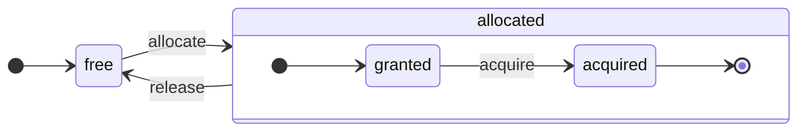

ClickHouse — это по-настоящему столбцовая СУБД. Данные хранятся по столбцам, а во время выполнения обрабатываются массивами (векторами или фрагментами столбцов).
По возможности операции выполняются над массивами, а не над отдельными значениями.
Это называется &quot;vectorized query execution&quot; и помогает снизить затраты на собственно обработку данных.

Эта идея не нова.
Она восходит к `APL` (язык программирования, 1957) и его потомкам: `A +` (диалект APL), `J` (1990), `K` (1993) и `Q` (язык программирования от Kx Systems, 2003).
Программирование с массивами используется при научной обработке данных. Для реляционных баз данных эта идея тоже не нова. Например, она используется в системе `VectorWise` (также известной как Actian Vector Analytic Database от Actian Corporation).

Существуют два разных подхода к ускорению обработки запросов: vectorized query execution и runtime code generation. Последний устраняет все уровни косвенности и динамическую диспетчеризацию. Ни один из этих подходов не является однозначно лучше другого. Runtime code generation может быть эффективнее, когда объединяет много операций, тем самым полностью задействуя исполнительные блоки CPU и конвейер. Vectorized query execution может быть менее практичным, поскольку использует временные векторы, которые необходимо записывать в кэш и затем считывать обратно. Если временные данные не помещаются в кэш L2, это становится проблемой. Зато vectorized query execution проще использует SIMD-возможности CPU. [Исследовательская статья](http://15721.courses.cs.cmu.edu/spring2016/papers/p5-sompolski.pdf), написанная нашими друзьями, показывает, что лучше сочетать оба подхода. ClickHouse использует vectorized query execution и имеет ограниченную начальную поддержку runtime code generation.

  ## Столбцы

Интерфейс `IColumn` используется для представления столбцов в памяти (точнее, фрагментов столбцов). Этот интерфейс предоставляет вспомогательные методы для реализации различных реляционных операторов. Почти все операции здесь не изменяют исходный столбец, а создают новый, изменённый. Например, метод `IColumn :: filter` принимает байтовую маску фильтрации. Он используется для реляционных операторов `WHERE` и `HAVING`. Ещё примеры: метод `IColumn :: permute` для поддержки `ORDER BY`, метод `IColumn :: cut` для поддержки `LIMIT`.

Различные реализации `IColumn` (`ColumnUInt8`, `ColumnString` и так далее) отвечают за структуру столбцов в памяти. Обычно данные в памяти представлены в виде непрерывного массива. Для столбцов целочисленного типа это просто один непрерывный массив, как `std :: vector`. Для столбцов `String` и `Array` это два вектора: один для всех элементов массива, расположенных подряд, и второй — для смещений к началу каждого массива. Также существует `ColumnConst`, который хранит в памяти только одно значение, но выглядит как столбец.

  ## Field

Тем не менее, можно работать и с отдельными значениями. Для представления отдельного значения используется `Field`. `Field` — это просто дискриминированное объединение из `UInt64`, `Int64`, `Float64`, `String` и `Array`. У `IColumn` есть метод `operator []`, позволяющий получить n-е значение в виде `Field`, и метод `insert`, позволяющий добавить `Field` в конец столбца. Эти методы не очень эффективны, поскольку требуют работы с временными объектами `Field`, представляющими отдельное значение. Есть и более эффективные методы, такие как `insertFrom`, `insertRangeFrom` и другие.

`Field` не содержит достаточно информации о конкретном типе данных таблицы. Например, `UInt8`, `UInt16`, `UInt32` и `UInt64` в `Field` все представлены как `UInt64`.

  ## Протекающие абстракции

`IColumn` содержит методы для распространённых реляционных преобразований данных, но они покрывают не все потребности. Например, у `ColumnUInt64` нет метода для вычисления суммы двух столбцов, а у `ColumnString` — метода для поиска подстроки. Эти многочисленные процедуры реализуются вне `IColumn`.

Различные операции над столбцами можно реализовать либо обобщённым, но неэффективным способом — с помощью методов `IColumn`, извлекающих значения `Field`, — либо специализированным способом, опираясь на знание внутренней структуры памяти данных в конкретной реализации `IColumn`. Для этого объект приводят к конкретному типу `IColumn` и напрямую работают с его внутренним представлением. Например, у `ColumnUInt64` есть метод `getData`, который возвращает ссылку на внутренний массив, после чего отдельная процедура читает этот массив или заполняет его напрямую. «Протекающие абстракции» нужны нам для того, чтобы можно было эффективно специализировать различные процедуры.

  ## Типы данных

`IDataType` отвечает за сериализацию и десериализацию: чтение и запись фрагментов столбцов или отдельных значений в бинарной или текстовой форме. `IDataType` напрямую соответствует типам данных в таблицах. Например, существуют `DataTypeUInt32`, `DataTypeDateTime`, `DataTypeString` и так далее.

`IDataType` и `IColumn` лишь слабо связаны друг с другом. Разные типы данных могут быть представлены в памяти одними и теми же реализациями `IColumn`. Например, `DataTypeUInt32` и `DataTypeDateTime` представлены с помощью `ColumnUInt32` или `ColumnConstUInt32`. Кроме того, один и тот же тип данных может быть представлен разными реализациями `IColumn`. Например, `DataTypeUInt8` может быть представлен `ColumnUInt8` или `ColumnConstUInt8`.

`IDataType` хранит только метаданные. Например, `DataTypeUInt8` вообще ничего не хранит (кроме virtual-указателя `vptr`), а `DataTypeFixedString` хранит только `N` (размер строк фиксированной длины).

`IDataType` содержит вспомогательные методы для различных форматов данных. Например, методы для сериализации значения с возможным экранированием, для сериализации значения в JSON и для сериализации значения как части формата XML. Прямого соответствия форматам данных нет. Например, разные форматы данных `Pretty` и `TabSeparated` могут использовать один и тот же вспомогательный метод `serializeTextEscaped` из интерфейса `IDataType`.

  ## Block

`Block` — это контейнер, представляющий подмножество (фрагмент) таблицы в памяти. По сути, это просто набор троек: `(IColumn, IDataType, column name)`. Во время выполнения запроса данные обрабатываются в `Block`. Если у нас есть `Block`, значит, у нас есть данные (в объекте `IColumn`), есть информация об их типе (в `IDataType`), которая подсказывает, как работать с этим столбцом, и есть имя столбца. Это может быть как исходное имя столбца из таблицы, так и некоторое искусственное имя, присвоенное для получения временных результатов вычислений.

Когда мы вычисляем какую-либо функцию по столбцам в блоке, мы добавляем в блок ещё один столбец с её результатом и не затрагиваем столбцы, выступающие аргументами функции, поскольку операции неизменяемы. Позже ненужные столбцы можно удалить из блока, но не изменять. Это удобно для устранения общих подвыражений.

Блоки создаются для каждого обрабатываемого фрагмента данных. Обратите внимание, что для одного и того же типа вычислений имена и типы столбцов остаются одинаковыми в разных блоках, а меняются только данные столбцов. Лучше отделить данные блока от заголовка блока, потому что небольшой размер блоков приводит к высоким накладным расходам из-за временных строк при копировании shared&#95;ptr и имён столбцов.

  ## Процессоры

См. описание: [https://github.com/ClickHouse/ClickHouse/blob/master/src/Processors/IProcessor.h](https://github.com/ClickHouse/ClickHouse/blob/master/src/Processors/IProcessor.h).

  ## Форматы

Форматы данных реализуются с помощью процессоров.

  ## I/O

Для побайтового ввода/вывода используются абстрактные классы `ReadBuffer` и `WriteBuffer`. Они применяются вместо C++ `iostream`. Не беспокойтесь: в любом зрелом C++-проекте по веским причинам используют что-то другое, а не `iostream`.

`ReadBuffer` и `WriteBuffer` — это просто непрерывный буфер и курсор, указывающий на позицию в этом буфере. Реализации могут как владеть, так и не владеть памятью буфера. Есть виртуальный метод для заполнения буфера следующей порцией данных (для `ReadBuffer`) или для сброса буфера куда-либо (для `WriteBuffer`). Эти виртуальные методы вызываются редко.

Реализации `ReadBuffer`/`WriteBuffer` используются для работы с файлами, файловыми дескрипторами и сетевыми сокетами, для реализации сжатия (`CompressedWriteBuffer` инициализируется другим `WriteBuffer` и выполняет сжатие перед записью данных в него), а также для других целей — названия `ConcatReadBuffer`, `LimitReadBuffer` и `HashingWriteBuffer` говорят сами за себя.

Read/WriteBuffer работают только с байтами. В заголовочных файлах `ReadHelpers` и `WriteHelpers` есть функции, помогающие с форматированием ввода/вывода. Например, есть вспомогательные функции для записи числа в десятичном формате.

Давайте разберем, что происходит, когда нужно записать результирующий набор в формате `JSON` в stdout.
У вас есть результирующий набор, готовый к извлечению из pulling `QueryPipeline`.
Сначала вы создаете `WriteBufferFromFileDescriptor(STDOUT_FILENO)`, чтобы записывать байты в stdout.
Затем вы подключаете результат из конвейера запросов к `JSONRowOutputFormat`, который инициализируется этим `WriteBuffer`, чтобы записывать строки в формате `JSON` в stdout.
Это можно сделать с помощью метода `complete`, который превращает pulling `QueryPipeline` в completed `QueryPipeline`.
Внутри `JSONRowOutputFormat` будет записывать различные JSON-разделители и вызывать метод `IDataType::serializeTextJSON`, передавая ссылку на `IColumn` и номер строки в качестве аргументов. В результате `IDataType::serializeTextJSON` вызовет метод из `WriteHelpers.h`: например, `writeText` для числовых типов и `writeJSONString` для `DataTypeString`.

  ## Таблицы

Интерфейс `IStorage` представляет таблицы. Разные реализации этого интерфейса соответствуют разным движкам таблиц. Например, `StorageMergeTree`, `StorageMemory` и так далее. Экземпляры этих классов — это и есть таблицы.

Ключевые методы в `IStorage` — `read` и `write`, а также другие, такие как `alter`, `rename` и `drop`. Метод `read` принимает следующие аргументы: набор столбцов для чтения из таблицы, `AST` запроса, который нужно учитывать, и требуемое количество потоков. Он возвращает `Pipe`.

В большинстве случаев метод `read` отвечает только за чтение указанных столбцов из таблицы, но не за дальнейшую обработку данных.
Вся последующая обработка данных выполняется другой частью конвейера и не входит в зону ответственности `IStorage`.

Но есть важные исключения:

* `AST` запроса передаётся в метод `read`, и движок таблицы может использовать его, чтобы определить, как задействовать индексы, и прочитать меньше данных из таблицы.
* Иногда движок таблицы может сам обработать данные до определённой стадии. Например, `StorageDistributed` может отправить запрос на удалённые серверы, попросить их обработать данные до стадии, на которой данные с разных удалённых серверов можно объединить, и вернуть эти предварительно обработанные данные. Затем интерпретатор запросов завершает обработку данных.

Метод `read` таблицы может возвращать `Pipe`, состоящий из нескольких `процессоров`. Эти `процессоры` могут читать данные из таблицы параллельно.
Затем эти процессоры можно соединить с различными другими преобразованиями (например, вычислением выражений или фильтрацией), которые могут выполняться независимо.
После этого поверх них можно создать `QueryPipeline` и выполнить его через `PipelineExecutor`.

Также существуют `TableFunction`. Это функции, которые возвращают временный объект `IStorage` для использования в предложении `FROM` запроса.

Чтобы быстро понять, как реализовать свой движок таблицы, посмотрите на что-нибудь простое, например `StorageMemory` или `StorageTinyLog`.

> В результате вызова метода `read` `IStorage` возвращает `QueryProcessingStage` — информацию о том, какие части запроса уже были вычислены внутри хранилища.

  ## Парсеры

Написанный вручную рекурсивный нисходящий парсер разбирает запрос. Например, `ParserSelectQuery` просто рекурсивно вызывает соответствующие парсеры для различных частей запроса. Парсеры создают `AST`. `AST` представлен узлами, которые являются экземплярами `IAST`.

> Генераторы парсеров не используются по историческим причинам.

  ## Интерпретаторы

Интерпретаторы отвечают за создание конвейера выполнения запроса из AST. Существуют простые интерпретаторы, такие как `InterpreterExistsQuery` и `InterpreterDropQuery`, а также более сложный `InterpreterSelectQuery`.

Конвейер выполнения запроса — это набор процессоров, которые могут потреблять и производить фрагменты (наборы столбцов с определёнными типами).
Процессор взаимодействует через порты и может иметь несколько входных и несколько выходных портов.
Более подробное описание можно найти в [src/Processors/IProcessor.h](https://github.com/ClickHouse/ClickHouse/blob/master/src/Processors/IProcessor.h).

Например, результатом интерпретации запроса `SELECT` является `QueryPipeline` в режиме &quot;pulling&quot;, у которого есть специальный выходной порт для чтения результирующего набора.
Результатом запроса `INSERT` является `QueryPipeline` в режиме &quot;pushing&quot; с входным портом для записи данных на вставку.
А результатом интерпретации запроса `INSERT SELECT` является &quot;completed&quot; `QueryPipeline`, у которого нет ни входов, ни выходов, но который одновременно копирует данные из `SELECT` в `INSERT`.

`InterpreterSelectQuery` использует механизмы `ExpressionAnalyzer` и `ExpressionActions` для анализа запроса и преобразований. Именно здесь выполняется большая часть оптимизаций запроса на основе правил. `ExpressionAnalyzer` довольно запутан и должен быть переписан: различные преобразования и оптимизации запроса следует вынести в отдельные классы, чтобы обеспечить модульность преобразований запроса.

Чтобы устранить проблемы, существующие в интерпретаторах, был разработан новый `InterpreterSelectQueryAnalyzer`. Это новая версия `InterpreterSelectQuery`, которая не использует `ExpressionAnalyzer` и вводит дополнительный уровень абстракции между `AST` и `QueryPipeline`, называемый `QueryTree`. Он полностью готов к использованию в продакшн, но на всякий случай его можно отключить, установив значение настройки `enable_analyzer` в `false`.

  ## Функции

Существуют обычные и агрегатные функции. Об агрегатных функциях см. в следующем разделе.

Обычные функции не изменяют количество строк — они работают так, как если бы обрабатывали каждую строку независимо. На самом деле функции вызываются не для отдельных строк, а для `Block` данных, что позволяет реализовать векторизованное выполнение запросов.

Есть несколько специальных функций, таких как [blockSize](/ru/sql-reference/functions/other-functions#blockSize), [rowNumberInBlock](/ru/sql-reference/functions/other-functions#rowNumberInBlock) и [runningAccumulate](/ru/sql-reference/functions/other-functions#runningAccumulate), которые используют обработку блоков и тем самым нарушают независимость строк.

В ClickHouse строгая типизация, поэтому неявного преобразования типов нет. Если функция не поддерживает конкретную комбинацию типов, она генерирует исключение. Однако функции могут работать (то есть быть перегруженными) с множеством разных комбинаций типов. Например, функция `plus` (реализующая оператор `+`) работает с любой комбинацией числовых типов: `UInt8` + `Float32`, `UInt16` + `Int8` и так далее. Кроме того, некоторые вариадические функции могут принимать любое количество аргументов, например функция `concat`.

Реализация функции может быть несколько неудобной, поскольку в ней нужно явно выполнять диспетчеризацию по поддерживаемым типам данных и поддерживаемым `IColumns`. Например, для функции `plus` код генерируется инстанцированием шаблона C++ для каждой комбинации числовых типов, а также для случаев, когда левый и правый аргументы являются константными или неконстантными.

Это отличное место для реализации генерации кода во время выполнения, чтобы избежать разрастания шаблонного кода. Кроме того, это позволяет добавлять составные операции, такие как fused multiply-add, или выполнять несколько сравнений за одну итерацию цикла.

Из-за векторизованного выполнения запросов для функций не применяется короткое замыкание. Например, если написать `WHERE f(x) AND g(y)`, вычисляются обе части, даже для строк, где `f(x)` равно нулю (кроме случая, когда `f(x)` — константное выражение, равное нулю). Но если селективность условия `f(x)` высока, а вычисление `f(x)` значительно дешевле, чем `g(y)`, лучше реализовать многопроходное вычисление. Сначала вычисляется `f(x)`, затем столбцы фильтруются по результату, и только после этого `g(y)` вычисляется лишь для меньших, отфильтрованных фрагментов данных.

  ## Агрегатные функции

Агрегатные функции — это функции с сохранением состояния. Они накапливают переданные значения в некотором состоянии и позволяют получать из него результат. Ими управляют через интерфейс `IAggregateFunction`. Состояния могут быть довольно простыми (состояние для `AggregateFunctionCount` — это всего лишь одно значение `UInt64`) или весьма сложными (состояние `AggregateFunctionUniqCombined` представляет собой комбинацию линейного массива, хеш-таблицы и вероятностной структуры данных `HyperLogLog`).

Состояния размещаются в `Arena` (пуле памяти), чтобы можно было работать со множеством состояний при выполнении запроса `GROUP BY` с высокой кардинальностью. У состояний могут быть нетривиальные конструктор и деструктор: например, сложные состояния агрегации могут сами выделять дополнительную память. Поэтому нужно внимательно подходить к созданию и уничтожению состояний, а также к корректной передаче владения ими и порядку их уничтожения.

Состояния агрегации можно сериализовать и десериализовать для передачи по сети во время выполнения распределённого запроса или для записи на диск, когда оперативной памяти недостаточно. Их даже можно хранить в таблице с `DataTypeAggregateFunction`, чтобы обеспечить инкрементальную агрегацию данных.

> Сериализованный формат данных для состояний агрегатных функций сейчас не версионируется. Это нормально, если состояния агрегатных функций хранятся только временно. Но у нас есть движок таблицы `AggregatingMergeTree` для инкрементальной агрегации, и его уже используют в продакшне. Именно поэтому при любом будущем изменении сериализованного формата любой агрегатной функции требуется обратная совместимость.

  ## Сервер

Сервер реализует несколько разных интерфейсов:

* HTTP-интерфейс для любых внешних клиентов.
* TCP-интерфейс для нативного клиента ClickHouse и межсерверного взаимодействия при выполнении распределённого запроса.
* Интерфейс для передачи данных при репликации.

Внутренне это просто примитивный многопоточный сервер без сопрограмм и файберов. Сервер рассчитан не на обработку большого потока простых запросов, а на обработку сравнительно небольшого потока сложных запросов, при этом каждый такой запрос может обрабатывать огромные объёмы данных для аналитики.

Сервер инициализирует класс `Context`, предоставляя необходимое окружение для выполнения запроса: список доступных баз данных, пользователей и прав доступа, настройки, кластеры, список процессов, журнал запросов и так далее. Это окружение используют интерпретаторы.

Мы поддерживаем полную обратную и прямую совместимость TCP-протокола сервера: старые клиенты могут работать с новыми серверами, а новые клиенты — со старыми. Но мы не хотим поддерживать это вечно и убираем поддержку старых версий примерно через год.

:::note
Для большинства внешних приложений мы рекомендуем использовать HTTP-интерфейс, потому что он прост и удобен. TCP-протокол теснее связан с внутренними структурами данных: он использует внутренний формат для передачи блоков данных и собственный механизм фрейминга для сжатых данных.
:::

  ## Конфигурация

ClickHouse Server основан на библиотеках POCO C++ и использует `Poco::Util::AbstractConfiguration` для представления своей конфигурации. Конфигурация хранится в классе `Poco::Util::ServerApplication`, от которого наследуется класс `DaemonBase`, а от него, в свою очередь, — класс `DB::Server`, реализующий сам `clickhouse-server`. Поэтому доступ к конфигурации можно получить с помощью метода `ServerApplication::config()`.

Конфигурация считывается из нескольких файлов (в формате XML или YAML) и объединяется в единый объект `AbstractConfiguration` классом `ConfigProcessor`. Конфигурация загружается при запуске сервера и впоследствии может быть перезагружена, если один из файлов конфигурации был обновлён, удалён или добавлен. Класс `ConfigReloader` также отвечает за периодический мониторинг этих изменений и за процедуру перезагрузки. Запрос `SYSTEM RELOAD CONFIG` тоже запускает перезагрузку конфигурации.

Для запросов и подсистем, отличных от `Server`, доступ к конфигурации можно получить с помощью метода `Context::getConfigRef()`. Каждая подсистема, способная перезагружать свою конфигурацию без перезапуска сервера, должна зарегистрироваться в callback-функции перезагрузки в методе `Server::main()`. Обратите внимание: если в новой конфигурации есть ошибка, большинство подсистем проигнорируют новую конфигурацию, запишут предупреждения в журнал и продолжат работать с ранее загруженной конфигурацией. Из-за особенностей `AbstractConfiguration` невозможно передать ссылку на конкретный раздел, поэтому вместо этого обычно используется `String config_prefix`.

  ### Контекст

ClickHouse управляет настройками с помощью иерархии контекстов:

* **Глобальный контекст** - общесерверные настройки, заданные через файлы конфигурации
* **Контекст сеанса** - настройки пользовательского сеанса из профилей, конфигурации пользователя и команд SET
* **Контекст запроса** - настройки уровня запроса из предложения `SETTINGS`
* **Фоновый контекст** - общесерверные настройки для фоновых операций (Mutate, Merge), заданные через профиль &#39;background&#39;

При планировании операции (запроса, мутации и т. д.) сервер формирует соответствующий контекст, объединяя настройки в следующем порядке (последующие пункты переопределяют предыдущие):

1. Глобальные значения по умолчанию
2. Глобальная конфигурация
3. Настройки профиля (из раздела `<profiles>`)
4. Пользовательские настройки (из раздела `<users>`)
5. Настройки сеанса (из команды SET)
6. Настройки запроса (из предложения `SETTINGS`)

:::note
Фоновые операции можно настраивать через глобальные настройки и настройки профиля &#39;background&#39;; настройки сеанса и запроса в этом случае не применяются. Если явная конфигурация не задана, настройки будут унаследованы из глобального контекста. Имя профиля по умолчанию для таких операций — &#39;background&#39;; его можно переопределить с помощью настройки сервера `background_profile`.
:::

  ## Потоки и задачи

Для выполнения запросов и побочных операций ClickHouse выделяет потоки из одного из пулов потоков, чтобы избежать частого создания и уничтожения потоков. Существует несколько пулов потоков, выбор которых зависит от назначения и структуры задачи:

* Пул сервера для входящих клиентских сеансов.
* Global thread pool для задач общего назначения, фоновых операций и автономных потоков.
* IO thread pool для задач, которые в основном блокируются на операциях IO и не создают высокой нагрузки на CPU.
* Фоновые пулы для периодических задач.
* Пулы для вытесняемых задач, которые можно разбить на шаги.

Пул сервера — это экземпляр класса `Poco::ThreadPool`, определённый в методе `Server::main()`. В нём может быть не более `max_connection` потоков. Каждый поток закрепляется за одним активным соединением.

Global thread pool — это singleton класса `GlobalThreadPool`. Для выделения потока из него используется `ThreadFromGlobalPool`. У него интерфейс, аналогичный `std::thread`, но он берёт поток из глобального пула и выполняет всю необходимую инициализацию. Он настраивается следующими параметрами:

* `max_thread_pool_size` - ограничение на количество потоков в пуле.
* `max_thread_pool_free_size` - ограничение на количество простаивающих потоков, ожидающих новые задачи.
* `thread_pool_queue_size` - ограничение на количество запланированных задач.

Глобальный пул универсален, и все описанные ниже пулы реализованы поверх него. Это можно рассматривать как иерархию пулов. Любой специализированный пул получает свои потоки из глобального пула с помощью класса `ThreadPool`. Поэтому основное назначение любого специализированного пула — ограничивать число одновременно выполняемых задач и планировать их выполнение. Если задач запланировано больше, чем потоков в пуле, `ThreadPool` накапливает задачи в очереди с приоритетами. У каждой задачи есть целочисленный приоритет. Приоритет по умолчанию — ноль. Все задачи с более высоким значением приоритета запускаются раньше любых задач с более низким приоритетом. Но между уже выполняющимися задачами различий нет, поэтому приоритет имеет значение только тогда, когда пул перегружен.

IO thread pool реализован как обычный `ThreadPool`, доступный через метод `IOThreadPool::get()`. Он настраивается так же, как и глобальный пул, с помощью параметров `max_io_thread_pool_size`, `max_io_thread_pool_free_size` и `io_thread_pool_queue_size`. Основное назначение IO thread pool — не допустить исчерпания глобального пула задачами IO, что могло бы помешать запросам в полной мере использовать CPU. Backup в S3 выполняет значительный объём операций IO, и чтобы избежать влияния на интерактивные запросы, существует отдельный `BackupsIOThreadPool`, настраиваемый параметрами `max_backups_io_thread_pool_size`, `max_backups_io_thread_pool_free_size` и `backups_io_thread_pool_queue_size`.

Для выполнения периодических задач существует класс `BackgroundSchedulePool`. Вы можете регистрировать задачи с помощью объектов `BackgroundSchedulePool::TaskHolder`, и пул гарантирует, что одна задача не будет одновременно запускать две работы. Он также позволяет отложить выполнение задачи до определённого момента в будущем или временно деактивировать её. Глобальный `Context` предоставляет несколько экземпляров этого класса для разных целей. Для задач общего назначения используется `Context::getSchedulePool()`.

Также существуют специализированные пулы потоков для вытесняемых задач. Такую задачу `IExecutableTask` можно разбить на упорядоченную последовательность заданий, называемых шагами. Для планирования таких задач так, чтобы короткие задачи получали приоритет перед длинными, используется `MergeTreeBackgroundExecutor`. Как следует из названия, он применяется для фоновых операций, связанных с MergeTree, таких как слияния, Мутации, загрузка и перемещения. Экземпляры пулов доступны через `Context::getCommonExecutor()` и другие аналогичные методы.

Независимо от того, какой пул используется для задачи, при её запуске создаётся экземпляр `ThreadStatus`. Он инкапсулирует всю информацию на уровне потока: идентификатор потока, идентификатор запроса, счётчики производительности, потребление ресурсов и множество других полезных данных. Задача может получить к нему доступ через указатель локального хранилища потока с помощью вызова `CurrentThread::get()`, поэтому его не нужно передавать в каждую функцию.

Если поток связан с выполнением запроса, то самое важное, что прикрепляется к `ThreadStatus`, — это контекст запроса `ContextPtr`. У каждого запроса есть свой главный поток в пуле сервера. Главный поток выполняет это присоединение, удерживая объект `ThreadStatus::QueryScope query_scope(query_context)`. Главный поток также создаёт группу потоков, представленную объектом `ThreadGroupStatus`. Каждый дополнительный поток, выделяемый во время выполнения этого запроса, присоединяется к своей группе потоков вызовом `CurrentThread::attachTo(thread_group)`. Группы потоков используются для агрегирования счётчиков событий профиля и отслеживания потребления памяти всеми потоками, выделенными для одной задачи (см. классы `MemoryTracker` и `ProfileEvents::Counters` для получения дополнительной информации).

  ## Контроль параллелизма

Запрос, который можно выполнять параллельно, использует настройку `max_threads` для ограничения числа потоков. Значение по умолчанию для этой настройки подбирается так, чтобы один запрос мог максимально эффективно задействовать все ядра CPU. Но что, если одновременно выполняется несколько запросов и каждый из них использует значение `max_threads` по умолчанию? В этом случае запросы будут делить ресурсы CPU между собой. ОС обеспечит справедливое распределение, постоянно переключая потоки, что приводит к некоторым потерям производительности. `ConcurrencyControl` помогает уменьшить эти потери и избежать выделения слишком большого числа потоков. Параметр конфигурации `concurrent_threads_soft_limit_num` используется, чтобы ограничить количество параллельных потоков, которые могут быть выделены до применения некоторого уровня давления на CPU.

Вводится понятие CPU `slot`. Слот — это единица параллелизма: чтобы запустить поток, запрос должен заранее получить слот и освободить его, когда поток завершит работу. Общее количество слотов на сервере глобально ограничено. Если суммарная потребность превышает общее число слотов, несколько одновременно выполняющихся запросов начинают конкурировать за слоты CPU. `ConcurrencyControl` отвечает за разрешение этой конкуренции, справедливо планируя распределение слотов CPU.

Каждый слот можно рассматривать как независимую машину состояний со следующими состояниями:

* `free`: слот доступен для выделения любому запросу.
* `granted`: слот `allocated` для конкретного запроса, но ещё не захвачен ни одним потоком.
* `acquired`: слот `allocated` для конкретного запроса и захвачен потоком.

Обратите внимание, что слот `allocated` может находиться в двух разных состояниях: `granted` и `acquired`. Первое — это переходное состояние, и на практике оно должно быть коротким (от момента выделения слота запросу до момента, когда любой поток этого запроса запускает процедуру масштабирования вверх).

API `ConcurrencyControl` состоит из следующих функций:

1. Создать выделение ресурсов для запроса: `auto slots = ConcurrencyControl::instance().allocate(1, max_threads);`. Будет выделен как минимум 1 и как максимум `max_threads` слотов. Обратите внимание, что первый слот выдаётся немедленно, а остальные слоты могут быть выданы позже. Таким образом, это мягкое ограничение, поскольку каждый запрос получит как минимум один поток.
2. Для каждого потока нужно получить слот из выделения: `while (auto slot = slots->tryAcquire()) spawnThread([slot = std::move(slot)] { ... });`.
3. Обновить общее количество слотов: `ConcurrencyControl::setMaxConcurrency(concurrent_threads_soft_limit_num)`. Это можно сделать во время выполнения, без перезапуска сервера.

Этот API позволяет запросам запускаться как минимум с одним потоком (при высокой нагрузке на CPU), а затем масштабироваться до `max_threads`.

  ## Выполнение распределённого запроса

Серверы в конфигурации кластера по большей части независимы. Вы можете создать таблицу `Distributed` на одном или на всех серверах кластера. Таблица `Distributed` сама не хранит данные — она лишь предоставляет «представление» ко всем локальным таблицам на нескольких узлах кластера. Когда вы выполняете SELECT из таблицы `Distributed`, она переписывает этот запрос, выбирает удалённые узлы в соответствии с настройками балансировки нагрузки и отправляет им запрос. Таблица `Distributed` запрашивает у удалённых серверов обработку запроса лишь до той стадии, на которой промежуточные результаты с разных серверов можно объединить. Затем она получает промежуточные результаты и объединяет их. таблица `Distributed` старается передать как можно больше работы удалённым серверам и не пересылать по сети много промежуточных данных.

Всё становится сложнее, когда у вас есть подзапросы в секциях IN или JOIN, и каждый из них использует таблицу `Distributed`. Для выполнения таких запросов у нас есть разные стратегии.

Для выполнения распределённого запроса не существует глобального плана запроса. У каждого узла есть свой локальный план запроса для своей части задачи. У нас есть только простое одноэтапное выполнение распределённого запроса: мы отправляем запросы на удалённые узлы, а затем объединяем результаты. Но это неприменимо к сложным запросам с `GROUP BY` высокой кардинальности или с большим объёмом временных данных для JOIN. В таких случаях нам нужно «перераспределять» данные между серверами, а это требует дополнительной координации. ClickHouse не поддерживает такой вид выполнения запросов, и нам ещё предстоит над этим поработать.

  ## Merge tree

`MergeTree` — это семейство движков хранения, поддерживающее индексирование по первичному ключу. Первичный ключ может быть произвольным кортежем столбцов или выражений. Данные в таблице `MergeTree` хранятся в «частях». Каждая часть хранит данные в порядке первичного ключа, поэтому данные упорядочены лексикографически по кортежу первичного ключа. Все столбцы таблицы в этих частях хранятся в отдельных файлах `column.bin`. Файлы состоят из сжатых блоков. Каждый блок обычно содержит от 64 КБ до 1 МБ несжатых данных в зависимости от среднего размера значений. Блоки состоят из значений столбца, расположенных подряд. Значения в каждом столбце идут в одном и том же порядке (этот порядок задаётся первичным ключом), поэтому при обходе нескольких столбцов вы получаете значения соответствующих строк.

Сам первичный ключ является «разреженным». Он адресует не каждую отдельную строку, а только некоторые диапазоны данных. В отдельном файле `primary.idx` хранится значение первичного ключа для каждой N-й строки, где N называется `index_granularity` (обычно N = 8192). Кроме того, для каждого столбца есть файлы `column.mrk` с «метками», которые представляют собой смещения для каждой N-й строки в файле данных. Каждая метка — это пара: смещение в файле до начала сжатого блока и смещение в распакованном блоке до начала данных. Обычно сжатые блоки выровнены по меткам, и смещение в распакованном блоке равно нулю. Данные `primary.idx` всегда находятся в памяти, а данные файлов `column.mrk` кэшируются.

Когда нужно что-то прочитать из части в `MergeTree`, мы смотрим на данные `primary.idx` и определяем диапазоны, которые могут содержать запрошенные данные, затем смотрим на данные `column.mrk` и вычисляем смещения, с которых нужно начинать чтение этих диапазонов. Из-за разреженности могут читаться лишние данные. ClickHouse не подходит для высокой нагрузки простыми точечными запросами, потому что для каждого ключа нужно прочитать весь диапазон из `index_granularity` строк, а для каждого столбца — распаковать весь сжатый блок. Мы сделали индекс разреженным, потому что должны иметь возможность поддерживать триллионы строк на одном сервере без заметного расхода памяти на индекс. Кроме того, поскольку первичный ключ разреженный, он не является уникальным: во время INSERT по нему нельзя проверить существование ключа в таблице. В таблице может быть много строк с одинаковым ключом.

Когда вы выполняете `INSERT` набора данных в `MergeTree`, этот набор сортируется по первичному ключу и образует новую часть. Фоновые потоки периодически выбирают несколько частей и сливают их в одну отсортированную часть, чтобы количество частей оставалось относительно небольшим. Именно поэтому он называется `MergeTree`. Разумеется, слияние приводит к «усилению записи». Все части неизменяемы: они только создаются и удаляются, но не изменяются. Когда выполняется SELECT, он удерживает снимок таблицы (набор частей). После слияния мы также некоторое время храним старые части, чтобы упростить восстановление после сбоя, поэтому, если мы видим, что какая-то слитая часть, вероятно, повреждена, мы можем заменить её исходными частями.

`MergeTree` не является LSM-деревом, потому что не содержит MEMTABLE и LOG: вставленные данные записываются непосредственно в файловую систему. Такое поведение делает MergeTree гораздо более подходящим для вставки данных батчами. Поэтому частая вставка небольшого количества строк — не лучший сценарий для MergeTree. Например, пара строк в секунду — это нормально, но делать это тысячу раз в секунду для MergeTree не оптимально. Однако для небольших вставок существует режим async insert, позволяющий обойти это ограничение. Мы сделали это так ради простоты, а также потому, что в наших приложениях данные и так вставляются батчами

Существуют движки MergeTree, которые выполняют дополнительную работу во время фоновых слияний. Например, `CollapsingMergeTree` и `AggregatingMergeTree`. Это можно рассматривать как специальную поддержку обновлений. Имейте в виду, что это не настоящие обновления, потому что пользователи обычно не контролируют момент выполнения фоновых слияний, а данные в таблице `MergeTree` почти всегда хранятся более чем в одной части, а не в полностью слитом виде.

  ## Репликация

Репликацию в ClickHouse можно настраивать для каждой таблицы отдельно. На одном и том же сервере могут одновременно быть как реплицируемые, так и нереплицируемые таблицы. Кроме того, таблицы могут реплицироваться по-разному: например, одна таблица — с двукратной репликацией, а другая — с трехкратной.

Репликация реализована в движке таблицы `ReplicatedMergeTree`. Путь в `ZooKeeper` задается как параметр движка хранения. Все таблицы с одинаковым путем в `ZooKeeper` становятся репликами друг друга: они синхронизируют данные и поддерживают согласованность. Реплики можно динамически добавлять и удалять, просто создавая или удаляя таблицу.

Репликация использует асинхронную схему multi-master. Вы можете вставлять данные в любую реплику, у которой есть сеанс с `ZooKeeper`, и данные будут асинхронно реплицированы на все остальные реплики. Поскольку ClickHouse не поддерживает UPDATE, репликация происходит без конфликтов. Так как по умолчанию для вставок не используется подтверждение по кворуму, только что вставленные данные могут быть потеряны при отказе одного из узлов. Кворум вставки можно включить с помощью настройки `insert_quorum`.

Метаданные репликации хранятся в ZooKeeper. Существует журнал репликации, в котором перечислены действия, которые нужно выполнить. Это могут быть: получить часть, слить части, удалить партицию и так далее. Каждая реплика копирует журнал репликации в свою очередь, а затем выполняет действия из очереди. Например, при вставке в журнале создается действие &quot;получить часть&quot;, и каждая реплика загружает эту часть. Слияния координируются между репликами, чтобы получить побайтно идентичный результат. Все части сливаются одинаковым образом на всех репликах. Один из лидеров первым инициирует новое слияние и записывает в журнал действия &quot;слить части&quot;. Несколько реплик (или даже все) могут одновременно быть лидерами. Реплике можно запретить становиться лидером с помощью настройки `merge_tree` `replicated_can_become_leader`. Лидеры отвечают за планирование фоновых слияний.

Репликация является физической: между узлами передаются только сжатые части, а не запросы. В большинстве случаев слияния выполняются на каждой реплике независимо, чтобы снизить сетевые затраты и избежать избыточного сетевого трафика. Крупные слитые части передаются по сети только при значительной задержке репликации.

Кроме того, каждая реплика хранит свое состояние в ZooKeeper как набор частей и их контрольных сумм. Когда состояние в локальной файловой системе расходится с эталонным состоянием в ZooKeeper, реплика восстанавливает согласованность, загружая отсутствующие и поврежденные части с других реплик. Если в локальной файловой системе есть какие-либо неожиданные или поврежденные данные, ClickHouse не удаляет их, а перемещает в отдельный каталог и больше не учитывает.

:::note
Кластер ClickHouse состоит из независимых сегментов, и каждый сегмент состоит из реплик. Кластер **не является эластичным**, поэтому после добавления нового сегмента данные не перебалансируются между сегментами автоматически. Вместо этого приходится мириться с неравномерным распределением нагрузки по кластеру. Такая реализация дает больше контроля и подходит для относительно небольших кластеров, например из десятков узлов. Но для кластеров из сотен узлов, которые мы используем в продакшн, такой подход становится существенным недостатком. Нам следует реализовать движок таблицы, охватывающий весь кластер, с динамически реплицируемыми областями, которые можно автоматически разделять и балансировать между кластерами.
:::