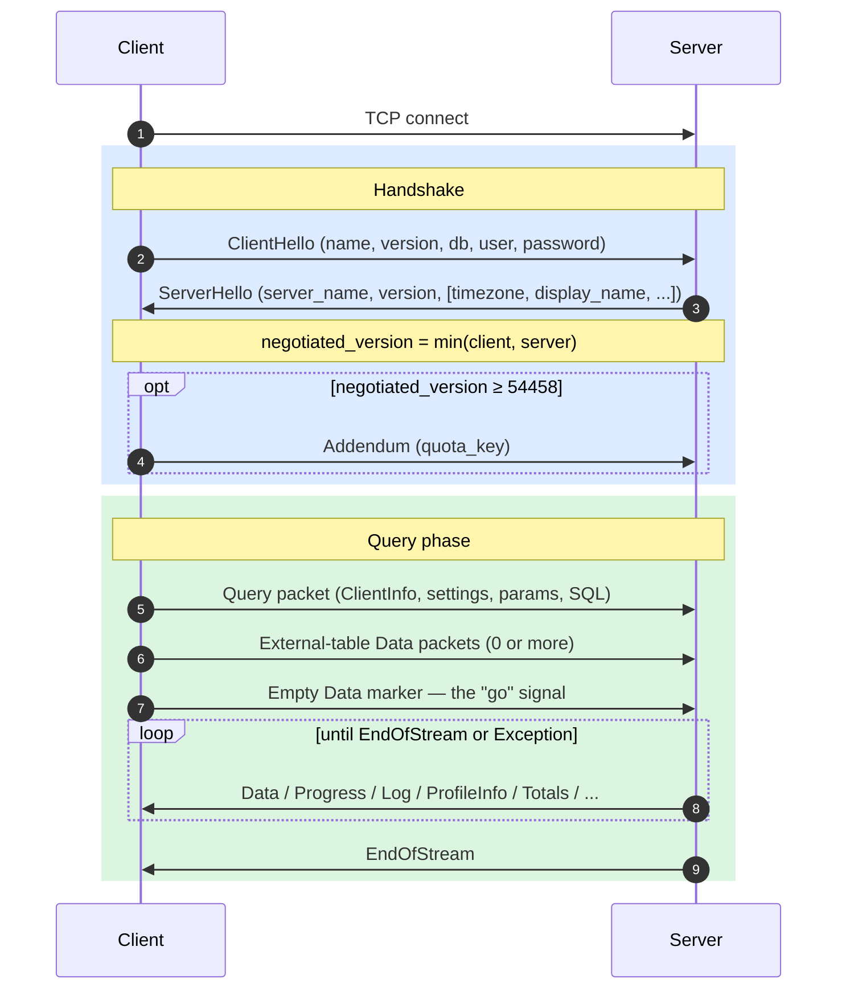
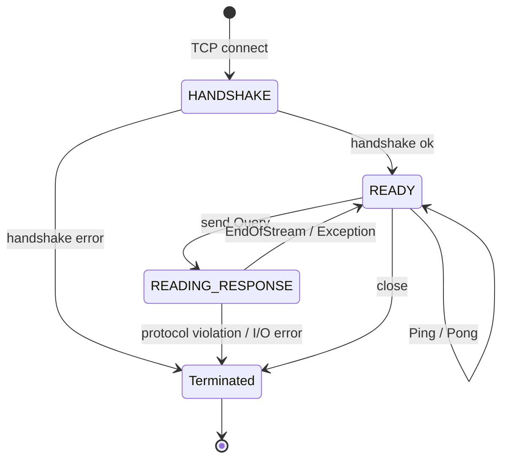
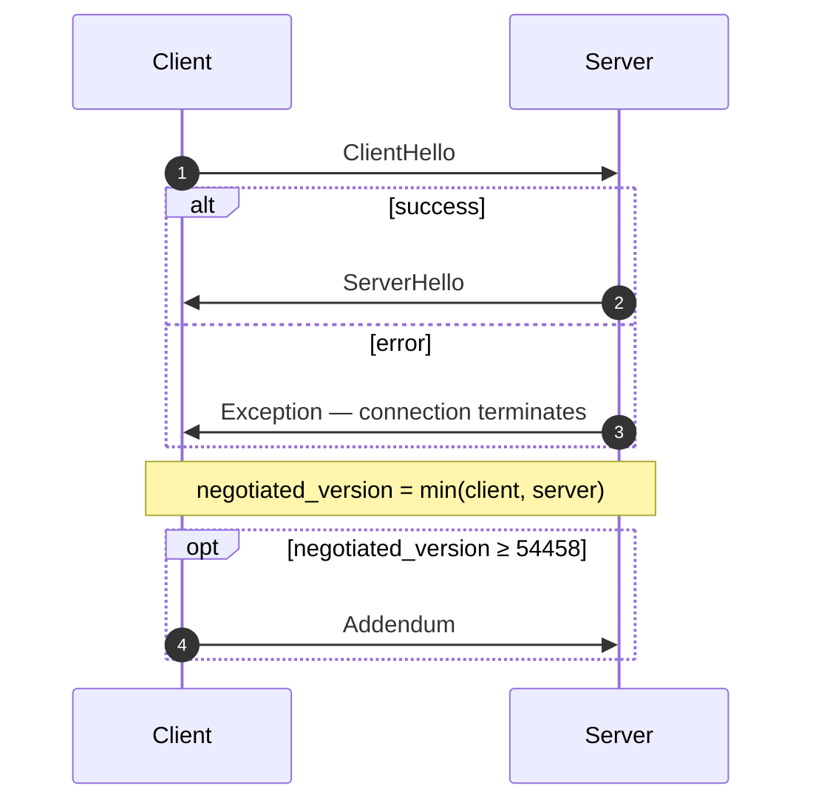
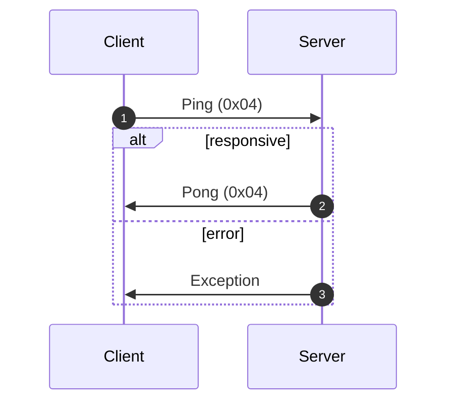
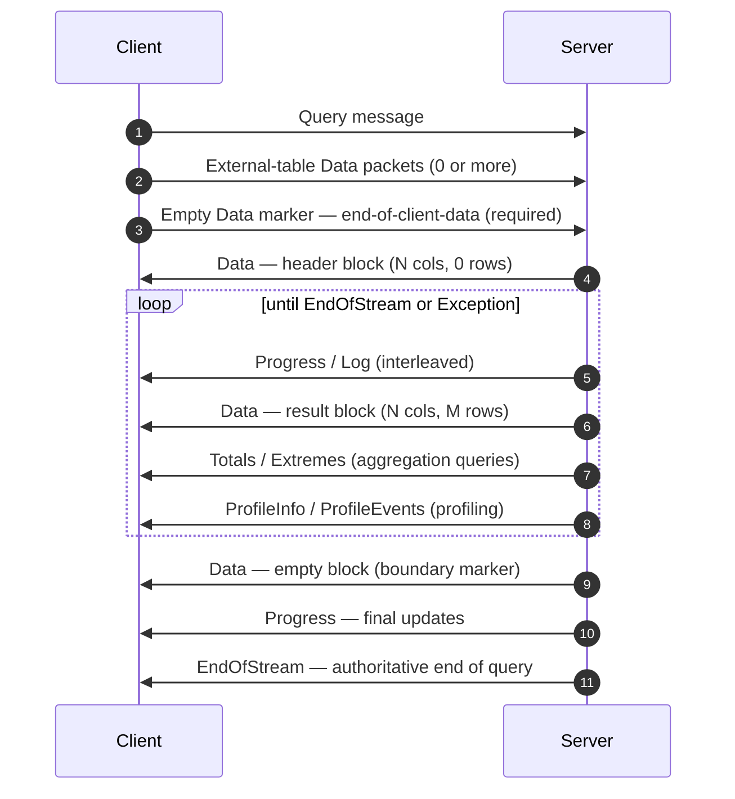
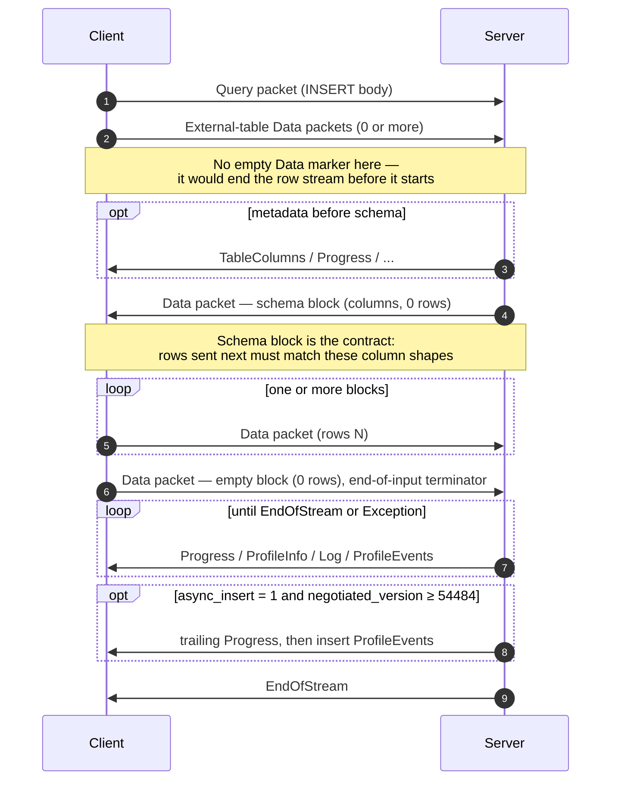
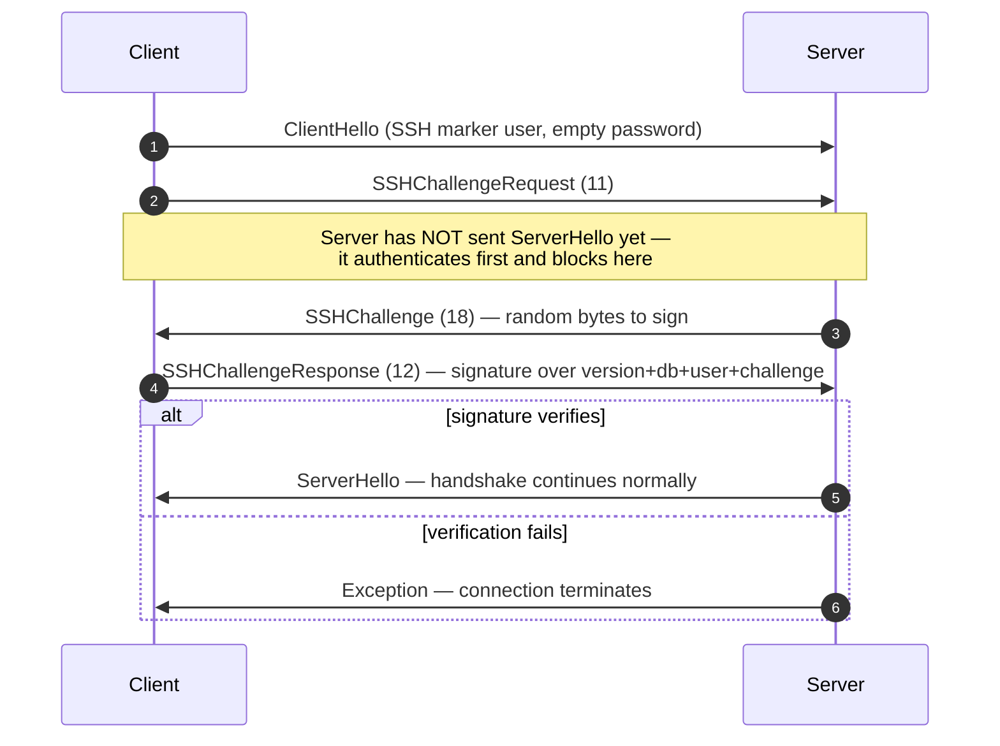

Собственный протокол — это двоичный протокол с установлением соединения, который клиенты и серверы ClickHouse используют поверх TCP. По нему передаются SQL-запросы, данные результатов, полезная нагрузка `INSERT`, телеметрия выполнения и сигналы об ошибках. Именно этот протокол используется в клиенте командной строки, а также в драйверах C++ и большинстве сторонних нативных драйверов.

На этой странице рассматривается сам протокол: структура пакетов, машина состояний соединения, согласование версий и тело каждого сообщения, кроме `Block`. Байты внутри пакетов семейства `Data` (то есть `Block`, его столбцы и кодировки отдельных типов) — отдельная тема, описанная в спецификации [Native Format](/ru/interfaces/specs/NativeFormat).

:::note Сопутствующая спецификация
Эта страница — одна из двух частей и публикуется вместе с сопутствующей спецификацией [Native Format](/ru/interfaces/specs/NativeFormat). Эти две спецификации чётко разделяют зоны ответственности: эта страница посвящена пакетному и транспортному уровням, а спецификация Native Format — байтам внутри пакетов семейства `Data`.
:::

Ниже действуют несколько общих свойств. Протокол двоичный и позиционный: тегов полей нет, за исключением `BlockInfo`, поэтому один смещённый байт нарушает синхронизацию всего, что идёт следом. Протокол работает с сохранением состояния, и каждое TCP-соединение обрабатывает только один запрос за раз — мультиплексирование отсутствует. Целые числа фиксированной ширины используют порядок байтов little-endian.

<div id="overview">
  ## Обзор
</div>

| Свойство          | Значение                                                                   |
| ----------------- | -------------------------------------------------------------------------- |
| Транспорт         | TCP, при необходимости поверх TLS                                          |
| Порядок байтов    | Little-endian для целых чисел фиксированной ширины                         |
| Кодирование       | Бинарное и позиционное (без тегов полей, кроме `BlockInfo`)                |
| Модель соединения | С сохранением состояния, по одному запросу за раз, без мультиплексирования |
| Версионирование   | Согласуется при рукопожатии; отдельные возможности зависят от версии       |
| Формат данных     | [Native Format](/ru/interfaces/specs/NativeFormat) для всех табличных данных  |

Каждое сообщение в протоколе начинается с кода типа пакета `VarUInt`, после которого идет тело, структура которого зависит от этого кода и согласованной версии протокола.

Соединение проходит через три этапа — однократное рукопожатие, затем любое количество обменов `Ping` или `Query`, после чего соединение закрывается:



Собственный TCP-протокол всегда передаёт табличные данные в формате Native, независимо от наличия какого-либо предложения `FORMAT` в SQL. Преобразование в `RowBinary`, `CSV`, `JSON` и так далее — это задача клиента, которая выполняется после декодирования им блоков Native. (HTTP-интерфейс использует другой путь в коде и *учитывает* предложение `FORMAT`; HTTP здесь не рассматривается.)

<div id="security">
  ## Безопасность
</div>

<div id="transport-security">
  ### Защита транспортного уровня (TLS)
</div>

TLS работает на транспортном уровне, ниже уровня протокола. Когда TLS включен, весь TCP-трафик шифруется, а сообщения протокола остаются побайтно идентичными вне зависимости от того, используется TLS или нет.

<div id="authentication">
  ### Аутентификация
</div>

Аутентификация выполняется во время рукопожатия, в сообщении [`ClientHello`](#clienthello). Поля `user` и `password` передаются как строки в открытом виде, поэтому учетные данные при передаче защищает именно шифрование транспортного уровня (TLS).

Аутентификация SSH по схеме challenge-response доступна начиная с версии протокола 54466 — см. [Аутентификация SSH по схеме challenge-response](#ssh-authentication).

<div id="inter-server-secret">
  ### Межсерверный секрет
</div>

Для выполнения распределённого запроса серверы аутентифицируют друг друга, подтверждая знание общего секрета, — не передавая сам секрет по сети. В каждом `Query` в поле 4 [`Query`](#query) передаётся 32-байтный SHA-256 `auth_hash`, вычисленный по salt, nonce, настроенному секрету и запросу; принимающий сервер вычисляет его заново и сравнивает. Это работает только при включённой возможности `INTERSERVER_SECRET` (v54441). Внешние клиенты всегда отправляют здесь пустую строку. См. [Межсерверная аутентификация](#inter-server-authentication).

<div id="versioning-and-feature-gates">
  ## Версионирование и флаги возможностей
</div>

<div id="version-negotiation">
  ### Согласование версии
</div>

И client, и server во время рукопожатия объявляют максимальную поддерживаемую версию протокола. **Согласованная версия** — меньшая из двух:

```text
negotiated_version = min(client_version, server_version)
```

Во всех последующих сообщениях для определения того, какие поля передаются в сериализованном виде, используется согласованная версия.

<div id="feature-gates">
  ### Флаги возможностей
</div>

Возможность определяется версией протокола, в которой она появилась, и считается **активной**, если согласованная версия больше или равна этому номеру.

:::warning
Когда возможность активна, её поля **обязательно** должны присутствовать в передаваемом потоке байтов. Протокол строго позиционный, поэтому пропуск поля, зависящего от флага возможности, нарушает поток байтов для всех последующих полей.
:::

<div id="feature-table">
  ### Таблица возможностей
</div>

| Возможность                                             | Версия | Затрагивает                      | Влияние на формат передачи данных                                                                                                                                                                                                                                                                                                                                                                                                                                                                                                                                                                                                                                                                                                             |
| ------------------------------------------------------- | ------ | -------------------------------- | --------------------------------------------------------------------------------------------------------------------------------------------------------------------------------------------------------------------------------------------------------------------------------------------------------------------------------------------------------------------------------------------------------------------------------------------------------------------------------------------------------------------------------------------------------------------------------------------------------------------------------------------------------------------------------------------------------------------------------------------- |
| BLOCK&#95;INFO                                          | all    | Block                            | Добавляет префикс BlockInfo (`is_overflows`, `bucket_number`) к каждому Block.                                                                                                                                                                                                                                                                                                                                                                                                                                                                                                                                                                                                                                                                |
| CLIENT&#95;INFO                                         | 54032  | Query                            | Добавляет блок ClientInfo в тело Query.                                                                                                                                                                                                                                                                                                                                                                                                                                                                                                                                                                                                                                                                                                       |
| TIMEZONE                                                | 54058  | ServerHello                      | Добавляет поле `timezone` в ServerHello.                                                                                                                                                                                                                                                                                                                                                                                                                                                                                                                                                                                                                                                                                                      |
| QUOTA&#95;KEY&#95;IN&#95;CLIENT&#95;INFO                | 54060  | ClientInfo                       | Добавляет поле `quota_key` в ClientInfo.                                                                                                                                                                                                                                                                                                                                                                                                                                                                                                                                                                                                                                                                                                      |
| DISPLAY&#95;NAME                                        | 54372  | ServerHello                      | Добавляет поле `display_name` в ServerHello.                                                                                                                                                                                                                                                                                                                                                                                                                                                                                                                                                                                                                                                                                                  |
| VERSION&#95;PATCH                                       | 54401  | ServerHello, ClientInfo          | Добавляет поле `version_patch` в оба пакета.                                                                                                                                                                                                                                                                                                                                                                                                                                                                                                                                                                                                                                                                                                  |
| SERVER&#95;LOGS                                         | 54406  | Log                              | Сервер отправляет пакеты Log, когда установлен `send_logs_level`.                                                                                                                                                                                                                                                                                                                                                                                                                                                                                                                                                                                                                                                                             |
| COLUMN&#95;DEFAULTS&#95;METADATA                        | 54410  | TableColumns                     | Сервер может отправлять пакет [`TableColumns`](#tablecolumns) (тип 11) с метаданными значений столбцов по умолчанию перед block схемы INSERT/входных данных. Отправляется только при согласованной версии ≥ 54410 **и** включённом `input_format_defaults_for_omitted_fields`. Для версий ниже этого порога пакет не отправляется никогда; клиенты не должны его ожидать.                                                                                                                                                                                                                                                                                                                                                                     |
| WRITE&#95;CLIENT&#95;INFO                               | 54420  | Progress                         | Добавляет `wrote_rows` и `wrote_bytes` в Прогресс. (Несмотря на название, это **не** управляет блоком ClientInfo — за это отвечает `CLIENT_INFO` (v54032).)                                                                                                                                                                                                                                                                                                                                                                                                                                                                                                                                                                                   |
| SETTINGS&#95;SERIALIZED&#95;AS&#95;STRINGS              | 54429  | Query (кодирование settings)     | Меняет **способ** кодирования всегда присутствующего списка settings; **не** определяет, отправляются ли settings. В v54429+ каждый setting записывается как `(name, flags, value-as-string)`; более старые узлы записывают `(name, type-specific-binary-value)` без flags. См. [Setting](#setting).                                                                                                                                                                                                                                                                                                                                                                                                                                          |
| INTERSERVER&#95;SECRET                                  | 54441  | Query                            | Добавляет в Query межсерверное поле `auth_hash` — salted SHA-256 от секрета кластера, а не сам секрет. Внешние клиенты отправляют пустую строку. См. [Inter-server authentication](#inter-server-authentication).                                                                                                                                                                                                                                                                                                                                                                                                                                                                                                                             |
| OPEN&#95;TELEMETRY                                      | 54442  | ClientInfo                       | Добавляет trace context OpenTelemetry в ClientInfo.                                                                                                                                                                                                                                                                                                                                                                                                                                                                                                                                                                                                                                                                                           |
| DISTRIBUTED&#95;DEPTH                                   | 54448  | ClientInfo                       | Добавляет поле `distributed_depth` в ClientInfo.                                                                                                                                                                                                                                                                                                                                                                                                                                                                                                                                                                                                                                                                                              |
| INITIAL&#95;QUERY&#95;START&#95;TIME                    | 54449  | ClientInfo                       | Добавляет поле `initial_time` (Int64 фиксированной ширины).                                                                                                                                                                                                                                                                                                                                                                                                                                                                                                                                                                                                                                                                                   |
| PROFILE&#95;EVENTS                                      | 54451  | ProfileEvents                    | Сервер отправляет пакеты ProfileEvents во время выполнения запроса.                                                                                                                                                                                                                                                                                                                                                                                                                                                                                                                                                                                                                                                                           |
| PARALLEL&#95;REPLICAS                                   | 54453  | ClientInfo                       | Добавляет в ClientInfo поля координации параллельных реплик.                                                                                                                                                                                                                                                                                                                                                                                                                                                                                                                                                                                                                                                                                  |
| CUSTOM&#95;SERIALIZATION                                | 54454  | Block (Column)                   | Добавляет байт `has_custom_serialization` после строки типа каждого столбца.                                                                                                                                                                                                                                                                                                                                                                                                                                                                                                                                                                                                                                                                  |
| ADDENDUM                                                | 54458  | Handshake                        | Клиент отправляет дополнение (`quota_key`) после обмена рукопожатиями.                                                                                                                                                                                                                                                                                                                                                                                                                                                                                                                                                                                                                                                                        |
| PARAMETERS                                              | 54459  | Query                            | Добавляет список параметров в тело Query.                                                                                                                                                                                                                                                                                                                                                                                                                                                                                                                                                                                                                                                                                                     |
| SERVER&#95;QUERY&#95;TIME&#95;IN&#95;PROGRESS           | 54460  | Progress                         | Добавляет поле `elapsed_ns` в Прогресс.                                                                                                                                                                                                                                                                                                                                                                                                                                                                                                                                                                                                                                                                                                       |
| PASSWORD&#95;COMPLEXITY&#95;RULES                       | 54461  | ServerHello                      | Добавляет в ServerHello список regex-шаблонов политики паролей и человекочитаемых сообщений.                                                                                                                                                                                                                                                                                                                                                                                                                                                                                                                                                                                                                                                  |
| INTERSERVER&#95;SECRET&#95;V2                           | 54462  | ServerHello                      | Добавляет в ServerHello 8-байтовый nonce `UInt64`. Используется для межсерверной подписи запросов; внешние клиенты декодируют его и игнорируют.                                                                                                                                                                                                                                                                                                                                                                                                                                                                                                                                                                                               |
| TOTAL&#95;BYTES&#95;IN&#95;PROGRESS                     | 54463  | Progress                         | Добавляет поле `total_bytes_to_read` (VarUInt) в Прогресс между `total_rows` и `wrote_rows`.                                                                                                                                                                                                                                                                                                                                                                                                                                                                                                                                                                                                                                                  |
| TIMEZONE&#95;UPDATES                                    | 54464  | TimezoneUpdate                   | Добавляет серверный пакет `TimezoneUpdate` (тип 17). Тело: один `String` со значением timezone сеанса. Отправляется только инициализатором table function `input`, сразу после блока схемы ввода, чтобы клиент разбирал отправляемые им строки с использованием `session_timezone` сервера. См. [TimezoneUpdate](#timezoneupdate).                                                                                                                                                                                                                                                                                                                                                                                                            |
| SPARSE&#95;SERIALIZATION                                | 54465  | Block (Column)                   | Сервер может установить `has_custom_serialization = 1` и отправить столбец в разреженном кодировании. Формат передачи данных: 1-байтовый kind (0x01 = SPARSE), затем поток смещений VarUInt, завершённый EOG, после чего значения, отличные от значений по умолчанию, плотно кодируются во внутреннем типе. См. [kind&#95;stack and sparse encoding](/ru/interfaces/specs/NativeFormat#kind-stack-and-sparse-encoding).                                                                                                                                                                                                                                                                                                                          |
| SSH&#95;AUTHENTICATION                                  | 54466  | Auth flow                        | Добавляет SSH-аутентификацию challenge-response. Для включения клиент отправляет `user` в виде `" SSH KEY AUTHENTICATION " + <real_user>` с пустым password. См. [SSH challenge-response authentication](#ssh-authentication).                                                                                                                                                                                                                                                                                                                                                                                                                                                                                                                |
| TABLE&#95;READ&#95;ONLY&#95;CHECK                       | 54467  | TablesStatusResponse             | Добавляет флаг `is_readonly` в строку каждой таблицы в TablesStatusResponse. Внешние клиенты, которые не отправляют `TablesStatusRequest`, не увидят изменений в формате передачи данных.                                                                                                                                                                                                                                                                                                                                                                                                                                                                                                                                                     |
| SYSTEM&#95;KEYWORDS&#95;TABLE                           | 54468  | system tables                    | Сервер заполняет `system.keywords`, чтобы стандартный `clickhouse-client` мог автодополнять ключевые слова. В native protocol изменений формата передачи данных нет.                                                                                                                                                                                                                                                                                                                                                                                                                                                                                                                                                                          |
| ROWS&#95;BEFORE&#95;AGGREGATION                         | 54469  | ProfileInfo                      | Добавляет `applied_aggregation` (Bool) и `rows_before_aggregation` (VarUInt) в ProfileInfo именно в таком порядке, в конце.                                                                                                                                                                                                                                                                                                                                                                                                                                                                                                                                                                                                                   |
| CHUNKED&#95;PROTOCOL                                    | 54470  | Connection framing               | Кадрирование с фрагментацией оборачивает тело каждого пакета. Согласовывается в Addendum. ServerHello передаёт предпочтение сервера для каждого направления, а Addendum — окончательный выбор клиента. См. [chunked framing](#chunked-framing).                                                                                                                                                                                                                                                                                                                                                                                                                                                                                               |
| VERSIONED&#95;PARALLEL&#95;REPLICAS&#95;PROTOCOL        | 54471  | ServerHello, Addendum            | Обе стороны обмениваются `VarUInt`-версией протокола координации parallel-replicas. Поле в ServerHello расположено **сразу после `protocol_version`** (перед `timezone`). Поле в Addendum добавляется после строк chunked-protocol. Текущее значение: `8` (`DBMS_PARALLEL_REPLICAS_PROTOCOL_VERSION`). Версия `8` добавляет [`MergeTreeAllRangesAnnouncementResponse`](#mergetreeallrangesannouncementresponse) (пакет клиента `14`): когда согласованная версия parallel-replicas `≥ 8`, инициатор отвечает на каждое announcement от follower в режиме, отличном от `Default`, авторитетным списком parts для этого stream, а follower ждёт его перед отправкой запросов на чтение. Ниже `8` announcement отправляется без ожидания ответа. |
| INTERSERVER&#95;EXTERNALLY&#95;GRANTED&#95;ROLES        | 54472  | Query                            | Добавляет поле `String external_roles` в body Query, между терминатором настроек и хешем interserver-secret. Внешние clients отправляют пустой список ролей (один байт `0x00`, то есть VarUInt 0 внутри оболочки String).                                                                                                                                                                                                                                                                                                                                                                                                                                                                                                                     |
| V2&#95;DYNAMIC&#95;AND&#95;JSON&#95;SERIALIZATION       | 54473  | Column body                      | Server может использовать сериализацию V2 для типов столбцов `Dynamic` и `JSON` — это определяет, какую версию `state_prefix` они используют. См. [versioned types](/ru/interfaces/specs/NativeFormat#versioned-types).                                                                                                                                                                                                                                                                                                                                                                                                                                                                                                                          |
| SERVER&#95;SETTINGS                                     | 54474  | ServerHello                      | Server передаёт свои не-`default` настройки списком в конце ServerHello, после `nonce`. Формат: тройки `(key, flags, value)`, завершаемые пустым ключом — так же, как список настроек в Query packet.                                                                                                                                                                                                                                                                                                                                                                                                                                                                                                                                         |
| QUERY&#95;AND&#95;LINE&#95;NUMBERS                      | 54475  | ClientInfo                       | Добавляет `script_query_number` (VarUInt) и `script_line_number` (VarUInt) в конец ClientInfo. Используется в clickhouse-client для привязки ошибок в многооператорных script; внешние clients отправляют `0, 0`.                                                                                                                                                                                                                                                                                                                                                                                                                                                                                                                             |
| JWT&#95;IN&#95;INTERSERVER                              | 54476  | ClientInfo                       | Добавляет признак наличия JWT UInt8 и необязательный `String jwt` в конец ClientInfo. Внешние clients (без JWT) отправляют байт `0x00`. (В C++ пишется как `DBMS_MIN_REVISON_WITH_JWT_IN_INTERSERVER` — обратите внимание на опечатку в имени константы.)                                                                                                                                                                                                                                                                                                                                                                                                                                                                                     |
| QUERY&#95;PLAN&#95;SERIALIZATION                        | 54477  | ServerHello, QueryPlan packet    | ServerHello добавляет `VarUInt query_plan_serialization_version` после настроек server. Также вводится `ClientPacket::QueryPlan` (код `13`) для межсерверной передачи заранее собранных планов запроса — внешние clients его никогда не отправляют.                                                                                                                                                                                                                                                                                                                                                                                                                                                                                           |
| PARALLEL&#95;BLOCK&#95;MARSHALLING                      | 54478  | Block (Column)                   | Server может оборачивать столбцы в `ColumnBLOB` (сжатые inline) для параллельной обработки. Используется только если у запроса включено сжатие И выполняется условие `rows > 1`; в противном случае применяется обычный формат передачи данных столбца. Clients, которые никогда не включают сжатие в исходящих Query packet, не видят изменений в формате передачи данных.                                                                                                                                                                                                                                                                                                                                                                   |
| VERSIONED&#95;CLUSTER&#95;FUNCTION&#95;PROTOCOL         | 54479  | ServerHello                      | Добавляет `VarUInt cluster_function_protocol_version` в конец ServerHello. Используется для табличных функций `*Cluster` (`s3Cluster` и т. д.). Текущее значение: `8` (`DBMS_CLUSTER_PROCESSING_PROTOCOL_VERSION`); версия `7` зарезервирована для функции из частного репозитория (уплотнение Iceberg), а `8` добавляет необязательный `read_source_index` в payload межсерверной задачи чтения cluster (body `ReadTaskResponse`, который здесь остаётся неуточнённым — см. ниже). Внешние clients декодируют и игнорируют.                                                                                                                                                                                                                  |
| OUT&#95;OF&#95;ORDER&#95;BUCKETS&#95;IN&#95;AGGREGATION | 54480  | BlockInfo                        | Добавляет поле 3 (`out_of_order_buckets: Vec<Int32>`) в поток BlockInfo с тегированными полями. Декодируется как `[VarUInt count][Int32]*count`. Внешние clients сами это не отправляют; декодер читает любой непустой список, который пришлёт server.                                                                                                                                                                                                                                                                                                                                                                                                                                                                                        |
| COMPRESSED&#95;LOGS&#95;PROFILE&#95;EVENTS&#95;COLUMNS  | 54481  | Log, ProfileEvents, TableColumns | Server может оборачивать body пакетов [`Log`](#log), [`ProfileEvents`](#profileevents) и [`TableColumns`](#tablecolumns) во [фрейм сжатия](/ru/interfaces/specs/NativeFormat#compression-frame). В этой версии все три body передаются через один и тот же опционально сжимаемый путь вывода, который становится настоящим фреймом сжатия только когда у запроса установлено `compression = true`. Clients, которые никогда не включают сжатие в исходящих Query packet, не видят изменений в формате передачи данных.                                                                                                                                                                                                                           |
| REPLICATED&#95;SERIALIZATION                            | 54482  | Block (Column)                   | Server может использовать для столбцов kind&#95;stack `0x04 = REPLICATED` — компактную форму в стиле словаря для повторяющихся значений — см. [kind&#95;stack and sparse encoding](/ru/interfaces/specs/NativeFormat#kind-stack-and-sparse-encoding). Ниже этой версии writer разворачивал такие столбцы перед отправкой. Декодирование выполняется через поиск по индексу (`elements[indexes[i]]` для каждой строки); поддерживаются leaf-типы и внутренние типы `Nullable`/`Array`/`Tuple`/`Map`/`Nested`/`LowCardinality`.                                                                                                                                                                                                                    |
| NULLABLE&#95;SPARSE&#95;SERIALIZATION                   | 54483  | Block (Column)                   | Комбинирует разреженную сериализацию с `Nullable(T)`. Ниже этой версии writer разворачивал sparse для Nullable-столбцов перед отправкой; начиная с v54483+ данные в формате передачи данных представляют собой sparse-over-Nullable. См. [kind&#95;stack and sparse encoding](/ru/interfaces/specs/NativeFormat#kind-stack-and-sparse-encoding).                                                                                                                                                                                                                                                                                                                                                                                                 |
| PROGRESS&#95;IN&#95;ASYNC&#95;INSERT                    | 54484  | Progress (INSERT)                | При **асинхронной** операции INSERT (`async_insert = 1`) после сброса вставки server отправляет дополнительный пакет [`Progress`](#progress), затем `ProfileEvents` этой вставки, перед `EndOfStream`. Используется только при *согласованной* версии ≥ 54484; ниже неё server опускает этот завершающий Progress. Формат передачи данных Progress не меняется — новым является только факт отправки. На практике это приращение содержит прошедшее время; счётчики записанных строк передаются через сопутствующий ProfileEvents. Client, который уже считывает чередующиеся Progress, не требует изменений формата, нужно лишь допустить ещё один пакет.                                                                                    |
| CLIENT&#95;AGENT&#95;IN&#95;CLIENT&#95;INFO             | 54485  | ClientInfo                       | Добавляет завершающее поле `client_agent` типа `String` в ClientInfo. Канонический client автоматически определяет идентификатор agent из окружения (например, `claude-code`, `cursor`, `gemini-cli` или значение переменной `AGENT`); внешний client, если ничего не обнаружено, отправляет пустую строку. Обязательно, если согласованная версия ≥ 54485 — если его опустить, остальная часть Query packet десинхронизируется.                                                                                                                                                                                                                                                                                                              |
| INTERNAL&#95;QUERY&#95;FLAG                             | 54486  | ClientInfo                       | Добавляет завершающее поле `is_internal` типа `UInt8` в ClientInfo. `1` для внутреннего server-запроса (не отправленного пользователем); это значение передаётся удалённым запросам, чтобы их строки в `system.query_log` помечались как внутренние; внешние clients отправляют `0`. Обязательно, если согласованная версия ≥ 54486 — если его опустить, остальная часть Query packet десинхронизируется.                                                                                                                                                                                                                                                                                                                                     |

<div id="packet-envelope">
  ## Оболочка пакета
</div>

Все сообщения при передаче имеют одинаковую внешнюю структуру в обоих направлениях:

```text
[VarUInt: packet_type_code]    always encoded as VarUInt
[message body]                 format depends on packet_type_code
```

Полные таблицы типов пакетов приведены в разделе [справочник по типам пакетов](#packet-type-reference).

Тип пакета — это `VarUInt`, а не байт фиксированной ширины. Для значений меньше 128 `VarUInt` кодируется в тот же один байт, но реализации должны использовать кодирование `VarUInt`, чтобы сохранять совместимость, если в будущем появятся типы пакетов со значением 128 и выше.

В [справочнике по сообщениям](#message-reference) описано только **тело** каждого пакета — байты после кода типа пакета. Нумерация полей начинается с 1, где первое поле относится к телу пакета.

<div id="chunked-framing">
  ### Кадрирование с фрагментацией (v54470+)
</div>

Когда **согласована** возможность `CHUNKED_PROTOCOL` (см. [рукопожатие](#handshake-phase)), каждый пакет при передаче оборачивается с использованием кадрирования с фрагментацией. Такое обёртывание выполняется **отдельно для каждого направления**: client→server и server→client согласовываются независимо и в итоге могут работать в разных режимах (с фрагментацией или без кадрирования).

Формат передачи данных для каждого пакета:

```text
<chunk>...   one or more chunks; their payloads concatenated form the whole packet
[u32 LE = 0] zero-size terminator marking end of packet
```

Формат передачи данных для каждого фрагмента:

```text
[u32 LE: chunk_size]   chunk_size in [1, UINT32_MAX]
[chunk_size bytes]     packet bytes (see note below)
```

Тип пакета `VarUInt` находится **внутри** потока с разбиением на фрагменты: это первый байт полезной нагрузки пакета (первый байт первого фрагмента), а не отдельный байт, отправляемый перед фреймингом. Полезная нагрузка фрагментов каждого пакета представляет собой полный `[VarUInt packet_type_code][message body]` из [оболочки пакета](#packet-envelope). Клиент, который оставляет тип пакета вне потока с разбиением на фрагменты, заставляет peer читать этот байт типа как первый байт размера фрагмента `u32`, из-за чего соединение рассинхронизируется.

Один пакет может быть разбит на несколько фрагментов, если буфер отправителя заполняется посреди пакета; разбиение может произойти в любом месте, в том числе внутри `VarUInt` типа пакета. Читатель объединяет полезные нагрузки фрагментов и рассматривает завершающий 4-байтовый ноль как прозрачную границу пакета — он считывает его, но не передает дальше тому, кто читает тела пакетов.

Пакеты без тела тоже оборачиваются: однобайтовый пакет, такой как `Ping` или `Pong`, после согласования разбиения на фрагменты становится `[u32 size = 1][0x04][u32 0]`. Любое описание вида &quot;один байт в передаваемых данных&quot; в других местах этой страницы относится к форме до разбиения на фрагменты.

**Согласование.** `ServerHello` и `Addendum` каждый содержат два поля `String`, по одному для каждого направления, со значениями из набора `{"chunked", "notchunked", "chunked_optional", "notchunked_optional"}`:

* `chunked` / `notchunked` — строгие: эта сторона требует в точности этот режим.
* Варианты `_optional` — гибкие: они принимают любой режим, который выберет другая сторона.

Согласованное значение для каждого направления вычисляется попарно:

| Предпочтение сервера | Предпочтение клиента | Согласованное значение                                |
| -------------------- | -------------------- | ----------------------------------------------------- |
| `*_optional`         | что угодно           | следовать CLIENT (его `starts_with("chunked")`)       |
| что угодно           | `*_optional`         | следовать SERVER                                      |
| `chunked` strict     | `chunked` strict     | `chunked`                                             |
| `notchunked` strict  | `notchunked` strict  | `notchunked`                                          |
| strict mismatch      | strict mismatch      | **ошибка протокола** — соединение MUST быть разорвано |

На стороне клиента предпочтение SEND клиента согласуется с предпочтением RECV сервера, и наоборот.

**Время.** Строки согласования передаются без фрейминга: `ClientHello` → `ServerHello` (предпочтения сервера) → `Addendum` (согласованные значения клиента). Переключение на фрейминг применяется к каждому байту, отправленному *после* того, как `Addendum` полностью отправлен. Сам `Addendum`, `ClientHello` и `ServerHello` всегда передаются без фрейминга.

<div id="connection-lifecycle">
  ## Жизненный цикл соединения
</div>

В любой момент соединение находится ровно в одном из четырёх состояний: `HANDSHAKE`, `READY`, `READING_RESPONSE` или завершено. Поскольку протокол не поддерживает мультиплексирование, клиент, который отправляет новый запрос, не дочитав предыдущий ответ, перемешивает байты при передаче и повреждает поток.

<div id="states">
  ### Состояния
</div>



Основной сценарий идёт строго по прямой — `HANDSHAKE → READY → READING_RESPONSE → READY` — с самопетлёй `Ping`/`Pong`, а все рёбра сбоев сходятся в единственном узле-стоке `Terminated`.

| State              | Description                                                                                                                                                                                                                                              |
| ------------------ | -------------------------------------------------------------------------------------------------------------------------------------------------------------------------------------------------------------------------------------------------------- |
| `HANDSHAKE`        | Начальное состояние после открытия TCP-соединения. Допустимы только сообщения [рукопожатия](#handshake-phase). При успехе выполняется переход в `READY`, при ошибке соединение завершается.                                                              |
| `READY`            | Бездействие. Клиент может отправить [Ping](#ping-phase), [запрос](#query-phase) или закрыть соединение. Соединение может оставаться в `READY` сколь угодно долго (с учётом `idle_connection_timeout`, см. [ограничения соединения](#connection-limits)). |
| `READING_RESPONSE` | В это состояние переходят, когда клиент отправляет запрос. Клиент должен полностью прочитать поток ответов сервера, прежде чем вернуться в `READY`. Единственный допустимый здесь пакет client→server — Cancel (на этой странице не описан).             |
| Terminated         | Больше не используется. Клиент должен открыть новое TCP-соединение и заново начать рукопожатие.                                                                                                                                                          |

<div id="handshake-phase">
  ### Фаза рукопожатия
</div>

На этом этапе выполняются аутентификация и согласование версии протокола. Он происходит ровно один раз для каждого соединения — прежде всего остального.

TCP-соединение только что установлено, и обмен сообщениями ещё не начался. Последовательность:



1. Клиент отправляет [`ClientHello`](#clienthello), указывая максимальную поддерживаемую версию протокола.

2. Клиент читает ответ и обрабатывает его в зависимости от типа пакета:

   | Тип пакета      | Действие                                                                                                                    |
   | --------------- | --------------------------------------------------------------------------------------------------------------------------- |
   | `Hello` (0)     | Декодировать [`ServerHello`](#serverhello). Вычислить `negotiated_version = min(client_ver, server_ver)`. Перейти к шагу 3. |
   | `Exception` (2) | Декодировать [`Exception`](#exception). Вернуть ошибку и завершить соединение.                                              |
   | anything else   | Нарушение протокола. Завершить соединение.                                                                                  |

3. Если `negotiated_version ≥ 54458` (возможность `ADDENDUM`), клиент отправляет [`Addendum`](#addendum). Это решение зависит от **согласованной** версии, а не от версии, объявленной клиентом.

При успешном результате соединение переходит в состояние `READY`; при любой ошибке оно завершается.

<div id="ping-phase">
  ### Фаза Ping
</div>

Проверка работоспособности на уровне приложения, не зависящая от TCP keepalive. Успешный обмен Ping/Pong подтверждает, что TCP-соединение активно в обоих направлениях и сервер отвечает. Ping не имеет состояния и не коррелирует ни с каким запросом, поэтому несколько последовательных Ping независимы.

Начиная с `READY`, схема выглядит так:



1. клиент отправляет [`Ping`](#ping).
2. клиент считывает ответ:

   | Тип пакета      | Действие                                                     |
   | --------------- | ------------------------------------------------------------ |
   | `Pong` (4)      | Работоспособность подтверждена. Вернуться в `READY`.         |
   | `Exception` (2) | Декодировать [`Exception`](#exception) и вернуть как ошибку. |
   | любое другое    | Нарушение протокола.                                         |

<div id="query-phase">
  ### Фаза запроса
</div>

Клиент отправляет SQL-оператор; сервер в потоковом режиме возвращает блоки результатов и телеметрию выполнения. Ответ представляет собой последовательность пакетов, которая завершается строго одним `EndOfStream` или `Exception`.

Начиная с `READY`, процесс выглядит так:



При ошибке на любом этапе сервер отправляет `Exception` вместо `EndOfStream`, что завершает запрос.

1. Клиент отправляет [`Query`](#query) с уникальным `query_id` (обычно UUID).
2. Клиент отправляет все внешние таблицы, затем пустой маркер данных. Пустой пакет данных имеет `table_name = ""`, `num_columns = 0`, `num_rows = 0`. Сервер не начинает выполнять запрос, пока не получит этот маркер.
3. Клиент переходит в состояние `READING_RESPONSE` и сбрасывает буфер записи.
4. Клиент читает пакеты ответа в цикле, обрабатывая их по типу:

   | Тип пакета           | Действие                                                                                                                                                                                   |
   | -------------------- | ------------------------------------------------------------------------------------------------------------------------------------------------------------------------------------------ |
   | `Data` (1)           | Декодируйте блок. Первый Data — это заголовок схемы; последующие — блоки результата (накапливайте их); пустой блок служит маркером границы. `num_rows == 0` **не** означает конец запроса. |
   | `Progress` (3)       | Метрики выполнения. Каждый пакет — это **приращение** относительно предыдущего, поэтому накапливайте их локально.                                                                          |
   | `EndOfStream` (5)    | Запрос завершён. Выйдите из цикла и вернитесь в `READY`.                                                                                                                                   |
   | `ProfileInfo` (6)    | Данные профилирования после выполнения.                                                                                                                                                    |
   | `Totals` (7)         | Блок итогов агрегации (тот же формат передачи данных, что и у Data).                                                                                                                       |
   | `Extremes` (8)       | Блок минимальных/максимальных значений (тот же формат передачи данных, что и у Data).                                                                                                      |
   | `Log` (10)           | Строка журнала сервера.                                                                                                                                                                    |
   | `TableColumns` (11)  | Метаданные значений по умолчанию для столбцов.                                                                                                                                             |
   | `ProfileEvents` (14) | Счётчики производительности.                                                                                                                                                               |
   | `Exception` (2)      | Декодируйте и верните как ошибку. Выйдите из цикла и вернитесь в `READY`.                                                                                                                  |
   | любой другой         | Неожиданная ситуация в фазе запроса. Завершите соединение.                                                                                                                                 |

При `EndOfStream` или обработанном `Исключение` соединение возвращается в `READY`. Нарушение протокола или ошибка I/O приводят к его завершению.

:::note
Случай `num_rows == 0` часто сбивает с толку в новых реализациях. Блок с нулём строк — это маркер границы или заголовок схемы, а не сигнал конца потока. Ответ завершается только при `EndOfStream` или `Exception`.
:::

<div id="insert-phase">
  ### Фаза INSERT
</div>

Фаза INSERT — это [фаза запроса](#query-phase) с двумя дополнительными обменами сообщениями. Клиент отправляет оператор `INSERT`; сервер отвечает **блоком схемы**, описывающим целевую таблицу; затем клиент потоково передаёт пакеты данных со строками и пустой маркер данных; сервер завершает обмен, возвращая `EndOfStream` или `Exception`.

Начиная с `READY`, SQL имеет форму `INSERT`: `INSERT INTO <table> [(<cols>)] VALUES` — без встроенного литерала `VALUES (...)`, поскольку данные строк передаются через пакеты данных. Поток:



1. Клиент отправляет [`Query`](#query), где в `body` указан SQL-запрос INSERT.
2. Клиент отправляет все внешние таблицы (для INSERT это редкость). В отличие от [фазы запроса](#query-phase), здесь он **не** отправляет пустой маркер данных. Пакет `INSERT` `Query` отправляется вместе с ожидающими данными, поэтому пустой завершающий блок данных откладывается до шага 5; если отправить его до блока схемы, сервер воспримет его как конец потока строк, завершит INSERT без строк, а затем разберёт первый настоящий пакет строк как лишний пакет верхнего уровня.
3. Клиент считывает пакеты метаданных (TableColumns, Progress, ProfileInfo, Log, ProfileEvents), пока не получит пакет схемы данных — Block с 0 строк, но с полной структурой столбцов (именами и типами). Блок схемы — это контракт: строки, которые клиент отправит дальше, должны соответствовать этим структурам столбцов.
4. Клиент отправляет блоки данных. Для каждого блока он записывает `VarUInt(ClientPacket::Data = 2)`, затем `String("")` для пустого имени внешней таблицы, затем Block. Типы столбцов должны соответствовать столбцам блока схемы по позиции.
5. Клиент отправляет завершающий признак конца ввода: пакет данных с пустым Block (0 столбцов, 0 строк).
6. Клиент считывает поток ответа до `EndOfStream` (успех) или `Exception` (ошибка).

**Асинхронный INSERT (v54484+).** Когда запрос содержит `async_insert = 1`, сервер ставит строки в очередь и записывает их как часть батча при flush. При согласованной версии ≥ 54484 (`PROGRESS_IN_ASYNC_INSERT`) после завершения flush сервер отправляет дополнительный пакет [`Progress`](#progress), сразу после которого следуют `ProfileEvents` этой вставки, а затем `EndOfStream`. В версиях ниже 54484 сервер пропускает этот завершающий Progress. Этот пакет — обычный `Progress`; поскольку сервер сбрасывает конвейер запроса перед добавлением счётчиков записи, на практике это приращение содержит только затраченное время, а статистика по записанным строкам и байтам поступает клиенту через сопутствующие `ProfileEvents`. Клиенту, который уже считывает чередующиеся пакеты Progress на шаге 6, достаточно просто принять ещё один пакет.

Соединение возвращается в состояние `READY` при `EndOfStream` или обработанном `Исключение`. Нарушения протокола и ошибки I/O приводят к его разрыву.

<div id="message-reference">
  ## Справочник сообщений
</div>

Поля перечислены в wire order. В столбце `Type` указано:

* `VarUInt` — беззнаковое целое число переменной длины (см. [VarUInt](/ru/interfaces/specs/NativeFormat#varuint)).
* `String` — байты с префиксом VarUInt (см. [String](/ru/interfaces/specs/NativeFormat#string)).
* `UInt8`, `Int32` и так далее — целые числа фиксированной ширины в порядке little-endian.
* `Bool` — один байт: `0x00` или `0x01`.

Столбец `Role` указывает, кто использует каждое поле:

* **client** — задаётся внешними клиентами.
* **inter-server** — имеет смысл только при взаимодействии между серверами; внешние клиенты записывают значение по умолчанию.
* **universal** — используется обеими сторонами.

В этих таблицах описывается только тело каждого пакета, после кода типа пакета.

<div id="clienthello">
  ### ClientHello (тип пакета 0)
</div>

Клиент → Сервер. Первое сообщение после установления TCP-соединения.

| # | Поле                 | Тип     | Роль      | Описание                                                |
| - | -------------------- | ------- | --------- | ------------------------------------------------------- |
| 1 | client&#95;name      | String  | universal | Идентификатор клиента (например, `"clickhouse-client"`) |
| 2 | version&#95;major    | VarUInt | universal | Мажорная версия клиента                                 |
| 3 | version&#95;minor    | VarUInt | universal | Минорная версия клиента                                 |
| 4 | protocol&#95;version | VarUInt | universal | Максимальная версия протокола, поддерживаемая клиентом  |
| 5 | database             | String  | universal | Имя базы данных по умолчанию                            |
| 6 | user                 | String  | universal | Имя пользователя для аутентификации                     |
| 7 | password             | String  | universal | Пароль (в открытом виде)                                |

<div id="serverhello">
  ### ServerHello (тип пакета 0)
</div>

Server → Client. Ответ на ClientHello при успешной аутентификации.

| #  | Поле                                           | Тип       | Роль         | Условие                                                   | Описание                                                                                                                                                                                                                                                                                                                                                                                                                                                                    |
| -- | ---------------------------------------------- | --------- | ------------ | --------------------------------------------------------- | --------------------------------------------------------------------------------------------------------------------------------------------------------------------------------------------------------------------------------------------------------------------------------------------------------------------------------------------------------------------------------------------------------------------------------------------------------------------------- |
| 1  | server&#95;name                                | String    | universal    | всегда                                                    | Идентификатор сервера                                                                                                                                                                                                                                                                                                                                                                                                                                                       |
| 2  | version&#95;major                              | VarUInt   | universal    | всегда                                                    | Мажорная версия сервера                                                                                                                                                                                                                                                                                                                                                                                                                                                     |
| 3  | version&#95;minor                              | VarUInt   | universal    | всегда                                                    | Минорная версия сервера                                                                                                                                                                                                                                                                                                                                                                                                                                                     |
| 4  | protocol&#95;version                           | VarUInt   | universal    | всегда                                                    | Версия протокола сервера                                                                                                                                                                                                                                                                                                                                                                                                                                                    |
| 4a | parallel&#95;replicas&#95;protocol&#95;version | VarUInt   | universal    | VERSIONED&#95;PARALLEL&#95;REPLICAS&#95;PROTOCOL (v54471) | Версия протокола координации параллельных реплик сервера. **Положение в потоке данных: сразу после `protocol_version`**, перед `timezone`. Текущее значение: `8`.                                                                                                                                                                                                                                                                                                           |
| 5  | timezone                                       | String    | universal    | TIMEZONE (v54058)                                         | Часовой пояс сервера (например, `"UTC"`)                                                                                                                                                                                                                                                                                                                                                                                                                                    |
| 6  | display&#95;name                               | String    | universal    | DISPLAY&#95;NAME (v54372)                                 | Человекочитаемое имя сервера                                                                                                                                                                                                                                                                                                                                                                                                                                                |
| 7  | version&#95;patch                              | VarUInt   | universal    | VERSION&#95;PATCH (v54401)                                | Патч-версия сервера                                                                                                                                                                                                                                                                                                                                                                                                                                                         |
| 8  | proto&#95;send&#95;chunked&#95;srv             | String    | universal    | CHUNKED&#95;PROTOCOL (v54470)                             | Предпочтительное исходящее разбиение на фрагменты со стороны сервера. Одно из значений: `"chunked"`, `"notchunked"`, `"chunked_optional"`, `"notchunked_optional"`. См. [кадрирование с фрагментацией](#chunked-framing). **В передаваемых данных находится ПЕРЕД `password_complexity_rules`, хотя его пороговая версия выше.**                                                                                                                                            |
| 9  | proto&#95;recv&#95;chunked&#95;srv             | String    | universal    | CHUNKED&#95;PROTOCOL (v54470)                             | Предпочтительное входящее разбиение на фрагменты со стороны сервера. Тот же набор значений, что и у поля 8.                                                                                                                                                                                                                                                                                                                                                                 |
| 10 | password&#95;complexity&#95;rules              | Rule[]    | universal    | PASSWORD&#95;COMPLEXITY&#95;RULES (v54461)                | Политика паролей сервера. `VarUInt count`, за которым следует `count × Rule`. См. ниже.                                                                                                                                                                                                                                                                                                                                                                                     |
| 11 | nonce                                          | UInt64    | inter-server | INTERSERVER&#95;SECRET&#95;V2 (v54462)                    | 8-байтовое случайное значение nonce в формате LE. Используется в межсерверной схеме подписи запросов сервера. Внешние клиенты ДОЛЖНЫ декодировать его (чтобы сохранить выравнивание потока) и СЛЕДУЕТ игнорировать это значение.                                                                                                                                                                                                                                            |
| 12 | server&#95;settings                            | Setting[] | universal    | SERVER&#95;SETTINGS (v54474)                              | Передаваемые сервером настройки, отличающиеся от default. Формат: ноль или более троек `(String key, VarUInt flags, String value)`, завершающихся пустым ключом. То же, что и [список settings](#setting) в пакете Query.                                                                                                                                                                                                                                                   |
| 13 | query&#95;plan&#95;serialization&#95;version   | VarUInt   | universal    | QUERY&#95;PLAN&#95;SERIALIZATION (v54477)                 | Поддерживаемая сервером версия сериализации плана запроса. Внешние клиенты декодируют и игнорируют.                                                                                                                                                                                                                                                                                                                                                                         |
| 14 | cluster&#95;function&#95;protocol&#95;version  | VarUInt   | universal    | VERSIONED&#95;CLUSTER&#95;FUNCTION&#95;PROTOCOL (v54479)  | Версия протокола табличной функции `*Cluster` сервера. Текущее значение: `8`. Это значение управляет добавочными полями в межсерверной полезной нагрузке задачи чтения cluster (в остальном не специфицированном теле `ReadTaskResponse`); версия `7` зарезервирована для возможности из private-repository (Iceberg compaction), а `8` добавляет необязательный `read_source_index`. Внешние клиенты не участвуют в чтении cluster — они декодируют и игнорируют это поле. |

**Rule** — элемент `password_complexity_rules`:

| # | Поле    | Тип    | Описание                                                                         |
| - | ------- | ------ | -------------------------------------------------------------------------------- |
| 1 | pattern | String | Шаблон регулярного выражения, которому должен соответствовать корректный пароль. |
| 2 | message | String | Человекочитаемое объяснение, показываемое, когда пароль не проходит это правило. |

Список отражает конфигурацию политики паролей, заданную оператором сервера, и носит исключительно рекомендательный характер — сервер не применяет эти правила во время рукопожатия. Клиент, предоставляющий возможность смены или установки пароля, может использовать эти правила, чтобы заранее выявлять ошибки, не отправляя на сервер пароль, не соответствующий требованиям.

:::note
Чтобы ограничить потребление ресурсов в случае враждебного или неправильно настроенного сервера, ограничьте декодированное значение `count` 256 записями, а каждый String в `pattern` и `message` — 4096 байтами. Значение `count`, равное `0` (без последующих пар), — обычный случай для серверов, у которых не настроена политика паролей.
:::

<div id="addendum">
  ### Дополнение (без типа пакета)
</div>

Client → Server, применяется при `ADDENDUM` (v54458). Отправляется сразу после завершения обмена рукопожатием. Это не отдельный тип пакета — поля передаются по сети в сыром виде, без префикса в виде байта типа пакета.

| # | Поле                                           | Тип     | Роль      | Условие                                                   | Описание                                                                                                                                                                                                                                                          |
| - | ---------------------------------------------- | ------- | --------- | --------------------------------------------------------- | ----------------------------------------------------------------------------------------------------------------------------------------------------------------------------------------------------------------------------------------------------------------- |
| 1 | quota&#95;key                                  | String  | universal | всегда                                                    | Ключ квоты ресурсов для server-side keyed quotas. Клиенты, не использующие квоту с ключом, отправляют пустую строку.                                                                                                                                              |
| 2 | proto&#95;send&#95;chunked                     | String  | universal | CHUNKED&#95;PROTOCOL (v54470)                             | Согласованное исходящее разбиение на фрагменты на стороне клиента: `"chunked"` или `"notchunked"`. Вычисляется на основе `proto_recv_chunked_srv` из ServerHello.                                                                                                 |
| 3 | proto&#95;recv&#95;chunked                     | String  | universal | CHUNKED&#95;PROTOCOL (v54470)                             | Согласованное входящее разбиение на фрагменты на стороне клиента. Вычисляется на основе `proto_send_chunked_srv`.                                                                                                                                                 |
| 4 | parallel&#95;replicas&#95;protocol&#95;version | VarUInt | universal | VERSIONED&#95;PARALLEL&#95;REPLICAS&#95;PROTOCOL (v54471) | Поддерживаемая клиентом версия протокола координации parallel-replicas. Внешние клиенты, не участвующие в распределённых запросах, всё равно должны отправлять корректную версию (текущая — `8`), чтобы проверка совместимости на стороне сервера прошла успешно. |

Переключение на chunked-framing применяется *после* отправки этого Дополнения — само Дополнение передаётся без framing.

<div id="ping">
  ### Ping (тип пакета 4)
</div>

Клиент → Сервер. Тело отсутствует — до кадрирования с фрагментацией пакет состоит из одного байта `0x04`; если согласовано разбиение на фрагменты, этот байт становится однобайтовой полезной нагрузкой фрагмента (см. [кадрирование с фрагментацией](#chunked-framing)).

<div id="pong">
  ### Pong (тип пакета 4)
</div>

Сервер → клиент. Тело отсутствует — до кадрирования с фрагментацией пакет состоит из одного байта `0x04`; если согласовано разбиение на фрагменты, этот байт становится однобайтовой полезной нагрузкой фрагмента (см. [кадрирование с фрагментацией](#chunked-framing)).

<div id="exception">
  ### Исключение (тип пакета 2)
</div>

Сервер → Клиент. Отправляется, когда на любом этапе сервер обнаруживает ошибку.

| # | Поле                      | Тип    | Роль      | Описание                                                        |
| - | ------------------------- | ------ | --------- | --------------------------------------------------------------- |
| 1 | code                      | Int32  | universal | Код ошибки                                                      |
| 2 | name                      | String | universal | Класс исключения (например, `"DB::Exception"`)                  |
| 3 | message                   | String | universal | Человекочитаемое сообщение об ошибке                            |
| 4 | stack&#95;trace           | String | universal | Трассировка стека на стороне сервера                            |
| 5 | has&#95;nested (устарело) | Bool   | universal | Устаревший байт совместимости. Сервер всегда записывает `false` |

<div id="query">
  ### Query (тип пакета 1)
</div>

Клиент → Сервер.

| #  | Поле               | Тип         | Роль         | Условие                                                   | Описание                                                                                                                                                                                                                                                                                                                                         |
| -- | ------------------ | ----------- | ------------ | --------------------------------------------------------- | ------------------------------------------------------------------------------------------------------------------------------------------------------------------------------------------------------------------------------------------------------------------------------------------------------------------------------------------------ |
| 1  | query&#95;id       | String      | universal    | всегда                                                    | Уникальный идентификатор запроса (UUID)                                                                                                                                                                                                                                                                                                          |
| 2  | client&#95;info    | ClientInfo  | universal    | CLIENT&#95;INFO (v54032)                                  | См. [ClientInfo](#clientinfo)                                                                                                                                                                                                                                                                                                                    |
| 3  | settings           | SETTING[]   | universal    | всегда                                                    | См. [SETTING](#setting). **Присутствует всегда** (завершается пустым ключом); только *кодирование* отдельных настроек зависит от версии — см. примечание о кодировании в [SETTING](#setting). Клиент не должен опускать это поле для согласованных версий ниже `54429`.                                                                          |
| 3a | external&#95;roles | String      | universal    | INTERSERVER&#95;EXTERNALLY&#95;GRANTED&#95;ROLES (v54472) | Сериализованный список имен ролей, выданных извне. Пустой список = байт `0x00` (VarUInt 0), заключенный в оболочку String (`[VarUInt 1][0x00]` на уровне wire-формата). Внешние клиенты всегда отправляют пустое значение.                                                                                                                       |
| 4  | auth&#95;hash      | String      | inter-server | INTERSERVER&#95;SECRET (v54441)                           | Хеш межсерверной аутентификации — **не** исходный секрет кластера. См. [Inter-server authentication](#inter-server-authentication) ниже. Внешние клиенты (и любой `InitialQuery`) отправляют пустую строку.                                                                                                                                      |
| 5  | stage              | VarUInt     | universal    | всегда                                                    | Этап обработки запроса. `0` = FetchColumns, `1` = WithMergeableState, `2` = Complete, `3` = WithMergeableStateAfterAggregation, `4` = WithMergeableStateAfterAggregationAndLimit, `7` = QueryPlan. Значения `3`/`4` встречаются в распределённых запросах; `7` сопровождает сериализованный план запроса. Внешние клиенты обычно отправляют `2`. |
| 6  | compression        | VarUInt     | universal    | всегда                                                    | 0 = отключено, 1 = включено                                                                                                                                                                                                                                                                                                                      |
| 7  | query&#95;body     | String      | universal    | всегда                                                    | Текст SQL                                                                                                                                                                                                                                                                                                                                        |
| 8  | parameters         | Parameter[] | client       | PARAMETERS (v54459)                                       | См. [Parameter](#parameter). Завершается пустым ключом.                                                                                                                                                                                                                                                                                          |

<div id="clientinfo">
  ### ClientInfo (встроен в Query)
</div>

Клиент → Сервер, встроен в тело Query (поле 2). Поддерживается начиная с `CLIENT_INFO` (v54032). (Некоторые поля внутри ClientInfo поддерживаются только в более поздних версиях; это отмечено ниже для каждого поля.)

| #  | Поле                                  | Тип        | Роль          | Условие                                                     | Описание                                                                                                                                                                                                                                                                                                                                                                                                                                                                                                                                                                                                                                                                                                                                                                                                                                                                              |
| -- | ------------------------------------- | ---------- | ------------- | ----------------------------------------------------------- | ------------------------------------------------------------------------------------------------------------------------------------------------------------------------------------------------------------------------------------------------------------------------------------------------------------------------------------------------------------------------------------------------------------------------------------------------------------------------------------------------------------------------------------------------------------------------------------------------------------------------------------------------------------------------------------------------------------------------------------------------------------------------------------------------------------------------------------------------------------------------------------- |
| 1  | query&#95;kind                        | UInt8      | универсальный | всегда                                                      | 0 = NoQuery, 1 = InitialQuery, 2 = SecondaryQuery. Внешние клиенты передают `1`.                                                                                                                                                                                                                                                                                                                                                                                                                                                                                                                                                                                                                                                                                                                                                                                                      |
| 2  | initial&#95;user                      | String     | универсальный | всегда                                                      | Пользователь, инициировавший запрос                                                                                                                                                                                                                                                                                                                                                                                                                                                                                                                                                                                                                                                                                                                                                                                                                                                   |
| 3  | initial&#95;query&#95;id              | String     | универсальный | всегда                                                      | Идентификатор исходного запроса                                                                                                                                                                                                                                                                                                                                                                                                                                                                                                                                                                                                                                                                                                                                                                                                                                                       |
| 4  | initial&#95;address                   | String     | универсальная | всегда                                                      | Адрес сокета исходного клиента. Сервер никогда не выполняет разрешение этого значения (без поиска по имени хоста или имени сервиса). Для `SECONDARY_QUERY` (где значение сохраняется и используется, например, в `system.query_log` и при межсерверной аутентификации) допустимый формат — IPv4 `a.b.c.d:port` или IPv6 в квадратных скобках `[addr]:port`, где хост — это IP-литерал, а порт — десятичное число в диапазоне `0..65535`; другие формы (например, `localhost:9000`, `host:http`, `:9000` или путь к UNIX-сокету, такой как `/tmp/ch.sock`) отвергаются с ошибкой `INCORRECT_DATA`. Для `INITIAL_QUERY` сервер перезаписывает это поле фактическим адресом удалённой стороны, поэтому принимается любое значение (значение, не являющееся обычным `ip:port`, заменяется на значение по умолчанию `0.0.0.0:0`). Внешние клиенты должны отправлять собственный `ip:port`. |
| 5  | initial&#95;time                      | Int64      | клиент        | INITIAL&#95;QUERY&#95;START&#95;TIME (v54449)               | Время начала запроса (в микросекундах). Фиксированный размер: 8 байт, не VarUInt                                                                                                                                                                                                                                                                                                                                                                                                                                                                                                                                                                                                                                                                                                                                                                                                      |
| 6  | query&#95;interface                   | UInt8      | универсальный | всегда                                                      | 1 = TCP, 2 = HTTP                                                                                                                                                                                                                                                                                                                                                                                                                                                                                                                                                                                                                                                                                                                                                                                                                                                                     |
| 7  | os&#95;user                           | String     | клиент        | если интерфейс = TCP                                        | Имя пользователя ОС                                                                                                                                                                                                                                                                                                                                                                                                                                                                                                                                                                                                                                                                                                                                                                                                                                                                   |
| 8  | client&#95;hostname                   | String     | клиент        | если interface = TCP                                        | Имя хоста клиентской машины                                                                                                                                                                                                                                                                                                                                                                                                                                                                                                                                                                                                                                                                                                                                                                                                                                                           |
| 9  | client&#95;name                       | String     | клиент        | если interface = TCP                                        | Имя клиентского приложения                                                                                                                                                                                                                                                                                                                                                                                                                                                                                                                                                                                                                                                                                                                                                                                                                                                            |
| 10 | version&#95;major                     | VarUInt    | универсальный | если интерфейс = TCP                                        | Мажорная версия клиента                                                                                                                                                                                                                                                                                                                                                                                                                                                                                                                                                                                                                                                                                                                                                                                                                                                               |
| 11 | version&#95;minor                     | VarUInt    | универсальный | если интерфейс = TCP                                        | Минорная версия клиента                                                                                                                                                                                                                                                                                                                                                                                                                                                                                                                                                                                                                                                                                                                                                                                                                                                               |
| 12 | protocol&#95;version                  | VarUInt    | универсальный | если interface = TCP                                        | Собственная версия TCP-протокола исходного клиента (`DBMS_TCP_PROTOCOL_VERSION`), а **не** согласованная версия. Ревизия другой стороны определяет только то, какие поля присутствуют; это значение — версия, заложенная при компиляции у инициатора, поэтому у более нового клиента, работающего со старым сервером, она может быть выше, чем согласованная ревизия или ревизия сервера.                                                                                                                                                                                                                                                                                                                                                                                                                                                                                             |
| 13 | quota&#95;key                         | String     | universal     | QUOTA&#95;KEY&#95;IN&#95;CLIENT&#95;INFO (v54060)           | Ключ ресурсной квоты для квот с ключом на стороне сервера. Клиенты, не использующие квоту с ключом, отправляют пустую строку.                                                                                                                                                                                                                                                                                                                                                                                                                                                                                                                                                                                                                                                                                                                                                         |
| 14 | distributed&#95;depth                 | VarUInt    | межсерверный  | DISTRIBUTED&#95;DEPTH (v54448)                              | Глубина вложенности распределённого запроса. Внешние клиенты передают `0`.                                                                                                                                                                                                                                                                                                                                                                                                                                                                                                                                                                                                                                                                                                                                                                                                            |
| 15 | version&#95;patch                     | VarUInt    | универсальный | VERSION&#95;PATCH (v54401), только TCP                      | Патч-версия клиента                                                                                                                                                                                                                                                                                                                                                                                                                                                                                                                                                                                                                                                                                                                                                                                                                                                                   |
| 16 | open&#95;telemetry                    | (см. ниже) | клиент        | OPEN&#95;TELEMETRY (v54442)                                 | Контекст трассировки. Клиенты без поддержки трассировки отправляют `0`.                                                                                                                                                                                                                                                                                                                                                                                                                                                                                                                                                                                                                                                                                                                                                                                                               |
| 17 | collaborate&#95;with&#95;initiator    | VarUInt    | межсерверный  | PARALLEL&#95;REPLICAS (v54453)                              | Булево значение в виде VarUInt. Внешние клиенты отправляют `0`.                                                                                                                                                                                                                                                                                                                                                                                                                                                                                                                                                                                                                                                                                                                                                                                                                       |
| 18 | count&#95;participating&#95;replicas  | VarUInt    | межсерверный  | PARALLEL&#95;REPLICAS (v54453)                              | Внешние клиенты передают `0`.                                                                                                                                                                                                                                                                                                                                                                                                                                                                                                                                                                                                                                                                                                                                                                                                                                                         |
| 19 | number&#95;of&#95;current&#95;replica | VarUInt    | межсерверный  | PARALLEL&#95;REPLICAS (v54453)                              | Внешние клиенты отправляют `0`.                                                                                                                                                                                                                                                                                                                                                                                                                                                                                                                                                                                                                                                                                                                                                                                                                                                       |
| 20 | script&#95;query&#95;number           | VarUInt    | клиент        | QUERY&#95;AND&#95;LINE&#95;NUMBERS (v54475)                 | Порядковый номер оператора в скрипте из нескольких операторов, начиная с 1. Внешние клиенты отправляют `0`.                                                                                                                                                                                                                                                                                                                                                                                                                                                                                                                                                                                                                                                                                                                                                                           |
| 21 | script&#95;line&#95;number            | VarUInt    | клиент        | QUERY&#95;AND&#95;LINE&#95;NUMBERS (v54475)                 | Номер строки в исходном скрипте, отсчитываемый с 1. Внешние клиенты отправляют `0`.                                                                                                                                                                                                                                                                                                                                                                                                                                                                                                                                                                                                                                                                                                                                                                                                   |
| 22 | jwt&#95;present                       | UInt8      | межсерверный  | JWT&#95;IN&#95;INTERSERVER (v54476)                         | `0` = JWT отсутствует; `1` = далее передаётся JWT. Внешние клиенты без JWT-аутентификации отправляют `0`.                                                                                                                                                                                                                                                                                                                                                                                                                                                                                                                                                                                                                                                                                                                                                                             |
| 23 | jwt                                   | String     | inter-server  | JWT&#95;IN&#95;INTERSERVER (v54476), если jwt&#95;present=1 | JWT Bearer-токен присутствует только если поле 22 = `1`.                                                                                                                                                                                                                                                                                                                                                                                                                                                                                                                                                                                                                                                                                                                                                                                                                              |
| 24 | client&#95;agent                      | String     | клиент        | CLIENT&#95;AGENT&#95;IN&#95;CLIENT&#95;INFO (v54485)        | Завершающее поле. Идентификатор клиентского инструмента/агента, автоматически определяемый по окружению (например, `claude-code`, `cursor`, `gemini-cli` или по переменной окружения `AGENT`). Внешние клиенты, для которых агент не был определён, отправляют пустую строку. Присутствует в стандартном пути Query, если согласованная версия ≥ 54485 (передаётся через все интерфейсы, а не только по TCP).                                                                                                                                                                                                                                                                                                                                                                                                                                                                         |
| 25 | is&#95;internal                       | UInt8      | клиент        | INTERNAL&#95;QUERY&#95;FLAG (v54486)                        | Завершающее поле. `1` для внутреннего серверного запроса (не инициированного пользователем); передаётся удалённым запросам, чтобы помечать их как внутренние в `system.query_log`; не зависит от `query_kind` (поле 1). Внешние клиенты отправляют `0`. Присутствует, если согласованная версия ≥ 54486 (отправляется по всем интерфейсам, а не только по TCP).                                                                                                                                                                                                                                                                                                                                                                                                                                                                                                                       |

:::note Структура, зависящая от интерфейса (поля 7–12)
Поля 7–12 выше относятся к ветке **TCP**. Когда `query_interface` (поле 6) **не** равно TCP, эти поля *заменяются* другим форматом передачи данных — это не просто необязательные пропуски, поэтому декодер должен выбирать ветку на основе поля 6.

* `query_interface = 2` (**HTTP**): вместо них записывается информация о HTTP-запросе, пересланном сервером, — `http_method` (`UInt8`), `http_user_agent` (`String`), затем `forwarded_for` (`String`, определяется `X_FORWARDED_FOR_IN_CLIENT_INFO` v54443) и `http_referer` (`String`, определяется `REFERER_IN_CLIENT_INFO` v54447). Поля `os_user`/`client_hostname`/`client_name`/`version_*`/`protocol_version` отсутствуют.
* Любой другой интерфейс: ни одно из полей TCP (7–12) и ни одно из полей HTTP не записывается; поток сразу продолжается с `quota_key`.

После этой ветки структура снова сходится: `quota_key` (поле 13) и `distributed_depth` (поле 14) идут для всех интерфейсов, а `version_patch` (поле 15) записывается только для TCP.

Эта ветка важна прежде всего для межсерверного трафика, когда инициирующий сервер пересылает запрос, который изначально пришёл по HTTP. Декодер, который всегда читает поля TCP, будет неверно разбирать такие пакеты, принимая `http_method` или `http_user_agent` за `quota_key`.
:::

Кодирование OpenTelemetry (поле 16):

```text
[UInt8: has_trace]              0 = no trace data follows, 1 = trace data follows
If has_trace == 1:
  [16 bytes: trace_id]          byte-swapped per-8-bytes
  [8 bytes:  span_id]           byte-swapped
  [String:   trace_state]       W3C trace state
  [UInt8:    trace_flags]       W3C trace flags
```

<div id="inter-server-authentication">
  ### Межсерверная аутентификация
</div>

Поле 4 в Query (`auth_hash`) — это **не** общий секрет кластера в передаваемых по протоколу данных. Отправка самого секрета в открытом виде и приведёт к сбою аутентификации, и раскроет его. Вместо этого сервер, выступающий как межсерверный клиент, подтверждает, что знает секрет, с помощью SHA-256-хеша с солью:

1. **Перейдите в межсерверный режим.** Подключающийся сервер сообщает об этом в `ClientHello`: поле `user` содержит межсерверный marker, а `password` пусто. Затем он дописывает ещё две строки — имя cluster и заново сгенерированный 32-байтный `salt` (`encodeSHA256` от случайного значения) — сразу после полей `user`/`password`, в составе того же packet `ClientHello`. Сервер считывает эти две строки **до** отправки `ServerHello`, поэтому клиент должен записать их сразу; если сначала ждать `ServerHello`, возникнет взаимная блокировка, потому что сервер будет заблокирован на их чтении.
2. **Получите nonce.** `ServerHello` содержит 8-байтный `UInt64` nonce, если согласован `INTERSERVER_SECRET_V2` (v54462).
3. **Вычислите hash.** Для каждого Query packet, кроме `InitialQuery`, клиент записывает `encodeSHA256(salt + nonce + cluster_secret + query + query_id + initial_user + external_roles)` в поле 4 — 32-байтный digest. (`nonce` — это его десятичное строковое представление, присутствующее только при согласовании ≥ v54462; `external_roles` добавляется только при согласовании `INTERSERVER_EXTERNALLY_GRANTED_ROLES` (v54472).) Для `InitialQuery`, а также если секрет cluster не настроен, клиент вместо этого записывает пустую строку.
4. **Проверьте.** Сервер считывает поле 4 с ограничением в 32 байта и заново вычисляет ту же конкатенацию, используя свою копию секрета cluster; если digest не совпадают, connection отклоняется.

Внешние (не межсерверные) клиенты никогда не входят в этот режим и всегда отправляют пустой `auth_hash`.

<div id="setting">
  ### Параметр
</div>

Кодируется непосредственно в списке настроек в теле Query (пакет [Query](#query), поле 3). Список **всегда присутствует** независимо от согласованной версии и завершается записью SETTING с пустым ключом — одним `VarUInt 0`, без следующих за ним флагов или значения. От согласованной версии зависит только кодирование каждого отдельного параметра; оно определяется `SETTINGS_SERIALIZED_AS_STRINGS` (v54429).

**v54429+ (`STRINGS_WITH_FLAGS`)** — каждый параметр представляет собой показанную здесь тройку:

| # | Поле  | Тип     | Роль      | Описание                                       |
| - | ----- | ------- | --------- | ---------------------------------------------- |
| 1 | key   | String  | universal | Имя параметра. Пустое значение = конец списка. |
| 2 | flags | VarUInt | universal | Битовые флаги метаданных; см. ниже.            |
| 3 | value | String  | universal | Значение параметра в виде строки               |

Поля 2 и 3 отсутствуют, если `key` пуст.

**До 54429 (`BINARY`)** — каждый параметр имеет вид `[String key][type-specific binary value]`: поле `flags` **не** записывается, а значение кодируется в нативной бинарной форме параметра (например, как целое фиксированной ширины или строка с префиксом длины), а не как десятичная или текстовая строка. Список по-прежнему завершается пустым `key`. Клиент, ориентированный на согласованную версию ниже `54429`, должен читать и записывать именно эту бинарную форму, а не тройку выше. (Исключение — пользовательские настройки: в обоих вариантах кодирования они всегда содержат `flags` и строковое значение.)

Поле `flags` содержит:

* `0x01` — **Important**: параметр влияет на результаты запроса и не должен молча игнорироваться более старыми узлами.
* `0x02` — **Custom**: пользовательская настройка.
* `0x0c` — **2-битное поле уровня**, а не независимый флаг: `0x00` = Production, `0x04` = Obsolete, `0x08` = Experimental, `0x0c` = Beta. Считывайте все 2 бита (`flags & 0x0c`) — наивная проверка `flags & 0x04` ошибочно классифицирует Beta (`0x0c`) как Obsolete.
* `0x80` — **HotReload** (перезагрузка config без рестарта; определён в перечислении флагов, в основном встречается для настроек coordination).

<div id="setting">
  ### Параметр
</div>

Параметры запроса для параметризованных запросов, таких как `SELECT {x:UInt64}`. Кодируются так же, как и [настройка](#setting), с установленным флагом `Custom` (`0x02`), и так же завершаются пустым ключом.

| # | Поле  | Тип     | Роль   | Описание                                                          |
| - | ----- | ------- | ------ | ----------------------------------------------------------------- |
| 1 | key   | String  | client | Имя параметра. Пустое значение = конец списка.                    |
| 2 | flags | VarUInt | client | Всегда `0x02` (Custom)                                            |
| 3 | value | String  | client | Значение параметра в виде строки. См. примечание ниже о кавычках. |

:::note
Значение параметра — это SQL-представление значения, а не литерал в сыром виде. Параметры строкового типа должны передаваться уже заключёнными в одинарные кавычки (например, значение для `{name:String}` — `'Alice'`, а не `Alice`); в противном случае парсер значений сервера их отклонит.
:::

<div id="data">
  ### Данные (тип пакета 1 сервер→клиент, тип пакета 2 клиент→сервер)
</div>

Используется в обоих направлениях. Содержит блоки результатов, данные для INSERT, внешние таблицы и маркеры окончания данных.

Формат передачи данных симметричен — в обоих направлениях перед Block добавляется префикс `table_name`. Отличается только байт типа пакета.

```text
[VarUInt: packet_type]     1 (server→client) or 2 (client→server)
[String:  table_name]      External table name; empty in most cases
[Block]                    See the Native Format spec for the Block layout
```

| Поле           | Тип    | Роль      | Описание                                                                                                                                                                                                                                                |
| -------------- | ------ | --------- | ------------------------------------------------------------------------------------------------------------------------------------------------------------------------------------------------------------------------------------------------------- |
| table&#95;name | String | universal | Имя внешней таблицы. Пустое значение (`""`) — обычный случай: для основной таблицы, результатов запроса и потока строк INSERT. Само по себе пустое `table_name` **не** является маркером конца данных (обычные пакеты строк INSERT тоже содержат `""`). |
| Тело блока     | —      | —         | См. [Структура Block и столбцов](/ru/interfaces/specs/NativeFormat#block-and-column-structure).                                                                                                                                                            |

**Маркер конца данных** — это пакет, чей Block пуст: `0` столбцов и `0` строк, независимо от `table_name`. Сервер рассматривает пакет `Data` от клиента как терминатор только тогда, когда декодированный блок пуст (`block.empty()`). Пакет с `table_name = ""` и непустым блоком — это обычный пакет строк, а не терминатор. Поэтому поток строк INSERT — это последовательность непустых блоков `Data`, за которой следует один пустой блок `Data`, завершающий этот поток.

Варианты блоков и их значение описаны в разделе [Варианты Block](/ru/interfaces/specs/NativeFormat#block-variants).

<div id="progress">
  ### Прогресс (тип пакета 3)
</div>

Сервер → Клиент. Отправляется периодически во время выполнения запроса. Все поля имеют тип VarUInt, и каждый пакет содержит **приращения относительно предыдущего пакета `Progress`**, а не накопленные итоги. Перед отправкой сервер считывает свои счётчики, атомарно сбрасывает их в ноль и вычисляет `elapsed_ns` как разницу во времени с момента предыдущей отправки. Поэтому клиент **должен накапливать** последовательные пакеты локально, чтобы получить текущие итоги, — если трактовать пакет как абсолютное значение, отображение прогресса будет «откатываться» назад или занижать значения, как только придёт больше одного пакета.

| # | Поле            | Тип     | Роль          | Условие                                                | Описание                                                                                                                              |
| - | --------------- | ------- | ------------- | ------------------------------------------------------ | ------------------------------------------------------------------------------------------------------------------------------------- |
| 1 | rows            | VarUInt | универсальная | всегда                                                 | Строки, прочитанные с момента предыдущего пакета (добавляются к текущему итогу)                                                       |
| 2 | bytes           | VarUInt | универсальная | всегда                                                 | Байты, прочитанные с момента предыдущего пакета (добавляются к текущему итогу)                                                        |
| 3 | total&#95;rows  | VarUInt | универсальная | всегда                                                 | Приращение к оценочному общему числу строк для чтения; накапливается (в конкретном пакете может быть 0)                               |
| 4 | total&#95;bytes | VarUInt | универсальная | TOTAL&#95;BYTES&#95;IN&#95;PROGRESS (v54463)           | Приращение к оценочному общему числу байт для чтения; накапливается. В передаваемом виде находится МЕЖДУ `total_rows` и `wrote_rows`. |
| 5 | wrote&#95;rows  | VarUInt | универсальная | WRITE&#95;CLIENT&#95;INFO (v54420)                     | Строки, записанные с момента предыдущего пакета (для INSERT); накапливаются                                                           |
| 6 | wrote&#95;bytes | VarUInt | универсальная | WRITE&#95;CLIENT&#95;INFO (v54420)                     | Байты, записанные с момента предыдущего пакета (для INSERT); накапливаются                                                            |
| 7 | elapsed&#95;ns  | VarUInt | универсальная | SERVER&#95;QUERY&#95;TIME&#95;IN&#95;PROGRESS (v54460) | Наносекунды, прошедшие с момента предыдущего пакета (дельта, а не общее время запроса); накапливаются                                 |

<div id="profileinfo">
  ### ProfileInfo (тип пакета 6)
</div>

Сервер → клиент. Отправляется один раз для каждого запроса, ближе к концу выполнения.

| # | Field                           | Type    | Role      | Condition                                | Description                                                                                                                                                                                                                                                                        |
| - | ------------------------------- | ------- | --------- | ---------------------------------------- | ---------------------------------------------------------------------------------------------------------------------------------------------------------------------------------------------------------------------------------------------------------------------------------- |
| 1 | rows                            | VarUInt | universal | always                                   | Общее количество обработанных строк                                                                                                                                                                                                                                                |
| 2 | blocks                          | VarUInt | universal | always                                   | Общее количество обработанных блоков                                                                                                                                                                                                                                               |
| 3 | bytes                           | VarUInt | universal | always                                   | Общее количество обработанных байт                                                                                                                                                                                                                                                 |
| 4 | applied&#95;limit               | Bool    | universal | always                                   | Был ли применён LIMIT                                                                                                                                                                                                                                                              |
| 5 | rows&#95;before&#95;limit       | VarUInt | universal | always                                   | Количество строк до LIMIT                                                                                                                                                                                                                                                          |
| 6 | *obsolete*                      | Bool    | universal | always                                   | Устаревший байт совместимости. Сервер всегда записывает здесь `true`, а клиент отбрасывает его при чтении; это **не** флаг «вычислено &quot;`rows_before_limit`&quot;». Значимое состояние LIMIT задаётся полем 4 (`applied_limit`) вместе с полем 5. Прочитайте и проигнорируйте. |
| 7 | applied&#95;aggregation         | Bool    | universal | ROWS&#95;BEFORE&#95;AGGREGATION (v54469) | Был ли применён GROUP BY                                                                                                                                                                                                                                                           |
| 8 | rows&#95;before&#95;aggregation | VarUInt | universal | ROWS&#95;BEFORE&#95;AGGREGATION (v54469) | Количество строк до агрегации                                                                                                                                                                                                                                                      |

<div id="totals">
  ### Итоги (тип пакета 7)
</div>

Сервер → клиент. Отправляется для запросов с `WITH TOTALS`. Формат передачи данных такой же, как у [данных](#data): строка `table_name` (всегда пустая), за которой следует блок. Отличается только байт типа пакета.

```text
[VarUInt: 7]                packet type
[String:  table_name]       always empty
[Block]                     see the Native Format spec
```

<div id="extremes">
  ### Extremes (тип пакета 8)
</div>

Сервер → Клиент. Отправляется, когда включена настройка `extremes`. Формат передачи данных такой же, как у [данных](#data). Блок содержит ровно 2 строки: строка 0 содержит минимум каждого столбца, строка 1 — максимум.

```text
[VarUInt: 8]                packet type
[String:  table_name]       always empty
[Block]                     num_rows = 2
```

<div id="log">
  ### Log (тип пакета 10)
</div>

Сервер → клиент. Отправляется, когда у запроса активна очередь журналов (настройка `send_logs_level`; см. [потоковую передачу журналов](#log-streaming)).

Формат оболочки и тела совпадает с форматом [данных](#data). Блок имеет фиксированное значение `num_columns = 8` и предопределённую схему. Каждая строка журнала занимает одну строку и содержит значения во всех 8 столбцах, а один пакет Log может содержать много строк.

```text
[VarUInt: 10]               packet type
[String:  table_name]       always empty
[Block]                     num_columns = 8, num_rows = number of log lines
```

8 столбцов в следующем точном порядке:

| # | Имя                             | Тип      | Описание                                                     |
| - | ------------------------------- | -------- | ------------------------------------------------------------ |
| 1 | event&#95;time                  | DateTime | Временная метка события (секунды с начала эпохи)             |
| 2 | event&#95;time&#95;microseconds | UInt32   | Микросекундная составляющая                                  |
| 3 | host&#95;name                   | String   | Имя хоста сервера, записавшего лог                           |
| 4 | query&#95;id                    | String   | Идентификатор запроса, к которому относится лог              |
| 5 | thread&#95;id                   | UInt64   | Идентификатор потока ОС                                      |
| 6 | priority                        | Int8     | Уровень логирования (приоритет Poco: 1 = Fatal, … 8 = Trace) |
| 7 | source                          | String   | Имя логгера                                                  |
| 8 | text                            | String   | Текст сообщения лога                                         |

<div id="profileevents">
  ### ProfileEvents (тип пакета 14)
</div>

Сервер → Клиент. Содержит счётчики производительности для каждого запроса.

Формат оболочки и тела такой же, как у [Data](#data). Блок имеет фиксированное значение `num_columns = 6` и предопределённую схему. Каждое событие представляет собой одну строку.

```text
[VarUInt: 14]               packet type
[String:  table_name]       always empty
[Block]                     num_columns = 6, num_rows = number of events
```

6 столбцов:

| # | Имя              | Тип      | Описание                                                                                           |
| - | ---------------- | -------- | -------------------------------------------------------------------------------------------------- |
| 1 | host&#95;name    | String   | Имя хоста сервера                                                                                  |
| 2 | current&#95;time | DateTime | Временная метка события                                                                            |
| 3 | thread&#95;id    | UInt64   | Идентификатор потока                                                                               |
| 4 | type             | Enum8    | Тип события: 1 = Increment (counter), 2 = Gauge. Во внутреннем представлении — один знаковый байт. |
| 5 | name             | String   | Имя события (например, `"Query"`, `"NetworkReceiveBytes"`)                                         |
| 6 | value            | Int64    | Значение Counter или Gauge                                                                         |

:::note
Тип элемента столбца `value` не фиксирован от пакета к пакету: старые серверы выдают `UInt64`, новые — `Int64`. Считывайте строку типа из заголовка блока, а не исходите из одного размера.
:::

<div id="tablecolumns">
  ### TableColumns (тип пакета 11)
</div>

Server → Client, зависит от `COLUMN_DEFAULTS_METADATA` (v54410). Сервер отправляет его перед блоком схемы INSERT, чтобы передать метаданные значений столбцов по умолчанию, но только если согласованная version ≥ 54410 **и** включена настройка `input_format_defaults_for_omitted_fields`. При version ниже 54410 пакет не отправляется никогда, поэтому более старый client **не должен** его ожидать — блок схемы `Data` приходит сразу. client версии v54410+ должен быть готов к любому порядку: необязательный `TableColumns`, затем блок схемы.

| # | Field                   | Type   | Role      | Description                                                                                                                |
| - | ----------------------- | ------ | --------- | -------------------------------------------------------------------------------------------------------------------------- |
| 1 | external&#95;table      | String | universal | Имя внешней table. Пустое значение = основная table.                                                                       |
| 2 | columns&#95;description | String | universal | Текстовые определения столбцов, например `"id Int32, name String DEFAULT ''"`. Произвольный текст — разбирайте как строку. |

:::note Сжатый body в v54481+
При согласованной version ≥ 54481 (`COMPRESSED_LOGS_PROFILE_EVENTS_COLUMNS`) server записывает **оба** поля через один и тот же опционально сжимаемый выходной поток, поэтому, когда у запроса установлено `compression = true`, весь body `TableColumns` (`external_table` + `columns_description`) находится внутри [фрейма сжатия](/ru/interfaces/specs/NativeFormat#compression-frame); client читает его через соответствующий распакованный поток. Когда для запроса сжатие не используется, body передаётся on the wire в несжатом виде ровно так, как показано в таблице выше. Это важно для ответов схемы `INSERT`: client, который переключает обработку сжатия для `Log` и `ProfileEvents`, но не для `TableColumns`, будет неверно читать ответ, когда для запроса включено сжатие.
:::

<div id="timezoneupdate">
  ### TimezoneUpdate (тип пакета 17)
</div>

Сервер → Клиент, зависит от `TIMEZONE_UPDATES` (v54464). Отправляется ровно в одном месте: при инициализации табличной функции `input` (запрос вида `INSERT INTO <table> SELECT ... FROM input('<structure>')`, который потоком передаёт строки от клиента). Сразу после того, как сервер отправляет входной блок `Data` со схемой (см. [фазу INSERT](#insert-phase)), он отправляет `TimezoneUpdate` с текущим значением `session_timezone` из контекста запроса, чтобы клиент разбирал строки, которые собирается отправить, в том же часовом поясе. Сервер **не** отправляет этот пакет при произвольных изменениях `SET session_timezone` в середине запроса и не использует его, чтобы сообщить клиенту, как форматировать последующие блоки результатов.

| # | Поле     | Тип    | Роль          | Описание                                                                       |
| - | -------- | ------ | ------------- | ------------------------------------------------------------------------------ |
| 1 | timezone | String | универсальный | Новый часовой пояс сеанса по умолчанию (например, `"UTC"`, `"Europe/Berlin"`). |

Пакет приходит один раз — сразу после входного блока схемы и до того, как клиент начнёт отправлять блоки строк. Декодер, который игнорирует `TimezoneUpdate`, ВСЁ РАВНО ДОЛЖЕН считать завершающую `String`, чтобы не нарушить выравнивание в wire-представлении.

<div id="ssh-authentication">
  ### SSH-аутентификация по схеме challenge-response (packet types 11, 12, 18)
</div>

Доступно только при `SSH_AUTHENTICATION` (v54466) и только при явном включении. Соединение переходит в SSH-сценарий, когда ClientHello отправляет `user = " SSH KEY AUTHENTICATION " + <real_user>` (с начальными и конечными пробелами) и `password = ""`. Сервер считывает префикс, удаляет его, чтобы восстановить реальное имя пользователя, и переключается на challenge-response.

| Packet               | Code | Direction       | Body                                                                                                   |
| -------------------- | ---- | --------------- | ------------------------------------------------------------------------------------------------------ |
| SSHChallengeRequest  | 11   | Client → Server | (без тела)                                                                                             |
| SSHChallenge         | 18   | Server → Client | `String challenge` — случайные байты; один из компонентов строки, которая подписывается (см. ниже)     |
| SSHChallengeResponse | 12   | Client → Server | `String signature` — SSH-подпись над конкатенацией, определённой ниже, а **не** над исходным challenge |

Этот сценарий используется вместо аутентификации по паролю, а обмен challenge-response происходит **до** ServerHello — сервер откладывает отправку Hello до тех пор, пока аутентификация не завершится успешно:

1. Клиент отправляет ClientHello с SSH-префиксом-маркером и пустым паролем.

2. Клиент отправляет `SSHChallengeRequest` (packet 11). Сервер **ещё не** отправил ServerHello — сначала он обрабатывает аутентификацию и на этом шаге блокируется, ожидая этот пакет.

3. Сервер отвечает `SSHChallenge`, передавая случайные байты (packet 18).

4. Клиент формирует строку для подписи и подписывает **её**, а не исходный challenge, затем отправляет `SSHChallengeResponse` (packet 12) с подписью. Подписываемое сообщение — это побайтовая конкатенация без разделителей следующих четырёх частей строго в этом порядке:

   ```text
   to_sign = decimal(protocol_version) + default_database + user + challenge
   ```

   | Part                        | Source                                                                                                                                                                                                                                                         |
   | --------------------------- | -------------------------------------------------------------------------------------------------------------------------------------------------------------------------------------------------------------------------------------------------------------- |
   | `decimal(protocol_version)` | Версия протокола клиента в виде **десятичной ASCII-строки** (например, `"54466"`) — номер версии как строка, а не VarUInt и не целое число фиксированной ширины. Сервер выполняет проверку, используя ту же версию протокола, которую получил в `ClientHello`. |
   | `default_database`          | Поле `database` из `ClientHello` (пустая строка, если оно отсутствует).                                                                                                                                                                                        |
   | `user`                      | Реальное имя пользователя **с удалённым префиксом-маркером `" SSH KEY AUTHENTICATION "`** — то же имя, которое сервер восстанавливает после удаления префикса.                                                                                                 |
   | `challenge`                 | Исходные байты `challenge` из пакета `SSHChallenge`.                                                                                                                                                                                                           |

5. Сервер проверяет подпись по зарегистрированному для пользователя открытому ключу, восстанавливая ту же строку `decimal(protocol_version) + default_database + user + challenge`. В случае успеха он отправляет `ServerHello` — тот же ответ, что и при аутентификации по паролю, — и рукопожатие продолжается в обычном режиме (Addendum и т. д.); в случае неудачи он возвращает `Исключение` и завершает соединение. Клиент, который подписывает только исходные байты challenge, не пройдёт аутентификацию.



:::note
Это обратный вариант рукопожатия по паролю, при котором сразу после ClientHello идет ServerHello. При SSH-аутентификации ServerHello не отправляется до тех пор, пока не будет проверена подпись, поэтому механизм SSH challenge-response вклинивается в рукопожатие до появления какого-либо ServerHello.
:::

Внешние clients, не использующие SSH-аутентификацию, никогда не видят пакеты 11, 12 или 18 — они не появляются в обмене, если только пользователь явно не включит их через префикс username.

<div id="mergetreeallrangesannouncementresponse">
  ### MergeTreeAllRangesAnnouncementResponse (packet type 14)
</div>

Client → Server, только для взаимодействия между серверами. Используется только при `parallel_replicas_protocol_version ≥ 8` (см. [VERSIONED&#95;PARALLEL&#95;REPLICAS&#95;PROTOCOL](#feature-table)). Внешние клиенты этот пакет не отправляют.

Когда согласованная версия parallel-replicas равна `≥ 8`, меняется цикл запроса/ответа инициатора для [`MergeTreeAllRangesAnnouncement`](#packet-type-reference) от ведомого узла (тип пакета `15`, направление server→client):

1. Ведомый узел открывает свой конвейер чтения и отправляет `MergeTreeAllRangesAnnouncement` инициатору.
2. **Только если `mode` в announcement отличен от `Default`** (`WithOrder = 1` или `ReverseOrder = 2`, оба используются для упорядоченных параллельных чтений), инициатор отвечает `MergeTreeAllRangesAnnouncementResponse`. При `mode = Default = 0` инициатор ничего не отправляет, а ведомый узел не ждет ответа — в режиме `Default` диапазоны выдаются с каждым `MergeTreeReadTaskRequest`, и предварительный список частей не нужен.
3. Ведомый узел ожидает ответ (когда он должен быть) перед отправкой своего первого [`MergeTreeReadTaskRequest`](#packet-type-reference) (пакет server `16` — отправляется ведомый узел→инициатор; инициатор отвечает `MergeTreeReadTaskResponse`, пакет client `10`), используя возвращенный список частей, чтобы при построении источников ограничиться ровно теми частями, которыми владеет его поток `#split_i`.

Для версий ниже `8` announcement работает в режиме fire-and-forget независимо от `mode`, и ведомый узел строит источники по всем локально известным частям (прежнее поведение).

<div id="mergetreeallrangesannouncementresponse-body">
  #### Тело
</div>

| # | Поле          | Тип                                                           | Описание                                                                                                                                                                                                                                                                                                                                                                                                                |
| - | ------------- | ------------------------------------------------------------- | ----------------------------------------------------------------------------------------------------------------------------------------------------------------------------------------------------------------------------------------------------------------------------------------------------------------------------------------------------------------------------------------------------------------------- |
| 1 | version       | Int64 (little-endian)                                         | Версия протокола parallel-replicas у отправителя. Равна `DBMS_PARALLEL_REPLICAS_PROTOCOL_VERSION` (сейчас `8`), если TCP-ревизия получателя `≥ DBMS_MIN_REVISION_WITH_VERSIONED_PARALLEL_REPLICAS_PROTOCOL` (`54471`); в противном случае используется `DBMS_MIN_SUPPORTED_PARALLEL_REPLICAS_PROTOCOL_VERSION` (`3`). Получатель отклоняет любое значение ниже `DBMS_MIN_SUPPORTED_PARALLEL_REPLICAS_PROTOCOL_VERSION`. |
| 2 | parts         | [RangesInDataPartsDescription](#rangesindatapartsdescription) | Канонический набор частей, который координатор зарегистрировал для потока данного объявления. Пустой список означает, что такого потока нет на координаторе (например, ведомый узел объявил больше split, чем создал инициатор); тогда пул ведомого узла для этого потока сразу помечается как завершённый.                                                                                                                      |
| 3 | stream&#95;id | String                                                        | Повторяет `stream_id` объявления, на которое отвечает этот ответ (имя таблицы плюс суффикс `#split_i`, если используется топология со split).                                                                                                                                                                                                                                                                           |

<div id="rangesindatapartsdescription">
  #### Тело RangesInDataPartsDescription
</div>

| # | Поле  | Тип                                                                                | Описание                                                                                                                         |
| - | ----- | ---------------------------------------------------------------------------------- | -------------------------------------------------------------------------------------------------------------------------------- |
| 1 | count | VarUInt                                                                            | Количество дескрипторов частей данных, перечисленных далее. Декодер отклоняет значения свыше `100'000'000'000` как некорректные. |
| 2 | parts | [RangesInDataPartDescription](#rangesindatapartdescription) repeated `count` times | Дескрипторы в порядке регистрации у координатора.                                                                                |

<div id="rangesindatapartdescription">
  #### Тело RangesInDataPartDescription
</div>

| # | Поле                           | Тип                                     | Условие                                                              | Описание                                                                                                                                                           |
| - | ------------------------------ | --------------------------------------- | -------------------------------------------------------------------- | ------------------------------------------------------------------------------------------------------------------------------------------------------------------ |
| 1 | info                           | [MergeTreePartInfo](#mergetreepartinfo) | универсальный                                                        | Идентификатор части (партиция, диапазон блоков, уровень, мутация).                                                                                                 |
| 2 | ranges                         | [MarkRanges](#markranges)               | универсальный                                                        | Диапазоны mark в `info`, которые может обслуживать этот поток. Пустой список означает, что часть зарегистрирована, но в данный момент для неё не назначена работа. |
| 3 | rows                           | VarUInt                                 | универсальный                                                        | Общее количество строк, охватываемых `ranges`.                                                                                                                     |
| 4 | projection&#95;name            | String                                  | `DBMS_PARALLEL_REPLICAS_MIN_VERSION_WITH_PROJECTION` (PR v5)         | Пусто для строк основной части; в противном случае — имя проекции.                                                                                                 |
| 5 | min&#95;marks&#95;per&#95;task | VarUInt                                 | `DBMS_PARALLEL_REPLICAS_MIN_VERSION_WITH_MIN_MARKS_PER_TASK` (PR v6) | Нижняя граница количества mark, которое пул ведомого узла должен объединять в одну задачу чтения для этой части.                                                  |

<div id="mergetreepartinfo">
  #### Тело MergeTreePartInfo
</div>

| # | Поле                             | Тип                    | Описание                                                                                                                                                       |
| - | -------------------------------- | ---------------------- | -------------------------------------------------------------------------------------------------------------------------------------------------------------- |
| 1 | version                          | Int64 (little-endian)  | Всегда `DBMS_MERGE_TREE_PART_INFO_VERSION` (`1`). Декодер отклоняет любое другое значение.                                                                     |
| 2 | partition&#95;id                 | String                 | Идентификатор партиции (например, `"all"` для таблиц без партиционирования или строковое представление значения кортежного выражения ключа партиционирования). |
| 3 | min&#95;block                    | Int64 (little-endian)  | Номер первого блока в диапазоне блоков этой части.                                                                                                             |
| 4 | max&#95;block                    | Int64 (little-endian)  | Номер последнего блока в диапазоне блоков этой части (включительно).                                                                                           |
| 5 | level                            | UInt32 (little-endian) | Уровень слияния.                                                                                                                                               |
| 6 | mutation                         | Int64 (little-endian)  | Версия мутации, создавшей эту часть (`0` для части без мутации).                                                                                               |
| 7 | use&#95;legacy&#95;max&#95;level | Bool (text)            | Кодируется как один байт ASCII (`'1'` или `'0'`) — флаг обратной совместимости для формата имени части.                                                        |

<div id="markranges">
  #### Тело MarkRanges
</div>

| # | Поле   | Тип                                                                    | Описание                                                                                                   |
| - | ------ | ---------------------------------------------------------------------- | ---------------------------------------------------------------------------------------------------------- |
| 1 | size   | UInt64 (little-endian)                                                 | Количество следующих далее пар диапазонов меток. Note: little-endian фиксированной ширины, **не** VarUInt. |
| 2 | ranges | `size` повторений `(UInt64 begin, UInt64 end)`, каждое в little-endian | Полуоткрытые интервалы меток `[begin, end)`.                                                               |

<div id="packet-type-reference">
  ## Справочник по типам пакетов
</div>

<div id="client-to-server">
  ### Клиент → Сервер
</div>

| Код | Имя                                    | Формат тела                                                                       | Описание                                                                                                                                                                                                                                                                                          |
| --- | -------------------------------------- | --------------------------------------------------------------------------------- | ------------------------------------------------------------------------------------------------------------------------------------------------------------------------------------------------------------------------------------------------------------------------------------------------- |
| 0   | Hello                                  | [ClientHello](#clienthello)                                                       | Инициация рукопожатия                                                                                                                                                                                                                                                                             |
| 1   | Query                                  | [Query](#query)                                                                   | Запрос на выполнение SQL-запроса                                                                                                                                                                                                                                                                  |
| 2   | Data                                   | [Data](#data)                                                                     | Блок данных (данные для INSERT, внешние таблицы, маркер конца данных)                                                                                                                                                                                                                             |
| 3   | Cancel                                 | (без тела)                                                                        | Отмена выполняемого запроса                                                                                                                                                                                                                                                                       |
| 4   | Ping                                   | [Ping](#ping)                                                                     | Проверка работоспособности                                                                                                                                                                                                                                                                        |
| 5   | TablesStatusRequest                    | не указано                                                                        | Проверка состояния таблиц                                                                                                                                                                                                                                                                         |
| 6   | KeepAlive                              | не указано                                                                        | Поддержание соединения                                                                                                                                                                                                                                                                            |
| 7   | Scalar                                 | не указано                                                                        | Скалярный блок данных                                                                                                                                                                                                                                                                             |
| 8   | IgnoredPartUUIDs                       | не указано                                                                        | Части, которые нужно исключить из запроса                                                                                                                                                                                                                                                         |
| 9   | ReadTaskResponse                       | не указано                                                                        | Ответ на задачу чтения в кластере S3                                                                                                                                                                                                                                                              |
| 10  | MergeTreeReadTaskResponse              | не указано                                                                        | Ответ на задачу параллельного чтения                                                                                                                                                                                                                                                              |
| 11  | SSHChallengeRequest                    | [SSH-аутентификация](#ssh-authentication)                                         | Запрос челленджа SSH-аутентификации                                                                                                                                                                                                                                                               |
| 12  | SSHChallengeResponse                   | [SSH-аутентификация](#ssh-authentication)                                         | Ответ на челлендж SSH-аутентификации                                                                                                                                                                                                                                                              |
| 13  | QueryPlan                              | не указано                                                                        | План запроса                                                                                                                                                                                                                                                                                      |
| 14  | MergeTreeAllRangesAnnouncementResponse | [MergeTreeAllRangesAnnouncementResponse](#mergetreeallrangesannouncementresponse) | Ответ инициатора на [`MergeTreeAllRangesAnnouncement`](#packet-type-reference) от ведомого узла (`parallel_replicas_protocol_version ≥ 8` — см. [VERSIONED&#95;PARALLEL&#95;REPLICAS&#95;PROTOCOL](#feature-table)). Только для межсерверного взаимодействия — внешние клиенты его не отправляют. |

<div id="server-to-client">
  ### Сервер → Клиент
</div>

| Код | Имя                            | Формат тела                               | Описание                                            |
| --- | ------------------------------ | ----------------------------------------- | --------------------------------------------------- |
| 0   | Hello                          | [ServerHello](#serverhello)               | Ответ на рукопожатие                                |
| 1   | Data                           | [Data](#data)                             | Блок данных результата                              |
| 2   | Exception                      | [Exception](#exception)                   | Ошибка                                              |
| 3   | Progress                       | [Progress](#progress)                     | Прогресс выполнения запроса                         |
| 4   | Pong                           | [Pong](#pong)                             | Ответ на проверку работоспособности                 |
| 5   | EndOfStream                    | (без тела)                                | Запрос завершён                                     |
| 6   | ProfileInfo                    | [ProfileInfo](#profileinfo)               | Данные профилирования после выполнения              |
| 7   | Totals                         | [Totals](#totals)                         | Строка GROUP BY WITH TOTALS                         |
| 8   | Extremes                       | [Extremes](#extremes)                     | Минимальные/максимальные значения (блок из 2 строк) |
| 9   | TablesStatusResponse           | не указано                                | Ответ о состоянии таблицы                           |
| 10  | Log                            | [Log](#log)                               | Строки журнала выполнения запроса                   |
| 11  | TableColumns                   | [TableColumns](#tablecolumns)             | Описания столбцов для значений по умолчанию         |
| 12  | PartUUIDs                      | не указано                                | Уникальные идентификаторы частей                    |
| 13  | ReadTaskRequest                | не указано                                | Запрос задачи чтения в кластере                     |
| 14  | ProfileEvents                  | [ProfileEvents](#profileevents)           | Счётчики производительности                         |
| 15  | MergeTreeAllRangesAnnouncement | не указано                                | Инициализация параллельного чтения                  |
| 16  | MergeTreeReadTaskRequest       | не указано                                | Назначение задачи параллельного чтения              |
| 17  | TimezoneUpdate                 | [TimezoneUpdate](#timezoneupdate)         | Обновление часового пояса сервера                   |
| 18  | SSHChallenge                   | [SSH-аутентификация](#ssh-authentication) | Челлендж SSH-аутентификации                         |

<div id="configuration">
  ## Конфигурация
</div>

В этом разделе рассматриваются параметры настройки, определяющие поведение соединений по собственному протоколу:

* [Настройки транспортного уровня](#transport-layer-settings) — параметры TCP-сокета и тайм-ауты, влияющие на поведение самого TCP-соединения.
* [Настройки уровня приложения](#application-layer-settings) — параметры для каждого запроса, передаваемые в [списке настроек пакета Query](#setting), которые влияют на то, что сервер отправляет по сети и как эти данные оформляются на уровне протокола.
* [Настройки вне рамок этого раздела](#settings-out-of-scope) — настройки, которые часто путают с настройками протокола, но которые на самом деле управляют выполнением SQL или хранилищем.

Приведенные ниже значения по умолчанию соответствуют одной из недавних версий сервера; они могут различаться в зависимости от версии и способа развертывания.

<div id="transport-layer-settings">
  ### Настройки транспортного уровня
</div>

<div id="socket-options">
  #### Параметры сокета
</div>

| Параметр                  | По умолчанию                            | Сторона      | Описание                                                                                                                                       |
| ------------------------- | --------------------------------------- | ------------ | ---------------------------------------------------------------------------------------------------------------------------------------------- |
| `TCP_NODELAY`             | вкл.                                    | обе          | Алгоритм Нейгла отключён. Небольшие пакеты отправляются сразу.                                                                                 |
| `SO_KEEPALIVE`            | вкл. (клиент), по умолчанию ОС (сервер) | асимметрично | TCP-проверки keepalive на уровне ядра. Клиент явно включает их, если `tcp_keep_alive_timeout > 0`. Сервер использует значение ОС по умолчанию. |
| `SO_RCVBUF` / `SO_SNDBUF` | значения ОС по умолчанию                | —            | Размеры буферов сокета. Протокол их не настраивает.                                                                                            |

<div id="timeouts">
  #### Тайм-ауты
</div>

| Параметр                                  | По умолчанию | Единица      | Сторона | Описание                                                                                               |
| ----------------------------------------- | ------------ | ------------ | ------- | ------------------------------------------------------------------------------------------------------ |
| `connect_timeout`                         | 10           | секунды      | клиент  | Тайм-аут на установление исходного TCP-соединения.                                                     |
| `handshake_timeout_ms`                    | 10000        | миллисекунды | клиент  | Тайм-аут ожидания ServerHello во время рукопожатия.                                                    |
| `send_timeout`                            | 300          | секунды      | обе     | Если в течение этого интервала не удаётся записать ни одного байта, соединение генерирует исключение.  |
| `receive_timeout`                         | 300          | секунды      | обе     | Если в течение этого интервала не удаётся прочитать ни одного байта, соединение генерирует исключение. |
| `tcp_keep_alive_timeout`                  | 290          | секунды      | клиент  | Период бездействия перед тем, как ОС отправит первую TCP keepalive-проверку.                           |
| `receive_data_timeout_ms`                 | 2000         | миллисекунды | клиент  | Тайм-аут ожидания первого пакета Data от реплики.                                                      |
| `connect_timeout_with_failover_ms`        | 1000         | миллисекунды | клиент  | Тайм-аут подключения для каждой попытки при переборе реплик.                                           |
| `connect_timeout_with_failover_secure_ms` | 1000         | миллисекунды | клиент  | Тайм-аут подключения для каждой попытки при переборе реплик по TLS.                                    |
| `hedged_connection_timeout_ms`            | 50           | миллисекунды | клиент  | Тайм-аут подключения для каждой попытки при хеджированных запросах.                                    |
| `poll_interval`                           | 10           | секунды      | сервер  | Шаг цикла проверки бездействующих соединений и завершения работы сервера.                              |

Тайм-ауты устроены следующим образом:

```text
tcp_keep_alive_timeout (290s)
      < receive_timeout (300s)
      < idle_connection_timeout (3600s)
      < tcp_close_connection_after_queries_seconds (0 = unlimited by default)
```

Механизм keepalive ОС срабатывает первым и может незаметно обнаруживать недоступные узлы на уровне ядра. Тайм-аут получения на уровне приложения — следующая линия защиты. Тайм-аут бездействия — последнее средство: он закрывает соединения, которые долго не использовались.

<div id="connection-limits">
  #### Ограничения подключений
</div>

| Параметр                                     | По умолчанию        | Единица    | Сторона | Описание                                                                                    |
| -------------------------------------------- | ------------------- | ---------- | ------- | ------------------------------------------------------------------------------------------- |
| `max_connections`                            | 4096                | количество | сервер  | Максимальное число одновременных TCP-соединений.                                            |
| `idle_connection_timeout`                    | 3600                | секунды    | сервер  | Максимальное время, в течение которого бездействующее соединение может оставаться открытым. |
| `tcp_close_connection_after_queries_num`     | 0 (без ограничений) | количество | сервер  | Максимальное число запросов на одно соединение до его принудительного закрытия.             |
| `tcp_close_connection_after_queries_seconds` | 0 (без ограничений) | секунды    | сервер  | Максимальное общее время жизни соединения независимо от активности.                         |

Соединение, по которому регулярно выполняются запросы, может существовать неограниченно долго. Через час закрываются только бездействующие соединения, а максимальное время жизни по умолчанию не ограничено.

<div id="application-layer-settings">
  ### Настройки уровня приложения
</div>

Эти настройки передаются для каждого запроса в [списке настроек пакета Query](#setting). Они изменяют то, что сервер отправляет по сети, а также способ разбиения этих данных на кадры.

<div id="compression-settings">
  #### Сжатие
</div>

| Параметр                         | По умолчанию | Единица | Описание                                                                                                                         |
| -------------------------------- | ------------ | ------- | -------------------------------------------------------------------------------------------------------------------------------- |
| `network_compression_method`     | `"LZ4"`      | строка  | Кодек сжатия, используемый, если установлен флаг `compression` пакета запроса. Значения: `"LZ4"`, `"LZ4HC"`, `"ZSTD"`, `"NONE"`. |
| `network_zstd_compression_level` | 1            | 1–15    | Уровень ZSTD, если `network_compression_method == "ZSTD"`.                                                                       |

Флаг `compression` в [пакете запроса](#query) (поле 6) включает и отключает сжатие; эти параметры определяют, какой кодек используется, когда сжатие включено.

<div id="log-streaming">
  #### Потоковая передача журналов
</div>

| Параметр                  | По умолчанию | Единица | Описание                                                                                                                       |
| ------------------------- | ------------ | ------- | ------------------------------------------------------------------------------------------------------------------------------ |
| `send_logs_level`         | `"fatal"`    | string  | Минимальный уровень логирования. Значения: `"none"`, `"fatal"`, `"error"`, `"warning"`, `"information"`, `"debug"`, `"trace"`. |
| `send_logs_source_regexp` | `""`         | string  | Regex-фильтр по источнику logger. Пустое значение = проходят все источники.                                                    |

Если для `send_logs_level` задано любое значение, кроме `"none"`, сервер будет отправлять пакеты [Log](#log) во время выполнения запроса.

<div id="progress-reporting">
  #### Отчет о прогрессе
</div>

| Параметр            | По умолчанию | Единица      | Описание                                                                 |
| ------------------- | ------------ | ------------ | ------------------------------------------------------------------------ |
| `interactive_delay` | 100000       | микросекунды | Желаемый минимальный интервал между последовательными пакетами Progress. |

Это целевой минимум, а не жесткий максимум: сервер может отправлять пакеты Progress реже, если запрос выполняется недостаточно быстро.

<div id="result-envelope">
  #### Обертка результата
</div>

| Setting                | Default       | Unit               | Description                                                                                                                      |
| ---------------------- | ------------- | ------------------ | -------------------------------------------------------------------------------------------------------------------------------- |
| `extremes`             | false         | bool               | Если значение true, сервер отправляет пакет [Extremes](#extremes) с минимальными и максимальными значениями для каждого столбца. |
| `max_result_rows`      | 0 (unlimited) | count              | Ограничение на количество передаваемых строк. Поведение задается параметром `result_overflow_mode`.                              |
| `max_result_bytes`     | 0 (unlimited) | uncompressed bytes | Ограничение на объем передаваемых несжатых байтов. Поведение задается параметром `result_overflow_mode`.                         |
| `result_overflow_mode` | `"throw"`     | string             | `"throw"` завершает поток с Исключением; `"break"` отправляет частичные результаты, после чего следует EndOfStream.              |

<div id="async-insert">
  #### Асинхронный INSERT
</div>

| Setting                         | Default | Unit    | Description                                                                                                              |
| ------------------------------- | ------- | ------- | ------------------------------------------------------------------------------------------------------------------------ |
| `async_insert`                  | true    | bool    | Если true, данные INSERT помещаются в очередь на стороне сервера и объединяются в батчи.                                 |
| `wait_for_async_insert`         | true    | bool    | Если true (при включённом `async_insert`), сервер не возвращает ответ, пока данные из очереди не будут сброшены на диск. |
| `wait_for_async_insert_timeout` | 120     | seconds | Максимальное время, в течение которого сервер ждёт сброса на диск перед возвратом ответа.                                |

<div id="distributed-tracing">
  #### Распределённая трассировка
</div>

| Параметр                                | По умолчанию | Единица         | Описание                                                                                       |
| --------------------------------------- | ------------ | --------------- | ---------------------------------------------------------------------------------------------- |
| `opentelemetry_start_trace_probability` | 0.0          | вероятность 0–1 | Вероятность на стороне сервера, что к телеметрии ответа будет добавлен контекст OpenTelemetry. |

<div id="settings-out-of-scope">
  ### Настройки вне области охвата
</div>

Эти настройки иногда ошибочно принимают за настройки уровня протокола, но они управляют выполнением SQL, хранилищем или использованием CPU, а не поведением при передаче данных. Реализации протокола не нужно обрабатывать их особым образом.

* `max_threads` — степень параллелизма при выполнении запроса.
* `max_memory_usage` — ограничение памяти на один запрос.
* `max_block_size`, `preferred_block_size_bytes` — внутренний сайзинг блоков при обработке запроса; блоки, передаваемые по сети, от них не зависят.
* `compile_expressions` — JIT-компиляция; влияет только на CPU.
* `async_insert_max_data_size` — буфер очереди на стороне сервера.
* Все настройки `input_format_*` и `output_format_*`, **кроме** семейства `input_format_native_*` / `output_format_native_*`, — не-`native` варианты выбирают или настраивают другие форматы (например, по HTTP) и не изменяют блоки `Data` собственного протокола.

Настройки `*_native_*` — исключение: они изменяют байты внутри блоков `Data` в нативном TCP, поэтому реализация протокола должна это учитывать. `output_format_native_encode_types_in_binary_format` переключает поле `type` столбца с текстовой строки на бинарное кодирование типа, `output_format_native_write_json_as_string` выводит столбцы `JSON` как `String`, а `output_format_native_use_flattened_dynamic_and_json_serialization` выбирает FLATTENED-структуру `Dynamic`/`JSON`. Поскольку они влияют на тело блока, а не на packet envelope, они описаны в спецификации [Native Format](/ru/interfaces/specs/NativeFormat) — см. [формат передачи данных столбца](/ru/interfaces/specs/NativeFormat#column-wire-layout) и [versioned types](/ru/interfaces/specs/NativeFormat#versioned-types).

<div id="glossary">
  ## Глоссарий
</div>

**Cancel** — пакет, инициируемый клиентом (тип 3), который прерывает выполняющийся запрос. На этой странице подробно не описывается.

**Маркер конца клиентских данных** — пустой пакет Data (0 столбцов, 0 строк), который клиент отправляет для закрытия входного потока. Его положение различается в зависимости от типа запроса:

* **Обычный запрос (`SELECT` и т. д.):** отправляется после пакета Query и всех пакетов Data внешних таблиц, чтобы сообщить: «внешних данных больше нет». После этого сервер начинает выполнение.
* **`INSERT`:** клиент **не** отправляет маркер до схемы. Сначала сервер отправляет блок схемы, затем клиент передаёт свои блоки Data со строками, и только после этого отправляет пустой пакет Data для завершения потока строк. Если отправить пустой маркер до блока схемы, это будет воспринято как немедленное завершение потока строк, и данные будут потеряны.

**Возможность** — изменение wire-формата, добавленное в определённой версии протокола. Активна, если согласованная версия равна версии этой возможности или выше. См. [версионирование и флаги возможностей](#versioning-and-feature-gates).

**межсерверный** — метка роли для поля, которое имеет смысл только в межсерверных распределённых запросах. Внешние клиенты записывают значение по умолчанию (обычно пустую строку, 0 или false).

**Согласованная версия** — `min(client_version, server_version)`, вычисляется во время рукопожатия. Определяет, какие возможности активны в течение всего времени жизни соединения.

**Пакет** — wire-сообщение: код типа пакета VarUInt, за которым следует тело, формат которого зависит от типа. См. [структура пакета](#packet-envelope).

**Код типа пакета** — начальный VarUInt пакета, который определяет его формат. В настоящее время назначены значения 0–18. См. [справочник по типам пакетов](#packet-type-reference).

**Поток ответов** — последовательность пакетов, которые сервер отправляет во время выполнения запроса. Имеет произвольную длину и завершается ровно одним `EndOfStream` (успех) или `Exception` (ошибка). См. [фаза запроса](#query-phase).

**Блок схемы** — заголовочный блок (Block со столбцами, но с 0 строк), который сервер отправляет во время фазы INSERT, чтобы объявить ожидаемую структуру столбцов до того, как клиент начнёт отправлять данные.

**Список настроек** — последовательность кортежей `(key, flags, value)` в теле Query, завершающаяся пустым key. Передаёт конфигурацию уровня приложения для конкретного запроса. См. [Setting](#setting).

**Этап** — поле VarUInt в пакете [Query](#query) (поле 5), управляющее тем, насколько далеко сервер выполняет запрос. Внешние клиенты обычно отправляют `2` (Complete); распределённые запросы и сериализованные планы запросов используют более высокие значения. Полный набор значений wire см. в поле 5 пакета [Query](#query).

**Терминатор** — пакет, завершающий поток. Поток ответов Query завершается пакетом `EndOfStream` (успех) или `Exception` (ошибка). Входной поток клиента завершается пустым маркером Data.