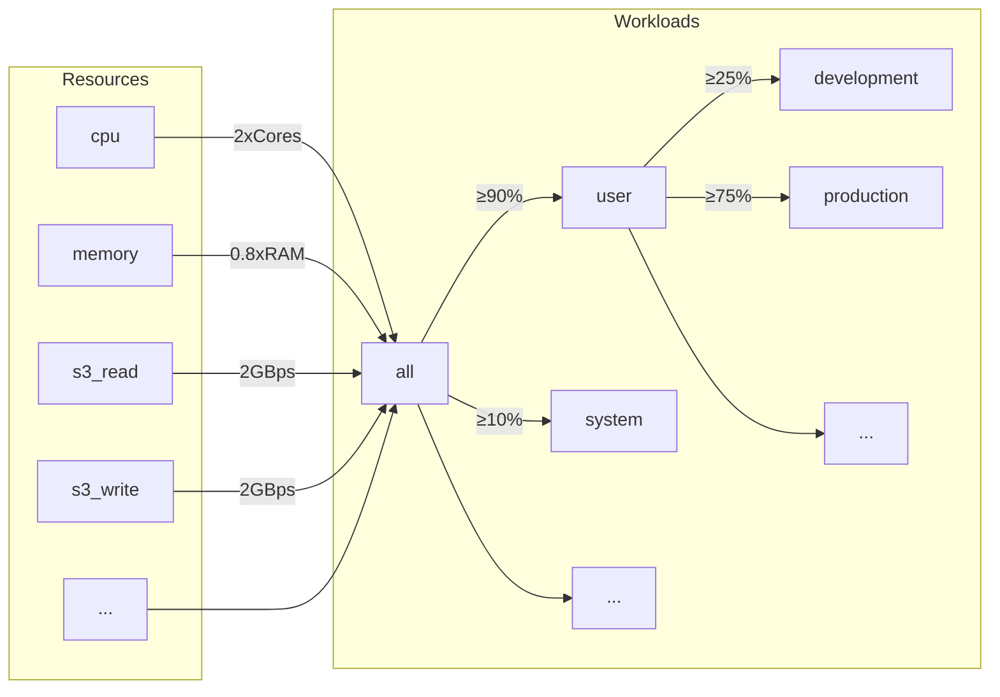
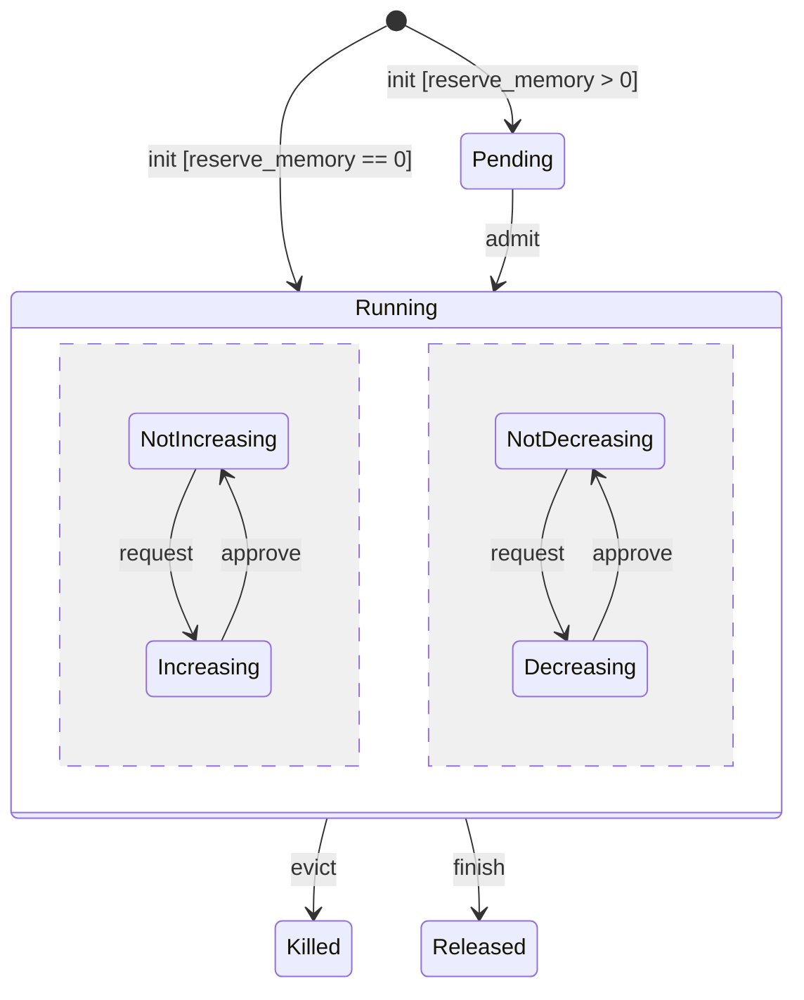
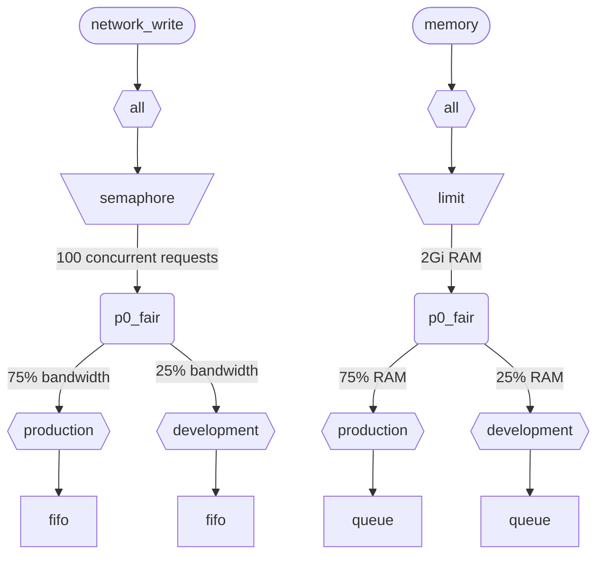

Когда ClickHouse одновременно выполняет несколько запросов, используются общие ресурсы (CPU, память и IO). Чтобы регулировать использование и распределение ресурсов между разными рабочими нагрузками, можно применять ограничения и политики планирования. Для всех ресурсов можно настроить общую иерархию планирования. Корень этой иерархии представляет общие ресурсы, а листовые узлы — конкретные рабочие нагрузки, в которых содержатся запросы на ресурсы и их выделение для конкретных запросов и фоновых задач.

<div id="resources">
  ## Ресурсы
</div>

По умолчанию планирование рабочих нагрузок отключено. Чтобы включить его, необходимо создать ресурсы, которые будут использоваться для планирования, и как минимум одну рабочую нагрузку. Все ресурсы независимы и могут использоваться в любых сочетаниях.

Чтобы включить планирование CPU, необходимо создать ресурс CPU для потоков MASTER или WORKER (подробности см. в разделе [CPU scheduling](#cpu_scheduling)):

```sql
CREATE RESOURCE cpu (MASTER THREAD, WORKER THREAD)
```

Чтобы включить резервирование памяти для рабочих нагрузок, необходимо создать ресурс MEMORY (подробности см. в разделе [Резервирование памяти](#memory-reservations)):

```sql
CREATE RESOURCE memory (MEMORY RESERVATION)
```

Чтобы включить планирование слотов запросов, необходимо создать ресурс QUERY (подробности см. в разделе [Планирование слотов запросов](#query_scheduling)):

```sql
CREATE RESOURCE query (QUERY)
```

Чтобы включить планирование ввода-вывода для конкретного диска, необходимо создать ресурсы для чтения и записи с доступом WRITE и READ:

```sql
CREATE RESOURCE resource_name (WRITE DISK disk_name, READ DISK disk_name)
-- or
CREATE RESOURCE read_resource_name (WRITE DISK write_disk_name)
CREATE RESOURCE write_resource_name (READ DISK read_disk_name)
```

Один ресурс можно использовать для любого количества дисков: только для READ, только для WRITE или одновременно для READ и WRITE. Для этого предусмотрен синтаксис, позволяющий использовать один ресурс для всех дисков:

```sql
CREATE RESOURCE all_io (READ ANY DISK, WRITE ANY DISK);
```

Ресурсы классифицируются по режиму совместного использования:

* **Ресурсы с разделением по времени** (CPU, IO, слоты запросов) — управляют запросами на ресурсы, которые помещаются в очередь в листьях иерархии планирования. Запросы планируются в соответствии с политиками и ограничениями, заданными иерархией. Запросы на ресурсы создаются, когда запрос обращается к соответствующему ресурсу. Например, когда запрос читает данные с диска или использует CPU для обработки, запросы на ресурсы создаются для каждого кванта выполненной работы или для количества байтов, отправленных или полученных через сокет.
* **Ресурсы с разделением по пространству** (память) — управляют выделениями ресурсов в листьях иерархии планирования. Выделения могут быть активными или ожидающими. Ожидающие выделения блокируются, пока не освободится достаточно места или не будет вытеснено другое выделение (принудительно завершено). Решения принимаются на основе лимитов и политик, определённых иерархией. Между выделениями и запросами (или фоновыми задачами) существует взаимно-однозначное соответствие. Выделение создаётся, когда запрос начинает выполняться, и освобождается, когда он завершает работу. Активные выделения могут динамически увеличивать или уменьшать свой размер.

<div id="workloads">
  ## Иерархия рабочих нагрузок
</div>

ClickHouse предоставляет удобный синтаксис SQL для определения иерархии планирования. Все ресурсы распределяются в рамках общей иерархии WORKLOAD. Для отдельных ресурсов правила распределения в некоторых аспектах могут различаться, но сама иерархия остается неизменной. Каждая WORKLOAD поддерживает необходимые узлы планировщика для каждого ресурса. Внутри любой рабочей нагрузки можно создать дочернюю, формируя тем самым иерархию. ClickHouse не навязывает никакой конкретной или предопределенной структуры иерархии рабочих нагрузок.

Ниже приведен пример иерархии, в которой все ресурсы разделяются между рабочими нагрузками &quot;user&quot; и &quot;system&quot; с гарантией 90% и 10% соответственно. Обратите внимание, что веса, заданные для рабочих нагрузок, используются для обеспечения max-min fairness и потому дают лишь best-effort-гарантию по нижней границе, а не верхнее ограничение или квоту. Планирование выполняется независимо на каждом хосте, поэтому ограничения, заданные настройками `max_*`, действуют для каждого хоста отдельно. Рабочая нагрузка &quot;user&quot; дополнительно распределяет свои ресурсы между рабочими нагрузками &quot;development&quot; и &quot;production&quot;, причем у &quot;production&quot; ресурсов в 3 раза больше, чем у &quot;development&quot;:

```sql
CREATE RESOURCE cpu (MASTER THREAD, WORKER THREAD)
CREATE RESOURCE memory (MEMORY RESERVATION)
CREATE RESOURCE s3_read (READ DISK s3)
CREATE RESOURCE s3_write (WRITE DISK s3)
CREATE WORKLOAD all SETTINGS max_concurrent_threads_ratio_to_cores = 2, max_memory_ratio = 0.8, max_bytes_per_second = '2Gi'
CREATE WORKLOAD user IN all SETTINGS weight = 9
CREATE WORKLOAD system IN all
CREATE WORKLOAD development IN user
CREATE WORKLOAD production IN user SETTINGS weight = 3
```



Имя листовой рабочей нагрузки без дочерних элементов можно использовать в настройках запроса `SETTINGS workload = 'name'`. Подробности см. в разделе [Разметка рабочей нагрузки](#workload-markup).

Чтобы настроить рабочую нагрузку, можно использовать следующие настройки:

* `priority` - (только для режима с разделением по времени) соседние рабочие нагрузки обслуживаются в соответствии со статическими значениями (меньшее значение означает более высокий приоритет). Влияет на вытеснение.
* `precedence` - (только для режима с разделением по пространству) соседние рабочие нагрузки допускаются в соответствии со статическими значениями (меньшее значение означает более высокое старшинство). Влияет на вытеснение и допуск.
* `weight` - соседние рабочие нагрузки с одинаковым статическим приоритетом или старшинством справедливо разделяют ресурсы в соответствии с весами. Влияет на вытеснение, допуск и вытеснение из кэша.
* `max_io_requests` - предел количества одновременных запросов IO в этой рабочей нагрузке.
* `max_bytes_inflight` - предел общего количества байтов в обработке для одновременных запросов в этой рабочей нагрузке.
* `max_bytes_per_second` - предел скорости чтения или записи в байтах для этой рабочей нагрузки.
* `max_burst_bytes` - максимальное количество байтов, которое может быть обработано этой рабочей нагрузкой без ограничения скорости (для каждого ресурса независимо).
* `max_concurrent_threads` - предел количества потоков для запросов в этой рабочей нагрузке.
* `max_concurrent_threads_ratio_to_cores` - то же, что и `max_concurrent_threads`, но нормализовано по числу доступных ядер CPU.
* `max_cpus` - предел количества ядер CPU для обслуживания запросов в этой рабочей нагрузке.
* `max_cpu_share` - то же, что и `max_cpus`, но нормализовано по числу доступных ядер CPU.
* `max_burst_cpu_seconds` - максимальное количество CPU-секунд, которое может быть использовано этой рабочей нагрузкой без ограничения скорости из-за `max_cpus`.
* `max_memory` - предел общего объема памяти, зарезервированной для этой рабочей нагрузки.

Все ограничения, заданные через настройки рабочей нагрузки, независимы для каждого ресурса. Например, рабочая нагрузка с `max_bytes_per_second = '10Mi'` будет иметь ограничение пропускной способности 10 MB/s отдельно для каждого ресурса чтения и записи. Если требуется общий предел для чтения и записи, рассмотрите возможность использования одного и того же ресурса для доступа READ и WRITE.

Невозможно задать разные иерархии рабочих нагрузок для разных ресурсов. Но можно задать разные значения настройки рабочей нагрузки для конкретного ресурса:

```sql
CREATE OR REPLACE WORKLOAD all SETTINGS max_io_requests = 100, max_bytes_per_second = '1Mi' FOR network_read, max_bytes_per_second = '2Mi' FOR network_write
```

Также обратите внимание, что рабочую нагрузку или ресурс нельзя удалить, если на них ссылается другая рабочая нагрузка. Чтобы обновить определение рабочей нагрузки, используйте запрос `CREATE OR REPLACE WORKLOAD`.

:::note
Настройки рабочей нагрузки преобразуются в соответствующий набор узлов планировщика. Более подробную информацию на низком уровне см. в описании [типов и параметров](#hierarchy) узла планировщика.
:::

<div id="workload-markup">
  ## Разметка рабочей нагрузки
</div>

Чтобы различать разные рабочие нагрузки, запросы можно помечать с помощью настройки `workload`. Если `workload` не задана, используется значение &quot;default&quot;. Обратите внимание, что другое значение можно указать с помощью профилей настроек. Ограничения настроек можно использовать, чтобы сделать значение `workload` постоянным, если вы хотите, чтобы все запросы от пользователя помечались фиксированным значением настройки `workload`.

:::warning
Настройка запроса `workload` может ссылаться только на листовые рабочие нагрузки (то есть рабочие нагрузки без дочерних элементов).
:::

```sql
SELECT count() FROM my_table WHERE value = 42 SETTINGS workload = 'production'
SELECT count() FROM my_table WHERE value = 13 SETTINGS workload = 'development'
```

Для фоновых операций можно назначить настройку `workload`. Для слияний и мутаций используются настройки сервера `merge_workload` и `mutation_workload` соответственно. Эти значения также можно переопределить для конкретных таблиц с помощью настроек MergeTree `merge_workload` и `mutation_workload`.

<div id="cpu_scheduling">
  ## Планирование CPU
</div>

Чтобы включить планирование CPU для рабочих нагрузок, создайте ресурс CPU и установите ограничение на количество одновременно выполняемых потоков:

```sql
CREATE RESOURCE cpu (MASTER THREAD, WORKER THREAD)
CREATE WORKLOAD all SETTINGS max_concurrent_threads = 100
```

Когда сервер ClickHouse выполняет много конкурентных запросов с [несколькими потоками](/ru/operations/settings/settings.md#max_threads) и все слоты CPU заняты, наступает состояние перегрузки. В этом состоянии каждый освобождённый слот CPU перераспределяется в соответствующую рабочую нагрузку согласно политикам планирования. Для запросов, использующих одну и ту же рабочую нагрузку, слоты выделяются циклически. Для запросов из разных рабочих нагрузок слоты выделяются в соответствии с весами, приоритетами и лимитами, заданными для рабочих нагрузок.

Процессорное время потребляется потоками, когда они не заблокированы и выполняют CPU-интенсивные задачи. Для целей планирования различают два вида потоков:

* Master thread — первый поток, который начинает выполнять запрос или фоновую операцию, такую как слияние или мутация.
* Worker thread — дополнительные потоки, которые основной поток может порождать для выполнения CPU-интенсивных задач.

В некоторых случаях имеет смысл использовать отдельные ресурсы для потоков master и worker, чтобы повысить отзывчивость. При высоких значениях настройки запроса `max_threads` большое число потоков worker может легко монополизировать ресурсы CPU. В этом случае входящие запросы будут блокироваться и ждать слот CPU, чтобы их потоки master могли начать выполнение. Чтобы этого избежать, можно использовать следующую конфигурацию:

```sql
CREATE RESOURCE worker_cpu (WORKER THREAD)
CREATE RESOURCE master_cpu (MASTER THREAD)
CREATE WORKLOAD all SETTINGS max_concurrent_threads = 100 FOR worker_cpu, max_concurrent_threads = 1000 FOR master_cpu
```

Это создаст отдельные ограничения для master- и worker-потоков. Даже если все 100 слот CPU для worker-потоков заняты, новые запросы не будут блокироваться, пока доступны слот CPU для master-потоков. Они начнут выполняться в одном потоке. Позже, если слот CPU для worker-потоков освободятся, такие запросы смогут увеличить параллелизм и запустить свои worker-потоки. С другой стороны, такой подход не привязывает общее число слотов к числу CPU, и запуск слишком большого количества параллельных потоков скажется на производительности.

Ограничение параллелизма master-потоков не ограничивает число параллельных запросов. Слот CPU могут освобождаться в середине выполнения запроса и затем снова выделяться другим потокам. Например, 4 параллельных запроса при ограничении в 2 параллельных master-потока могут выполняться одновременно. В этом случае каждый запрос получит 50% CPU. Чтобы ограничить число параллельных запросов, нужна отдельная логика, и сейчас для рабочих нагрузок это не поддерживается.

Отдельные ограничения параллелизма потоков можно использовать для рабочих нагрузок:

```sql
CREATE RESOURCE cpu (MASTER THREAD, WORKER THREAD)
CREATE WORKLOAD all
CREATE WORKLOAD admin IN all SETTINGS max_concurrent_threads = 10
CREATE WORKLOAD production IN all SETTINGS max_concurrent_threads = 100
CREATE WORKLOAD analytics IN production SETTINGS max_concurrent_threads = 60, weight = 9
CREATE WORKLOAD ingestion IN production
```

Этот пример конфигурации задаёт независимые пулы слотов CPU для административной и продакшн-нагрузок. Пул продакшн-нагрузки является общим для аналитики и ингестии. Кроме того, если пул продакшн-нагрузки перегружен, 9 из 10 освобождённых слотов при необходимости будут перераспределяться в пользу аналитических запросов. Запросы ингестии в периоды перегрузки будут получать только 1 из 10 слотов. Это может снизить задержку пользовательских запросов. Для аналитики действует собственный лимит в 60 параллельных потоков, что всегда оставляет как минимум 40 потоков для поддержки ингестии. Когда перегрузки нет, ингестия может использовать все 100 потоков.

Чтобы исключить запрос из планирования CPU, установите для него настройку [use&#95;concurrency&#95;control](/ru/operations/settings/settings.md/#use_concurrency_control) в 0.

Планирование CPU пока не поддерживается для слияний и мутаций.

Чтобы обеспечить справедливое выделение ресурсов для рабочих нагрузок, необходимо выполнять вытеснение и уменьшать объём выделяемых ресурсов во время выполнения запроса. Вытеснение включается настройкой сервера `cpu_slot_preemption`. Если она включена, каждый поток периодически продлевает свой слот CPU (в соответствии с настройкой сервера `cpu_slot_quantum_ns`). Такое продление может блокировать выполнение, если CPU перегружен. Когда выполнение блокируется на длительное время (см. настройку сервера `cpu_slot_preemption_timeout_ms`), для запроса уменьшается объём выделенных ресурсов, и число одновременно работающих потоков динамически снижается. Обратите внимание, что справедливое распределение времени CPU гарантируется между рабочими нагрузками, но между запросами внутри одной и той же рабочей нагрузки в некоторых граничных случаях оно может нарушаться.

:::warning
Планирование слотов позволяет управлять [параллелизмом запросов](/ru/operations/settings/settings.md#max_threads), но не гарантирует справедливого распределения времени CPU, если только настройка сервера `cpu_slot_preemption` не установлена в `true`; в противном случае справедливость обеспечивается по числу выделений слотов CPU между конкурирующими рабочими нагрузками. Это не означает равное количество секунд CPU, поскольку без вытеснения слот CPU может удерживаться неограниченно долго. Поток получает слот в начале и освобождает его после завершения работы.
:::

:::note
Указание ресурса CPU отключает действие настроек [`concurrent_threads_soft_limit_num`](server-configuration-parameters/settings.md#concurrent_threads_soft_limit_num) и [`concurrent_threads_soft_limit_ratio_to_cores`](server-configuration-parameters/settings.md#concurrent_threads_soft_limit_ratio_to_cores). Вместо них для ограничения числа CPU, выделяемых под конкретную рабочую нагрузку, используется настройка рабочей нагрузки `max_concurrent_threads`. Чтобы получить прежнее поведение, создайте только ресурс WORKER THREAD, задайте для рабочей нагрузки `all` значение `max_concurrent_threads`, равное `concurrent_threads_soft_limit_num`, и используйте настройку запроса `workload = "all"`. Эта конфигурация соответствует настройке [`concurrent_threads_scheduler`](server-configuration-parameters/settings.md#concurrent_threads_scheduler) со значением &quot;fair&#95;round&#95;robin&quot;.
:::

<div id="threads_vs_cpus">
  ## Потоки и CPU
</div>

Есть два способа управлять потреблением CPU для рабочей нагрузки:

* Ограничение числа потоков: `max_concurrent_threads` и `max_concurrent_threads_ratio_to_cores`
* Троттлинг CPU: `max_cpus`, `max_cpu_share` и `max_burst_cpu_seconds`

:::warning
Настройки троттлинга CPU действуют только при включенной настройке сервера `cpu_slot_preemption`; в противном случае они игнорируются.
:::

Первый способ позволяет динамически управлять количеством потоков, создаваемых для запроса, в зависимости от текущей нагрузки на сервер. По сути, он снижает значение, задаваемое настройкой запроса `max_threads`. Второй ограничивает потребление CPU рабочей нагрузкой с помощью алгоритма token bucket. Он не влияет напрямую на число потоков, но ограничивает суммарное потребление CPU всеми потоками рабочей нагрузки.

Троттлинг token bucket с `max_cpus` и `max_burst_cpu_seconds` означает следующее. На любом интервале длиной `delta` секунд суммарное потребление CPU всеми запросами в рабочей нагрузке не может превышать `max_cpus * delta + max_burst_cpu_seconds` CPU-секунд. В долгосрочной перспективе это ограничивает среднее потребление значением `max_cpus`, но кратковременно этот предел может быть превышен. Например, при `max_burst_cpu_seconds = 60` и `max_cpus=0.001` можно без троттлинга выполнять либо 1 поток в течение 60 секунд, либо 2 потока в течение 30 секунд, либо 60 потоков в течение 1 секунды. Значение `max_burst_cpu_seconds` по умолчанию — 1 секунда. При большом числе одновременно работающих потоков меньшие значения могут приводить к недоиспользованию разрешенных ядер `max_cpus`.

Пока поток удерживает слот CPU, он может находиться в одном из трех основных состояний:

* **Выполняется:** фактически потребляет ресурс CPU. Время, проведенное в этом состоянии, учитывается при троттлинге CPU.
* **Готов к выполнению:** ожидает, пока CPU станет доступен. Время, проведенное в этом состоянии, не учитывается при троттлинге CPU.
* **Заблокирован:** выполняет операции IO или другие блокирующие syscall (например, ожидает mutex). Время, проведенное в этом состоянии, не учитывается при троттлинге CPU.

Рассмотрим пример конфигурации, которая сочетает троттлинг CPU и ограничение числа потоков:

```sql
CREATE RESOURCE cpu (MASTER THREAD, WORKER THREAD)
CREATE WORKLOAD all SETTINGS max_concurrent_threads_ratio_to_cores = 2
CREATE WORKLOAD admin IN all SETTINGS max_concurrent_threads = 2, priority = -1
CREATE WORKLOAD production IN all SETTINGS weight = 4
CREATE WORKLOAD analytics IN production SETTINGS max_cpu_share = 0.7, weight = 3
CREATE WORKLOAD ingestion IN production
CREATE WORKLOAD development IN all SETTINGS max_cpu_share = 0.3
```

Здесь мы ограничиваем общее число потоков для всех запросов до x2 от количества доступных CPU. Рабочая нагрузка Admin ограничена максимум двумя потоками, независимо от количества доступных CPU. У Admin приоритет -1 (ниже, чем у default со значением 0), и при необходимости он получает любой слот CPU первым. Когда Admin не выполняет запросы, ресурсы CPU распределяются между рабочими нагрузками продакшн и разработки. Гарантированные доли процессорного времени задаются весами (4 к 1): как минимум 80% получает продакшн (если это требуется), и как минимум 20% — разработка (если это требуется). Если веса задают гарантии, то throttling CPU задаёт лимиты: продакшн не ограничен и может потреблять 100%, тогда как для разработки установлен лимит 30%, который действует даже при отсутствии запросов из других рабочих нагрузок. Рабочая нагрузка продакшн не является leaf, поэтому её ресурсы распределяются между аналитикой и ингестией в соответствии с весами (3 к 1). Это означает, что аналитика имеет гарантию как минимум 0.8 * 0.75 = 60%, а на основе `max_cpu_share` её лимит составляет 70% от общих ресурсов CPU. При этом у ингестии остаётся гарантия как минимум 0.8 * 0.25 = 20%, и верхнего лимита у неё нет.

:::note
Если вы хотите максимально загрузить CPU на сервере ClickHouse, не используйте `max_cpus` и `max_cpu_share` для корневой рабочей нагрузки `all`. Вместо этого задайте большее значение `max_concurrent_threads`. Например, в системе с 8 CPU установите `max_concurrent_threads = 16`. Это позволит 8 потокам выполнять задачи, нагружающие CPU, пока ещё 8 потоков смогут обрабатывать операции IO. Дополнительные потоки создадут нагрузку на CPU, что обеспечит применение правил scheduling. Напротив, при установке `max_cpus = 8` нагрузка на CPU никогда не возникнет, потому что сервер не сможет превысить 8 доступных CPU.
:::

<div id="memory-reservations">
  ## Резервирование памяти
</div>

:::note
Планирование резервирования памяти является экспериментальным. Оно действует, только если существует ресурс `MEMORY RESERVATION`, а его SQL-интерфейс и поведение могут измениться в будущих версиях. Для слияний и мутаций оно пока не поддерживается, а вытеснение выполняющегося запроса выполняется по best-effort: оно срабатывает в ближайшей точке синхронизации памяти запроса, а не мгновенно.
:::

Чтобы включить резервирование памяти для рабочих нагрузок, создайте ресурс MEMORY RESERVATION и задайте хотя бы одно ограничение для общего объема зарезервированной памяти с помощью настроек рабочей нагрузки:

```sql
CREATE RESOURCE memory (MEMORY RESERVATION)
CREATE WORKLOAD all SETTINGS max_memory = '2Gi'
```

ClickHouse отслеживает выделение памяти для всех запросов и фоновых операций. Объём выделенной памяти в байтах агрегируется по иерархии планирования вплоть до корневого уровня. С каждым запросом связано выделение памяти в той листовой рабочей нагрузке, к которой он относится. Если для запроса значение настройки `reserve_memory` больше нуля, выделение создаётся в состоянии ожидания. Выделение в состоянии ожидания резервирует запрошенный объём памяти в иерархии рабочих нагрузок. Если доступной памяти недостаточно, выделение остаётся в состоянии ожидания, пока не освободится достаточно памяти или другие выделения не будут вытеснены (завершены). Когда выделение получает допуск, оно переходит в выполняющееся состояние. Выполняющееся выделение может динамически увеличивать или уменьшать свой размер в зависимости от потребления памяти запросом. Жизненный цикл выделения можно представить следующей диаграммой состояний:



Ожидающие выделения памяти для листовой рабочей нагрузки допускаются в порядке FIFO. Когда у нескольких рабочих нагрузок есть ожидающие выделения памяти, они допускаются в соответствии с настройками старшинства и веса. Сначала обслуживаются рабочие нагрузки с более высоким старшинством. Соседние рабочие нагрузки с одинаковым старшинством делят память по весам по принципу max-min fair, то есть первой обслуживается рабочая нагрузка с меньшим нормализованным использованием памяти (текущее использование плюс запрошенное увеличение, делённые на вес). При вытеснении применяется обратная логика. Когда требуется освободить память, первыми вытесняются рабочие нагрузки с меньшим старшинством и большим нормализованным использованием памяти.

Обратите внимание, что для ресурсов с разделением по времени используется приоритет, а для ресурсов с разделением по пространству — старшинство. Это независимые настройки, и для них можно задавать разные значения. Более высокий приоритет подразумевает неразрушающее вытеснение (задержку или throttling), тогда как более высокое старшинство может подразумевать разрушающее вытеснение (остановку с ошибкой). Рабочая нагрузка может иметь высокий приоритет для планирования CPU, но то же старшинство для резервирования памяти, чтобы избежать вытеснения других рабочих нагрузок и потери уже выполненной ими работы.

Каждая рабочая нагрузка с ограничением `max_memory` гарантирует, что общий объём памяти, выделенной в её поддереве, не превышает это ограничение. Если ожидающее или увеличивающееся выделение памяти превысило бы ограничение, запускается процедура вытеснения для освобождения памяти. Процедура вытеснения выбирает жертву для завершения. Рабочая нагрузка, являющаяся наименьшим общим предком инициатора и жертвы, предотвращает вытеснение в следующих ситуациях:

* Ожидающее выделение памяти не может вытеснить активные выделения в той же рабочей нагрузке. (Рабочие нагрузки инициатора и жертвы совпадают).
* Ожидающее выделение памяти с меньшим старшинством никогда не завершает рабочую нагрузку с более высоким старшинством.
* Ожидающее выделение памяти не может завершить выделение памяти с тем же старшинством. Обратите внимание, что активные выделения памяти с одинаковым старшинством могут вытеснять друг друга на основе нормализованного использования памяти.
  Если вытеснение предотвращено или не освобождает достаточно памяти, новое выделение памяти блокируется до тех пор, пока не будет освобождено достаточно памяти. Эти правила позволяют ставить избыточные запросы в очередь при нехватке памяти и обеспечивают удобный способ избежать ошибок MEMORY&#95;LIMIT&#95;EXCEEDED.

:::note
Ограничения рабочих нагрузок не зависят от других способов ограничить использование памяти, таких как настройка запроса [max&#95;memory&#95;usage](/ru/operations/settings/settings.md#max_memory_usage). Их можно использовать вместе для более точного контроля использования памяти. Можно задавать отдельные ограничения памяти на уровне пользователей (а не рабочих нагрузок). Это менее гибко и не предоставляет таких возможностей, как резервирование памяти и постановка ожидающих запросов в очередь. См. [Memory overcommit](settings/memory-overcommit.md)
:::

Настройка рабочей нагрузки `max_waiting_queries` ограничивает число ожидающих выделений памяти для рабочей нагрузки. Когда ограничение достигнуто, сервер возвращает ошибку `SERVER_OVERLOADED`. Обратите внимание, что `max_waiting_queries` не наследуется дочерними рабочими нагрузками и имеет смысл только для листовых рабочих нагрузок.

Планирование резервирования памяти пока не поддерживается для слияний и мутаций.

Только запросы, для которых значение настройки `reserve_memory` больше нуля, могут быть заблокированы в ожидании резервирования памяти. Однако запросы с нулевым `reserve_memory` также учитываются в объеме памяти их рабочей нагрузки и при необходимости могут быть вытеснены, чтобы освободить память для других ожидающих или растущих выделений. Запросы без корректной разметки рабочей нагрузки не подпадают под планирование резервирования памяти и не могут быть вытеснены планировщиком.

Чтобы задать для запроса неэластичное резервирование памяти, установите одинаковое значение для настроек запроса `reserve_memory` и `max_memory_usage`. В этом случае запрос зарезервирует фиксированный объем памяти и не сможет динамически увеличивать выделение памяти. Обратите внимание, что эластичное резервирование памяти может быть увеличено сверх `reserve_memory`, вплоть до `max_memory_usage`, без принудительного завершения запроса, если только не возникнет нехватка памяти. Но оно не может быть уменьшено ниже `reserve_memory`, даже если фактическое потребление меньше.

Рассмотрим пример конфигурации:

```sql
CREATE RESOURCE memory (MEMORY RESERVATION)
CREATE WORKLOAD all SETTINGS max_memory = '10Gi'
CREATE WORKLOAD system IN all SETTINGS weight = 1
CREATE WORKLOAD user IN all SETTINGS weight = 9
CREATE WORKLOAD production IN user SETTINGS precedence = 1, weight = 3
CREATE WORKLOAD staging IN user SETTINGS precedence = 1, weight = 1
CREATE WORKLOAD testing IN user SETTINGS precedence = 2
```

В этом примере общий объём памяти, зарезервированной всеми запросами и фоновыми операциями, не может превышать 10 GiB. Рабочая нагрузка system имеет гарантию не менее 1 GiB (10% от 10 GiB), а рабочая нагрузка user — не менее 9 GiB (90% от 10 GiB). Внутри рабочей нагрузки user нагрузки production и staging делят память в соответствии с весами (3 к 1) при одинаковом старшинстве 1. Рабочая нагрузка testing имеет старшинство 2, которое ниже, чем у production и staging. Поэтому testing может использовать только ту память, которая не используется production и staging.

Если возникает нехватка памяти, сначала будут вытеснены выделения рабочей нагрузки testing. Затем, если потребуется освободить больше памяти, выделения рабочей нагрузки staging будут вытеснены раньше, чем выделения рабочей нагрузки production, если они превышают свои гарантии. Обратите внимание: ожидающие запросы в production и staging могут вытеснять активные выделения в рабочей нагрузке testing, чтобы освободить память, но они не могут вытеснять друг друга, поскольку имеют одинаковое старшинство. В случае нехватки памяти они будут ждать в очередях, что позволяет системе избегать ошибок MEMORY&#95;LIMIT&#95;EXCEEDED из-за слишком большого числа одновременно выполняющихся запросов.

Обратите внимание, что рабочая нагрузка system имеет старшинство 0 (default), которое выше, чем у рабочих нагрузок production, staging и testing, но они не являются одноуровневыми нагрузками. Их наименьший общий предок — рабочая нагрузка all, оба дочерних элемента которой имеют одинаковое старшинство. Поэтому ожидающая рабочая нагрузка system не может вытеснить ни одну из них, и наоборот. Это гарантирует, что системные операции нельзя легко вытеснить.

<div id="query_scheduling">
  ## Планирование слотов запросов
</div>

Чтобы включить планирование слотов запросов для рабочих нагрузок, создайте ресурс QUERY и задайте ограничение на количество параллельных запросов или запросов в секунду:

```sql
CREATE RESOURCE query (QUERY)
CREATE WORKLOAD all SETTINGS max_concurrent_queries = 100, max_queries_per_second = 10, max_burst_queries = 20
```

Настройка рабочей нагрузки `max_concurrent_queries` ограничивает число одновременных запросов, которые могут выполняться для заданной рабочей нагрузки. Это аналог настройки запроса [`max_concurrent_queries_for_all_users`](/ru/operations/settings/settings#max_concurrent_queries_for_all_users) и настройки сервера [max&#95;concurrent&#95;queries](/ru/operations/server-configuration-parameters/settings#max_concurrent_queries). Запросы async insert и некоторые специальные запросы, такие как KILL, не учитываются при достижении этого лимита.

Настройки рабочей нагрузки `max_queries_per_second` и `max_burst_queries` ограничивают число запросов для рабочей нагрузки с помощью троттлера token bucket. Это гарантирует, что за любой интервал времени `T` начнут выполняться не более `max_queries_per_second * T + max_burst_queries` новых запросов.

Настройка рабочей нагрузки `max_waiting_queries` ограничивает число ожидающих запросов для рабочей нагрузки. Когда лимит достигнут, сервер возвращает ошибку `SERVER_OVERLOADED`. Обратите внимание, что `max_waiting_queries` не наследуется дочерними рабочими нагрузками и имеет смысл только для листовых рабочих нагрузок.

:::note
Заблокированные запросы будут ждать бессрочно и не отображаются в `SHOW PROCESSLIST`, пока не будут выполнены все ограничения.
:::

<div id="workload_entity_storage">
  ## Хранилище рабочих нагрузок и ресурсов
</div>

Определения всех рабочих нагрузок и ресурсов в виде запросов `CREATE WORKLOAD` и `CREATE RESOURCE` сохраняются либо на диске в `workload_path`, либо в ZooKeeper в `workload_zookeeper_path`. Для обеспечения согласованности между узлами рекомендуется использовать хранилище в ZooKeeper. В качестве альтернативы при хранении на диске можно использовать предложение `ON CLUSTER`.

<div id="config_based_workloads">
  ## Рабочие нагрузки и ресурсы, задаваемые конфигурацией
</div>

Помимо определений на основе SQL, рабочие нагрузки и ресурсы можно заранее задать в файле конфигурации сервера. Это полезно в облачных средах, где одни ограничения задаются инфраструктурой, а другие могут изменяться пользователями. Сущности, заданные в конфигурации, имеют приоритет над сущностями, определёнными через SQL, и не могут быть изменены или удалены с помощью SQL-команд.

<div id="config_based_workloads_format">
  ### Формат конфигурации
</div>

```xml
<clickhouse>
    <resources_and_workloads>
        CREATE RESOURCE memory (MEMORY RESERVATION);
        CREATE RESOURCE s3disk_read (READ DISK s3);
        CREATE RESOURCE s3disk_write (WRITE DISK s3);
        CREATE WORKLOAD all SETTINGS max_memory = '2Gi', max_io_requests = 500 FOR s3disk_read, max_io_requests = 1000 FOR s3disk_write, max_bytes_per_second = '1280Mi' FOR s3disk_read, max_bytes_per_second = '3200Mi' FOR s3disk_write;
        CREATE WORKLOAD production IN all SETTINGS weight = 3;
    </resources_and_workloads>
</clickhouse>
```

Конфигурация использует тот же синтаксис SQL, что и команды `CREATE WORKLOAD` и `CREATE RESOURCE`. Все запросы должны быть корректными.

<div id="config_based_workloads_usage_recommendations">
  ### Рекомендации по использованию
</div>

Для облачных сред типичная конфигурация может включать:

1. Определите корневую рабочую нагрузку и ресурсы сетевого IO в конфигурации, чтобы задать ограничения инфраструктуры
2. Установите `throw_on_unknown_workload`, чтобы обеспечить соблюдение этих ограничений
3. Создайте `CREATE WORKLOAD default IN all`, чтобы автоматически применять ограничения ко всем запросам (поскольку значение по умолчанию для параметра запроса `workload` — &#39;default&#39;)
4. Разрешите пользователям создавать дополнительные рабочие нагрузки в пределах настроенной иерархии

Это гарантирует, что все фоновые процессы и запросы соблюдают ограничения инфраструктуры, сохраняя при этом гибкость для пользовательских политик планирования.

Ещё один вариант использования — разные конфигурации для разных узлов в гетерогенном кластере.

<div id="strict_resource_access">
  ## Строгий доступ к ресурсам
</div>

Чтобы все запросы соблюдали политики планирования ресурсов, используйте настройку сервера `throw_on_unknown_workload`. Если она установлена в `true`, для каждого запроса должна быть указана корректная настройка запроса `workload`, иначе будет генерироваться исключение `RESOURCE_ACCESS_DENIED`. Если она установлена в `false`, такой запрос не использует планировщик ресурсов, то есть получает неограниченный доступ к любому `RESOURCE`. Настройка запроса &#39;use&#95;concurrency&#95;control = 0&#39; позволяет запросу обходить планировщик CPU и получать неограниченный доступ к CPU. Чтобы принудительно включить планирование CPU, создайте ограничение на настройку, зафиксировав для &#39;use&#95;concurrency&#95;control&#39; постоянное значение только для чтения.

:::note
Не устанавливайте `throw_on_unknown_workload` в `true`, пока не выполнен `CREATE WORKLOAD default`. Иначе это может привести к проблемам при запуске сервера, если во время старта будет выполнен запрос без явно заданной настройки `workload`.
:::

<div id="hierarchy">
  ### Иерархия узлов планировщика
</div>

С точки зрения подсистемы планирования каждый ресурс представляет собой иерархию узлов планировщика. ClickHouse автоматически создает все необходимые узлы планировщика на основе определений WORKLOAD и RESOURCE. Узлы планировщика — это низкоуровневые подробности реализации, доступные через таблицу [system.scheduler](/ru/operations/system-tables/scheduler.md).

```sql
CREATE RESOURCE network_write (WRITE DISK s3)
CREATE RESOURCE memory (MEMORY RESERVATION)
CREATE WORKLOAD all SETTINGS max_io_requests = 100, max_memory = '2Gi'
CREATE WORKLOAD development IN all
CREATE WORKLOAD production IN all SETTINGS weight = 3
```



**Типы узлов с разделением по времени:**

* `inflight_limit` (constraint) - блокирует, если либо число параллельно обрабатываемых запросов превышает `max_requests`, либо их суммарная стоимость превышает `max_cost`; должен иметь один дочерний узел.
* `bandwidth_limit` (constraint) - блокирует, если текущая пропускная способность превышает `max_speed` (0 означает без ограничений) или всплеск превышает `max_burst` (по умолчанию равен `max_speed`); должен иметь один дочерний узел.
* `fair` (policy) - выбирает следующий запрос для обработки из одного из своих дочерних узлов в соответствии с max-min fairness; дочерние узлы могут задавать `weight` (по умолчанию 1).
* `priority` (policy) - выбирает следующий запрос для обработки из одного из своих дочерних узлов в соответствии со статическими приоритетами (меньшее значение означает более высокий приоритет); дочерние узлы должны задавать `priority` (по умолчанию 0).
* `fifo` (queue) - листовой узел иерархии, способный содержать запросы, превышающие доступную ёмкость ресурсов.

**Типы узлов с разделением по пространству:**

* `limit` - гарантирует, что суммарное выделение дочернего узла никогда не превышает лимит; при необходимости запускает процедуру вытеснения в поддереве; должен иметь один дочерний узел.
* `fair_allocation` - выполняет вытеснение в соответствии с max-min fairness; ожидающее выделение никогда не вытесняет выполняющееся; дочерние узлы могут задавать `weight` (по умолчанию 1).
* `precedence_allocation` - выполняет вытеснение в соответствии со статическим старшинством (меньшее значение означает более высокое старшинство); ожидающее выделение с более высоким старшинством вытесняет выделения с более низким старшинством; дочерние узлы должны задавать `precedence` (по умолчанию 0).
* `queue` - листовой узел иерархии, способный содержать выполняющиеся и ожидающие выделения.

<div id="deprecated-configuration">
  ## Устаревшая XML-конфигурация
</div>

Альтернативный способ указать, какие диски использует ресурс, — задать это в `storage_configuration` сервера:

Чтобы включить планирование ввода-вывода для конкретного диска, нужно указать `read_resource` и/или `write_resource` в конфигурации хранилища. Так ClickHouse узнает, какой ресурс нужно использовать для всех запросов чтения и записи, работающих с данным диском. Ресурсы чтения и записи могут ссылаться на одно и то же имя ресурса, что полезно для локальных SSD или HDD. Несколько разных дисков тоже могут ссылаться на один и тот же ресурс, что полезно для удалённых дисков: например, если вы хотите обеспечить справедливое разделение пропускной способности сети между рабочими нагрузками «production» и «development».

Пример:

```xml
<clickhouse>
    <storage_configuration>
        ...
        <disks>
            <s3>
                <type>s3</type>
                <endpoint>https://clickhouse-public-datasets.s3.amazonaws.com/my-bucket/root-path/</endpoint>
                <access_key_id>your_access_key_id</access_key_id>
                <secret_access_key>your_secret_access_key</secret_access_key>
                <read_resource>network_read</read_resource>
                <write_resource>network_write</write_resource>
            </s3>
        </disks>
        <policies>
            <s3_main>
                <volumes>
                    <main>
                        <disk>s3</disk>
                    </main>
                </volumes>
            </s3_main>
        </policies>
    </storage_configuration>
</clickhouse>
```

Обратите внимание, что параметры конфигурации сервера имеют приоритет перед заданием ресурсов через SQL.

В следующем примере показано, как определить иерархии планирования ввода-вывода, показанные на рисунке выше:

```xml
<clickhouse>
    <resources>
        <network_read>
            <node path="/">
                <type>inflight_limit</type>
                <max_requests>100</max_requests>
            </node>
            <node path="/fair">
                <type>fair</type>
            </node>
            <node path="/fair/prod">
                <type>fifo</type>
                <weight>3</weight>
            </node>
            <node path="/fair/dev">
                <type>fifo</type>
            </node>
        </network_read>
        <network_write>
            <node path="/">
                <type>inflight_limit</type>
                <max_requests>100</max_requests>
            </node>
            <node path="/fair">
                <type>fair</type>
            </node>
            <node path="/fair/prod">
                <type>fifo</type>
                <weight>3</weight>
            </node>
            <node path="/fair/dev">
                <type>fifo</type>
            </node>
        </network_write>
    </resources>
</clickhouse>
```

Чтобы иметь возможность использовать ресурс по максимуму, следует использовать `inflight_limit`. Обратите внимание, что низкие значения `max_requests` или `max_cost` могут привести к неполному использованию ресурса, тогда как слишком высокие значения могут привести к опустошению очередей внутри планировщика, что, в свою очередь, приведет к игнорированию политик в поддереве (нарушению справедливости или игнорированию приоритетов). С другой стороны, если вы хотите защитить ресурсы от чрезмерной загрузки, следует использовать `bandwidth_limit`. Он ограничивает скорость, если объем ресурса, потребляемый за `duration` секунд, превышает `max_burst + max_speed * duration` байт. Два узла `bandwidth_limit` на одном и том же ресурсе можно использовать для ограничения пиковой пропускной способности на коротких интервалах и средней пропускной способности на более длительных.

<div id="workload-classifiers">
  ### Устаревшие классификаторы рабочих нагрузок
</div>

Классификаторы рабочих нагрузок используются для определения сопоставления между `workload`, указанной в запросе, и leaf-очередями, которые должны использоваться для конкретных ресурсов. На данный момент классификация рабочих нагрузок устроена просто: доступно только статическое сопоставление.

Пример:

```xml
<clickhouse>
    <workload_classifiers>
        <production>
            <network_read>/fair/prod</network_read>
            <network_write>/fair/prod</network_write>
        </production>
        <development>
            <network_read>/fair/dev</network_read>
            <network_write>/fair/dev</network_write>
        </development>
        <default>
            <network_read>/fair/dev</network_read>
            <network_write>/fair/dev</network_write>
        </default>
    </workload_classifiers>
</clickhouse>
```

<div id="see-also">
  ## См. также
</div>

* [system.scheduler](/ru/operations/system-tables/scheduler.md)
* [system.workloads](/ru/operations/system-tables/workloads.md)
* [system.resources](/ru/operations/system-tables/resources.md)
* [merge&#95;workload](/ru/operations/settings/merge-tree-settings.md#merge_workload) настройка MergeTree
* [merge&#95;workload](/ru/operations/server-configuration-parameters/settings.md#merge_workload) глобальная настройка сервера
* [mutation&#95;workload](/ru/operations/settings/merge-tree-settings.md#mutation_workload) настройка MergeTree
* [mutation&#95;workload](/ru/operations/server-configuration-parameters/settings.md#mutation_workload) глобальная настройка сервера
* [workload&#95;path](/ru/operations/server-configuration-parameters/settings.md#workload_path) глобальная настройка сервера
* [workload&#95;zookeeper&#95;path](/ru/operations/server-configuration-parameters/settings.md#workload_zookeeper_path) глобальная настройка сервера
* [cpu&#95;slot&#95;preemption](/ru/operations/server-configuration-parameters/settings.md#cpu_slot_preemption) глобальная настройка сервера
* [cpu&#95;slot&#95;quantum&#95;ns](/ru/operations/server-configuration-parameters/settings.md#cpu_slot_quantum_ns) глобальная настройка сервера
* [cpu&#95;slot&#95;preemption&#95;timeout&#95;ms](/ru/operations/server-configuration-parameters/settings.md#cpu_slot_preemption_timeout_ms) глобальная настройка сервера