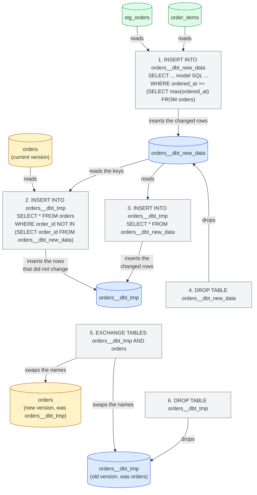
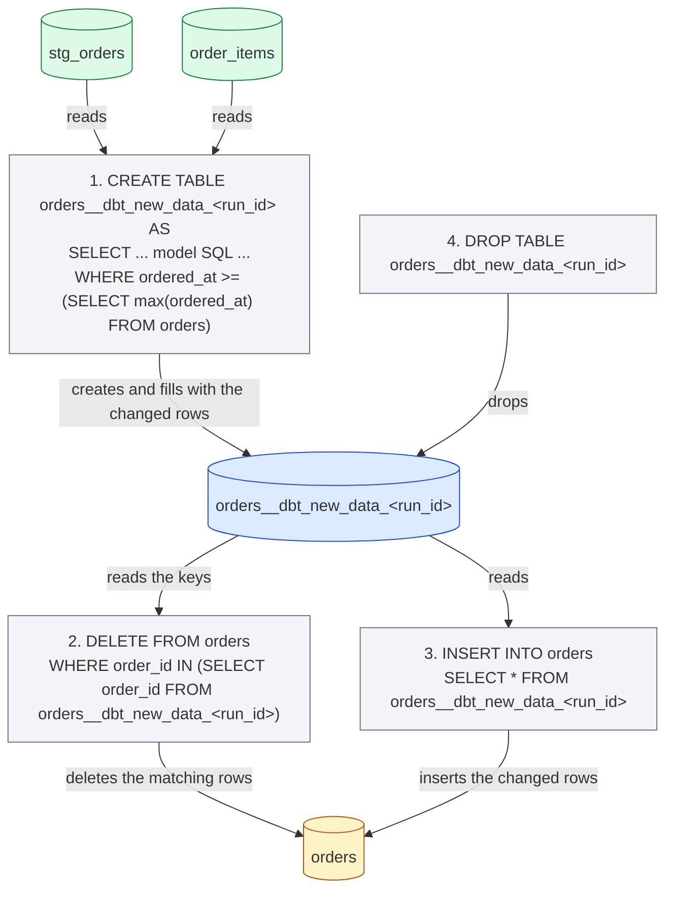
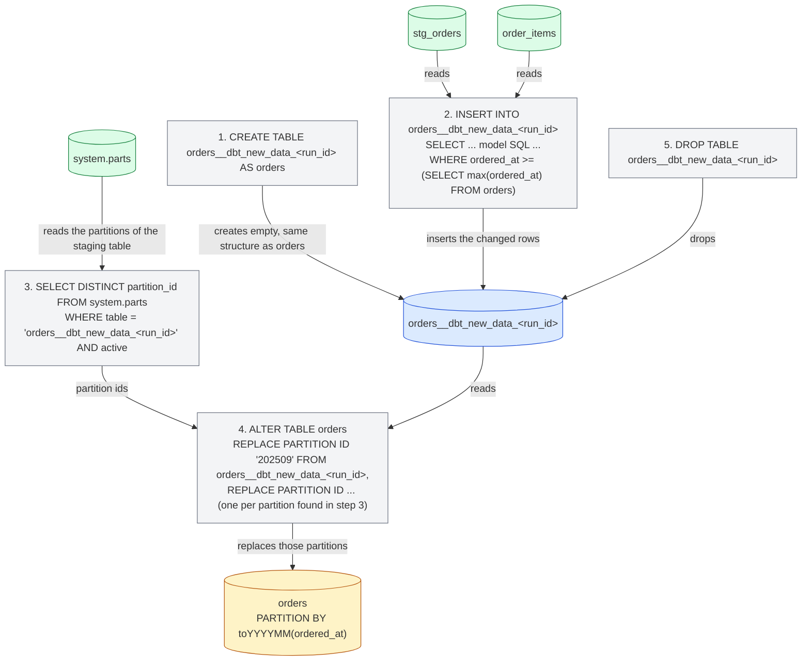

import { ClickHouseSupportedBadge } from "/snippets/ru/components/ClickHouseSupported/ClickHouseSupported.jsx";

<ClickHouseSupportedBadge />

Это руководство описывает специфичные для ClickHouse аспекты работы с dbt на примере проекта [Jaffle Shop for ClickHouse](https://github.com/ClickHouse/jaffle-shop-clickhouse) — порта классического демонстрационного проекта dbt Labs под ClickHouse. Отправной точкой служит уже собирающийся проект, на котором показано, как:

1. Разобраться, во что превращаются просмотры и таблицы проекта в ClickHouse.
2. Загружать данные с помощью seed-ов и управлять типами ClickHouse и структурой таблиц.
3. Настроить табличную модель с указанием движка ClickHouse, ключа сортировки и партиционирования.
4. Превратить таблицу в инкрементальную модель и выбрать инкрементальную стратегию.
5. Создать снимок.
6. Использовать materialized просмотры ClickHouse.

Руководство рассчитано на чтение вместе с остальной [документацией](/ru/integrations/connectors/data-ingestion/etl-tools/dbt/index), страницей [возможностей и конфигураций](/ru/integrations/connectors/data-ingestion/etl-tools/dbt/features-and-configurations) и [справочником по materializations](/ru/integrations/connectors/data-ingestion/etl-tools/dbt/materializations).

## Прежде чем начать {#before-you-start}

Сначала выполните инструкции из README проекта [ClickHouse/jaffle-shop-clickhouse](https://github.com/ClickHouse/jaffle-shop-clickhouse). Там объясняется, как настроить проект с dbt Core 1.x, dbt OSS, dbt v2 или платформой dbt, как подключить его к локальному ClickHouse (docker) или ClickHouse Cloud, как загрузить демонстрационные данные командой `dbt seed` и как выполнить первый `dbt build`. После того как `dbt build` успешно завершится, возвращайтесь сюда за примерами и конфигурациями, специфичными для ClickHouse.

После выполнения шагов из README в ClickHouse у вас должно быть две базы данных:

* `raw`: шесть исходных таблиц, загруженных из CSV-файлов командой `dbt seed` (`raw_customers`, `raw_orders`, `raw_items`, `raw_products`, `raw_stores`, `raw_supplies`).
* `jaffle_shop` (значение `schema` в вашем профиле): шесть промежуточных просмотров (`stg_*`) и семь витринных таблиц (`customers`, `orders`, `order_items`, `products`, `locations`, `supplies`, `metricflow_time_spine`).

Если в вашем профиле используется другая `schema`, замените `jaffle_shop` в приведённых ниже запросах на своё значение.

<Note>
  **dbt Core 1.x, dbt OSS, dbt v2 и платформа dbt.** Все команды и модели в этом руководстве одинаковы для всех них. Примеры проверялись на dbt Core 1.12 с `dbt-clickhouse` 1.10 и на dbt OSS 2.0 с ClickHouse 26.8; dbt v2 использует тот же adapter, а платформа dbt работает на dbt v2. Приведённый вывод в консоли получен в dbt Core 1.x; те немногие случаи, где поведение движков различается, отмечены отдельно. Текущий статус адаптера v2 см. на [странице dbt OSS, dbt v2 и платформы dbt](/ru/integrations/connectors/data-ingestion/etl-tools/dbt/dbt-core-v2-fusion-and-platform), а для начала работы с платформой dbt — раздел [Connect ClickHouse](https://docs.getdbt.com/docs/platform/connect-data-platform/connect-clickhouse) в документации dbt.
</Note>

Все SQL-команды, не являющиеся командами dbt, предназначены для выполнения непосредственно в ClickHouse — например, с помощью `clickhouse client`, SQL-консоли ClickHouse Cloud или любого другого SQL-клиента на ваш выбор.

## Как материализуется проект {#views-and-tables}

В Jaffle Shop materializations задаются в `dbt_project.yml`: staging-модели создаются как просмотры, а marts — как таблицы.

```yaml
models:
  jaffle_shop:
    staging:
      +materialized: view
    marts:
      +materialized: table
```

Модель типа **view** пересоздаётся оператором `CREATE OR REPLACE VIEW` при каждом запуске. Она не хранит данные, поэтому её построение ничего не стоит, но при каждом запросе к ней SQL модели выполняется по исходным таблицам. ClickHouse хранит скомпилированный SQL модели в определении представления:

```sql
SHOW CREATE VIEW jaffle_shop.stg_orders;
```

```response
CREATE VIEW jaffle_shop.stg_orders
(
    `order_id` String,
    `location_id` String,
    `customer_id` String,
    ...
    `ordered_at` DateTime
)
AS WITH
    source AS
    (
        SELECT *
        FROM raw.raw_orders
    ),
    renamed AS
    (
        SELECT
            id AS order_id,
            store_id AS location_id,
            ...
            dateTrunc('day', ordered_at) AS ordered_at
        FROM source
    )
SELECT *
FROM renamed
```

Модель типа **table** пересоздаётся с нуля при каждом запуске: adapter создаёт новую таблицу, выполняет `INSERT INTO ... SELECT` с SQL-кодом модели и атомарно меняет её местами с предыдущей версией. Производительность запросов существенно выше, чем у представления, но платой за это становятся расходы на хранилище и полное пересоздание таблицы каждый раз. Посмотрите на таблицу, которую dbt создал для витрины `orders`:

```sql
SHOW CREATE TABLE jaffle_shop.orders;
```

```response
CREATE TABLE jaffle_shop.orders
(
    `order_id` String,
    `location_id` String,
    `customer_id` String,
    ...
    `customer_order_number` UInt64
)
ENGINE = MergeTree
ORDER BY tuple()
SETTINGS replicated_deduplication_window = '0', index_granularity = 8192
```

Здесь есть два момента, специфичных для ClickHouse. В модели не указан движок таблицы, поэтому adapter использует `MergeTree`, и не указан ключ сортировки, поэтому adapter применяет `ORDER BY tuple()` — то есть данные не сортируются вовсе. Для демонстрационного проекта это приемлемо, но для реальной таблицы стоит задать и то, и другое, чем мы и займёмся в следующих разделах. На [странице materializations](/ru/integrations/connectors/data-ingestion/etl-tools/dbt/materializations) перечислены все конфигурации таблиц, которые поддерживает adapter.

## Загрузка данных с помощью seeds {#seeds}

Jaffle Shop использует dbt [seeds](https://docs.getdbt.com/docs/build/seeds) для загрузки необработанных данных из CSV-файлов в каталоге `seeds/jaffle-data`. Seeds предназначены для небольших статических справочных данных (таблицы кодов, соответствия), а не для наполнения хранилища; в проекте они используются для удобства, чтобы можно было начать работу без дополнительного инструмента ингестии — именно поэтому seeds отключены, пока вы не передадите `--vars '{"load_source_data": true}'`.

Тем не менее seeds — хорошая отправная точка, чтобы разобраться, как dbt создаёт таблицы ClickHouse. dbt выводит тип столбца для каждого столбца CSV, и выведенные типы различаются в зависимости от движка:

| Значение CSV          | dbt v1     | движок v2       |
| --------------------- | ---------- | --------------- |
| `700`                 | `Int32`    | `Int64`         |
| `0.06`                | `Float32`  | `Float64`       |
| `2024-09-01T15:01:00` | `DateTime` | `DateTime64(6)` |
| `Philadelphia`        | `String`   | `String`        |

Если тип важен, задайте его явно через `column_types`. В проекте это уже сделано для столбца `opened_at` seed-а `raw_stores` в файле `dbt_project.yml`:

```yaml
seeds:
  jaffle_shop:
    +schema: raw
    jaffle-data:
      +enabled: "{{ var('load_source_data', false) }}"
      raw_stores:
        +column_types:
          opened_at: DateTime64(3)
```

Seeds также поддерживают конфигурации таблиц ClickHouse: `engine`, `order_by` и `partition_by`. Например, чтобы отсортировать seed `raw_orders` по времени заказа и разбить его на партиции по месяцам, добавьте рядом с CSV-файлами файл свойств `seeds/jaffle-data/_raw_orders.yml`:

```yaml
seeds:
  - name: raw_orders
    config:
      order_by: (ordered_at, id)
      partition_by: toYYYYMM(ordered_at)
```

<Note>
  Для этих seed-конфигураций ClickHouse используйте файл свойств, а не ключи `+order_by` или `+engine` в разделе `seeds:` файла `dbt_project.yml`. dbt Core 1.x принимает оба варианта, однако dbt v2 распознаёт их только в файле свойств и отклоняет ключи из `dbt_project.yml` с ошибкой `Unrecognized key ... Custom keys must go under +meta`.
</Note>

Загрузите этот seed заново и проверьте созданную им таблицу:

```bash
dbt seed --select raw_orders --full-refresh --vars '{"load_source_data": true}'
```

```sql
SHOW CREATE TABLE raw.raw_orders;
```

```response
CREATE TABLE raw.raw_orders
(
    `id` String,
    `customer` String,
    `ordered_at` DateTime,
    `store_id` String,
    `subtotal` Int32,
    `tax_paid` Int32,
    `order_total` Int32
)
ENGINE = MergeTree
PARTITION BY toYYYYMM(ordered_at)
ORDER BY (ordered_at, id)
SETTINGS index_granularity = 8192
```

`dbt seed --full-refresh` удаляет и заново создаёт таблицу, поэтому выполните эту команду до создания любых объектов, которые напрямую зависят от данных этой таблицы, — например, materialized view, рассматриваемого далее в этом руководстве.

## Настройка таблицы для ClickHouse {#table-configuration}

Витрина `orders` — естественная точка, с которой стоит начать: к ней обращаются витрина `customers` и метрики проекта, к тому же это таблица событийного типа с временной меткой. Добавьте блок `config` в начало файла `models/marts/orders.sql`, чтобы задать движок, ключ сортировки и схему партиционирования:

```sql
{{
    config(
        materialized='table',
        engine='MergeTree()',
        order_by='(ordered_at, order_id)',
        partition_by='toYYYYMM(ordered_at)'
    )
}}

with

orders as (

    select * from {{ ref('stg_orders') }}

),
...
```

Остальная часть модели остаётся без изменений. `materialized='table'` дублирует то, что уже задано в `dbt_project.yml` для marts, благодаря чему модель остаётся самоописывающейся, когда вы позже переведёте её в инкрементальный режим. Пересоберите только эту модель:

```bash
dbt run --select orders
```

```response
1 of 1 START sql table model `jaffle_shop`.`orders` ............................ [RUN]
1 of 1 OK created sql table model `jaffle_shop`.`orders` ....................... [OK in 0.44s]
```

Теперь у таблицы есть корректный ключ сортировки и по одной партиции на каждый месяц:

```sql
SHOW CREATE TABLE jaffle_shop.orders;
```

```response
CREATE TABLE jaffle_shop.orders
(
    ...
)
ENGINE = MergeTree
PARTITION BY toYYYYMM(ordered_at)
ORDER BY (ordered_at, order_id)
SETTINGS replicated_deduplication_window = '0', index_granularity = 8192
```

```sql
SELECT partition, sum(rows) AS rows
FROM system.parts
WHERE database = 'jaffle_shop' AND table = 'orders' AND active
GROUP BY partition
ORDER BY partition;
```

```response
┌─partition─┬─rows─┐
│ 202409    │ 1497 │
│ 202410    │ 1698 │
│ 202411    │ 2262 │
...
│ 202508    │ 9389 │
└───────────┴──────┘
```

Помимо `engine`, `order_by` и `partition_by`, модели типа table принимают `primary_key`, `ttl`, `settings`, `query_settings`, `projections` и `indexes`, а столбцы могут получать `codec` и `ttl` через контракт модели. Все они описаны на [странице materializations](/ru/integrations/connectors/data-ingestion/etl-tools/dbt/materializations).

## Создание инкрементальной модели {#incremental}

Полная пересборка `orders` при каждом запуске вполне приемлема для 62 000 строк, но не для таблицы, которая растёт на миллионы строк в день. [Инкрементальная материализация](https://docs.getdbt.com/docs/build/incremental-models) в dbt обрабатывает только те строки, которые изменились с момента последнего запуска. Чтобы преобразовать модель `orders`, нужно добавить два элемента:

1. **`unique_key`**: столбец, идентифицирующий строку — в данном случае `order_id`. Adapter использует его, чтобы заменять повторно обработанные строки, а не дублировать их.
2. **Инкрементальный фильтр**: предложение `where`, обёрнутое в ``, которое отбирает только строки, подлежащие обработке. Оно применяется при инкрементальных запусках, но не при первом построении таблицы (или при пересборке с `--full-refresh`). Заказы содержат временную метку, поэтому фильтр сравнивает `ordered_at` с последним значением, уже имеющимся в таблице, обращаясь к ней через переменную `{{ this }}`.

Обновите `models/marts/orders.sql` так, чтобы блок `config` и конец модели выглядели следующим образом:

```sql
{{
    config(
        materialized='incremental',
        unique_key='order_id',
        engine='MergeTree()',
        order_by='(ordered_at, order_id)',
        partition_by='toYYYYMM(ordered_at)'
    )
}}

with

orders as (

    select * from {{ ref('stg_orders') }}

),

...

select * from customer_order_count



-- this filter will only be applied on an incremental run
where ordered_at >= (select max(ordered_at) from {{ this }})


```

`stg_orders` усекает `ordered_at` до дня, поэтому в фильтре используется `>=`: при каждом запуске весь последний день обрабатывается заново, а благодаря `unique_key` уже загруженные строки заменяются, а не дублируются. Именно поэтому такой подход безопасен для заказов, поступающих позже в течение того же дня.

Запустите модель. Таблица уже существует, поэтому этот первый запуск сразу будет инкрементальным: повторно обрабатывается только последний день.

```bash
dbt run --select orders
```

```response
1 of 1 START sql incremental model `jaffle_shop`.`orders` ...................... [RUN]
1 of 1 OK created sql incremental model `jaffle_shop`.`orders` ................. [OK in 0.94s]
```

Теперь добавим новые данные. Данные Jaffle Shop заканчиваются августом 2025 года, поэтому введём нового клиента — Clicky McClickHouse, который вчера заказал джаффл. Вставим клиента, заказ и позицию заказа в исходные (raw) таблицы:

```sql
INSERT INTO raw.raw_customers VALUES ('clicky-0001', 'Clicky McClickHouse');

INSERT INTO raw.raw_orders VALUES
    ('clicky-order-0001', 'clicky-0001', now() - INTERVAL 1 DAY,
     '4b6c2304-2b9e-41e4-942a-cf11a1819378', 1100, 66, 1166);

INSERT INTO raw.raw_items VALUES ('clicky-item-0001', 'clicky-order-0001', 'JAF-001');
```

Идентификатор магазина — Philadelphia, товар — jaffle `nutellaphone who dis?` за 11.00, налог — 6%, как в Филадельфии, поэтому тесты данных проекта по-прежнему проходят. Запустите проект целиком, чтобы промежуточные представления и таблица `order_items` увидели новые строки раньше, чем `orders`:

```bash
dbt run
```

```response
...
10 of 13 OK created sql table model `jaffle_shop`.`order_items` ................ [OK in 0.30s]
...
12 of 13 START sql incremental model `jaffle_shop`.`orders` .................... [RUN]
12 of 13 OK created sql incremental model `jaffle_shop`.`orders` ............... [OK in 0.73s]
13 of 13 START sql table model `jaffle_shop`.`customers` ....................... [RUN]
13 of 13 OK created sql table model `jaffle_shop`.`customers` .................. [OK in 0.28s]
```

Новый заказ попал в инкрементальную таблицу, а витрина `customers`, перестроенная на её основе, уже знает о новом клиенте:

```sql
SELECT order_id, customer_id, ordered_at, order_total, customer_order_number
FROM jaffle_shop.orders
WHERE customer_id = 'clicky-0001';
```

```response
┌─order_id──────────┬─customer_id─┬──────────ordered_at─┬─order_total─┬─customer_order_number─┐
│ clicky-order-0001 │ clicky-0001 │ 2026-09-14 00:00:00 │       11.66 │                     1 │
└───────────────────┴─────────────┴─────────────────────┴─────────────┴───────────────────────┘
```

```sql
SELECT customer_name, count_lifetime_orders, lifetime_spend, customer_type
FROM jaffle_shop.customers
WHERE customer_id = 'clicky-0001';
```

```response
┌─customer_name───────┬─count_lifetime_orders─┬─lifetime_spend─┬─customer_type─┐
│ Clicky McClickHouse │                     1 │          11.66 │ new           │
└─────────────────────┴───────────────────────┴────────────────┴───────────────┘
```

### Внутреннее устройство {#internals}

В журнале запросов ClickHouse видны команды, которые adapter выполнил для инкрементального обновления:

```sql
SELECT event_time, written_rows, tables
FROM system.query_log
WHERE query_kind = 'Insert' AND type = 'QueryFinish'
  AND has(databases, 'jaffle_shop')
  AND event_time > now() - INTERVAL 15 MINUTE
ORDER BY event_time;
```

Инкрементальная стратегия адаптера по умолчанию работает следующим образом. На схемах в этом разделе стрелка от таблицы к оператору означает, что оператор читает эту таблицу; стрелка от оператора к таблице означает, что он пишет в неё, изменяет, переименовывает или удаляет её:

1. Создаётся таблица `orders__dbt_new_data`, и в неё вставляется результат SQL-запроса модели, включая инкрементальный фильтр. В приведённом выше запуске было записано 378 строк: 377 заказов последнего дня, загруженных ранее, плюс один новый.
2. Создаётся таблица `orders__dbt_tmp` с той же структурой, что и `orders`, и в неё копируются все строки `orders`, у которых `order_id` отсутствует в `orders__dbt_new_data`.
3. Все строки `orders__dbt_new_data` вставляются в `orders__dbt_tmp`. Именно шаги 2 и 3 обеспечивают замену строк последнего дня вместо их дублирования.
4. Таблица `orders__dbt_new_data` удаляется.
5. `orders__dbt_tmp` меняется местами с `orders` с помощью атомарного оператора `EXCHANGE TABLES` (через промежуточное переименование в `orders__dbt_backup`), так что теперь `orders` содержит новую версию.
6. Старая версия удаляется.



На шаге 2 таблица копируется целиком, поэтому на очень больших моделях эта стратегия обходится так же дорого, как полное пересоздание таблицы; см. [ограничения](/ru/integrations/connectors/data-ingestion/etl-tools/dbt/index#limitations). Описанные ниже стратегии позволяют избежать копирования.

### Append strategy {#append-strategy}

Стратегия `append` вставляет строки, отобранные моделью, напрямую в целевую таблицу. Временные таблицы не создаются, ничего не копируется — это самый дешёвый из возможных инкрементальных запусков. Плата за это — отсутствие дедупликации: если инкрементальный фильтр отберёт строку, которая уже есть в таблице, она попадёт туда во второй раз. Используйте эту стратегию для неизменяемых данных событийного характера и следите за тем, чтобы фильтр отбирал только действительно новые строки.

С усечённым до дня `ordered_at` это означает замену условия фильтра на `>`. Измените модель:

```sql
{{
    config(
        materialized='incremental',
        incremental_strategy='append',
        unique_key='order_id',
        engine='MergeTree()',
        order_by='(ordered_at, order_id)',
        partition_by='toYYYYMM(ordered_at)'
    )
}}

...



-- this filter will only be applied on an incremental run
where ordered_at > (select max(ordered_at) from {{ this }})


```

Добавьте второго нового покупателя, Danny DeBito, с заказом, оформленным сегодня в Бруклине (налог 4%), содержащим jaffle и кофе:

```sql
INSERT INTO raw.raw_customers VALUES ('danny-0001', 'Danny DeBito');

INSERT INTO raw.raw_orders VALUES
    ('danny-order-0001', 'danny-0001', now(),
     '40e6ddd6-b8f6-4e17-8bd6-5e53966809d2', 1900, 76, 1976);

INSERT INTO raw.raw_items VALUES
    ('danny-item-0001', 'danny-order-0001', 'JAF-003'),
    ('danny-item-0002', 'danny-order-0001', 'BEV-004');
```

```bash
dbt run
```

```response
...
12 of 13 START sql incremental model `jaffle_shop`.`orders` .................... [RUN]
12 of 13 OK created sql incremental model `jaffle_shop`.`orders` ............... [OK in 0.11s]
...
```

Инкрементальная модель отработала за долю времени, которое потребовалось при предыдущем запуске. У обоих новых клиентов в таблице ровно по одному заказу:

```sql
SELECT order_id, customer_id, ordered_at, order_total, is_food_order, is_drink_order
FROM jaffle_shop.orders
WHERE customer_id IN ('clicky-0001', 'danny-0001')
ORDER BY ordered_at;
```

```response
┌─order_id──────────┬─customer_id─┬──────────ordered_at─┬─order_total─┬─is_food_order─┬─is_drink_order─┐
│ clicky-order-0001 │ clicky-0001 │ 2026-09-14 00:00:00 │       11.66 │             1 │              0 │
│ danny-order-0001  │ danny-0001  │ 2026-09-15 00:00:00 │       19.76 │             1 │              1 │
└───────────────────┴─────────────┴─────────────────────┴─────────────┴───────────────┴────────────────┘
```

Журнал запросов подтверждает разность: на этот раз единственный оператор, затрагивающий `orders`, — это один `INSERT INTO jaffle_shop.orders ... SELECT ...` с SQL модели и инкрементальным фильтром, и он записал одну строку.

<Warning>
  При использовании `>` и временной метки, усечённой до дня, заказ, поступивший позже в тот же день, что и последний загруженный заказ, так и не будет учтён. В реальном проекте при использовании стратегии `append` фильтруйте по временной метке с полной точностью или по монотонно возрастающему времени ингестии.
</Warning>

### Стратегия delete и insert {#delete-insert-strategy}

Исторически ClickHouse поддерживал обновления и удаления лишь ограниченно — в виде асинхронных [мутаций](/ru/reference/statements/alter/index). Они могут создавать крайне высокую нагрузку на ввод-вывод, поэтому их, как правило, следует избегать. В ClickHouse 22.8 появились [легковесные удаления](/ru/reference/statements/delete), а в ClickHouse 25.7 — [легковесные обновления](/ru/reference/statements/update). Благодаря им результат отдельного оператора удаления или обновления виден пользователю сразу, хотя физически изменения применяются асинхронно.

Стратегия `delete+insert` основана на легковесных удалениях и настраивается через параметр `incremental_strategy`:

```sql
{{
    config(
        materialized='incremental',
        incremental_strategy='delete+insert',
        unique_key='order_id',
        engine='MergeTree()',
        order_by='(ordered_at, order_id)',
        partition_by='toYYYYMM(ordered_at)'
    )
}}
```

Она работает напрямую с целевой таблицей, поэтому, если что-то прервётся на полпути, данные в инкрементальной модели, скорее всего, окажутся в некорректном состоянии: атомарной подмены таблиц здесь нет. Итого:

1. Создаётся временная таблица (`orders__dbt_new_data_<run_id>`), и в неё вставляются строки, выбранные моделью.
2. В таблице `orders` выполняется `DELETE` для каждого `order_id`, присутствующего во временной таблице.
3. Строки из временной таблицы вставляются в `orders`.
4. Временная таблица удаляется.



### Стратегия insert overwrite (экспериментальная) {#insert-overwrite-strategy}

Стратегия `insert_overwrite` заменяет партиции целиком, поэтому ей требуется конфигурация `partition_by` — например, помесячная, как у `orders`. Она выполняет следующие шаги:

1. Создаёт staging-таблицу (`orders__dbt_new_data_<run_id>`) с той же структурой, что и `orders`.
2. Вставляет в staging-таблицу только те строки, которые выбраны моделью.
3. Получает из `system.parts` список партиций, присутствующих в staging-таблице.
4. Заменяет ровно эти партиции в `orders` командой `ALTER TABLE ... REPLACE PARTITION ... FROM` из staging-таблицы.
5. Удаляет staging-таблицу.

У этого подхода есть следующие преимущества:

* Он быстрее стратегии по умолчанию, поскольку не копирует таблицу целиком.
* Он безопаснее остальных стратегий, поскольку не изменяет исходную таблицу, пока операция INSERT не завершится успешно: при промежуточном сбое исходная таблица остаётся неизменной.
* Он реализует принцип «неизменяемости партиций» — лучшую практику инженерии данных, которая упрощает инкрементальную и параллельную обработку данных, откаты и т. д.



На [странице materializations](/ru/integrations/connectors/data-ingestion/etl-tools/dbt/materializations#materialization-incremental) рассмотрены остальные параметры инкрементальной материализации, включая стратегию `microbatch` и `on_schema_change`.

## Создание снимка {#snapshot}

[Снимки](https://docs.getdbt.com/docs/build/snapshots) dbt фиксируют, как строки изменяемой таблицы меняются со временем, что позволяет аналитикам увидеть состояние данных на любой момент в прошлом. Они реализуют [медленно меняющиеся измерения второго типа](https://en.wikipedia.org/wiki/Slowly_changing_dimension#Type_2:_add_new_row): каждая версия строки сохраняется вместе с интервалом, в течение которого она была актуальна.

Витрина `customers` подходит для этого как нельзя лучше: значения `count_lifetime_orders`, `lifetime_spend` и `customer_type` меняются при каждом новом заказе клиента. Прежде чем продолжить, верните модель `orders` к инкрементальной стратегии по умолчанию из [раздела об инкрементальных моделях](#incremental) (удалите `incremental_strategy='append'` и измените фильтр обратно на `>=`), чтобы заказы, оформленные позже в течение текущего дня, тоже попадали в выборку.

Начиная с dbt 1.9 снимки определяются в YAML. Создайте `snapshots/customers_snapshot.yml`:

```yaml
snapshots:
  - name: customers_snapshot
    relation: ref('customers')
    config:
      unique_key: customer_id
      strategy: check
      check_cols:
        - count_lifetime_orders
        - lifetime_spend
        - customer_type
```

Стратегия `check` при каждом запуске сравнивает перечисленные столбцы в текущем снимке и в источнике и записывает новую версию, если любой из них изменился. Если в вашей модели есть надёжный столбец временной метки «последнего обновления», стратегия `timestamp` обойдётся дешевле: укажите `strategy: timestamp` и `updated_at: <column>`. В Jaffle Shop значение `last_ordered_at` усечено до дня, поэтому второй заказ в тот же день остался бы незамеченным — именно поэтому в данном примере используется `check`.

Создайте первый снимок:

```bash
dbt snapshot
```

```response
1 of 1 START snapshot `jaffle_shop`.`customers_snapshot` ....................... [RUN]
1 of 1 OK snapshotted `jaffle_shop`.`customers_snapshot` ....................... [OK in 0.17s]
```

Таблица снимка создаётся рядом с models. Macro `generate_schema_name` этого проекта помещает каждое отношение в целевую схему для непродакшн-целей, поэтому config `schema` у снимка вступит в силу только с целью `prod`. Она содержит по одной строке на каждого клиента, а также служебные столбцы dbt `dbt_valid_from` и `dbt_valid_to`; последний равен `NULL` для текущей версии строки:

```sql
SELECT customer_id, count_lifetime_orders, lifetime_spend, customer_type, dbt_valid_from, dbt_valid_to
FROM jaffle_shop.customers_snapshot
WHERE customer_id IN ('clicky-0001', 'danny-0001')
ORDER BY customer_id, dbt_valid_from;
```

```response
┌─customer_id─┬─count_lifetime_orders─┬─lifetime_spend─┬─customer_type─┬──────dbt_valid_from─┬─dbt_valid_to─┐
│ clicky-0001 │                     1 │          11.66 │ new           │ 2026-09-15 01:15:32 │         ᴺᵁᴸᴸ │
│ danny-0001  │                     1 │          19.76 │ new           │ 2026-09-15 01:15:32 │         ᴺᵁᴸᴸ │
└─────────────┴───────────────────────┴────────────────┴───────────────┴─────────────────────┴──────────────┘
```

Сегодня Clicky снова заходит на кофе:

```sql
INSERT INTO raw.raw_orders VALUES
    ('clicky-order-0002', 'clicky-0001', now(),
     '4b6c2304-2b9e-41e4-942a-cf11a1819378', 600, 36, 636);

INSERT INTO raw.raw_items VALUES ('clicky-item-0002', 'clicky-order-0002', 'BEV-001');
```

Запустите models, чтобы в `orders` и `customers` отразился новый заказ, а затем создайте второй снимок:

```bash
dbt run
dbt snapshot
```

```response
1 of 1 START snapshot `jaffle_shop`.`customers_snapshot` ....................... [RUN]
1 of 1 OK snapshotted `jaffle_shop`.`customers_snapshot` ....................... [OK in 0.73s]
```

Теперь в снимке для Clicky две строки. Первая версия закрыта — у неё проставлено значение `dbt_valid_to`, а новая версия, где клиент уже имеет статус `returning` и два заказа, остаётся открытой. Данные по Danny не изменились, поэтому его строка осталась прежней:

```sql
SELECT customer_id, count_lifetime_orders, lifetime_spend, customer_type, dbt_valid_from, dbt_valid_to
FROM jaffle_shop.customers_snapshot
WHERE customer_id IN ('clicky-0001', 'danny-0001')
ORDER BY customer_id, dbt_valid_from;
```

```response
┌─customer_id─┬─count_lifetime_orders─┬─lifetime_spend─┬─customer_type─┬──────dbt_valid_from─┬────────dbt_valid_to─┐
│ clicky-0001 │                     1 │          11.66 │ new           │ 2026-09-15 01:15:32 │ 2026-09-15 01:16:16 │
│ clicky-0001 │                     2 │          18.02 │ returning     │ 2026-09-15 01:16:16 │                ᴺᵁᴸᴸ │
│ danny-0001  │                     1 │          19.76 │ new           │ 2026-09-15 01:15:32 │                ᴺᵁᴸᴸ │
└─────────────┴───────────────────────┴────────────────┴───────────────┴─────────────────────┴─────────────────────┘
```

Под капотом adapter собирает новую версию снимка в таблице `customers_snapshot__snapshot_upsert` и подменяет ею текущую с помощью `EXCHANGE TABLES` (либо через drop и rename, если server не поддерживает обмен таблицами), так что считыватели видят либо предыдущую, либо новую версию снимка. Справочник по configuration см. в [разделе о snapshot на странице materializations](/ru/integrations/connectors/data-ingestion/etl-tools/dbt/materializations#snapshot).

## Использование materialized view {#materialized-views}

Всё, что рассматривалось до сих пор, требует выполнения `dbt run`, чтобы новые данные попали в модели. В ClickHouse [materialized view](/ru/concepts/features/materialized-views/index) работают иначе: это триггеры вставки. Каждый блок строк, вставленный в исходную таблицу, преобразуется запросом `SELECT` этого представления и записывается в целевую таблицу — без какого-либо расписания. Адаптер предоставляет их через материализацию `materialized_view`.

Создайте файл `models/marts/daily_store_revenue.sql` с количеством заказов и выручкой по каждому магазину за день, читающий данные напрямую из сырой таблицы заказов:

```sql
{{
    config(
        materialized='materialized_view',
        engine='SummingMergeTree()',
        order_by='(order_date, store_id)'
    )
}}

select
    toDate(ordered_at) as order_date,
    store_id,
    count() as orders,
    sum(order_total) as revenue_cents
from {{ source('ecom', 'raw_orders') }}
group by order_date, store_id
```

Параметры `engine` и `order_by` применяются к целевой таблице. При слиянии частей `SummingMergeTree` суммирует числовые столбцы строк с одинаковым ключом сортировки — именно это и требуется для агрегата по дням и магазинам.

```bash
dbt run --select daily_store_revenue
```

```response
1 of 1 START sql materialized_view model `jaffle_shop`.`daily_store_revenue` ... [RUN]
1 of 1 OK created sql materialized_view model `jaffle_shop`.`daily_store_revenue`  [OK in 0.25s]
```

Адаптер создал два объекта: целевую таблицу, названную по имени модели, и сам materialized view с суффиксом `_mv`, который ссылается на целевую таблицу через клаузу `TO`. По умолчанию (`catchup=True`) в целевую таблицу также была выполнена дозагрузка существующих заказов:

```sql
SELECT name, engine
FROM system.tables
WHERE database = 'jaffle_shop' AND name LIKE 'daily_store_revenue%';
```

```response
┌─name───────────────────┬─engine───────────┐
│ daily_store_revenue    │ SummingMergeTree │
│ daily_store_revenue_mv │ MaterializedView │
└────────────────────────┴──────────────────┘
```

```sql
SHOW CREATE TABLE jaffle_shop.daily_store_revenue_mv;
```

```response
CREATE MATERIALIZED VIEW jaffle_shop.daily_store_revenue_mv TO jaffle_shop.daily_store_revenue
(
    `order_date` Date,
    `store_id` String,
    `orders` UInt64,
    `revenue_cents` Int64
)
AS SELECT
    toDate(ordered_at) AS order_date,
    store_id,
    count() AS orders,
    sum(order_total) AS revenue_cents
FROM raw.raw_orders
GROUP BY
    order_date,
    store_id
```

Теперь вставьте ещё один «сырой» заказ для Danny, не запуская после этого dbt:

```sql
INSERT INTO raw.raw_orders VALUES
    ('danny-order-0002', 'danny-0001', now(),
     '40e6ddd6-b8f6-4e17-8bd6-5e53966809d2', 1400, 56, 1456);

INSERT INTO raw.raw_items VALUES ('danny-item-0003', 'danny-order-0002', 'JAF-004');
```

Целевая таблица уже это отражает: теперь у Brooklyn два заказа за сегодня:

```sql
SELECT order_date, store_id, sum(orders) AS orders, sum(revenue_cents) AS revenue_cents
FROM jaffle_shop.daily_store_revenue
WHERE order_date >= yesterday()
GROUP BY order_date, store_id
ORDER BY order_date, store_id;
```

```response
┌─order_date─┬─store_id─────────────────────────────┬─orders─┬─revenue_cents─┐
│ 2026-09-14 │ 4b6c2304-2b9e-41e4-942a-cf11a1819378 │      1 │          1166 │
│ 2026-09-15 │ 40e6ddd6-b8f6-4e17-8bd6-5e53966809d2 │      2 │          3432 │
│ 2026-09-15 │ 4b6c2304-2b9e-41e4-942a-cf11a1819378 │      1 │           636 │
└────────────┴──────────────────────────────────────┴────────┴───────────────┘
```

Запрос намеренно агрегирует с помощью `sum()` и `GROUP BY`: `SummingMergeTree` сворачивает строки с одинаковым ключом только при фоновом слиянии частей, поэтому до этого момента два заказа из Бруклина остаются двумя строками в таблице. При работе с суммирующими и агрегирующими движками всегда агрегируйте при чтении (или используйте `FINAL`). При этом в инкрементальной модели `orders` для Danny по-прежнему числится один заказ — до следующего `dbt run`.

Последующие запуски `dbt run` сохраняют целевую таблицу и её данные и лишь обновляют определение представления — через `ALTER TABLE ... MODIFY QUERY`, если изменение это допускает, поэтому модель можно спокойно оставить в проекте. `dbt run --full-refresh` пересоздаёт целевую таблицу и снова выполняет дозагрузку (если `catchup` не равно `False`). Всё остальное описано на [странице о materialized view](/ru/integrations/connectors/data-ingestion/etl-tools/dbt/materialization-materialized-view): изменения схемы через `on_schema_change`, отключение дозагрузки с помощью `catchup`, refreshable materialized views, несколько представлений, наполняющих одну и ту же целевую таблицу, и определение целевой таблицы как отдельной модели.

## Дополнительная информация {#further-information}

Это руководство лишь поверхностно затрагивает dbt. [Документация dbt](https://docs.getdbt.com/docs/introduction) служит справочником по всему, что не относится непосредственно к ClickHouse. Что касается adapterа, см. страницу [features and configurations](/ru/integrations/connectors/data-ingestion/etl-tools/dbt/features-and-configurations) — о настройках профиля и глобальных возможностях, [страницу materializations](/ru/integrations/connectors/data-ingestion/etl-tools/dbt/materializations) — обо всех использованных выше конфигурациях, а также [страницу dbt OSS, dbt v2 и платформы dbt](/ru/integrations/connectors/data-ingestion/etl-tools/dbt/dbt-core-v2-fusion-and-platform), если вы используете dbt OSS, dbt v2 или платформу dbt. Приветствуется добавление новых примеров в [Jaffle Shop for ClickHouse](https://github.com/ClickHouse/jaffle-shop-clickhouse).