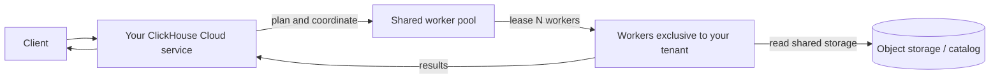
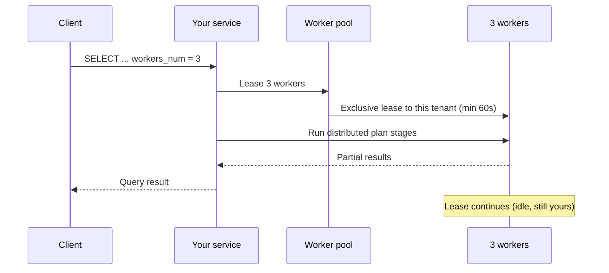
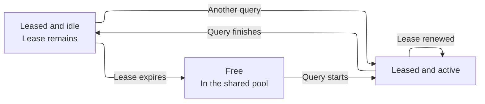
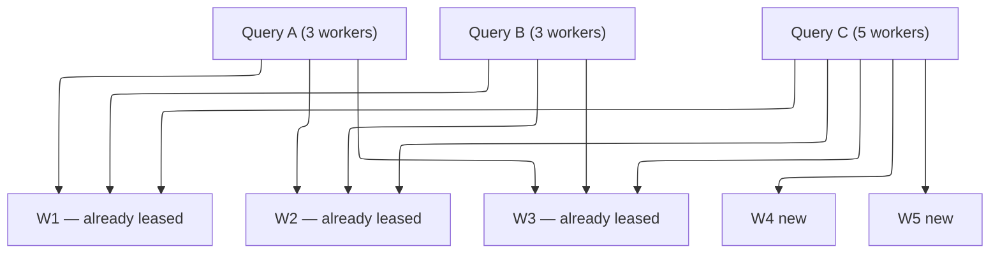

import { PrivatePreviewBadge } from "/snippets/ru/components/PrivatePreviewBadge/PrivatePreviewBadge.jsx";

<PrivatePreviewBadge />

<Note>
  On-Demand Compute доступен в виде закрытой предварительной версии. На него не распространяются SLO и SLA ClickHouse Cloud, кроме того, могут действовать известные и неизвестные ограничения. См. [Ограничения](#limitations).

  [Записаться в список ожидания](https://clickhouse.com/cloud/on-demand-compute-waitlist).
</Note>

On-Demand Compute — это возможность ClickHouse Cloud, которая предоставляет сервису (тенанту) дополнительные вычислительные ресурсы для поддерживаемых рабочих нагрузок без изменения размера сервиса и без создания ещё одного. Эта работа выполняется на воркерах ClickHouse, вне собственных вычислительных ресурсов сервиса. Воркеры берутся из управляемого пула, общего для всех тенантов, однако каждый воркер в один момент времени назначается только одному тенанту.

В период закрытой предварительной версии On-Demand Compute поддерживает подходящие запросы `SELECT`. Вы подключаете запрос к этому механизму с помощью настроек, а ClickHouse назначает воркеры из пула для его выполнения через ваш существующий сервис и конечную точку. Фоновые операции входят в состав этой возможности в целом, но в закрытой предварительной версии не поддерживаются.

Этим она отличается от [разделения вычислительных ресурсов (compute-compute separation)](/ru/products/cloud/features/infrastructure/warehouses). Хранилище предоставляет выделенные долгоживущие вычислительные ресурсы через несколько сервисов, использующих общие данные. On-Demand Compute же предоставляет временные воркеры из общего пула через ваш существующий сервис. В период закрытой предварительной версии такие ресурсы запрашиваются на уровне запроса.

## Когда использовать On-Demand Compute {#when-to-use-on-demand-compute}

В период закрытой предварительной версии используйте On-Demand Compute для подходящих ресурсоёмких запросов `SELECT`, которые вы хотите выполнять вне вычислительных ресурсов основного сервиса:

* **Ad hoc и аналитические запросы:** выполняйте ресурсоёмкие запросы `SELECT` на дополнительных воркерах.
* **Некритичные рабочие нагрузки чтения:** перенесите отдельные операции чтения с основного сервиса.
* **Запросы к озеру данных:** обращайтесь к поддерживаемым данным Apache Iceberg, Delta Lake или `SharedMergeTree` на дополнительных воркерах.
* **Временные дополнительные вычислительные ресурсы:** запрашивайте воркеры для подходящих запросов, не меняя размер основного сервиса.

Закрытая предварительная версия поддерживает только запросы `SELECT`. Воркеры не выполняют запросы `INSERT`, DDL, мутации и фоновые операции.

## Как это работает {#how-it-works}



1. Вы отправляете подходящий `SELECT`-запрос в свой сервис ClickHouse Cloud. Ваша конечная точка, аутентификация и конфигурация RBAC при этом не меняются.
2. Сервис строит распределённый план запроса и запрашивает указанное число воркеров из управляемого пула.
3. ClickHouse выделяет вашему сервису доступных воркеров.
4. Воркеры выполняют стадии плана, назначенные распределённым планировщиком, и читают данные из поддерживаемых хранилищ.
5. Ваш сервис координирует выполнение запроса и возвращает результат клиенту.

В период закрытой предварительной версии каждый воркер располагает `8 vCPUs` и `32 GiB` памяти. Число воркеров, запрашиваемых запросом, задаётся параметром `distributed_plan_workers_num`.

## Использование On-Demand Compute {#using-on-demand-compute}

### Настройки {#settings}

Задайте эти настройки на уровне запроса, пользователя или в SETTINGS PROFILE.

| Настройка                      | Требуемое значение   | Назначение                                                                                                                                                     |
| ------------------------------ | -------------------- | -------------------------------------------------------------------------------------------------------------------------------------------------------------- |
| `make_distributed_plan`        | Yes                  | Включает экспериментальный distributed query plan. Требуется для On-Demand Compute.                                                                            |
| `distributed_plan_workers_num` | Yes                  | Количество воркеров, арендуемых для этого запроса. Если значение равно `0` (значение по умолчанию), запрос выполняется на вашем сервисе, а не в пуле воркеров. |
| `enable_parallel_replicas`     | Yes (установите `0`) | Параллельные реплики несовместимы с distributed plan.                                                                                                          |

<Tip>
  В период предварительного доступа задавайте настройки на уровне запроса либо создайте отдельного пользователя с другими настройками. Тогда сразу видно, какие операторы используют On-Demand Compute, и это помогает избежать наследования профилей Cloud по умолчанию, в которых включены параллельные реплики.
</Tip>

### Пример {#example}

```sql
SELECT
    sum(l_extendedprice * l_discount) AS revenue
FROM lineitem
WHERE
    l_shipdate >= DATE '1994-01-01'
    AND l_shipdate < DATE '1994-01-01' + INTERVAL 1 YEAR
    AND l_discount BETWEEN 0.06 - 0.01 AND 0.06 + 0.01
    AND l_quantity < 24
SETTINGS
    make_distributed_plan = 1,
    distributed_plan_workers_num = 3,
    enable_parallel_replicas = 0
```

Этот запрос запрашивает три воркера. Количество воркеров, которое выделит ClickHouse, зависит от ограничений закрытой предварительной версии и доступной ёмкости пула.

### Аренда воркеров {#worker-leasing}

Аренда воркера длится не менее 60 секунд. Пока запрос выполняется, ClickHouse автоматически продлевает аренду.

После завершения запроса воркеры остаются закреплёнными за сервисом до истечения срока аренды. Пока аренда активна, другой подходящий запрос того же сервиса может повторно использовать эти воркеры, и ClickHouse не потребуется запрашивать новые.

По истечении срока аренды ClickHouse освобождает воркеры от сервиса и завершает их работу.



После завершения запроса эти три воркера остаются закреплёнными за вашим тенантом, но бездействуют до истечения срока аренды.



Если вы отправите ещё один запрос, пока эти воркеры всё ещё арендованы, они будут переиспользованы сразу же (без холодного старта).

Если срок аренды истёк, ClickHouse возвращает воркеры в пул (они завершаются, а не остаются бездействующими в ожидании другого тенанта).

### Одновременные запросы {#concurrent-queries}

Одновременные запросы одного и того же сервиса ClickHouse Cloud могут совместно использовать назначенные воркеры. ClickHouse запрашивает дополнительные воркеры только в том случае, если запросу требуется больше воркеров, чем уже назначено сервису.

Например, если два одновременных запроса требуют по три воркера каждый, они могут использовать одни и те же три воркера. Если ещё один запрос потребует пять воркеров, ClickHouse может задействовать три уже назначенных воркера и запросить ещё два из пула.

См. пример ниже:

```sql
SELECT ... SETTINGS make_distributed_plan = 1, distributed_plan_workers_num = 3, ...;
SELECT ... SETTINGS make_distributed_plan = 1, distributed_plan_workers_num = 3, ...;
```

Они используют одни и те же три воркера.

Если третий параллельный запрос затребует пять воркеров:

```sql
SELECT ... SETTINGS make_distributed_plan = 1, distributed_plan_workers_num = 5, ...;
```

Этот запрос выполняется на трёх уже имеющихся воркерах и двух только что арендованных.



### Когда пул не может удовлетворить запрос {#pool-capacity}

В период закрытой предварительной версии доступность воркеров не гарантируется. Если доступно меньше воркеров, чем запрошено, запрос выполняется с теми воркерами, которые может выделить ClickHouse. Например, запрос на пять воркеров может быть выполнен с тремя.

Если не удаётся получить ни одного воркера, запрос завершается с ошибкой:

```text
No stateless workers available for tenant 'bronzeaws-cm-72': the discovery service leased none.
```

Повторите запрос. Если проблема сохраняется, обратитесь к команде сопровождения аккаунта ClickHouse — возможно, пул предварительной версии исчерпан или неверно масштабирован.

## Monitoring {#monitoring}

Используйте `system.query_log` в вашем сервисе, чтобы узнать, сколько воркеров было выделено для вашего запроса.

### Количество выделенных воркеров {#worker-provided}

```sql
SELECT
    ProfileEvents['StatelessWorkerRequested'],
    ProfileEvents['StatelessWorkerProvided']
FROM clusterAllReplicas(default, system.query_log)
WHERE query_id = '<YOUR_QUERY_ID>'
  AND type != 'QueryStart';
```

<Tip>
  Задайте `log_comment = 'on-demand'` (или имя рабочей нагрузки) для запросов On-Demand, чтобы фильтровать их без разбора `Settings`.
</Tip>

## Доступные регионы {#available-regions}

Воркеры On-Demand Compute работают в том же регионе, что и ваш сервис ClickHouse Cloud. На этапе закрытой предварительной версии эта возможность будет доступна лишь у отдельных облачных провайдеров и в отдельных регионах. При записи в список ожидания вы можете указать предпочтительного провайдера и регион, чтобы ClickHouse оценил возможность вашего участия.

## Тарификация {#pricing}

В период закрытой предварительной версии функция On-Demand Compute бесплатна, но с ограничением по объёму использования (см. [Ограничения](#limitations)). Если вам требуется увеличить это ограничение, обратитесь к команде сопровождения аккаунта ClickHouse.

Тарификация появится после завершения предварительной версии. Участники предварительной версии получат уведомление до перевода функции в статус бета и до начала взимания платы.

Предполагается та же модель, что и для вычислительных ресурсов ClickHouse Cloud: вы платите за используемые вычислительные ресурсы (арендованное время воркеров), а не за объём просканированных данных или число прочитанных строк.

## Ограничения {#limitations}

Приведённые ниже ограничения действуют в период закрытой предварительной версии. Возможны и другие ограничения. О непредвиденном поведении сообщайте в ClickHouse Support или команде сопровождения аккаунта ClickHouse.

* **Только запросы `SELECT`.** Воркеры не выполняют запросы `INSERT`, мутации, DDL и фоновые операции.
* **Поддерживаемые данные.** Закрытая предварительная версия поддерживает Apache Iceberg, Delta Lake и `SharedMergeTree`.
* **Параллельные реплики.** Параллельные реплики должны быть отключены.
* **Размер воркера.** Каждый воркер имеет `8 vCPUs` и `32 GiB` памяти.
* **Ограничение на число воркеров.** В период закрытой предварительной версии каждый запрос может запросить не более пяти воркеров.
* **Ёмкость пула.** Доступность воркеров не гарантируется. Запрос может получить меньше воркеров, чем запрашивалось. Если свободных воркеров нет, запрос завершается ошибкой.
* **Производительность.** Производительность зависит от запроса. Назначение воркеров, распределённое планирование и передача этапов плана могут увеличивать задержку. Некоторые виды запросов могут выполняться медленнее, чем на основном сервисе.
* **Совместимость запросов.** Распределённый планировщик способен выполнить удалённо не любой план запроса. Для неподдерживаемых запросов может возвращаться исключение `SUPPORT_IS_DISABLED`.

К типичным сбоям относятся следующие:

| Область                                                                    | Что происходит                                                                                        |
| -------------------------------------------------------------------------- | ----------------------------------------------------------------------------------------------------- |
| Параллельные реплики                                                       | Отклоняются; отключите указанные выше настройки.                                                      |
| Оконные функции с `PARTITION BY`                                           | Часто отклоняются, пока планировщик не сможет выполнять перераспределение по ключу партиционирования. |
| Чтение таблиц `system`                                                     | Они не основаны на общем хранилище.                                                                   |
| Коррелированные подзапросы некоторых видов                                 | Могут быть отклонены или переписаны менее эффективно.                                                 |
| Проекции, индексы пропуска данных при чтении данных и компиляция выражений | Отключаются для запроса вместо возврата исключения.                                                   |

## Roadmap {#roadmap}

On-Demand Compute — это основа. Что уже в работе или запланировано далее:

* Устранение известных ограничений (пробелы, связанные с `SUPPORT_IS_DISABLED`).
* Пулы воркеров разных размеров.
* Стабилизация производительности запросов до уровня выполнения с сохранением состояния.
* Поддержка фоновых слияний.
* Тарификация.
* Калибровка автомасштабирования пула воркеров.
* Метрики и мониторинг в консоли.
* Отдельные разрешения для On-Demand Compute.

## Security {#security}

On-Demand Compute не меняет способ подключения к ClickHouse Cloud. Клиенты по-прежнему аутентифицируются в вашем сервисе. Воркеры никогда не предоставляют публичный эндпоинт запроса.

Отдельные роли и разрешения для On-Demand в предварительную версию не входят (см. [Roadmap](#roadmap)). До тех пор любой, кто может выполнить `SELECT` с указанными выше настройками в вашем сервисе, может использовать воркеры — в пределах квоты предварительной версии.

## FAQ {#faq}

<AccordionGroup>
  <Accordion title="Является ли On-Demand Compute решением с открытым исходным кодом?">
    Нет. Это архитектура ClickHouse Cloud: ClickHouse server (distributed plan), data plane (пул воркеров и lease-механизм) и control plane. Экспериментальная настройка `make_distributed_plan` в ClickHouse есть, однако общий пул воркеров и stateless-выполнение доступны только в Cloud.
  </Accordion>

  <Accordion title="Нужна ли определённая версия для участия в закрытой предварительной версии?">
    Да. Команда ClickHouse подтвердит, требуется ли вашему сервису upgrade перед участием в закрытой предварительной версии. В ходе предварительной версии могут понадобиться дополнительные обновления.
  </Accordion>

  <Accordion title="Каким будет ценообразование?">
    В период закрытой предварительной версии дополнительная плата не взимается — в рамках действующих ограничений предварительной версии. Цены для последующих стадий выпуска будут объявлены до того, как начнёт взиматься плата. При этом ценообразование следует той же философии, что и в ClickHouse Cloud: плата взимается за использованный compute, а не за объём просканированных данных или количество прочитанных строк. Точные тарифы будут опубликованы до GA или до начала биллинга на этапе бета-версии.
  </Accordion>

  <Accordion title="Можно ли использовать это в продакшне?">
    Вы можете запускать реальные рабочие нагрузки, но это закрытая предварительная версия: есть известные и неизвестные ограничения, а для доступности пула воркеров не предусмотрены SLO/SLA. ClickHouse готов поддерживать ранних пользователей, однако воспринимайте это как предварительную версию, а не как гарантию уровня продакшна.
  </Accordion>

  <Accordion title="Чем это отличается от autoscaling моего сервиса?">
    Autoscaling изменяет compute, выделенный вашему основному сервису. В период закрытой предварительной версии On-Demand Compute даёт подходящим `SELECT` queries временный доступ к воркерам из управляемого пула, не меняя размер основного сервиса. Autoscaling управляет постоянной ёмкостью сервиса, тогда как On-Demand Compute предоставляет временный compute для конкретных рабочих нагрузок.
  </Accordion>

  <Accordion title="Чем это отличается от хранилища или разделения вычислительных ресурсов?">
    Разделение вычислительных ресурсов предоставляет выделенный compute через несколько сервисов ClickHouse Cloud, использующих общие данные. On-Demand Compute предоставляет временный compute из управляемого пула через ваш существующий сервис. В период закрытой предварительной версии этот compute запрашивается на уровне запроса. В более широком виде эта возможность рассчитана на поддержку как query execution, так и background operations.
  </Accordion>

  <Accordion title="Где можно задать вопросы?">
    Обратитесь к вашей команде сопровождения аккаунта ClickHouse — она познакомит вас с продакт-менеджером On-Demand Compute.
  </Accordion>

  <Accordion title="Где сообщить об ошибках?">
    Создайте тикет в поддержку (severity 3) или сообщите продакт-менеджеру. Укажите `query_id` и полный текст исключения.
  </Accordion>

  <Accordion title="Доступно ли это в ClickHouse BYOC или ClickHouse Private?">
    Нет. Закрытая предварительная версия недоступна в ClickHouse BYOC и ClickHouse Private.
  </Accordion>
</AccordionGroup>