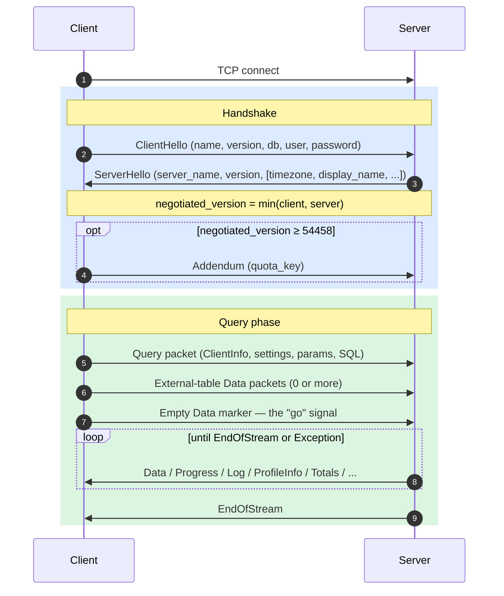
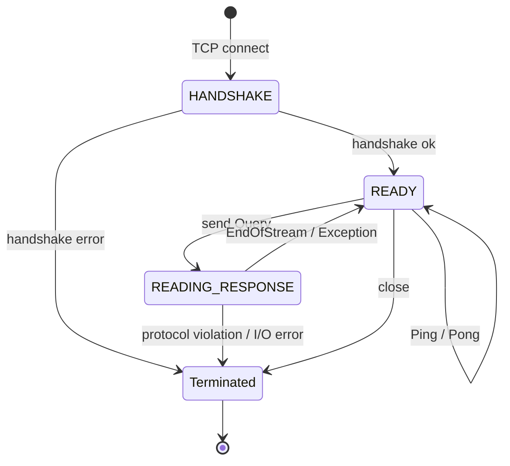
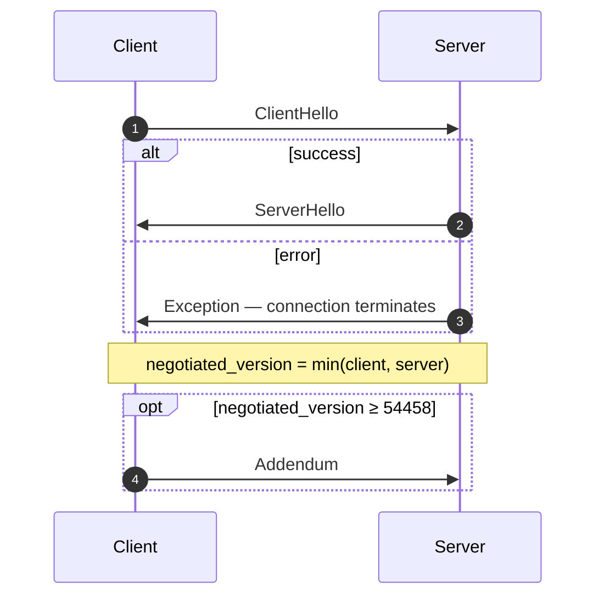
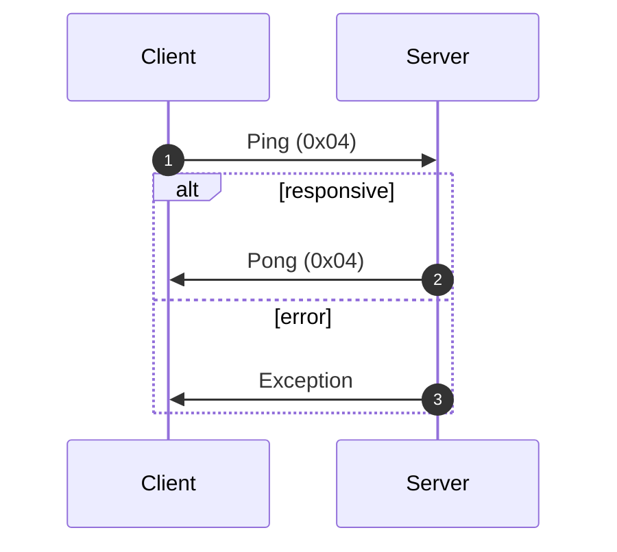
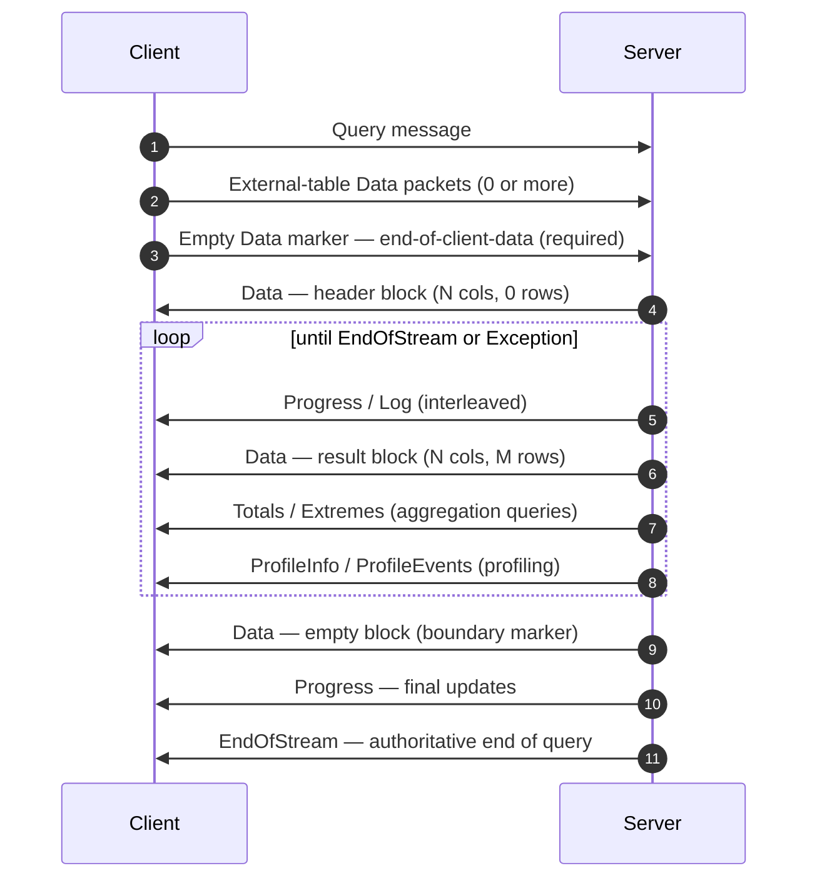
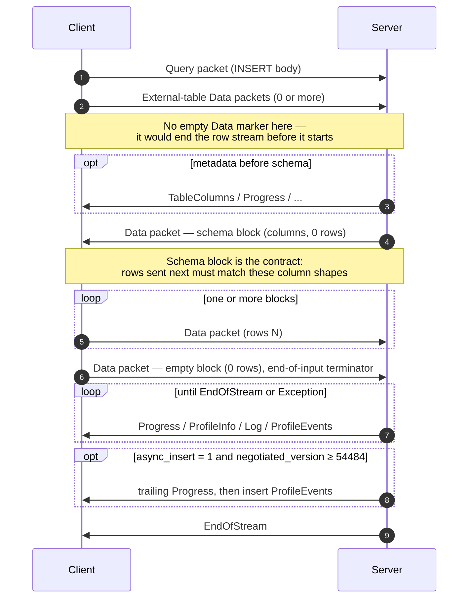
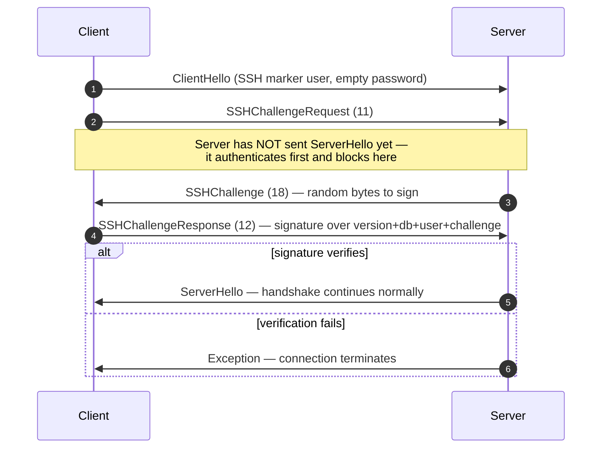

Собственный протокол — это бинарный протокол с установлением соединения, по которому клиенты и серверы ClickHouse взаимодействуют через TCP. По нему передаются SQL-запросы, результаты запросов, полезная нагрузка `INSERT`, телеметрия выполнения и сигналы об ошибках. Именно этот протокол используют клиент командной строки, драйвер на C++ и большинство сторонних нативных драйверов.

На этой странице описан сам протокол: формирование пакетов, конечный автомат соединения, согласование версий и тело каждого сообщения, кроме `Block`. Содержимое пакетов семейства `Data` (`Block`, его столбцы и кодирование для каждого типа) — отдельная тема, которой посвящена спецификация [формата Native](/ru/resources/develop-contribute/native-protocol/format).

<Info>
  **Сопутствующая спецификация**

  Эта страница входит в пару документов и публикуется вместе со спецификацией [формата Native](/ru/resources/develop-contribute/native-protocol/format). Зоны ответственности чётко разделены: эта страница описывает пакетный и транспортный уровни, а спецификация формата Native — байты внутри пакетов семейства `Data`.
</Info>

Несколько свойств действуют повсюду. Протокол бинарный и позиционный: теги полей используются только внутри `BlockInfo`, поэтому один байт не на своём месте нарушает синхронизацию всего последующего потока. Протокол работает с сохранением состояния, и каждое TCP-соединение обрабатывает только один запрос за раз — мультиплексирование не поддерживается. Целые числа фиксированной ширины хранятся в порядке little-endian.

## Обзор {#overview}

| Свойство          | Значение                                                                                        |
| ----------------- | ----------------------------------------------------------------------------------------------- |
| Транспорт         | TCP, опционально поверх TLS                                                                     |
| Порядок байтов    | Little-endian для целых чисел фиксированной ширины                                              |
| Кодирование       | Бинарное и позиционное (без тегов полей, за исключением `BlockInfo`)                            |
| Модель соединения | С сохранением состояния, один запрос за раз, без мультиплексирования                            |
| Версионирование   | Версия согласуется при рукопожатии; доступность отдельных возможностей зависит от версии        |
| Формат данных     | [Формат Native](/ru/resources/develop-contribute/native-protocol/format) для всех табличных данных |

Каждое передаваемое сообщение начинается с кода типа пакета в формате `VarUInt`, за которым следует тело; его структура зависит от этого кода и от согласованной версии протокола.

Соединение проходит через три фазы: однократное рукопожатие, затем произвольное число обменов `Ping` или `Query` и, наконец, закрытие:



Собственный TCP-протокол всегда передаёт табличные данные в формате Native — вне зависимости от предложения `FORMAT` в SQL-запросе. Преобразование в `RowBinary`, `CSV`, `JSON` и другие форматы — задача клиента, которую он выполняет после декодирования блоков Native. (HTTP-интерфейс обрабатывается по другому пути в коде, где предложение `FORMAT` *действительно* учитывается; HTTP в данном документе не рассматривается.)

## Безопасность {#security}

### Защита на транспортном уровне (TLS) {#transport-security}

TLS работает на транспортном уровне, под протоколом. Когда TLS включён, шифруется весь TCP-поток, а сообщения протокола побайтово совпадают независимо от того, используется TLS или нет.

### Аутентификация {#authentication}

Аутентификация выполняется во время рукопожатия, в сообщении [`ClientHello`](#clienthello). Поля `user` и `password` передаются как строки в открытом виде, поэтому учётные данные при передаче защищает только шифрование на транспортном уровне (TLS).

Пустое поле `user` сервер интерпретирует как настроенного пользователя сеанса по умолчанию, то есть как значение настройки сервера `default_session_user` (по умолчанию — `default`), которое может быть переопределено для отдельного listener в секции `protocols`. Если на сервере в качестве пользователя сеанса по умолчанию задано пустое значение или версия сервера ниже 26.8, запрос с пустым полем `user` отклоняется с исключением. Обратите внимание, что `clickhouse-client` никогда не отправляет пустое имя пользователя: он подставляет `default` на стороне клиента.

Аутентификация SSH по схеме «запрос — ответ» доступна начиная с версии протокола 54466 — см. раздел [Аутентификация SSH по схеме «запрос — ответ»](#ssh-authentication).

### Межсерверный секрет {#inter-server-secret}

При выполнении распределённого запроса серверы аутентифицируют друг друга, доказывая знание общего секрета, — при этом сам секрет по сети не передаётся. Каждый пакет Query содержит в поле 4 пакета [`Query`](#query) 32-байтовый хеш SHA-256 `auth_hash`, вычисляемый по соли, nonce, настроенному секрету и тексту запроса; принимающий сервер вычисляет хеш заново и сравнивает значения. Эта возможность доступна при наличии флага возможностей `INTERSERVER_SECRET` (v54441). Внешние клиенты всегда передают в этом поле пустую строку. См. раздел [Межсерверная аутентификация](#inter-server-authentication).

## Версионирование и флаги возможностей {#versioning-and-feature-gates}

### Согласование версии {#version-negotiation}

Во время рукопожатия клиент и сервер сообщают максимальную поддерживаемую ими версию протокола. **Согласованной версией** становится меньшая из них:

```text
negotiated_version = min(client_version, server_version)
```

Во всех последующих сообщениях согласованная версия определяет, какие поля присутствуют в передаваемых данных.

### Флаги возможностей {#feature-gates}

Каждая возможность определяется версией протокола, в которой она появилась, и считается **активной**, если согласованная версия больше или равна этому номеру.

<Warning>
  Если возможность активна, её поля **обязательно** должны присутствовать в передаваемых данных. Протокол строго позиционный, поэтому пропуск поля, зависящего от флага возможности, нарушает поток байтов для всех последующих полей.
</Warning>

### Таблица возможностей {#feature-table}

| Возможность                                                  | Версия | Затрагивает                      | Влияние на wire-формат                                                                                                                                                                                                                                                                                                                                                                                                                                                                                                                                                                                                                                                                                                                                                                    |
| ------------------------------------------------------------ | ------ | -------------------------------- | ----------------------------------------------------------------------------------------------------------------------------------------------------------------------------------------------------------------------------------------------------------------------------------------------------------------------------------------------------------------------------------------------------------------------------------------------------------------------------------------------------------------------------------------------------------------------------------------------------------------------------------------------------------------------------------------------------------------------------------------------------------------------------------------- |
| BLOCK&#95;INFO                                               | all    | Block                            | Добавляет префикс BlockInfo (`is_overflows`, `bucket_number`) к каждому Block.                                                                                                                                                                                                                                                                                                                                                                                                                                                                                                                                                                                                                                                                                                            |
| CLIENT&#95;INFO                                              | 54032  | Query                            | Добавляет блок ClientInfo в тело Query.                                                                                                                                                                                                                                                                                                                                                                                                                                                                                                                                                                                                                                                                                                                                                   |
| TIMEZONE                                                     | 54058  | ServerHello                      | Добавляет поле `timezone` в ServerHello.                                                                                                                                                                                                                                                                                                                                                                                                                                                                                                                                                                                                                                                                                                                                                  |
| QUOTA&#95;KEY&#95;IN&#95;CLIENT&#95;INFO                     | 54060  | ClientInfo                       | Добавляет поле `quota_key` в ClientInfo.                                                                                                                                                                                                                                                                                                                                                                                                                                                                                                                                                                                                                                                                                                                                                  |
| DISPLAY&#95;NAME                                             | 54372  | ServerHello                      | Добавляет поле `display_name` в ServerHello.                                                                                                                                                                                                                                                                                                                                                                                                                                                                                                                                                                                                                                                                                                                                              |
| VERSION&#95;PATCH                                            | 54401  | ServerHello, ClientInfo          | Добавляет поле `version_patch` в оба пакета.                                                                                                                                                                                                                                                                                                                                                                                                                                                                                                                                                                                                                                                                                                                                              |
| SERVER&#95;LOGS                                              | 54406  | Log                              | Сервер отправляет пакеты Log, если задан `send_logs_level`.                                                                                                                                                                                                                                                                                                                                                                                                                                                                                                                                                                                                                                                                                                                               |
| COLUMN&#95;DEFAULTS&#95;METADATA                             | 54410  | TableColumns                     | Сервер может отправить пакет [`TableColumns`](#tablecolumns) (тип 11) с метаданными значений столбцов по умолчанию перед блоком схемы INSERT/input. Отправляется, только если согласованная версия ≥ 54410 **и** включена настройка `input_format_defaults_for_omitted_fields`. В более ранних версиях пакет не отправляется никогда, поэтому клиенты не должны его ожидать.                                                                                                                                                                                                                                                                                                                                                                                                              |
| WRITE&#95;CLIENT&#95;INFO                                    | 54420  | Progress                         | Добавляет `wrote_rows` и `wrote_bytes` в Progress. (Вопреки названию, эта возможность **не** управляет блоком ClientInfo — за него отвечает `CLIENT_INFO` (v54032).)                                                                                                                                                                                                                                                                                                                                                                                                                                                                                                                                                                                                                      |
| SETTINGS&#95;SERIALIZED&#95;AS&#95;STRINGS                   | 54429  | Query (кодирование настроек)     | Меняет **способ** кодирования списка настроек, который передаётся всегда; **не** определяет, отправляются ли настройки. Начиная с v54429 каждая настройка записывается как `(name, flags, value-as-string)`; более старые узлы записывают `(name, type-specific-binary-value)` без флагов. См. [Setting](#setting).                                                                                                                                                                                                                                                                                                                                                                                                                                                                       |
| INTERSERVER&#95;SECRET                                       | 54441  | Query                            | Добавляет в Query поле `auth_hash` для межсерверного взаимодействия — SHA-256 с солью от секрета кластера, а не сам секрет. Внешние клиенты отправляют пустую строку. См. [Межсерверная аутентификация](#inter-server-authentication).                                                                                                                                                                                                                                                                                                                                                                                                                                                                                                                                                    |
| OPEN&#95;TELEMETRY                                           | 54442  | ClientInfo                       | Добавляет контекст трассировки OpenTelemetry в ClientInfo.                                                                                                                                                                                                                                                                                                                                                                                                                                                                                                                                                                                                                                                                                                                                |
| DISTRIBUTED&#95;DEPTH                                        | 54448  | ClientInfo                       | Добавляет поле `distributed_depth` в ClientInfo.                                                                                                                                                                                                                                                                                                                                                                                                                                                                                                                                                                                                                                                                                                                                          |
| INITIAL&#95;QUERY&#95;START&#95;TIME                         | 54449  | ClientInfo                       | Добавляет поле `initial_time` (Int64, фиксированной ширины).                                                                                                                                                                                                                                                                                                                                                                                                                                                                                                                                                                                                                                                                                                                              |
| PROFILE&#95;EVENTS                                           | 54451  | ProfileEvents                    | Сервер отправляет пакеты ProfileEvents во время выполнения запроса.                                                                                                                                                                                                                                                                                                                                                                                                                                                                                                                                                                                                                                                                                                                       |
| PARALLEL&#95;REPLICAS                                        | 54453  | ClientInfo                       | Добавляет в ClientInfo поля для координации параллельных реплик.                                                                                                                                                                                                                                                                                                                                                                                                                                                                                                                                                                                                                                                                                                                          |
| CUSTOM&#95;SERIALIZATION                                     | 54454  | Block (Column)                   | Добавляет байт `has_custom_serialization` после строки типа каждого столбца.                                                                                                                                                                                                                                                                                                                                                                                                                                                                                                                                                                                                                                                                                                              |
| ADDENDUM                                                     | 54458  | Handshake                        | После рукопожатия клиент отправляет дополнение (`quota_key`).                                                                                                                                                                                                                                                                                                                                                                                                                                                                                                                                                                                                                                                                                                                             |
| PARAMETERS                                                   | 54459  | Query                            | Добавляет список параметров в тело Query.                                                                                                                                                                                                                                                                                                                                                                                                                                                                                                                                                                                                                                                                                                                                                 |
| SERVER&#95;QUERY&#95;TIME&#95;IN&#95;PROGRESS                | 54460  | Progress                         | Добавляет поле `elapsed_ns` в Progress.                                                                                                                                                                                                                                                                                                                                                                                                                                                                                                                                                                                                                                                                                                                                                   |
| PASSWORD&#95;COMPLEXITY&#95;RULES                            | 54461  | ServerHello                      | Добавляет в ServerHello список регулярных выражений политики паролей и соответствующих им понятных пользователю сообщений.                                                                                                                                                                                                                                                                                                                                                                                                                                                                                                                                                                                                                                                                |
| INTERSERVER&#95;SECRET&#95;V2                                | 54462  | ServerHello                      | Добавляет в ServerHello 8-байтовый nonce типа `UInt64`. Используется для подписи межсерверных запросов; внешние клиенты декодируют его и игнорируют.                                                                                                                                                                                                                                                                                                                                                                                                                                                                                                                                                                                                                                      |
| TOTAL&#95;BYTES&#95;IN&#95;PROGRESS                          | 54463  | Progress                         | Добавляет в Progress поле `total_bytes_to_read` (VarUInt) между `total_rows` и `wrote_rows`.                                                                                                                                                                                                                                                                                                                                                                                                                                                                                                                                                                                                                                                                                              |
| TIMEZONE&#95;UPDATES                                         | 54464  | TimezoneUpdate                   | Добавляет серверный пакет `TimezoneUpdate` (тип 17). Тело: одна `String` с часовым поясом сеанса. Отправляется только инициализатором табличной функции `input` сразу после блока схемы input, чтобы клиент разбирал отправляемые им строки с учётом `session_timezone` сервера. См. [TimezoneUpdate](#timezoneupdate).                                                                                                                                                                                                                                                                                                                                                                                                                                                                   |
| SPARSE&#95;SERIALIZATION                                     | 54465  | Block (Column)                   | Сервер может установить `has_custom_serialization = 1` и отправить столбец в разреженном кодировании. Wire-формат: 1 байт вида (0x01 = SPARSE), затем поток смещений VarUInt, завершающийся EOG, затем значения, отличные от значений по умолчанию, плотно закодированные во внутреннем типе. См. [kind&#95;stack и разреженное кодирование](/ru/resources/develop-contribute/native-protocol/format#kind-stack-and-sparse-encoding).                                                                                                                                                                                                                                                                                                                                                        |
| SSH&#95;AUTHENTICATION                                       | 54466  | Процесс аутентификации           | Добавляет аутентификацию SSH по схеме «запрос — ответ». Включается явно: для этого клиент отправляет `user` вида `" SSH KEY AUTHENTICATION " + <real_user>` с пустым паролем. См. [Аутентификация SSH по схеме «запрос — ответ»](#ssh-authentication).                                                                                                                                                                                                                                                                                                                                                                                                                                                                                                                                    |
| TABLE&#95;READ&#95;ONLY&#95;CHECK                            | 54467  | TablesStatusResponse             | Добавляет флаг `is_readonly` в строку каждой таблицы в TablesStatusResponse. Для внешних клиентов, не отправляющих `TablesStatusRequest`, wire-формат не меняется.                                                                                                                                                                                                                                                                                                                                                                                                                                                                                                                                                                                                                        |
| SYSTEM&#95;KEYWORDS&#95;TABLE                                | 54468  | системные таблицы                | Сервер заполняет `system.keywords`, чтобы стандартный `clickhouse-client` мог автодополнять ключевые слова. Wire-формат нативного протокола не меняется.                                                                                                                                                                                                                                                                                                                                                                                                                                                                                                                                                                                                                                  |
| ROWS&#95;BEFORE&#95;AGGREGATION                              | 54469  | ProfileInfo                      | Добавляет в конец ProfileInfo поля `applied_aggregation` (Bool) и `rows_before_aggregation` (VarUInt) в указанном порядке.                                                                                                                                                                                                                                                                                                                                                                                                                                                                                                                                                                                                                                                                |
| CHUNKED&#95;PROTOCOL                                         | 54470  | Фрейминг соединения              | Тело каждого пакета оборачивается во фрагментированный фрейминг. Согласуется в Addendum: ServerHello передаёт предпочтения сервера для каждого направления, а Addendum — окончательный выбор клиента. См. [Фрагментированный фрейминг](#chunked-framing).                                                                                                                                                                                                                                                                                                                                                                                                                                                                                                                                 |
| VERSIONED&#95;PARALLEL&#95;REPLICAS&#95;PROTOCOL             | 54471  | ServerHello, Addendum            | Обе стороны обмениваются версией протокола координации параллельных реплик в виде `VarUInt`. Поле в ServerHello расположено **сразу после `protocol_version`** (перед `timezone`). Поле в Addendum добавляется после строк chunked-протокола. Текущее значение: `8` (`DBMS_PARALLEL_REPLICAS_PROTOCOL_VERSION`). Версия `8` добавляет [`MergeTreeAllRangesAnnouncementResponse`](#mergetreeallrangesannouncementresponse) (клиентский пакет `14`): если согласованная версия параллельных реплик `≥ 8`, инициатор отвечает на каждое объявление ведомой реплики в режиме, отличном от `Default`, авторитетным списком кусков для этого потока, а ведомая реплика дожидается его, прежде чем отправлять запросы на чтение. В версиях ниже `8` объявление отправляется без ожидания ответа. |
| INTERSERVER&#95;EXTERNALLY&#95;GRANTED&#95;ROLES             | 54472  | Query                            | Добавляет поле `String external_roles` в тело Query между терминатором списка настроек и хешем межсерверного секрета. Внешние клиенты отправляют пустой список ролей (один байт `0x00`, т. е. VarUInt 0 внутри оболочки String).                                                                                                                                                                                                                                                                                                                                                                                                                                                                                                                                                          |
| V2&#95;DYNAMIC&#95;AND&#95;JSON&#95;SERIALIZATION            | 54473  | Тело столбца                     | Сервер может использовать сериализацию V2 для типов столбцов `Dynamic` и `JSON` — от этого зависит, какая версия `state_prefix` используется. См. [версионируемые типы](/ru/resources/develop-contribute/native-protocol/format#versioned-types).                                                                                                                                                                                                                                                                                                                                                                                                                                                                                                                                            |
| SERVER&#95;SETTINGS                                          | 54474  | ServerHello                      | Сервер передаёт свои настройки, отличные от значений по умолчанию, в виде списка в конце ServerHello, после `nonce`. Формат: тройки `(key, flags, value)`, завершающиеся пустым ключом, — так же, как список настроек в пакете Query.                                                                                                                                                                                                                                                                                                                                                                                                                                                                                                                                                     |
| QUERY&#95;AND&#95;LINE&#95;NUMBERS                           | 54475  | ClientInfo                       | Добавляет `script_query_number` (VarUInt) и `script_line_number` (VarUInt) в конец ClientInfo. Используется clickhouse-client, чтобы указывать источник ошибки в скриптах из нескольких выражений; внешние клиенты отправляют `0, 0`.                                                                                                                                                                                                                                                                                                                                                                                                                                                                                                                                                     |
| JWT&#95;IN&#95;INTERSERVER                                   | 54476  | ClientInfo                       | Добавляет UInt8-признак наличия JWT и необязательное поле `String jwt` в конец ClientInfo. Внешние клиенты (без JWT) отправляют байт `0x00`. (В C++ константа называется `DBMS_MIN_REVISON_WITH_JWT_IN_INTERSERVER` — обратите внимание на опечатку в имени.)                                                                                                                                                                                                                                                                                                                                                                                                                                                                                                                             |
| QUERY&#95;PLAN&#95;SERIALIZATION                             | 54477  | ServerHello, пакет QueryPlan     | В ServerHello после настроек сервера добавляется поле `VarUInt query_plan_serialization_version`. Также вводится `ClientPacket::QueryPlan` (код `13`) для межсерверной передачи заранее построенных планов запросов — внешние клиенты его никогда не отправляют. В версии сериализации плана запроса `10` перед сериализованным планом добавляются `VarUInt max_threads` и `Bool concurrency_control`; если любое из этих значений отличается от значения по умолчанию, инициаторы для узлов с версией ниже `10` передают SQL, чтобы узел построил план на основе переданных настроек запроса.                                                                                                                                                                                            |
| PARALLEL&#95;BLOCK&#95;MARSHALLING                           | 54478  | Block (Column)                   | Сервер может оборачивать столбцы в `ColumnBLOB` (встроенное сжатие) для параллельной обработки. Применяется, только если для запроса включено сжатие AND `rows > 1`; в остальных случаях используется обычный wire-формат столбцов. Для клиентов, которые никогда не включают сжатие в исходящих пакетах Query, ничего не меняется.                                                                                                                                                                                                                                                                                                                                                                                                                                                       |
| VERSIONED&#95;CLUSTER&#95;FUNCTION&#95;PROTOCOL              | 54479  | ServerHello                      | Добавляет `VarUInt cluster_function_protocol_version` в конец ServerHello. Используется для табличных функций `*Cluster` (`s3Cluster` и др.). Текущее значение: `8` (`DBMS_CLUSTER_PROCESSING_PROTOCOL_VERSION`); версия `7` зарезервирована за функциональностью из закрытого репозитория (компактизация Iceberg), а `8` добавляет необязательный `read_source_index` в полезную нагрузку межсерверной задачи чтения кластера (тело `ReadTaskResponse`, которое здесь не описывается — см. ниже). Внешние клиенты декодируют это поле и игнорируют его.                                                                                                                                                                                                                                  |
| OUT&#95;OF&#95;ORDER&#95;BUCKETS&#95;IN&#95;AGGREGATION      | 54480  | BlockInfo                        | Добавляет поле 3 (`out_of_order_buckets: Vec<Int32>`) в поток полей BlockInfo с тегами. Декодируется как `[VarUInt count][Int32]*count`. Внешние клиенты сами его не отправляют; декодер считывает любой непустой список, присланный сервером.                                                                                                                                                                                                                                                                                                                                                                                                                                                                                                                                            |
| COMPRESSED&#95;LOGS&#95;PROFILE&#95;EVENTS&#95;COLUMNS       | 54481  | Log, ProfileEvents, TableColumns | Сервер может оборачивать тела пакетов [`Log`](#log), [`ProfileEvents`](#profileevents) и [`TableColumns`](#tablecolumns) в [кадр сжатия](/ru/resources/develop-contribute/native-protocol/format#compression-frame). Начиная с этой версии все три тела проходят через один и тот же выходной путь с необязательным сжатием, который становится настоящим кадром сжатия только при `compression = true` для запроса. Для клиентов, которые никогда не включают сжатие в исходящих пакетах Query, ничего не меняется.                                                                                                                                                                                                                                                                         |
| REPLICATED&#95;SERIALIZATION                                 | 54482  | Block (Column)                   | Сервер может отправлять столбцы с kind&#95;stack `0x04 = REPLICATED` — компактной словарной формой для повторяющихся значений; см. [kind&#95;stack и разреженное кодирование](/ru/resources/develop-contribute/native-protocol/format#kind-stack-and-sparse-encoding). До этой версии записывающая сторона разворачивала такие столбцы перед отправкой. Декодируется поиском по индексу (`elements[indexes[i]]` для каждой строки); поддерживаются листовые типы, а также вложенные типы внутри `Nullable`/`Array`/`Tuple`/`Map`/`Nested`/`LowCardinality`.                                                                                                                                                                                                                                  |
| NULLABLE&#95;SPARSE&#95;SERIALIZATION                        | 54483  | Block (Column)                   | Сочетает разреженную сериализацию с `Nullable(T)`. До этой версии записывающая сторона разворачивала разреженные данные для столбцов Nullable перед отправкой; начиная с v54483 данные передаются в виде разреженного представления поверх Nullable. См. [kind&#95;stack и разреженное кодирование](/ru/resources/develop-contribute/native-protocol/format#kind-stack-and-sparse-encoding).                                                                                                                                                                                                                                                                                                                                                                                                 |
| PROGRESS&#95;IN&#95;ASYNC&#95;INSERT                         | 54484  | Progress (INSERT)                | При **асинхронной** вставке INSERT (`async_insert = 1`) после сброса данных вставки сервер отправляет дополнительный пакет [`Progress`](#progress), затем `ProfileEvents` этой вставки, и только потом `EndOfStream`. Применяется, если *согласованная* версия ≥ 54484; в более ранних версиях сервер не отправляет этот завершающий Progress. Wire-формат Progress не меняется — новой является лишь сама отправка. На практике приращение содержит прошедшее время, а счётчики записанных строк передаются в сопутствующих ProfileEvents. Клиенту, который уже обрабатывает чередующиеся пакеты Progress, не нужно менять формат — достаточно корректно принять ещё один пакет.                                                                                                         |
| CLIENT&#95;AGENT&#95;IN&#95;CLIENT&#95;INFO                  | 54485  | ClientInfo                       | Добавляет завершающее поле `client_agent` типа `String` в ClientInfo. Эталонный клиент автоматически определяет идентификатор агента по окружению (например, `claude-code`, `cursor`, `gemini-cli` или значение переменной `AGENT`); внешний клиент, ничего не обнаруживший, отправляет пустую строку. Обязательно при согласованной версии ≥ 54485 — без него нарушается разбор оставшейся части пакета Query.                                                                                                                                                                                                                                                                                                                                                                           |
| INTERNAL&#95;QUERY&#95;FLAG                                  | 54486  | ClientInfo                       | Добавляет завершающее поле `is_internal` типа `UInt8` в ClientInfo. `1` означает внутренний запрос сервера (не инициированный пользователем); значение передаётся в удалённые запросы, чтобы их строки в `system.query_log` помечались как внутренние; внешние клиенты отправляют `0`. Обязательно при согласованной версии ≥ 54486 — без него нарушается разбор оставшейся части пакета Query.                                                                                                                                                                                                                                                                                                                                                                                           |
| INTERSERVER&#95;CURRENT&#95;ROLES                            | 54488  | ClientInfo                       | Добавляет завершающий необязательный список строк `current_roles` в ClientInfo (`[UInt8 present]`, затем, если `1`, — `[VarUInt count][String]*count`), а для межсерверных запросов расширяет `auth_hash`, включая в него сериализованный список. Передаёт имена активных (включённых) ролей инициатора, чтобы вторичный узел применял политики строк так же, а не переключался на роли пользователя по умолчанию. Заполняется только для межсерверных запросов и только при `push_external_roles_in_interserver_queries = 1`; внешние клиенты отправляют `0` (отсутствует). Обязательно при согласованной версии ≥ 54488 — без байта-признака нарушается разбор оставшейся части пакета Query.                                                                                           |
| CURRENT&#95;AGGREGATION&#95;VARIANT&#95;SELECTION&#95;METHOD | 54489  | Агрегация (двухуровневые бакеты) | Метод агрегации для одного ключа `String` определяется настройкой `enable_packed_string_keys_in_aggregation`. Узел с более ранней ревизией всегда использует упакованный метод и не знает об этой настройке, поэтому при обмене с ним двухуровневыми бакетами один и тот же ключ попадал бы в разные бакеты. Для такого узла инициатор действует консервативно: обнуляет для него пороги двухуровневой агрегации и сам перераспределяет по бакетам его одноуровневые блоки. Сравнивается ревизия узла, а не его версия, поскольку метод может измениться в пределах одного релиза. Wire-формат нативного протокола не меняется.                                                                                                                                                           |
| HTTP&#95;HANDLER&#95;IN&#95;CLIENT&#95;INFO                  | 54490  | ClientInfo                       | Добавляет `http_handler_name` и `http_request_url` (оба типа `String`) в **HTTP**-ветку ClientInfo сразу после `http_referer`. Они содержат имя сопоставленного HTTP-обработчика, определённого через SQL, и URL запроса, чтобы `currentHandler`/`currentRequestURL` и столбцы `http_handler_name`/`http_request_url` в `system.query_log` заполнялись на удалённых шардах для распределённых запросов обработчиков. Записываются только при `query_interface = HTTP` (пустые строки для HTTP-запроса без обработчика); обязательны при согласованной версии ≥ 54490 — без них нарушается разбор оставшейся части пакета Query.                                                                                                                                                           |
| QUANTILE&#95;DETERMINISTIC&#95;SKIP&#95;DEGREE               | 54491  | Block (Column)                   | Повышает версию состояния `AggregateFunction(quantileDeterministic, ...)` (и её вариантов `quantiles`/`median`) с `0` до `1`, в результате чего к каждому сериализованному состоянию добавляется завершающее поле `UInt8 skip_degree`. Меняется только полезная нагрузка состояния этой агрегатной функции; обрамление столбца остаётся прежним, а все остальные агрегатные функции сохраняют собственные версии. До этой ревизии записывающая сторона формирует состояния версии `0`, поэтому старые узлы не затрагиваются.                                                                                                                                                                                                                                                              |
| STRING&#95;WITH&#95;SIZE&#95;STREAM&#95;SERIALIZATION        | 54492  | Block (Column)                   | Столбцы `String` переходят от размещения с префиксом длины для каждого значения к отдельному потоку накопленных смещений в байтах (та же схема смещений, что и у `Array`), передаваемому как есть: `[UInt64 × num_rows offsets][data blob]`. Определяется согласованной ревизией; до 54492 записывающая сторона использует префиксы длины для каждого значения. В передаваемых данных нет отдельного маркера для столбца — обе стороны определяют формат только по ревизии. См. [размещение столбцов String](/ru/resources/develop-contribute/native-protocol/format#string-type).                                                                                                                                                                                                           |

## Оболочка пакета {#packet-envelope}

Все сообщения, передаваемые по сети, имеют одинаковую внешнюю структуру в обоих направлениях:

```text
[VarUInt: packet_type_code]    always encoded as VarUInt
[message body]                 format depends on packet_type_code
```

Полные таблицы типов пакетов приведены в [справочнике по типам пакетов](#packet-type-reference).

Тип пакета кодируется как `VarUInt`, а не как байт фиксированной длины. Для значений меньше 128 `VarUInt` даёт тот же самый одиночный байт, однако реализации должны использовать кодирование `VarUInt`, чтобы сохранить совместимость на случай, если номера типов пакетов в будущем достигнут 128 или превысят это значение.

В [справочнике по сообщениям](#message-reference) описано только **тело** каждого пакета — байты, следующие за кодом типа пакета. Поля нумеруются начиная с 1: номер 1 присваивается первому полю тела.

### Кадрирование с фрагментацией (v54470+) {#chunked-framing}

Если возможность `CHUNKED_PROTOCOL` **согласована** (см. [рукопожатие](#handshake-phase)), каждый передаваемый пакет оборачивается в кадрирование с фрагментацией. Оборачивание выполняется **для каждого направления отдельно**: направления клиент→сервер и сервер→клиент согласуются независимо, поэтому в итоге могут работать в разных режимах (с фрагментацией или без кадрирования).

Формат передачи данных для каждого пакета:

```text
<chunk>...   one or more chunks; their payloads concatenated form the whole packet
[u32 LE = 0] zero-size terminator marking end of packet
```

Формат передачи данных для каждого фрагмента:

```text
[u32 LE: chunk_size]   chunk_size in [1, UINT32_MAX]
[chunk_size bytes]     packet bytes (see note below)
```

`VarUInt` типа пакета находится **внутри** фрагментированного потока: это первый байт полезной нагрузки пакета (первый байт первого фрагмента), а не отдельный байт, отправляемый перед фреймингом. Полезная нагрузка фрагментов каждого пакета — это полная последовательность `[VarUInt packet_type_code][message body]` из [оболочки пакета](#packet-envelope). Если клиент оставит тип пакета вне фрагментированного потока, peer прочитает байт типа как первый байт размера фрагмента `u32`, и соединение рассинхронизируется.

Один пакет может быть разбит на несколько фрагментов, если буфер пишущей стороны заполнится посреди пакета; граница разбиения может оказаться где угодно, в том числе внутри `VarUInt` типа пакета. Считыватель объединяет полезные нагрузки фрагментов и воспринимает завершающий 4-байтовый ноль как прозрачную границу пакета: он считывает его, но не передаёт дальше компоненту, читающему тела пакетов.

Пакеты без тела тоже оборачиваются: однобайтовый пакет, например `Ping` или `Pong`, после согласования разбиения на фрагменты превращается в `[u32 size = 1][0x04][u32 0]`. Любое упоминание «одного байта в передаваемых данных» в других разделах этой страницы относится к форме до разбиения на фрагменты.

**Согласование.** ServerHello и Addendum содержат по два поля `String` — по одному на каждое направление — со значениями из набора `{"chunked", "notchunked", "chunked_optional", "notchunked_optional"}`:

* `chunked` / `notchunked` — строгие: сторона требует именно этот режим.
* Варианты с `_optional` — гибкие: они принимают любой режим, выбранный другой стороной.

Согласованное значение для каждого направления определяется попарно:

| Предпочтение сервера | Предпочтение клиента | Результат                                                           |
| -------------------- | -------------------- | ------------------------------------------------------------------- |
| `*_optional`         | любое                | по CLIENT (его `starts_with("chunked")`)                            |
| любое                | `*_optional`         | по SERVER                                                           |
| `chunked` строгое    | `chunked` строгое    | `chunked`                                                           |
| `notchunked` строгое | `notchunked` строгое | `notchunked`                                                        |
| строгое несовпадение | строгое несовпадение | **ошибка протокола** — соединение ОБЯЗАТЕЛЬНО должно быть разорвано |

На стороне клиента предпочтение клиента для SEND согласуется с предпочтением сервера для RECV, и наоборот.

**Порядок во времени.** Строки согласования передаются без фрейминга: ClientHello → ServerHello (предпочтения сервера) → Addendum (согласованные значения клиента). Фрейминг включается для всех байтов, отправленных *после* сброса Addendum. Сам Addendum, а также ClientHello и ServerHello всегда передаются без фрейминга.

## Жизненный цикл соединения {#connection-lifecycle}

В любой момент времени соединение находится ровно в одном из четырёх состояний: `HANDSHAKE`, `READY`, `READING_RESPONSE` или в завершённом. Поскольку протокол не поддерживает мультиплексирование, если клиент отправит новый запрос, не дочитав до конца предыдущий ответ, байты в передаваемых данных перемешаются и поток будет повреждён.

### Состояния {#states}



Основной сценарий идёт сверху вниз — `HANDSHAKE → READY → READING_RESPONSE → READY` — с петлёй `Ping`/`Pong`, а все переходы при сбоях сходятся в единственное конечное состояние `Terminated`.

| Состояние          | Описание                                                                                                                                                                                                                                                                                                                                                                                                                                                                                                                                                        |
| ------------------ | --------------------------------------------------------------------------------------------------------------------------------------------------------------------------------------------------------------------------------------------------------------------------------------------------------------------------------------------------------------------------------------------------------------------------------------------------------------------------------------------------------------------------------------------------------------- |
| `HANDSHAKE`        | Начальное состояние после открытия TCP-соединения. Допустимы только сообщения [рукопожатия](#handshake-phase). При успехе выполняется переход в `READY`, при сбое соединение завершается.                                                                                                                                                                                                                                                                                                                                                                       |
| `READY`            | Бездействие. Клиент может отправить [Ping](#ping-phase), [Query](#query-phase) или закрыть соединение. Соединение может оставаться в состоянии `READY` сколь угодно долго (с учётом `idle_connection_timeout`, см. [ограничения соединений](#connection-limits)). Пакет `Data` (2) или `Scalar` (7) в этом состоянии считается нарушением протокола: сервер разрывает соединение, не декодируя тело пакета и не отправляя перед этим пакет `Exception`. Поскольку тело пакета остаётся непрочитанным, клиент может получить TCP reset вместо штатного закрытия. |
| `READING_RESPONSE` | В это состояние соединение переходит, когда клиент отправляет Query. Прежде чем вернуться в `READY`, клиент должен полностью вычитать поток ответа сервера. Единственный пакет, который клиент может отправить серверу в этом состоянии, — Cancel (на этой странице не описан).                                                                                                                                                                                                                                                                                 |
| Terminated         | Соединение больше нельзя использовать. Клиент должен открыть новое TCP-соединение и заново выполнить рукопожатие.                                                                                                                                                                                                                                                                                                                                                                                                                                               |

### Фаза рукопожатия {#handshake-phase}

На этой фазе выполняется аутентификация и согласуется версия протокола. Она выполняется ровно один раз для каждого соединения — прежде всего остального.

TCP-соединение только что установлено, и обмена сообщениями ещё не было. Порядок действий:



1. Клиент отправляет [`ClientHello`](#clienthello) с максимальной поддерживаемой им версией протокола.

2. Клиент читает ответ и выбирает дальнейшие действия в зависимости от типа пакета:

   | Тип пакета      | Действие                                                                                                                    |
   | --------------- | --------------------------------------------------------------------------------------------------------------------------- |
   | `Hello` (0)     | Декодировать [`ServerHello`](#serverhello). Вычислить `negotiated_version = min(client_ver, server_ver)`. Перейти к шагу 3. |
   | `Exception` (2) | Декодировать [`Exception`](#exception). Вернуть его как ошибку и разорвать соединение.                                      |
   | любой другой    | Нарушение протокола. Разорвать соединение.                                                                                  |

3. Если `negotiated_version ≥ 54458` (возможность `ADDENDUM`), клиент отправляет [`Addendum`](#addendum). Решение принимается на основе **согласованной** версии, а не версии, объявленной клиентом.

В случае успеха соединение переходит в состояние `READY`; при любой ошибке оно разрывается.

### Фаза Ping {#ping-phase}

Проверка работоспособности на уровне приложения, не зависящая от TCP keepalive. Успешный обмен Ping/Pong подтверждает, что TCP-соединение активно в обоих направлениях, а сервер отвечает на запросы. Ping не хранит состояния и не связан ни с каким запросом, поэтому несколько последовательных Ping никак не зависят друг от друга.

Начиная с состояния `READY`, процесс выглядит так:



1. Клиент отправляет [`Ping`](#ping).
2. Клиент читает ответ:

   | Тип пакета      | Действие                                                         |
   | --------------- | ---------------------------------------------------------------- |
   | `Pong` (4)      | Работоспособность подтверждена. Вернуться в состояние `READY`.   |
   | `Exception` (2) | Декодировать [`Exception`](#exception) и вернуть его как ошибку. |
   | любой другой    | Нарушение протокола.                                             |

### Фаза запроса {#query-phase}

Клиент отправляет SQL-оператор; сервер в потоковом режиме возвращает блоки результата и телеметрию выполнения. Ответ представляет собой последовательность пакетов, которая завершается ровно одним пакетом `EndOfStream` или `Exception`.

Начиная с состояния `READY`, процесс выглядит так:



Если на любом этапе возникает ошибка, сервер отправляет `Exception` вместо `EndOfStream`, и запрос завершается.

1. Клиент отправляет [`Query`](#query) с уникальным `query_id` (обычно UUID).
2. Клиент отправляет внешние таблицы (если они есть), а затем пустой маркер Data. У пустого пакета Data `table_name = ""`, `num_columns = 0`, `num_rows = 0`. Сервер не начинает выполнять запрос, пока не получит этот маркер. Внешняя таблица может быть разбита на несколько пакетов `Data` с одинаковым `table_name`. Первый из них фиксирует схему таблицы, а каждый последующий пакет с этим именем должен содержать те же имена и типы столбцов в том же порядке, иначе сервер отклонит запрос с ошибкой `INCORRECT_DATA` (см. [Data](#data)).
3. Клиент переходит в состояние `READING_RESPONSE` и сбрасывает буфер записи.
4. Клиент в цикле читает пакеты ответа и обрабатывает их в зависимости от типа:

   | Тип пакета           | Действие                                                                                                                                                                                      |
   | -------------------- | --------------------------------------------------------------------------------------------------------------------------------------------------------------------------------------------- |
   | `Data` (1)           | Декодировать блок. Первый пакет Data — заголовок схемы, последующие — блоки результата (их нужно накапливать), пустой блок — граничный маркер. `num_rows == 0` **не** означает конец запроса. |
   | `Progress` (3)       | Метрики выполнения. Каждый пакет содержит **приращение** относительно предыдущего, поэтому значения нужно накапливать локально.                                                               |
   | `EndOfStream` (5)    | Запрос завершён. Выйти из цикла и вернуться в `READY`.                                                                                                                                        |
   | `ProfileInfo` (6)    | Данные профилирования после выполнения.                                                                                                                                                       |
   | `Totals` (7)         | Блок итоговых значений агрегации (тот же формат передачи данных, что и у Data).                                                                                                               |
   | `Extremes` (8)       | Блок минимальных и максимальных значений (тот же формат передачи данных, что и у Data).                                                                                                       |
   | `Log` (10)           | Строка журнала сервера.                                                                                                                                                                       |
   | `TableColumns` (11)  | Метаданные значений столбцов по умолчанию.                                                                                                                                                    |
   | `ProfileEvents` (14) | Счётчики производительности.                                                                                                                                                                  |
   | `Exception` (2)      | Декодировать и вернуть как ошибку. Выйти из цикла и вернуться в `READY`.                                                                                                                      |
   | любой другой         | Недопустим в фазе запроса. Разорвать соединение.                                                                                                                                              |

После `EndOfStream` или обработанного `Exception` соединение возвращается в состояние `READY`. Нарушение протокола или ошибка ввода-вывода приводит к разрыву соединения.

<Note>
  На случае `num_rows == 0` часто спотыкаются новые реализации. Блок без строк — это граничный маркер или заголовок схемы, а не сигнал конца потока. Ответ завершается только пакетом `EndOfStream` или `Exception`.
</Note>

### Фаза INSERT {#insert-phase}

Фаза INSERT — это [фаза запроса](#query-phase) с двумя дополнительными обменами. Клиент отправляет оператор `INSERT`; сервер отвечает **блоком схемы** с описанием целевой таблицы; клиент потоком передаёт пакеты Data со строками, а затем пустой маркер Data; сервер завершает обмен пакетом `EndOfStream` или `Exception`.

Из состояния `READY` клиент отправляет SQL-запрос `INSERT` вида `INSERT INTO <table> [(<cols>)] VALUES` — без встроенного литерала `VALUES (...)`, поскольку данные строк передаются в пакетах Data. Последовательность обмена:



1. Клиент отправляет [`Query`](#query), в поле `body` которого содержится SQL-запрос INSERT.
2. Клиент отправляет внешние таблицы, если они есть (для INSERT это редкость). В отличие от [фазы запроса](#query-phase), здесь клиент **не** отправляет пустой маркер Data. Пакет `Query` с `INSERT` отправляется с признаком ожидающих данных, поэтому пустой блок конца данных откладывается до шага 5: если отправить его до блока схемы, сервер воспримет его как конец потока строк, завершит INSERT без строк, а затем разберёт первый настоящий пакет со строками как посторонний пакет верхнего уровня.
3. Клиент считывает пакеты метаданных (TableColumns, Progress, ProfileInfo, Log, ProfileEvents), пока не получит пакет Data со схемой — Block с 0 строк, но с полной структурой столбцов (имена и типы). Блок схемы служит контрактом: строки, которые клиент отправит далее, должны соответствовать этим столбцам.
4. Клиент отправляет один или несколько блоков данных. Для каждого блока он записывает `VarUInt(ClientPacket::Data = 2)`, затем `String("")` в качестве пустого имени внешней таблицы и, наконец, сам Block. Типы столбцов должны позиционно совпадать со столбцами блока схемы.
5. Клиент отправляет признак конца ввода: пакет Data с пустым Block (0 столбцов, 0 строк).
6. Клиент считывает поток ответа до `EndOfStream` (успех) или `Exception` (ошибка).

**Асинхронная вставка (v54484+).** Если запрос содержит `async_insert = 1`, сервер ставит строки в очередь и сбрасывает их на диск в составе пакета. При согласованной версии ≥ 54484 (`PROGRESS_IN_ASYNC_INSERT`) после завершения сброса сервер отправляет дополнительный пакет [`Progress`](#progress), сразу за ним — `ProfileEvents` вставки, а затем `EndOfStream`. При версии ниже 54484 сервер этот завершающий Progress не отправляет. Это обычный пакет `Progress`, однако сервер сбрасывает конвейер запроса до учёта счётчиков записи, поэтому на практике приращение содержит только затраченное время, а статистика по записанным строкам и байтам поступает клиенту через сопутствующие `ProfileEvents`. Клиенту, который уже обрабатывает чередующиеся пакеты Progress на шаге 6, достаточно принять ещё один пакет.

Соединение возвращается в состояние `READY` после `EndOfStream` или обработанного `Exception`. Нарушения протокола и ошибки ввода-вывода разрывают соединение.

## Справочник по сообщениям {#message-reference}

Поля перечислены в порядке их передачи по сети. В столбце `Type` используются следующие обозначения:

* `VarUInt` — беззнаковое целое число переменной длины (см. [VarUInt](/ru/resources/develop-contribute/native-protocol/format#varuint)).
* `String` — последовательность байтов, перед которой указана длина в формате VarUInt (см. [String](/ru/resources/develop-contribute/native-protocol/format#string)).
* `UInt8`, `Int32` и т. д. — целые числа фиксированной ширины с порядком байтов little-endian.
* `Bool` — один байт: `0x00` или `0x01`.

В столбце `Role` указано, кто использует каждое поле:

* **client** — задаётся внешними клиентами.
* **inter-server** — имеет смысл только при взаимодействии между серверами; внешние клиенты записывают значение по умолчанию.
* **universal** — используется обеими сторонами.

В этих таблицах описано только тело каждого пакета, следующее за кодом типа пакета.

### ClientHello (тип пакета 0) {#clienthello}

Client → Server. Первое сообщение после открытия TCP-соединения.

| # | Поле                 | Тип     | Роль      | Описание                                                                                                                                                                                                                                                    |
| - | -------------------- | ------- | --------- | ----------------------------------------------------------------------------------------------------------------------------------------------------------------------------------------------------------------------------------------------------------- |
| 1 | client&#95;name      | String  | universal | Идентификатор клиента (например, `"clickhouse-client"`)                                                                                                                                                                                                     |
| 2 | version&#95;major    | VarUInt | universal | Мажорная версия клиента                                                                                                                                                                                                                                     |
| 3 | version&#95;minor    | VarUInt | universal | Минорная версия клиента                                                                                                                                                                                                                                     |
| 4 | protocol&#95;version | VarUInt | universal | Максимальная версия протокола, поддерживаемая клиентом                                                                                                                                                                                                      |
| 5 | database             | String  | universal | Имя базы данных по умолчанию                                                                                                                                                                                                                                |
| 6 | user                 | String  | universal | Имя пользователя для аутентификации. Пустое значение означает пользователя сеанса по умолчанию, заданного на сервере (настройка сервера `default_session_user`; серверы версий ниже 26.8 отклоняют пустое значение). См. [Аутентификация](#authentication). |
| 7 | password             | String  | universal | Пароль (в открытом виде)                                                                                                                                                                                                                                    |

### ServerHello (тип пакета 0) {#serverhello}

Сервер → клиент. Ответ на ClientHello при успешной аутентификации.

| #  | Поле                                           | Тип       | Роль         | Условие                                                   | Описание                                                                                                                                                                                                                                                                                                                                                                                                                                                                                                   |
| -- | ---------------------------------------------- | --------- | ------------ | --------------------------------------------------------- | ---------------------------------------------------------------------------------------------------------------------------------------------------------------------------------------------------------------------------------------------------------------------------------------------------------------------------------------------------------------------------------------------------------------------------------------------------------------------------------------------------------- |
| 1  | server&#95;name                                | String    | universal    | always                                                    | Идентификатор сервера                                                                                                                                                                                                                                                                                                                                                                                                                                                                                      |
| 2  | version&#95;major                              | VarUInt   | universal    | always                                                    | Мажорная версия сервера                                                                                                                                                                                                                                                                                                                                                                                                                                                                                    |
| 3  | version&#95;minor                              | VarUInt   | universal    | always                                                    | Минорная версия сервера                                                                                                                                                                                                                                                                                                                                                                                                                                                                                    |
| 4  | protocol&#95;version                           | VarUInt   | universal    | always                                                    | Версия протокола сервера                                                                                                                                                                                                                                                                                                                                                                                                                                                                                   |
| 4a | parallel&#95;replicas&#95;protocol&#95;version | VarUInt   | universal    | VERSIONED&#95;PARALLEL&#95;REPLICAS&#95;PROTOCOL (v54471) | Версия протокола координации параллельных реплик на сервере. **Позиция в бинарном потоке: сразу после `protocol_version`**, перед `timezone`. Текущее значение: `8`.                                                                                                                                                                                                                                                                                                                                         |
| 5  | timezone                                       | String    | universal    | TIMEZONE (v54058)                                         | Часовой пояс сервера (например, `"UTC"`)                                                                                                                                                                                                                                                                                                                                                                                                                                                                   |
| 6  | display&#95;name                               | String    | universal    | DISPLAY&#95;NAME (v54372)                                 | Человекочитаемое имя сервера                                                                                                                                                                                                                                                                                                                                                                                                                                                                               |
| 7  | version&#95;patch                              | VarUInt   | universal    | VERSION&#95;PATCH (v54401)                                | Патч-версия сервера                                                                                                                                                                                                                                                                                                                                                                                                                                                                                        |
| 8  | proto&#95;send&#95;chunked&#95;srv             | String    | universal    | CHUNKED&#95;PROTOCOL (v54470)                             | Предпочтительный для сервера режим разбиения на фрагменты для исходящих данных. Одно из значений: `"chunked"`, `"notchunked"`, `"chunked_optional"`, `"notchunked_optional"`. См. [кадрирование с фрагментацией](#chunked-framing). **В бинарном потоке располагается ПЕРЕД `password_complexity_rules`, хотя требует более высокой версии протокола.**                                                                                                                                             |
| 9  | proto&#95;recv&#95;chunked&#95;srv             | String    | universal    | CHUNKED&#95;PROTOCOL (v54470)                             | Предпочтительный для сервера режим разбиения на фрагменты для входящих данных. Тот же набор значений, что и у поля 8.                                                                                                                                                                                                                                                                                                                                                                                      |
| 10 | password&#95;complexity&#95;rules              | Rule[]    | universal    | PASSWORD&#95;COMPLEXITY&#95;RULES (v54461)                | Политика паролей сервера. `VarUInt count`, за которым следуют `count × Rule`. См. ниже.                                                                                                                                                                                                                                                                                                                                                                                                                    |
| 11 | nonce                                          | UInt64    | inter-server | INTERSERVER&#95;SECRET&#95;V2 (v54462)                    | 8-байтовый случайный nonce в формате LE. Используется сервером в схеме подписи межсерверных запросов. Внешние клиенты ОБЯЗАНЫ декодировать его (чтобы не нарушить выравнивание потока) и СЛЕДУЕТ игнорировать его значение.                                                                                                                                                                                                                                                                                |
| 12 | server&#95;settings                            | Setting[] | universal    | SERVER&#95;SETTINGS (v54474)                              | Передаваемые сервером настройки, отличные от значений по умолчанию. Формат: ноль или более троек `(String key, VarUInt flags, String value)`, завершающихся пустым ключом. Аналогично [списку настроек пакета Query](#setting).                                                                                                                                                                                                                                                                            |
| 13 | query&#95;plan&#95;serialization&#95;version   | VarUInt   | universal    | QUERY&#95;PLAN&#95;SERIALIZATION (v54477)                 | Поддерживаемая сервером версия сериализации плана запроса. Внешние клиенты декодируют и игнорируют это поле.                                                                                                                                                                                                                                                                                                                                                                                               |
| 14 | cluster&#95;function&#95;protocol&#95;version  | VarUInt   | universal    | VERSIONED&#95;CLUSTER&#95;FUNCTION&#95;PROTOCOL (v54479)  | Версия протокола табличных функций `*Cluster` на сервере. Текущее значение: `8`. От значения зависит наличие дополнительных полей в межсерверной полезной нагрузке задачи кластерного чтения (тело `ReadTaskResponse`, в остальном не специфицированное); версия `7` зарезервирована для функциональности из закрытого репозитория (Iceberg compaction), а `8` добавляет необязательное поле `read_source_index`. Внешние клиенты не участвуют в кластерном чтении — они декодируют и игнорируют это поле. |

**Rule** — элемент `password_complexity_rules`:

| # | Поле    | Тип    | Описание                                                                                      |
| - | ------- | ------ | --------------------------------------------------------------------------------------------- |
| 1 | pattern | String | Шаблон регулярного выражения, которому должен соответствовать допустимый пароль.              |
| 2 | message | String | Человекочитаемое пояснение, которое отображается, если пароль не удовлетворяет этому правилу. |

Список отражает политику паролей, настроенную оператором сервера, и носит исключительно рекомендательный характер — сервер не применяет эти правила во время рукопожатия. Клиент, поддерживающий смену или установку пароля, может использовать эти правила, чтобы выявлять ошибки ещё до отправки на сервер не соответствующего им пароля.

<Note>
  Чтобы ограничить потребление ресурсов при работе с враждебным или неправильно настроенным сервером, ограничьте декодированное значение `count` 256 записями, а каждую строку `pattern` и `message` — 4096 байтами. Значение `count`, равное `0` (без последующих пар), — типичный случай для серверов без настроенной политики паролей.
</Note>

### Addendum (без типа пакета) {#addendum}

Client → Server, доступно при `ADDENDUM` (v54458). Отправляется сразу после завершения рукопожатия. Это не отдельный тип пакета: поля передаются по сети в сыром виде, без префиксного байта с типом пакета.

| # | Поле                                           | Тип     | Роль      | Условие                                                   | Описание                                                                                                                                                                                                                                                     |
| - | ---------------------------------------------- | ------- | --------- | --------------------------------------------------------- | ------------------------------------------------------------------------------------------------------------------------------------------------------------------------------------------------------------------------------------------------------------ |
| 1 | quota&#95;key                                  | String  | universal | всегда                                                    | Ключ квоты ресурсов для квот с ключом на стороне сервера. Клиенты, не использующие квоты с ключом, отправляют пустую строку.                                                                                                                                 |
| 2 | proto&#95;send&#95;chunked                     | String  | universal | CHUNKED&#95;PROTOCOL (v54470)                             | Согласованный режим разбиения на фрагменты для исходящих данных клиента: `"chunked"` или `"notchunked"`. Вычисляется с учётом `proto_recv_chunked_srv` из ServerHello.                                                                                       |
| 3 | proto&#95;recv&#95;chunked                     | String  | universal | CHUNKED&#95;PROTOCOL (v54470)                             | Согласованный режим разбиения на фрагменты для входящих данных клиента. Вычисляется с учётом `proto_send_chunked_srv`.                                                                                                                                       |
| 4 | parallel&#95;replicas&#95;protocol&#95;version | VarUInt | universal | VERSIONED&#95;PARALLEL&#95;REPLICAS&#95;PROTOCOL (v54471) | Поддерживаемая клиентом версия протокола координации параллельных реплик. Внешним клиентам, не участвующим в распределённых запросах, всё равно СЛЕДУЕТ отправлять корректную версию (сейчас — `8`), чтобы проверка совместимости на сервере прошла успешно. |

Переход на фрейминг с разбиением на фрагменты происходит *после* того, как этот Addendum будет сброшен на диск, — сам Addendum передаётся без фрейминга.

### Ping (тип пакета 4) {#ping}

Client → Server. Тело отсутствует: до применения кадрирования с фрагментацией пакет состоит из одного байта `0x04`; если согласовано разбиение на фрагменты, этот байт становится однобайтовой полезной нагрузкой фрагмента (см. [кадрирование с фрагментацией](#chunked-framing)).

### Pong (тип пакета 4) {#pong}

Server → Client. Тело отсутствует: до кадрирования с фрагментацией пакет состоит из одного байта `0x04`; если согласовано разбиение на фрагменты, этот байт становится однобайтовой полезной нагрузкой фрагмента (см. [кадрирование с фрагментацией](#chunked-framing)).

### Исключение (тип пакета 2) {#exception}

Server → Client. Отправляется, если на любом этапе на сервере возникает ошибка.

| # | Поле                      | Тип    | Роль      | Описание                                                                                |
| - | ------------------------- | ------ | --------- | --------------------------------------------------------------------------------------- |
| 1 | code                      | Int32  | universal | Код ошибки                                                                              |
| 2 | name                      | String | universal | Класс исключения (например, `"DB::Exception"`)                                          |
| 3 | message                   | String | universal | Человекочитаемое сообщение об ошибке                                                    |
| 4 | stack&#95;trace           | String | universal | Трассировка стека на стороне сервера                                                    |
| 5 | has&#95;nested (obsolete) | Bool   | universal | Устаревший байт, сохранённый для совместимости. Сервер всегда записывает в него `false` |

### Query (тип пакета 1) {#query}

Client → Server.

| #  | Поле               | Тип         | Роль         | Условие                                                   | Описание                                                                                                                                                                                                                                                                                                                                                     |
| -- | ------------------ | ----------- | ------------ | --------------------------------------------------------- | ------------------------------------------------------------------------------------------------------------------------------------------------------------------------------------------------------------------------------------------------------------------------------------------------------------------------------------------------------------ |
| 1  | query&#95;id       | String      | universal    | всегда                                                    | Уникальный идентификатор запроса (UUID)                                                                                                                                                                                                                                                                                                                      |
| 2  | client&#95;info    | ClientInfo  | universal    | CLIENT&#95;INFO (v54032)                                  | См. [ClientInfo](#clientinfo)                                                                                                                                                                                                                                                                                                                                |
| 3  | settings           | Setting[]   | universal    | всегда                                                    | См. [Setting](#setting). **Присутствует всегда** (завершается пустым ключом); от версии зависит только *кодирование* отдельных настроек — см. примечание о кодировании в разделе [Setting](#setting). Клиент не должен опускать это поле, если согласованная версия ниже `54429`.                                                                            |
| 3a | external&#95;roles | String      | universal    | INTERSERVER&#95;EXTERNALLY&#95;GRANTED&#95;ROLES (v54472) | Сериализованный список имён ролей, выданных извне. Пустой список — байт `0x00` (VarUInt 0), обёрнутый в оболочку String (`[VarUInt 1][0x00]` в передаваемых данных). Внешние клиенты всегда отправляют пустой список.                                                                                                                                        |
| 4  | auth&#95;hash      | String      | inter-server | INTERSERVER&#95;SECRET (v54441)                           | Хеш межсерверной аутентификации, а **не** сам секрет кластера. См. раздел [Межсерверная аутентификация](#inter-server-authentication) ниже. Внешние клиенты (и любой `InitialQuery`) отправляют пустую строку.                                                                                                                                               |
| 5  | stage              | VarUInt     | universal    | всегда                                                    | Стадия обработки запроса. `0` = FetchColumns, `1` = WithMergeableState, `2` = Complete, `3` = WithMergeableStateAfterAggregation, `4` = WithMergeableStateAfterAggregationAndLimit, `7` = QueryPlan. Значения `3`/`4` используются в распределённых запросах; `7` передаётся вместе с сериализованным планом запроса. Внешние клиенты обычно отправляют `2`. |
| 6  | compression        | VarUInt     | universal    | всегда                                                    | 0 = выключено, 1 = включено                                                                                                                                                                                                                                                                                                                                  |
| 7  | query&#95;body     | String      | universal    | всегда                                                    | Текст SQL-запроса                                                                                                                                                                                                                                                                                                                                            |
| 8  | parameters         | Parameter[] | client       | PARAMETERS (v54459)                                       | См. [Parameter](#parameter). Завершается пустым ключом.                                                                                                                                                                                                                                                                                                      |

### ClientInfo (встроен в Query) {#clientinfo}

Client → Server, встраивается в тело сообщения Query (поле 2). Доступность определяется `CLIENT_INFO` (v54032). (Некоторые поля внутри ClientInfo доступны только в более поздних версиях — это отмечено ниже для каждого поля.)

| #  | Поле                                  | Тип                     | Роль          | Условие                                                     | Описание                                                                                                                                                                                                                                                                                                                                                                                                                                                                                                                                                                                                                                                                                                                                                                                                                                                        |
| -- | ------------------------------------- | ----------------------- | ------------- | ----------------------------------------------------------- | --------------------------------------------------------------------------------------------------------------------------------------------------------------------------------------------------------------------------------------------------------------------------------------------------------------------------------------------------------------------------------------------------------------------------------------------------------------------------------------------------------------------------------------------------------------------------------------------------------------------------------------------------------------------------------------------------------------------------------------------------------------------------------------------------------------------------------------------------------------- |
| 1  | query&#95;kind                        | UInt8                   | универсальный | всегда                                                      | 0 = NoQuery, 1 = InitialQuery, 2 = SecondaryQuery. Внешние клиенты передают `1`.                                                                                                                                                                                                                                                                                                                                                                                                                                                                                                                                                                                                                                                                                                                                                                                |
| 2  | initial&#95;user                      | String                  | универсальный | всегда                                                      | Пользователь, инициировавший запрос                                                                                                                                                                                                                                                                                                                                                                                                                                                                                                                                                                                                                                                                                                                                                                                                                             |
| 3  | initial&#95;query&#95;id              | String                  | universal     | всегда                                                      | ID исходного запроса                                                                                                                                                                                                                                                                                                                                                                                                                                                                                                                                                                                                                                                                                                                                                                                                                                            |
| 4  | initial&#95;address                   | String                  | универсальный | всегда                                                      | Адрес сокета клиента, инициировавшего запрос. Сервер никогда не разрешает это значение (ни по имени хоста, ни по имени сервиса). Для `SECONDARY_QUERY` (где значение сохраняется и используется, например в `system.query_log` и при межсерверной аутентификации) допускается формат IPv4 `a.b.c.d:port` или IPv6 в квадратных скобках `[addr]:port`, где хост — IP-литерал, а порт — десятичное число в диапазоне `0..65535`; другие формы (например, `localhost:9000`, `host:http`, `:9000` или путь к UNIX-сокету вида `/tmp/ch.sock`) отклоняются с ошибкой `INCORRECT_DATA`. Для `INITIAL_QUERY` сервер перезаписывает это поле фактическим адресом peer, поэтому допускается любое значение (если значение не имеет вида простого `ip:port`, оно заменяется значением по умолчанию `0.0.0.0:0`). Внешние клиенты должны передавать собственный `ip:port`. |
| 5  | initial&#95;time                      | Int64                   | клиент        | INITIAL&#95;QUERY&#95;START&#95;TIME (v54449)               | Время начала запроса (в микросекундах). Фиксированный размер — 8 байт, а не VarUInt                                                                                                                                                                                                                                                                                                                                                                                                                                                                                                                                                                                                                                                                                                                                                                             |
| 6  | query&#95;interface                   | UInt8                   | универсальный | всегда                                                      | 1 = TCP, 2 = HTTP                                                                                                                                                                                                                                                                                                                                                                                                                                                                                                                                                                                                                                                                                                                                                                                                                                               |
| 7  | os&#95;user                           | String                  | клиент        | если interface = TCP                                        | Имя пользователя ОС                                                                                                                                                                                                                                                                                                                                                                                                                                                                                                                                                                                                                                                                                                                                                                                                                                             |
| 8  | client&#95;hostname                   | String                  | клиент        | если interface = TCP                                        | Имя хоста клиентской машины                                                                                                                                                                                                                                                                                                                                                                                                                                                                                                                                                                                                                                                                                                                                                                                                                                     |
| 9  | client&#95;name                       | String                  | клиент        | если interface = TCP                                        | Название клиентского приложения                                                                                                                                                                                                                                                                                                                                                                                                                                                                                                                                                                                                                                                                                                                                                                                                                                 |
| 10 | version&#95;major                     | VarUInt                 | universal     | если interface = TCP                                        | Мажорная версия клиента                                                                                                                                                                                                                                                                                                                                                                                                                                                                                                                                                                                                                                                                                                                                                                                                                                         |
| 11 | version&#95;minor                     | VarUInt                 | universal     | если interface = TCP                                        | Минорная версия клиента                                                                                                                                                                                                                                                                                                                                                                                                                                                                                                                                                                                                                                                                                                                                                                                                                                         |
| 12 | protocol&#95;version                  | VarUInt                 | универсальная | если interface = TCP                                        | Собственная версия TCP-протокола исходного клиента (`DBMS_TCP_PROTOCOL_VERSION`), а **не** согласованная версия. Ревизия peer определяет лишь набор присутствующих полей; это значение — версия, зашитая в initiator при компиляции, поэтому если более новый клиент работает с более старым сервером, оно может превышать согласованную ревизию (ревизию сервера).                                                                                                                                                                                                                                                                                                                                                                                                                                                                                             |
| 13 | quota&#95;key                         | String                  | universal     | QUOTA&#95;KEY&#95;IN&#95;CLIENT&#95;INFO (v54060)           | Ключ квоты ресурсов для квот с привязкой к ключу на стороне сервера. Клиенты, не использующие квоту с привязкой к ключу, отправляют пустую строку.                                                                                                                                                                                                                                                                                                                                                                                                                                                                                                                                                                                                                                                                                                              |
| 14 | distributed&#95;depth                 | VarUInt                 | Inter-server  | DISTRIBUTED&#95;DEPTH (v54448)                              | Глубина вложенности распределённого запроса. Внешние клиенты передают `0`.                                                                                                                                                                                                                                                                                                                                                                                                                                                                                                                                                                                                                                                                                                                                                                                      |
| 15 | version&#95;patch                     | VarUInt                 | universal     | VERSION&#95;PATCH (v54401), только TCP                      | Номер патч-версии клиента                                                                                                                                                                                                                                                                                                                                                                                                                                                                                                                                                                                                                                                                                                                                                                                                                                       |
| 16 | open&#95;telemetry                    | (ниже)                  | клиент        | OPEN&#95;TELEMETRY (v54442)                                 | Контекст трассировки. Клиенты без поддержки трассировки передают `0`.                                                                                                                                                                                                                                                                                                                                                                                                                                                                                                                                                                                                                                                                                                                                                                                           |
| 17 | collaborate&#95;with&#95;initiator    | VarUInt                 | inter-server  | PARALLEL&#95;REPLICAS (v54453)                              | Bool в виде VarUInt. Внешние клиенты передают `0`.                                                                                                                                                                                                                                                                                                                                                                                                                                                                                                                                                                                                                                                                                                                                                                                                              |
| 18 | count&#95;participating&#95;replicas  | VarUInt                 | Inter-server  | PARALLEL&#95;REPLICAS (v54453)                              | Внешние клиенты отправляют `0`.                                                                                                                                                                                                                                                                                                                                                                                                                                                                                                                                                                                                                                                                                                                                                                                                                                 |
| 19 | number&#95;of&#95;current&#95;replica | VarUInt                 | Inter-server  | PARALLEL&#95;REPLICAS (v54453)                              | Внешние клиенты передают `0`.                                                                                                                                                                                                                                                                                                                                                                                                                                                                                                                                                                                                                                                                                                                                                                                                                                   |
| 20 | script&#95;query&#95;number           | VarUInt                 | клиент        | QUERY&#95;AND&#95;LINE&#95;NUMBERS (v54475)                 | Порядковый номер оператора (начиная с 1) в скрипте из нескольких операторов. Внешние клиенты отправляют `0`.                                                                                                                                                                                                                                                                                                                                                                                                                                                                                                                                                                                                                                                                                                                                                    |
| 21 | script&#95;line&#95;number            | VarUInt                 | клиент        | QUERY&#95;AND&#95;LINE&#95;NUMBERS (v54475)                 | Номер строки в исходном скрипте (нумерация начинается с 1). Внешние клиенты отправляют `0`.                                                                                                                                                                                                                                                                                                                                                                                                                                                                                                                                                                                                                                                                                                                                                                     |
| 22 | jwt&#95;present                       | UInt8                   | inter-server  | JWT&#95;IN&#95;INTERSERVER (v54476)                         | `0` — JWT отсутствует; `1` — далее следует JWT. Внешние клиенты, не использующие аутентификацию по JWT, отправляют `0`.                                                                                                                                                                                                                                                                                                                                                                                                                                                                                                                                                                                                                                                                                                                                         |
| 23 | jwt                                   | String                  | Inter-server  | JWT&#95;IN&#95;INTERSERVER (v54476), если jwt&#95;present=1 | JWT Bearer-токен; передаётся только при значении поля 22 = `1`.                                                                                                                                                                                                                                                                                                                                                                                                                                                                                                                                                                                                                                                                                                                                                                                                 |
| 24 | client&#95;agent                      | String                  | клиент        | CLIENT&#95;AGENT&#95;IN&#95;CLIENT&#95;INFO (v54485)        | Завершающее поле. Идентификатор клиентского инструмента или агента, автоматически определяемый по окружению (например, `claude-code`, `cursor`, `gemini-cli` или значение переменной окружения `AGENT`). Внешние клиенты, для которых агент не определён, отправляют пустую строку. Передаётся в обычном пакете Query, если согласованная версия протокола ≥ 54485 (отправляется через все интерфейсы, а не только через TCP).                                                                                                                                                                                                                                                                                                                                                                                                                                  |
| 25 | is&#95;internal                       | UInt8                   | клиент        | INTERNAL&#95;QUERY&#95;FLAG (v54486)                        | Завершающее поле. `1` для внутреннего запроса сервера (не инициированного пользователем); значение распространяется на удалённые запросы, чтобы они помечались как внутренние в `system.query_log`; не связано с `query_kind` (поле 1). Внешние клиенты отправляют `0`. Присутствует, если согласованная версия ≥ 54486 (передаётся во всех интерфейсах, а не только в TCP).                                                                                                                                                                                                                                                                                                                                                                                                                                                                                    |
| 26 | current&#95;roles                     | UInt8 [+ список String] | Inter-server  | INTERSERVER&#95;CURRENT&#95;ROLES (v54488)                  | Завершающее поле. `[UInt8 present]`, затем при `present = 1` — список `[VarUInt count][String]*count` с именами активных (включенных) ролей initiator. Позволяет вторичному узлу применять ROW POLICY на основе ролей initiator, а не ролей пользователя по умолчанию. Заполняется только для межсерверных запросов и только при `push_external_roles_in_interserver_queries = 1`; в остальных случаях, а также для внешних клиентов, `present = 0`. Начиная с согласованной версии ≥ 54488 байт присутствия обязателен (передаётся во всех интерфейсах, а не только в TCP). Для межсерверных запросов сериализованный список также учитывается при вычислении `auth_hash` (см. [Межсерверная аутентификация](#inter-server-authentication)).                                                                                                                   |

<Info>
  **Структура, зависящая от интерфейса (поля 7–12)**

  Поля 7–12 выше относятся к ветви **TCP**. Если `query_interface` (поле 6) **не** равно TCP, эти поля *заменяются* другим форматом передачи данных — речь идёт не просто о пропуске необязательных полей, поэтому декодер должен выполнять ветвление по полю 6.

  * `query_interface = 2` (**HTTP**): вместо них записываются сведения об HTTP-запросе, переданные сервером, — `http_method` (`UInt8`), `http_user_agent` (`String`), затем `forwarded_for` (`String`, при наличии `X_FORWARDED_FOR_IN_CLIENT_INFO` v54443), `http_referer` (`String`, при наличии `REFERER_IN_CLIENT_INFO` v54447) и, наконец, `http_handler_name` (`String`) и `http_request_url` (`String`) (оба при наличии `HTTP_HANDLER_IN_CLIENT_INFO` v54490, именно в таком порядке). Поля `os_user`/`client_hostname`/`client_name`/`version_*`/`protocol_version` отсутствуют. Последние два поля содержат имя сопоставленного HTTP-обработчика, определённого на SQL, и URL запроса, чтобы эти данные доходили до удалённых сегментов (для HTTP-запроса без обработчика они пусты).
  * Любой другой интерфейс: не записываются ни поля TCP (7–12), ни поля HTTP; поток сразу продолжается полем `quota_key`.

  После этой ветви структура снова становится общей: для всех интерфейсов далее следуют `quota_key` (поле 13) и `distributed_depth` (поле 14), а затем только для TCP записывается `version_patch` (поле 15).

  Эта ветвь важна главным образом для межсерверного трафика, когда инициирующий сервер пересылает запрос, изначально поступивший по HTTP. Декодер, который всегда читает поля TCP, будет неверно интерпретировать такие пакеты, принимая `http_method` или `http_user_agent` за `quota_key`.
</Info>

Кодирование OpenTelemetry (поле 16):

```text
[UInt8: has_trace]              0 = no trace data follows, 1 = trace data follows
If has_trace == 1:
  [16 bytes: trace_id]          byte-swapped per-8-bytes
  [8 bytes:  span_id]           byte-swapped
  [String:   trace_state]       W3C trace state
  [UInt8:    trace_flags]       W3C trace flags
```

### Межсерверная аутентификация {#inter-server-authentication}

Поле 4 пакета Query (`auth_hash`) при передаче по сети **не** содержит общий секрет кластера. Отправка секрета в исходном виде не только привела бы к ошибке аутентификации, но и раскрыла бы его. Вместо этого сервер, выступающий в роли межсерверного клиента, доказывает, что знает секрет, с помощью хеша SHA-256 с солью:

1. **Переход в межсерверный режим.** Подключающийся сервер сообщает об этом в `ClientHello`: поле `user` содержит межсерверный маркер, а `password` остаётся пустым. Затем он дописывает ещё две строки — имя кластера и только что сгенерированную 32-байтовую `salt` (`encodeSHA256` от случайного значения) — сразу после полей `user`/`password`, в том же пакете `ClientHello`. Сервер читает эти две строки **до** отправки `ServerHello`, поэтому клиент должен записать их сразу; если сначала дожидаться `ServerHello`, возникнет взаимная блокировка, поскольку сервер заблокирован на их чтении.
2. **Получение nonce.** Если согласована ревизия `INTERSERVER_SECRET_V2` (v54462), `ServerHello` содержит 8-байтовый nonce типа `UInt64`.
3. **Вычисление хеша.** Для каждого пакета Query, кроме `InitialQuery`, клиент записывает в поле 4 значение `encodeSHA256(salt + nonce + cluster_secret + query + query_id + initial_user + external_roles + current_roles)` — 32-байтовый дайджест. (`nonce` используется в виде десятичной строки и присутствует, только если согласована ревизия ≥ v54462; `external_roles` дописывается, только если согласована `INTERSERVER_EXTERNALLY_GRANTED_ROLES` (v54472); `current_roles` — это сериализованный список имён ролей `[VarUInt count][String]*count` без байта присутствия, который дописывается, только если согласована `INTERSERVER_CURRENT_ROLES` (v54488) и список присутствует.) Для `InitialQuery`, а также если секрет кластера не настроен, клиент записывает пустую строку.
4. **Проверка.** Сервер читает поле 4 с ограничением в 32 байта и заново вычисляет ту же конкатенацию, используя собственную копию секрета кластера; если дайджесты не совпадают, соединение отклоняется.

Внешние (не межсерверные) клиенты никогда не переходят в этот режим и всегда отправляют пустой `auth_hash`.

### Setting {#setting}

Кодируется непосредственно в списке настроек тела Query (пакет [Query](#query), поле 3). Список **присутствует всегда**, независимо от согласованной версии, и завершается элементом Setting с пустым ключом — единственным `VarUInt 0`, за которым не следуют ни флаги, ни значение. От согласованной версии зависит только кодирование отдельных настроек; оно определяется `SETTINGS_SERIALIZED_AS_STRINGS` (v54429).

**v54429+ (`STRINGS_WITH_FLAGS`)** — каждая настройка представляет собой следующую тройку:

| # | Поле  | Тип     | Роль      | Описание                                       |
| - | ----- | ------- | --------- | ---------------------------------------------- |
| 1 | key   | String  | universal | Имя настройки. Пустое значение = конец списка. |
| 2 | flags | VarUInt | universal | Битовые флаги метаданных; см. ниже.            |
| 3 | value | String  | universal | Значение настройки в виде строки               |

Если `key` пуст, поля 2 и 3 отсутствуют.

**До 54429 (`BINARY`)** — каждая настройка имеет вид `[String key][type-specific binary value]`: поле `flags` **не** записывается, а значение кодируется в собственной бинарной форме, соответствующей типу настройки (например, как целое число фиксированной ширины или строка с префиксом длины), а не как десятичная/текстовая строка. Список по-прежнему завершается пустым `key`. Клиент, работающий с согласованной версией ниже `54429`, должен читать и записывать именно эту бинарную форму, а не приведённую выше тройку. (Исключение составляют пользовательские настройки: в обоих вариантах кодирования они всегда содержат `flags` и строковое значение.)

Поле `flags` содержит:

* `0x01` — **Important**: настройка влияет на результаты запроса, и более старые peer не должны молча её игнорировать.
* `0x02` — **Custom**: пользовательская настройка.
* `0x0c` — **двухбитовое поле уровня**, а не самостоятельный флаг: `0x00` = Production, `0x04` = Obsolete, `0x08` = Experimental, `0x0c` = Beta. Считывайте оба бита (`flags & 0x0c`): наивная проверка `flags & 0x04` ошибочно отнесёт Beta (`0x0c`) к Obsolete.
* `0x80` — **HotReload** (перезагрузка конфигурации без перезапуска; определён в перечислении флагов, встречается в основном у настроек координации).

### Parameter {#parameter}

Параметры запроса для параметризованных запросов, например `SELECT {x:UInt64}`. Кодируются так же, как [Setting](#setting) с установленным флагом `Custom` (`0x02`), и точно так же завершаются пустым ключом.

| # | Поле  | Тип     | Роль   | Описание                                                                        |
| - | ----- | ------- | ------ | ------------------------------------------------------------------------------- |
| 1 | key   | String  | client | Имя параметра. Пустое значение означает конец списка.                           |
| 2 | flags | VarUInt | client | Всегда `0x02` (Custom)                                                          |
| 3 | value | String  | client | Значение параметра в виде строки. Об использовании кавычек см. примечание ниже. |

<Note>
  Значение параметра — это его SQL-представление, а не необработанный литерал. Параметры строкового типа нужно передавать уже заключёнными в одинарные кавычки (например, для `{name:String}` значение должно быть `'Alice'`, а не `Alice`), иначе парсер значений на сервере их отклонит.
</Note>

### Data (тип пакета 1 сервер→клиент, тип пакета 2 клиент→сервер) {#data}

Используется в обоих направлениях. Передаёт блоки результатов, данные INSERT, внешние таблицы и маркеры конца данных.

Формат передачи данных симметричен: в обоих направлениях перед Block передаётся префикс `table_name`. Отличается только байт типа пакета.

```text
[VarUInt: packet_type]     1 (server→client) or 2 (client→server)
[String:  table_name]      External table name; empty in most cases
[Block]                    See the Native Format spec for the Block layout
```

| Поле           | Тип    | Роль      | Описание                                                                                                                                                                                                                                                                                                                                                                                                                                                                                                                                                                                                                                                                                                             |
| -------------- | ------ | --------- | -------------------------------------------------------------------------------------------------------------------------------------------------------------------------------------------------------------------------------------------------------------------------------------------------------------------------------------------------------------------------------------------------------------------------------------------------------------------------------------------------------------------------------------------------------------------------------------------------------------------------------------------------------------------------------------------------------------------- |
| table&#95;name | String | universal | Имя внешней таблицы. Чаще всего оно пустое (`""`): для основной таблицы, результатов запроса и потока строк INSERT. Пустое `table_name` само по себе **не** является маркером конца данных (обычные пакеты строк INSERT тоже передают `""`). Непустое имя может повторяться в нескольких клиентских пакетах `Data` одного запроса: первый пакет с этим именем создаёт внешнюю таблицу и привязывает к ней схему (это происходит и в случае пакета со столбцами, но с `num_rows = 0`), а каждый последующий пакет с тем же именем должен объявлять те же имена и типы столбцов в том же порядке. Сервер сравнивает заголовок блока с привязанной схемой и при несовпадении возвращает `Exception` (`INCORRECT_DATA`). |
| Тело блока     | —      | —         | См. [Структура блоков и столбцов](/ru/resources/develop-contribute/native-protocol/format#block-and-column-structure).                                                                                                                                                                                                                                                                                                                                                                                                                                                                                                                                                                                                  |

**Маркер конца данных** — это пакет с пустым блоком (`0` столбцов и `0` строк), независимо от значения `table_name`. Сервер считает клиентский пакет `Data` завершающим, только если декодированный блок пуст (`block.empty()`); пакет с `table_name = ""` и непустым блоком — это обычный пакет строк, а не завершающий. Таким образом, поток строк INSERT состоит из последовательности непустых блоков `Data` и одного пустого блока `Data`, который его завершает.

Варианты блоков и их назначение описаны в разделе [Варианты блоков](/ru/resources/develop-contribute/native-protocol/format#block-variants).

### Прогресс (тип пакета 3) {#progress}

Server → Client. Периодически отправляется во время выполнения запроса. Все поля имеют тип VarUInt, и каждый пакет содержит **приращения с момента предыдущего пакета `Progress`**, а не накопленные итоговые значения. Перед отправкой сервер считывает свои счётчики, атомарно обнуляет их и вычисляет `elapsed_ns` как интервал времени с момента последней отправки. Поэтому клиент **должен суммировать** последовательные пакеты локально, чтобы получать текущие итоговые значения: если воспринимать пакет как абсолютное значение, то, как только придёт больше одного пакета, индикатор прогресса начнёт откатываться назад или показывать заниженные значения.

| # | Поле            | Тип     | Роль      | Условие                                                | Описание                                                                                                                               |
| - | --------------- | ------- | --------- | ------------------------------------------------------ | -------------------------------------------------------------------------------------------------------------------------------------- |
| 1 | rows            | VarUInt | universal | всегда                                                 | Число строк, прочитанных с момента предыдущего пакета (прибавляется к текущему итогу)                                                  |
| 2 | bytes           | VarUInt | universal | всегда                                                 | Число байт, прочитанных с момента предыдущего пакета (прибавляется к текущему итогу)                                                   |
| 3 | total&#95;rows  | VarUInt | universal | всегда                                                 | Приращение оценки общего числа строк для чтения; суммируется (в отдельном пакете может быть равно 0)                                   |
| 4 | total&#95;bytes | VarUInt | universal | TOTAL&#95;BYTES&#95;IN&#95;PROGRESS (v54463)           | Приращение оценки общего числа байт для чтения; суммируется. В бинарном представлении располагается МЕЖДУ `total_rows` и `wrote_rows`. |
| 5 | wrote&#95;rows  | VarUInt | universal | WRITE&#95;CLIENT&#95;INFO (v54420)                     | Число строк, записанных с момента предыдущего пакета (для INSERT); суммируется                                                         |
| 6 | wrote&#95;bytes | VarUInt | universal | WRITE&#95;CLIENT&#95;INFO (v54420)                     | Число байт, записанных с момента предыдущего пакета (для INSERT); суммируется                                                          |
| 7 | elapsed&#95;ns  | VarUInt | universal | SERVER&#95;QUERY&#95;TIME&#95;IN&#95;PROGRESS (v54460) | Число наносекунд, прошедших с момента предыдущего пакета (приращение, а не общее время запроса); суммируется                           |

### ProfileInfo (тип пакета 6) {#profileinfo}

Server → Client. Отправляется один раз на запрос, ближе к концу выполнения.

| # | Поле                            | Тип     | Роль      | Условие                                  | Описание                                                                                                                                                                                                                                                                                    |
| - | ------------------------------- | ------- | --------- | ---------------------------------------- | ------------------------------------------------------------------------------------------------------------------------------------------------------------------------------------------------------------------------------------------------------------------------------------------- |
| 1 | rows                            | VarUInt | universal | always                                   | Общее количество обработанных строк                                                                                                                                                                                                                                                         |
| 2 | blocks                          | VarUInt | universal | always                                   | Общее количество обработанных блоков                                                                                                                                                                                                                                                        |
| 3 | bytes                           | VarUInt | universal | always                                   | Общее количество обработанных байт                                                                                                                                                                                                                                                          |
| 4 | applied&#95;limit               | Bool    | universal | always                                   | Было ли применено предложение LIMIT                                                                                                                                                                                                                                                         |
| 5 | rows&#95;before&#95;limit       | VarUInt | universal | always                                   | Количество строк до применения LIMIT                                                                                                                                                                                                                                                        |
| 6 | *obsolete*                      | Bool    | universal | always                                   | Устаревший байт совместимости. Сервер всегда записывает сюда `true`, а клиент при чтении его отбрасывает; это **не** флаг «`rows_before_limit` вычислено». Фактическое состояние лимита задаётся полем 4 (`applied_limit`) в сочетании с полем 5. Байт следует прочитать и проигнорировать. |
| 7 | applied&#95;aggregation         | Bool    | universal | ROWS&#95;BEFORE&#95;AGGREGATION (v54469) | Был ли применён GROUP BY                                                                                                                                                                                                                                                                    |
| 8 | rows&#95;before&#95;aggregation | VarUInt | universal | ROWS&#95;BEFORE&#95;AGGREGATION (v54469) | Количество строк до агрегации                                                                                                                                                                                                                                                               |

### Totals (тип пакета 7) {#totals}

Server → Client. Отправляется для запросов с `WITH TOTALS`. Формат передачи данных такой же, как у [Data](#data): строка `table_name` (всегда пустая), за которой следует Block. Различается только байт типа пакета.

```text
[VarUInt: 7]                packet type
[String:  table_name]       always empty
[Block]                     see the Native Format spec
```

### Extremes (тип пакета 8) {#extremes}

Server → Client. Отправляется, когда включена настройка `extremes`. Формат передачи данных совпадает с форматом [Data](#data). Блок содержит ровно 2 строки: в строке 0 находятся минимальные значения каждого столбца, в строке 1 — максимальные.

```text
[VarUInt: 8]                packet type
[String:  table_name]       always empty
[Block]                     num_rows = 2
```

### Log (тип пакета 10) {#log}

Server → Client. Отправляется, если для запроса включена очередь журналов (настройка `send_logs_level`; см. [потоковую передачу журналов](#log-streaming)).

Оболочка и формат тела такие же, как у [Data](#data). Блок имеет фиксированное значение `num_columns = 8` и предопределённую схему. Каждая строка журнала занимает одну строку во всех 8 столбцах, а один пакет Log может содержать множество строк.

```text
[VarUInt: 10]               packet type
[String:  table_name]       always empty
[Block]                     num_columns = 8, num_rows = number of log lines
```

8 столбцов строго в следующем порядке:

| # | Имя                             | Тип      | Описание                                                        |
| - | ------------------------------- | -------- | --------------------------------------------------------------- |
| 1 | event&#95;time                  | DateTime | Временная метка события (секунды с начала эпохи Unix)           |
| 2 | event&#95;time&#95;microseconds | UInt32   | Микросекундная часть временной метки                            |
| 3 | host&#95;name                   | String   | Имя хоста сервера, сформировавшего запись лога                  |
| 4 | query&#95;id                    | String   | ID запроса, к которому относится запись лога                    |
| 5 | thread&#95;id                   | UInt64   | ID потока ОС                                                    |
| 6 | priority                        | Int8     | Уровень лога (приоритет Poco: 1 = Fatal, … 8 = Trace, 9 = Test) |
| 7 | source                          | String   | Имя логгера                                                     |
| 8 | text                            | String   | Текст сообщения лога                                            |

### ProfileEvents (тип пакета 14) {#profileevents}

Server → Client. Передаёт счётчики производительности по каждому запросу.

Оболочка и формат тела такие же, как у [Data](#data). Блок имеет фиксированное значение `num_columns = 6` и предопределённую схему. Каждому событию соответствует одна строка.

```text
[VarUInt: 14]               packet type
[String:  table_name]       always empty
[Block]                     num_columns = 6, num_rows = number of events
```

6 столбцов:

| # | Имя              | Тип      | Описание                                                                                              |
| - | ---------------- | -------- | ----------------------------------------------------------------------------------------------------- |
| 1 | host&#95;name    | String   | Имя хоста сервера                                                                                     |
| 2 | current&#95;time | DateTime | Временная метка события                                                                               |
| 3 | thread&#95;id    | UInt64   | ID потока                                                                                             |
| 4 | type             | Enum8    | Тип события: 1 = Increment (счётчик), 2 = Gauge. В нижележащем хранилище занимает один знаковый байт. |
| 5 | name             | String   | Имя события (например, `"Query"`, `"NetworkReceiveBytes"`)                                            |
| 6 | value            | Int64    | Значение счётчика или текущее значение gauge                                                          |

<Note>
  Тип элементов столбца `value` может различаться от пакета к пакету: старые серверы отправляют `UInt64`, новые — `Int64`. Считывайте строку типа столбца из заголовка блока, а не рассчитывайте на какую-то одну разрядность.
</Note>

### TableColumns (тип пакета 11) {#tablecolumns}

Server → Client, доступен при `COLUMN_DEFAULTS_METADATA` (v54410). Сервер отправляет этот пакет перед блоком схемы INSERT, чтобы передать метаданные о значениях столбцов по умолчанию, но только если согласованная версия ≥ 54410 **и** включена настройка `input_format_defaults_for_omitted_fields`. При версии ниже 54410 пакет не отправляется никогда, поэтому старый клиент **не** должен его ожидать — сразу приходит блок схемы `Data`. Клиент версии v54410+ должен быть готов к обоим вариантам: сначала может прийти необязательный `TableColumns`, а затем блок схемы.

| # | Поле                    | Тип    | Роль      | Описание                                                                                                                            |
| - | ----------------------- | ------ | --------- | ----------------------------------------------------------------------------------------------------------------------------------- |
| 1 | external&#95;table      | String | universal | Имя внешней таблицы. Пустое значение = основная таблица.                                                                            |
| 2 | columns&#95;description | String | universal | Текстовые определения столбцов, например `"id Int32, name String DEFAULT ''"`. Текст в свободной форме — разбирайте его как строку. |

<Info>
  **Сжатое тело начиная с v54481**

  При согласованной версии ≥ 54481 (`COMPRESSED_LOGS_PROFILE_EVENTS_COLUMNS`) сервер записывает **оба** поля через тот же выходной поток с необязательным сжатием. Поэтому, если в запросе задано `compression = true`, всё тело `TableColumns` (`external_table` + `columns_description`) находится внутри [кадра сжатия](/ru/resources/develop-contribute/native-protocol/format#compression-frame), и клиент читает его через соответствующий поток распаковки. Если сжатие в запросе не используется, тело передаётся по сети без сжатия — в точности так, как показано в таблице выше. Это важно для ответов со схемой `INSERT`: клиент, который переключает обработку сжатия для `Log` и `ProfileEvents`, но не для `TableColumns`, неправильно прочитает ответ, если для запроса включено сжатие.
</Info>

### TimezoneUpdate (тип пакета 17) {#timezoneupdate}

Server → Client, доступен при `TIMEZONE_UPDATES` (v54464). Отправляется только в одном месте: в инициализаторе табличной функции `input` (запрос вида `INSERT INTO <table> SELECT ... FROM input('<structure>')`, который потоково передаёт строки от клиента). Сразу после отправки блока `Data` со схемой входных данных (см. [фазу INSERT](#insert-phase)) сервер отправляет `TimezoneUpdate` с текущим значением `session_timezone` из контекста запроса, чтобы клиент разбирал строки, которые собирается отправить, с тем же часовым поясом. Сервер **не** отправляет этот пакет ни при произвольных изменениях через `SET session_timezone` во время выполнения запроса, ни для того, чтобы сообщить клиенту, как форматировать последующие блоки результата.

| # | Поле     | Тип    | Роль      | Описание                                                                       |
| - | -------- | ------ | --------- | ------------------------------------------------------------------------------ |
| 1 | timezone | String | universal | Новый часовой пояс сеанса по умолчанию (например, `"UTC"`, `"Europe/Berlin"`). |

Пакет приходит один раз — сразу после блока со схемой входных данных и до того, как клиент начнёт отправлять блоки строк. Декодер, игнорирующий `TimezoneUpdate`, ОБЯЗАН всё равно прочитать завершающее значение `String`, чтобы не нарушить выравнивание данных в потоке.

### Аутентификация SSH по схеме challenge-response (типы пакетов 11, 12, 18) {#ssh-authentication}

Доступна при `SSH_AUTHENTICATION` (v54466) и включается только явно. Соединение переходит в режим SSH, когда ClientHello передаёт `user = " SSH KEY AUTHENTICATION " + <real_user>` (с начальным и конечным пробелами) и `password = ""`. Сервер считывает префикс, отбрасывает его, чтобы получить настоящее имя пользователя, и переключается на схему challenge-response.

| Пакет                | Код | Направление     | Тело                                                                                        |
| -------------------- | --- | --------------- | ------------------------------------------------------------------------------------------- |
| SSHChallengeRequest  | 11  | Client → Server | (без тела)                                                                                  |
| SSHChallenge         | 18  | Server → Client | `String challenge` — случайные байты; один из компонентов подписываемой строки (см. ниже)   |
| SSHChallengeResponse | 12  | Client → Server | `String signature` — SSH-подпись конкатенации, описанной ниже, **а не** исходного челленджа |

Этот процесс заменяет аутентификацию по паролю, причём обмен челленджем и ответом происходит **до** ServerHello — сервер откладывает свой ответ Hello до успешной аутентификации:

1. Клиент отправляет ClientHello с маркерным префиксом SSH и пустым паролем.

2. Клиент отправляет `SSHChallengeRequest` (пакет 11). Сервер **ещё не** отправил ServerHello — сначала он выполняет аутентификацию и на этом шаге блокируется в ожидании этого пакета.

3. Сервер отвечает пакетом `SSHChallenge` со случайными байтами (пакет 18).

4. Клиент формирует строку для подписи и подписывает **именно её**, а не исходный челлендж, после чего отправляет `SSHChallengeResponse` (пакет 12) с подписью. Подписываемое сообщение — побайтовая конкатенация без разделителей четырёх частей строго в следующем порядке:

   ```text
   to_sign = decimal(protocol_version) + default_database + user + challenge
   ```

   | Часть                       | Источник                                                                                                                                                                                                                                                   |
   | --------------------------- | ---------------------------------------------------------------------------------------------------------------------------------------------------------------------------------------------------------------------------------------------------------- |
   | `decimal(protocol_version)` | Версия протокола клиента в виде **десятичной ASCII-строки** (например, `"54466"`) — номер версии в виде строки, а не VarUInt или целое число фиксированной ширины. При проверке сервер использует ту же версию протокола, которую получил в `ClientHello`. |
   | `default_database`          | Поле `database` из `ClientHello` (пустая строка, если оно не задано).                                                                                                                                                                                      |
   | `user`                      | Настоящее имя пользователя **без маркерного префикса `" SSH KEY AUTHENTICATION "`** — то же имя, которое сервер получает после удаления префикса.                                                                                                          |
   | `challenge`                 | Исходные байты `challenge` из пакета `SSHChallenge`.                                                                                                                                                                                                       |

5. Сервер проверяет подпись по зарегистрированному открытому ключу пользователя, восстанавливая ту же строку `decimal(protocol_version) + default_database + user + challenge`. В случае успеха он отправляет `ServerHello` — тот же ответ, что и при аутентификации по паролю, — и рукопожатие продолжается в обычном порядке (Addendum и т. д.); в случае неудачи он возвращает `Exception` и разрывает соединение. Клиент, подписывающий только исходные байты челленджа, не пройдёт аутентификацию.



<Note>
  Это обратный порядок по сравнению с рукопожатием при аутентификации по паролю, где ServerHello следует сразу за ClientHello. При SSH-аутентификации ServerHello отправляется только после проверки подписи, поэтому обмен SSH challenge-response встраивается в рукопожатие ещё до появления ServerHello.
</Note>

Внешние клиенты, не использующие SSH-аутентификацию, никогда не получают пакеты 11, 12 и 18: эти пакеты не передаются по сети, если пользователь явно не включит этот режим с помощью префикса в имени пользователя.

### MergeTreeAllRangesAnnouncementResponse (тип пакета 14) {#mergetreeallrangesannouncementresponse}

Client → Server, только для межсерверного взаимодействия. Доступен при условии `parallel_replicas_protocol_version ≥ 8` (см. [VERSIONED&#95;PARALLEL&#95;REPLICAS&#95;PROTOCOL](#feature-table)). Внешние клиенты никогда не отправляют этот пакет.

Если согласованная версия протокола параллельных реплик `≥ 8`, цикл запроса/ответа initiator при получении [`MergeTreeAllRangesAnnouncement`](#packet-type-reference) от follower (тип пакета `15`, направление server→client) меняется:

1. Follower открывает свой конвейер чтения и отправляет `MergeTreeAllRangesAnnouncement` на initiator.
2. **Только если `mode` в уведомлении отличается от `Default`** (`WithOrder = 1` или `ReverseOrder = 2`; оба используются для упорядоченного параллельного чтения), initiator отвечает пакетом `MergeTreeAllRangesAnnouncementResponse`. При `mode = Default = 0` initiator ничего не отправляет, а follower не ждёт ответа: в режиме `Default` диапазоны выдаются вместе с каждым `MergeTreeReadTaskRequest`, поэтому предварительный список частей не нужен.
3. Прежде чем отправить первый [`MergeTreeReadTaskRequest`](#packet-type-reference) (серверный пакет `16`, отправляется в направлении follower→initiator; initiator отвечает пакетом `MergeTreeReadTaskResponse`, клиентский пакет `10`), follower блокируется в ожидании ответа (если ответ ожидается). Полученный список частей он использует, чтобы создавать источники только для тех частей, которые принадлежат его потоку `#split_i`.

В версиях ниже `8` уведомление отправляется в режиме fire-and-forget независимо от `mode`, а follower создаёт источники по всем локально известным частям (устаревшее поведение).

#### Тело {#mergetreeallrangesannouncementresponse-body}

| # | Поле          | Тип                                                           | Описание                                                                                                                                                                                                                                                                                                                                                                                                                           |
| - | ------------- | ------------------------------------------------------------- | ---------------------------------------------------------------------------------------------------------------------------------------------------------------------------------------------------------------------------------------------------------------------------------------------------------------------------------------------------------------------------------------------------------------------------------- |
| 1 | version       | Int64 (little-endian)                                         | Версия протокола параллельных реплик на стороне отправителя. Равна `DBMS_PARALLEL_REPLICAS_PROTOCOL_VERSION` (сейчас `8`), если TCP-ревизия получателя `≥ DBMS_MIN_REVISION_WITH_VERSIONED_PARALLEL_REPLICAS_PROTOCOL` (`54471`); в противном случае используется `DBMS_MIN_SUPPORTED_PARALLEL_REPLICAS_PROTOCOL_VERSION` (`3`). Получатель отклоняет любое значение меньше `DBMS_MIN_SUPPORTED_PARALLEL_REPLICAS_PROTOCOL_VERSION`. |
| 2 | parts         | [RangesInDataPartsDescription](#rangesindatapartsdescription) | Эталонный набор частей, зарегистрированных координатором для потока из уведомления. Пустой список означает, что на координаторе такого потока нет (например, follower уведомил о большем числе разбиений, чем создал initiator); в этом случае пул follower для этого потока сразу помечает себя завершённым.                                                                                                                                 |
| 3 | stream&#95;id | String                                                        | Повторяет `stream_id` уведомления, на которое дан этот ответ (имя таблицы с суффиксом `#split_i`, если используется топология разбиения).                                                                                                                                                                                                                                                                                               |

#### Тело RangesInDataPartsDescription {#rangesindatapartsdescription}

| # | Поле  | Тип                                                                                  | Описание                                                                                                         |
| - | ----- | ------------------------------------------------------------------------------------ | ---------------------------------------------------------------------------------------------------------------- |
| 1 | count | VarUInt                                                                              | Число следующих далее дескрипторов частей. Значения больше `100'000'000'000` декодер отклоняет как некорректные. |
| 2 | parts | [RangesInDataPartDescription](#rangesindatapartdescription), повторённый `count` раз | Дескрипторы в том порядке, в котором их зарегистрировал координатор.                                             |

#### Тело RangesInDataPartDescription {#rangesindatapartdescription}

| # | Поле                           | Тип                                     | Условие                                                              | Описание                                                                                                                                                     |
| - | ------------------------------ | --------------------------------------- | -------------------------------------------------------------------- | ------------------------------------------------------------------------------------------------------------------------------------------------------------ |
| 1 | info                           | [MergeTreePartInfo](#mergetreepartinfo) | universal                                                            | Идентификатор части (партиция, диапазон блоков, уровень, мутация).                                                                                           |
| 2 | ranges                         | [MarkRanges](#markranges)               | universal                                                            | Диапазоны меток в пределах `info`, которые может обслуживать этот поток. Пустой список означает, что часть зарегистрирована, но работа ей пока не назначена. |
| 3 | rows                           | VarUInt                                 | universal                                                            | Общее число строк, охватываемых `ranges`.                                                                                                                    |
| 4 | projection&#95;name            | String                                  | `DBMS_PARALLEL_REPLICAS_MIN_VERSION_WITH_PROJECTION` (PR v5)         | Пустое значение для строк основной части; в остальных случаях — имя проекции.                                                                               |
| 5 | min&#95;marks&#95;per&#95;task | VarUInt                                 | `DBMS_PARALLEL_REPLICAS_MIN_VERSION_WITH_MIN_MARKS_PER_TASK` (PR v6) | Минимальное число меток, которое пул follower-узла должен объединять в одну задачу чтения для этой части.                                                   |

#### Тело MergeTreePartInfo {#mergetreepartinfo}

| # | Поле                             | Тип                    | Описание                                                                                                                                                    |
| - | -------------------------------- | ---------------------- | ----------------------------------------------------------------------------------------------------------------------------------------------------------- |
| 1 | version                          | Int64 (little-endian)  | Всегда `DBMS_MERGE_TREE_PART_INFO_VERSION` (`1`). Любое другое значение декодер отклоняет.                                                                  |
| 2 | partition&#95;id                 | String                 | Идентификатор партиции (например, `"all"` для таблиц без партиционирования или строковое представление значения выражения-кортежа ключа партиционирования). |
| 3 | min&#95;block                    | Int64 (little-endian)  | Номер первого блока в диапазоне блоков части.                                                                                                               |
| 4 | max&#95;block                    | Int64 (little-endian)  | Номер последнего блока в диапазоне блоков части (включительно).                                                                                             |
| 5 | level                            | UInt32 (little-endian) | Уровень слияния.                                                                                                                                            |
| 6 | mutation                         | Int64 (little-endian)  | Версия мутации, в результате которой создана эта часть (`0`, если мутации не применялись).                                                                  |
| 7 | use&#95;legacy&#95;max&#95;level | Bool (text)            | Кодируется одним байтом ASCII (`'1'` или `'0'`) — флаг совместимости с прежним форматом имени части.                                                        |

#### Тело MarkRanges {#markranges}

| # | Поле   | Тип                                                                             | Описание                                                                                                                 |
| - | ------ | ------------------------------------------------------------------------------- | ------------------------------------------------------------------------------------------------------------------------ |
| 1 | size   | UInt64 (little-endian)                                                          | Количество следующих далее пар диапазонов меток. Примечание: число фиксированной ширины в little-endian, **не** VarUInt. |
| 2 | ranges | `size` повторений `(UInt64 begin, UInt64 end)`, каждое значение в little-endian | Полуоткрытые интервалы меток `[begin, end)`.                                                                             |

## Справочник по типам пакетов {#packet-type-reference}

### Client → Server {#client-to-server}

| Код | Имя                                    | Формат тела                                                                       | Описание                                                                                                                                                                                                                                                                                                                                     |
| --- | -------------------------------------- | --------------------------------------------------------------------------------- | -------------------------------------------------------------------------------------------------------------------------------------------------------------------------------------------------------------------------------------------------------------------------------------------------------------------------------------------- |
| 0   | Hello                                  | [ClientHello](#clienthello)                                                       | Инициация рукопожатия                                                                                                                                                                                                                                                                                                                        |
| 1   | Query                                  | [Query](#query)                                                                   | Запрос на выполнение запроса                                                                                                                                                                                                                                                                                                                 |
| 2   | Data                                   | [Data](#data)                                                                     | Блок данных (данные INSERT, внешние таблицы, маркер конца данных)                                                                                                                                                                                                                                                                            |
| 3   | Cancel                                 | (без тела)                                                                        | Отмена выполняющегося запроса                                                                                                                                                                                                                                                                                                                |
| 4   | Ping                                   | [Ping](#ping)                                                                     | Проверка работоспособности                                                                                                                                                                                                                                                                                                                   |
| 5   | TablesStatusRequest                    | не указан                                                                         | Проверка статуса таблиц                                                                                                                                                                                                                                                                                                                      |
| 6   | KeepAlive                              | не указан                                                                         | Поддержание соединения (keepalive)                                                                                                                                                                                                                                                                                                           |
| 7   | Scalar                                 | не указан                                                                         | Блок скалярных данных                                                                                                                                                                                                                                                                                                                        |
| 8   | IgnoredPartUUIDs                       | не указан                                                                         | Части, исключаемые из запроса                                                                                                                                                                                                                                                                                                                |
| 9   | ReadTaskResponse                       | не указан                                                                         | Ответ на задачу чтения в кластере S3                                                                                                                                                                                                                                                                                                         |
| 10  | MergeTreeReadTaskResponse              | не указан                                                                         | Ответ на задачу параллельного чтения                                                                                                                                                                                                                                                                                                         |
| 11  | SSHChallengeRequest                    | [SSH auth](#ssh-authentication)                                                   | Запрос челленджа SSH-аутентификации                                                                                                                                                                                                                                                                                                          |
| 12  | SSHChallengeResponse                   | [SSH auth](#ssh-authentication)                                                   | Ответ на челлендж SSH-аутентификации                                                                                                                                                                                                                                                                                                         |
| 13  | QueryPlan                              | [QueryPlan](#queryplan)                                                           | План запроса                                                                                                                                                                                                                                                                                                                                 |
| 14  | MergeTreeAllRangesAnnouncementResponse | [MergeTreeAllRangesAnnouncementResponse](#mergetreeallrangesannouncementresponse) | Ответ узла-initiator на пакет [`MergeTreeAllRangesAnnouncement`](#packet-type-reference) от узла-follower (доступен при `parallel_replicas_protocol_version ≥ 8` — см. [VERSIONED&#95;PARALLEL&#95;REPLICAS&#95;PROTOCOL](#feature-table)). Используется только для Inter-server взаимодействия — внешние клиенты его никогда не отправляют. |

### Server → Client {#server-to-client}

| Код | Имя                            | Формат тела                               | Описание                                              |
| --- | ------------------------------ | ----------------------------------------- | ----------------------------------------------------- |
| 0   | Hello                          | [ServerHello](#serverhello)               | Ответ на рукопожатие                                  |
| 1   | Data                           | [Data](#data)                             | Блок данных результата                                |
| 2   | Exception                      | [Exception](#exception)                   | Ошибка                                                |
| 3   | Progress                       | [Progress](#progress)                     | Прогресс выполнения запроса                           |
| 4   | Pong                           | [Pong](#pong)                             | Ответ на проверку работоспособности                   |
| 5   | EndOfStream                    | (без тела)                                | Запрос завершён                                       |
| 6   | ProfileInfo                    | [ProfileInfo](#profileinfo)               | Данные профилирования после выполнения                |
| 7   | Totals                         | [Totals](#totals)                         | Строка GROUP BY WITH TOTALS                           |
| 8   | Extremes                       | [Extremes](#extremes)                     | Минимальные и максимальные значения (блок из 2 строк) |
| 9   | TablesStatusResponse           | не указан                                 | Ответ со статусом таблиц                              |
| 10  | Log                            | [Log](#log)                               | Строки журнала выполнения запроса                     |
| 11  | TableColumns                   | [TableColumns](#tablecolumns)             | Описания столбцов для значений по умолчанию           |
| 12  | PartUUIDs                      | не указан                                 | Уникальные ID частей                                  |
| 13  | ReadTaskRequest                | не указан                                 | Запрос задачи чтения в кластере                       |
| 14  | ProfileEvents                  | [ProfileEvents](#profileevents)           | Счётчики производительности                           |
| 15  | MergeTreeAllRangesAnnouncement | не указан                                 | Инициализация параллельного чтения                    |
| 16  | MergeTreeReadTaskRequest       | не указан                                 | Назначение задачи параллельного чтения                |
| 17  | TimezoneUpdate                 | [TimezoneUpdate](#timezoneupdate)         | Обновление часового пояса сервера                     |
| 18  | SSHChallenge                   | [SSH-аутентификация](#ssh-authentication) | Челлендж SSH-аутентификации                           |

### QueryPlan {#queryplan}

`QueryPlan` — клиентский пакет, используемый только при взаимодействии между серверами. Он следует за пакетом [`Query`](#query), у которого `stage` равен `QueryPlan` (`7`), и содержит один сериализованный поток плана.

| # | Поле                      | Тип                                  | Условие                    | Описание                                                                                                                                                       |
| - | ------------------------- | ------------------------------------ | -------------------------- | -------------------------------------------------------------------------------------------------------------------------------------------------------------- |
| 1 | serialization&#95;version | VarUInt                              | universal                  | Версия сериализации плана запроса; не превышает значение `query_plan_serialization_version` приёмника, объявленное в `ServerHello`.                            |
| 2 | max&#95;threads           | VarUInt                              | версия сериализации ≥ `10` | Ограничение числа потоков на уровне плана. `0` означает, что отдельное ограничение для плана не задано.                                                        |
| 3 | concurrency&#95;control   | Bool                                 | версия сериализации ≥ `10` | Участвует ли план в управлении параллелизмом.                                                                                                                  |
| 4 | plan                      | версионированный поток плана запроса | universal                  | Сериализованное дерево плана, настройки шагов, заголовки и подготовленные множества. Его внутренняя структура определяется версией сериализации плана запроса. |

До версии `10` поля 2 и 3 отсутствуют. Если у initiator хотя бы одно из ограничений выполнения отличается от значения по умолчанию, он не должен отправлять план в старой структуре: вместо этого он передаёт исходный SQL-запрос, чтобы приёмник старой версии восстановил ограничения из настроек запроса.

## Конфигурация {#configuration}

В этом разделе описаны настраиваемые параметры, определяющие поведение соединений по собственному протоколу:

* [Настройки транспортного уровня](#transport-layer-settings) — параметры TCP-сокета и тайм-ауты, влияющие на поведение самого TCP-соединения.
* [Настройки прикладного уровня](#application-layer-settings) — параметры уровня запроса, передаваемые в [списке настроек пакета Query](#setting). Они определяют, что именно сервер передаёт по сети и как эти данные разбиваются на кадры.
* [Настройки, не относящиеся к протоколу](#settings-out-of-scope) — настройки, которые часто путают с настройками протокола, хотя на самом деле они управляют выполнением SQL или хранилищем.

Приведённые ниже значения по умолчанию соответствуют одному из последних релизов сервера и могут отличаться в зависимости от версии и конкретного развертывания.

### Настройки транспортного уровня {#transport-layer-settings}

#### Параметры сокета {#socket-options}

| Параметр                  | По умолчанию                                        | Сторона     | Описание                                                                                                                                                  |
| ------------------------- | --------------------------------------------------- | ----------- | --------------------------------------------------------------------------------------------------------------------------------------------------------- |
| `TCP_NODELAY`             | включён                                             | обе         | Алгоритм Нейгла отключён. Небольшие пакеты отправляются сразу.                                                                                            |
| `SO_KEEPALIVE`            | включён (клиент), значение ОС по умолчанию (сервер) | различается | TCP keepalive-проверки на уровне ядра. Клиент явно включает этот параметр, если `tcp_keep_alive_timeout > 0`. Сервер использует значение ОС по умолчанию. |
| `SO_RCVBUF` / `SO_SNDBUF` | значения ОС по умолчанию                            | —           | Размеры буферов сокета. Протокол их не настраивает.                                                                                                       |

#### Тайм-ауты {#timeouts}

| Параметр                                  | По умолчанию | Единица      | Сторона | Описание                                                                                             |
| ----------------------------------------- | ------------ | ------------ | ------- | ---------------------------------------------------------------------------------------------------- |
| `connect_timeout`                         | 10           | секунды      | клиент  | Тайм-аут на установку начального TCP-соединения.                                                     |
| `handshake_timeout_ms`                    | 10000        | миллисекунды | клиент  | Тайм-аут на получение ServerHello во время рукопожатия.                                              |
| `send_timeout`                            | 300          | секунды      | обе     | Если за этот интервал не удаётся записать ни одного байта, соединение генерирует исключение.         |
| `receive_timeout`                         | 300          | секунды      | обе     | Если за этот интервал не удаётся прочитать ни одного байта, соединение генерирует исключение.        |
| `tcp_keep_alive_timeout`                  | 290          | секунды      | клиент  | Время бездействия, по истечении которого ОС отправляет первую проверку TCP keepalive.                |
| `receive_data_timeout_ms`                 | 2000         | миллисекунды | клиент  | Тайм-аут на получение первого пакета Data от реплики.                                                |
| `connect_timeout_with_failover_ms`        | 1000         | миллисекунды | клиент  | Тайм-аут подключения на каждую попытку при переборе реплик.                                          |
| `connect_timeout_with_failover_secure_ms` | 1000         | миллисекунды | клиент  | Тайм-аут подключения на каждую попытку при переборе реплик по TLS.                                   |
| `hedged_connection_timeout_ms`            | 50           | миллисекунды | клиент  | Тайм-аут подключения на каждую попытку для хеджированных запросов.                                   |
| `poll_interval`                           | 10           | секунды      | сервер  | Периодичность цикла, в котором сервер проверяет бездействующие соединения и необходимость остановки. |

Тайм-ауты вложены друг в друга следующим образом:

```text
tcp_keep_alive_timeout (290s)
      < receive_timeout (300s)
      < idle_connection_timeout (3600s)
      < tcp_close_connection_after_queries_seconds (0 = unlimited by default)
```

Механизм keepalive ОС срабатывает первым и может незаметно выявлять недоступные узлы на уровне ядра. Следующая линия защиты — тайм-аут получения данных на уровне приложения. Тайм-аут бездействия — крайняя мера: он закрывает соединения, которые долго не использовались.

#### Ограничения соединений {#connection-limits}

| Настройка                                    | По умолчанию        | Единица    | Сторона | Описание                                                                                      |
| -------------------------------------------- | ------------------- | ---------- | ------- | --------------------------------------------------------------------------------------------- |
| `max_connections`                            | 4096                | количество | сервер  | Максимальное число одновременных TCP-соединений.                                              |
| `idle_connection_timeout`                    | 3600                | секунды    | сервер  | Максимальное время, в течение которого бездействующее соединение может оставаться открытым.   |
| `tcp_close_connection_after_queries_num`     | 0 (без ограничений) | количество | сервер  | Максимальное число запросов в одном соединении, после которого оно принудительно закрывается. |
| `tcp_close_connection_after_queries_seconds` | 0 (без ограничений) | секунды    | сервер  | Максимальное общее время жизни соединения вне зависимости от активности.                      |

Соединение, через которое регулярно выполняются запросы, может существовать сколь угодно долго. Через час закрываются только бездействующие соединения, а максимальное время жизни соединения по умолчанию не ограничено.

### Настройки прикладного уровня {#application-layer-settings}

Эти настройки передаются с каждым запросом в [списке настроек пакета Query](#setting). Они влияют на то, какие данные сервер передаёт по сети и как они разбиваются на кадры.

#### Сжатие {#compression-settings}

| Настройка                        | По умолчанию | Единица | Описание                                                                                                                                            |
| -------------------------------- | ------------ | ------- | --------------------------------------------------------------------------------------------------------------------------------------------------- |
| `network_compression_method`     | `"ZSTD"`     | строка  | Кодек сжатия, который используется, если в пакете Query установлен флаг `compression`. Допустимые значения: `"LZ4"`, `"LZ4HC"`, `"ZSTD"`, `"NONE"`. |
| `network_zstd_compression_level` | 3            | 1–15    | Уровень сжатия ZSTD при `network_compression_method == "ZSTD"`.                                                                                     |

Флаг `compression` в [пакете Query](#query) (поле 6) включает и отключает сжатие, а эти настройки определяют, какой кодек используется при включённом сжатии.

#### Потоковая передача журналов {#log-streaming}

| Настройка                 | По умолчанию | Единица | Описание                                                                                                                                     |
| ------------------------- | ------------ | ------- | -------------------------------------------------------------------------------------------------------------------------------------------- |
| `send_logs_level`         | `"fatal"`    | string  | Минимальный уровень лога. Допустимые значения: `"none"`, `"fatal"`, `"error"`, `"warning"`, `"information"`, `"debug"`, `"trace"`, `"test"`. |
| `send_logs_source_regexp` | `""`         | string  | Фильтр источника логгера по регулярному выражению. Пустая строка — пропускаются все источники.                                               |

Если для `send_logs_level` задано любое значение, кроме `"none"`, сервер во время выполнения запроса отправляет пакеты [Log](#log).

#### Отчёты о прогрессе {#progress-reporting}

| Настройка           | Значение по умолчанию | Единица измерения | Описание                                                                |
| ------------------- | --------------------- | ----------------- | ----------------------------------------------------------------------- |
| `interactive_delay` | 100000                | микросекунды      | Целевой минимальный интервал между последовательными пакетами Progress. |

Это целевое минимальное значение, а не строгий максимум: сервер может отправлять пакеты Progress реже, если запрос выполняет работу недостаточно быстро.

#### Оболочка результата {#result-envelope}

| Настройка              | По умолчанию        | Единица измерения | Описание                                                                                                                                   |
| ---------------------- | ------------------- | ----------------- | ------------------------------------------------------------------------------------------------------------------------------------------ |
| `extremes`             | false               | bool              | Если true, сервер отправляет пакет [Extremes](#extremes) с минимальными и максимальными значениями по каждому столбцу.                     |
| `max_result_rows`      | 0 (без ограничений) | количество        | Максимальное число передаваемых строк. Поведение при превышении определяется настройкой `result_overflow_mode`.                            |
| `max_result_bytes`     | 0 (без ограничений) | несжатые байты    | Максимальный объём несжатых данных в байтах. Поведение при превышении определяется настройкой `result_overflow_mode`.                      |
| `result_overflow_mode` | `"throw"`           | string            | При значении `"throw"` поток завершается пакетом Exception; при значении `"break"` отправляются частичные результаты, а затем EndOfStream. |

#### Async INSERT {#async-insert}

| Параметр                        | По умолчанию | Единица | Описание                                                                                                                 |
| ------------------------------- | ------------ | ------- | ------------------------------------------------------------------------------------------------------------------------ |
| `async_insert`                  | true         | bool    | Если true, данные INSERT помещаются в очередь на стороне сервера и объединяются в батчи.                                 |
| `wait_for_async_insert`         | true         | bool    | Если true (при включённом `async_insert`), сервер не отправляет ответ, пока данные из очереди не будут сброшены на диск. |
| `wait_for_async_insert_timeout` | 120          | seconds | Максимальное время, в течение которого сервер ожидает сброса данных на диск, прежде чем вернуть ответ.                   |

#### Распределённая трассировка {#distributed-tracing}

| Параметр                                | Значение по умолчанию | Единица измерения     | Описание                                                                                              |
| --------------------------------------- | --------------------- | --------------------- | ----------------------------------------------------------------------------------------------------- |
| `opentelemetry_start_trace_probability` | 0.0                   | вероятность от 0 до 1 | Вероятность (на стороне сервера) того, что к телеметрии ответа будет добавлен контекст OpenTelemetry. |

### Настройки вне области рассмотрения {#settings-out-of-scope}

Эти настройки иногда ошибочно принимают за настройки уровня протокола, однако они управляют выполнением SQL, хранилищем или использованием CPU, а не форматом передачи данных. Реализации протокола не нужно обрабатывать их особым образом.

* `max_threads` — степень параллелизма при выполнении запроса.
* `max_memory_usage` — ограничение памяти на один запрос.
* `max_block_size`, `preferred_block_size_bytes` — внутренний размер блоков при обработке запроса; от них не зависят блоки, передаваемые по сети.
* `compile_expressions` — JIT-компиляция; влияет только на CPU.
* `async_insert_max_data_size` — буфер очереди на стороне сервера.
* Все настройки `input_format_*` и `output_format_*`, **за исключением** семейства `input_format_native_*` / `output_format_native_*`: остальные (не `native`) настройки выбирают или настраивают другие форматы (например, при работе через HTTP) и не влияют на блоки `Data` собственного протокола.

Исключение составляют настройки `*_native_*`: они меняют байты внутри блоков `Data`, передаваемых по нативному TCP, поэтому реализация протокола должна их учитывать. `output_format_native_encode_types_in_binary_format` заменяет текстовую строку в поле `type` столбца на бинарное кодирование типа, `output_format_native_write_json_as_string` передаёт `JSON`-столбцы как `String`, а `output_format_native_use_flattened_dynamic_and_json_serialization` включает структуру FLATTENED для `Dynamic`/`JSON`. Поскольку эти настройки влияют на тело блока, а не на оболочку пакета, они описаны в спецификации [формата Native](/ru/resources/develop-contribute/native-protocol/format) — см. разделы [формат передачи данных столбца](/ru/resources/develop-contribute/native-protocol/format#column-wire-layout) и [версионируемые типы](/ru/resources/develop-contribute/native-protocol/format#versioned-types).

## Глоссарий {#glossary}

**Cancel** — пакет (тип 3), отправляемый клиентом для прерывания выполняющегося запроса. Подробно на этой странице не описывается.

**Маркер конца клиентских данных** — пустой пакет Data (0 столбцов, 0 строк), который клиент отправляет, чтобы закрыть входной поток. Момент его отправки зависит от вида запроса:

* **Обычный запрос (`SELECT` и т. п.):** отправляется после пакета Query и всех пакетов Data с внешними таблицами и сообщает, что внешних данных больше нет. После этого сервер приступает к выполнению запроса.
* **`INSERT`:** клиент **не** отправляет маркер до получения схемы. Сначала сервер отправляет блок схемы, затем клиент передаёт блоки Data со строками и только после этого отправляет пустой пакет Data, завершая поток строк. Пустой маркер, отправленный до блока схемы, будет воспринят как немедленный конец строк, и данные будут потеряны.

**Возможность** — изменение формата передачи данных, появившееся в определённой версии протокола. Активна, если согласованная версия не ниже версии, в которой появилась возможность. См. [версионирование и флаги возможностей](#versioning-and-feature-gates).

**Inter-server** — метка роли для поля, которое имеет смысл только в распределённых запросах между серверами. Внешние клиенты записывают в него значение по умолчанию (обычно пустую строку, 0 или false).

**Согласованная версия** — `min(client_version, server_version)`; вычисляется во время рукопожатия и определяет, какие возможности активны в течение всего времени жизни соединения.

**Пакет** — сообщение в формате передачи: код типа пакета (VarUInt), за которым следует тело, формат которого зависит от типа. См. [оболочку пакета](#packet-envelope).

**Код типа пакета** — начальное значение VarUInt в пакете, определяющее его формат. В настоящее время заняты значения 0–18. См. [справочник по типам пакетов](#packet-type-reference).

**Поток ответов** — последовательность пакетов, которые сервер отправляет во время выполнения запроса. Длина потока не ограничена; он завершается ровно одним пакетом `EndOfStream` (успех) или `Exception` (ошибка). См. [фазу запроса](#query-phase).

**Блок схемы** — блок заголовка (Block со столбцами, но без строк), который сервер отправляет на этапе INSERT, чтобы сообщить ожидаемую структуру столбцов до того, как клиент начнёт отправлять данные.

**Список настроек** — последовательность кортежей `(key, flags, value)` в теле Query, завершающаяся пустым ключом. Содержит конфигурацию прикладного уровня для отдельного запроса. См. [Setting](#setting).

**Stage** — поле VarUInt в пакете [Query](#query) (поле 5), определяющее, до какого этапа сервер выполняет запрос. Внешние клиенты обычно отправляют `2` (Complete); более высокие значения используются в распределённых запросах и сериализованных планах запросов. Полный набор значений см. в описании поля 5 пакета [Query](#query).

**Терминатор** — пакет, завершающий поток. Ответ на Query завершается пакетом `EndOfStream` (успех) или `Exception` (ошибка). Входной поток клиента завершается пустым маркером Data.