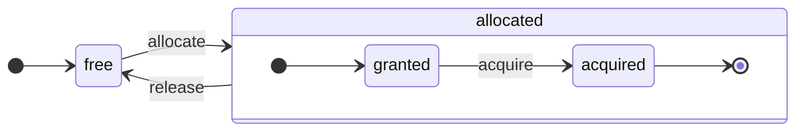

ClickHouse 是一个真正的列式 DBMS。数据按列存储，执行时则以数组 (向量或列块) 的形式处理。
只要可能，操作都会作用于数组，而不是单个值。
这被称为“向量化查询执行”，有助于降低实际数据处理的成本。

这一思想并不新。
它可以追溯到 `APL` (一种编程语言，1957 年) 及其后继者：`A +` (APL 方言) 、`J` (1990 年) 、`K` (1993 年) 和 `Q` (Kx Systems 于 2003 年推出的编程语言) 。
数组编程被用于科学数据处理。这一思想在关系型数据库中也不算新鲜。例如，`VectorWise` 系统 (也称为 Actian Corporation 的 Actian Vector Analytic Database) 就采用了这种方式。

加速查询处理有两种不同的方法：向量化查询执行和运行时代码生成。后者会消除所有间接层和动态分派。这两种方法并没有绝对的优劣之分。运行时代码生成在融合大量操作时可能更有优势，因此能够充分利用 CPU 执行单元和流水线。向量化查询执行则可能没那么实用，因为它涉及必须写入缓存再读回的临时向量。如果临时数据无法放入 L2 缓存，这就会成为问题。但向量化查询执行更容易利用 CPU 的 SIMD 能力。我们朋友撰写的一篇[研究论文](http://15721.courses.cs.cmu.edu/spring2016/papers/p5-sompolski.pdf)表明，最好将这两种方法结合起来。ClickHouse 使用向量化查询执行，并对运行时代码生成提供了有限的初步支持。

  ## 列

`IColumn` 接口用于在内存中表示列 (实际上是列的数据块) 。该接口提供了一些辅助方法，用于实现各种关系运算符。几乎所有操作都是不可变的：它们不会修改原始列，而是创建一个新的修改后列。例如，`IColumn :: filter` 方法接受一个过滤字节掩码，用于 `WHERE` 和 `HAVING` 关系运算符。其他示例还包括：用于支持 `ORDER BY` 的 `IColumn :: permute` 方法，以及用于支持 `LIMIT` 的 `IColumn :: cut` 方法。

各种 `IColumn` 实现 (`ColumnUInt8`、`ColumnString` 等) 负责列的内存布局。内存布局通常是连续数组。对于整数类型的列，它就是一个连续数组，类似于 `std :: vector`。对于 `String` 和 `Array` 列，则由两个向量组成：一个用于存放连续排列的所有数组元素，另一个用于存放每个数组起始位置的偏移量。还有一个 `ColumnConst`，它在内存中只存储一个值，但表现得像一列。

  ## Field

尽管如此，仍然可以处理单个值。要表示单个值，可使用 `Field`。`Field` 只是 `UInt64`、`Int64`、`Float64`、`String` 和 `Array` 的一种可区分联合。`IColumn` 提供了 `operator []` 方法，用于将第 n 个值作为 `Field` 获取；还提供了 `insert` 方法，用于将一个 `Field` 追加到列末尾。这些方法的效率都不高，因为它们需要处理用于表示单个值的临时 `Field` 对象。还有更高效的方法，例如 `insertFrom`、`insertRangeFrom` 等。

`Field` 没有足够的信息来表示表中的具体数据类型。例如，`UInt8`、`UInt16`、`UInt32` 和 `UInt64` 在 `Field` 中都表示为 `UInt64`。

  ## 抽象泄漏

`IColumn` 提供了用于常见关系型数据转换的方法，但并不能满足所有需求。例如，`ColumnUInt64` 没有用于计算两列之和的方法，`ColumnString` 也没有用于执行子串搜索的方法。这些大量的例程都在 `IColumn` 之外实现。

针对列的各种函数，既可以通过 `IColumn` 的方法提取 `Field` 值，以通用但低效的方式实现；也可以利用特定 `IColumn` 实现中数据在内存中的内部布局，以专门化的方式实现。其做法是将函数转换为特定的 `IColumn` 类型，并直接处理其内部表示。例如，`ColumnUInt64` 具有 `getData` 方法，可返回内部数组的引用，然后由单独的例程直接读取或填充该数组。我们引入“抽象泄漏”，以便对各种例程进行高效的专门化。

  ## 数据类型

`IDataType` 负责序列化和反序列化：以二进制或文本形式读取和写入列数据块或单个值。`IDataType` 与表中的数据类型直接对应。例如，有 `DataTypeUInt32`、`DataTypeDateTime`、`DataTypeString` 等。

`IDataType` 和 `IColumn` 之间只是松散关联。不同的数据类型在内存中可以由相同的 `IColumn` 实现表示。例如，`DataTypeUInt32` 和 `DataTypeDateTime` 都可由 `ColumnUInt32` 或 `ColumnConstUInt32` 表示。此外，同一种数据类型也可以由不同的 `IColumn` 实现表示。例如，`DataTypeUInt8` 可以由 `ColumnUInt8` 或 `ColumnConstUInt8` 表示。

`IDataType` 仅存储元数据。例如，`DataTypeUInt8` 完全不存储任何内容 (除了虚指针 `vptr`) ，而 `DataTypeFixedString` 只存储 `N` (即定长字符串的长度) 。

`IDataType` 提供了适用于各种数据格式的辅助方法。例如，有在必要时为值加引号进行序列化的方法、将值序列化为 JSON 的方法，以及将值作为 XML 格式一部分进行序列化的方法。它与数据格式之间并不存在直接对应关系。例如，不同的数据格式 `Pretty` 和 `TabSeparated` 都可以使用 `IDataType` 接口中的同一个 `serializeTextEscaped` 辅助方法。

  ## 块

`Block` 是一种容器，用于表示内存中某个表的一个子集 (数据块) 。它本质上就是一组三元组：`(IColumn, IDataType, column name)`。在执行查询期间，数据以 `Block` 为单位处理。只要有一个 `Block`，我们就拥有数据 (存放在 `IColumn` 对象中) 、类型信息 (存放在 `IDataType` 中，用于说明如何处理该列) 以及列名。列名既可以是表中的原始列名，也可以是为了获取临时计算结果而指定的人工名称。

当我们对一个块中的列计算某个函数时，会将结果作为新的一列添加到该块中，而不会修改作为函数 argument 的列，因为操作是不可变的。之后，不再需要的列可以从块中移除，但不能修改。这对于消除公共子表达式很方便。

每个被处理的数据块 都会创建一个对应的块。请注意，对于同一种计算，不同块的列名和类型保持不变，变化的只有列数据。最好将块数据与块头分离，因为块较小时，复制 shared&#95;ptr 和列名所产生的临时字符串会带来较高的开销。

  ## 处理器

请参阅 [https://github.com/ClickHouse/ClickHouse/blob/master/src/Processors/IProcessor.h](https://github.com/ClickHouse/ClickHouse/blob/master/src/Processors/IProcessor.h) 中的说明。

  ## 格式

数据格式是通过处理器实现的。

  ## I/O

对于面向字节的输入/输出，提供了 `ReadBuffer` 和 `WriteBuffer` 这两个抽象类。它们用来替代 C++ 的 `iostream`。不用担心：出于充分的理由，几乎所有成熟的 C++ 项目都会使用 `iostream` 之外的方案。

`ReadBuffer` 和 `WriteBuffer` 本质上就是一段连续缓冲区，以及一个指向该缓冲区内某个位置的游标。具体实现可以拥有这段缓冲区的内存，也可以不拥有。有一个虚方法用于向缓冲区填充后续数据 (对 `ReadBuffer` 而言) ，或将缓冲区中的数据 flush 到某处 (对 `WriteBuffer` 而言) 。这些虚方法很少会被调用。

`ReadBuffer`/`WriteBuffer` 的各种实现可用于处理文件、文件描述符和网络套接字，也可用于实现压缩 (`CompressedWriteBuffer` 用另一个 WriteBuffer 初始化，并在将数据写入其中之前先进行压缩) ，以及其他用途——`ConcatReadBuffer`、`LimitReadBuffer` 和 `HashingWriteBuffer` 这些名称已经足够直观。

Read/WriteBuffer 只处理字节。`ReadHelpers` 和 `WriteHelpers` 头文件中提供了一些函数，用于辅助输入/输出的格式化。例如，有些辅助函数可用于按十进制格式写入数值。

下面来看一下，当你想把 `JSON` 格式的结果集写到 stdout 时，会发生什么。
此时，你已经有了一个可从拉取式 `QueryPipeline` 中获取的结果集。
首先，创建一个 `WriteBufferFromFileDescriptor(STDOUT_FILENO)`，用于将字节写入 stdout。
接下来，将查询管道的结果连接到 `JSONRowOutputFormat`，后者使用该 `WriteBuffer` 进行初始化，从而将各行按 `JSON` 格式写入 stdout。
这可以通过 `complete` 方法实现，它会将拉取式 `QueryPipeline` 转换为已完成的 `QueryPipeline`。
在内部，`JSONRowOutputFormat` 会写入各种 JSON 分隔符，并调用 `IDataType::serializeTextJSON` 方法，将 `IColumn` 的引用和行号作为参数传入。随后，`IDataType::serializeTextJSON` 会调用 `WriteHelpers.h` 中的方法：例如，数值类型使用 `writeText`，而 `DataTypeString` 使用 `writeJSONString`。

  ## 表

`IStorage` 接口表示表。该接口的不同实现对应不同的表引擎。例如 `StorageMergeTree`、`StorageMemory` 等。这些类的实例就是表。

`IStorage` 中的关键方法是 `read` 和 `write`，以及 `alter`、`rename` 和 `drop` 等其他方法。`read` 方法接受以下参数：要从表中读取的一组列、需要参考的 `AST` 查询，以及所需的流数量。它返回一个 `Pipe`。

在大多数情况下，`read` 方法只负责从表中读取指定的列，而不负责任何后续数据处理。
所有后续数据处理都由管道的另一部分完成，这部分不属于 `IStorage` 的职责范围。

但也有一些值得注意的例外：

* `AST` 查询会传递给 `read` 方法，表引擎可以利用它判断如何使用索引，并从表中读取更少的数据。
* 有时表引擎可以自行将数据处理到某个特定阶段。例如，`StorageDistributed` 可以将查询发送到远程服务器，要求它们将数据处理到可合并不同远程服务器数据的阶段，然后返回这些预处理后的数据。随后查询解释器会完成剩余的数据处理。

表的 `read` 方法可以返回一个由多个 `Processors` 组成的 `Pipe`。这些 `Processors` 可以并行从表中读取数据。
然后，你可以将这些处理器与各种其他转换 (例如表达式求值或筛选) 连接起来，这些转换可以独立计算。
接着，在它们之上创建一个 `QueryPipeline`，并通过 `PipelineExecutor` 执行它。

还有一些 `TableFunction`。这些函数会返回一个临时的 `IStorage` 对象，用于查询的 `FROM` 子句中。

如果你想快速了解如何实现自己的表引擎，可以先看看一些简单的例子，比如 `StorageMemory` 或 `StorageTinyLog`。

> 作为 `read` 方法的结果，`IStorage` 会返回 `QueryProcessingStage`——用于说明查询的哪些部分已经在存储内部完成计算的信息。

  ## 解析器

查询由手写的递归下降解析器来解析。例如，`ParserSelectQuery` 只是递归调用底层的各个解析器，以处理查询的不同部分。解析器会生成 `AST`。`AST` 由节点构成，这些节点都是 `IAST` 的实例。

> 出于历史原因，这里不使用解析器生成器。

  ## 解释器

解释器负责根据 AST 创建查询执行流水线。这里既有简单的解释器，例如 `InterpreterExistsQuery` 和 `InterpreterDropQuery`，也有更复杂的 `InterpreterSelectQuery`。

查询执行流水线由一组能够消费和生成数据块 (即具有特定类型的一组列) 的处理器组成。
处理器通过端口通信，并且可以有多个输入端口和多个输出端口。
更详细的说明可参见 [src/Processors/IProcessor.h](https://github.com/ClickHouse/ClickHouse/blob/master/src/Processors/IProcessor.h)。

例如，对 `SELECT` 查询进行解释后，会得到一个“pulling” `QueryPipeline`，它带有一个用于读取结果集的特殊输出端口。
对 `INSERT` 查询进行解释后，会得到一个“pushing” `QueryPipeline`，它带有一个用于写入待插入数据的输入端口。
而对 `INSERT SELECT` 查询进行解释后，得到的则是一个“completed” `QueryPipeline`，它没有输入或输出，但会同时将数据从 `SELECT` 复制到 `INSERT`。

`InterpreterSelectQuery` 使用 `ExpressionAnalyzer` 和 `ExpressionActions` 机制进行查询分析和转换。大多数基于规则的查询优化也都是在这里完成的。`ExpressionAnalyzer` 相当混乱，应该重写：应将各种查询转换和优化提取到独立的类中，以支持对查询进行模块化转换。

为了解决解释器中存在的问题，开发了新的 `InterpreterSelectQueryAnalyzer`。这是 `InterpreterSelectQuery` 的新版本，不使用 `ExpressionAnalyzer`，并在 `AST` 与 `QueryPipeline` 之间引入了一个额外的抽象层，称为 `QueryTree`。它已经完全可以在生产环境中使用，但为稳妥起见，也可以通过将 `enable_analyzer` 设置为 `false` 来关闭。

  ## 函数

函数分为普通函数和聚合函数。关于聚合函数，请参见下一节。

普通函数不会改变行数——它们看起来像是独立处理每一行。实际上，函数并不是对单独的行逐一调用，而是对 `Block` 数据块调用，以实现向量化查询执行。

还有一些杂项函数，例如 [blockSize](/zh/sql-reference/functions/other-functions#blockSize)、[rowNumberInBlock](/zh/sql-reference/functions/other-functions#rowNumberInBlock) 和 [runningAccumulate](/zh/sql-reference/functions/other-functions#runningAccumulate)，它们利用块处理机制，因此打破了行之间的独立性。

ClickHouse 采用强类型，因此不存在隐式类型转换。如果某个函数不支持特定的类型组合，它就会抛出异常。不过，函数可以支持许多不同的类型组合 (即重载) 。例如，`plus` 函数 (用于实现 `+` 运算符) 适用于任意数值类型的组合：`UInt8` + `Float32`、`UInt16` + `Int8`，等等。此外，一些可变参数函数可以接受任意数量的参数，例如 `concat` 函数。

实现函数时可能会稍显不便，因为函数需要显式分派其支持的数据类型和支持的 `IColumns`。例如，`plus` 函数会针对每一种数值类型组合，以及左右参数是常量还是非常量的不同情况，通过实例化 C++ 模板生成代码。

这里非常适合实现运行时代码生成，以避免模板代码膨胀。此外，这样还可以加入融合函数，例如 fused multiply-add，或者在一次循环迭代中执行多次比较。

由于采用向量化查询执行，函数不会短路求值。例如，如果你写下 `WHERE f(x) AND g(y)`，那么两侧都会被计算，即使对于 `f(x)` 为零的行也是如此 (除非 `f(x)` 是值为零的常量表达式) 。但是，如果 `f(x)` 条件的选择性很高，并且计算 `f(x)` 的开销远低于 `g(y)`，那么最好采用多遍计算：先计算 `f(x)`，再根据结果过滤列，然后仅对更小的、过滤后的数据块计算 `g(y)`。

  ## 聚合函数

聚合函数是有状态的函数。它们会将传入的值累积到某种状态中，并允许你从该状态中获取结果。它们通过 `IAggregateFunction` 接口进行管理。状态可以非常简单 (`AggregateFunctionCount` 的状态只是一个 `UInt64` 值) ，也可以非常复杂 (`AggregateFunctionUniqCombined` 的状态由线性数组、哈希表和 `HyperLogLog` 概率型数据结构组合而成) 。

状态会分配在 `Arena` (内存池) 中，以便在执行高基数 `GROUP BY` 查询时处理多个状态。状态可能带有非平凡的构造函数和析构函数：例如，复杂的聚合状态本身还可能分配额外的内存。因此，在创建和销毁状态时，以及在正确传递其所有权和控制销毁顺序时，都需要格外小心。

聚合状态可以被序列化和反序列化，以便在分布式查询执行期间通过网络传输，或者在 RAM 不足时将其写入磁盘。它们甚至可以通过 `DataTypeAggregateFunction` 存储在表中，以支持数据的增量聚合。

> 目前，聚合函数状态的序列化数据格式还不是版本化的。如果聚合状态只是临时存储，这没有问题。但我们有用于增量聚合的 `AggregatingMergeTree` 表引擎，而且人们已经在生产环境中使用它了。因此，未来如果更改任何聚合函数的序列化格式，就必须保证向后兼容性。

  ## 服务器

服务器实现了几种不同的接口：

* 面向各类外部客户端的 HTTP 接口。
* 面向原生 ClickHouse 客户端，以及在分布式查询执行期间用于跨服务器通信的 TCP 接口。
* 用于在复制过程中传输数据的接口。

在内部，它本质上只是一个简单的多线程服务器，不使用协程或纤程。该服务器并不是为高频处理简单查询而设计的，而是为以相对较低的频率处理复杂查询而设计；这类查询中的每一个都可以处理海量数据以用于分析。

服务器会用查询执行所需的环境来初始化 `Context` 类：可用数据库列表、用户及其访问权限、设置、集群、进程列表、查询日志等等。Interpreters 会使用这一环境。

我们对服务器 TCP 协议保持完整的向后和向前兼容性：旧客户端可以与新服务器通信，新客户端也可以与旧服务器通信。但我们不打算永远维护这种兼容性，大约一年后就会移除对旧版本的支持。

:::note
对于大多数外部应用程序，我们建议使用 HTTP 接口，因为它简单且易于使用。TCP 协议与内部数据结构的耦合更紧密：它使用内部格式传递数据块，并对压缩数据使用自定义分帧机制。
:::

  ## 配置

ClickHouse Server 基于 POCO C++ Libraries，并使用 `Poco::Util::AbstractConfiguration` 表示其配置。配置由 `Poco::Util::ServerApplication` 类持有，`DaemonBase` 类继承自该类，而 `DB::Server` 类又继承自 `DaemonBase`，并实现了 clickhouse-server 本身。因此，可以通过 `ServerApplication::config()` 方法访问配置。

配置会从多个文件 (XML 或 YAML 格式) 中读取，并由 `ConfigProcessor` 类合并成一个 `AbstractConfiguration`。配置会在服务器启动时加载；如果某个配置文件被更新、删除或新增，之后也可以重新加载。`ConfigReloader` 类还负责定期监控这些变更并执行重新加载流程。`SYSTEM RELOAD CONFIG` 查询也会触发配置重新加载。

对于 `Server` 之外的查询和子系统，可以通过 `Context::getConfigRef()` 方法访问配置。每个能够在无需重启服务器的情况下重新加载其配置的子系统，都应在 `Server::main()` 方法的重新加载回调中完成注册。请注意，如果较新的配置存在错误，大多数子系统会忽略新配置、记录警告消息，并继续使用之前已加载的配置。由于 `AbstractConfiguration` 的特性，无法传递对特定节的引用，因此通常会改用 `String config_prefix`。

  ### 上下文

ClickHouse 通过上下文层级管理设置：

* **全局上下文** - 通过配置文件定义的服务器级设置
* **会话上下文** - 来自 profile、用户配置和 SET 命令的用户会话设置
* **查询上下文** - 来自 SETTINGS 子句的查询级设置
* **后台上下文** - 通过 &#39;background&#39; profile 定义的、用于后台操作 (Mutate、Merge) 的服务器级设置

在调度某个操作时 (查询、变更等) ，服务器会按以下顺序合并设置以构建对应的特定上下文 (后面的部分会覆盖前面的部分) ：

1. 全局默认值
2. 全局配置
3. Profile 设置 (来自 `<profiles>` 部分)
4. 用户设置 (来自 `<users>` 部分)
5. 会话设置 (来自 SET 命令)
6. 查询设置 (来自 SETTINGS 子句)

:::note
后台操作可通过全局设置和 &#39;background&#39; profile 设置进行配置；在这种情况下，会话设置和查询设置不会生效。如果未提供显式配置，则会继承全局上下文中的配置。此类操作的默认 profile 名称为 &#39;background&#39;，可通过 `background_profile` server setting 覆盖。
:::

  ## 线程和作业

为了执行查询并处理其他辅助活动，ClickHouse 会从某个线程池中分配线程，以避免频繁创建和销毁线程。系统中有几个线程池，会根据作业的用途和结构来选择：

* 用于传入客户端会话的 server pool。
* 用于通用作业、后台活动和 standalone 线程的全局线程池。
* 用于大多因某些 IO 而阻塞、且 CPU 密集度不高的作业的 IO thread pool。
* 用于周期性任务的后台池。
* 用于可抢占任务的池，这类任务可以拆分为多个 step。

Server pool 是在 `Server::main()` method 中定义的 `Poco::ThreadPool` 类实例。它最多可拥有 `max_connection` 个线程。每个线程专用于一个活跃 connection。

全局线程池是 `GlobalThreadPool` singleton 类。要从中分配线程，会使用 `ThreadFromGlobalPool`。它的 interface 与 `std::thread` 类似，但会从全局池中获取线程并完成所有必要的初始化。它通过以下 settings 进行配置：

* `max_thread_pool_size` - 池中线程数的上限。
* `max_thread_pool_free_size` - 等待新作业的空闲线程数上限。
* `thread_pool_queue_size` - 已调度作业数的上限。

全局池是通用的，下面描述的所有池都构建在它之上。可以将其视为一个池的 hierarchy。任何专用池都会使用 `ThreadPool` 类从全局池中获取线程。因此，任何专用池的主要目的，都是限制同时运行的作业数量并进行作业调度。如果已调度的作业数量多于池中的线程数量，`ThreadPool` 会按优先级将作业积压在一个 queue 中。每个作业都有一个整数优先级。默认优先级为零。所有优先级值更高的作业，都会先于任何优先级值更低的作业启动。但对于已经在执行的作业则没有区别，因此优先级只有在线程池 overloaded 时才会起作用。

IO thread pool 被实现为一个普通的 `ThreadPool`，可通过 `IOThreadPool::get()` method 访问。它的配置方式与全局池相同，使用 `max_io_thread_pool_size`、`max_io_thread_pool_free_size` 和 `io_thread_pool_queue_size` settings。IO thread pool 的主要目的是避免全局池被 IO 作业耗尽，否则可能导致查询无法充分利用 CPU。备份到 S3 会执行大量 IO 操作，为了避免影响交互式查询，系统还提供了独立的 `BackupsIOThreadPool`，通过 `max_backups_io_thread_pool_size`、`max_backups_io_thread_pool_free_size` 和 `backups_io_thread_pool_queue_size` settings 进行配置。

对于周期性任务执行，有 `BackgroundSchedulePool` 类。你可以使用 `BackgroundSchedulePool::TaskHolder` 对象注册任务，线程池会确保同一个任务不会同时运行两个作业。它还允许你将任务执行推迟到未来某个特定时刻，或者临时停用任务。全局 `Context` 为不同用途提供了该类的若干实例。对于通用任务，使用 `Context::getSchedulePool()`。

还有一些专用于可抢占任务的线程池。这类 `IExecutableTask` 任务可以拆分为按顺序排列的一组作业，称为 step。为了以能让短任务优先于长任务的方式调度这些任务，会使用 `MergeTreeBackgroundExecutor`。顾名思义，它用于与 MergeTree 相关的后台操作，例如 merge、mutations、fetches 和 move。可通过 `Context::getCommonExecutor()` 及其他类似 methods 获取这些池实例。

无论作业使用哪个池，在启动时都会为该作业创建一个 `ThreadStatus` 实例。它封装了所有线程级信息：线程 id、Query id、性能计数器、资源消耗以及许多其他有用数据。作业可通过 `CurrentThread::get()` 调用，借助线程本地指针访问它，因此我们不需要将它传递给每个函数。

如果线程与查询执行相关，那么附加到 `ThreadStatus` 上最重要的内容就是查询上下文 `ContextPtr`。每个查询在 server pool 中都有其 master thread。master thread 通过持有一个 `ThreadStatus::QueryScope query_scope(query_context)` 对象来完成附加。master thread 还会创建一个由 `ThreadGroupStatus` 对象表示的线程组。在该查询执行期间分配的每个额外线程，都会通过 `CurrentThread::attachTo(thread_group)` 调用附加到其线程组。线程组用于聚合 profile 事件计数器，并跟踪专用于单个任务的所有线程的内存消耗 (更多信息参见 `MemoryTracker` 和 `ProfileEvents::Counters` 类) 。

  ## 并发控制

可并行化的查询会使用 `max_threads` 设置来限制自身。该设置的默认值经过专门选择，以便单个查询能够尽可能高效地利用所有 CPU 核心。但如果有多个并发查询，并且每个查询都使用 `max_threads` 的默认值，会怎样呢？这样一来，这些查询就会共享 CPU 资源。操作系统会通过持续切换线程来保证公平性，但这会带来一定的性能开销。`ConcurrencyControl` 有助于减轻这种开销，并避免分配过多线程。配置项 `concurrent_threads_soft_limit_num` 用于限制在施加某种 CPU 压力之前可分配的并发线程数。

这里引入了 CPU `slot` 的概念。插槽是并发单位：要运行一个线程，查询必须预先获取一个插槽，并在线程停止时释放它。服务器中的插槽总数在全局范围内受限。如果总需求超过插槽总数，多个并发查询就会竞争 CPU 插槽。`ConcurrencyControl` 负责以公平的方式调度 CPU 插槽，从而解决这种竞争。

每个插槽都可以视为一个独立的状态机，具有以下状态：

* `free`：插槽可供任何查询分配。
* `granted`：插槽已由特定查询 `allocated`，但尚未被任何线程获取。
* `acquired`：插槽已由特定查询 `allocated`，并已被某个线程获取。

请注意，`allocated` 的插槽可以处于两种不同状态：`granted` 和 `acquired`。前者是一个过渡状态，实际上应当很短 (从插槽被分配给某个查询的那一刻起，到该查询的任意线程执行扩容过程为止) 。

`ConcurrencyControl` 的 API 由以下函数组成：

1. 为查询创建资源分配：`auto slots = ConcurrencyControl::instance().allocate(1, max_threads);`。它至少会分配 1 个、最多 `max_threads` 个 slot。请注意，第一个 slot 会立即授予，而其余 slot 可能会稍后才授予。因此，这是一个软限制，因为每个查询至少都会获得一个线程。
2. 对于每个线程，都必须从分配中获取一个 slot：`while (auto slot = slots->tryAcquire()) spawnThread([slot = std::move(slot)] { ... });`。
3. 更新 slot 总数：`ConcurrencyControl::setMaxConcurrency(concurrent_threads_soft_limit_num)`。可在运行时完成，无需重启服务器。

该 API 允许查询在有 CPU 压力时仍以至少一个线程启动，并在之后扩展到 `max_threads`。

  ## 分布式查询执行

集群中的各个服务器大多彼此独立。你可以在集群中的一台或所有服务器上创建 `Distributed` 表。`Distributed` 表本身不存储数据——它只是为集群中多个节点上的所有本地表提供一个“视图”。当你从 `Distributed` 表执行 SELECT 时，它会重写该查询，根据负载均衡设置选择远程节点，并将查询发送到这些节点。`Distributed` 表会请求远程服务器将查询处理到可合并来自不同服务器中间结果的阶段。随后，它会接收这些中间结果并进行合并。分布式表会尽可能将更多工作分配给远程服务器，并尽量减少通过网络传输的中间数据量。

当 IN 或 JOIN 子句中包含子查询，并且每个子查询都使用 `Distributed` 表时，情况会变得更加复杂。对于这类查询的执行，我们有不同的策略。

分布式查询执行没有全局查询计划。每个节点都有自己的本地查询计划，用于完成其负责的那部分工作。我们目前只有简单的单遍分布式查询执行：将查询发送到远程节点，然后合并结果。但对于包含高基数 `GROUP BY`，或 JOIN 需要处理大量临时数据的复杂查询，这种方式并不可行。在这种情况下，我们需要在服务器之间对数据进行“重新分发”，这需要额外的协调。ClickHouse 目前不支持这种查询执行方式，这方面仍有待完善。

  ## Merge tree

`MergeTree` 是一个支持按主键建立索引的存储引擎家族。主键可以是由任意列或表达式构成的元组。`MergeTree` 表中的数据以 `parts` 的形式存储。每个 part 都按主键顺序存储数据，因此数据会按照主键元组的字典序排列。在这些 parts 中，表的所有列分别存储在各自独立的 `column.bin` 文件中。这些文件由压缩块组成。每个块通常包含 64 KB 到 1 MB 的未压缩数据，具体取决于平均值大小。块由连续存放的列值组成，一个接一个排列。对于每一列，列值的顺序都是相同的 (顺序由主键定义) ，因此当你遍历多列时，就能得到对应行的值。

主键本身是“稀疏”的。它不会定位到每一行，只会定位到某些数据范围。单独的 `primary.idx` 文件会保存每第 N 行的主键值，其中 N 被称为 `index_granularity` (通常 N = 8192) 。此外，对于每一列，我们还有 `column.mrk` 文件，其中包含“marks”，也就是数据文件中每第 N 行对应的偏移量。每个 mark 都是一个二元组：文件中到压缩块起始位置的偏移量，以及解压后块中到数据起始位置的偏移量。通常，压缩块会按 marks 对齐，因此解压后块中的偏移量为零。`primary.idx` 的数据始终驻留在内存中，而 `column.mrk` 文件的数据则会被缓存。

当我们要从 `MergeTree` 的某个 part 中读取数据时，会先查看 `primary.idx` 数据，定位可能包含请求数据的范围，再查看 `column.mrk` 数据，计算从这些范围的哪个位置开始读取。由于索引是稀疏的，可能会读到额外的数据。ClickHouse 并不适合高负载的简单点查询，因为对于每个键，都必须读取整个包含 `index_granularity` 行的范围，并且对每一列都必须解压整个压缩块。我们将索引设计为稀疏，是因为必须能够在单台服务器上维护数万亿行数据，同时又不能让索引带来明显的内存开销。此外，由于主键是稀疏的，它也不是唯一的：在 INSERT 时，它无法检查表中是否已存在该键。因此，一个表中可以有多行拥有相同的键。

当你向 `MergeTree` `INSERT` 一批数据时，这批数据会按主键顺序排序，并形成一个新的 part。后台线程会定期选取一些 parts，将它们合并为一个有序的 part，以将 parts 的数量维持在相对较低的水平。这也是它被称为 `MergeTree` 的原因。当然，合并会导致“写放大”。所有 parts 都是不可变的：它们只会被创建和删除，不会被修改。当执行 SELECT 时，它会持有表的一个快照 (即一组 parts) 。合并后，我们还会保留旧 parts 一段时间，以便在发生故障后更容易恢复，因此如果我们发现某个已合并的 part 可能损坏，就可以用它的源 parts 替换它。

`MergeTree` 不是 LSM tree，因为它不包含 MEMTABLE 和 LOG：写入的数据会直接写入文件系统。这种行为使 MergeTree 更适合按批次写入数据。因此，频繁写入少量行数据并不适合 MergeTree。例如，每秒写入几行是可以接受的，但如果每秒执行一千次写入，对 MergeTree 来说就不是最佳方式。不过，针对小批量写入，有一种 async insert 模式可以克服这一限制。我们之所以这样设计，一是为了保持简单，二是因为我们的应用本身就已经按批次写入数据。

有一些 MergeTree 引擎会在后台合并期间执行额外工作。示例包括 `CollapsingMergeTree` 和 `AggregatingMergeTree`。这可以视为对更新操作的一种特殊支持。请记住，这些并不是真正的更新，因为用户通常无法控制后台合并的具体执行时间，而且 `MergeTree` 表中的数据几乎总是存储在多个 part 中，而不是以完全合并后的形式存在。

  ## 复制

ClickHouse 中的复制可以按表配置。同一台服务器上既可以有复制表，也可以有非复制表。不同的表还可以采用不同的复制方式，例如一个表使用双副本复制，另一个表使用三副本复制。

复制是通过 `ReplicatedMergeTree` 存储引擎实现的。`ZooKeeper` 中的 path 作为存储引擎的参数指定。凡是在 `ZooKeeper` 中使用相同 path 的表，都会互为副本：它们会同步数据并保持一致性。只需创建或删除表，就可以动态添加或移除副本。

复制采用异步多主 scheme。你可以将数据插入到任何与 `ZooKeeper` 保持 session 的副本中，数据随后会异步复制到其他所有副本。由于 ClickHouse 不支持 UPDATE，因此复制不存在冲突。因为默认情况下插入操作没有 quorum 确认，所以如果某个节点发生故障，刚插入的数据可能会丢失。可以通过 `insert_quorum` setting 启用插入 quorum。

复制的元数据 存储在 ZooKeeper 中。系统中有一份 replication 日志，列出了需要执行的 actions。Actions 包括：获取 part、合并 parts、删除分区，等等。每个副本都会将 replication 日志复制到自己的 queue 中，然后执行 queue 中的 actions。例如，在插入时，日志中会创建“获取该 part”的 action，而每个副本都会下载该 part。各副本之间会协调合并，以获得字节级完全一致的结果。所有 parts 都会在所有副本上以相同方式进行合并。某个 leader 会首先发起新的合并，并将“合并 parts” actions 写入日志。多个副本 (甚至全部) 可以同时充当 leader。可以通过 `merge_tree` setting `replicated_can_become_leader` 阻止某个副本成为 leader。leaders 负责调度后台合并。

复制是物理层面的：节点之间传输的只有压缩后的 parts，而不是 queries。为了避免网络放大、降低网络成本，大多数情况下合并 都会在每个副本上独立执行。只有在复制延迟显著时，才会通过网络传输大型合并后的 parts。

此外，每个副本都会将自己的状态 (即 parts 集合及其 checksums) 存储在 ZooKeeper 中。当本地文件系统中的状态与 ZooKeeper 中的参考状态不一致时，副本会通过从其他副本下载缺失或损坏的 parts 来恢复一致性。如果本地文件系统中存在异常或损坏的数据，ClickHouse 不会将其删除，而是会将其移动到单独的 directory 中并不再使用。

:::note
ClickHouse 集群 由相互独立的 shards 组成，而每个 shard 又由多个副本组成。该 集群 **不是弹性的**，因此添加新的 shard 后，数据不会在 shards 之间自动重新平衡。相反，通常需要接受 集群 负载分布不均。这种实现方式让你拥有更多控制权，对于相对较小的 集群 (例如几十个节点) 来说是可行的。但对于像我们在 production 中使用的、拥有数百个节点的 集群，这种方式就会成为一个明显的缺点。我们应该实现一种可跨整个 集群 的表引擎，并使用可动态复制的区域，以便能够在 集群 之间自动拆分和平衡。
:::