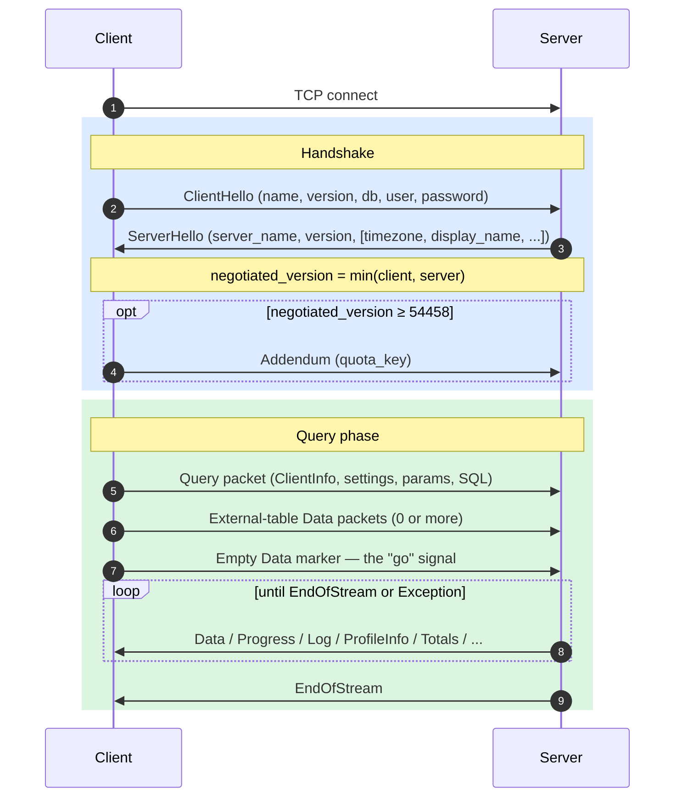
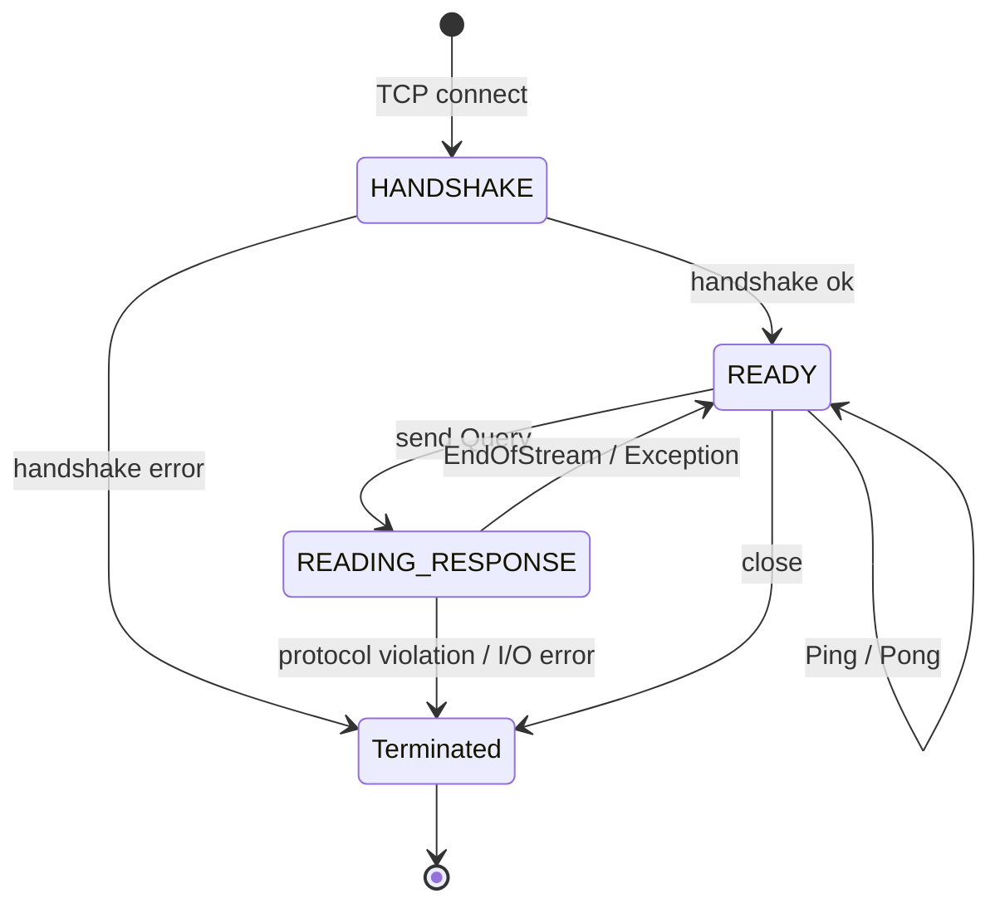
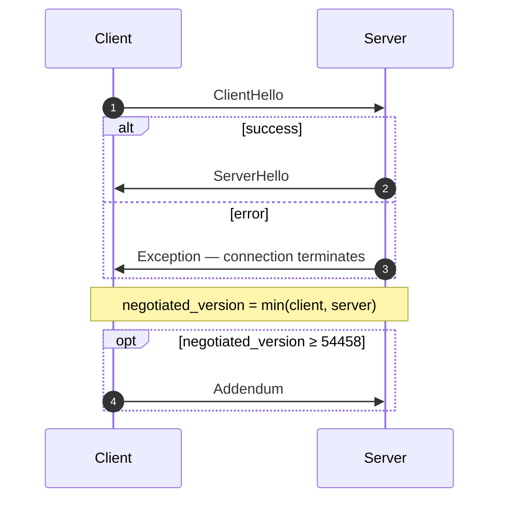
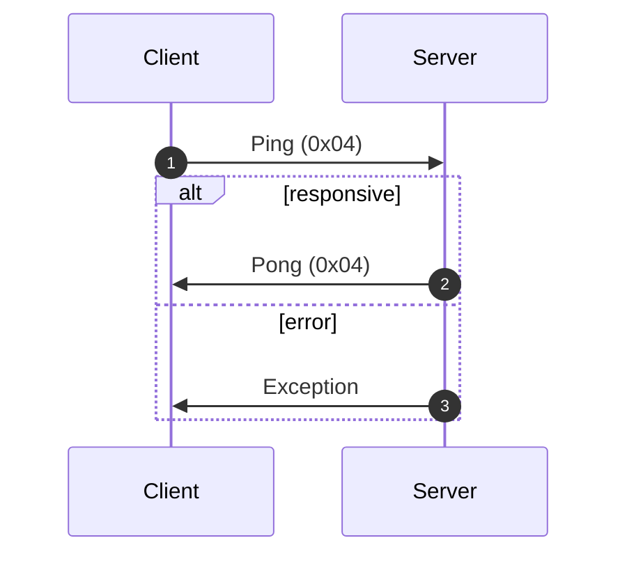
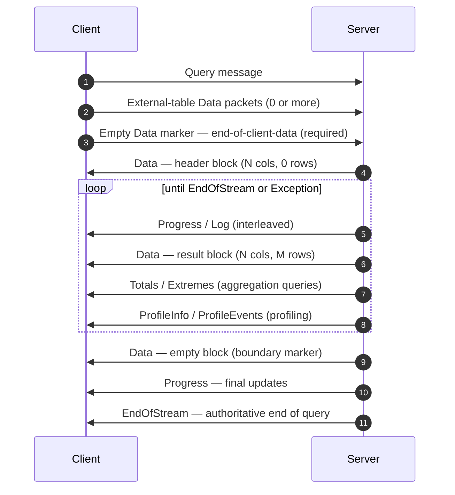
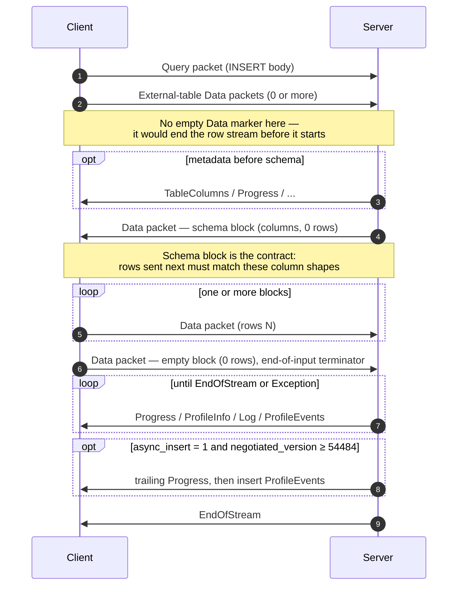
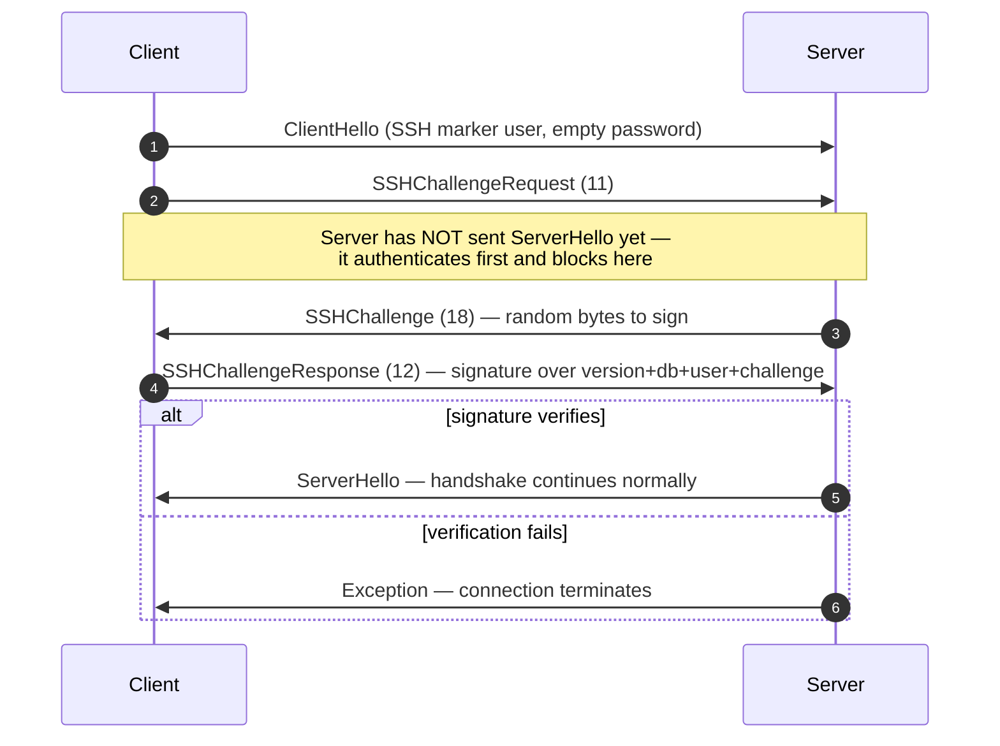

原生协议是 ClickHouse 客户端和服务端通过 TCP 通信时使用的二进制、面向连接协议。它承载 SQL 查询、结果数据、`INSERT` 载荷、执行遥测数据以及错误消息。它也是命令行客户端、C++ 以及大多数第三方原生驱动所使用的底层协议。

本页介绍协议本身：数据包分帧、连接状态机、版本协商，以及每类非 `Block` 消息的消息体。`Data` 家族数据包中的字节内容 (即 `Block`、其列以及各类型的编码) 属于另一个独立主题，详见 [Native Format](/zh/interfaces/specs/NativeFormat) 规范。

:::note 配套规范
本页是这一组成对规范中的其中一份，并与配套的 [Native Format](/zh/interfaces/specs/NativeFormat) 规范一同发布。这两份规范的分工非常清晰：本页负责数据包和传输层；Native Format 规范负责 `Data` 家族数据包中的字节内容。
:::

以下几个特性在整个协议中始终成立。该协议是二进制且按位置解析的：除 `BlockInfo` 内部外，没有字段标签，因此只要有一个字节错位，后续所有内容都会失去同步。它是有状态的，并且每个 TCP 连接一次只能处理一个查询——不支持多路复用。定长整数采用小端序。

<div id="overview">
  ## 概览
</div>

| Property | 值                                                         |
| -------- | --------------------------------------------------------- |
| 传输       | TCP，可选用 TLS 封装                                            |
| 字节序      | 定宽整数采用小端序                                                 |
| 编码       | 二进制和按位置编码 (`BlockInfo` 除外，不使用字段标签)                        |
| 连接模型     | 有状态，一次仅处理一个查询，不支持多路复用                                     |
| 版本控制     | 在握手时协商；各项功能受版本限制                                          |
| 数据格式     | 所有表格数据均使用 [Native Format](/zh/interfaces/specs/NativeFormat) |

在线上传输时，每条消息都以一个 `VarUInt` 数据包类型代码开头，后跟一个消息体，其形态取决于该代码以及协商后的协议版本。

一个连接会经历三个阶段——先进行一次性握手，然后可进行任意次数的 `Ping` 或 `Query` 交换，最后关闭：



原生 TCP 协议始终以 Native 格式传输表格数据，不受 SQL 中任何 `FORMAT` 子句的影响。将其重新格式化为 `RowBinary`、`CSV`、`JSON` 等格式由客户端负责，这一步会在客户端解码 Native 块之后完成。 (HTTP 接口则走的是另一条代码路径，它*确实*会遵循 `FORMAT` 子句；本文不讨论 HTTP。)

<div id="security">
  ## 安全
</div>

<div id="transport-security">
  ### 传输安全 (TLS)
</div>

TLS 位于传输层，处于协议之下。启用后，整个 TCP 流都会被加密；无论是否使用 TLS，协议消息在字节级别上都完全一致。

<div id="authentication">
  ### 身份验证
</div>

身份验证发生在握手期间，即在 [`ClientHello`](#clienthello) 消息中进行。`user` 和 `password` 字段会以明文字符串形式传输，因此，传输中的凭据依靠传输层加密 (TLS) 来保护。

从协议版本 54466 开始，支持 SSH 质询-响应身份验证——请参阅 [SSH 质询-响应身份验证](#ssh-authentication)。

<div id="inter-server-secret">
  ### 服务器间密钥
</div>

对于分布式查询执行，服务器通过证明自己知道共享密钥来相互进行身份验证，而不会在线上传输过程中暴露该密钥。每个 Query 都会在 [`Query`](#query) 的第 4 个 field 中携带一个 32 字节的 SHA-256 `auth_hash`；该值基于 salt、nonce、已配置的密钥以及查询计算得出，接收服务器会重新计算并进行比较。这受 `INTERSERVER_SECRET` 特性 (v54441) 控制。外部客户端在此处始终发送空字符串。请参阅[服务器间身份验证](#inter-server-authentication)。

<div id="versioning-and-feature-gates">
  ## 版本机制与功能开关
</div>

<div id="version-negotiation">
  ### 版本协商
</div>

客户端和服务端都会在握手阶段声明各自支持的最高协议版本。**协商得到的版本**为两者中较小者：

```text
negotiated_version = min(client_version, server_version)
```

在那之后的每条消息都会使用协商好的版本来决定线上传输时包含哪些字段。

<div id="feature-gates">
  ### 功能开关
</div>

一个功能由引入它的协议版本来标识；当协商出的版本大于或等于该数字时，该功能即处于**启用**状态。

:::warning
当某个功能处于启用状态时，其字段**必须**在线上传输中出现。该协议严格按位置解析，因此省略受功能开关控制的字段会破坏其后每个字段的字节流。
:::

<div id="feature-table">
  ### 功能一览表
</div>

| 特性                                                      | 版本    | 影响范围                             | 传输格式影响                                                                                                                                                                                                                                                                                                                                                                                                                           |
| ------------------------------------------------------- | ----- | -------------------------------- | -------------------------------------------------------------------------------------------------------------------------------------------------------------------------------------------------------------------------------------------------------------------------------------------------------------------------------------------------------------------------------------------------------------------------------- |
| BLOCK&#95;INFO                                          | all   | Block                            | 为每个 Block 添加 BlockInfo 前缀 (`is_overflows`、`bucket_number`) 。                                                                                                                                                                                                                                                                                                                                                                     |
| CLIENT&#95;INFO                                         | 54032 | Query                            | 在 Query 体中添加 ClientInfo 块。                                                                                                                                                                                                                                                                                                                                                                                                       |
| TIMEZONE                                                | 54058 | ServerHello                      | 在 ServerHello 中添加 `timezone` 字段。                                                                                                                                                                                                                                                                                                                                                                                                 |
| QUOTA&#95;KEY&#95;IN&#95;CLIENT&#95;INFO                | 54060 | ClientInfo                       | 在 ClientInfo 中添加 `quota_key` 字段。                                                                                                                                                                                                                                                                                                                                                                                                 |
| DISPLAY&#95;NAME                                        | 54372 | ServerHello                      | 在 ServerHello 中添加 `display_name` 字段。                                                                                                                                                                                                                                                                                                                                                                                             |
| VERSION&#95;PATCH                                       | 54401 | ServerHello, ClientInfo          | 在两者中都添加 `version_patch` 字段。                                                                                                                                                                                                                                                                                                                                                                                                      |
| SERVER&#95;LOGS                                         | 54406 | Log                              | 设置 `send_logs_level` 后，服务器会发送日志数据包。                                                                                                                                                                                                                                                                                                                                                                                              |
| COLUMN&#95;DEFAULTS&#95;METADATA                        | 54410 | TableColumns                     | 服务器可能会在 INSERT/input schema block 之前发送 [`TableColumns`](#tablecolumns) 数据包 (类型 11) ，其中包含列默认值元数据。仅当协商版本 ≥ 54410 **且** 启用了 `input_format_defaults_for_omitted_fields` 时才会发送。低于此版本时，该数据包绝不会发送；客户端不得等待它。                                                                                                                                                                                                                             |
| WRITE&#95;CLIENT&#95;INFO                               | 54420 | Progress                         | 在 Progress 中添加 `wrote_rows` 和 `wrote_bytes`。 (尽管名称如此，它**并不**控制 ClientInfo 块——控制它的是 `CLIENT_INFO` (v54032) 。)                                                                                                                                                                                                                                                                                                                     |
| SETTINGS&#95;SERIALIZED&#95;AS&#95;STRINGS              | 54429 | Query (settings 编码)              | 更改始终存在的 settings 列表的编码**方式**；**不会**控制是否发送 settings。v54429+ 将每个 setting 编码为 `(name, flags, value-as-string)`；较旧的对端则编码为 `(name, type-specific-binary-value)`，且不带 flags。参见 [Setting](#setting)。                                                                                                                                                                                                                                     |
| INTERSERVER&#95;SECRET                                  | 54441 | Query                            | 在 Query 中添加 inter-server `auth_hash` 字段——它是对 cluster secret 加盐后的 SHA-256，而不是原始 secret。外部客户端发送空字符串。参见 [Inter-server authentication](#inter-server-authentication)。                                                                                                                                                                                                                                                                |
| OPEN&#95;TELEMETRY                                      | 54442 | ClientInfo                       | 在 ClientInfo 中添加 OpenTelemetry trace context。                                                                                                                                                                                                                                                                                                                                                                                    |
| DISTRIBUTED&#95;DEPTH                                   | 54448 | ClientInfo                       | 在 ClientInfo 中添加 `distributed_depth` 字段。                                                                                                                                                                                                                                                                                                                                                                                         |
| INITIAL&#95;QUERY&#95;START&#95;TIME                    | 54449 | ClientInfo                       | 添加 `initial_time` 字段 (Int64，固定宽度) 。                                                                                                                                                                                                                                                                                                                                                                                              |
| PROFILE&#95;EVENTS                                      | 54451 | ProfileEvents                    | 服务器会在查询执行期间发送 ProfileEvents 数据包。                                                                                                                                                                                                                                                                                                                                                                                                 |
| PARALLEL&#95;REPLICAS                                   | 54453 | ClientInfo                       | 在 ClientInfo 中添加并行副本协调字段。                                                                                                                                                                                                                                                                                                                                                                                                        |
| CUSTOM&#95;SERIALIZATION                                | 54454 | Block (Column)                   | 在每列的类型字符串后添加 `has_custom_serialization` 字节。                                                                                                                                                                                                                                                                                                                                                                                      |
| ADDENDUM                                                | 54458 | Handshake                        | 客户端会在 handshake 交换后发送附录 (`quota_key`) 。                                                                                                                                                                                                                                                                                                                                                                                          |
| PARAMETERS                                              | 54459 | Query                            | 在 Query 体中添加 parameters 列表。                                                                                                                                                                                                                                                                                                                                                                                                      |
| SERVER&#95;QUERY&#95;TIME&#95;IN&#95;PROGRESS           | 54460 | Progress                         | 在 Progress 中添加 `elapsed_ns` 字段。                                                                                                                                                                                                                                                                                                                                                                                                  |
| PASSWORD&#95;COMPLEXITY&#95;RULES                       | 54461 | ServerHello                      | 在 ServerHello 中添加密码策略 regex 模式列表及人类可读的消息。                                                                                                                                                                                                                                                                                                                                                                                        |
| INTERSERVER&#95;SECRET&#95;V2                           | 54462 | ServerHello                      | 在 ServerHello 中添加一个 8 字节的 `UInt64` nonce。用于服务器间查询签名；外部客户端会解码并忽略它。                                                                                                                                                                                                                                                                                                                                                                |
| TOTAL&#95;BYTES&#95;IN&#95;PROGRESS                     | 54463 | Progress                         | 在 Progress 中添加 `total_bytes_to_read` (VarUInt) 字段，位于 `total_rows` 和 `wrote_rows` 之间。                                                                                                                                                                                                                                                                                                                                             |
| TIMEZONE&#95;UPDATES                                    | 54464 | TimezoneUpdate                   | 添加 `TimezoneUpdate` 服务器数据包 (类型 17) 。Body：单个 `String`，携带会话时区。仅由 `input` table function 初始化器发送，紧跟在 input-schema block 之后，以便客户端使用服务器的 `session_timezone` 解析其发送的行。参见 [TimezoneUpdate](#timezoneupdate)。                                                                                                                                                                                                                              |
| SPARSE&#95;SERIALIZATION                                | 54465 | Block (Column)                   | 服务器可以设置 `has_custom_serialization = 1` 并发送稀疏编码的列。Wire format：1 字节 kind (0x01 = SPARSE) ，然后是以 EOG 终止的 VarUInt offset stream，接着是以内层类型进行密集编码的非默认值。参见 [kind&#95;stack and sparse encoding](/zh/interfaces/specs/NativeFormat#kind-stack-and-sparse-encoding)。                                                                                                                                                                           |
| SSH&#95;AUTHENTICATION                                  | 54466 | Auth flow                        | 添加 SSH 质询-响应身份验证。选择启用：客户端发送形如 `" SSH KEY AUTHENTICATION " + <real_user>` 的 `user`，并使用空密码来触发。参见 [SSH challenge-response authentication](#ssh-authentication)。                                                                                                                                                                                                                                                                     |
| TABLE&#95;READ&#95;ONLY&#95;CHECK                       | 54467 | TablesStatusResponse             | 为 TablesStatusResponse 中每个表对应的行添加 `is_readonly` 标志。不发出 `TablesStatusRequest` 的外部客户端不会看到任何 wire 变化。                                                                                                                                                                                                                                                                                                                               |
| SYSTEM&#95;KEYWORDS&#95;TABLE                           | 54468 | system tables                    | 服务器会填充 `system.keywords`，以便规范的 `clickhouse-client` 可以自动补全 keywords。native-protocol wire 无变化。                                                                                                                                                                                                                                                                                                                                     |
| ROWS&#95;BEFORE&#95;AGGREGATION                         | 54469 | ProfileInfo                      | 在 ProfileInfo 中添加 `applied_aggregation` (Bool) 和 `rows_before_aggregation` (VarUInt) ，按此顺序附加在末尾。                                                                                                                                                                                                                                                                                                                                 |
| CHUNKED&#95;PROTOCOL                                    | 54470 | Connection framing               | 按数据包分块成帧会包装每个 packet body。在 Addendum 中协商。ServerHello 携带服务器在每个方向上的偏好；Addendum 携带客户端的最终选择。参见 [chunked framing](#chunked-framing)。                                                                                                                                                                                                                                                                                                  |
| VERSIONED&#95;PARALLEL&#95;REPLICAS&#95;PROTOCOL        | 54471 | ServerHello, Addendum            | 双方会交换一个 `VarUInt` 并行副本协调协议版本。ServerHello 中该字段位于 **紧接 `protocol_version` 之后** (在 `timezone` 之前) 。Addendum 中该字段追加在分块协议字符串之后。当前值：`8` (`DBMS_PARALLEL_REPLICAS_PROTOCOL_VERSION`) 。版本 `8` 新增了 [`MergeTreeAllRangesAnnouncementResponse`](#mergetreeallrangesannouncementresponse) (client packet `14`) ：当协商出的并行副本版本 `≥ 8` 时，发起方会对每个非 `Default` 模式的 follower 通知回复该 stream 的权威 parts 列表，而 follower 会在发出读取请求前等待该回复。低于 `8` 时，通知采用发出即忘模式。 |
| INTERSERVER&#95;EXTERNALLY&#95;GRANTED&#95;ROLES        | 54472 | Query                            | 在 Query body 中新增 `String external_roles` 字段，位于 settings 终止符与 interserver-secret hash 之间。外部 client 发送空角色列表 (单个字节 `0x00`，即 String 封装中的 VarUInt 0) 。                                                                                                                                                                                                                                                                                |
| V2&#95;DYNAMIC&#95;AND&#95;JSON&#95;SERIALIZATION       | 54473 | Column body                      | Server 可能会对 `Dynamic` 和 `JSON` 列类型输出 V2 serialization——这决定了它们使用哪个版本的 `state_prefix`。参见[版本化类型](/zh/interfaces/specs/NativeFormat#versioned-types)。                                                                                                                                                                                                                                                                                   |
| SERVER&#95;SETTINGS                                     | 54474 | ServerHello                      | Server 会在 ServerHello 末尾、`nonce` 之后，以列表形式广播其非默认 settings。格式为：以空 key 结尾的 `(key, flags, value)` 三元组——与 Query 数据包的 settings 列表相同。                                                                                                                                                                                                                                                                                                   |
| QUERY&#95;AND&#95;LINE&#95;NUMBERS                      | 54475 | ClientInfo                       | 在 ClientInfo 尾部新增 `script_query_number` (VarUInt) 和 `script_line_number` (VarUInt) 。由 clickhouse-client 用于多语句 script 的错误归因；外部 clients 发送 `0, 0`。                                                                                                                                                                                                                                                                                 |
| JWT&#95;IN&#95;INTERSERVER                              | 54476 | ClientInfo                       | 在 ClientInfo 尾部新增 JWT 存在标记 UInt8 和可选的 `String jwt`。外部 clients (无 JWT) 发送字节 `0x00`。 (在 C++ 中拼写为 `DBMS_MIN_REVISON_WITH_JWT_IN_INTERSERVER` —— 注意常量名中的拼写错误。)                                                                                                                                                                                                                                                                       |
| QUERY&#95;PLAN&#95;SERIALIZATION                        | 54477 | ServerHello, QueryPlan packet    | ServerHello 会在 server settings 之后追加 `VarUInt query_plan_serialization_version`。同时引入 `ClientPacket::QueryPlan` (代码 `13`) ，用于在 server 间传递预先构建的查询计划——外部 clients 不会发送。                                                                                                                                                                                                                                                               |
| PARALLEL&#95;BLOCK&#95;MARSHALLING                      | 54478 | Block (Column)                   | Server 可能会将列包装在 `ColumnBLOB` (内联压缩) 中以进行并行处理。是否启用取决于查询启用了压缩且 `rows > 1`；否则仍使用常规列传输格式。对于外发 Query packets 从不启用压缩的 clients，不会看到任何传输格式变化。                                                                                                                                                                                                                                                                                            |
| VERSIONED&#95;CLUSTER&#95;FUNCTION&#95;PROTOCOL         | 54479 | ServerHello                      | 在 ServerHello 尾部新增 `VarUInt cluster_function_protocol_version`。用于 `*Cluster` 表函数 (`s3Cluster` 等) 。当前值：`8` (`DBMS_CLUSTER_PROCESSING_PROTOCOL_VERSION`) ；版本 `7` 为私有仓库功能 (Iceberg compaction) 保留，而 `8` 为 server 间 cluster 读取任务负载新增了一个可选的 `read_source_index` (即 `ReadTaskResponse` body，此处仍未详细说明——见下文) 。外部 clients 会解码并忽略。                                                                                                         |
| OUT&#95;OF&#95;ORDER&#95;BUCKETS&#95;IN&#95;AGGREGATION | 54480 | BlockInfo                        | 在 BlockInfo 的带字段标签 stream 中新增字段 3 (`out_of_order_buckets: Vec<Int32>`) 。解码形式为 `[VarUInt count][Int32]*count`。外部 clients 本身不会输出该字段；解码器会读取 server 发送的任何非空列表。                                                                                                                                                                                                                                                                       |
| COMPRESSED&#95;LOGS&#95;PROFILE&#95;EVENTS&#95;COLUMNS  | 54481 | Log, ProfileEvents, TableColumns | Server 可能会将 [`Log`](#log)、[`ProfileEvents`](#profileevents) 和 [`TableColumns`](#tablecolumns) packet body 包装在[压缩帧](/zh/interfaces/specs/NativeFormat#compression-frame)中。在此版本中，这三个 body 都通过同一条可选压缩的输出路径传输，而只有当查询设置了 `compression = true` 时，它才会成为真正的压缩帧。对于外发 Query packets 从不启用压缩的 clients，不会看到任何传输格式变化。                                                                                                                             |
| REPLICATED&#95;SERIALIZATION                            | 54482 | Block (Column)                   | Server 可能会输出 kind&#95;stack 为 `0x04 = REPLICATED` 的列——这是一种面向重复值的字典式紧凑表示——参见[kind&#95;stack 与稀疏编码](/zh/interfaces/specs/NativeFormat#kind-stack-and-sparse-encoding)。低于此版本时，writer 会在发送前展开这类列。通过索引查找进行解码 (每行 `elements[indexes[i]]`) ；支持叶子类型以及 `Nullable`/`Array`/`Tuple`/`Map`/`Nested`/`LowCardinality` 内层类型。                                                                                                                      |
| NULLABLE&#95;SPARSE&#95;SERIALIZATION                   | 54483 | Block (Column)                   | 将稀疏 serialization 与 `Nullable(T)` 组合使用。低于此版本时，writer 会在发送前为 Nullable 列展开稀疏编码；从 v54483+ 开始，传输数据为 Nullable 之上的稀疏编码。参见[kind&#95;stack 与稀疏编码](/zh/interfaces/specs/NativeFormat#kind-stack-and-sparse-encoding)。                                                                                                                                                                                                                        |
| PROGRESS&#95;IN&#95;ASYNC&#95;INSERT                    | 54484 | Progress (INSERT)                | 对于**异步** INSERT (`async_insert = 1`) ，一旦 insert 被刷新，server 会在 `EndOfStream` 之前额外发送一个 [`Progress`](#progress) packet，然后发送该 insert 的 `ProfileEvents`。是否启用取决于*协商后*版本是否 ≥ 54484；低于该版本时，server 会省略这个尾随的 Progress。Progress 的传输格式未变——新增的只是发送行为。实际中，这个增量携带的是耗时；写入行计数器则通过随附的 ProfileEvents 报告。已经能够处理交错 Progress 的 client 无需修改格式，只需容忍再多一个 packet。                                                                                          |
| CLIENT&#95;AGENT&#95;IN&#95;CLIENT&#95;INFO             | 54485 | ClientInfo                       | 在 ClientInfo 末尾新增一个 `client_agent` `String` 字段。规范 client 会从其环境中自动检测 agent 标识符 (例如 `claude-code`、`cursor`、`gemini-cli`，或 `AGENT` 变量的值) ；如果外部 client 未检测到任何内容，则发送空字符串。一旦协商版本 ≥ 54485，该字段即为必需——省略它会使 Query packet 的其余部分失去同步。                                                                                                                                                                                                        |
| INTERNAL&#95;QUERY&#95;FLAG                             | 54486 | ClientInfo                       | 在 ClientInfo 末尾新增一个 `is_internal` `UInt8` 字段。对于 server 内部查询 (非用户发起) 该值为 `1`，并会传播到远程查询，以便其 `system.query_log` 行被标记为 internal；外部 clients 发送 `0`。一旦协商版本 ≥ 54486，该字段即为必需——省略它会使 Query packet 的其余部分失去同步。                                                                                                                                                                                                                              |

<div id="packet-envelope">
  ## 数据包封装
</div>

所有线上传输的消息在两个方向上都采用相同的外层结构：

```text
[VarUInt: packet_type_code]    always encoded as VarUInt
[message body]                 format depends on packet_type_code
```

完整的数据包类型表见[数据包类型参考](#packet-type-reference)。

数据包类型是 `VarUInt`，而不是定宽字节。对于小于 128 的值，`VarUInt` 生成的仍是同一个单字节，但实现必须使用 `VarUInt` 编码，以便在未来数据包类型达到 128 或更高时仍保持兼容。

[消息参考](#message-reference) 仅说明每个数据包的**消息体**——也就是数据包类型代码之后的字节。字段编号从 1 开始，消息体中的第一个字段编号为 1。

<div id="chunked-framing">
  ### 分块成帧 (v54470+)
</div>

当 `CHUNKED_PROTOCOL` 功能**协商启用**后 (参见[握手阶段](#handshake-phase)) ，线上传输中的每个数据包都会采用分块成帧封装。这种封装是**按方向分别进行**的：client→server 和 server→client 会分别协商，最终可能采用不同的模式 (分块或无帧) 。

每个数据包的传输布局：

```text
<chunk>...   one or more chunks; their payloads concatenated form the whole packet
[u32 LE = 0] zero-size terminator marking end of packet
```

各数据块的传输布局：

```text
[u32 LE: chunk_size]   chunk_size in [1, UINT32_MAX]
[chunk_size bytes]     packet bytes (see note below)
```

`VarUInt` 数据包类型位于分块流**内部**：它是数据包载荷的第一个字节 (即第一个 chunk 的第一个字节) ，而不是在分帧之前提前单独发送的一个字节。每个数据包的 chunk 载荷都是[数据包封装](#packet-envelope)中的完整 `[VarUInt packet_type_code][message body]`。如果客户端把数据包类型放在分块流之外，对端就会把这个类型字节当作 `u32` chunk 大小的第一个字节来读取，从而导致连接失步。

如果 writer 的 buffer 在数据包中途写满，单个数据包可能会被拆分到多个 chunk 中；拆分点可以出现在任意位置，包括数据包类型的 `VarUInt` 内部。reader 会将各个 chunk 载荷拼接起来，并把末尾 4 字节的零视为透明的数据包边界——它会消费这个边界，但不会把它暴露给读取数据包消息体的一方。

没有消息体的数据包仍然会被封装：像 `Ping` 或 `Pong` 这样的单字节数据包，在协商启用 chunking 后会变成 `[u32 size = 1][0x04][u32 0]`。本页其他地方任何“在传输格式中是单字节”的描述，指的都是 chunking 之前的形式。

**协商。** ServerHello 和 Addendum 各自都携带两个 `String` 字段，每个方向一个，取值来自 `{"chunked", "notchunked", "chunked_optional", "notchunked_optional"}`：

* `chunked` / `notchunked` 是严格值：该方向必须精确使用该模式。
* `_optional` 变体是灵活的：它们接受对方选择的任意模式。

每个方向的最终协商结果按配对方式计算：

| Server pref         | Client pref         | Agreed                                  |
| ------------------- | ------------------- | --------------------------------------- |
| `*_optional`        | anything            | 跟随 CLIENT (其 `starts_with("chunked")`)  |
| anything            | `*_optional`        | 跟随 SERVER                               |
| `chunked` strict    | `chunked` strict    | `chunked`                               |
| `notchunked` strict | `notchunked` strict | `notchunked`                            |
| strict mismatch     | strict mismatch     | **协议错误** — 必须断开该连接                      |

在客户端侧，客户端的 SEND 偏好会与服务端的 RECV 偏好协商，反之亦然。

**时序。** 这些协商字符串是在未分帧的线上传输中发送的：ClientHello → ServerHello (服务端偏好) → Addendum (客户端协商出的结果值) 。分帧切换适用于 Addendum flush 完成后发送的每一个字节。Addendum 本身、ClientHello 和 ServerHello 始终都是未分帧的。

<div id="connection-lifecycle">
  ## 连接生命周期
</div>

在任何时刻，一个连接都必定且只能处于以下四种状态之一：`HANDSHAKE`、`READY`、`READING_RESPONSE`，或已终止。由于该协议不支持多路复用，如果客户端在尚未读取完前一个响应之前就发送新的请求，就会使线上传输中的字节发生交错，从而破坏数据流。

<div id="states">
  ### 状态
</div>



正常路径会沿直线向下运行——`HANDSHAKE → READY → READING_RESPONSE → READY`——其中 `Ping`/`Pong` 构成自循环，所有失败分支都会汇入唯一的 `Terminated` sink。

| State              | Description                                                                                                                                 |
| ------------------ | ------------------------------------------------------------------------------------------------------------------------------------------- |
| `HANDSHAKE`        | TCP 连接建立后的初始状态。只有 [握手](#handshake-phase) 消息有效。成功时转换到 `READY`，失败时终止。                                                                         |
| `READY`            | 空闲。客户端可以发送 [Ping](#ping-phase)、[查询](#query-phase) 或关闭连接。连接可以无限期停留在 `READY` (受 `idle_connection_timeout` 限制，参见 [连接限制](#connection-limits)) 。 |
| `READING_RESPONSE` | 客户端发送 Query 时进入该状态。客户端必须完整读取服务器的响应 stream 后，才能返回 `READY`。此时唯一允许的客户端→服务器 packet 是 Cancel (本页未作说明) 。                                          |
| Terminated         | 不再可用。客户端必须建立新的 TCP 连接，并重新开始握手。                                                                                                              |

<div id="handshake-phase">
  ### 握手阶段
</div>

进行身份验证并协商协议版本。每个连接只会发生一次，并且在任何其他操作之前进行。

TCP 连接刚刚建立，尚未交换任何消息。流程如下：



1. 客户端发送 [`ClientHello`](#clienthello)，其中包含其支持的最高协议版本。

2. 客户端读取响应，并根据数据包类型分发处理：

   | 数据包类型           | 操作                                                                                               |
   | --------------- | ------------------------------------------------------------------------------------------------ |
   | `Hello` (0)     | 解码 [`ServerHello`](#serverhello)。计算 `negotiated_version = min(client_ver, server_ver)`。继续执行步骤 3。 |
   | `Exception` (2) | 解码 [`Exception`](#exception)。将其作为错误返回，并终止连接。                                                     |
   | anything else   | 协议违规。终止连接。                                                                                       |

3. 如果 `negotiated_version ≥ 54458` (`ADDENDUM` 功能) ，客户端会发送 [`Addendum`](#addendum)。这一判断基于**协商后的**版本，而不是客户端声明的版本。

成功时，连接进入 `READY`；发生任何错误时，连接都会终止。

<div id="ping-phase">
  ### Ping 阶段
</div>

一种应用层存活性检查，独立于 TCP keepalive。成功的 Ping/Pong 往返可确认 TCP 连接在两个方向上都处于存活状态，且服务器能够响应。Ping 是无状态的，也不与任何查询关联，因此多个连续的 Ping 彼此独立。

从 `READY` 开始，流程如下：



1. 客户端发送 [`Ping`](#ping)。
2. 客户端读取响应：

   | 数据包类型           | 操作                                      |
   | --------------- | --------------------------------------- |
   | `Pong` (4)      | 确认连接存活。返回到 `READY`。                     |
   | `Exception` (2) | 解码 [`Exception`](#exception) 并将其作为错误返回。 |
   | 其他情况            | 协议违规。                                   |

<div id="query-phase">
  ### 查询阶段
</div>

客户端提交一条 SQL 语句；服务器以流式方式返回结果块和执行遥测数据。响应由一系列数据包组成，并且恰好以一个 `EndOfStream` 或 `Exception` 结束。

从 `READY` 开始，流程如下：



在任意阶段如果发生错误，server 会发送 `Exception` 而不是 `EndOfStream`，从而终止查询。

1. client 发送带有唯一 `query_id` (通常是 UUID) 的 [`Query`](#query)。
2. client 发送所有外部表，然后发送空的 Data 标记。空的 Data 数据包 具有 `table_name = ""`、`num_columns = 0`、`num_rows = 0`。server 在收到此标记之前不会开始执行查询。
3. client 切换到 `READING_RESPONSE`，并刷写其写入缓冲区。
4. client 在循环中读取 response 数据包，并按类型分发：

   | 数据包类型                | 操作                                                                           |
   | -------------------- | ---------------------------------------------------------------------------- |
   | `Data` (1)           | 解码该块。第一个 Data 是 schema 头部；后续的是结果块 (累积) ；空块是边界标记。`num_rows == 0` **不是** 查询结束。 |
   | `Progress` (3)       | 执行指标。每个 数据包 都是相对于前一个 数据包 的**增量**——在本地累积。                               |
   | `EndOfStream` (5)    | 查询完成。退出循环并返回 `READY`。                                                        |
   | `ProfileInfo` (6)    | 执行后的 profiling 数据。                                                           |
   | `Totals` (7)         | aggregation totals 块 (与 Data 相同的传输格式) 。                                      |
   | `Extremes` (8)       | 最小/最大值块 (与 Data 相同的传输格式) 。                                                   |
   | `Log` (10)           | server 日志行。                                                                  |
   | `TableColumns` (11)  | 列默认值 metadata。                                                               |
   | `ProfileEvents` (14) | 性能计数器。                                                                       |
   | `Exception` (2)      | 解码并作为 error 返回。退出循环并返回 `READY`。                                              |
   | anything else        | 在 Query phase 期间属于异常情况。终止 connection。                                        |

在 `EndOfStream` 或已处理的 `Exception` 之后，connection 会返回 `READY`。协议违规或 I/O error 会终止它。

:::note
`num_rows == 0` 这种情况很容易让新的实现踩坑。零行块是边界标记或 schema 头部，不是流结束信号。只有 `EndOfStream` 或 `Exception` 才会结束 response。
:::

<div id="insert-phase">
  ### INSERT 阶段
</div>

INSERT 阶段是在[查询阶段](#query-phase)的基础上增加了两次额外交互。客户端提交一条 `INSERT` 语句；服务器返回一个描述目标表的 **schema 块**；客户端以流式方式发送包含各行的 Data 数据包，然后发送空的 Data 标记；服务器最后以 `EndOfStream` 或 `Exception` 结束。

从 `READY` 开始，SQL 采用如下形式的 `INSERT`：`INSERT INTO <table> [(<cols>)] VALUES`——不包含内联的 `VALUES (...)` 字面量，因为行数据是通过 Data 数据包传输的。流程如下：



1. 客户端发送 [`Query`](#query)，并将 `body` 设为 INSERT SQL。
2. 客户端发送所有外部表 (在 INSERT 中较少见) 。与 [Query phase](#query-phase) 不同，这里**不会**发送空的 Data 标记。`INSERT` `Query` 数据包会连同待发送的数据一起发出，因此表示数据结束的空块会推迟到第 5 步；如果在 schema 块之前发送它，服务器会将其读作行 stream 结束标志，以 0 行完成 INSERT，然后把第一个真实的行数据包解析成一个游离的顶层数据包。
3. 客户端持续读取元数据数据包 (TableColumns、Progress、ProfileInfo、Log、ProfileEvents) ，直到读到 schema Data 数据包——即一个 0 行但包含完整列结构 (名称和类型) 的 块。schema 块就是约定：客户端接下来发送的行必须与这些列形态匹配。
4. 客户端发送一个或多个数据块。对于每个块，它会写入 `VarUInt(ClientPacket::Data = 2)`，然后写入表示空外部表名称的 `String("")`，再写入该 块。列类型必须按位置与 schema 块中的列对齐。
5. 客户端发送输入结束终止符：一个携带空 块 (0 列、0 行) 的 Data 数据包。
6. 客户端持续读取响应流，直到 `EndOfStream` (成功) 或 `Exception` (失败) 。

**异步 INSERT (v54484+) 。** 当查询携带 `async_insert = 1` 时，服务器会将这些行放入队列，并作为一个批次的一部分进行刷写。在协商版本 ≥ 54484 (`PROGRESS_IN_ASYNC_INSERT`) 时，一旦刷写完成，服务器会额外发送一个 [`Progress`](#progress) 数据包，紧接着发送此次 insert 的 `ProfileEvents`，然后是 `EndOfStream`。低于 54484 时，服务器会跳过这个末尾的 Progress。这个数据包就是普通的 `Progress`；由于服务器在合并写入计数之前会重置查询管道，因此该增量实际上只包含耗时，而写入行数和字节统计则通过随附的 `ProfileEvents` 传递给客户端。已经会在第 6 步中处理交错 Progress 的客户端，只需再接受一个数据包。

连接在收到 `EndOfStream` 或已处理的 `Exception` 后返回 `READY`。协议违规和 I/O 错误会终止连接。

<div id="message-reference">
  ## 消息参考
</div>

字段按传输顺序列出。`Type` 列使用：

* `VarUInt` — 变长无符号整数 (参见 [VarUInt](/zh/interfaces/specs/NativeFormat#varuint)) 。
* `String` — 以 VarUInt 为长度前缀的字节序列 (参见 [String](/zh/interfaces/specs/NativeFormat#string)) 。
* `UInt8`、`Int32` 等 — 固定宽度的小端整数。
* `Bool` — 单个字节，`0x00` 或 `0x01`。

`Role` 列说明每个字段由谁使用：

* **client** — 由外部客户端设置。
* **inter-server** — 仅在服务器之间通信时有意义；外部客户端写入默认值。
* **universal** — 两者都会使用。

这些表仅记录每个数据包的包体，即数据包类型代码之后的内容。

<div id="clienthello">
  ### ClientHello (数据包类型 0)
</div>

客户端 → 服务器。TCP 连接建立后发送的第一条消息。

| # | 字段                   | 类型      | 角色 | 描述                                 |
| - | -------------------- | ------- | -- | ---------------------------------- |
| 1 | client&#95;name      | String  | 通用 | 客户端标识符 (例如 `"clickhouse-client"`)  |
| 2 | version&#95;major    | VarUInt | 通用 | 客户端主版本号                            |
| 3 | version&#95;minor    | VarUInt | 通用 | 客户端次版本号                            |
| 4 | protocol&#95;version | VarUInt | 通用 | 客户端支持的最高协议版本                       |
| 5 | database             | String  | 通用 | 默认数据库名称                            |
| 6 | user                 | String  | 通用 | 用于身份验证的用户名                         |
| 7 | password             | String  | 通用 | 密码 (明文)                            |

<div id="serverhello">
  ### ServerHello (数据包类型 0)
</div>

Server → Client。身份验证成功后，对 ClientHello 的响应。

| #  | Field                                          | Type      | Role         | Condition                                                 | Description                                                                                                                                                                                                                   |
| -- | ---------------------------------------------- | --------- | ------------ | --------------------------------------------------------- | ----------------------------------------------------------------------------------------------------------------------------------------------------------------------------------------------------------------------------- |
| 1  | server&#95;name                                | String    | universal    | always                                                    | Server 标识符                                                                                                                                                                                                                    |
| 2  | version&#95;major                              | VarUInt   | universal    | always                                                    | Server 主版本号                                                                                                                                                                                                                   |
| 3  | version&#95;minor                              | VarUInt   | universal    | always                                                    | Server 次版本号                                                                                                                                                                                                                   |
| 4  | protocol&#95;version                           | VarUInt   | universal    | always                                                    | Server 的协议版本                                                                                                                                                                                                                  |
| 4a | parallel&#95;replicas&#95;protocol&#95;version | VarUInt   | universal    | VERSIONED&#95;PARALLEL&#95;REPLICAS&#95;PROTOCOL (v54471) | Server 的 parallel-replicas 协调协议版本。**在线上传输中位于 `protocol_version` 之后**，`timezone` 之前。当前值：`8`。                                                                                                                                   |
| 5  | timezone                                       | String    | universal    | TIMEZONE (v54058)                                         | 服务器时区 (例如：`"UTC"`)                                                                                                                                                                                                            |
| 6  | display&#95;name                               | String    | universal    | DISPLAY&#95;NAME (v54372)                                 | 人类可读的 Server 名称                                                                                                                                                                                                               |
| 7  | version&#95;patch                              | VarUInt   | universal    | VERSION&#95;PATCH (v54401)                                | Server 补丁版本                                                                                                                                                                                                                   |
| 8  | proto&#95;send&#95;chunked&#95;srv             | String    | universal    | CHUNKED&#95;PROTOCOL (v54470)                             | Server 首选的 Outbound 分块方式。取值为 `"chunked"`、`"notchunked"`、`"chunked_optional"`、`"notchunked_optional"` 之一。参见[分块成帧](#chunked-framing)。**尽管它的版本门控更高，但在线上传输中位于 `password_complexity_rules` 之前。**                                   |
| 9  | proto&#95;recv&#95;chunked&#95;srv             | String    | universal    | CHUNKED&#95;PROTOCOL (v54470)                             | Server 首选的 Inbound 分块方式。取值集合与字段 8 相同。                                                                                                                                                                                         |
| 10 | password&#95;complexity&#95;rules              | Rule[]    | universal    | PASSWORD&#95;COMPLEXITY&#95;RULES (v54461)                | Server 的密码策略。格式为：`VarUInt count`，后跟 `count × Rule`。见下文。                                                                                                                                                                       |
| 11 | nonce                                          | UInt64    | inter-server | INTERSERVER&#95;SECRET&#95;V2 (v54462)                    | 8 字节 LE 随机 nonce。Server 的 inter-server 查询签名 scheme 会使用它。外部 client 必须对其进行解码 (以保持 stream 对齐) ，并且应忽略该值。                                                                                                                          |
| 12 | server&#95;settings                            | Setting[] | universal    | SERVER&#95;SETTINGS (v54474)                              | Server 广播的非 default settings。格式：零个或多个 `(String key, VarUInt flags, String value)` 三元组，以空 key 结束。与 [Query 数据包的 settings 列表](#setting) 相同。                                                                                      |
| 13 | query&#95;plan&#95;serialization&#95;version   | VarUInt   | universal    | QUERY&#95;PLAN&#95;SERIALIZATION (v54477)                 | Server 支持的查询计划 serialization version。外部 client 需要解码并忽略。                                                                                                                                                                       |
| 14 | cluster&#95;function&#95;protocol&#95;version  | VarUInt   | universal    | VERSIONED&#95;CLUSTER&#95;FUNCTION&#95;PROTOCOL (v54479)  | Server 的 `*Cluster` 表函数协议版本。当前值：`8`。该值控制 inter-server cluster 读任务载荷中的附加字段 (即原本未明确指定的 `ReadTaskResponse` 主体) ；版本 `7` 为私有 repository 功能 (Iceberg 合并整理) 保留，`8` 则新增了可选的 `read_source_index`。外部 client 不参与 cluster 读取——只需解码并忽略此字段。 |

**Rule** —— `password_complexity_rules` 的一个元素：

| # | Field   | Type   | Description             |
| - | ------- | ------ | ----------------------- |
| 1 | pattern | String | 合规密码必须匹配的正则表达式 pattern。 |
| 2 | message | String | 密码未通过此规则时显示的人类可读说明。     |

该列表反映了 server operator 的密码策略 configuration，仅供参考——server 不会在 handshake 期间强制执行这些规则。提供密码更改/设置功能的 client 可以利用这些规则，在将不合规密码往返发送到 server 之前先标记错误。

:::note
为限制恶意或 configuration 错误的 server 带来的 resource 消耗，请将解码后的 `count` 上限设为 256 项，并将每个 `pattern` 和 `message` String 的上限设为 4096 字节。对于未配置密码策略的 server，常见情况是 `count` 为 `0` (后面没有任何条目) 。
:::

<div id="addendum">
  ### 补充段 (无数据包类型)
</div>

客户端 → 服务器，由 `ADDENDUM` (v54458) 控制。在握手交换完成后立即发送。它不是一种独立的数据包类型——这些字段会直接以原始形式传输，不带数据包类型字节前缀。

| # | Field                                          | Type    | Role      | Condition                                                 | Description                                                                                 |
| - | ---------------------------------------------- | ------- | --------- | --------------------------------------------------------- | ------------------------------------------------------------------------------------------- |
| 1 | quota&#95;key                                  | String  | universal | always                                                    | 服务器端键控配额使用的资源配额键。不使用键控配额的客户端会发送空字符串。                                                        |
| 2 | proto&#95;send&#95;chunked                     | String  | universal | CHUNKED&#95;PROTOCOL (v54470)                             | 客户端协商后的出站分块方式：`"chunked"` 或 `"notchunked"`。根据 ServerHello 中的 `proto_recv_chunked_srv` 计算得出。 |
| 3 | proto&#95;recv&#95;chunked                     | String  | universal | CHUNKED&#95;PROTOCOL (v54470)                             | 客户端协商后的入站分块方式。根据 `proto_send_chunked_srv` 计算得出。                                             |
| 4 | parallel&#95;replicas&#95;protocol&#95;version | VarUInt | universal | VERSIONED&#95;PARALLEL&#95;REPLICAS&#95;PROTOCOL (v54471) | 客户端支持的并行副本协调协议版本。即使是不参与分布式查询的外部客户端，仍然 SHOULD 发送一个有效版本 (当前为 `8`) ，以便服务器的兼容性检查通过。             |

分块帧格式的切换要在此补充段发送完成后才会生效——补充段本身不带帧。

<div id="ping">
  ### Ping (数据包类型 4)
</div>

客户端 → 服务器。无消息体——在分块成帧之前，该数据包仅为单个字节 `0x04`；协商启用分块后，这个字节会成为某个分块的一字节载荷 (参见[分块成帧](#chunked-framing)) 。

<div id="pong">
  ### Pong (数据包类型 4)
</div>

服务器 → 客户端。无消息体——在分块成帧之前，该数据包仅为单个字节 `0x04`；协商启用分块后，该字节会成为某个分块中的单字节载荷 (参见[分块成帧](#chunked-framing)) 。

<div id="exception">
  ### Exception (数据包类型 2)
</div>

服务器 → 客户端。当服务器在任一阶段发生错误时发送。

| # | 字段                        | 类型     | 角色        | 描述                                  |
| - | ------------------------- | ------ | --------- | ----------------------------------- |
| 1 | code                      | Int32  | universal | 错误代码                                |
| 2 | name                      | String | universal | Exception 类 (例如 `"DB::Exception"`)  |
| 3 | message                   | String | universal | 便于阅读的错误消息                           |
| 4 | stack&#95;trace           | String | universal | 服务器端 stack trace                    |
| 5 | has&#95;nested (obsolete) | Bool   | universal | 已废弃的兼容性字节。服务器始终将其写为 `false`         |

<div id="query">
  ### Query (数据包类型 1)
</div>

客户端 → 服务器。

| #  | Field              | Type        | Role | Condition                                                 | Description                                                                                                                                                                                                                                      |
| -- | ------------------ | ----------- | ---- | --------------------------------------------------------- | ------------------------------------------------------------------------------------------------------------------------------------------------------------------------------------------------------------------------------------------------ |
| 1  | query&#95;id       | String      | 通用   | 始终                                                        | 唯一查询标识符 (UUID)                                                                                                                                                                                                                                   |
| 2  | client&#95;info    | ClientInfo  | 通用   | CLIENT&#95;INFO (v54032)                                  | 参见 [ClientInfo](#clientinfo)                                                                                                                                                                                                                     |
| 3  | settings           | SETTING[]   | 通用   | 始终                                                        | 参见 [SETTING](#setting)。**始终存在** (以空 key 终止) ；只有每个 SETTING 的*编码方式*受版本限制——参见 [SETTING](#setting) 中关于编码的说明。对于协商版本低于 `54429` 的情况，客户端不得省略此字段。                                                                                                         |
| 3a | external&#95;roles | String      | 通用   | INTERSERVER&#95;EXTERNALLY&#95;GRANTED&#95;ROLES (v54472) | 外部授予的 Role 名称列表的序列化表示。空列表 = 字节 `0x00` (VarUInt 0) ，封装在 String 外层中 (在传输格式中为 `[VarUInt 1][0x00]`) 。外部客户端始终发送空列表。                                                                                                                                   |
| 4  | auth&#95;hash      | String      | 服务器间 | INTERSERVER&#95;SECRET (v54441)                           | 服务器间身份验证哈希——**不是**原始 cluster secret。参见下文的 [Inter-server authentication](#inter-server-authentication)。外部客户端 (以及任何 `InitialQuery`) 都会发送空字符串。                                                                                                      |
| 5  | stage              | VarUInt     | 通用   | 始终                                                        | 查询处理阶段。`0` = FetchColumns，`1` = WithMergeableState，`2` = Complete，`3` = WithMergeableStateAfterAggregation，`4` = WithMergeableStateAfterAggregationAndLimit，`7` = QueryPlan。值 `3`/`4` 出现在 distributed queries 中；`7` 表示附带序列化后的查询计划。外部客户端通常发送 `2`。 |
| 6  | compression        | VarUInt     | 通用   | 始终                                                        | 0 = disabled，1 = enabled                                                                                                                                                                                                                         |
| 7  | query&#95;body     | String      | 通用   | 始终                                                        | SQL 文本                                                                                                                                                                                                                                           |
| 8  | parameters         | 参数[]      | 客户端  | PARAMETERS (v54459)                                       | 参见 [参数](#parameter)。以空 key 终止。                                                                                                                                                                                                            |

<div id="clientinfo">
  ### ClientInfo (嵌入在 Query 中)
</div>

Client → Server，嵌入在 Query 的 body (field 2) 中。受 `CLIENT_INFO` (v54032) 门控。 (ClientInfo 中的某些 field 还受更高版本门控，详见下文各 field 的说明。)

| #  | 字段                                    | 类型      | 角色     | 条件                                                        | 描述                                                                                                                                                                                                                                                                                                                                                                                                                                        |
| -- | ------------------------------------- | ------- | ------ | --------------------------------------------------------- | ----------------------------------------------------------------------------------------------------------------------------------------------------------------------------------------------------------------------------------------------------------------------------------------------------------------------------------------------------------------------------------------------------------------------------------------- |
| 1  | query&#95;kind                        | UInt8   | 通用     | 始终                                                        | 0 = NoQuery，1 = InitialQuery，2 = SecondaryQuery。外部客户端应发送 `1`。                                                                                                                                                                                                                                                                                                                                                                             |
| 2  | initial&#95;user                      | String  | 通用     | 总是                                                        | 发起该查询的用户                                                                                                                                                                                                                                                                                                                                                                                                                                  |
| 3  | initial&#95;query&#95;id              | String  | 通用     | 总是                                                        | 原始查询 ID                                                                                                                                                                                                                                                                                                                                                                                                                                   |
| 4  | initial&#95;address                   | String  | 通用     | 始终                                                        | 发起查询的客户端套接字地址。服务器绝不会解析此值 (不会进行主机名或服务名查找) 。对于 `SECONDARY_QUERY` (该值会被保留并使用，例如在 `system.query_log` 和服务器间身份验证中) ，可接受的语法为 IPv4 `a.b.c.d:port` 或带方括号的 IPv6 `[addr]:port`，其中 host 必须是 IP 字面量，port 必须是 `0..65535` 范围内的十进制数；其他形式 (例如 `localhost:9000`、`host:http`、`:9000`，或 `/tmp/ch.sock` 这样的 UNIX 套接字路径) 都会因 `INCORRECT_DATA` 而被拒绝。对于 `INITIAL_QUERY`，服务器会用实际对端地址覆盖此字段，因此任意值都可接受 (不是纯 `ip:port` 的值会被替换为默认值 `0.0.0.0:0`) 。外部客户端应发送自己的 `ip:port`。 |
| 5  | initial&#95;time                      | Int64   | client | INITIAL&#95;QUERY&#95;START&#95;TIME (v54449)             | 查询开始时间 (微秒) 。固定宽度为 8 字节，而非 VarUInt                                                                                                                                                                                                                                                                                                                                                                                                        |
| 6  | query&#95;interface                   | UInt8   | 通用     | 始终                                                        | 1 = TCP，2 = HTTP                                                                                                                                                                                                                                                                                                                                                                                                                          |
| 7  | os&#95;user                           | String  | 客户端    | 当 interface = TCP 时                                       | 操作系统用户名                                                                                                                                                                                                                                                                                                                                                                                                                                   |
| 8  | client&#95;hostname                   | String  | 客户端    | 当 interface = TCP 时                                       | 客户端机器的主机名                                                                                                                                                                                                                                                                                                                                                                                                                                 |
| 9  | client&#95;name                       | String  | 客户端    | 当 interface = TCP 时                                       | 客户端应用名称                                                                                                                                                                                                                                                                                                                                                                                                                                   |
| 10 | version&#95;major                     | VarUInt | 通用     | 当 interface = TCP 时                                       | 客户端主版本号                                                                                                                                                                                                                                                                                                                                                                                                                                   |
| 11 | version&#95;minor                     | VarUInt | 通用     | 如果接口 = TCP                                                | 客户端次版本                                                                                                                                                                                                                                                                                                                                                                                                                                    |
| 12 | protocol&#95;version                  | VarUInt | 通用     | 如果连接方式 = TCP                                              | 发起端客户端自身的 TCP 协议版本 (`DBMS_TCP_PROTOCOL_VERSION`) ，**不是**协商得到的版本。对端修订版本只决定会包含哪些字段；这个值是发起方编译时内置的版本，因此当较新的客户端与较旧的 server 通信时，它可能高于协商后的版本/服务端修订版本。                                                                                                                                                                                                                                                                                            |
| 13 | quota&#95;key                         | String  | 通用     | QUOTA&#95;KEY&#95;IN&#95;CLIENT&#95;INFO (v54060)         | 服务器端键控配额使用的资源配额键。未使用键控配额的客户端会发送空字符串。                                                                                                                                                                                                                                                                                                                                                                                                      |
| 14 | distributed&#95;depth                 | VarUInt | 服务器间   | DISTRIBUTED&#95;DEPTH (v54448)                            | Distributed 查询的嵌套深度。外部客户端发送 `0`。                                                                                                                                                                                                                                                                                                                                                                                                          |
| 15 | version&#95;patch                     | VarUInt | 通用     | VERSION&#95;PATCH (v54401)，仅限 TCP                         | 客户端补丁版本                                                                                                                                                                                                                                                                                                                                                                                                                                   |
| 16 | open&#95;telemetry                    |  (如下)   | 客户端    | OPEN&#95;TELEMETRY (v54442)                               | trace 上下文。未启用 tracing 的客户端发送 `0`。                                                                                                                                                                                                                                                                                                                                                                                                         |
| 17 | collaborate&#95;with&#95;initiator    | VarUInt | 服务器间   | PARALLEL&#95;REPLICAS (v54453)                            | 以 VarUInt 编码的 Bool。外部客户端发送 `0`。                                                                                                                                                                                                                                                                                                                                                                                                           |
| 18 | count&#95;participating&#95;replicas  | VarUInt | 服务器间   | PARALLEL&#95;REPLICAS (v54453)                            | 外部客户端会发送 `0`。                                                                                                                                                                                                                                                                                                                                                                                                                             |
| 19 | number&#95;of&#95;current&#95;replica | VarUInt | 服务器间   | PARALLEL&#95;REPLICAS (v54453)                            | 外部客户端会发送 `0`。                                                                                                                                                                                                                                                                                                                                                                                                                             |
| 20 | script&#95;query&#95;number           | VarUInt | 客户端    | QUERY&#95;AND&#95;LINE&#95;NUMBERS (v54475)               | 多语句脚本中的语句位置 (从 1 开始计数) 。外部客户端发送 `0`。                                                                                                                                                                                                                                                                                                                                                                                                      |
| 21 | script&#95;line&#95;number            | VarUInt | 客户端    | QUERY&#95;AND&#95;LINE&#95;NUMBERS (v54475)               | 源脚本中的行号 (从 1 开始编号) 。外部客户端发送 `0`。                                                                                                                                                                                                                                                                                                                                                                                                          |
| 22 | jwt&#95;present                       | UInt8   | 服务器间   | JWT&#95;IN&#95;INTERSERVER (v54476)                       | `0` = 无 JWT；`1` = 后接 JWT。未使用 JWT 身份验证的外部客户端发送 `0`。                                                                                                                                                                                                                                                                                                                                                                                        |
| 23 | jwt                                   | String  | 服务器间   | JWT&#95;IN&#95;INTERSERVER (v54476)，当 jwt&#95;present=1 时 | JWT Bearer 令牌，仅当字段 22 = `1` 时存在。                                                                                                                                                                                                                                                                                                                                                                                                          |
| 24 | client&#95;agent                      | String  | 客户端    | CLIENT&#95;AGENT&#95;IN&#95;CLIENT&#95;INFO (v54485)      | 尾随字段。客户端工具/agent 的标识符，可从环境中自动检测 (例如 `claude-code`、`cursor`、`gemini-cli` 或 `AGENT` 环境变量) 。对于未检测到 agent 的外部客户端，将发送空字符串。协商版本 ≥ 54485 后，该字段会出现在常规 Query 路径上 (会在所有接口上传输，不仅限于 TCP) 。                                                                                                                                                                                                                                                            |
| 25 | is&#95;internal                       | UInt8   | 客户端    | INTERNAL&#95;QUERY&#95;FLAG (v54486)                      | 尾随字段。服务器内部查询 (非用户发起) 时，该值为 `1`，并会传递到远程查询，以便在 `system.query_log` 中将其标记为内部查询；它与 `query_kind` (字段 1) 相互独立。外部客户端发送 `0`。当协商版本 ≥ 54486 时存在 (会在所有接口上传输，而不只是 TCP) 。                                                                                                                                                                                                                                                                               |

:::note 依赖 interface 的布局 (字段 7–12)
上面的字段 7–12 属于 **TCP** 分支。当 `query_interface` (字段 6) **不是** TCP 时，这些字段会被另一种传输布局所*替代*——并不只是简单地可选省略，因此解码器必须根据字段 6 进行分支处理。

* `query_interface = 2` (**HTTP**) ：此时写入的是由服务器转发的 HTTP 请求信息——`http_method` (`UInt8`) 、`http_user_agent` (`String`) ，然后是 `forwarded_for` (`String`，受 `X_FORWARDED_FOR_IN_CLIENT_INFO` v54443 控制) 和 `http_referer` (`String`，受 `REFERER_IN_CLIENT_INFO` v54447 控制) 。此时不存在 `os_user`/`client_hostname`/`client_name`/`version_*`/`protocol_version` 这些字段。
* 任何其他 interface：既不写入 TCP 字段 (7–12) ，也不写入 HTTP 字段；该流会直接继续写入 `quota_key`。

经过这个分支后，布局会重新汇合：所有 interface 后面都会跟着 `quota_key` (字段 13) 和 `distributed_depth` (字段 14) ，然后仅在 TCP 情况下写入 `version_patch` (字段 15) 。

这个分支主要影响服务器间流量，即发起方服务器转发原本通过 HTTP 到达的查询时。如果解码器始终按 TCP 字段读取，就会误读这类 数据包——把 `http_method` 或 `http_user_agent` 当成 `quota_key`。
:::

OpenTelemetry 编码 (字段 16) ：

```text
[UInt8: has_trace]              0 = no trace data follows, 1 = trace data follows
If has_trace == 1:
  [16 bytes: trace_id]          byte-swapped per-8-bytes
  [8 bytes:  span_id]           byte-swapped
  [String:   trace_state]       W3C trace state
  [UInt8:    trace_flags]       W3C trace flags
```

<div id="inter-server-authentication">
  ### 服务器间身份验证
</div>

Query 的第 4 个 field (`auth_hash`) **不是**共享集群 secret 在线上传输时的内容。直接发送原始 secret 不仅会导致身份验证失败，还会泄露 secret。本质上，充当 inter-server client 的 server 是通过带盐的 SHA-256 哈希来证明自己掌握该 secret：

1. **进入 inter-server 模式。** 发起连接的 server 会在 `ClientHello` 中表明这一点：`user` field 为 inter-server 标记，且 `password` 为空。随后，它会在同一个 `ClientHello` 数据包 中，紧跟在 `user`/`password` fields 之后，再附加两个字符串——集群名称，以及一个新生成的 32 字节 `salt` (对随机值执行 `encodeSHA256` 的结果) 。server 会在发送 `ServerHello` **之前**先读取这两个字符串，因此 client 必须预先将它们写入；如果先等待 `ServerHello`，就会发生死锁，因为 server 会阻塞在对它们的读取上。
2. **获取 nonce。** 协商 `INTERSERVER_SECRET_V2` (v54462) 时，`ServerHello` 会携带一个 8 字节的 `UInt64` nonce。
3. **计算哈希。** 对每个非 `InitialQuery` 的 Query 数据包，client 都会将 `encodeSHA256(salt + nonce + cluster_secret + query + query_id + initial_user + external_roles)` 写入第 4 个 field——即一个 32 字节摘要。 (`nonce` 采用其十进制字符串形式，仅在协商版本 ≥ v54462 时存在；`external_roles` 仅在协商 `INTERSERVER_EXTERNALLY_GRANTED_ROLES` (v54472) 时才会追加。) 对于 `InitialQuery`，或未配置 cluster secret 时，client 则写入空字符串。
4. **验证。** server 会以 32 字节上限读取第 4 个 field，并使用自己持有的 cluster secret 副本重新计算相同的拼接值；如果摘要不一致，就会拒绝该 connection。

外部 (非 inter-server) clients 永远不会进入此模式，并且始终发送空的 `auth_hash`。

<div id="setting">
  ### SETTING
</div>

以内联方式编码在 Query body 的 SETTINGS 列表中 ([Query](#query) packet 的第 3 个字段) 。无论协商出的版本是什么，该列表都**始终存在**，并以一个 key 为空的 SETTING 作为结束标记——即单个 `VarUInt 0`，后面不再跟 `flags` 或 `value`。只有单个 SETTING 的编码方式取决于协商版本，并受 `SETTINGS_SERIALIZED_AS_STRINGS` (v54429) 控制。

**v54429+ (`STRINGS_WITH_FLAGS`)** —— 每个 SETTING 都是如下三元组：

| # | 字段    | 类型      | 角色 | 描述                    |
| - | ----- | ------- | -- | --------------------- |
| 1 | key   | String  | 通用 | SETTING 名称。为空 = 列表结束。 |
| 2 | flags | VarUInt | 通用 | 元数据位标志；见下文。           |
| 3 | value | String  | 通用 | 以字符串形式表示的 SETTING 值   |

当 `key` 为空时，字段 2 和 3 不存在。

**Pre-54429 (`BINARY`)** —— 每个 SETTING 的编码为 `[String key][特定类型的二进制值]`：**不会**写入 `flags` 字段，且 `value` 会以该 SETTING 的原生二进制形式编码 (例如定宽整数或带长度前缀的字符串) ，而不是编码为十进制/文本字符串。该列表仍以空 `key` 结束。面向低于 `54429` 的协商版本的客户端必须读写这种二进制形式，而不是上面的三元组。 (用户自定义 SETTING 是例外：在这两种编码中，它们始终带有 `flags` 和字符串值。)

`flags` 字段包含：

* `0x01` —— **Important**：该 SETTING 会影响查询结果，旧版本 peer 不得静默忽略它。
* `0x02` —— **Custom**：用户定义的自定义 SETTING。
* `0x0c` —— 一个 **2 位层级**字段，而不是独立标志：`0x00` = Production，`0x04` = Obsolete，`0x08` = Experimental，`0x0c` = Beta。必须读取完整 2 位 (`flags & 0x0c`) ——如果简单地用 `flags & 0x04` 测试，会将 Beta (`0x0c`) 误判为 Obsolete。
* `0x80` —— **HotReload** (无需重启即可重新加载 config；在 flags 枚举中定义，主要见于 coordination SETTINGS) 。

<div id="parameter">
  ### 参数
</div>

查询参数，用于参数化查询，例如 `SELECT {x:UInt64}`。其编码方式与设置了 `Custom` 标志 (`0x02`) 的 [SETTING](#setting) 完全相同，并且同样以空 key 作为结束标记。

| # | 字段    | 类型      | 角色  | 说明                          |
| - | ----- | ------- | --- | --------------------------- |
| 1 | key   | String  | 客户端 | 参数名称。空值 = 列表结束。             |
| 2 | flags | VarUInt | 客户端 | 始终为 `0x02` (Custom)         |
| 3 | value | String  | 客户端 | 以字符串形式表示的参数值。有关引号的说明，请参见下文。 |

:::note
参数值应为该值的 SQL 表示形式，而不是原始字面量。String 类型的参数在传递时必须已经用单引号括起来 (例如，`{name:String}` 的值应为 `'Alice'`，而不是 `Alice`) ；否则服务器的值解析器会拒绝解析。
:::

<div id="data">
  ### Data (数据包类型 1：服务器→客户端，数据包类型 2：客户端→服务器)
</div>

两个方向均适用。承载结果块、INSERT 数据、外部表以及数据结束标记。

传输格式是对称的——两个方向在块前都包含一个 `table_name` 前缀。只有数据包类型字节不同。

```text
[VarUInt: packet_type]     1 (server→client) or 2 (client→server)
[String:  table_name]      External table name; empty in most cases
[Block]                    See the Native Format spec for the Block layout
```

| 字段             | 类型     | 角色 | 描述                                                                                                         |
| -------------- | ------ | -- | ---------------------------------------------------------------------------------------------------------- |
| table&#95;name | String | 通用 | 外部表名称。空值 (`""`) 是常见情况——用于主表、查询结果和 INSERT 行流。仅 `table_name` 为空 **并不** 表示数据结束标记 (普通的 INSERT 行数据包也会携带 `""`) 。 |
| 块体             | —      | —  | 参见[块与列结构](/zh/interfaces/specs/NativeFormat#block-and-column-structure)。                                      |

**数据结束标记** 是指其块为空的数据包——即 `0` 列和 `0` 行——与 `table_name` 的值无关。只有当解码后的块为空 (`block.empty()`) 时，服务端才会将客户端的 `Data` 数据包视为终止符；带有 `table_name = ""` 且块非空的数据包只是普通的行数据包，不是终止符。因此，INSERT 行流由一系列非空 `Data` 块组成，并以一个空的 `Data` 块结束。

块的变体及其含义记录在[块变体](/zh/interfaces/specs/NativeFormat#block-variants)中。

<div id="progress">
  ### Progress (数据包类型 3)
</div>

服务器 → 客户端。在查询执行期间定期发送。所有字段均为 VarUInt，并且每个数据包携带的是**自上一个 `Progress` 数据包以来的增量**，而不是累计总数。发送前，服务端会读取其计数器，并以原子方式将其重置为零，同时将 `elapsed_ns` 计算为自上次发送以来的时间增量。因此，客户端**必须在本地累加**连续收到的数据包，才能得到持续更新的累计值——如果把某个数据包当作绝对值处理，那么在收到多个数据包后，进度显示就会回跳或统计偏少。

| # | 字段              | 类型      | 角色 | 条件                                                     | 说明                                                        |
| - | --------------- | ------- | -- | ------------------------------------------------------ | --------------------------------------------------------- |
| 1 | rows            | VarUInt | 通用 | 始终                                                     | 自上一个数据包以来读取的行数 (加到累计总数中)                                  |
| 2 | bytes           | VarUInt | 通用 | 始终                                                     | 自上一个数据包以来读取的字节数 (加到累计总数中)                                 |
| 3 | total&#95;rows  | VarUInt | 通用 | 始终                                                     | 预估待读取总行数的增量；需累计 (某个数据包中可能为 0)                             |
| 4 | total&#95;bytes | VarUInt | 通用 | TOTAL&#95;BYTES&#95;IN&#95;PROGRESS (v54463)           | 预估待读取总字节数的增量；需累计。在传输格式中位于 `total_rows` 和 `wrote_rows` 之间。 |
| 5 | wrote&#95;rows  | VarUInt | 通用 | WRITE&#95;CLIENT&#95;INFO (v54420)                     | 自上一个数据包以来写入的行数 (用于 INSERT) ；需累计                           |
| 6 | wrote&#95;bytes | VarUInt | 通用 | WRITE&#95;CLIENT&#95;INFO (v54420)                     | 自上一个数据包以来写入的字节数 (用于 INSERT) ；需累计                          |
| 7 | elapsed&#95;ns  | VarUInt | 通用 | SERVER&#95;QUERY&#95;TIME&#95;IN&#95;PROGRESS (v54460) | 自上一个数据包以来经过的纳秒数 (是增量，不是查询总耗时) ；需累计                        |

<div id="profileinfo">
  ### ProfileInfo (数据包类型 6)
</div>

服务器 → 客户端。每个查询仅发送一次，通常在执行接近结束时发送。

| # | Field                           | Type    | Role      | Condition                                | Description                                                                                                                            |
| - | ------------------------------- | ------- | --------- | ---------------------------------------- | -------------------------------------------------------------------------------------------------------------------------------------- |
| 1 | rows                            | VarUInt | universal | always                                   | 总处理行数                                                                                                                                  |
| 2 | blocks                          | VarUInt | universal | always                                   | 总处理块数                                                                                                                                  |
| 3 | bytes                           | VarUInt | universal | always                                   | 总处理字节数                                                                                                                                 |
| 4 | applied&#95;limit               | Bool    | universal | always                                   | 是否应用了 LIMIT 子句                                                                                                                         |
| 5 | rows&#95;before&#95;limit       | VarUInt | universal | always                                   | LIMIT 之前的行数                                                                                                                            |
| 6 | *obsolete*                      | Bool    | universal | always                                   | 废弃的兼容性字节。服务端在此处始终写入 `true`，而客户端在读取时会将其丢弃；它**不是**“已计算 `rows_before_limit`”标志。真正有意义的 LIMIT 状态由字段 4 (`applied_limit`) 和字段 5 共同表示。读取后忽略即可。 |
| 7 | applied&#95;aggregation         | Bool    | universal | ROWS&#95;BEFORE&#95;AGGREGATION (v54469) | 是否应用了 GROUP BY                                                                                                                         |
| 8 | rows&#95;before&#95;aggregation | VarUInt | universal | ROWS&#95;BEFORE&#95;AGGREGATION (v54469) | 聚合之前的行数                                                                                                                                |

<div id="totals">
  ### 总计 (数据包类型 7)
</div>

服务器 → 客户端。用于带有 `WITH TOTALS` 的查询。其传输格式与 [Data](#data) 完全相同：先是一个 `table_name` 字符串 (始终为空) ，后跟一个块。只有数据包类型字节不同。

```text
[VarUInt: 7]                packet type
[String:  table_name]       always empty
[Block]                     see the Native Format spec
```

<div id="extremes">
  ### Extremes (数据包类型 8)
</div>

服务器 → 客户端。启用 `extremes` 设置时发送。其传输格式与 [Data](#data) 完全相同。该块恰好包含 2 行：第 0 行保存各列的最小值，第 1 行保存各列的最大值。

```text
[VarUInt: 8]                packet type
[String:  table_name]       always empty
[Block]                     num_rows = 2
```

<div id="log">
  ### 日志 (数据包类型 10)
</div>

服务器 → 客户端。当查询存在活动的日志队列时发送 (由 `send_logs_level` 设置控制；参见[日志流式传输](#log-streaming)) 。

其外层封装和 body 格式与 [Data](#data) 相同。该块的 `num_columns = 8` 为固定值，并具有预定义的 schema。每条日志行对应全部 8 列中的一行，一个日志数据包可包含多行。

```text
[VarUInt: 10]               packet type
[String:  table_name]       always empty
[Block]                     num_columns = 8, num_rows = number of log lines
```

这 8 列的顺序必须严格如下：

| # | 名称                              | 类型       | 说明                                     |
| - | ------------------------------- | -------- | -------------------------------------- |
| 1 | event&#95;time                  | DateTime | 事件时间戳 (自纪元起的秒数)                        |
| 2 | event&#95;time&#95;microseconds | UInt32   | 微秒部分                                   |
| 3 | host&#95;name                   | String   | 输出该日志的服务器主机名                           |
| 4 | query&#95;id                    | String   | 该日志所属的查询 ID                            |
| 5 | thread&#95;id                   | UInt64   | 操作系统线程 ID                              |
| 6 | priority                        | Int8     | 日志级别 (Poco 优先级：1 = Fatal，… 8 = Trace)  |
| 7 | source                          | String   | 日志记录器名称                                |
| 8 | text                            | String   | 日志消息内容                                 |

<div id="profileevents">
  ### ProfileEvents (packet type 14)
</div>

服务器 → 客户端。携带每个查询的性能计数器。

其外层封装和消息体格式与 [Data](#data) 相同。该块的 `num_columns = 6` 为固定值，并使用预定义的 schema。每个事件对应一行。

```text
[VarUInt: 14]               packet type
[String:  table_name]       always empty
[Block]                     num_columns = 6, num_rows = number of events
```

这 6 列分别为：

| # | 名称               | 类型       | 描述                                                |
| - | ---------------- | -------- | ------------------------------------------------- |
| 1 | host&#95;name    | String   | 服务器主机名                                            |
| 2 | current&#95;time | DateTime | 事件时间戳                                             |
| 3 | thread&#95;id    | UInt64   | 线程 ID                                             |
| 4 | type             | Enum8    | 事件类型：1 = 递增 (Counter) ，2 = Gauge。底层存储占用 1 个有符号字节。 |
| 5 | name             | String   | 事件名称 (例如：`"Query"`、`"NetworkReceiveBytes"`)       |
| 6 | value            | Int64    | Counter 值或 Gauge 读数                               |

:::note
`value` 列的元素类型在不同 packets 之间并不固定——旧版服务器会发出 `UInt64`，新版则发出 `Int64`。请从块头读取该列的类型字符串，不要假定其位宽固定。
:::

<div id="tablecolumns">
  ### TableColumns (数据包类型 11)
</div>

服务器 → 客户端，由 `COLUMN_DEFAULTS_METADATA` (v54410) 控制。服务器会在 `INSERT` schema block 之前发送该数据包，用于携带列默认值元数据，但仅在协商版本 ≥ 54410 **且** 启用了 `input_format_defaults_for_omitted_fields` 设置时才会发送。低于 54410 时，此数据包绝不会发送，因此旧版客户端**不得**等待它——schema `Data` 块会直接到来。v54410+ 的客户端应能处理任一顺序：可选的 `TableColumns`，然后是 schema block。

| # | Field                   | Type   | Role      | Description                                                        |
| - | ----------------------- | ------ | --------- | ------------------------------------------------------------------ |
| 1 | external&#95;table      | String | universal | 外部表名称。空值 = 主表。                                                     |
| 2 | columns&#95;description | String | universal | 文本形式的列定义，例如 `"id Int32, name String DEFAULT ''"`。这是自由格式文本——按字符串解析。 |

:::note v54481+ 中的压缩 body
当协商版本 ≥ 54481 (`COMPRESSED_LOGS_PROFILE_EVENTS_COLUMNS`) 时，服务器会通过同一条可选压缩的输出路径写入**这两个**字段，因此当查询使用 `compression = true` 时，整个 `TableColumns` body (`external_table` + `columns_description`) 都位于[压缩帧](/zh/interfaces/specs/NativeFormat#compression-frame)内；客户端会通过对应的解压流读取它。当查询未启用压缩时，body 会完全按上表所示，以未压缩形式在线上传输。这一点对 `INSERT` schema 响应非常重要：如果客户端只对 `Log` 和 `ProfileEvents` 切换了压缩处理，而没有对 `TableColumns` 这样做，那么在启用查询压缩时就会误读响应。
:::

<div id="timezoneupdate">
  ### TimezoneUpdate (数据包类型 17)
</div>

服务器 → 客户端，由 `TIMEZONE_UPDATES` (v54464) 控制。仅在一个位置发送：`input` 表函数的初始化过程中 (即形如 `INSERT INTO <table> SELECT ... FROM input('<structure>')` 的查询，它会从客户端流式传输行) 。服务器发送输入 schema 的 `Data` 块后 (参见 [INSERT 阶段](#insert-phase)) ，会立即发送 `TimezoneUpdate`，其中携带查询上下文当前的 `session_timezone`，以便客户端用相同的时区解析其即将发送的行。对于查询执行中途任意的 `SET session_timezone` 变更，服务器**不会**发送此数据包；也不会用它来告知客户端后续结果块应采用何种格式。

| # | Field    | Type   | Role      | Description                               |
| - | -------- | ------ | --------- | ----------------------------------------- |
| 1 | timezone | String | universal | 新的会话默认时区 (例如 `"UTC"`、`"Europe/Berlin"`) 。 |

该数据包只会到达一次：紧接在输入 schema 块之后、客户端开始发送行块之前。忽略 `TimezoneUpdate` 的解码器仍然**必须**读取末尾的 `String`，以保持 wire 对齐。

<div id="ssh-authentication">
  ### SSH 质询-响应身份验证 (数据包类型 11、12、18)
</div>

受 `SSH_AUTHENTICATION` (v54466) 控制，且仅可选择启用。当 ClientHello 发送 `user = " SSH KEY AUTHENTICATION " + <real_user>` (包含首尾空格) 和 `password = ""` 时，连接会进入 SSH 流程。服务端会读取该前缀，将其去掉以还原真实用户名，然后切换到质询-响应模式。

| Packet               | Code | Direction       | Body                                                               |
| -------------------- | ---- | --------------- | ------------------------------------------------------------------ |
| SSHChallengeRequest  | 11   | 客户端 → 服务器 |  (无 body)                                                          |
| SSHChallenge         | 18   | Server → Client | `String challenge` — 随机字节；构成待签名字符串的一个组成部分 (见下文)                    |
| SSHChallengeResponse | 12   | 客户端 → 服务器 | `String signature` — 对下文定义的拼接结果进行的 SSH 签名，**不是** 对原始 challenge 的签名 |

该流程会替代密码身份验证，并且质询-响应交换发生在 **ServerHello 之前**——服务端会延后发送 Hello 回复，直到身份验证成功：

1. 客户端发送 ClientHello，并带上 SSH 标记前缀和空密码。

2. 客户端发送 `SSHChallengeRequest` (数据包 11) 。此时服务端 **尚未** 发送 ServerHello——它会先处理身份验证，并阻塞在这里等待该数据包。

3. 服务端回复 `SSHChallenge`，携带随机字节 (数据包 18) 。

4. 客户端构建待签名字符串，并对 **该字符串** 进行签名，而不是对原始 challenge 签名，然后发送携带签名的 `SSHChallengeResponse` (数据包 12) 。被签名的消息是以下四个部分按字节直接拼接的结果，不含任何分隔符，且顺序必须严格如下：

   ```text
   to_sign = decimal(protocol_version) + default_database + user + challenge
   ```

   | Part                        | Source                                                                                                              |
   | --------------------------- | ------------------------------------------------------------------------------------------------------------------- |
   | `decimal(protocol_version)` | 客户端的协议版本，以 **十进制 ASCII 字符串** 表示 (例如 `"54466"`) ——版本号是字符串形式，而不是 VarUInt 或定宽整数。服务端会使用它在 `ClientHello` 中收到的同一协议版本进行校验。 |
   | `default_database`          | `ClientHello` 中的 `database` 字段 (如果没有则为空字符串) 。                                                                       |
   | `user`                      | **去掉 `" SSH KEY AUTHENTICATION "` 标记前缀后** 的真实用户名——也就是服务端去除前缀后还原出的同一个名称。                                             |
   | `challenge`                 | 来自 `SSHChallenge` 数据包的原始 `challenge` 字节。                                                                            |

5. 服务端会使用用户已注册的公钥验证签名，并重建同样的 `decimal(protocol_version) + default_database + user + challenge` 字符串。验证成功后，它会发送 `ServerHello`——与密码流程中的回复相同——随后握手会正常继续 (Addendum 等) ；验证失败时，则返回 `Exception` 并终止连接。仅对原始 challenge 字节签名的客户端将无法通过身份验证。



:::note
这与密码握手的顺序正好相反：这里会在 ClientHello 之后立即收到 ServerHello。在 SSH 认证下，ServerHello 会一直延后到签名验证完成之后才发送，因此在看到任何 ServerHello 之前，SSH 质询-响应就会先穿插进握手过程。
:::

不使用 SSH 认证的外部客户端永远不会看到 11、12 或 18 号数据包——除非用户通过用户名前缀明确选择启用，否则这些数据包都不会在线路上传输。

<div id="mergetreeallrangesannouncementresponse">
  ### MergeTreeAllRangesAnnouncementResponse (数据包类型 14)
</div>

客户端 → 服务器，仅限服务器间使用。受 `parallel_replicas_protocol_version ≥ 8` 控制 (见 [VERSIONED&#95;PARALLEL&#95;REPLICAS&#95;PROTOCOL](#feature-table)) 。外部客户端绝不会发送此数据包。

当协商出的 parallel-replicas 版本为 `≥ 8` 时，发起节点与跟随节点的 [`MergeTreeAllRangesAnnouncement`](#packet-type-reference) (数据包类型 `15`，server→client 方向) 之间的请求/响应流程会发生变化：

1. 跟随节点打开其读取管道，并向发起节点发送 `MergeTreeAllRangesAnnouncement`。
2. **只有当通知中的 `mode` 不是 `Default`** (`WithOrder = 1` 或 `ReverseOrder = 2`，两者都用于有序并行读取) 时，发起节点才会回复 `MergeTreeAllRangesAnnouncementResponse`。对于 `mode = Default = 0`，发起节点不会响应，跟随节点也不会等待——`Default` 模式会在每个 `MergeTreeReadTaskRequest` 中分发 range，且始终不需要预先提供的 parts 列表。
3. 跟随节点在发出第一个 [`MergeTreeReadTaskRequest`](#packet-type-reference) (server 数据包 `16`——由 follower→initiator 发送；initiator 回复 `MergeTreeReadTaskResponse`，client 数据包 `10`) 之前，会先阻塞等待该响应 (如果预期会收到响应) ，并使用返回的 parts 列表，将数据源构造过滤为恰好属于其 `#split_i` 流的那些 parts。

在版本 `8` 以下时，无论 mode 如何，该通知都是发出即忘，跟随节点都会基于本地已知的每个 part 构造数据源 (旧版行为) 。

<div id="mergetreeallrangesannouncementresponse-body">
  #### 消息体
</div>

| # | 字段            | 类型                                                            | 描述                                                                                                                                                                                                                                                                                                           |
| - | ------------- | ------------------------------------------------------------- | ------------------------------------------------------------------------------------------------------------------------------------------------------------------------------------------------------------------------------------------------------------------------------------------------------------ |
| 1 | version       | Int64 (小端序)                                                   | 发送方的并行副本协议版本。当接收方的 TCP 修订版本 `≥ DBMS_MIN_REVISION_WITH_VERSIONED_PARALLEL_REPLICAS_PROTOCOL` (`54471`) 时，该值等于 `DBMS_PARALLEL_REPLICAS_PROTOCOL_VERSION` (当前为 `8`) ；否则回退为 `DBMS_MIN_SUPPORTED_PARALLEL_REPLICAS_PROTOCOL_VERSION` (`3`)。接收方会拒绝任何低于 `DBMS_MIN_SUPPORTED_PARALLEL_REPLICAS_PROTOCOL_VERSION` 的值。 |
| 2 | parts         | [RangesInDataPartsDescription](#rangesindatapartsdescription) | 协调器为该通知的 stream 已注册的权威 parts 集合。空列表表示该 stream 在协调器上不存在 (例如，follower 通知的 split 数量多于 initiator 创建的数量) ；该 stream 对应的 follower pool 会立即将自身标记为完成。                                                                                                                                                                 |
| 3 | stream&#95;id | String                                                        | 回显本响应所回复的那条通知中的 `stream_id` (在采用 split 拓扑时，为表名加上 `#split_i` 后缀) 。                                                                                                                                                                                                                                            |

<div id="rangesindatapartsdescription">
  #### RangesInDataPartsDescription 消息体
</div>

| # | 字段    | 类型                                                                       | 描述                                                    |
| - | ----- | ------------------------------------------------------------------------ | ----------------------------------------------------- |
| 1 | count | VarUInt                                                                  | 后续 part 描述符的数量。解码器会将高于 `100'000'000'000` 的值视为格式错误并拒绝。 |
| 2 | parts | [RangesInDataPartDescription](#rangesindatapartdescription) 重复 `count` 次 | 这些描述符按协调器的注册顺序排列。                                     |

<div id="rangesindatapartdescription">
  #### RangesInDataPartDescription 消息体
</div>

| # | 字段                             | 类型                                      | 适用方                                                                  | 描述                                                 |
| - | ------------------------------ | --------------------------------------- | -------------------------------------------------------------------- | -------------------------------------------------- |
| 1 | info                           | [MergeTreePartInfo](#mergetreepartinfo) | 通用                                                                   | 数据分片标识 (分区、块范围、层级、变更) 。                            |
| 2 | ranges                         | [MarkRanges](#markranges)               | 通用                                                                   | 该 stream 可提供的 `info` 内标记范围。空列表表示该分片已注册，但当前未分配任何任务。 |
| 3 | rows                           | VarUInt                                 | 通用                                                                   | `ranges` 覆盖的总行数。                                   |
| 4 | projection&#95;name            | String                                  | `DBMS_PARALLEL_REPLICAS_MIN_VERSION_WITH_PROJECTION` (PR v5)         | 对于主分片行，该值为空；否则为该投影的名称。                             |
| 5 | min&#95;marks&#95;per&#95;task | VarUInt                                 | `DBMS_PARALLEL_REPLICAS_MIN_VERSION_WITH_MIN_MARKS_PER_TASK` (PR v6) | 该分片中，follower 的池在单个读取任务中应批处理的标记数下限。                |

<div id="mergetreepartinfo">
  #### MergeTreePartInfo 消息体
</div>

| # | 字段                               | 类型                     | 描述                                                          |
| - | -------------------------------- | ---------------------- | ----------------------------------------------------------- |
| 1 | version                          | Int64 (little-endian)  | 始终为 `DBMS_MERGE_TREE_PART_INFO_VERSION` (`1`) 。解码器会拒绝任何其他值。 |
| 2 | partition&#95;id                 | String                 | 分区标识符 (例如，未分区表为 `"all"`，或者为分区键 Tuple 表达式转换为字符串后的值) 。        |
| 3 | min&#95;block                    | Int64 (little-endian)  | 该 part 的块范围中的第一个块编号。                                        |
| 4 | max&#95;block                    | Int64 (little-endian)  | 该 part 的块范围中的最后一个块编号 (含本身) 。                                |
| 5 | level                            | UInt32 (little-endian) | 合并级别。                                                       |
| 6 | mutation                         | Int64 (little-endian)  | 生成该 part 的变更版本 (未变更时为 `0`) 。                                |
| 7 | use&#95;legacy&#95;max&#95;level | Bool (text)            | 编码为单个 ASCII 字节 (`'1'` 或 `'0'`) ——这是 part 名称格式的历史兼容标志。       |

<div id="markranges">
  #### MarkRanges 消息体
</div>

| # | 字段     | 类型                                               | 描述                                      |
| - | ------ | ------------------------------------------------ | --------------------------------------- |
| 1 | size   | UInt64 (小端序)                                     | 后续标记范围对的数量。注意：采用小端序定宽格式，**不是** VarUInt。 |
| 2 | ranges | `size` 组 `(UInt64 begin, UInt64 end)` 重复，每组均为小端序 | 半开区间 `[begin, end)` 的标记范围。              |

<div id="packet-type-reference">
  ## 数据包类型参考
</div>

<div id="client-to-server">
  ### 客户端 → 服务器
</div>

| Code | Name                                   | 消息体格式                                                                       | Description                                                                                                                                                                                                                   |
| ---- | -------------------------------------- | --------------------------------------------------------------------------------- | ----------------------------------------------------------------------------------------------------------------------------------------------------------------------------------------------------------------------------- |
| 0    | Hello                                  | [ClientHello](#clienthello)                                                       | 发起握手                                                                                                                                                                                                                          |
| 1    | Query                                  | [Query](#query)                                                                   | 查询执行请求                                                                                                                                                                                                                        |
| 2    | Data                                   | [Data](#data)                                                                     | 数据块 (INSERT 数据、外部表、数据结束标记)                                                                                                                                                                                                    |
| 3    | Cancel                                 |  (无 body)                                                                         | 取消正在运行的查询                                                                                                                                                                                                                     |
| 4    | Ping                                   | [Ping](#ping)                                                                     | 存活检查                                                                                                                                                                                                                          |
| 5    | TablesStatusRequest                    | 未指定                                                                               | 表状态检查                                                                                                                                                                                                                         |
| 6    | KeepAlive                              | 未指定                                                                               | 连接保活                                                                                                                                                                                                                          |
| 7    | Scalar                                 | 未指定                                                                               | 标量数据块                                                                                                                                                                                                                         |
| 8    | IgnoredPartUUIDs                       | 未指定                                                                               | 查询中要排除的 parts                                                                                                                                                                                                                 |
| 9    | ReadTaskResponse                       | 未指定                                                                               | S3 集群读取响应                                                                                                                                                                                                                     |
| 10   | MergeTreeReadTaskResponse              | 未指定                                                                               | 并行读取任务响应                                                                                                                                                                                                                      |
| 11   | SSHChallengeRequest                    | [SSH 身份验证](#ssh-authentication)                                                   | SSH 身份验证质询请求                                                                                                                                                                                                                  |
| 12   | SSHChallengeResponse                   | [SSH 身份验证](#ssh-authentication)                                                   | SSH 身份验证质询响应                                                                                                                                                                                                                  |
| 13   | QueryPlan                              | 未指定                                                                               | 查询计划                                                                                                                                                                                                                          |
| 14   | MergeTreeAllRangesAnnouncementResponse | [MergeTreeAllRangesAnnouncementResponse](#mergetreeallrangesannouncementresponse) | 发起节点对 follower 的 [`MergeTreeAllRangesAnnouncement`](#packet-type-reference) 的响应 (受 `parallel_replicas_protocol_version ≥ 8` 限制——参见 [VERSIONED&#95;PARALLEL&#95;REPLICAS&#95;PROTOCOL](#feature-table)) 。仅用于服务器间通信——外部客户端不会发送。 |

<div id="server-to-client">
  ### 服务器 → 客户端
</div>

| Code | Name                           | 消息体格式                             | 描述                     |
| ---- | ------------------------------ | --------------------------------- | ---------------------- |
| 0    | Hello                          | [ServerHello](#serverhello)       | 握手响应                   |
| 1    | Data                           | [Data](#data)                     | 结果数据块                  |
| 2    | Exception                      | [Exception](#exception)           | 错误                     |
| 3    | Progress                       | [Progress](#progress)             | 查询执行进度                 |
| 4    | Pong                           | [Pong](#pong)                     | 存活检查响应                 |
| 5    | EndOfStream                    | (无消息体)                            | 查询完成                   |
| 6    | ProfileInfo                    | [ProfileInfo](#profileinfo)       | 执行后的性能分析数据             |
| 7    | Totals                         | [Totals](#totals)                 | GROUP BY WITH TOTALS 行 |
| 8    | Extremes                       | [Extremes](#extremes)             | 最小/最大值 (2 行块)          |
| 9    | TablesStatusResponse           | 未指定                               | 表状态响应                  |
| 10   | Log                            | [Log](#log)                       | 查询执行日志行                |
| 11   | TableColumns                   | [TableColumns](#tablecolumns)     | 默认值的列描述                |
| 12   | PartUUIDs                      | 未指定                               | 唯一分片 ID                |
| 13   | ReadTaskRequest                | 未指定                               | 集群读取任务请求               |
| 14   | ProfileEvents                  | [ProfileEvents](#profileevents)   | 性能计数器                  |
| 15   | MergeTreeAllRangesAnnouncement | 未指定                               | 并行读取初始化                |
| 16   | MergeTreeReadTaskRequest       | 未指定                               | 并行读取任务分配               |
| 17   | TimezoneUpdate                 | [TimezoneUpdate](#timezoneupdate) | 服务器时区更新                |
| 18   | SSHChallenge                   | [SSH 身份验证](#ssh-authentication)   | SSH 身份验证质询             |

<div id="configuration">
  ## 配置
</div>

本节介绍会影响原生协议连接的可调参数：

* [传输层设置](#transport-layer-settings) — TCP 套接字选项和超时，会影响 TCP 连接本身的行为。
* [应用层设置](#application-layer-settings) — 通过 [Query 数据包的 settings 列表](#setting) 传递的单查询可调参数，会影响服务器在线上传输的内容或其分帧方式。
* [不在此范围内的设置](#settings-out-of-scope) — 这些设置常被误认为是协议设置，但实际上控制的是 SQL 执行或存储。

以下默认值反映的是较新的服务器发布版本；不同版本和部署的默认值可能有所不同。

<div id="transport-layer-settings">
  ### 传输层设置
</div>

<div id="socket-options">
  #### 套接字选项
</div>

| 选项                        | 默认值                     | 作用端 | 说明                                                                              |
| ------------------------- | ----------------------- | --- | ------------------------------------------------------------------------------- |
| `TCP_NODELAY`             | 开启                      | 两端  | 已禁用 Nagle 算法。小数据包会立即发送。                                                         |
| `SO_KEEPALIVE`            | 开启 (客户端) ，OS 默认值 (服务器)  | 非对称 | 内核级 TCP keepalive 探测。当 `tcp_keep_alive_timeout > 0` 时，客户端会显式启用该选项。服务器继承 OS 默认值。 |
| `SO_RCVBUF` / `SO_SNDBUF` | OS 默认值                  | —   | 套接字缓冲区大小。协议不会对其进行调优。                                                            |

<div id="timeouts">
  #### 超时
</div>

| 设置                                        | 默认值   | 单位 | 端   | 说明                                   |
| ----------------------------------------- | ----- | -- | --- | ------------------------------------ |
| `connect_timeout`                         | 10    | 秒  | 客户端 | 建立初始 TCP 连接的超时时间。                    |
| `handshake_timeout_ms`                    | 10000 | 毫秒 | 客户端 | 握手期间接收 ServerHello 的超时时间。            |
| `send_timeout`                            | 300   | 秒  | 两端  | 如果在此时间间隔内无法写入任何字节，连接将抛出异常。           |
| `receive_timeout`                         | 300   | 秒  | 两端  | 如果在此时间间隔内无法读取任何字节，连接将抛出异常。           |
| `tcp_keep_alive_timeout`                  | 290   | 秒  | 客户端 | OS 发送第一个 TCP keepalive probe 前的空闲时长。 |
| `receive_data_timeout_ms`                 | 2000  | 毫秒 | 客户端 | 从副本接收第一个 Data packet 的超时时间。          |
| `connect_timeout_with_failover_ms`        | 1000  | 毫秒 | 客户端 | 轮询副本时，每次尝试的连接超时时间。                   |
| `connect_timeout_with_failover_secure_ms` | 1000  | 毫秒 | 客户端 | 通过 TLS 轮询副本时，每次尝试的连接超时时间。            |
| `hedged_connection_timeout_ms`            | 50    | 毫秒 | 客户端 | hedged requests 中每次尝试的连接超时时间。        |
| `poll_interval`                           | 10    | 秒  | 服务端 | 服务端检查空闲连接和关闭状态的循环粒度。                 |

这些超时的嵌套关系如下：

```text
tcp_keep_alive_timeout (290s)
      < receive_timeout (300s)
      < idle_connection_timeout (3600s)
      < tcp_close_connection_after_queries_seconds (0 = unlimited by default)
```

OS keepalive 会先触发，并且可能在内核级别静默检测到失效的对端。应用程序的接收超时是下一道防线。空闲超时则是最后一道保障，用于回收长时间未使用的连接。

<div id="connection-limits">
  #### 连接限制
</div>

| Setting                                      | Default  | Unit | Side | Description              |
| -------------------------------------------- | -------- | ---- | ---- | ------------------------ |
| `max_connections`                            | 4096     | 计数   | 服务器  | 最大并发 TCP 连接数。            |
| `idle_connection_timeout`                    | 3600     | 秒    | 服务器  | 空闲连接保持打开状态的最长时间。         |
| `tcp_close_connection_after_queries_num`     | 0 (无限制)  | 计数   | 服务器  | 连接在被强制关闭前允许执行的最大查询数。     |
| `tcp_close_connection_after_queries_seconds` | 0 (无限制)  | 秒    | 服务器  | 无论是否处于活动状态，连接总生命周期的最大时长。 |

只要连接持续定期发出查询，就可以无限期保持存活。只有空闲连接会在一小时后被回收，且默认不设最大生命周期限制。

<div id="application-layer-settings">
  ### 应用层设置
</div>

这些设置会针对每个查询在 [Query 数据包的 settings 列表](#setting) 中一并传输。它们会改变服务器在线上传输的数据内容，或其封装方式。

<div id="compression-settings">
  #### 压缩
</div>

| 设置                               | 默认值     | 单位     | 描述                                                                                  |
| -------------------------------- | ------- | ------ | ----------------------------------------------------------------------------------- |
| `network_compression_method`     | `"LZ4"` | String | 当 Query 数据包的 `compression` 标志被设置时，使用的压缩编解码器。取值：`"LZ4"`、`"LZ4HC"`、`"ZSTD"`、`"NONE"`。 |
| `network_zstd_compression_level` | 1       | 1–15   | 当 `network_compression_method == "ZSTD"` 时的 ZSTD 级别。                                |

[Query 数据包](#query) (字段 6) 中的 `compression` 标志用于控制是否启用压缩；这些设置用于选择启用压缩时使用的编解码器。

<div id="log-streaming">
  #### 日志流式传输
</div>

| 设置                        | 默认值       | 单位     | 描述                                                                                      |
| ------------------------- | --------- | ------ | --------------------------------------------------------------------------------------- |
| `send_logs_level`         | `"fatal"` | string | 最低日志级别。取值：`"none"`、`"fatal"`、`"error"`、`"warning"`、`"information"`、`"debug"`、`"trace"`。 |
| `send_logs_source_regexp` | `""`      | string | 对日志记录器来源进行 Regex 过滤。为空时，所有来源都会通过。                                                       |

将 `send_logs_level` 设为除 `"none"` 之外的任意值后，服务器会在查询执行期间发送[日志](#log)数据包。

<div id="progress-reporting">
  #### 进度报告
</div>

| 设置项                 | 默认值    | 单位 | 描述                        |
| ------------------- | ------ | -- | ------------------------- |
| `interactive_delay` | 100000 | 微秒 | 连续 Progress 数据包之间的目标最小间隔。 |

这是一个目标最小值，而非严格的最大值：如果查询执行推进得不够快，server 发送 Progress 数据包的频率可能会更低。

<div id="result-envelope">
  #### 结果封装
</div>

| Setting                | Default   | Unit               | Description                                                     |
| ---------------------- | --------- | ------------------ | --------------------------------------------------------------- |
| `extremes`             | false     | bool               | 为 true 时，服务器会发送一个 [Extremes](#extremes) packet，其中包含每列的最小值/最大值。  |
| `max_result_rows`      | 0 (无限制)   | count              | 传输行数上限。其行为由 `result_overflow_mode` 控制。                          |
| `max_result_bytes`     | 0 (无限制)   | uncompressed bytes | 未压缩字节数上限。其行为由 `result_overflow_mode` 控制。                        |
| `result_overflow_mode` | `"throw"` | string             | `"throw"` 会以 Exception 结束该流；`"break"` 会发送部分结果，随后发送 EndOfStream。 |

<div id="async-insert">
  #### 异步 INSERT
</div>

| 设置                              | 默认值  | 单位      | 描述                                                    |
| ------------------------------- | ---- | ------- | ----------------------------------------------------- |
| `async_insert`                  | true | bool    | 为 true 时，INSERT 数据会在服务端排队并按批次发送。                      |
| `wait_for_async_insert`         | true | bool    | 为 true 时 (且启用 `async_insert`) ，服务端会在队列中的数据刷写完成后才返回响应。 |
| `wait_for_async_insert_timeout` | 120  | seconds | 服务端在返回前等待刷写完成的最长时间。                                   |

<div id="distributed-tracing">
  #### 分布式链路追踪
</div>

| 设置                                      | 默认值 | 单位     | 描述                                  |
| --------------------------------------- | --- | ------ | ----------------------------------- |
| `opentelemetry_start_trace_probability` | 0.0 | 0–1 概率 | 服务端将 OpenTelemetry 上下文附加到响应遥测数据的概率。 |

<div id="settings-out-of-scope">
  ### 不在此范围内的设置
</div>

这些设置有时会被误认为是协议级设置，但它们控制的是 SQL 执行、存储或 CPU 使用，而不是线协议行为。协议实现不需要对它们进行特殊处理。

* `max_threads` — 查询执行期间的并行度。
* `max_memory_usage` — 每个查询的内存上限。
* `max_block_size`, `preferred_block_size_bytes` — 查询处理期间的内部块大小控制；传输中的块不受这些设置影响。
* `compile_expressions` — JIT 编译；仅影响 CPU。
* `async_insert_max_data_size` — 服务端队列缓冲区。
* 所有 `input_format_*` 和 `output_format_*` 设置，**除了** `input_format_native_*` / `output_format_native_*` 家族 — 非 `native` 设置用于选择或调整其他格式 (例如通过 HTTP) ，不会改变原生协议中的 `Data` 块。

`*_native_*` 设置是例外：它们会改变原生 TCP `Data` 块内部的字节，因此协议实现必须考虑它们。`output_format_native_encode_types_in_binary_format` 会将列 `type` 字段从文本字符串切换为二进制类型编码，`output_format_native_write_json_as_string` 会将 `JSON` 列输出为 `String`，而 `output_format_native_use_flattened_dynamic_and_json_serialization` 则会选择 FLATTENED `Dynamic`/`JSON` 布局。由于这些设置影响的是块体而非数据包封装，因此相关说明写在 [Native Format](/zh/interfaces/specs/NativeFormat) 规范中——请参见 [列的线协议布局](/zh/interfaces/specs/NativeFormat#column-wire-layout) 和 [版本化类型](/zh/interfaces/specs/NativeFormat#versioned-types)。

<div id="glossary">
  ## 术语表
</div>

**Cancel** —— 由客户端发起的数据包 (类型 3) ，用于中止正在运行的查询。本页未对其作详细说明。

**客户端数据结束标记** —— 客户端发送的空 Data 数据包 (0 列、0 行) ，用于关闭输入流。其位置因查询类型而异：

* **普通查询 (`SELECT` 等) ：** 在 Query 数据包以及任何外部表 Data 数据包之后发送，用于表示“没有更多外部数据”。随后服务器开始执行。
* **`INSERT`：** 客户端**不会**发送 schema 前标记。服务器会先发送 schema 块，然后客户端流式发送其行 Data 块，最后才发送空 Data 数据包以终止行流。如果在 schema 块之前发送空标记，服务器会将其视为行流已立即结束，从而导致数据丢失。

**功能** —— 在特定协议版本中引入的一项线格式变更。当协商后的版本大于或等于该功能对应的版本时，该功能即为激活状态。参见[版本控制与功能开关](#versioning-and-feature-gates)。

**服务器间** —— 某个字段的角色标签，仅在服务器之间的 distributed queries 中有意义。外部客户端会写入默认值 (通常为空字符串、0 或 false) 。

**协商版本** —— `min(client_version, server_version)`，在握手期间计算得出。它决定在该 connection 的整个生命周期内哪些功能处于激活状态。

**数据包** —— 一条线上传输消息：以一个 VarUInt 数据包类型代码开头，后接一个格式取决于类型的主体。参见[数据包封装](#packet-envelope)。

**数据包类型代码** —— 数据包开头的 VarUInt，用于标识其格式。目前已分配的值为 0–18。参见[数据包类型参考](#packet-type-reference)。

**响应流** —— 服务器在查询期间发出的数据包序列。其长度不固定，并且恰好以一个 `EndOfStream` (成功) 或 `Exception` (失败) 结束。参见[查询阶段](#query-phase)。

**Schema 块** —— INSERT 阶段中由服务器发送的头部块 (一个包含列但 0 行的 Block) ，用于在客户端发送数据之前声明预期的列形态。

**settings 列表** —— Query 主体中的一系列 `(key, flags, value)` Tuple，以空 key 终止。用于携带每个查询的应用层配置。参见[Setting](#setting)。

**阶段** —— [Query](#query) 数据包中的一个 VarUInt 字段 (字段 5) ，用于控制服务器将查询执行到什么程度。外部客户端通常发送 `2` (Complete) ；distributed queries 和序列化查询计划会使用更高的值。完整的线上传输取值集合请参见 [Query](#query) 的字段 5。

**终止符** —— 用于结束流的数据包。Query 响应以 `EndOfStream` (成功) 或 `Exception` (失败) 结束。客户端的输入流则以空 Data 标记结束。