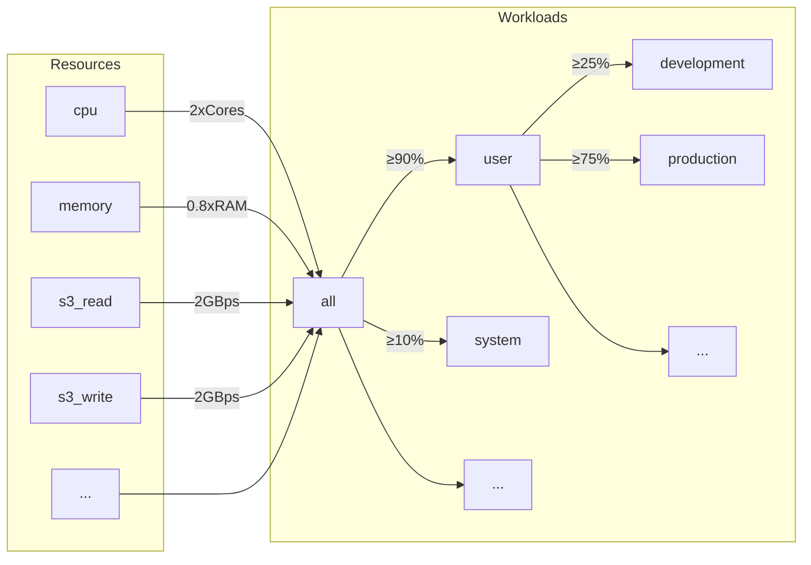
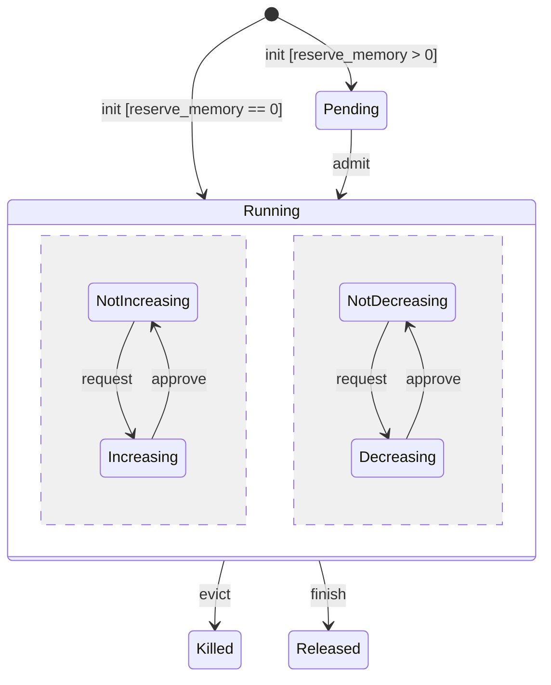
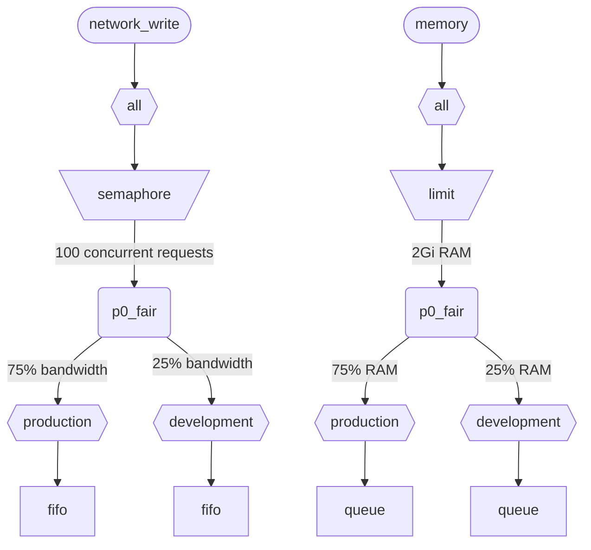

当 ClickHouse 同时执行多个查询时，它们会共享资源 (CPU、内存和 IO) 。可以应用调度约束和策略，以控制不同工作负载之间资源的使用和共享。对于所有资源，都可以配置统一的调度层级结构。该层级结构的根节点表示共享资源，而叶子节点则表示特定工作负载，承载特定查询和后台活动的资源请求与分配。

<div id="resources">
  ## 资源
</div>

默认情况下，工作负载调度是禁用的。要启用该功能，您需要创建用于调度的资源，以及至少一个工作负载。所有资源彼此独立，可以任意组合使用。

要启用 CPU 调度，您需要为 MASTER 或 WORKER 线程创建 CPU 资源 (详见 [CPU 调度](#cpu_scheduling)) ：

```sql
CREATE RESOURCE cpu (MASTER THREAD, WORKER THREAD)
```

要为工作负载启用内存预留，您需要创建 MEMORY 资源 (详见[内存预留](#memory-reservations)) ：

```sql
CREATE RESOURCE memory (MEMORY RESERVATION)
```

要启用查询槽位调度，必须创建 QUERY 资源 (详见[查询槽位调度](#query_scheduling)) ：

```sql
CREATE RESOURCE query (QUERY)
```

要为特定磁盘启用 IO 调度，必须为 WRITE 和 READ 访问创建读取和写入资源：

```sql
CREATE RESOURCE resource_name (WRITE DISK disk_name, READ DISK disk_name)
-- or
CREATE RESOURCE read_resource_name (WRITE DISK write_disk_name)
CREATE RESOURCE write_resource_name (READ DISK read_disk_name)
```

一个资源可用于任意数量的磁盘，可用于 READ、WRITE，或同时用于 READ 和 WRITE。还有一种语法允许将同一个资源用于所有磁盘：

```sql
CREATE RESOURCE all_io (READ ANY DISK, WRITE ANY DISK);
```

资源按共享模式分为：

* **时间共享资源** (CPU、IO、查询槽位) - 管理在调度层级叶子节点排队的资源请求。请求会根据层级定义的策略和约束进行调度。当查询访问相应资源时，就会创建资源请求。例如，当查询从磁盘读取数据，或使用 CPU 进行处理时，会按每个工作量子，或按通过套接字发送或接收的字节数创建资源请求。
* **空间共享资源** (内存) - 管理调度层级叶子节点上的资源分配。分配可能处于运行中或待处理状态。待处理的分配会被阻塞，直到有足够空间被释放，或其他分配被驱逐 (终止) 。相关决策基于层级定义的限制和策略。分配与查询 (或后台活动) 之间是一一对应的。分配会在查询开始执行时创建，并在查询结束时释放。运行中的分配其大小可以动态增减。

<div id="workloads">
  ## 工作负载层级结构
</div>

ClickHouse 提供了便捷的 SQL 语法来定义调度层级结构。所有资源都分布在统一的 WORKLOAD 层级结构中。对于某些特定资源，其分配规则的部分方面可以调整，但层级结构本身保持不变。每个 WORKLOAD 都会为每种资源维护必要的调度节点。可以在任意工作负载中创建子工作负载，从而构建出这一层级结构。ClickHouse 不会对工作负载层级结构强制要求任何特定或预定义的结构。

下面是一个层级结构示例：它将所有资源分别分配给 &quot;user&quot; 和 &quot;system&quot; 两个工作负载，并分别保证 90% 和 10% 的资源。请注意，为工作负载定义的权重用于最大最小公平原则，因此它们只能尽力提供下限保障 (而不是上限限制或配额) 。所有调度都是在每台主机上独立进行的，因此由 `max_*` 设置定义的限制都是按主机计算的。工作负载 &quot;user&quot; 进一步将其资源细分给 &quot;development&quot; 和 &quot;production&quot; 两个工作负载，其中 &quot;production&quot; 拥有的资源是 &quot;development&quot; 的 3 倍：

```sql
CREATE RESOURCE cpu (MASTER THREAD, WORKER THREAD)
CREATE RESOURCE memory (MEMORY RESERVATION)
CREATE RESOURCE s3_read (READ DISK s3)
CREATE RESOURCE s3_write (WRITE DISK s3)
CREATE WORKLOAD all SETTINGS max_concurrent_threads_ratio_to_cores = 2, max_memory_ratio = 0.8, max_bytes_per_second = '2Gi'
CREATE WORKLOAD user IN all SETTINGS weight = 9
CREATE WORKLOAD system IN all
CREATE WORKLOAD development IN user
CREATE WORKLOAD production IN user SETTINGS weight = 3
```



没有子节点的叶子工作负载名称可以在查询设置 `SETTINGS workload = 'name'` 中使用。详情请参见 [工作负载 markup](#workload-markup)。

要自定义工作负载，可以使用以下设置：

* `priority` - (仅限 时间共享) 同级工作负载按静态值提供服务 (值越小表示优先级越高) 。决定抢占行为。
* `precedence` - (仅限 空间共享) 同级工作负载按静态值准入 (值越小表示优先次序越高) 。决定驱逐和准入行为。
* `weight` - 具有相同静态优先级或优先次序的同级工作负载会按权重公平地共享资源。影响抢占、驱逐和准入。
* `max_io_requests` - 此工作负载中并发 IO 请求数量的上限。
* `max_bytes_inflight` - 此工作负载中并发请求在途总字节数的上限。
* `max_bytes_per_second` - 此工作负载的字节读取或写入速率上限。
* `max_burst_bytes` - 该工作负载在不被限流的情况下可处理的最大字节数 (对每种资源分别独立计算) 。
* `max_concurrent_threads` - 此工作负载中查询可使用的线程数量上限。
* `max_concurrent_threads_ratio_to_cores` - 与 `max_concurrent_threads` 相同，但会按可用 CPU 核心数量进行归一化。
* `max_cpus` - 此工作负载中查询可使用的 CPU 核心数量上限。
* `max_cpu_share` - 与 `max_cpus` 相同，但会按可用 CPU 核心数量进行归一化。
* `max_burst_cpu_seconds` - 该工作负载在不因 `max_cpus` 而被限流的情况下可消耗的最大 CPU 秒数。
* `max_memory` - 为此工作负载保留的总内存上限。

通过工作负载 settings 指定的所有限制都彼此独立，分别作用于每种资源。例如，设置了 `max_bytes_per_second = '10Mi'` 的工作负载，会对每个读写资源分别施加 10 MB/s 的带宽限制。如果需要对读取和写入施加统一限制，请考虑为 READ 和 WRITE 访问使用相同的资源。

无法为不同资源指定不同的工作负载层级。不过，可以为特定资源指定不同的工作负载设置值：

```sql
CREATE OR REPLACE WORKLOAD all SETTINGS max_io_requests = 100, max_bytes_per_second = '1Mi' FOR network_read, max_bytes_per_second = '2Mi' FOR network_write
```

另请注意，如果某个工作负载或资源被另一个工作负载引用，则无法将其删除。要更新工作负载的定义，请使用 `CREATE OR REPLACE WORKLOAD` 查询。

:::note
工作负载设置会被转换为一组合适的调度节点。有关更底层的细节，请参阅调度节点的[类型和选项](#hierarchy)说明。
:::

<div id="workload-markup">
  ## 工作负载标记
</div>

可以通过设置 `workload` 为查询添加标记，以区分不同的工作负载。如果未设置 `workload`，则使用值 &quot;default&quot;。请注意，也可以使用 profile 指定其他值。如果希望某个用户的所有查询都使用固定的 `workload` 设置值进行标记，可以使用设置约束将 `workload` 固定为常量。

:::warning
查询设置 `workload` 只能引用叶子工作负载 (即没有子节点的工作负载) 。
:::

```sql
SELECT count() FROM my_table WHERE value = 42 SETTINGS workload = 'production'
SELECT count() FROM my_table WHERE value = 13 SETTINGS workload = 'development'
```

可以为后台活动指定 `workload` 设置。合并操作和变更分别使用 `merge_workload` 和 `mutation_workload` 服务器设置。对于特定表，也可以通过 `merge_workload` 和 `mutation_workload` MergeTree 设置覆盖这些值。

<div id="cpu_scheduling">
  ## CPU 调度
</div>

要为工作负载启用 CPU 调度，请创建 CPU 资源，并设置并发线程数上限：

```sql
CREATE RESOURCE cpu (MASTER THREAD, WORKER THREAD)
CREATE WORKLOAD all SETTINGS max_concurrent_threads = 100
```

当 ClickHouse server 执行大量并发查询，且每个查询使用[多个线程](/zh/operations/settings/settings.md#max_threads)、所有 CPU 插槽都已占满时，就会进入过载状态。在过载状态下，每当有 CPU 插槽被释放，都会根据调度策略重新分配给相应的工作负载。对于共享同一工作负载的查询，插槽按轮询方式分配。对于属于不同工作负载的查询，插槽则根据为各工作负载指定的权重、优先级和限制进行分配。

线程在未被阻塞且正在执行 CPU 密集型任务时会消耗 CPU 时间。出于调度目的，这里区分两类线程：

* Master thread — 开始执行查询或 merge、变更等后台活动的第一个线程。
* Worker thread — 由 master 派生出的额外线程，用于执行 CPU 密集型任务。

为了获得更好的响应性，通常希望为 master 和 worker 线程使用彼此独立的资源。在查询设置 `max_threads` 取值较高时，大量 worker 线程很容易独占 CPU 资源。这样一来，新进入的查询就不得不阻塞并等待 CPU 插槽，以便其 master 线程能够开始执行。为避免这种情况，可以使用以下配置：

```sql
CREATE RESOURCE worker_cpu (WORKER THREAD)
CREATE RESOURCE master_cpu (MASTER THREAD)
CREATE WORKLOAD all SETTINGS max_concurrent_threads = 100 FOR worker_cpu, max_concurrent_threads = 1000 FOR master_cpu
```

这将对主线程和工作线程分别设置限制。即使 100 个工作线程 CPU 插槽全部处于忙碌状态，只要还有可用的主线程 CPU 插槽，新查询就不会被阻塞。它们会先以单线程开始执行。之后，如果工作线程 CPU 插槽变为可用，这类查询就可以扩展并生成工作线程。另一方面，这种方法不会将插槽总数限制在 CPU 处理器数量以内，而运行过多并发线程会影响性能。

限制主线程的并发度，并不能限制并发查询的数量。CPU 插槽可能会在查询执行过程中途释放，并被其他线程重新获取。例如，在主线程并发限制为 2 的情况下，4 个并发查询仍然可以并行执行。在这种情况下，每个查询将获得一个 CPU 处理器 50% 的处理能力。要限制并发查询的数量，需要使用单独的逻辑，而工作负载目前尚不支持这一点。

可为工作负载设置单独的线程并发限制：

```sql
CREATE RESOURCE cpu (MASTER THREAD, WORKER THREAD)
CREATE WORKLOAD all
CREATE WORKLOAD admin IN all SETTINGS max_concurrent_threads = 10
CREATE WORKLOAD production IN all SETTINGS max_concurrent_threads = 100
CREATE WORKLOAD analytics IN production SETTINGS max_concurrent_threads = 60, weight = 9
CREATE WORKLOAD ingestion IN production
```

此配置示例为 admin 和 production 提供了相互独立的 CPU 槽位池。production 槽位池由 analytics 和摄取共享。此外，如果 production 槽位池过载，必要时每释放 10 个槽位，其中 9 个会被重新调度给 analytics 查询。过载期间，摄取查询只能获得 10 个槽位中的 1 个。这可能有助于降低面向用户的查询延迟。analytics 自身还有 60 个并发线程的限制，因此始终至少会留下 40 个线程来支持摄取。未发生过载时，摄取可以使用全部 100 个线程。

要将某个查询排除在 CPU 调度之外，请将查询设置 [use&#95;concurrency&#95;control](/zh/operations/settings/settings.md/#use_concurrency_control) 设为 0。

CPU 调度目前尚不支持合并和变更。

为了为工作负载提供公平的资源分配，需要在查询执行期间执行抢占和缩减。抢占通过 `cpu_slot_preemption` 服务器设置启用。启用后，每个线程都会定期续订其 CPU 槽位 (根据 `cpu_slot_quantum_ns` 服务器设置) 。如果 CPU 过载，这种续订可能会阻塞执行。当执行长时间被阻塞时 (参见 `cpu_slot_preemption_timeout_ms` 服务器设置) ，查询会缩减，并发运行的线程数也会动态减少。请注意，工作负载之间的 CPU 时间公平性可以得到保证，但在同一工作负载内，不同查询之间的公平性在某些边缘情况下可能会被破坏。

:::warning
槽位调度提供了一种控制[查询并发](/zh/operations/settings/settings.md#max_threads)的方法，但除非将服务器设置 `cpu_slot_preemption` 设为 `true`，否则它并不能保证 CPU 时间分配的公平性；否则，公平性是基于相互竞争的工作负载之间 CPU 槽位分配次数来实现的。这并不意味着各方获得的 CPU 秒数相同，因为在没有抢占的情况下，CPU 槽位可能会被无限期占用。线程会在开始时获取一个槽位，并在工作完成后释放它。
:::

:::note
声明 CPU 资源后，[`concurrent_threads_soft_limit_num`](server-configuration-parameters/settings.md#concurrent_threads_soft_limit_num) 和 [`concurrent_threads_soft_limit_ratio_to_cores`](server-configuration-parameters/settings.md#concurrent_threads_soft_limit_ratio_to_cores) 设置将不再生效。此时会改用工作负载设置 `max_concurrent_threads` 来限制为特定工作负载分配的 CPU 数量。若要实现之前的行为，请仅创建 WORKER THREAD 资源，将工作负载 `all` 的 `max_concurrent_threads` 设置为与 `concurrent_threads_soft_limit_num` 相同的值，并使用 `workload = "all"` 查询设置。此配置等同于将 [`concurrent_threads_scheduler`](server-configuration-parameters/settings.md#concurrent_threads_scheduler) 设置为 &quot;fair&#95;round&#95;robin&quot;。
:::

<div id="threads_vs_cpus">
  ## 线程与 CPU
</div>

有两种方式可以控制工作负载的 CPU 消耗：

* 线程数限制：`max_concurrent_threads` 和 `max_concurrent_threads_ratio_to_cores`
* CPU 节流：`max_cpus`、`max_cpu_share` 和 `max_burst_cpu_seconds`

:::warning
仅当启用 `cpu_slot_preemption` 服务器设置时，CPU 节流设置才会生效，否则会被忽略。
:::

第一种方式可以根据当前服务器负载，动态控制为查询生成的线程数。它实际上会降低 `max_threads` 查询设置所指定的值。第二种方式则使用令牌桶算法来限制工作负载的 CPU 消耗。它不会直接影响线程数，但会限制该工作负载中所有线程的总 CPU 消耗。

使用 `max_cpus` 和 `max_burst_cpu_seconds` 的令牌桶节流机制表示：在任意 `delta` 秒的时间间隔内，该工作负载中所有查询的总 CPU 消耗不得超过 `max_cpus * delta + max_burst_cpu_seconds` CPU 秒。从长期来看，它会将平均消耗限制在 `max_cpus`，但短期内可能超过这一限制。例如，给定 `max_burst_cpu_seconds = 60` 和 `max_cpus=0.001`，则可以在不被节流的情况下运行 1 个线程 60 秒、2 个线程 30 秒，或 60 个线程 1 秒。`max_burst_cpu_seconds` 的默认值为 1 秒。在存在大量并发线程的情况下，较低的值可能会导致 `max_cpus` 允许的核心数无法得到充分利用。

当线程持有一个 CPU 插槽时，它可以处于以下三种主要状态之一：

* **运行中：** 实际消耗 CPU 资源。处于此状态的时间会计入 CPU 节流。
* **就绪：** 等待 CPU 可用。处于此状态的时间不会计入 CPU 节流。
* **阻塞：** 正在执行 IO 操作或其他阻塞型系统调用 (例如等待互斥锁) 。处于此状态的时间不会计入 CPU 节流。

下面来看一个同时结合 CPU 节流和线程数限制的配置示例：

```sql
CREATE RESOURCE cpu (MASTER THREAD, WORKER THREAD)
CREATE WORKLOAD all SETTINGS max_concurrent_threads_ratio_to_cores = 2
CREATE WORKLOAD admin IN all SETTINGS max_concurrent_threads = 2, priority = -1
CREATE WORKLOAD production IN all SETTINGS weight = 4
CREATE WORKLOAD analytics IN production SETTINGS max_cpu_share = 0.7, weight = 3
CREATE WORKLOAD ingestion IN production
CREATE WORKLOAD development IN all SETTINGS max_cpu_share = 0.3
```

这里我们将所有查询的线程总数限制为可用 CPU 数量的 2 倍。Admin 工作负载最多严格限制为两个线程，与可用 CPU 数量无关。Admin 的优先级为 -1 (低于默认值 0) ，因此在需要时会优先获得任何 CPU 插槽。当 admin 不运行查询时，CPU 资源会在 production 和 development 工作负载之间分配。CPU time 的保障份额基于权重 (4:1) ：production 至少获得 80% (如果需要) ，development 至少获得 20% (如果需要) 。权重决定保障，而 CPU throttling 决定上限：production 不受限制，可以占用 100%，而 development 的上限为 30%，即使没有来自其他工作负载的查询，也会应用这一限制。Production 工作负载不是 leaf，因此其资源会按权重 (3:1) 在 analytics 和 ingestion 之间分配。这意味着 analytics 至少有 0.8 * 0.75 = 60% 的保障，并且根据 `max_cpu_share`，其上限为总 CPU 资源的 70%。而 ingestion 至少有 0.8 * 0.25 = 20% 的保障，且没有上限。

:::note
如果你想最大化 ClickHouse server 上的 CPU 利用率，请避免对根工作负载 `all` 使用 `max_cpus` 和 `max_cpu_share`。相反，请为 `max_concurrent_threads` 设置更高的值。例如，在一个有 8 个 CPU 的系统上，设置 `max_concurrent_threads = 16`。这样可让 8 个线程运行 CPU 任务，同时另外 8 个线程处理 I/O 操作。额外的线程会制造 CPU 压力，从而确保调度规则得到执行。相反，设置 `max_cpus = 8` 永远不会产生 CPU 压力，因为 server 无法超过可用的 8 个 CPU。
:::

<div id="memory-reservations">
  ## 内存预留
</div>

:::note
内存预留调度处于 Experimental 阶段。只有在存在 `MEMORY RESERVATION` 资源时才会生效，并且其 SQL 接口和行为可能会在未来的发行版中发生变化。它目前尚不支持 合并 和变更操作，并且对正在运行的查询进行驱逐属于尽力而为：不会立即生效，而是在该查询的下一个内存同步点生效。
:::

要为工作负载启用内存预留，请创建 `MEMORY RESERVATION` 资源，并使用工作负载设置为预留内存总量设置至少一个限制：

```sql
CREATE RESOURCE memory (MEMORY RESERVATION)
CREATE WORKLOAD all SETTINGS max_memory = '2Gi'
```

ClickHouse 会跟踪所有查询和后台活动的内存分配情况。已分配的字节数会沿着调度层级逐级聚合到根节点。每个查询在其所属的叶子工作负载中都有一个关联的内存分配。如果查询的 `reserve_memory` 设置大于零，则该分配会以待处理状态创建。待处理分配会在工作负载层级中预留所请求的内存量。如果没有足够的可用内存，该分配会一直处于待处理状态，直到有足够的内存被释放，或其他分配被驱逐 (终止) 。当分配获准后，它会变为运行中。运行中的分配会根据查询的内存消耗动态增减其大小。分配的生命周期可以用下面的状态图来表示：



叶子工作负载的待处理分配按 FIFO 顺序准入。当多个工作负载都有待处理分配时，会根据优先次序和权重设置进行准入。优先次序更高的工作负载会优先获得服务。具有相同优先次序的同级工作负载会根据权重以 max-min fair 的方式共享内存，这意味着归一化内存使用量更低 (当前使用量加上请求增加量再除以权重) 的工作负载会优先获得服务。驱逐时则采用相反的逻辑。当需要释放内存时，优先次序更低且归一化内存使用量更高的工作负载会被优先驱逐。

请注意，时间共享 资源使用 priority，而 空间共享 资源使用优先次序。它们是相互独立的设置，可以设为不同的值。更高的 priority 表示非破坏性抢占 (延迟或限流) ，而更高的优先次序则可能表示破坏性驱逐 (以错误终止) 。某个工作负载在 CPU scheduling 上可以具有较高的 priority，但在 memory reservation 上使用相同的优先次序，以避免驱逐其他工作负载并丢失它们已完成的工作。

每个设置了 `max_memory` 限制的工作负载，都会确保其子树中分配的内存总量不超过该限制。如果待处理分配或增长中的分配会超出该限制，则会启动驱逐流程来释放内存。驱逐流程会选择一个 victim 并将其 kill。killer 和 victim 的最低共同祖先工作负载会在以下情况下阻止驱逐：

* 待处理分配不能驱逐同一工作负载中的运行中分配。 (Killer 和 victim 工作负载重合) 。
* 较低优先次序的待处理分配绝不会 kill 更高优先次序的工作负载。
* 待处理分配不能 kill 具有相同优先次序的分配。请注意，具有相同优先次序的运行中分配可能会基于归一化内存使用量相互驱逐。
  如果驱逐被阻止，或者未能释放足够的内存，则新的分配会被阻塞，直到释放出足够的内存。这些规则允许基于内存压力对超量查询进行排队，并提供了一种便捷方式来避免 MEMORY&#95;LIMIT&#95;EXCEEDED 错误。

:::note
工作负载限制独立于其他限制内存消耗的方式，例如查询设置 [max&#95;memory&#95;usage](/zh/operations/settings/settings.md#max_memory_usage)。它们可以结合使用，以更好地控制内存消耗。也可以基于用户 (而非工作负载) 设置独立的内存限制。但这种方式灵活性较低，也不提供内存预留和待处理查询排队等功能。参见 [内存 overcommit](settings/memory-overcommit.md)
:::

工作负载设置 `max_waiting_queries` 用于限制该工作负载的待处理分配数量。当达到该限制时，服务器会返回错误 `SERVER_OVERLOADED`。请注意，`max_waiting_queries` 不会被子节点工作负载继承，并且只对叶子工作负载有意义。

目前，内存预留调度尚不支持 合并 和 变更。

只有 `reserve_memory` 设置大于零的查询，在等待内存预留时才会被阻塞。不过，`reserve_memory` 为零的查询也会计入其所属工作负载的内存占用，必要时也可能被驱逐，以便为其他待处理的或持续增长的内存分配释放空间。没有正确 工作负载 标记的查询不受内存预留调度约束，也不能被调度器驱逐。

要为查询提供非弹性的内存预留，请将 `reserve_memory` 和 `max_memory_usage` 这两个查询设置设为相同的值。在这种情况下，查询会预留固定数量的内存，且无法再动态增加其内存分配。请注意，弹性内存预留在没有内存压力时，可以在不被终止的情况下从 `reserve_memory` 增加到 `max_memory_usage`。但即使实际使用量更低，也不能降到 `reserve_memory` 以下。

让我们来看一个 configuration 示例：

```sql
CREATE RESOURCE memory (MEMORY RESERVATION)
CREATE WORKLOAD all SETTINGS max_memory = '10Gi'
CREATE WORKLOAD system IN all SETTINGS weight = 1
CREATE WORKLOAD user IN all SETTINGS weight = 9
CREATE WORKLOAD production IN user SETTINGS precedence = 1, weight = 3
CREATE WORKLOAD staging IN user SETTINGS precedence = 1, weight = 1
CREATE WORKLOAD testing IN user SETTINGS precedence = 2
```

在此示例中，所有查询和后台活动预留的总内存不能超过 10 GiB。system 工作负载至少保证 1 GiB (10 GiB 的 10%) ，而 user 工作负载至少保证 9 GiB (10 GiB 的 90%) 。在 user 工作负载内部，production 和 staging 工作负载按权重 (3:1) 共享内存，且二者的优先次序都为 1。testing 工作负载的优先次序为 2，低于 production 和 staging。因此，testing 工作负载只能使用 production 和 staging 未使用的内存。

如果出现内存压力，testing 工作负载的内存分配会最先被驱逐。随后，如果还需要释放更多内存，那么当 staging 工作负载 和 production 工作负载 超出各自保证值时，staging 工作负载的内存分配会先于 production 工作负载 的内存分配被驱逐。请注意，production 和 staging 中处于等待状态的查询可以驱逐 testing 工作负载中正在运行的内存分配以释放内存，但二者不能相互驱逐，因为它们具有相同的优先次序。出现内存压力时，它们会在队列中等待，这样系统就能避免因并发执行的查询过多而导致 MEMORY&#95;LIMIT&#95;EXCEEDED 错误。

请注意，system 工作负载的优先次序为 0 (default) ，高于 production、staging 和 testing 工作负载，但它们并不是同级工作负载。它们的最近公共祖先是工作负载 all，而它的两个子节点具有相同的优先次序。因此，处于等待状态的 system 工作负载不能驱逐其中任何一个，反之亦然。这可确保系统活动不容易被驱逐。

<div id="query_scheduling">
  ## 查询槽位调度
</div>

要为工作负载启用查询槽位调度，请创建 QUERY 资源，并为并发查询数量或每秒查询数量设置限制：

```sql
CREATE RESOURCE query (QUERY)
CREATE WORKLOAD all SETTINGS max_concurrent_queries = 100, max_queries_per_second = 10, max_burst_queries = 20
```

工作负载设置 `max_concurrent_queries` 用于限制给定工作负载可同时运行的并发查询数。它相当于查询设置 [`max_concurrent_queries_for_all_users`](/zh/operations/settings/settings#max_concurrent_queries_for_all_users) 和服务器设置 [max&#95;concurrent&#95;queries](/zh/operations/server-configuration-parameters/settings#max_concurrent_queries)。Async insert 查询以及某些特定查询 (如 KILL) 不计入此限制。

工作负载设置 `max_queries_per_second` 和 `max_burst_queries` 使用令牌桶限流器来限制该工作负载的查询数量。它可以保证在任意时间间隔 `T` 内，新启动执行的查询数不超过 `max_queries_per_second * T + max_burst_queries`。

工作负载设置 `max_waiting_queries` 用于限制该工作负载中处于等待状态的查询数。达到该限制时，服务器会返回错误 `SERVER_OVERLOADED`。请注意，`max_waiting_queries` 不会被子工作负载继承，并且仅对叶子工作负载有意义。

:::note
被阻塞的查询会无限期等待，并且在所有约束条件都满足之前，不会出现在 `SHOW PROCESSLIST` 中。
:::

<div id="workload_entity_storage">
  ## 工作负载和资源存储
</div>

所有工作负载和资源的定义都会以 `CREATE WORKLOAD` 和 `CREATE RESOURCE` 查询的形式持久存储在磁盘上的 `workload_path` 或 ZooKeeper 中的 `workload_zookeeper_path`。建议使用 ZooKeeper 存储，以确保各节点之间的一致性。或者，也可以将 `ON CLUSTER` 子句与磁盘存储配合使用。

<div id="config_based_workloads">
  ## 基于配置的工作负载和资源
</div>

除基于 SQL 的定义外，还可以在服务器配置文件中预先定义工作负载和资源。这在云环境中特别有用，因为某些限制由基础设施决定，而其他限制则可由客户调整。基于配置的实体优先于通过 SQL 定义的实体，且不能通过 SQL 命令修改或删除。

<div id="config_based_workloads_format">
  ### 配置格式
</div>

```xml
<clickhouse>
    <resources_and_workloads>
        CREATE RESOURCE memory (MEMORY RESERVATION);
        CREATE RESOURCE s3disk_read (READ DISK s3);
        CREATE RESOURCE s3disk_write (WRITE DISK s3);
        CREATE WORKLOAD all SETTINGS max_memory = '2Gi', max_io_requests = 500 FOR s3disk_read, max_io_requests = 1000 FOR s3disk_write, max_bytes_per_second = '1280Mi' FOR s3disk_read, max_bytes_per_second = '3200Mi' FOR s3disk_write;
        CREATE WORKLOAD production IN all SETTINGS weight = 3;
    </resources_and_workloads>
</clickhouse>
```

该配置使用与 `CREATE WORKLOAD` 和 `CREATE RESOURCE` 语句相同的 SQL 语法。所有查询都必须是有效的。

<div id="config_based_workloads_usage_recommendations">
  ### 使用建议
</div>

对于云环境，典型的设置可能包括：

1. 在配置中定义根工作负载和网络 IO 资源，以设置基础设施限制
2. 设置 `throw_on_unknown_workload` 以强制执行这些限制
3. 创建 `CREATE WORKLOAD default IN all`，以自动将限制应用于所有查询 (因为 `workload` 查询设置的默认值是 &#39;default&#39;)
4. 允许用户在已配置的层级结构内创建额外的工作负载

这样可以确保所有后台活动和查询都遵守基础设施限制，同时仍为用户特定的调度策略保留灵活性。

另一个用例是为异构集群中的不同节点使用不同的配置。

<div id="strict_resource_access">
  ## 严格资源访问
</div>

要强制所有查询都遵循资源调度策略，可以使用一个服务器设置 `throw_on_unknown_workload`。如果将其设为 `true`，则每个查询都必须使用有效的 `workload` 查询设置，否则会抛出 `RESOURCE_ACCESS_DENIED` 异常。如果将其设为 `false`，则此类查询不会使用资源调度器，也就是说，它将不受限制地访问任何 `RESOURCE`。查询设置 `'use_concurrency_control = 0'` 允许查询绕过 CPU 调度器，从而不受限制地使用 CPU。要强制执行 CPU 调度，请创建一个设置约束，将 `use_concurrency_control` 固定为只读常量值。

:::note
除非已执行 `CREATE WORKLOAD default`，否则不要将 `throw_on_unknown_workload` 设为 `true`。如果在启动期间执行了未显式设置 `workload` 的查询，可能会导致服务器启动问题。
:::

<div id="hierarchy">
  ### 调度节点层级
</div>

从调度子系统来看，每个资源都对应一个调度节点层级。ClickHouse 会根据 WORKLOAD 和 RESOURCE 的定义自动创建所有必需的调度节点。调度节点属于底层实现细节，可通过 [system.scheduler](/zh/operations/system-tables/scheduler.md) 表查看。

```sql
CREATE RESOURCE network_write (WRITE DISK s3)
CREATE RESOURCE memory (MEMORY RESERVATION)
CREATE WORKLOAD all SETTINGS max_io_requests = 100, max_memory = '2Gi'
CREATE WORKLOAD development IN all
CREATE WORKLOAD production IN all SETTINGS weight = 3
```



**时间共享节点类型：**

* `inflight_limit` (约束) - 如果并发的进行中请求数超过 `max_requests`，或其总成本超过 `max_cost`，则会阻塞；必须且只能有一个子节点。
* `bandwidth_limit` (约束) - 如果当前带宽超过 `max_speed` (0 表示无限制) ，或突发量超过 `max_burst` (默认为 `max_speed`) ，则会阻塞；必须且只能有一个子节点。
* `fair` (策略) - 根据最大最小公平原则，从其某个子节点中选择下一个要处理的请求；子节点可以指定 `weight` (默认为 1) 。
* `priority` (策略) - 根据静态优先级，从其某个子节点中选择下一个要处理的请求 (值越小，优先级越高) ；子节点应指定 `priority` (默认为 0) 。
* `fifo` (队列) - 层级结构中的叶节点，可容纳超出资源容量的请求。

**空间共享节点类型：**

* `limit` - 确保子节点的总分配量不超过限制；必要时会在子树中启动驱逐过程；必须且只能有一个子节点。
* `fair_allocation` - 根据最大最小公平原则执行驱逐；待处理的分配绝不会驱逐运行中的分配；子节点可以指定 `weight` (默认为 1) 。
* `precedence_allocation` - 根据静态优先次序执行驱逐 (值越小，优先次序越高) ；优先次序更高的待处理分配会驱逐优先次序更低的分配；子节点应指定 `precedence` (默认为 0) 。
* `queue` - 层级结构中的叶节点，可容纳运行中和待处理的分配。

<div id="deprecated-configuration">
  ## 已弃用的 XML 配置
</div>

另一种用于指定某个 resource 使用哪些 disk 的方式，是通过 server 的 `storage_configuration`：

要为特定 disk 启用 IO scheduling，需要在 Storage configuration 中指定 `read_resource` 和/或 `write_resource`。这会告诉 ClickHouse，对于给定 disk 上的每个读请求和写请求，应使用哪个 resource。读 resource 和写 resource 可以引用同一个 resource 名称，这对于 Local SSD 或 HDD 很有用。多个不同的 disk 也可以引用同一个 resource，这对于远程 disk 很有用：例如，当你希望在 &quot;production&quot; 和 &quot;development&quot; 工作负载之间公平分配网络 bandwidth 时。

示例：

```xml
<clickhouse>
    <storage_configuration>
        ...
        <disks>
            <s3>
                <type>s3</type>
                <endpoint>https://clickhouse-public-datasets.s3.amazonaws.com/my-bucket/root-path/</endpoint>
                <access_key_id>your_access_key_id</access_key_id>
                <secret_access_key>your_secret_access_key</secret_access_key>
                <read_resource>network_read</read_resource>
                <write_resource>network_write</write_resource>
            </s3>
        </disks>
        <policies>
            <s3_main>
                <volumes>
                    <main>
                        <disk>s3</disk>
                    </main>
                </volumes>
            </s3_main>
        </policies>
    </storage_configuration>
</clickhouse>
```

请注意，服务器配置选项的优先级高于通过 SQL 定义资源的方式。

以下示例展示了如何定义上图所示的 IO 调度层级结构：

```xml
<clickhouse>
    <resources>
        <network_read>
            <node path="/">
                <type>inflight_limit</type>
                <max_requests>100</max_requests>
            </node>
            <node path="/fair">
                <type>fair</type>
            </node>
            <node path="/fair/prod">
                <type>fifo</type>
                <weight>3</weight>
            </node>
            <node path="/fair/dev">
                <type>fifo</type>
            </node>
        </network_read>
        <network_write>
            <node path="/">
                <type>inflight_limit</type>
                <max_requests>100</max_requests>
            </node>
            <node path="/fair">
                <type>fair</type>
            </node>
            <node path="/fair/prod">
                <type>fifo</type>
                <weight>3</weight>
            </node>
            <node path="/fair/dev">
                <type>fifo</type>
            </node>
        </network_write>
    </resources>
</clickhouse>
```

为了充分利用底层资源的全部容量，你应该使用 `inflight_limit`。请注意，`max_requests` 或 `max_cost` 设得过小，可能导致资源无法得到充分利用；设得过大，则可能导致调度器内部的队列为空，进而使子树中的策略失效 (出现不公平或忽略优先级的情况) 。另一方面，如果你希望防止资源利用率过高，就应该使用 `bandwidth_limit`。当在 `duration` 秒内消耗的资源量超过 `max_burst + max_speed * duration` 字节时，它会进行限流。在同一资源上，可以使用两个 `bandwidth_limit` 节点，分别限制较短时间间隔内的峰值带宽，以及较长时间范围内的平均带宽。

<div id="workload-classifiers">
  ### 已弃用的工作负载分类器
</div>

工作负载分类器用于定义映射关系：将查询中指定的 `workload` 映射到特定资源应使用的叶子队列。目前，工作负载分类机制较为简单：仅支持静态映射。

示例：

```xml
<clickhouse>
    <workload_classifiers>
        <production>
            <network_read>/fair/prod</network_read>
            <network_write>/fair/prod</network_write>
        </production>
        <development>
            <network_read>/fair/dev</network_read>
            <network_write>/fair/dev</network_write>
        </development>
        <default>
            <network_read>/fair/dev</network_read>
            <network_write>/fair/dev</network_write>
        </default>
    </workload_classifiers>
</clickhouse>
```

<div id="see-also">
  ## 另请参阅
</div>

* [system.scheduler](/zh/operations/system-tables/scheduler.md)
* [system.workloads](/zh/operations/system-tables/workloads.md)
* [system.resources](/zh/operations/system-tables/resources.md)
* [merge&#95;workload](/zh/operations/settings/merge-tree-settings.md#merge_workload) MergeTree 设置
* [merge&#95;workload](/zh/operations/server-configuration-parameters/settings.md#merge_workload) 全局服务器级设置
* [mutation&#95;workload](/zh/operations/settings/merge-tree-settings.md#mutation_workload) MergeTree 设置
* [mutation&#95;workload](/zh/operations/server-configuration-parameters/settings.md#mutation_workload) 全局服务器级设置
* [workload&#95;path](/zh/operations/server-configuration-parameters/settings.md#workload_path) 全局服务器级设置
* [workload&#95;zookeeper&#95;path](/zh/operations/server-configuration-parameters/settings.md#workload_zookeeper_path) 全局服务器级设置
* [cpu&#95;slot&#95;preemption](/zh/operations/server-configuration-parameters/settings.md#cpu_slot_preemption) 全局服务器级设置
* [cpu&#95;slot&#95;quantum&#95;ns](/zh/operations/server-configuration-parameters/settings.md#cpu_slot_quantum_ns) 全局服务器级设置
* [cpu&#95;slot&#95;preemption&#95;timeout&#95;ms](/zh/operations/server-configuration-parameters/settings.md#cpu_slot_preemption_timeout_ms) 全局服务器级设置