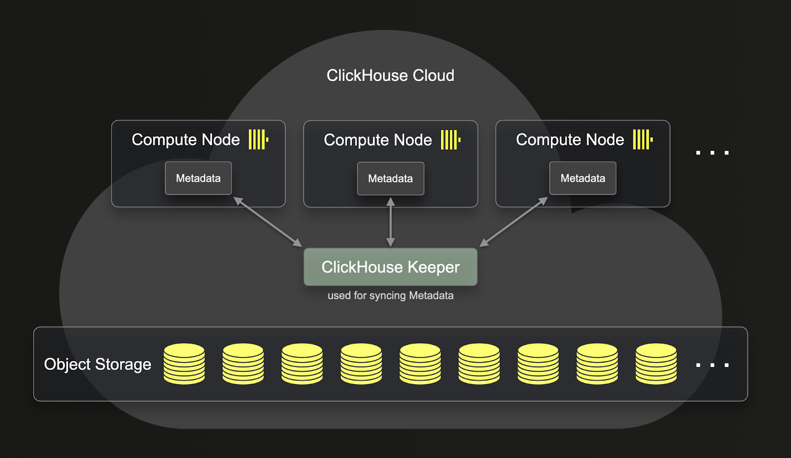
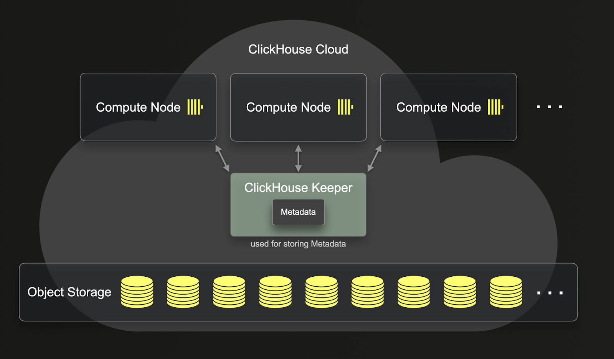

# SharedMergeTree {#sharedmergetree}


仅在ClickHouse Cloud（以及第一方合作伙伴云服务）中提供

SharedMergeTree表引擎系列是ReplicatedMergeTree引擎的云原生替代方案，经过优化，适用于共享对象存储（例如Amazon S3、Google Cloud Storage、MinIO、Azure Blob Storage）。每个特定的MergeTree引擎类型都有对应的SharedMergeTree引擎，例如ReplacingSharedMergeTree替代ReplacingReplicatedMergeTree。

SharedMergeTree表引擎为ClickHouse Cloud的性能带来了显著提升。对于终端用户来说，无需做任何改变即可开始使用SharedMergeTree引擎系列，而不是基于ReplicatedMergeTree的引擎。它提供的好处包括：

- 更高的插入吞吐量
- 后台合并的吞吐量提高
- Mutation操作的吞吐量提高
- 更快的扩容和缩容操作
- 用于选择查询的更轻量级强一致性

SharedMergeTree带来的一个重要改进是，与ReplicatedMergeTree相比，它提供了更彻底的计算和存储分离。下图展示了ReplicatedMergeTree如何分离计算和存储：



正如您所见，尽管存储在ReplicatedMergeTree中的数据位于对象存储中，但元数据仍存储在每个clickhouse-server上。这意味着对于每个复制操作，元数据也需要在所有副本上进行复制。



与ReplicatedMergeTree不同，SharedMergeTree不需要副本之间进行通信。相反，所有通信都通过共享存储和clickhouse-keeper进行。SharedMergeTree实现了异步无领导复制，并使用clickhouse-keeper进行协调和元数据存储。这意味着随着服务的扩展，不需要复制元数据。这可以加快复制、变更、合并和扩展操作。SharedMergeTree允许每个表有数百个副本，使得无需分片即可进行动态扩展。这也意味着在ClickHouse Cloud中，使用分布式查询执行方法可以利用更多的计算资源来执行查询。


## 系统监控

用于系统监控的ReplicatedMergeTree的大部分系统表（system table）在SharedMergeTree中也存在，唯独没有`system.replication_queue`和`system.replicated_fetches`，因为没有数据和元数据的复制。然而，SharedMergeTree对这两个表有相应的替代表。

`system.virtual_parts`

这个表作为SharedMergeTree对 `system.replication_queue` 的替代，存储关于最新的一组data parts，以及未来正在进行的合并、变更和删除parts。

`system.shared_merge_tree_fetches`

这个表是SharedMergeTree对`system.replicated_fetches`的替代。它包含关于正在加载入内存的主键和校验码信息。

## 使用SharedMergeTree

SharedMergeTree已经是所有开发实例（development tier）中的默认表引擎，并且可以通过提交支持工单在生产环境实例（product tier）中启用：https://clickhouse.cloud/support。

对于支持SharedMergeTree表引擎的实例，您不需要做任何额外变更。您可以像以前一样创建表，它会自动使用基于SharedMergeTree的表引擎，该引擎与您在CREATE TABLE查询中指定的引擎相对应。

通过使用 SharedMergeTree 表引擎可以创建 my_table 表。

```sql
CREATE TABLE my_table(
 key UInt64,
 value String
)
ENGINE = MergeTree
ORDER BY key 
```

在ClickHouse Cloud中，由于 `default_table_engine=MergeTree`，用户不必再特别设置`ENGINE=MergeTree`。下面的查询语句和上面的完全一样。

```sql

CREATE TABLE my_table(
 key UInt64,
 value String
)
ORDER BY key 
```

如果您使用Replacing、Collapsing、Aggregating、Summing、VersionedCollapsing、Graphite MergeTree表，它们将自动转换为相应的基于SharedMergeTree的表引擎。

```sql
CREATE TABLE myFirstReplacingMT
(
    `key` Int64,
    `someCol` String,
    `eventTime` DateTime
)
ENGINE = ReplacingMergeTree
ORDER BY key;
```

您可以使用SHOW CREATE TABLE查看用于创建表的语句。

``` sql
SHOW CREATE TABLE myFirstReplacingMT;
```

```sql
CREATE TABLE default.myFirstReplacingMT 
( `key` Int64, `someCol` String, `eventTime` DateTime ) 
ENGINE = SharedReplacingMergeTree('/clickhouse/tables/{uuid}/{shard}', '{replica}') 
ORDER BY key 
SETTINGS index_granularity = 8192
```

## 配置

一些配置的行为发生了显著的改变：

- `insert_quorum` -- 所有对SharedMergeTree的insert都是quorum insert（写入共享对象存储），因此在使用SharedMergeTree表引擎时不需要此设置。
- `insert_quorum_parallel` -- 所有对SharedMergeTree的insert都是quorum insert（写入共享对象存储）。
- `select_sequential_consistency` -- 不需要quorum inserts，会引起在SELECT查询中向clickhouse-keeper增加附加的请求。
