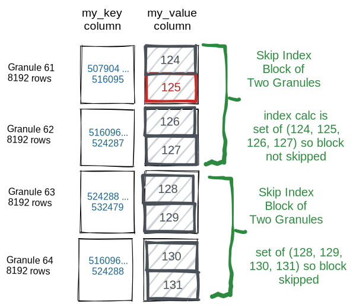

# 深入理解ClickHouse跳数索引

### 跳数索引

影响ClickHouse查询性能的因素很多。在大多数场景中，关键因素是ClickHouse在计算查询WHERE子句条件时是否可以使用主键。因此，选择适用于最常见查询模式的主键对于表的设计至关重要。

然而，无论如何仔细地调优主键，不可避免地会出现不能有效使用它的查询用例。用户通常依赖于ClickHouse获得时间序列类型的数据，但他们通常希望根据其他业务维度(如客户id、网站URL或产品编号)分析同一批数据。在这种情况下，查询性能可能会相当差，因为应用WHERE子句条件可能需要对每个列值进行完整扫描。虽然ClickHouse在这些情况下仍然相对较快，但计算数百万或数十亿个单独的值将导致“非索引”查询的执行速度比基于主键的查询慢得多。

在传统的关系数据库中，解决这个问题的一种方法是将一个或多个“二级”索引附加到表上。这是一个b-树结构，允许数据库在O(log(n))时间内找到磁盘上所有匹配的行，而不是O(n)时间(一次表扫描)，其中n是行数。但是，这种类型的二级索引不适用于ClickHouse(或其他面向列的数据库)，因为磁盘上没有单独的行可以添加到索引中。

相反，ClickHouse提供了一种不同类型的索引，在特定情况下可以显著提高查询速度。这些结构被标记为跳数索引，因为它们使ClickHouse能够跳过保证没有匹配值的数据块。
### 基本操作

用户只能在MergeTree表引擎上使用数据跳数索引。每个跳数索引都有四个主要参数：

- 索引名称。索引名用于在每个分区中创建索引文件。此外，在删除或具体化索引时需要将其作为参数。
- 索引的表达式。索引表达式用于计算存储在索引中的值集。它可以是列、简单操作符、函数的子集的组合。
- 类型。索引的类型控制计算，该计算决定是否可以跳过读取和计算每个索引块。
- GRANULARITY。每个索引块由颗粒（granule）组成。例如，如果主表索引粒度为8192行，GRANULARITY为4，则每个索引“块”将为32768行。

当用户创建数据跳数索引时，表的每个数据部分目录中将有两个额外的文件。

- skp_idx_{index_name}.idx：包含排序的表达式值。
- skp_idx_{index_name}.mrk2：包含关联数据列文件中的相应偏移量。

如果在执行查询并读取相关列文件时，WHERE子句过滤条件的某些部分与跳数索引表达式匹配，ClickHouse将使用索引文件数据来确定每个相关的数据块是必须被处理还是可以被绕过(假设块还没有通过应用主键索引被排除)。这里用一个非常简单的示例：考虑以下加载了可预测数据的表。

```
CREATE TABLE skip_table
(
  my_key UInt64,
  my_value UInt64
)
ENGINE MergeTree primary key my_key
SETTINGS index_granularity=8192;

INSERT INTO skip_table SELECT number, intDiv(number,4096) FROM numbers(100000000);
```

当执行一个不使用主键的简单查询时，将扫描my_value列所有的一亿条记录：

```
SELECT * FROM skip_table WHERE my_value IN (125, 700)

┌─my_key─┬─my_value─┐
│ 512000 │      125 │
│ 512001 │      125 │
│    ... |      ... |
└────────┴──────────┘

8192 rows in set. Elapsed: 0.079 sec. Processed 100.00 million rows, 800.10 MB (1.26 billion rows/s., 10.10 GB/s.
```

增加一个基本的跳数索引：

```
ALTER TABLE skip_table ADD INDEX vix my_value TYPE set(100) GRANULARITY 2;
```

通常，跳数索引只应用于新插入的数据，所以仅仅添加索引不会影响上述查询。

要使已经存在的数据生效，那执行：

```
ALTER TABLE skip_table MATERIALIZE INDEX vix;
```

重跑SQL：

```
SELECT * FROM skip_table WHERE my_value IN (125, 700)

┌─my_key─┬─my_value─┐
│ 512000 │      125 │
│ 512001 │      125 │
│    ... |      ... |
└────────┴──────────┘

8192 rows in set. Elapsed: 0.051 sec. Processed 32.77 thousand rows, 360.45 KB (643.75 thousand rows/s., 7.08 MB/s.)
```

这次没有再去处理1亿行800MB的数据，ClickHouse只读取和分析32768行360KB的数据—4个granule的数据。

下图是更直观的展示，这就是如何读取和选择my_value为125的4096行，以及如何跳过以下行而不从磁盘读取:



通过在执行查询时启用跟踪，用户可以看到关于跳数索引使用情况的详细信息。在clickhouse-client中设置send_logs_level:

```
SET send_logs_level='trace';
```
这将在尝试调优查询SQL和表索引时提供有用的调试信息。上面的例子中，调试日志显示跳数索引过滤了大部分granule，只读取了两个:

```
<Debug> default.skip_table (933d4b2c-8cea-4bf9-8c93-c56e900eefd1) (SelectExecutor): Index `vix` has dropped 6102/6104 granules.
```
### 跳数索引类型

#### minmax

这种轻量级索引类型不需要参数。它存储每个块的索引表达式的最小值和最大值(如果表达式是一个元组，它分别存储元组元素的每个成员的值)。对于倾向于按值松散排序的列，这种类型非常理想。在查询处理期间，这种索引类型的开销通常是最小的。

这种类型的索引只适用于标量或元组表达式——索引永远不适用于返回数组或map数据类型的表达式。

#### set

这种轻量级索引类型接受单个参数max_size，即每个块的值集(0允许无限数量的离散值)。这个集合包含块中的所有值(如果值的数量超过max_size则为空)。这种索引类型适用于每组颗粒中基数较低(本质上是“聚集在一起”)但总体基数较高的列。

该索引的成本、性能和有效性取决于块中的基数。如果每个块包含大量惟一值，那么针对大型索引集计算查询条件将非常昂贵，或者由于索引超过max_size而为空，因此索引将不应用。

#### Bloom Filter Types

Bloom filter是一种数据结构，它允许对集合成员进行高效的是否存在测试，但代价是有轻微的误报。在跳数索引的使用场景，假阳性不是一个大问题，因为惟一的问题只是读取一些不必要的块。潜在的假阳性意味着索引表达式应该为真，否则有效的数据可能会被跳过。

因为Bloom filter可以更有效地处理大量离散值的测试，所以它们可以适用于大量条件表达式判断的场景。特别的是Bloom filter索引可以应用于数组，数组中的每个值都被测试，也可以应用于map，通过使用mapKeys或mapValues函数将键或值转换为数组。

有三种基于Bloom过滤器的数据跳数索引类型：

* 基本的**bloom_filter**接受一个可选参数，该参数表示在0到1之间允许的“假阳性”率(如果未指定，则使用.025)。

* 更专业的**tokenbf_v1**。需要三个参数，用来优化布隆过滤器：（1）过滤器的大小字节(大过滤器有更少的假阳性，有更高的存储成本)，（2）哈希函数的个数(更多的散列函数可以减少假阳性)。（3）布隆过滤器哈希函数的种子。有关这些参数如何影响布隆过滤器功能的更多细节，请参阅  [这里](https://hur.st/bloomfilter/)  。此索引仅适用于String、FixedString和Map类型的数据。输入表达式被分割为由非字母数字字符分隔的字符序列。例如，列值`This is a candidate for a "full text" search`将被分割为`This` `is` `a` `candidate` `for` `full` `text` `search`。它用于LIKE、EQUALS、in、hasToken()和类似的长字符串中单词和其他值的搜索。例如，一种可能的用途是在非结构的应用程序日志行列中搜索少量的类名或行号。
  
* 更专业的**ngrambf_v1**。该索引的功能与tokenbf_v1相同。在Bloom filter设置之前需要一个额外的参数，即要索引的ngram的大小。一个ngram是长度为n的任何字符串，比如如果n是4，`A short string`会被分割为`A sh`` sho`, `shor`, `hort`, `ort s`, `or st`, `r str`, ` stri`, `trin`, `ring`。这个索引对于文本搜索也很有用，特别是没有单词间断的语言，比如中文。

### 跳数索引函数

跳数索引核心目的是限制流行查询分析的数据量。鉴于ClickHouse数据的分析特性，这些查询的模式在大多数情况下都包含函数表达式。因此，跳数索引必须与常用函数正确交互才能提高效率。这种情况可能发生在:
* 插入数据并将索引定义为一个函数表达式(表达式的结果存储在索引文件中)或者
* 处理查询，并将表达式应用于存储的索引值，以确定是否排除数据块。

每种类型的跳数索引支持的函数列表可以查看 [这里](https://clickhouse.com/docs/en/engines/table-engines/mergetree-family/mergetree/#functions-support) 。通常，集合索引和基于Bloom filter的索引(另一种类型的集合索引)都是无序的，因此不能用于范围。相反，最大最小值索引在范围中工作得特别好，因为确定范围是否相交非常快。部分匹配函数LIKE、startsWith、endsWith和hasToken的有效性取决于使用的索引类型、索引表达式和数据的特定形状。

### 跳数索引的配置

有两个可用的设置可应用于跳数索引。

* **use_skip_indexes** (0或1，默认为1)。不是所有查询都可以有效地使用跳过索引。如果一个特定的过滤条件可能包含很多颗粒，那么应用数据跳过索引将导致不必要的、有时甚至是非常大的成本。对于不太可能从任何跳过索引中获益的查询，将该值设置为0。
* **force_data_skipping_indexes** (以逗号分隔的索引名列表)。此设置可用于防止某些类型的低效查询。在某些情况下，除非使用跳过索引，否则查询表的开销太大，如果将此设置与一个或多个索引名一起使用，则对于任何没有使用所列索引的查询将返回一个异常。这将防止编写糟糕的查询消耗服务器资源。

### 最佳实践

跳数索引并不直观，特别是对于来自RDMS领域并且习惯二级行索引或来自文档存储的反向索引的用户来说。要获得任何优化，应用ClickHouse数据跳数索引必须避免足够多的颗粒读取，以抵消计算索引的成本。关键是，如果一个值在一个索引块中只出现一次，就意味着整个块必须读入内存并计算，而索引开销是不必要的。

考虑以下数据分布：


假设主键/顺序是时间戳，并且在visitor_id上有一个索引。考虑下面的查询:

 `SELECT timestamp, url FROM table WHERE visitor_id = 1001`

对于这种数据分布，传统的二级索引非常有利。不是读取所有的32678行来查找具有请求的visitor_id的5行，而是二级索引只包含5行位置，并且只从磁盘读取这5行。ClickHouse数据跳过索引的情况正好相反。无论跳转索引的类型是什么，visitor_id列中的所有32678值都将被测试。

因此，试图通过简单地向键列添加索引来加速ClickHouse查询的冲动通常是不正确的。只有在研究了其他替代方法之后，才应该使用此高级功能，例如修改主键(查看 [如何选择主键](../improving-query-performance/sparse-primary-indexes.md))、使用投影或使用实体化视图。即使跳数索引是合适的，也经常需要对索引和表进行仔细的调优。

在大多数情况下，一个有用的跳数索引需要主键和目标的非主列/表达式之间具有很强的相关性。如果没有相关性(如上图所示)，那么在包含数千个值的块中，至少有一行满足过滤条件的可能性很高，并且只有几个块会被跳过。相反，如果主键的值范围(如一天中的时间)与潜在索引列中的值强相关(如电视观众年龄)，则最小值类型的索引可能是有益的。注意，在插入数据时，可以增加这种相关性，方法是在sort /ORDER by键中包含额外的列，或者以在插入时对与主键关联的值进行分组的方式对插入进行批处理。例如，即使主键是一个包含大量站点事件的时间戳，特定site_id的所有事件也都可以被分组并由写入进程插入到一起，这将导致许多只包含少量站点id的颗粒，因此当根据特定的site_id值搜索时，可以跳过许多块。

跳数索引的另一个候选者是高基数表达式，其中任何一个值在数据中都相对稀疏。一个可能的例子是跟踪API请求中的错误代码的可观察性平台。某些错误代码虽然在数据中很少出现，但对搜索来说可能特别重要。error_code列上的set skip索引将允许绕过绝大多数不包含错误的块，从而显著改善针对错误的查询。

最后，关键的最佳实践是测试、测试、再测试。同样，与用于搜索文档的b-树二级索引或倒排索引不同，跳数索引行为是不容易预测的。将它们添加到表中会在数据摄取和查询方面产生很大的成本，这些查询由于各种原因不能从索引中受益。它们应该总是在真实世界的数据类型上进行测试，测试应该包括类型、粒度大小和其他参数的变化。测试通常会暴露仅仅通过思考不能发现的陷阱。
