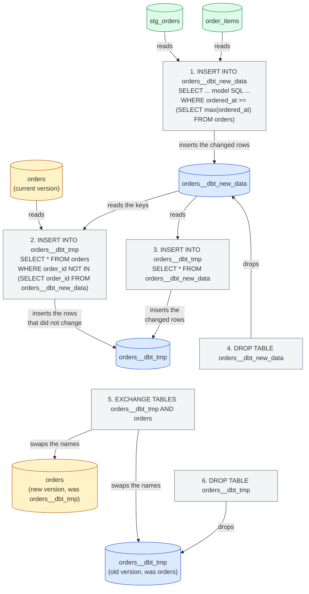
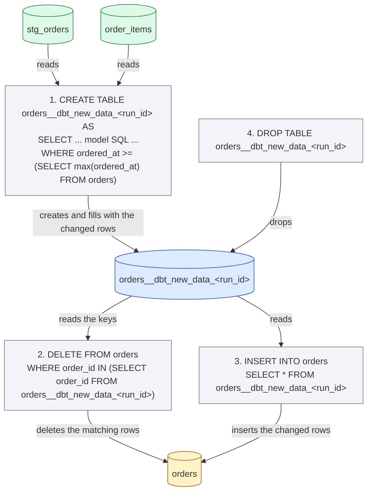
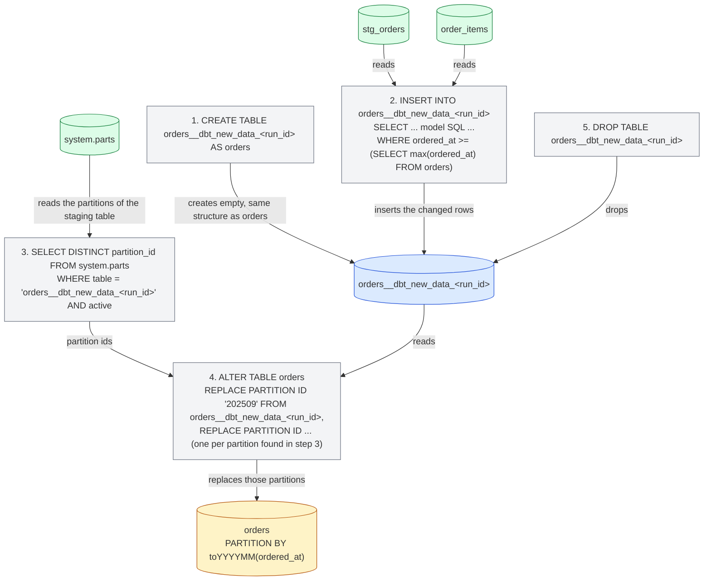

import { ClickHouseSupportedBadge } from "/snippets/zh/components/ClickHouseSupported/ClickHouseSupported.jsx";

<ClickHouseSupportedBadge />

本指南借助 [Jaffle Shop for ClickHouse](https://github.com/ClickHouse/jaffle-shop-clickhouse) 项目 (dbt Labs 经典示例项目的 ClickHouse 移植版) ，介绍 dbt 中 ClickHouse 特有的部分。指南以一个已能正常构建的项目为起点，展示如何：

1. 理解项目中的 view 和表在 ClickHouse 中以何种形式呈现。
2. 使用 seed 加载数据，并控制 ClickHouse 类型和表的 layout。
3. 为 table 模型配置 ClickHouse engine、sorting key 和 partitioning。
4. 将 table 转换为 incremental 模型，并选择合适的 incremental strategy。
5. 创建 snapshot。
6. 使用 ClickHouse materialized view。

本指南适合与其余[文档](/zh/integrations/connectors/data-ingestion/etl-tools/dbt/index)、[features and configurations](/zh/integrations/connectors/data-ingestion/etl-tools/dbt/features-and-configurations) 页面以及[物化类型参考](/zh/integrations/connectors/data-ingestion/etl-tools/dbt/materializations)配合阅读。

## 开始之前 {#before-you-start}

请先按照 [ClickHouse/jaffle-shop-clickhouse](https://github.com/ClickHouse/jaffle-shop-clickhouse) 的 README 操作。其中说明了如何使用 dbt Core 1.x、dbt OSS、dbt v2 或 dbt 平台搭建该项目，如何将其指向本地 ClickHouse (docker) 或 ClickHouse Cloud，如何使用 `dbt seed` 加载示例数据，以及如何执行首次 `dbt build`。`dbt build` 成功完成后，再回到本页查看 ClickHouse 特有的示例和配置。

完成 README 中的步骤后，ClickHouse 中应当有两个数据库：

* `raw`：由 `dbt seed` 从 CSV file 加载的六张源表 (`raw_customers`、`raw_orders`、`raw_items`、`raw_products`、`raw_stores`、`raw_supplies`) 。
* `jaffle_shop` (即你的 profile 中的 `schema`) ：六个暂存视图 (`stg_*`) 和七张 mart 表 (`customers`、`orders`、`order_items`、`products`、`locations`、`supplies`、`metricflow_time_spine`) 。

如果你的 profile 使用了其他 `schema`，请将下面查询中的 `jaffle_shop` 替换为你的实际取值。

<Note>
  **dbt Core 1.x、dbt OSS、dbt v2 与 dbt 平台。** 本指南中的所有命令和模型在它们上都完全一致。这些示例已在 dbt Core 1.12 (搭配 `dbt-clickhouse` 1.10) 和 dbt OSS 2.0 上针对 ClickHouse 26.8 进行过测试；dbt v2 运行的是同一个 adapter，而 dbt 平台运行的是 dbt v2。文中展示的控制台输出来自 dbt Core 1.x，对于少数引擎行为存在差异的地方，文中会特别说明。有关 v2 adapter 的最新状态，请参阅 [dbt OSS、dbt v2 与 dbt 平台页面](/zh/integrations/connectors/data-ingestion/etl-tools/dbt/dbt-core-v2-fusion-and-platform)；若要在 dbt 平台上快速上手，请参阅 dbt 文档中的 [Connect ClickHouse](https://docs.getdbt.com/docs/platform/connect-data-platform/connect-clickhouse)。
</Note>

所有非 dbt 命令的 SQL 语句都应直接在 ClickHouse 上执行，例如通过 `clickhouse client`、ClickHouse Cloud SQL 控制台或你习惯使用的 SQL 客户端。

## 项目的物化方式 {#views-and-tables}

Jaffle Shop 在 `dbt_project.yml` 中配置其物化类型：staging 模型为视图，marts 为表。

```yaml
models:
  jaffle_shop:
    staging:
      +materialized: view
    marts:
      +materialized: table
```

**view** 模型在每次运行时都会通过 `CREATE OR REPLACE VIEW` 语句重新构建。它不存储任何数据，因此构建没有任何开销，但每次查询它时，都会针对源表执行该模型的 SQL。ClickHouse 会将模型编译后的 SQL 保存在视图定义中：

```sql
SHOW CREATE VIEW jaffle_shop.stg_orders;
```

```response
CREATE VIEW jaffle_shop.stg_orders
(
    `order_id` String,
    `location_id` String,
    `customer_id` String,
    ...
    `ordered_at` DateTime
)
AS WITH
    source AS
    (
        SELECT *
        FROM raw.raw_orders
    ),
    renamed AS
    (
        SELECT
            id AS order_id,
            store_id AS location_id,
            ...
            dateTrunc('day', ordered_at) AS ordered_at
        FROM source
    )
SELECT *
FROM renamed
```

**table** 模型在每次运行时都会从头重建：adapter 会创建一张新表，使用该模型的 SQL 执行 `INSERT INTO ... SELECT`，然后以原子方式将其与上一版本互换。其查询性能远优于 view，代价是占用存储空间，且每次都要重建整张表。来看看 dbt 为 `orders` 这个 mart 创建的表：

```sql
SHOW CREATE TABLE jaffle_shop.orders;
```

```response
CREATE TABLE jaffle_shop.orders
(
    `order_id` String,
    `location_id` String,
    `customer_id` String,
    ...
    `customer_order_number` UInt64
)
ENGINE = MergeTree
ORDER BY tuple()
SETTINGS replicated_deduplication_window = '0', index_granularity = 8192
```

这里有两点是 ClickHouse 特有的。该模型没有声明表引擎，因此adapter使用 `MergeTree`；它也没有声明sorting key，因此adapter使用 `ORDER BY tuple()`，也就是数据完全不排序。对于示例项目来说这没什么问题，但在真实的表中，你应当明确指定这两项，这也正是后续几节要做的事情。[物化类型页面](/zh/integrations/connectors/data-ingestion/etl-tools/dbt/materializations)列出了adapter支持的所有表配置。

## 使用 seeds 加载数据 {#seeds}

Jaffle Shop 使用 dbt [seeds](https://docs.getdbt.com/docs/build/seeds) 从 `seeds/jaffle-data` 目录下的 CSV 文件加载原始数据。Seeds 的用途是小型静态参考数据 (代码表、映射关系) ，而非向数据仓库批量加载数据；本项目只是为了方便才使用它，让你无需额外的摄取工具即可上手——这也是为什么除非传入 `--vars '{"load_source_data": true}'`，否则 seeds 默认处于禁用状态。

即便如此，seeds 仍是了解 dbt 如何创建 ClickHouse 表的好切入点。dbt 会为每个 CSV 列推断列类型，而不同引擎推断出的类型有所差异：

| CSV 值                 | dbt v1     | v2 引擎           |
| --------------------- | ---------- | --------------- |
| `700`                 | `Int32`    | `Int64`         |
| `0.06`                | `Float32`  | `Float64`       |
| `2024-09-01T15:01:00` | `DateTime` | `DateTime64(6)` |
| `Philadelphia`        | `String`   | `String`        |

当类型很重要时，请用 `column_types` 显式固定类型。本项目已在 `dbt_project.yml` 中对 `raw_stores` seed 的 `opened_at` 列这样处理：

```yaml
seeds:
  jaffle_shop:
    +schema: raw
    jaffle-data:
      +enabled: "{{ var('load_source_data', false) }}"
      raw_stores:
        +column_types:
          opened_at: DateTime64(3)
```

Seed 同样支持 ClickHouse 表配置项 `engine`、`order_by` 和 `partition_by`。例如，若要让 `raw_orders` seed 按下单时间排序并按月分区，可在 CSV 文件旁添加一个属性文件 `seeds/jaffle-data/_raw_orders.yml`：

```yaml
seeds:
  - name: raw_orders
    config:
      order_by: (ordered_at, id)
      partition_by: toYYYYMM(ordered_at)
```

<Note>
  这些 ClickHouse seed 配置应写在 properties 文件中，而不要放在 `dbt_project.yml` 的 `seeds:` 下，通过 `+order_by` 或 `+engine` 键来指定。dbt Core 1.x 两种写法都接受，但 dbt v2 只识别 properties 文件中的配置，并会拒绝 `dbt_project.yml` 中的这些键，报错 `Unrecognized key ... Custom keys must go under +meta`。
</Note>

重新加载该 seed，并检查它生成的表：

```bash
dbt seed --select raw_orders --full-refresh --vars '{"load_source_data": true}'
```

```sql
SHOW CREATE TABLE raw.raw_orders;
```

```response
CREATE TABLE raw.raw_orders
(
    `id` String,
    `customer` String,
    `ordered_at` DateTime,
    `store_id` String,
    `subtotal` Int32,
    `tax_paid` Int32,
    `order_total` Int32
)
ENGINE = MergeTree
PARTITION BY toYYYYMM(ordered_at)
ORDER BY (ordered_at, id)
SETTINGS index_granularity = 8192
```

`dbt seed --full-refresh` 会删除并重新创建该表，因此请先运行它，然后再构建任何直接依赖该表数据的对象 (例如本指南后文中的 materialized view) 。

## 为 ClickHouse 配置表 {#table-configuration}

`orders` mart 是最自然的起点：它会被 `customers` mart 以及项目的 metrics 查询，而且它是一张带 timestamp 的事件型表。在 `models/marts/orders.sql` 顶部添加一个 `config` 块，用于指定 engine、sorting key 和分区方案：

```sql
{{
    config(
        materialized='table',
        engine='MergeTree()',
        order_by='(ordered_at, order_id)',
        partition_by='toYYYYMM(ordered_at)'
    )
}}

with

orders as (

    select * from {{ ref('stg_orders') }}

),
...
```

模型的其余部分保持不变。`materialized='table'` 重复了 `dbt_project.yml` 中已为 marts 设定的内容,这样在之后将该模型切换为增量模式时,模型本身仍然是自描述的。仅重新构建该模型:

```bash
dbt run --select orders
```

```response
1 of 1 START sql table model `jaffle_shop`.`orders` ............................ [RUN]
1 of 1 OK created sql table model `jaffle_shop`.`orders` ....................... [OK in 0.44s]
```

现在该表有了合适的sorting key，并按月分区：

```sql
SHOW CREATE TABLE jaffle_shop.orders;
```

```response
CREATE TABLE jaffle_shop.orders
(
    ...
)
ENGINE = MergeTree
PARTITION BY toYYYYMM(ordered_at)
ORDER BY (ordered_at, order_id)
SETTINGS replicated_deduplication_window = '0', index_granularity = 8192
```

```sql
SELECT partition, sum(rows) AS rows
FROM system.parts
WHERE database = 'jaffle_shop' AND table = 'orders' AND active
GROUP BY partition
ORDER BY partition;
```

```response
┌─partition─┬─rows─┐
│ 202409    │ 1497 │
│ 202410    │ 1698 │
│ 202411    │ 2262 │
...
│ 202508    │ 9389 │
└───────────┴──────┘
```

除了 `engine`、`order_by` 和 `partition_by` 之外，table 模型还支持 `primary_key`、`ttl`、`settings`、`query_settings`、`projections` 和 `indexes`，而列可以通过模型契约 (model contract) 指定 `codec` 和 `ttl`。这些配置均在[物化类型页面](/zh/integrations/connectors/data-ingestion/etl-tools/dbt/materializations)中有详细说明。

## 创建增量模型 {#incremental}

对于 62,000 行数据来说，每次运行都从头重建 `orders` 并无不可，但若表每天新增数百万行，就行不通了。dbt 的[增量物化](https://docs.getdbt.com/docs/build/incremental-models)只处理自上次运行以来发生变化的行。将 `orders` 模型改为增量模型需要两处补充：

1. **`unique_key`**：用于标识一行的列，这里是 `order_id`。adapter 会用它替换被再次处理的行，而不是产生重复数据。
2. **增量过滤器**：包裹在 `` 中的 `where` 子句，只选取需要处理的行。它在增量运行时生效，而在表首次构建 (或使用 `--full-refresh` 重建) 时不生效。订单带有 timestamp，因此该过滤器会将 `ordered_at` 与表中已有的最新值进行比较，该值通过 `{{ this }}` 变量引用。

更新 `models/marts/orders.sql`，使 `config` 块和模型末尾部分如下所示：

```sql
{{
    config(
        materialized='incremental',
        unique_key='order_id',
        engine='MergeTree()',
        order_by='(ordered_at, order_id)',
        partition_by='toYYYYMM(ordered_at)'
    )
}}

with

orders as (

    select * from {{ ref('stg_orders') }}

),

...

select * from customer_order_count



-- this filter will only be applied on an incremental run
where ordered_at >= (select max(ordered_at) from {{ this }})


```

`stg_orders` 会将 `ordered_at` 截断到天，因此过滤器使用 `>=`：每次运行都会重新处理最新一整天的数据，并且借助 `unique_key`，已加载的行会被替换而不是重复写入。正因如此，对于同一天稍晚到达的订单也能安全处理。

运行该模型。由于表已经存在，这第一次运行其实就是一次增量运行：只会重新处理最新的一天。

```bash
dbt run --select orders
```

```response
1 of 1 START sql incremental model `jaffle_shop`.`orders` ...................... [RUN]
1 of 1 OK created sql incremental model `jaffle_shop`.`orders` ................. [OK in 0.94s]
```

现在添加一些新数据。Jaffle Shop 的数据截止到 2025 年 8 月，因此我们引入一位新客户 Clicky McClickHouse，他昨天订购了一个 jaffle。向原始表中插入一位客户、一个订单及其订单项：

```sql
INSERT INTO raw.raw_customers VALUES ('clicky-0001', 'Clicky McClickHouse');

INSERT INTO raw.raw_orders VALUES
    ('clicky-order-0001', 'clicky-0001', now() - INTERVAL 1 DAY,
     '4b6c2304-2b9e-41e4-942a-cf11a1819378', 1100, 66, 1166);

INSERT INTO raw.raw_items VALUES ('clicky-item-0001', 'clicky-order-0001', 'JAF-001');
```

门店 id 为 Philadelphia，商品是一份价格为 11.00 的 `nutellaphone who dis?` jaffle，税率为 Philadelphia 的 6%，因此项目的数据测试仍然通过。运行整个项目，让暂存视图和 `order_items` 表先于 `orders` 看到这些新行：

```bash
dbt run
```

```response
...
10 of 13 OK created sql table model `jaffle_shop`.`order_items` ................ [OK in 0.30s]
...
12 of 13 START sql incremental model `jaffle_shop`.`orders` .................... [RUN]
12 of 13 OK created sql incremental model `jaffle_shop`.`orders` ............... [OK in 0.73s]
13 of 13 START sql table model `jaffle_shop`.`customers` ....................... [RUN]
13 of 13 OK created sql table model `jaffle_shop`.`customers` .................. [OK in 0.28s]
```

新订单已进入增量表，而基于该表重建的 `customers` 数据集市也已包含这位新客户：

```sql
SELECT order_id, customer_id, ordered_at, order_total, customer_order_number
FROM jaffle_shop.orders
WHERE customer_id = 'clicky-0001';
```

```response
┌─order_id──────────┬─customer_id─┬──────────ordered_at─┬─order_total─┬─customer_order_number─┐
│ clicky-order-0001 │ clicky-0001 │ 2026-09-14 00:00:00 │       11.66 │                     1 │
└───────────────────┴─────────────┴─────────────────────┴─────────────┴───────────────────────┘
```

```sql
SELECT customer_name, count_lifetime_orders, lifetime_spend, customer_type
FROM jaffle_shop.customers
WHERE customer_id = 'clicky-0001';
```

```response
┌─customer_name───────┬─count_lifetime_orders─┬─lifetime_spend─┬─customer_type─┐
│ Clicky McClickHouse │                     1 │          11.66 │ new           │
└─────────────────────┴───────────────────────┴────────────────┴───────────────┘
```

### 内部实现 {#internals}

ClickHouse 的 query log 中可以看到 adapter 为执行增量更新所运行的语句：

```sql
SELECT event_time, written_rows, tables
FROM system.query_log
WHERE query_kind = 'Insert' AND type = 'QueryFinish'
  AND has(databases, 'jaffle_shop')
  AND event_time > now() - INTERVAL 15 MINUTE
ORDER BY event_time;
```

adapter 的默认 incremental strategy 工作方式如下。在本节的示意图中，从表指向语句的箭头表示该语句读取该表；从语句指向表的箭头表示它对该表执行写入、mutate、rename 或 drop 操作：

1. 创建表 `orders__dbt_new_data`，并将模型 SQL (含增量过滤器) 的查询结果 insert 到该表中。在上面的运行中共写入 378 行：已加载的最近一天的 377 个订单，加上新增的那一个。
2. 创建一个与 `orders` 结构相同的表 `orders__dbt_tmp`，并把 `orders` 中 `order_id` 未出现在 `orders__dbt_new_data` 里的所有行复制进去。
3. 将 `orders__dbt_new_data` 的所有行 insert 到 `orders__dbt_tmp`。正是步骤 2 和 3 实现了替换最近一天的行，而非重复写入。
4. drop 掉 `orders__dbt_new_data`。
5. 通过原子的 `EXCHANGE TABLES` 语句将 `orders__dbt_tmp` 与 `orders` 进行 swap (中间先 rename 为 `orders__dbt_backup`) ，此时 `orders` 中保存的即为新版本。
6. drop 掉旧版本。



第 2 步会复制整张表，因此在非常大的模型上，这种策略的开销与重建整表相当；参见[局限性](/zh/integrations/connectors/data-ingestion/etl-tools/dbt/index#limitations)。下面介绍的策略则可避免这次复制。

### 追加策略 {#append-strategy}

`append` 策略会将模型选出的行直接插入到 target table 中。它不会创建 temporary table，也不会复制任何数据，因此是增量运行中开销最低的方式。代价是它同样不做任何去重：如果增量过滤器选中了表中已有的行，该行就会重复出现两次。因此请仅将它用于不可变的事件类数据，并确保 filter 只会选中真正的新行。

在 `ordered_at` 已按天截断的情况下，这意味着要把 filter 改为 `>`。修改模型：

```sql
{{
    config(
        materialized='incremental',
        incremental_strategy='append',
        unique_key='order_id',
        engine='MergeTree()',
        order_by='(ordered_at, order_id)',
        partition_by='toYYYYMM(ordered_at)'
    )
}}

...



-- this filter will only be applied on an incremental run
where ordered_at > (select max(ordered_at) from {{ this }})


```

再添加一位新客户 Danny DeBito，其订单于今天在 Brooklyn (税率 4%) 下单，包含一份 jaffle 和一杯 coffee：

```sql
INSERT INTO raw.raw_customers VALUES ('danny-0001', 'Danny DeBito');

INSERT INTO raw.raw_orders VALUES
    ('danny-order-0001', 'danny-0001', now(),
     '40e6ddd6-b8f6-4e17-8bd6-5e53966809d2', 1900, 76, 1976);

INSERT INTO raw.raw_items VALUES
    ('danny-item-0001', 'danny-order-0001', 'JAF-003'),
    ('danny-item-0002', 'danny-order-0001', 'BEV-004');
```

```bash
dbt run
```

```response
...
12 of 13 START sql incremental model `jaffle_shop`.`orders` .................... [RUN]
12 of 13 OK created sql incremental model `jaffle_shop`.`orders` ............... [OK in 0.11s]
...
```

增量模型的运行时间仅为上次运行的一小部分。两位新客户在表中都恰好有一条订单记录：

```sql
SELECT order_id, customer_id, ordered_at, order_total, is_food_order, is_drink_order
FROM jaffle_shop.orders
WHERE customer_id IN ('clicky-0001', 'danny-0001')
ORDER BY ordered_at;
```

```response
┌─order_id──────────┬─customer_id─┬──────────ordered_at─┬─order_total─┬─is_food_order─┬─is_drink_order─┐
│ clicky-order-0001 │ clicky-0001 │ 2026-09-14 00:00:00 │       11.66 │             1 │              0 │
│ danny-order-0001  │ danny-0001  │ 2026-09-15 00:00:00 │       19.76 │             1 │              1 │
└───────────────────┴─────────────┴─────────────────────┴─────────────┴───────────────┴────────────────┘
```

query log 印证了这一差异：这一次涉及 `orders` 的语句只有一条 `INSERT INTO jaffle_shop.orders ... SELECT ...`，其中包含该模型的 SQL 以及增量过滤器，并且只写入了一行。

<Warning>
  使用 `>` 搭配按天截断的 timestamp 时，如果某个订单与已加载的最新订单处于同一天但到达时间更晚，它将永远不会被采集到。在实际项目中，使用 `append` strategy 时，应基于全精度的 timestamp 或单调递增的摄取时间进行过滤。
</Warning>

### Delete and insert 策略 {#delete-insert-strategy}

一直以来，ClickHouse 对更新和删除的支持都比较有限，只能通过异步 [变更](/zh/reference/statements/alter/index) 来实现。这类操作往往会带来极高的 IO 开销，通常应尽量避免。ClickHouse 22.8 引入了 [轻量级删除](/zh/reference/statements/delete)，ClickHouse 25.7 引入了 [轻量级更新](/zh/reference/statements/update)。有了这些特性，虽然数据是以异步方式 materialized 的，但从用户的角度看，单条删除或更新语句的效果会立即可见。

`delete+insert` 策略基于轻量级删除实现，通过 `incremental_strategy` 参数进行配置：

```sql
{{
    config(
        materialized='incremental',
        incremental_strategy='delete+insert',
        unique_key='order_id',
        engine='MergeTree()',
        order_by='(ordered_at, order_id)',
        partition_by='toYYYYMM(ordered_at)'
    )
}}
```

它直接作用于 target table，因此如果中途出现失败，incremental model 中的数据很可能处于 invalid 状态：因为没有 atomic swap。总结如下：

1. 创建一个 temporary table (`orders__dbt_new_data_<run_id>`) ，并将 model 选出的行 insert 到其中。
2. 针对 temporary table 中出现的每个 `order_id`，对 `orders` 执行 `DELETE`。
3. 将 temporary table 中的行 insert 到 `orders`。
4. drop 该 temporary table。



### Insert overwrite 策略 (experimental) {#insert-overwrite-strategy}

`insert_overwrite` 策略会整分区替换，因此需要配置 `partition_by`，例如 `orders` 上按月分区的配置。其执行步骤如下：

1. 创建一个与 `orders` 结构相同的暂存表 (`orders__dbt_new_data_<run_id>`) 。
2. 仅将模型选出的行插入暂存表。
3. 从 `system.parts` 中列出暂存表内存在的分区。
4. 使用 `ALTER TABLE ... REPLACE PARTITION ... FROM`，用暂存表精确替换 `orders` 中的这些分区。
5. 删除暂存表。

这种方式具有以下优势：

* 比默认策略更快，因为无需复制整张表。
* 比其他策略更安全，因为在 INSERT 操作成功完成之前不会修改原始表：若中途失败，原始表保持不变。
* 实现了“分区不可变性”这一数据工程最佳实践，从而简化增量与并行数据处理、回滚等操作。



[物化类型页面](/zh/integrations/connectors/data-ingestion/etl-tools/dbt/materializations#materialization-incremental)介绍了增量物化的其余选项，包括 `microbatch` 策略和 `on_schema_change`。

## 创建 snapshot {#snapshot}

dbt [snapshots](https://docs.getdbt.com/docs/build/snapshots) 用于记录可变表中的行随时间发生的变化，使分析人员能够回溯查看过去任意时间点的数据状态。它们实现了[类型 2 缓慢变化维](https://en.wikipedia.org/wiki/Slowly_changing_dimension#Type_2:_add_new_row)：每个版本的行都会连同其有效的时间间隔一并存储。

`customers` 数据集市就很合适：每当客户再次下单，`count_lifetime_orders`、`lifetime_spend` 和 `customer_type` 都会随之变化。在继续之前，请将 `orders` 模型改回[增量章节](#incremental)中的默认增量策略 (移除 `incremental_strategy='append'`，并将过滤条件改回 `>=`) ，这样当天稍后产生的订单才能被采集到。

自 dbt 1.9 起，snapshots 通过 YAML 定义。创建 `snapshots/customers_snapshot.yml`：

```yaml
snapshots:
  - name: customers_snapshot
    relation: ref('customers')
    config:
      unique_key: customer_id
      strategy: check
      check_cols:
        - count_lifetime_orders
        - lifetime_spend
        - customer_type
```

`check` 策略会在每次运行时比较 current snapshot 与 source 中所列出的列，只要其中任意一列发生变化，就记录一个新版本。如果你的模型中有一个可靠的 &quot;last updated&quot; 时间戳列，则 `timestamp` 策略开销更低：设置 `strategy: timestamp` 和 `updated_at: <column>`。Jaffle Shop 的 `last_ordered_at` 被截断到天，因此无法捕获同一天内的第二笔订单，这正是本示例使用 `check` 的原因。

创建第一个 snapshot：

```bash
dbt snapshot
```

```response
1 of 1 START snapshot `jaffle_shop`.`customers_snapshot` ....................... [RUN]
1 of 1 OK snapshotted `jaffle_shop`.`customers_snapshot` ....................... [OK in 0.17s]
```

snapshot 表与这些模型创建在一起。该项目的 `generate_schema_name` macro 会把所有 relation 都放到非 production target 的 target schema 中，因此 snapshot 上的 `schema` 配置只在使用 `prod` target 时才生效。该表为每个客户保存一行，并包含 dbt 用于记账的列 `dbt_valid_from` 和 `dbt_valid_to`；对于某一行的当前版本，后者为 `NULL`：

```sql
SELECT customer_id, count_lifetime_orders, lifetime_spend, customer_type, dbt_valid_from, dbt_valid_to
FROM jaffle_shop.customers_snapshot
WHERE customer_id IN ('clicky-0001', 'danny-0001')
ORDER BY customer_id, dbt_valid_from;
```

```response
┌─customer_id─┬─count_lifetime_orders─┬─lifetime_spend─┬─customer_type─┬──────dbt_valid_from─┬─dbt_valid_to─┐
│ clicky-0001 │                     1 │          11.66 │ new           │ 2026-09-15 01:15:32 │         ᴺᵁᴸᴸ │
│ danny-0001  │                     1 │          19.76 │ new           │ 2026-09-15 01:15:32 │         ᴺᵁᴸᴸ │
└─────────────┴───────────────────────┴────────────────┴───────────────┴─────────────────────┴──────────────┘
```

今天 Clicky 又来喝咖啡了：

```sql
INSERT INTO raw.raw_orders VALUES
    ('clicky-order-0002', 'clicky-0001', now(),
     '4b6c2304-2b9e-41e4-942a-cf11a1819378', 600, 36, 636);

INSERT INTO raw.raw_items VALUES ('clicky-item-0002', 'clicky-order-0002', 'BEV-001');
```

运行模型，使 `orders` 和 `customers` 反映这笔新订单，然后创建第二个快照：

```bash
dbt run
dbt snapshot
```

```response
1 of 1 START snapshot `jaffle_shop`.`customers_snapshot` ....................... [RUN]
1 of 1 OK snapshotted `jaffle_shop`.`customers_snapshot` ....................... [OK in 0.73s]
```

现在快照中 Clicky 有两行。第一个版本通过设置 `dbt_valid_to` 被关闭，而新版本 (此时已是拥有两笔订单的 `returning` 客户) 处于打开状态。Danny 没有变化，因此他的行保持原样：

```sql
SELECT customer_id, count_lifetime_orders, lifetime_spend, customer_type, dbt_valid_from, dbt_valid_to
FROM jaffle_shop.customers_snapshot
WHERE customer_id IN ('clicky-0001', 'danny-0001')
ORDER BY customer_id, dbt_valid_from;
```

```response
┌─customer_id─┬─count_lifetime_orders─┬─lifetime_spend─┬─customer_type─┬──────dbt_valid_from─┬────────dbt_valid_to─┐
│ clicky-0001 │                     1 │          11.66 │ new           │ 2026-09-15 01:15:32 │ 2026-09-15 01:16:16 │
│ clicky-0001 │                     2 │          18.02 │ returning     │ 2026-09-15 01:16:16 │                ᴺᵁᴸᴸ │
│ danny-0001  │                     1 │          19.76 │ new           │ 2026-09-15 01:15:32 │                ᴺᵁᴸᴸ │
└─────────────┴───────────────────────┴────────────────┴───────────────┴─────────────────────┴─────────────────────┘
```

在底层，adapter 会在表 `customers_snapshot__snapshot_upsert` 中构建新版本的 snapshot，然后通过 `EXCHANGE TABLES` 将其替换上线 (若 server 不支持 exchange tables，则改用 drop 加 rename 的方式) ，因此读取器看到的要么是旧版本的 snapshot，要么是新版本，不会出现中间状态。配置参考请参见[物化类型页面的 snapshot 部分](/zh/integrations/connectors/data-ingestion/etl-tools/dbt/materializations#snapshot)。

## 使用 materialized view {#materialized-views}

到目前为止，所有内容都需要执行 `dbt run` 才能将新数据加载到模型中。ClickHouse [materialized view](/zh/concepts/features/materialized-views/index) 的工作方式则不同：它们本质上是插入触发器。每当有行块插入源表，视图的 `SELECT` 就会对其进行转换并写入目标表，无需任何调度。adapter 通过 `materialized_view` 物化暴露这一能力。

创建 `models/marts/daily_store_revenue.sql`，直接从原始订单表读取数据，统计每个门店每天的订单数和收入：

```sql
{{
    config(
        materialized='materialized_view',
        engine='SummingMergeTree()',
        order_by='(order_date, store_id)'
    )
}}

select
    toDate(ordered_at) as order_date,
    store_id,
    count() as orders,
    sum(order_total) as revenue_cents
from {{ source('ecom', 'raw_orders') }}
group by order_date, store_id
```

`engine` 和 `order_by` 作用于目标表。`SummingMergeTree` 在合并 parts 时,会将 sorting key 相同的行的数值列相加,这正是按天、按门店聚合所需要的行为。

```bash
dbt run --select daily_store_revenue
```

```response
1 of 1 START sql materialized_view model `jaffle_shop`.`daily_store_revenue` ... [RUN]
1 of 1 OK created sql materialized_view model `jaffle_shop`.`daily_store_revenue`  [OK in 0.25s]
```

adapter 创建了两个对象：一个是以 model 命名的 target table，另一个是带 `_mv` 后缀的 materialized view 本身，后者通过 `TO` clause 指向该 target table。默认情况下 (`catchup=True`) ，target table 还会用已有的订单数据完成 backfill：

```sql
SELECT name, engine
FROM system.tables
WHERE database = 'jaffle_shop' AND name LIKE 'daily_store_revenue%';
```

```response
┌─name───────────────────┬─engine───────────┐
│ daily_store_revenue    │ SummingMergeTree │
│ daily_store_revenue_mv │ MaterializedView │
└────────────────────────┴──────────────────┘
```

```sql
SHOW CREATE TABLE jaffle_shop.daily_store_revenue_mv;
```

```response
CREATE MATERIALIZED VIEW jaffle_shop.daily_store_revenue_mv TO jaffle_shop.daily_store_revenue
(
    `order_date` Date,
    `store_id` String,
    `orders` UInt64,
    `revenue_cents` Int64
)
AS SELECT
    toDate(ordered_at) AS order_date,
    store_id,
    count() AS orders,
    sum(order_total) AS revenue_cents
FROM raw.raw_orders
GROUP BY
    order_date,
    store_id
```

现在为 Danny 再插入一条原始订单，但之后不运行 dbt：

```sql
INSERT INTO raw.raw_orders VALUES
    ('danny-order-0002', 'danny-0001', now(),
     '40e6ddd6-b8f6-4e17-8bd6-5e53966809d2', 1400, 56, 1456);

INSERT INTO raw.raw_items VALUES ('danny-item-0003', 'danny-order-0002', 'JAF-004');
```

目标表已经反映了这一变化：Brooklyn 今天现在有两笔订单：

```sql
SELECT order_date, store_id, sum(orders) AS orders, sum(revenue_cents) AS revenue_cents
FROM jaffle_shop.daily_store_revenue
WHERE order_date >= yesterday()
GROUP BY order_date, store_id
ORDER BY order_date, store_id;
```

```response
┌─order_date─┬─store_id─────────────────────────────┬─orders─┬─revenue_cents─┐
│ 2026-09-14 │ 4b6c2304-2b9e-41e4-942a-cf11a1819378 │      1 │          1166 │
│ 2026-09-15 │ 40e6ddd6-b8f6-4e17-8bd6-5e53966809d2 │      2 │          3432 │
│ 2026-09-15 │ 4b6c2304-2b9e-41e4-942a-cf11a1819378 │      1 │           636 │
└────────────┴──────────────────────────────────────┴────────┴───────────────┘
```

该查询特意使用 `sum()` 和 `GROUP BY` 进行聚合：`SummingMergeTree` 只在后台合并 parts 时才会折叠相同键的行，在此之前，两笔 Brooklyn 订单在表中仍是两行。因此，使用求和类和聚合类引擎时，务必在读取时聚合 (或使用 `FINAL`) 。与此同时，在下一次 `dbt run` 之前，`orders` 增量模型中 Danny 仍然只有一笔订单。

后续执行 `dbt run` 会保留target table及其数据，只更新 view definition；如果变更允许，会通过 `ALTER TABLE ... MODIFY QUERY` 完成，因此把该模型保留在项目中是安全的。`dbt run --full-refresh` 则会重建target table并重新 backfill (除非 `catchup` 为 `False`) 。其余内容可参见 [materialized views 页面](/zh/integrations/connectors/data-ingestion/etl-tools/dbt/materialization-materialized-view)：使用 `on_schema_change` 处理 schema 变更、通过 `catchup` 禁用 backfill、可刷新 materialized views、多个 view 写入同一target table，以及将target table定义为独立模型。

## 更多信息 {#further-information}

本指南仅涉及 dbt 的皮毛。凡是并非 ClickHouse 特有的内容，均应以 [dbt 文档](https://docs.getdbt.com/docs/introduction) 为准。关于该 adapter，可参阅 [features and configurations](/zh/integrations/connectors/data-ingestion/etl-tools/dbt/features-and-configurations) 页面了解 profile 设置与全局功能，参阅 [物化类型页面](/zh/integrations/connectors/data-ingestion/etl-tools/dbt/materializations) 了解上文用到的各项配置；如果你使用 dbt OSS、dbt v2 或 dbt 平台，则可参阅 [dbt OSS、dbt v2 与 dbt 平台页面](/zh/integrations/connectors/data-ingestion/etl-tools/dbt/dbt-core-v2-fusion-and-platform)。欢迎向 [Jaffle Shop for ClickHouse](https://github.com/ClickHouse/jaffle-shop-clickhouse) 贡献新的示例。