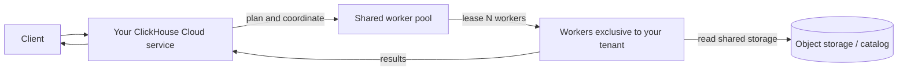
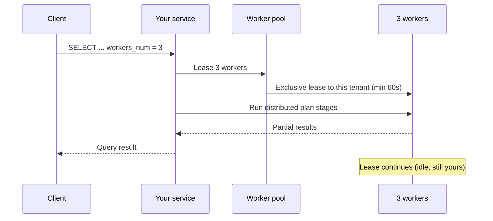
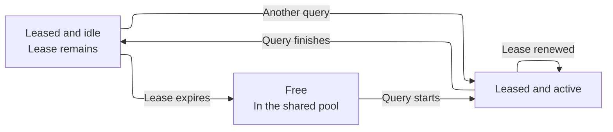
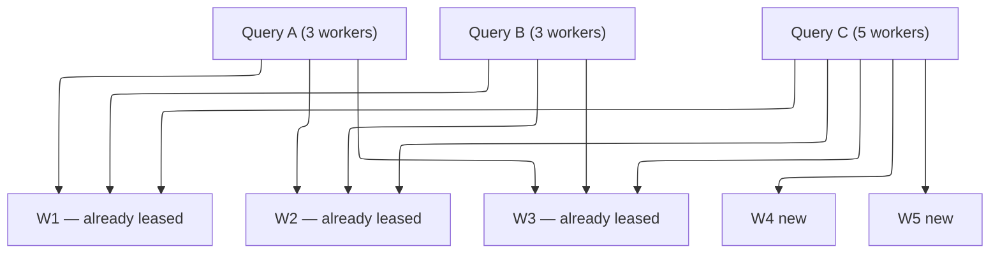

import { PrivatePreviewBadge } from "/snippets/zh/components/PrivatePreviewBadge/PrivatePreviewBadge.jsx";

<PrivatePreviewBadge />

<Note>
  按需计算 (On-Demand Compute) 目前处于私有预览阶段，不在 ClickHouse Cloud SLO 或 SLA 的覆盖范围内，且可能存在已知和未知的限制。请参阅[限制](#limitations)。

  [加入等待列表](https://clickhouse.com/cloud/on-demand-compute-waitlist)。
</Note>

按需计算是 ClickHouse Cloud 提供的一项能力，可为某个 service (即一个 tenant) 针对受支持的 workload 提供额外的 compute，而无需你调整 service 规模或再预配一个 service。这类工作会在 service 自身 compute 之外的 ClickHouse 工作线程上运行。工作线程来自跨 tenant 共享的托管 pool，但每个工作线程在同一时刻只会分配给一个 tenant。

在私有预览期间，按需计算支持符合条件的 `SELECT` 查询。你可以通过 settings 为某个查询启用该能力，ClickHouse 随后会从 pool 中分配工作线程，通过你现有的 service 和端点来执行该查询。后台操作也属于这项能力的范畴，但在私有预览中暂不支持。

这与[计算-计算分离](/zh/products/cloud/features/infrastructure/warehouses)不同：仓库通过多个共享数据的 service 提供专用且长期存在的 compute；而按需计算则通过你现有的 service，从共享 pool 中提供临时的工作线程。在私有预览期间，你需要在查询级别申请这类 compute。

## 何时使用 按需计算 {#when-to-use-on-demand-compute}

在私有预览期间，可将 按需计算 用于符合条件的计算密集型 `SELECT` 查询，即希望在主服务的计算资源之外运行的查询：

* **临时查询与分析查询：** 在额外的工作线程上运行计算密集型 `SELECT` 查询。
* **非关键读取工作负载：** 将部分读取操作从主服务中迁出。
* **数据湖查询：** 在额外的工作线程上查询受支持的 Apache Iceberg、Delta Lake 或 `SharedMergeTree` 数据。
* **临时增加计算能力：** 无需调整主服务规格，即可为符合条件的查询申请工作线程。

私有预览仅支持 `SELECT` 查询。工作线程不会执行 `INSERT` 查询、DDL、变更或后台操作。

## 工作原理 {#how-it-works}



1. 您向 ClickHouse Cloud 服务发送一个符合条件的 `SELECT` 查询。您的端点、身份验证和 RBAC 配置均无需更改。
2. 该服务构建分布式查询计划，并从托管池中申请指定数量的工作线程。
3. ClickHouse 将可用的工作线程分配给您的服务。
4. 这些工作线程执行分布式查询计划器分配的计划阶段，并从受支持的存储中读取数据。
5. 您的服务负责协调该查询，并将结果返回给客户端。

在私有预览期间，每个工作线程拥有 `8 vCPUs` 和 `32 GiB` 内存。可使用 `distributed_plan_workers_num` 指定查询申请的工作线程数量。

## 使用按需计算资源 {#using-on-demand-compute}

### 设置 {#settings}

可以在查询级别、用户级别或 settings profile 中添加这些设置。

| 设置                             | 必需值            | 用途                                                           |
| ------------------------------ | -------------- | ------------------------------------------------------------ |
| `make_distributed_plan`        | Yes            | 启用实验性的分布式查询计划。使用 按需计算 时必需。                      |
| `distributed_plan_workers_num` | Yes            | 为该查询租用的工作线程数量。若为 `0` (默认值) ，查询将在你的 service 上运行，而不是在工作线程池上运行。 |
| `enable_parallel_replicas`     | Yes (设置为 `0`)  | 并行副本与分布式查询计划不兼容。                                             |

<Tip>
  在预览期间，请在查询级别设置这些参数，或者单独创建一个使用不同设置的用户。这样可以一目了然地看出哪些语句使用了 按需计算，同时避免继承启用了并行副本的 Cloud 默认 profile。
</Tip>

### 示例 {#example}

```sql
SELECT
    sum(l_extendedprice * l_discount) AS revenue
FROM lineitem
WHERE
    l_shipdate >= DATE '1994-01-01'
    AND l_shipdate < DATE '1994-01-01' + INTERVAL 1 YEAR
    AND l_discount BETWEEN 0.06 - 0.01 AND 0.06 + 0.01
    AND l_quantity < 24
SETTINGS
    make_distributed_plan = 1,
    distributed_plan_workers_num = 3,
    enable_parallel_replicas = 0
```

该查询请求三个工作线程。ClickHouse 实际提供的工作线程数量取决于私有预览版的限制以及可用的 pool 容量。

### 工作线程租约 {#worker-leasing}

工作线程租约的有效期至少为 60 秒。查询运行期间，ClickHouse 会自动续租。

查询完成后，工作线程仍会保持分配给该服务的状态，直至租约到期。只要租约仍然有效，同一服务中另一个符合条件的查询即可复用这些工作线程，ClickHouse 无需再申请新的工作线程。

租约到期后，ClickHouse 会将这些工作线程从该服务释放并终止。



查询完成后，这三个工作线程仍会保持租用 (lease) 给你的 tenant，但处于 idle 状态，直到 lease 过期。



如果在这些工作线程仍处于租用状态时发送新的查询，就可以立即复用它们 (无需冷启动) 。

如果租约已过期，ClickHouse 会将这些工作线程释放回池中 (它们会被终止，而不是保持空闲以供其他租户使用) 。

### 并发查询 {#concurrent-queries}

来自同一 ClickHouse Cloud 服务的并发查询可以共享已分配的工作线程。只有当某个查询请求的工作线程数超过该服务已分配的数量时，ClickHouse 才会申请额外的工作线程。

例如，若两个并发查询各请求三个工作线程，它们可以共用同样的这三个工作线程。若另一个查询请求五个工作线程，ClickHouse 可以复用已分配的三个工作线程，并从池中再申请两个。

请参见下面的示例：

```sql
SELECT ... SETTINGS make_distributed_plan = 1, distributed_plan_workers_num = 3, ...;
SELECT ... SETTINGS make_distributed_plan = 1, distributed_plan_workers_num = 3, ...;
```

它们共享同样的三个工作线程。

如果第三个并发查询请求五个工作线程：

```sql
SELECT ... SETTINGS make_distributed_plan = 1, distributed_plan_workers_num = 5, ...;
```

该查询将在已有的三个工作线程以及两个新租用的工作线程上运行。



### 当工作线程池无法满足请求时 {#pool-capacity}

在私有预览期间，工作线程的可用性采用尽力而为策略。如果可用的工作线程少于请求数量，查询将使用 ClickHouse 实际能分配的工作线程运行。例如，请求五个工作线程的查询可能仅以三个工作线程运行。

如果无法租用到任何工作线程，查询将失败：

```text
No stateless workers available for tenant 'bronzeaws-cm-72': the discovery service leased none.
```

请重试该查询。如果问题持续存在，请联系您的 ClickHouse 客户团队——预览资源池可能已耗尽或规格配置不当。

## Monitoring {#monitoring}

在 service 上使用 `system.query_log`，即可查看为查询分配了多少个工作线程。

### 已分配的工作线程数 {#worker-provided}

```sql
SELECT
    ProfileEvents['StatelessWorkerRequested'],
    ProfileEvents['StatelessWorkerProvided']
FROM clusterAllReplicas(default, system.query_log)
WHERE query_id = '<YOUR_QUERY_ID>'
  AND type != 'QueryStart';
```

<Tip>
  为按需 (On-Demand) 查询设置 `log_comment = 'on-demand'` (或某个 workload 名称) ，这样无需解析 `Settings` 即可过滤出这些查询。
</Tip>

## 可用区域 {#available-regions}

按需计算工作线程与您的 ClickHouse Cloud 服务运行在同一区域。在私有预览期间，该功能最初仅在部分云提供商和区域中提供。在申请加入等待名单时，您可以指定首选的提供商和区域，以便 ClickHouse 评估您的资格。

## 定价 {#pricing}

在私有预览期间，按需计算 (On-Demand Compute) 免费使用，但设有用量上限 (参见[限制](#limitations)) 。如需提高该上限，请联系您的 ClickHouse 客户团队。

预览结束后将开始收费。在该功能进入 Beta 阶段以及开始计费之前，预览参与者均会提前收到通知。

计划采用的计费模式与 ClickHouse Cloud 计算一致：按实际使用的计算量 (租用的工作线程时长) 计费，而非按扫描的数据量或读取的行数计费。

## 限制 {#limitations}

以下限制适用于私有预览阶段，此外可能还存在其他限制。如遇异常行为，请反馈给 ClickHouse 支持团队或您的客户团队。

* **仅支持 `SELECT` 查询。** 工作线程不执行 `INSERT` 查询、变更、DDL 或后台操作。
* **支持的数据。** 私有预览支持 Apache Iceberg、Delta Lake 和 `SharedMergeTree`。
* **并行副本。** 必须禁用并行副本。
* **工作线程规格。** 每个工作线程配备 `8 vCPUs` 和 `32 GiB` 内存。
* **工作线程数量上限。** 在私有预览期间，每个查询最多可申请五个工作线程。
* **资源池容量。** 工作线程的可用性为尽力而为，查询实际获得的工作线程数量可能少于申请数量；若没有可用的工作线程，查询将失败。
* **性能。** 性能因查询而异。工作线程分配、分布式查询计划的生成以及查询计划各阶段的传输都会带来额外延迟。某些形态的查询，其性能可能不如在主服务上执行。
* **查询兼容性。** 分布式查询计划器无法远程执行所有查询计划。不受支持的查询可能返回 `SUPPORT_IS_DISABLED` 异常。

常见的失败情形包括：

| 方面                           | 表现                                |
| ---------------------------- | --------------------------------- |
| 并行副本                         | 被拒绝；请禁用上述设置。                      |
| 带 `PARTITION BY` 的窗口函数       | 在 planner 能够按分区键进行数据重分布之前，通常会被拒绝。 |
| 读取 `system` 表                | 这类表并非基于共享存储。                      |
| 某些形态的关联子查询                   | 可能被拒绝，或以效率较低的方式重写。                |
| PROJECTION、数据读取时的跳过索引以及表达式编译 | 会针对该查询直接关闭，而不是返回异常。               |

## Roadmap {#roadmap}

On-Demand Compute 只是一个起点。正在推进或后续计划的工作包括：

* 消除已知限制 (`SUPPORT_IS_DISABLED` 空缺) 。
* 支持不同工作线程规格的池。
* 使查询性能达到并稳定在与 Stateful 执行相当的水平。
* 支持 background merge。
* 定价。
* 工作线程池 autoscaler 校准。
* Console 指标与 Monitoring。
* 面向 On-Demand Compute 的专用权限。

## 安全 {#security}

按需计算不会改变您连接 ClickHouse Cloud 的方式。客户端仍然向您的服务进行身份验证，工作线程绝不会对外暴露公网查询端点。

预览版中尚未提供专用的按需角色和权限 (参见 [Roadmap](#roadmap)) 。在此之前，任何能够在您的服务上使用上述设置运行 `SELECT` 的人都可以使用工作线程，但会受预览版配额的限制。

## 常见问题 {#faq}

<AccordionGroup>
  <Accordion title="按需计算是开源的吗？">
    不是。它是一种 ClickHouse Cloud 架构，由 ClickHouse server (分布式查询计划) 、data plane (worker 池与租约) 和 control plane 组成。ClickHouse 中确实有实验性的 `make_distributed_plan` 设置，但共享 worker 池和无状态执行仅在 Cloud 中提供。
  </Accordion>

  <Accordion title="加入私有预览需要特定版本吗？">
    需要。在你加入私有预览前，ClickHouse 团队会确认你的服务是否需要升级。预览期间可能还需要进行额外升级。
  </Accordion>

  <Accordion title="定价会是怎样的？">
    私有预览期间不收取额外费用，但需遵守预览期的各项限制。后续发布阶段的定价会在开始计费前公布。总体而言，其定价理念与 ClickHouse Cloud 一致：按实际使用的 compute 计费，而不是按扫描的数据量或读取的行数计费。具体费率将在 GA 或 beta 计费开始前公布。
  </Accordion>

  <Accordion title="我可以将其用于生产环境吗？">
    你可以运行真实的 工作负载，但这毕竟是私有预览：存在已知和未知的限制，且 worker 池可用性没有 SLO/SLA。ClickHouse 会全力支持早期使用者，但请将其视为预览版，而非生产环境的可用性保证。
  </Accordion>

  <Accordion title="这与为我的服务启用自动扩缩容有什么区别？">
    自动扩缩容改变的是分配给主服务的 compute。在私有预览期间，按需计算让符合条件的 `SELECT` 查询临时使用托管池中的 worker，而无需改变主服务的规格。自动扩缩容管理的是长期的服务容量，按需计算则为特定 工作负载 提供临时 compute。
  </Accordion>

  <Accordion title="这与仓库或计算-计算分离有什么区别？">
    计算-计算分离通过多个共享同一份数据的 ClickHouse Cloud 服务提供专用 compute；按需计算则通过你现有的服务，从托管池中提供临时 compute。在私有预览期间，这类 compute 在查询级别申请。该能力的整体设计目标是同时支持查询执行和后台操作。
  </Accordion>

  <Accordion title="我可以在哪里提问？">
    请联系你的客户团队，他们会将你引荐给按需计算的产品经理。
  </Accordion>

  <Accordion title="我可以在哪里报告缺陷？">
    提交支持工单 (严重级别 3) ，或直接向产品经理反馈。请附上 `query_id` 和完整的异常信息。
  </Accordion>

  <Accordion title="ClickHouse BYOC 或 ClickHouse Private 中是否提供此功能？">
    不提供。私有预览在 ClickHouse BYOC 和 ClickHouse Private 中均不可用。
  </Accordion>
</AccordionGroup>