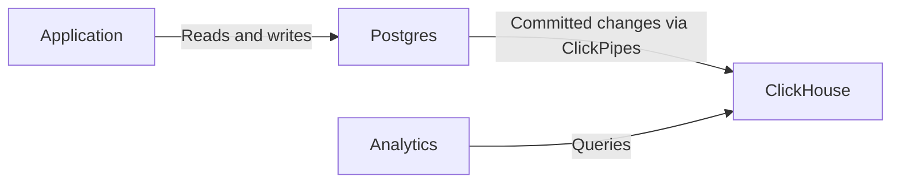

import { BetaBadge } from "/snippets/zh/components/BetaBadge/BetaBadge.jsx";

<BetaBadge link="https://clickhouse.com/cloud/postgres" galaxyTrack={true} galaxyEvent="docs.managed-postgres.overview-beta" />

ClickHouse Managed Postgres 是一项企业级托管 Postgres 服务，专为高性能和大规模扩展而设计。依托与计算资源物理共置的 NVMe 存储，相比采用 EBS 等网络附加存储的替代方案，它可为受磁盘瓶颈限制的工作负载带来高达 10 倍的性能提升。

ClickHouse Managed Postgres 与 [Ubicloud](https://www.ubicloud.com/) 联合打造。Ubicloud 的创始团队曾在 Citus Data、Heroku 和 Microsoft 打造世界一流的 Postgres 产品，拥有卓越的业绩。ClickHouse Managed Postgres 解决了快速增长的应用常见的性能挑战：摄取和更新变慢、vacuum 操作缓慢、尾延迟升高，以及因磁盘 IOPS 受限导致的 WAL 峰值。

## Postgres 负责事务，ClickHouse 负责分析 {#transactions-and-analytics}

将 Postgres 用于事务型应用负载 (OLTP) ，例如创建订单、更新库存和管理用户账户。Postgres 是你的记录系统 (system of record) ：相关变更可以在同一个事务中一并提交或回滚。

当应用还需要对大规模数据集进行分析时，可以添加一个 ClickHouse 服务，并通过 ClickPipes 将两者连接起来：

1. 您的应用程序在 Postgres 中读写业务数据，并使用事务将相关变更归为一组。
2. [配置 ClickPipes](/zh/products/managed-postgres/clickhouse-integration)，将选定的表复制到 ClickHouse，并通过 CDC (变更数据捕获) 持续复制已提交的插入、更新和删除操作。
3. 在 ClickHouse 中运行分析查询。您可以直接连接 ClickHouse，也可以通过 [`pg_clickhouse`](/zh/products/managed-postgres/extensions/pg_clickhouse/introduction) 扩展从 Postgres 查询其中的表。

复制是异步进行的，因此分析结果可能滞后于 Postgres 中已提交的变更。这两个数据库各自拥有独立的事务边界：CDC (变更数据捕获)  和 `pg_clickhouse` 并不提供跨 Postgres 与 ClickHouse 的共享事务。若读取操作要求获取最新已提交的应用状态，应使用 Postgres。

您可以先只使用 Postgres，待有需要时再引入 ClickHouse。请按照 [ClickHouse Managed Postgres 快速入门](/zh/products/managed-postgres/quickstart)试用这两项服务；如果您已有 Postgres service，也可以直接前往[添加分析能力](/zh/products/managed-postgres/quickstart#part-2)。

## 基于 NVMe 的性能优势 {#nvme-performance}

大多数托管 Postgres 服务使用网络附加存储 (如亚马逊 EBS) ，这意味着每次访问磁盘都需要一次网络往返。这会带来毫秒级延迟，并限制 IOPS，从而使写入密集型或 I/O 密集型工作负载出现瓶颈。

ClickHouse Managed Postgres 使用与数据库位于同一服务器上、物理直连的 NVMe 存储。这种架构差异可带来：

* **微秒级磁盘延迟**，而非毫秒级
* **持续 IOPS 上限提升 10 倍***，且没有网络瓶颈
* **对于受磁盘瓶颈限制的工作负载，在相同成本下性能最高可提升 10 倍**

对于主要受磁盘 IOPS 和延迟限制的 Postgres 工作负载，这意味着摄取更快、VACUUM 操作更快、尾延迟更低，以及在负载下获得更可预测的性能。

<Note>
  通过[性能基准测试](https://clickhouse.com/blog/postgresbench)了解 Postgres 在 NVMe 磁盘上的速度有多快。
</Note>

有关 AWS 上本地 NVMe 限制的信息，请参阅 [Memory optimized](https://docs.aws.amazon.com/ec2/latest/instancetypes/mo.html#mo_instance-store)、[Storage optimized](https://docs.aws.amazon.com/ec2/latest/instancetypes/so.html#so_instance-store)、[CPU optimized](https://docs.aws.amazon.com/ec2/latest/instancetypes/gp.html#gp_instance-store)。有关 GCP，请参阅 [Local SSD disks](https://cloud.google.com/compute/docs/disks/local-ssd)。

## 支持的云提供商 {#supported-cloud-providers}

ClickHouse Managed Postgres 目前支持以下云提供商：

| 云提供商 | 可用性         |
| ---- | ----------- |
| AWS  | Public Beta |
| GCP  | 私有预览        |

<Note>
  GCP 上的 ClickHouse Managed Postgres 处于私有预览阶段。您可以[点击此处](https://clickhouse.com/cloud/postgres#gcp-waitlist)申请加入 GCP 私有预览等待名单。更多信息请参阅[公告](https://clickhouse.com/blog/postgres-managed-by-clickhouse-gcp-private-preview)。
</Note>

## 原生 ClickHouse 集成 {#clickhouse-integration}

ClickHouse Managed Postgres 原生集成 ClickHouse，无需复杂的 ETL 管道，即可将事务处理与分析统一起来。

### Postgres 到 ClickHouse 的复制 {#postgres-replication}

使用 [ClickPipes 中的 Postgres CDC 连接器](/zh/integrations/clickpipes/postgres/index)将你的 Postgres 数据复制到 ClickHouse。该连接器既支持初始加载，也支持持续增量同步，并已在数百家 Enterprise 客户中得到充分验证；这些客户每月迁移的数据量达数百 TB。

### pg_clickhouse：统一查询层 {#pg-clickhouse}

每个 ClickHouse Managed Postgres 实例都自带 [`pg_clickhouse`](https://github.com/ClickHouse/pg_clickhouse) 扩展，可让你直接从 Postgres 查询 ClickHouse。你的应用可以将 Postgres 作为同时处理事务和分析的统一查询层，而无需连接多个数据库。

该扩展提供了面向 ClickHouse 的全面查询下推能力，可实现高效执行，并支持过滤器、JOIN、半 JOIN、聚合和函数。目前，22 个 TPC-H 查询中已有 14 个可完全下推；与在标准 Postgres 中运行相同查询相比，性能提升超过 60 倍。

## 企业级可靠性 {#enterprise-reliability}

ClickHouse Managed Postgres 提供生产环境所需的可靠性与安全特性。

### 高可用性 {#high-availability}

使用基于仲裁的复制，最多可在不同可用区配置两个备用副本。这些备用副本专用于高可用性和自动故障转移，可确保数据库在发生故障后快速恢复。如需扩展读取能力，您可以单独预配[只读副本](/zh/products/managed-postgres/read-replicas)。有关配置详情，请参阅[高可用性](/zh/products/managed-postgres/high-availability)页面。

### 备份与恢复 {#backups}

每个实例都包含自动备份，支持创建分叉实例和时间点恢复。备份基于 [WAL-G](https://github.com/wal-g/wal-g) 运行；它是一款广为人知的开源工具，可执行全量备份，并持续将 WAL 归档到对象存储。

### 安全与合规 {#security-compliance}

ClickHouse Managed Postgres 旨在满足与 ClickHouse Cloud 相同的安全标准：

* **身份验证**：支持 SAML/SSO
* **网络安全**：IP 允许列表、静态加密和传输中加密 (TLS 1.3)
* **访问控制**：提供完整的 superuser 权限，用于数据库管理

### 开源基础 {#open-source}

Postgres 和 ClickHouse 都是开源数据库，拥有庞大且活跃的社区。包括 `pg_clickhouse` 扩展和由 PeerDB 驱动的 CDC 复制在内的集成组件也都是开源的。这一基础可确保您不会被供应商锁定，从而对数据栈拥有完全的控制权和长期灵活性。