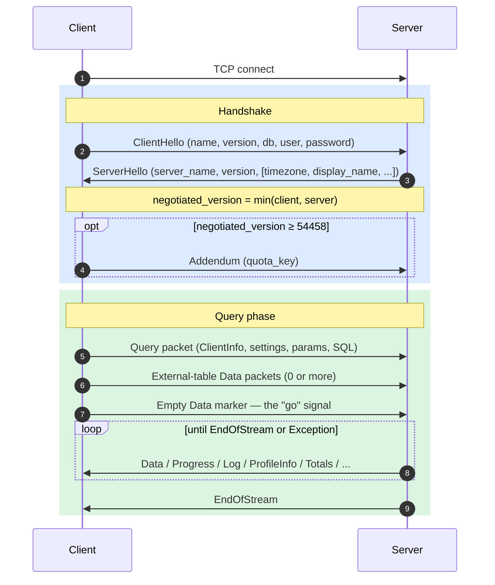
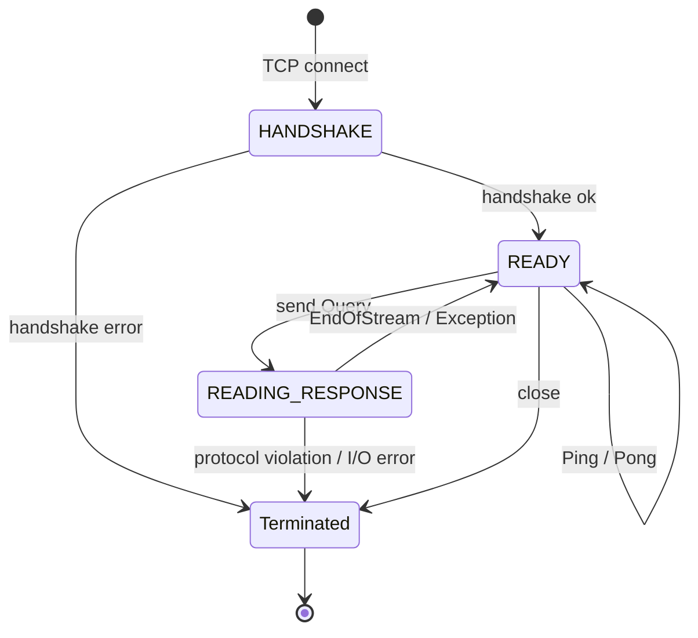
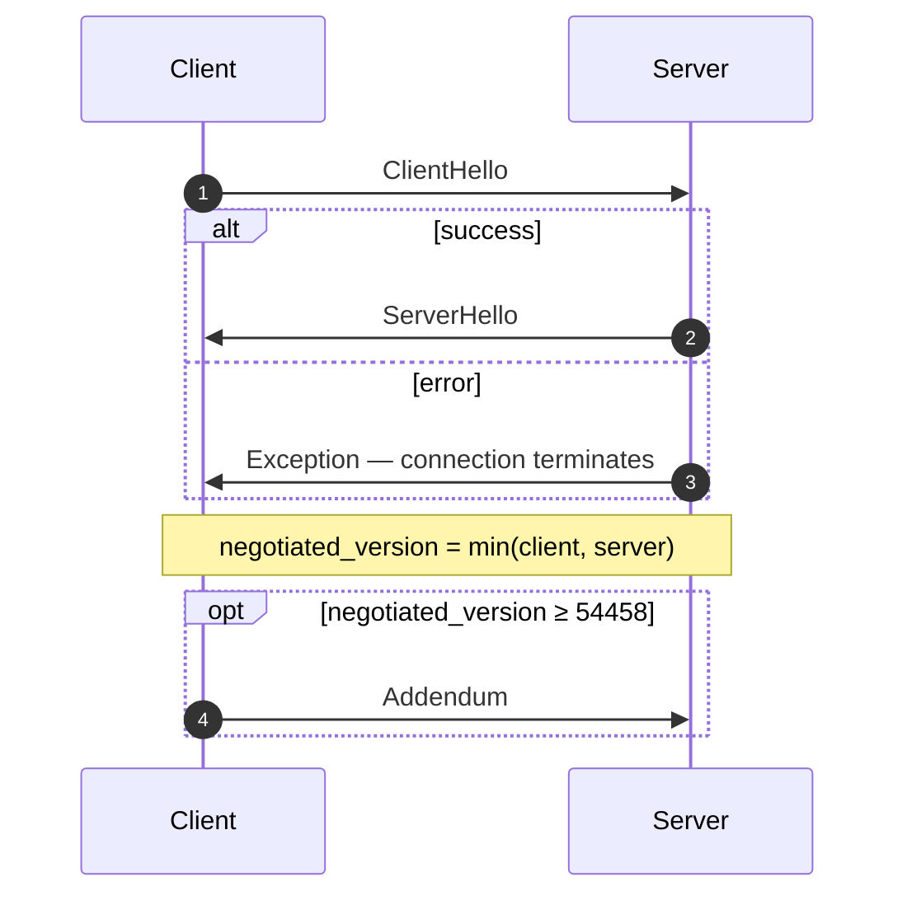
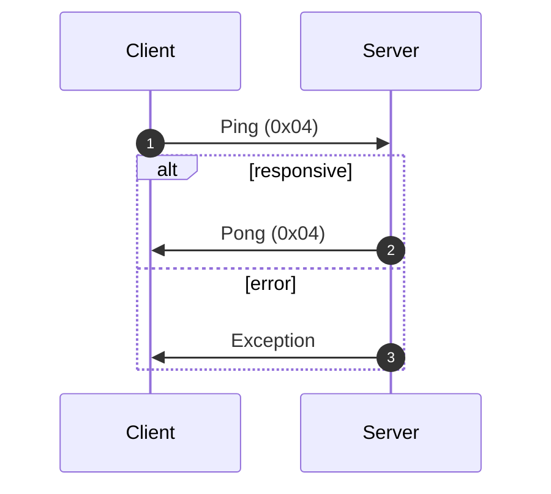
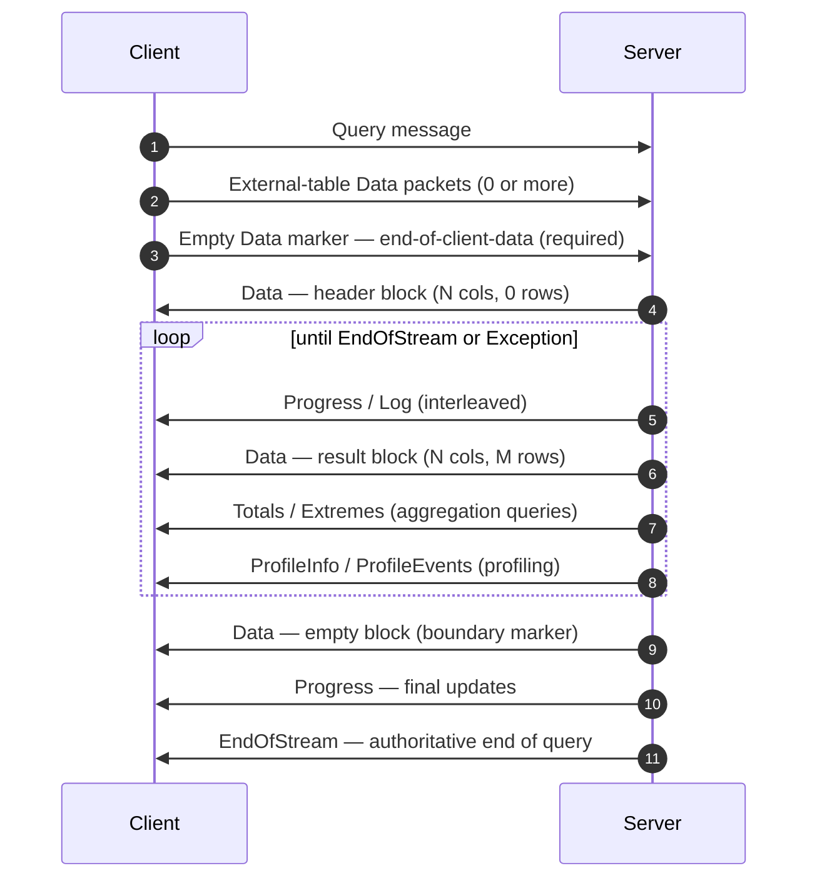
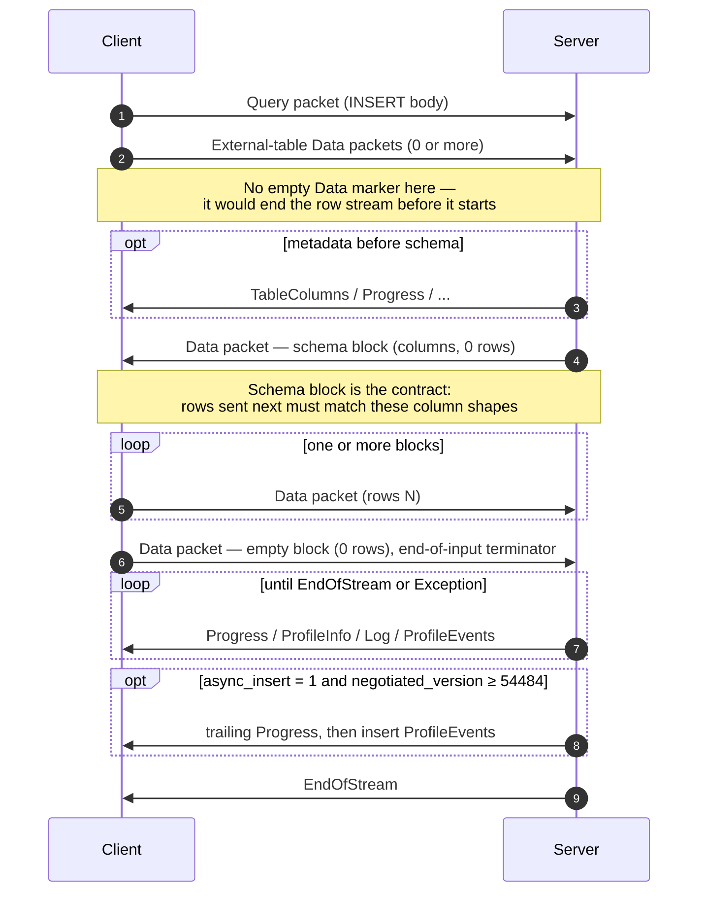
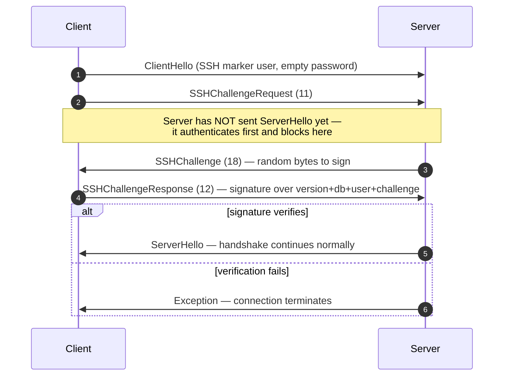

原生协议是 ClickHouse 客户端与服务器之间基于 TCP 通信的二进制、面向连接的协议。它负责传输 SQL 查询、结果数据、`INSERT` 载荷、执行遥测数据以及错误信号。命令行客户端、C++ 驱动程序以及大多数第三方原生驱动程序都基于该协议实现。

本页介绍协议本身：数据包帧信息、连接状态机、版本协商，以及所有非 `Block` 消息的请求正文。`Data` 家族数据包内部的字节 (即 `Block`、其中的列以及各类型的编码) 属于另一部分内容，详见 [Native 格式](/zh/resources/develop-contribute/native-protocol/format) 规范。

<Info>
  **配套规范**

  本页与 [Native 格式](/zh/resources/develop-contribute/native-protocol/format) 规范互为配套，二者一同发布。两份规范分工明确：本页负责数据包与传输层，Native 格式规范则负责 `Data` 家族数据包内部的字节。
</Info>

以下几项特性贯穿整个协议。该协议是二进制且按位置解析的：除 `BlockInfo` 内部外不存在字段标签，因此只要有一个字节错位，其后的所有内容都会失去同步。该协议是有状态的，每个 TCP 连接一次只处理一个查询，不支持多路复用。定长整数采用小端序。

## 概述 {#overview}

| 属性   | 值                                                                           |
| ---- | --------------------------------------------------------------------------- |
| 传输方式 | TCP，可选用 TLS 加密封装                                                            |
| 字节序  | 定宽整数采用小端序                                                                   |
| 编码   | 二进制，按位置解析 (除 `BlockInfo` 外不使用字段标签)                                          |
| 连接模型 | 有状态，一次仅处理一个查询，不支持多路复用                                                       |
| 版本控制 | 在握手时协商；各项功能是否可用取决于版本                                                        |
| 数据格式 | 所有表格数据均使用 [Native 格式](/zh/resources/develop-contribute/native-protocol/format) |

线上传输的每条消息都以一个 `VarUInt` 数据包类型代码开头，后接请求正文，其形态取决于该代码以及协商后的协议版本。

一个连接会经历三个阶段：首先进行一次性握手，然后进行任意数量的 `Ping` 或 `Query` 交互，最后关闭连接：



无论 SQL 中是否带有 `FORMAT` 子句，原生 TCP 协议始终以 Native 格式传输表格数据。将数据重新格式化为 `RowBinary`、`CSV`、`JSON` 等格式由客户端负责，在其解码 Native 块之后进行。 (HTTP 接口走的是另一条代码路径，*会*遵循 `FORMAT` 子句；HTTP 不在本文讨论范围内。)

## 安全 {#security}

### 传输安全 (TLS) {#transport-security}

TLS 位于传输层，处于协议之下。启用 TLS 后，整个 TCP 流都会被加密；而无论是否使用 TLS，协议消息都逐字节完全相同。

### 身份验证 {#authentication}

身份验证在握手阶段通过 [`ClientHello`](#clienthello) 消息完成。`user` 和 `password` 字段以明文字符串形式传输，因此凭证在传输过程中依靠传输层加密 (TLS) 来保护。

如果 `user` 字段为空，服务器会将其视为已配置的默认会话用户，即 `default_session_user` 服务器设置所指定的用户 (默认值为 `default`) 。该设置可在 `protocols` 部分中针对各个监听器单独覆盖。如果服务器配置的默认会话用户为空，或服务器版本低于 26.8，空的 `user` 字段将被拒绝并抛出异常。请注意，`clickhouse-client` 从不发送空用户名，而是在客户端侧将其替换为 `default`。

从协议版本 54466 起支持 SSH 质询-响应身份验证，详见 [SSH 质询-响应身份验证](#ssh-authentication)。

### 服务器间通信密钥 {#inter-server-secret}

在分布式查询执行中，服务器之间通过证明自己知晓共享密钥来相互进行身份验证，而无需在线上传输该密钥。每个 Query 都会在 [`Query`](#query) 的第 4 个字段中携带一个 32 字节的 SHA-256 `auth_hash`，该值由盐值、随机数 (nonce) 、已配置的密钥以及查询共同计算得出，接收方服务器会重新计算该值并进行比对。此机制受 `INTERSERVER_SECRET` 特性 (v54441) 控制。外部客户端在此处始终发送空字符串。参见[服务器间身份验证](#inter-server-authentication)。

## 版本控制与功能开关 {#versioning-and-feature-gates}

### 版本协商 {#version-negotiation}

在握手阶段，客户端和服务器会各自声明所支持的最高协议版本。**协商版本**取两者中的较小值：

```text
negotiated_version = min(client_version, server_version)
```

此后的每条消息都会依据协商版本来确定线上传输时包含哪些字段。

### 功能开关 {#feature-gates}

每个功能都以引入它的协议版本来标识；当协商版本大于或等于该版本号时，该功能即处于**活跃**状态。

<Warning>
  当某个功能处于活跃状态时，其字段在线上传输时**必须**存在。该协议严格按位置解析，因此一旦省略受功能开关控制的字段，其后所有字段的字节流都会被破坏。
</Warning>

### 功能对照表 {#feature-table}

| 功能                                                           | 版本    | 影响范围                             | 传输格式影响                                                                                                                                                                                                                                                                                                                                                                                                       |
| ------------------------------------------------------------ | ----- | -------------------------------- | ------------------------------------------------------------------------------------------------------------------------------------------------------------------------------------------------------------------------------------------------------------------------------------------------------------------------------------------------------------------------------------------------------------ |
| BLOCK&#95;INFO                                               | all   | Block                            | 在每个 Block 前添加 BlockInfo 前缀 (`is_overflows`、`bucket_number`) 。                                                                                                                                                                                                                                                                                                                                                |
| CLIENT&#95;INFO                                              | 54032 | Query                            | 在 Query 请求正文中添加 ClientInfo 块。                                                                                                                                                                                                                                                                                                                                                                                |
| TIMEZONE                                                     | 54058 | ServerHello                      | 在 ServerHello 中添加 `timezone` 字段。                                                                                                                                                                                                                                                                                                                                                                             |
| QUOTA&#95;KEY&#95;IN&#95;CLIENT&#95;INFO                     | 54060 | ClientInfo                       | 在 ClientInfo 中添加 `quota_key` 字段。                                                                                                                                                                                                                                                                                                                                                                             |
| DISPLAY&#95;NAME                                             | 54372 | ServerHello                      | 在 ServerHello 中添加 `display_name` 字段。                                                                                                                                                                                                                                                                                                                                                                         |
| VERSION&#95;PATCH                                            | 54401 | ServerHello, ClientInfo          | 在两者中均添加 `version_patch` 字段。                                                                                                                                                                                                                                                                                                                                                                                  |
| SERVER&#95;LOGS                                              | 54406 | Log                              | 设置 `send_logs_level` 后，服务器会发送 Log 数据包。                                                                                                                                                                                                                                                                                                                                                                       |
| COLUMN&#95;DEFAULTS&#95;METADATA                             | 54410 | TableColumns                     | 服务器可能会在 INSERT/input 模式块之前发送带有列默认值元数据的 [`TableColumns`](#tablecolumns) 数据包 (类型 11) 。仅当协商版本 ≥ 54410 **且**启用了 `input_format_defaults_for_omitted_fields` 时才会发送。低于此版本时，服务器从不发送该数据包，客户端不得等待它。                                                                                                                                                                                                                    |
| WRITE&#95;CLIENT&#95;INFO                                    | 54420 | Progress                         | 在 Progress 中添加 `wrote_rows` 和 `wrote_bytes`。 (虽然名称如此，但它**并不**控制 ClientInfo 块，后者由 `CLIENT_INFO` (v54032) 控制。)                                                                                                                                                                                                                                                                                                 |
| SETTINGS&#95;SERIALIZED&#95;AS&#95;STRINGS                   | 54429 | Query (设置编码)                     | 改变始终存在的设置列表的**编码方式**，**并不**决定是否发送设置。v54429 及以上版本将每个设置写为 `(name, flags, value-as-string)`；较旧的对端则写为 `(name, type-specific-binary-value)`，不带 flags。参见 [Setting](#setting)。                                                                                                                                                                                                                                      |
| INTERSERVER&#95;SECRET                                       | 54441 | Query                            | 在 Query 中添加服务器间 `auth_hash` 字段，其值为基于集群密钥计算的加盐 SHA-256，而非原始密钥。外部客户端发送空字符串。参见[服务器间身份验证](#inter-server-authentication)。                                                                                                                                                                                                                                                                                         |
| OPEN&#95;TELEMETRY                                           | 54442 | ClientInfo                       | 在 ClientInfo 中添加 OpenTelemetry 追踪上下文。                                                                                                                                                                                                                                                                                                                                                                        |
| DISTRIBUTED&#95;DEPTH                                        | 54448 | ClientInfo                       | 在 ClientInfo 中添加 `distributed_depth` 字段。                                                                                                                                                                                                                                                                                                                                                                     |
| INITIAL&#95;QUERY&#95;START&#95;TIME                         | 54449 | ClientInfo                       | 添加 `initial_time` 字段 (Int64，定长) 。                                                                                                                                                                                                                                                                                                                                                                            |
| PROFILE&#95;EVENTS                                           | 54451 | ProfileEvents                    | 服务器在查询执行期间发送 ProfileEvents 数据包。                                                                                                                                                                                                                                                                                                                                                                              |
| PARALLEL&#95;REPLICAS                                        | 54453 | ClientInfo                       | 在 ClientInfo 中添加并行副本协调字段。                                                                                                                                                                                                                                                                                                                                                                                    |
| CUSTOM&#95;SERIALIZATION                                     | 54454 | Block (Column)                   | 在每列的类型字符串之后添加 `has_custom_serialization` 字节。                                                                                                                                                                                                                                                                                                                                                                 |
| ADDENDUM                                                     | 54458 | Handshake                        | 客户端在握手完成后发送附加信息 (`quota_key`) 。                                                                                                                                                                                                                                                                                                                                                                              |
| PARAMETERS                                                   | 54459 | Query                            | 在 Query 请求正文中添加参数列表。                                                                                                                                                                                                                                                                                                                                                                                         |
| SERVER&#95;QUERY&#95;TIME&#95;IN&#95;PROGRESS                | 54460 | Progress                         | 在 Progress 中添加 `elapsed_ns` 字段。                                                                                                                                                                                                                                                                                                                                                                              |
| PASSWORD&#95;COMPLEXITY&#95;RULES                            | 54461 | ServerHello                      | 在 ServerHello 中添加密码策略正则表达式列表及对应的可读提示信息。                                                                                                                                                                                                                                                                                                                                                                      |
| INTERSERVER&#95;SECRET&#95;V2                                | 54462 | ServerHello                      | 在 ServerHello 中添加一个 8 字节的 `UInt64` nonce，用于服务器间查询签名；外部客户端只需解码后忽略即可。                                                                                                                                                                                                                                                                                                                                          |
| TOTAL&#95;BYTES&#95;IN&#95;PROGRESS                          | 54463 | Progress                         | 在 Progress 的 `total_rows` 与 `wrote_rows` 之间添加 `total_bytes_to_read` (VarUInt) 字段。                                                                                                                                                                                                                                                                                                                            |
| TIMEZONE&#95;UPDATES                                         | 54464 | TimezoneUpdate                   | 新增 `TimezoneUpdate` 服务器数据包 (类型 17) 。请求正文：单个 `String`，内容为会话时区。仅由 `input` 表函数的初始化方在 input 模式块之后立即发送，以便客户端按服务器的 `session_timezone` 解析其发送的行。参见 [TimezoneUpdate](#timezoneupdate)。                                                                                                                                                                                                                                |
| SPARSE&#95;SERIALIZATION                                     | 54465 | Block (Column)                   | 服务器可能会设置 `has_custom_serialization = 1` 并发送稀疏编码的列。传输格式：先是 1 字节 kind (0x01 = SPARSE) ，接着是以 EOG 结尾的 VarUInt 偏移量流，最后是按内部类型密集编码的非默认值。参见 [kind&#95;stack 与稀疏编码](/zh/resources/develop-contribute/native-protocol/format#kind-stack-and-sparse-encoding)。                                                                                                                                                             |
| SSH&#95;AUTHENTICATION                                       | 54466 | 身份验证流程                           | 新增 SSH 质询-响应身份验证。需主动启用：客户端发送形如 `" SSH KEY AUTHENTICATION " + <real_user>` 的 `user` 并附带空密码即可触发。参见 [SSH 质询-响应身份验证](#ssh-authentication)。                                                                                                                                                                                                                                                                       |
| TABLE&#95;READ&#95;ONLY&#95;CHECK                            | 54467 | TablesStatusResponse             | 在 TablesStatusResponse 中为每个表对应的行添加 `is_readonly` 标志。不发送 `TablesStatusRequest` 的外部客户端不受任何传输格式变化影响。                                                                                                                                                                                                                                                                                                            |
| SYSTEM&#95;KEYWORDS&#95;TABLE                                | 54468 | 系统表                              | 服务器填充 `system.keywords`，以便官方 `clickhouse-client` 自动补全关键字。原生协议传输格式无变化。                                                                                                                                                                                                                                                                                                                                        |
| ROWS&#95;BEFORE&#95;AGGREGATION                              | 54469 | ProfileInfo                      | 在 ProfileInfo 末尾依次添加 `applied_aggregation` (Bool) 和 `rows_before_aggregation` (VarUInt) 。                                                                                                                                                                                                                                                                                                                    |
| CHUNKED&#95;PROTOCOL                                         | 54470 | 连接帧信息                            | 对每个数据包的请求正文进行分块帧封装。在 Addendum 中协商：ServerHello 携带服务器对各方向的偏好，Addendum 携带客户端的最终选择。参见[分块帧信息](#chunked-framing)。                                                                                                                                                                                                                                                                                                  |
| VERSIONED&#95;PARALLEL&#95;REPLICAS&#95;PROTOCOL             | 54471 | ServerHello, Addendum            | 双方交换一个 `VarUInt` 类型的并行副本协调协议版本。ServerHello 中该字段**紧随 `protocol_version` 之后** (位于 `timezone` 之前) 。Addendum 中该字段追加在分块协议字符串之后。当前值：`8` (`DBMS_PARALLEL_REPLICAS_PROTOCOL_VERSION`) 。版本 `8` 新增了 [`MergeTreeAllRangesAnnouncementResponse`](#mergetreeallrangesannouncementresponse) (客户端数据包 `14`) ：当协商的并行副本版本 `≥ 8` 时，发起方会针对每个非 `Default` 模式的跟随方公告，回复该 stream 的权威 part 列表，跟随方须等收到该回复后才发出读取请求。低于 `8` 时，公告只发送、不等待回复。 |
| INTERSERVER&#95;EXTERNALLY&#95;GRANTED&#95;ROLES             | 54472 | Query                            | 在 Query 主体中新增一个 `String external_roles` 字段，位于 settings 终止符与服务器间密钥哈希之间。外部客户端发送空角色列表 (单个字节 `0x00`，即 String 封装内的 VarUInt 0) 。                                                                                                                                                                                                                                                                                   |
| V2&#95;DYNAMIC&#95;AND&#95;JSON&#95;SERIALIZATION            | 54473 | 列主体                              | 服务器可能为 `Dynamic` 和 `JSON` 列类型输出 V2 序列化——决定它们使用哪个 `state_prefix` 版本。参见[版本化类型](/zh/resources/develop-contribute/native-protocol/format#versioned-types)。                                                                                                                                                                                                                                                          |
| SERVER&#95;SETTINGS                                          | 54474 | ServerHello                      | 服务器在 ServerHello 末尾 (`nonce` 之后) 以列表形式广播其非默认设置。格式：以空键结尾的 `(key, flags, value)` 三元组——与 Query 数据包的设置列表相同。                                                                                                                                                                                                                                                                                                      |
| QUERY&#95;AND&#95;LINE&#95;NUMBERS                           | 54475 | ClientInfo                       | 在 ClientInfo 末尾新增 `script_query_number` (VarUInt) 和 `script_line_number` (VarUInt) 。clickhouse-client 借此定位多语句脚本中的出错位置；外部客户端发送 `0, 0`。                                                                                                                                                                                                                                                                        |
| JWT&#95;IN&#95;INTERSERVER                                   | 54476 | ClientInfo                       | 在 ClientInfo 末尾新增一个表示是否携带 JWT 的 UInt8，以及可选的 `String jwt`。外部客户端 (无 JWT) 发送字节 `0x00`。 (C++ 中的常量名为 `DBMS_MIN_REVISON_WITH_JWT_IN_INTERSERVER`——注意其中的拼写错误。)                                                                                                                                                                                                                                                      |
| QUERY&#95;PLAN&#95;SERIALIZATION                             | 54477 | ServerHello, QueryPlan 数据包       | ServerHello 在服务器设置之后追加 `VarUInt query_plan_serialization_version`。同时引入 `ClientPacket::QueryPlan` (代码 `13`) ，用于在服务器之间传递预先构建的查询计划——外部客户端从不发送。查询计划序列化版本 `10` 会在序列化计划前添加 `VarUInt max_threads` 和 `Bool concurrency_control`；当其中任一项为非默认值时，发起方对版本低于 `10` 的 peer 改为发送 SQL，由 peer 根据传来的查询设置自行构建计划。                                                                                                                   |
| PARALLEL&#95;BLOCK&#95;MARSHALLING                           | 54478 | Block (Column)                   | 服务器可能将列封装进 `ColumnBLOB` (内联压缩) 以便并行处理。仅当查询启用了压缩且 `rows > 1` 时生效；否则沿用常规的列传输格式。若客户端从不在发出的 Query 数据包上启用压缩，则传输格式不受影响。                                                                                                                                                                                                                                                                                            |
| VERSIONED&#95;CLUSTER&#95;FUNCTION&#95;PROTOCOL              | 54479 | ServerHello                      | 在 ServerHello 末尾新增 `VarUInt cluster_function_protocol_version`。用于 `*Cluster` 表函数 (`s3Cluster` 等) 。当前值：`8` (`DBMS_CLUSTER_PROCESSING_PROTOCOL_VERSION`) ；版本 `7` 保留给私有仓库中的功能 (Iceberg 压缩合并) ，版本 `8` 在服务器间集群读取任务负载 (即 `ReadTaskResponse` 主体，本文不作规定——见下文) 中新增可选的 `read_source_index`。外部客户端解码后忽略即可。                                                                                                               |
| OUT&#95;OF&#95;ORDER&#95;BUCKETS&#95;IN&#95;AGGREGATION      | 54480 | BlockInfo                        | 在 BlockInfo 的字段标记流中新增字段 3 (`out_of_order_buckets: Vec<Int32>`) 。解码格式为 `[VarUInt count][Int32]*count`。外部客户端自身不会发出该字段；解码器会读取服务器发来的任何非空列表。                                                                                                                                                                                                                                                                      |
| COMPRESSED&#95;LOGS&#95;PROFILE&#95;EVENTS&#95;COLUMNS       | 54481 | Log, ProfileEvents, TableColumns | 服务器可能将 [`Log`](#log)、[`ProfileEvents`](#profileevents) 和 [`TableColumns`](#tablecolumns) 数据包主体封装在[压缩帧](/zh/resources/develop-contribute/native-protocol/format#compression-frame)中。自此版本起，这三种主体都经由同一条可选压缩的输出路径传输，仅当查询设置了 `compression = true` 时才会真正形成压缩帧。若客户端从不在发出的 Query 数据包上启用压缩，则传输格式不受影响。                                                                                                                    |
| REPLICATED&#95;SERIALIZATION                                 | 54482 | Block (Column)                   | 服务器可能输出 kind&#95;stack 为 `0x04 = REPLICATED` 的列——一种针对重复值的字典式紧凑形式——参见 [kind&#95;stack 与稀疏编码](/zh/resources/develop-contribute/native-protocol/format#kind-stack-and-sparse-encoding)。低于此版本时，写入方会在发送前将此类列展开。解码时通过索引查找 (每行取 `elements[indexes[i]]`) ；支持叶子类型，以及内部类型为 `Nullable`/`Array`/`Tuple`/`Map`/`Nested`/`LowCardinality` 的情况。                                                                                |
| NULLABLE&#95;SPARSE&#95;SERIALIZATION                        | 54483 | Block (Column)                   | 支持将稀疏序列化与 `Nullable(T)` 组合。低于此版本时，写入方会在发送前展开 Nullable 列的稀疏表示；自 v54483 起，传输数据为基于 Nullable 的稀疏格式。参见 [kind&#95;stack 与稀疏编码](/zh/resources/develop-contribute/native-protocol/format#kind-stack-and-sparse-encoding)。                                                                                                                                                                                               |
| PROGRESS&#95;IN&#95;ASYNC&#95;INSERT                         | 54484 | Progress (INSERT)                | 对于**异步** INSERT (`async_insert = 1`) ，插入数据刷新后，服务器会在 `EndOfStream` 之前额外发送一个 [`Progress`](#progress) 数据包，随后发送该插入的 `ProfileEvents`。仅当*协商*版本 ≥ 54484 时生效；低于该版本时服务器不会发送这个尾随的 Progress。Progress 传输格式不变——变化仅在于多发送了一次。实际上该增量只携带已用时间；已写入行数等计数通过随附的 ProfileEvents 上报。已能处理交错 Progress 的客户端无需改动格式，只需能容忍多出的一个数据包。                                                                                                         |
| CLIENT&#95;AGENT&#95;IN&#95;CLIENT&#95;INFO                  | 54485 | ClientInfo                       | 在 ClientInfo 末尾新增 `String` 类型的 `client_agent`。官方客户端会从运行环境中自动检测代理标识 (例如 `claude-code`、`cursor`、`gemini-cli`，或 `AGENT` 环境变量的值) ；未检测到标识的外部客户端发送空字符串。协商版本 ≥ 54485 时为必填项——省略会导致 Query 数据包其余部分解析错位。                                                                                                                                                                                                                |
| INTERNAL&#95;QUERY&#95;FLAG                                  | 54486 | ClientInfo                       | 在 ClientInfo 末尾新增 `UInt8` 类型的 `is_internal`。服务器内部查询 (非用户发起) 取值为 `1`，并会传递给远程查询，使其在 `system.query_log` 中的行被标记为内部查询；外部客户端发送 `0`。协商版本 ≥ 54486 时为必填项——省略会导致 Query 数据包其余部分解析错位。                                                                                                                                                                                                                                    |
| INTERSERVER&#95;CURRENT&#95;ROLES                            | 54488 | ClientInfo                       | 在 ClientInfo 末尾新增可选的 String 列表 `current_roles` (先是 `[UInt8 present]`，若为 `1` 则接着是 `[VarUInt count][String]*count`) ；对于服务器间查询，还会将 `auth_hash` 的计算范围扩展到该序列化列表。该字段携带发起方当前生效 (已启用) 的角色名称，使从节点以相同方式应用行策略，而不会回退到用户的默认角色。仅在服务器间查询中且 `push_external_roles_in_interserver_queries = 1` 时填充；外部客户端发送 `0` (不存在) 。协商版本 ≥ 54488 时为必填项——省略存在标志字节会导致 Query 数据包其余部分解析错位。                                                       |
| CURRENT&#95;AGGREGATION&#95;VARIANT&#95;SELECTION&#95;METHOD | 54489 | 聚合 (两级桶)                         | 单个 `String` 键的聚合方法由 `enable_packed_string_keys_in_aggregation` 决定。低于此修订版本的 peer 始终使用 packed 方法，且无法识别该设置，因此与其交换两级桶会使同一个键落入不同的桶。发起方对这类 peer 采取安全失败策略：将其两级阈值置零，并自行将其单级块重新分桶。之所以比较 peer 的修订版本而非版本号，是因为该方法可能在同一发行版内发生变化。Native 协议传输格式无变化。                                                                                                                                                                         |
| HTTP&#95;HANDLER&#95;IN&#95;CLIENT&#95;INFO                  | 54490 | ClientInfo                       | 在 ClientInfo 的 **HTTP** 分支中紧随 `http_referer` 之后，新增 `http_handler_name` 和 `http_request_url` (均为 `String`) 。二者分别携带所匹配的 SQL 定义 HTTP handler 名称和请求 URL，使分布式 handler 查询在远程分片上仍能正确填充 `currentHandler`/`currentRequestURL` 以及 `system.query_log` 中的 `http_handler_name`/`http_request_url` 列。仅在 `query_interface = HTTP` 时写入 (非 handler 的 HTTP 查询写入空字符串) ；协商版本 ≥ 54490 时为必填项——省略会导致 Query 数据包其余部分解析错位。             |
| QUANTILE&#95;DETERMINISTIC&#95;SKIP&#95;DEGREE               | 54491 | Block (Column)                   | 将 `AggregateFunction(quantileDeterministic, ...)` (及其 `quantiles`/`median` 变体写法) 的状态版本从 `0` 升至 `1`，即在每个序列化状态末尾追加一个 `UInt8 skip_degree`。仅该聚合函数的状态负载发生变化；列的封装结构不变，其他聚合函数仍沿用各自的版本。低于此修订版本时，写入方输出版本 `0` 的状态，因此旧版 peer 不受影响。                                                                                                                                                                                      |
| STRING&#95;WITH&#95;SIZE&#95;STREAM&#95;SERIALIZATION        | 54492 | Block (Column)                   | `String` 列从逐值长度前缀布局改为单独的累计字节偏移量流 (与 `Array` 的偏移量布局相同) ，并按原样发送：`[UInt64 × num_rows offsets][data blob]`。是否启用由协商的修订版本决定；低于 54492 时，写入方使用逐值长度前缀。传输数据中没有针对此项的逐列标记——双方仅凭修订版本推断。参见 [String 列布局](/zh/resources/develop-contribute/native-protocol/format#string-type)。                                                                                                                                                 |

## 数据包封装 {#packet-envelope}

无论传输方向如何，线上传输的每条消息都采用相同的外层结构：

```text
[VarUInt: packet_type_code]    always encoded as VarUInt
[message body]                 format depends on packet_type_code
```

完整的数据包类型表请参见[数据包类型参考](#packet-type-reference)。

数据包类型采用 `VarUInt` 编码，而非固定宽度的字节。对于小于 128 的值，`VarUInt` 编码结果同样是单个字节，但实现必须使用 `VarUInt` 编码，以确保将来数据包类型值达到或超过 128 时仍能保持兼容。

[消息参考](#message-reference)仅描述每个数据包的**请求正文**，即数据包类型代码之后的字节。字段编号从 1 开始，对应请求正文的第一个字段。

### 分块成帧 (v54470+) {#chunked-framing}

当双方经过**协商**启用 `CHUNKED_PROTOCOL` 特性后 (参见[握手](#handshake-phase)) ，线上传输的每个数据包都会采用分块成帧进行封装。这种封装**按方向**生效：客户端→服务器与服务器→客户端两个方向各自独立协商，最终可能采用不同的模式 (分块或无帧) 。

每个数据包的传输布局如下：

```text
<chunk>...   one or more chunks; their payloads concatenated form the whole packet
[u32 LE = 0] zero-size terminator marking end of packet
```

每个块的传输布局：

```text
[u32 LE: chunk_size]   chunk_size in [1, UINT32_MAX]
[chunk_size bytes]     packet bytes (see note below)
```

数据包类型 `VarUInt` 位于分块流**内部**：它是数据包载荷的第一个字节 (即第一个块的第一个字节) ，而不是在帧信息之前单独发送的字节。每个数据包的块载荷都是[数据包封装](#packet-envelope)中完整的 `[VarUInt packet_type_code][message body]`。如果客户端将数据包类型放在分块流之外，对端会把该类型字节当作 `u32` 块大小的第一个字节读取，导致连接失去同步。

如果写入器的缓冲区在数据包写到一半时被填满，单个数据包可能会被拆分到多个块中；拆分点可能出现在任何位置，包括数据包类型的 `VarUInt` 内部。读取器会拼接各个块的载荷，并将尾随的 4 字节零值视为透明的数据包边界——它会消费该值，但不会将其暴露给任何读取数据包请求正文的组件。

无请求正文的数据包同样需要封装：一旦协商启用分块，`Ping` 或 `Pong` 等单字节数据包会变为 `[u32 size = 1][0x04][u32 0]`。本页其他位置所说的“线上传输仅一个字节”，均指启用分块之前的形式。

**协商。** ServerHello 和 Addendum 各携带两个 `String` 字段，每个方向各一个，取值范围为 `{"chunked", "notchunked", "chunked_optional", "notchunked_optional"}`：

* `chunked` / `notchunked` 为严格模式：该端必须使用指定的模式。
* 带 `_optional` 后缀的取值为灵活模式：接受另一端选择的任意模式。

每个方向最终约定的值按双方偏好两两比对得出：

| 服务器偏好           | 客户端偏好           | 约定结果                                   |
| --------------- | --------------- | -------------------------------------- |
| `*_optional`    | 任意              | 以客户端为准 (依据其 `starts_with("chunked")`)  |
| 任意              | `*_optional`    | 以服务器为准                                 |
| `chunked` 严格    | `chunked` 严格    | `chunked`                              |
| `notchunked` 严格 | `notchunked` 严格 | `notchunked`                           |
| 严格模式不匹配         | 严格模式不匹配         | **协议错误**——必须断开连接                       |

在客户端，客户端的 SEND 偏好与服务器的 RECV 偏好进行协商，反之亦然。

**时序。** 协商字符串在未加帧的线路上传输：ClientHello → ServerHello (服务器偏好) → Addendum (客户端协商后的值) 。Addendum 刷写完成*之后*发送的所有字节都会切换为分帧格式。Addendum 本身以及 ClientHello 和 ServerHello 始终不加帧。

## 连接生命周期 {#connection-lifecycle}

任一时刻，连接都恰好处于以下四种状态之一：`HANDSHAKE`、`READY`、`READING_RESPONSE` 或已终止。由于该协议不支持多路复用，如果客户端在排空上一个响应之前就发送新请求，线上传输的字节就会相互交错，进而损坏数据流。

### 状态 {#states}



正常路径自上而下依次经过 `HANDSHAKE → READY → READING_RESPONSE → READY`，其间包含 `Ping`/`Pong` 自环，所有失败分支最终都汇入唯一的 `Terminated` 终止状态。

| 状态                 | 描述                                                                                                                                                                                                                                                                             |
| ------------------ | ------------------------------------------------------------------------------------------------------------------------------------------------------------------------------------------------------------------------------------------------------------------------------ |
| `HANDSHAKE`        | TCP 连接建立后的初始状态。此时仅[握手](#handshake-phase)消息有效。握手成功则转换为 `READY`，失败则终止。                                                                                                                                                                                                           |
| `READY`            | 空闲状态。客户端可以发送 [Ping](#ping-phase)、[Query](#query-phase)，或关闭连接。连接可以无限期保持在 `READY` 状态 (受 `idle_connection_timeout` 限制，参见[连接限制](#connection-limits)) 。在此状态下发送 `Data` (2) 或 `Scalar` (7) 数据包属于协议违规：服务器会直接终止连接，既不解码数据包请求正文，也不会事先发送 `Exception` 数据包。由于数据包请求正文未被读取，客户端可能会遇到 TCP 重置，而非正常关闭。 |
| `READING_RESPONSE` | 客户端发送 Query 后进入此状态。客户端必须完全排空服务器的响应流，才能返回 `READY`。此状态下客户端唯一可以发往服务器的数据包是 Cancel (本页未作说明) 。                                                                                                                                                                                       |
| Terminated         | 连接已不可用。客户端必须新建 TCP 连接并重新握手。                                                                                                                                                                                                                                                    |

### 握手阶段 {#handshake-phase}

负责身份验证并协商协议版本。每个连接只执行一次，且在其他任何操作之前进行。

此时 TCP 连接刚刚建立，双方尚未交换任何消息。流程如下：



1. 客户端发送 [`ClientHello`](#clienthello)，其中携带其支持的最高协议版本。

2. 客户端读取响应，并根据数据包类型分别处理：

   | 数据包类型           | 操作                                                                                                |
   | --------------- | ------------------------------------------------------------------------------------------------- |
   | `Hello` (0)     | 解码 [`ServerHello`](#serverhello)。计算 `negotiated_version = min(client_ver, server_ver)`。继续执行第 3 步。 |
   | `Exception` (2) | 解码 [`Exception`](#exception)。将其作为错误返回，并终止连接。                                                      |
   | 其他任何类型          | 协议违规。终止连接。                                                                                        |

3. 如果 `negotiated_version ≥ 54458` (即支持 `ADDENDUM` 特性) ，客户端发送 [`Addendum`](#addendum)。该判断依据的是**协商后**的版本，而非客户端声明的版本。

握手成功后，连接进入 `READY` 状态；一旦发生任何错误，连接即被终止。

### Ping 阶段 {#ping-phase}

这是一种应用层的存活检查，独立于 TCP keepalive。一次成功的 Ping/Pong 往返即可确认 TCP 连接在双向均保持存活，且服务器响应正常。Ping 是无状态的，不与任何查询关联，因此连续发送的多个 Ping 彼此独立。

从 `READY` 状态开始，流程如下：



1. 客户端发送 [`Ping`](#ping)。
2. 客户端读取响应：

   | 数据包类型           | 操作                                      |
   | --------------- | --------------------------------------- |
   | `Pong` (4)      | 确认连接存活，返回 `READY` 状态。                   |
   | `Exception` (2) | 解码 [`Exception`](#exception)，并将其作为错误返回。 |
   | 其他任意类型          | 协议违规。                                   |

### 查询阶段 {#query-phase}

客户端提交一条 SQL 语句，服务器以流式方式返回结果块和执行遥测数据。响应由一系列数据包组成，并以且仅以一个 `EndOfStream` 或 `Exception` 结束。

从 `READY` 状态开始，流程如下：



如果在任何阶段发生错误，服务器会发送 `Exception` 而不是 `EndOfStream`，查询随即终止。

1. 客户端发送带有唯一 `query_id` (通常为 UUID) 的 [`Query`](#query)。
2. 客户端发送所有外部表，然后发送空 Data 标记。空 Data 数据包的 `table_name = ""`、`num_columns = 0`、`num_rows = 0`。服务器在收到该标记之前不会开始执行查询。一个外部表可以拆分到多个 `table_name` 相同的 `Data` 数据包中；其中第一个数据包确定该表的 schema，此后该名称下的每个数据包都必须按相同顺序携带相同的列名和类型，否则服务器会以 `INCORRECT_DATA` 拒绝该查询 (参见 [Data](#data)) 。
3. 客户端进入 `READING_RESPONSE` 状态，并刷写其写缓冲区。
4. 客户端循环读取响应数据包，并按类型分别处理：

   | 数据包类型                | 操作                                                                             |
   | -------------------- | ------------------------------------------------------------------------------ |
   | `Data` (1)           | 解码该块。第一个 Data 是 schema 头块；后续的是结果块 (需累积) ；空块是边界标记。`num_rows == 0` **并不**表示查询结束。 |
   | `Progress` (3)       | 执行指标。每个数据包都是相对于上一个数据包的**增量**，需在本地累加。                                           |
   | `EndOfStream` (5)    | 查询完成。退出循环并返回 `READY` 状态。                                                       |
   | `ProfileInfo` (6)    | 执行后的性能分析数据。                                                                    |
   | `Totals` (7)         | 聚合总计块 (传输格式与 Data 相同) 。                                                        |
   | `Extremes` (8)       | 最小值/最大值块 (传输格式与 Data 相同) 。                                                     |
   | `Log` (10)           | 服务器日志行。                                                                        |
   | `TableColumns` (11)  | 列默认值元数据。                                                                       |
   | `ProfileEvents` (14) | 性能计数器。                                                                         |
   | `Exception` (2)      | 解码并作为错误返回。退出循环并返回 `READY` 状态。                                                  |
   | 其他任何类型               | 不应在查询阶段出现。终止连接。                                                                |

收到 `EndOfStream` 或已处理的 `Exception` 后，连接返回 `READY` 状态。若发生协议违规或 I/O 错误，则终止连接。

<Note>
  新的实现很容易在 `num_rows == 0` 这一情况上踩坑。零行块是边界标记或 schema 头块，而不是流结束信号。只有 `EndOfStream` 或 `Exception` 才会结束响应。
</Note>

### INSERT 阶段 {#insert-phase}

INSERT 阶段即在 [Query 阶段](#query-phase)的基础上额外增加两轮交互。客户端提交一条 `INSERT` 语句；服务器返回一个描述目标表结构的 **schema 块**；客户端以流式方式发送携带行数据的 Data 数据包，随后发送空的 Data 标记；最后服务器以 `EndOfStream` 或 `Exception` 结束。

从 `READY` 状态开始，所发送的 SQL 是形如 `INSERT INTO <table> [(<cols>)] VALUES` 的 `INSERT` 语句——其中不包含内联的 `VALUES (...)` 字面量，因为行数据通过 Data 数据包传输。流程如下：



1. 客户端发送 [`Query`](#query)，并将 `body` 设置为 INSERT SQL。
2. 客户端发送外部表 (如有；INSERT 中很少使用) 。与 [Query 阶段](#query-phase)不同，此处**不**发送空的 Data 标记。`INSERT` 的 `Query` 数据包在发送时带有待处理数据，因此表示数据结束的空块会推迟到第 5 步发送；如果在 schema 块之前发送它，服务器会将其视为行流的结束，在没有任何行的情况下完成 INSERT，随后把第一个真正的行数据包当作游离的顶层数据包来解析。
3. 客户端排空元数据数据包 (TableColumns、Progress、ProfileInfo、Log、ProfileEvents) ，直到读取到 schema Data 数据包——一个包含 0 行但具有完整列结构 (名称和类型) 的 Block。schema 块即为契约：客户端随后发送的行必须与这些列的形态相匹配。
4. 客户端发送一个或多个数据块。对于每个块，客户端先写入 `VarUInt(ClientPacket::Data = 2)`，再写入表示空外部表名称的 `String("")`，最后写入该 Block。列类型必须按位置与 schema 块中的列一一对应。
5. 客户端发送输入结束终止符：一个携带空 Block (0 列、0 行) 的 Data 数据包。
6. 客户端排空响应流，直到收到 `EndOfStream` (成功) 或 `Exception` (失败) 。

**异步 INSERT (v54484+) 。** 当查询携带 `async_insert = 1` 时，服务器会将这些行放入队列，并随批次一起刷写。当协商版本 ≥ 54484 (`PROGRESS_IN_ASYNC_INSERT`) 时，刷写完成后服务器会额外发送一个 [`Progress`](#progress) 数据包，紧接着发送该插入操作的 `ProfileEvents`，最后发送 `EndOfStream`。若协商版本低于 54484，服务器则不会发送这个尾随的 Progress。该数据包就是普通的 `Progress`；由于服务器在合并写入计数之前会重置查询管道，该增量实际上仅携带耗时，已写入的行数和字节数统计则通过随附的 `ProfileEvents` 传递给客户端。如果客户端在第 6 步中已能排空交错出现的 Progress，则只需多接收一个数据包即可。

收到 `EndOfStream` 或已处理的 `Exception` 后，连接会回到 `READY` 状态。协议违规和 I/O 错误则会终止该连接。

## 消息参考文档 {#message-reference}

字段按传输顺序列出。`Type` 列使用以下类型：

* `VarUInt` — 变长无符号整数 (参见 [VarUInt](/zh/resources/develop-contribute/native-protocol/format#varuint)) 。
* `String` — 以 VarUInt 为前缀的字节序列 (参见 [String](/zh/resources/develop-contribute/native-protocol/format#string)) 。
* `UInt8`、`Int32` 等 — 定长小端序整数。
* `Bool` — 单个字节，取值为 `0x00` 或 `0x01`。

`Role` 列说明各字段由哪一方使用：

* **client** — 由外部客户端设置。
* **inter-server** — 仅在服务器间通信中有意义；外部客户端写入默认值即可。
* **universal** — 双方均会使用。

这些表仅描述每个数据包中位于数据包类型代码之后的请求正文部分。

### ClientHello (数据包类型 0) {#clienthello}

客户端 → 服务器。TCP 连接建立后发送的第一条消息。

| # | 字段                   | 类型      | 角色        | 描述                                                                                                              |
| - | -------------------- | ------- | --------- | --------------------------------------------------------------------------------------------------------------- |
| 1 | client&#95;name      | String  | universal | 客户端标识符 (例如 `"clickhouse-client"`)                                                                               |
| 2 | version&#95;major    | VarUInt | universal | 客户端主版本号                                                                                                         |
| 3 | version&#95;minor    | VarUInt | universal | 客户端次版本号                                                                                                         |
| 4 | protocol&#95;version | VarUInt | universal | 客户端支持的最高协议版本                                                                                                    |
| 5 | database             | String  | universal | 默认数据库名称                                                                                                         |
| 6 | user                 | String  | universal | 用于身份验证的用户名。留空则使用服务器的默认会话用户 (由服务器设置 `default_session_user` 指定；低于 26.8 版本的服务器会拒绝空用户名) 。参见[身份验证](#authentication)。 |
| 7 | password             | String  | universal | 密码 (明文)                                                                                                         |

### ServerHello (数据包类型 0) {#serverhello}

服务器 → 客户端。身份验证成功后，服务器以此数据包回复 ClientHello。

| #  | 字段                                             | 类型        | 角色           | 条件                                                        | 描述                                                                                                                                                                                               |
| -- | ---------------------------------------------- | --------- | ------------ | --------------------------------------------------------- | ------------------------------------------------------------------------------------------------------------------------------------------------------------------------------------------------ |
| 1  | server&#95;name                                | String    | universal    | always                                                    | 服务器标识符                                                                                                                                                                                           |
| 2  | version&#95;major                              | VarUInt   | universal    | always                                                    | 服务器主版本号                                                                                                                                                                                          |
| 3  | version&#95;minor                              | VarUInt   | universal    | always                                                    | 服务器次版本号                                                                                                                                                                                          |
| 4  | protocol&#95;version                           | VarUInt   | universal    | always                                                    | 服务器的协议版本                                                                                                                                                                                         |
| 4a | parallel&#95;replicas&#95;protocol&#95;version | VarUInt   | universal    | VERSIONED&#95;PARALLEL&#95;REPLICAS&#95;PROTOCOL (v54471) | 服务器的并行副本协调协议版本。**线路上的位置：紧跟在 `protocol_version` 之后**，位于 `timezone` 之前。当前值：`8`。                                                                                                                    |
| 5  | timezone                                       | String    | universal    | TIMEZONE (v54058)                                         | 服务器时区 (例如 `"UTC"`)                                                                                                                                                                               |
| 6  | display&#95;name                               | String    | universal    | DISPLAY&#95;NAME (v54372)                                 | 便于阅读的服务器名称                                                                                                                                                                                       |
| 7  | version&#95;patch                              | VarUInt   | universal    | VERSION&#95;PATCH (v54401)                                | 服务器补丁版本号                                                                                                                                                                                         |
| 8  | proto&#95;send&#95;chunked&#95;srv             | String    | universal    | CHUNKED&#95;PROTOCOL (v54470)                             | 服务器首选的出站分块方式。取值为 `"chunked"`、`"notchunked"`、`"chunked_optional"`、`"notchunked_optional"` 之一。参见[分块成帧](#chunked-framing)。**尽管其版本门控更高，但在线路上它位于 `password_complexity_rules` 之前。**                   |
| 9  | proto&#95;recv&#95;chunked&#95;srv             | String    | universal    | CHUNKED&#95;PROTOCOL (v54470)                             | 服务器首选的入站分块方式。取值范围与字段 8 相同。                                                                                                                                                                       |
| 10 | password&#95;complexity&#95;rules              | Rule[]    | universal    | PASSWORD&#95;COMPLEXITY&#95;RULES (v54461)                | 服务器的密码策略。先是 `VarUInt count`，后跟 `count × Rule`。详见下文。                                                                                                                                              |
| 11 | nonce                                          | UInt64    | inter-server | INTERSERVER&#95;SECRET&#95;V2 (v54462)                    | 8 字节小端序随机 nonce，供服务器的服务器间查询签名机制使用。外部客户端 MUST 解码该字段 (以保持数据流对齐) ，并且 SHOULD 忽略其值。                                                                                                                   |
| 12 | server&#95;settings                            | Setting[] | universal    | SERVER&#95;SETTINGS (v54474)                              | 服务器广播的非默认设置。格式：零个或多个 `(String key, VarUInt flags, String value)` 三元组，以空键结尾。格式与 [Query 数据包的 settings 列表](#setting)相同。                                                                                     |
| 13 | query&#95;plan&#95;serialization&#95;version   | VarUInt   | universal    | QUERY&#95;PLAN&#95;SERIALIZATION (v54477)                 | 服务器支持的查询计划序列化版本。外部客户端解码后忽略即可。                                                                                                                                                                    |
| 14 | cluster&#95;function&#95;protocol&#95;version  | VarUInt   | universal    | VERSIONED&#95;CLUSTER&#95;FUNCTION&#95;PROTOCOL (v54479)  | 服务器的 `*Cluster` 表函数协议版本。当前值：`8`。该值决定服务器间集群读取任务负载 (即未另行规定的 `ReadTaskResponse` 请求正文) 中启用哪些新增字段；版本 `7` 保留给私有仓库中的某项功能 (Iceberg compaction) ，版本 `8` 新增了可选的 `read_source_index`。外部客户端不参与集群读取，只需解码并忽略此字段。 |

**Rule** —— `password_complexity_rules` 中的元素：

| # | 字段      | 类型     | 描述                |
| - | ------- | ------ | ----------------- |
| 1 | pattern | String | 合规密码必须匹配的正则表达式模式。 |
| 2 | message | String | 密码不符合此规则时显示的说明文字。 |

该列表反映服务器运维人员配置的密码策略，仅供参考——服务器在握手期间不会强制执行这些规则。提供密码修改/设置功能的客户端可利用这些规则提前提示错误，而不必等到将不合规的密码发送至服务器后才发现问题。

<Note>
  为防止恶意或配置错误的服务器耗尽资源，应将解码出的 `count` 限制在 256 条以内，并将每个 `pattern` 和 `message` String 限制在 4096 字节以内。对于未配置密码策略的服务器，`count` 通常为 `0` (后面不跟任何条目) 。
</Note>

### 附加数据 (无数据包类型) {#addendum}

客户端 → 服务器，受 `ADDENDUM` (v54458) 控制。在握手交换完成后立即发送。它并不是一种独立的数据包类型——这些字段以原始形式直接线上传输，前面不带数据包类型字节前缀。

| # | 字段                                             | 类型      | 角色 | 条件                                                        | 描述                                                                                           |
| - | ---------------------------------------------- | ------- | -- | --------------------------------------------------------- | -------------------------------------------------------------------------------------------- |
| 1 | quota&#95;key                                  | String  | 通用 | 始终                                                        | 用于服务器端键控配额的资源配额键。不使用键控配额的客户端发送空字符串。                                                          |
| 2 | proto&#95;send&#95;chunked                     | String  | 通用 | CHUNKED&#95;PROTOCOL (v54470)                             | 客户端协商确定的出站分块方式：`"chunked"` 或 `"notchunked"`。根据 ServerHello 中的 `proto_recv_chunked_srv` 计算得出。 |
| 3 | proto&#95;recv&#95;chunked                     | String  | 通用 | CHUNKED&#95;PROTOCOL (v54470)                             | 客户端协商确定的入站分块方式。根据 `proto_send_chunked_srv` 计算得出。                                             |
| 4 | parallel&#95;replicas&#95;protocol&#95;version | VarUInt | 通用 | VERSIONED&#95;PARALLEL&#95;REPLICAS&#95;PROTOCOL (v54471) | 客户端支持的并行副本协调协议版本。不参与分布式查询的外部客户端仍应 (SHOULD) 发送有效版本 (当前为 `8`) ，以确保服务器的兼容性检查能够通过。               |

分块成帧的切换在此附加数据刷写*之后*才生效——附加数据本身不带帧信息。

### Ping (数据包类型 4) {#ping}

客户端 → 服务器。无请求正文——在分块成帧之前，该数据包仅包含单个字节 `0x04`；若协商启用了分块，该字节将作为一个块的单字节载荷发送 (参见[分块成帧](#chunked-framing)) 。

### Pong (数据包类型 4) {#pong}

服务器 → 客户端。无请求正文——在进行分块成帧之前，该数据包仅包含单个字节 `0x04`；若协商启用了分块，该字节将作为一个块的单字节载荷发送 (参见[分块成帧](#chunked-framing)) 。

### Exception (数据包类型 2) {#exception}

服务器 → 客户端。服务器在任一阶段遇到错误时发送。

| # | 字段                    | 类型     | 角色 | 描述                          |
| - | --------------------- | ------ | -- | --------------------------- |
| 1 | code                  | Int32  | 通用 | 错误码                         |
| 2 | name                  | String | 通用 | 异常类 (例如 `"DB::Exception"`)  |
| 3 | message               | String | 通用 | 人类可读的错误信息                   |
| 4 | stack&#95;trace       | String | 通用 | 服务器端堆栈跟踪                    |
| 5 | has&#95;nested (已废弃)  | Bool   | 通用 | 已废弃的兼容性字节。服务器始终将其写为 `false` |

### Query (数据包类型 1) {#query}

客户端 → 服务器。

| #  | 字段                 | 类型          | 角色           | 条件                                                        | 描述                                                                                                                                                                                                                              |
| -- | ------------------ | ----------- | ------------ | --------------------------------------------------------- | ------------------------------------------------------------------------------------------------------------------------------------------------------------------------------------------------------------------------------- |
| 1  | query&#95;id       | String      | universal    | always                                                    | 唯一查询标识符 (UUID)                                                                                                                                                                                                                  |
| 2  | client&#95;info    | ClientInfo  | universal    | CLIENT&#95;INFO (v54032)                                  | 参见 [ClientInfo](#clientinfo)                                                                                                                                                                                                    |
| 3  | settings           | Setting[]   | universal    | always                                                    | 参见 [Setting](#setting)。**始终存在** (以空键结尾) ；只有每个设置项的*编码方式*受版本控制——参见 [Setting](#setting) 中关于编码的说明。当协商版本低于 `54429` 时，客户端不得省略此字段。                                                                                                     |
| 3a | external&#95;roles | String      | universal    | INTERSERVER&#95;EXTERNALLY&#95;GRANTED&#95;ROLES (v54472) | 序列化后的外部授予角色名称列表。空列表为字节 `0x00` (VarUInt 0) ，并包装在 String 封装中 (线上传输格式为 `[VarUInt 1][0x00]`) 。外部客户端始终发送空列表。                                                                                                                         |
| 4  | auth&#95;hash      | String      | inter-server | INTERSERVER&#95;SECRET (v54441)                           | 服务器间身份验证哈希——**并非**原始的集群 secret。详见下文[服务器间身份验证](#inter-server-authentication)。外部客户端 (以及任何 `InitialQuery`) 发送空字符串。                                                                                                                 |
| 5  | stage              | VarUInt     | universal    | always                                                    | 查询处理阶段。`0` = FetchColumns，`1` = WithMergeableState，`2` = Complete，`3` = WithMergeableStateAfterAggregation，`4` = WithMergeableStateAfterAggregationAndLimit，`7` = QueryPlan。值 `3`/`4` 用于分布式查询；`7` 与序列化后的查询计划一同发送。外部客户端通常发送 `2`。 |
| 6  | compression        | VarUInt     | universal    | always                                                    | 0 = 禁用，1 = 启用                                                                                                                                                                                                                   |
| 7  | query&#95;body     | String      | universal    | always                                                    | SQL 文本                                                                                                                                                                                                                          |
| 8  | parameters         | Parameter[] | client       | PARAMETERS (v54459)                                       | 参见 [Parameter](#parameter)。以空键结尾。                                                                                                                                                                                               |

### ClientInfo (嵌入在 Query 中) {#clientinfo}

客户端 → 服务器，嵌入在 Query 的请求正文中 (字段 2) 。由 `CLIENT_INFO` (v54032) 控制是否启用。 (ClientInfo 中的部分字段需要更高的版本才可用，详见下文各字段说明。)

| #  | 字段                                    | 类型                  | 作用           | 条件                                                        | 描述                                                                                                                                                                                                                                                                                                                                                                                                                                  |
| -- | ------------------------------------- | ------------------- | ------------ | --------------------------------------------------------- | ----------------------------------------------------------------------------------------------------------------------------------------------------------------------------------------------------------------------------------------------------------------------------------------------------------------------------------------------------------------------------------------------------------------------------------- |
| 1  | query&#95;kind                        | UInt8               | 通用           | 始终                                                        | 0 = NoQuery，1 = InitialQuery，2 = SecondaryQuery。外部客户端发送的值为 `1`。                                                                                                                                                                                                                                                                                                                                                                     |
| 2  | initial&#95;user                      | String              | 通用           | 始终                                                        | 发起查询的用户                                                                                                                                                                                                                                                                                                                                                                                                                             |
| 3  | initial&#95;query&#95;id              | String              | universal    | 始终                                                        | 原始查询 ID                                                                                                                                                                                                                                                                                                                                                                                                                             |
| 4  | initial&#95;address                   | String              | 通用           | 始终                                                        | 发起查询的客户端套接字地址。服务器从不解析该值 (不执行主机名或服务名查找) 。对于 `SECONDARY_QUERY` (此时该值会被保留并使用，例如用于 `system.query_log` 和服务器间身份验证) ，可接受的格式为 IPv4 `a.b.c.d:port` 或带方括号的 IPv6 `[addr]:port`，其中主机必须是 IP 字面量，端口必须是 `0..65535` 范围内的十进制数；其他格式 (例如 `localhost:9000`、`host:http`、`:9000`，或 `/tmp/ch.sock` 这类 UNIX 套接字路径) 会被拒绝，并返回 `INCORRECT_DATA`。对于 `INITIAL_QUERY`，服务器会用真实的对端地址覆盖此字段，因此可接受任意值 (不是纯 `ip:port` 格式的值会被替换为默认值 `0.0.0.0:0`) 。外部客户端应发送自身的 `ip:port`。 |
| 5  | initial&#95;time                      | Int64               | 客户端          | INITIAL&#95;QUERY&#95;START&#95;TIME (v54449)             | 查询开始时间 (微秒) 。固定占用 8 字节，而非 VarUInt                                                                                                                                                                                                                                                                                                                                                                                                   |
| 6  | query&#95;interface                   | UInt8               | 通用           | 始终                                                        | 1 = TCP，2 = HTTP                                                                                                                                                                                                                                                                                                                                                                                                                    |
| 7  | os&#95;user                           | String              | 客户端          | 当 interface = TCP 时                                       | 操作系统用户名                                                                                                                                                                                                                                                                                                                                                                                                                             |
| 8  | client&#95;hostname                   | String              | 客户端          | 当 interface = TCP 时                                       | 客户端机器的主机名                                                                                                                                                                                                                                                                                                                                                                                                                           |
| 9  | client&#95;name                       | String              | 客户端          | 当 interface = TCP 时                                       | 客户端应用程序名称                                                                                                                                                                                                                                                                                                                                                                                                                           |
| 10 | version&#95;major                     | VarUInt             | universal    | 当 interface = TCP 时                                       | 客户端主版本号                                                                                                                                                                                                                                                                                                                                                                                                                             |
| 11 | version&#95;minor                     | VarUInt             | universal    | 当 interface = TCP 时                                       | 客户端次版本号                                                                                                                                                                                                                                                                                                                                                                                                                             |
| 12 | protocol&#95;version                  | VarUInt             | universal    | 当 interface = TCP 时                                       | 发起请求的客户端自身的 TCP 协议版本 (`DBMS_TCP_PROTOCOL_VERSION`) ，**而非**协商后的版本。对端的修订版本只决定包含哪些字段；而该值是发起方编译时内置的版本，因此当较新的客户端与较旧的服务器通信时，该值可能高于协商后的修订版本 (即服务器修订版本) 。                                                                                                                                                                                                                                                                                   |
| 13 | quota&#95;key                         | String              | universal    | QUOTA&#95;KEY&#95;IN&#95;CLIENT&#95;INFO (v54060)         | 用于服务器端键控配额的资源配额键。不使用键控配额的客户端发送空字符串。                                                                                                                                                                                                                                                                                                                                                                                                 |
| 14 | distributed&#95;depth                 | VarUInt             | 服务器间         | DISTRIBUTED&#95;DEPTH (v54448)                            | 分布式查询的嵌套深度。外部客户端发送 `0`。                                                                                                                                                                                                                                                                                                                                                                                                             |
| 15 | version&#95;patch                     | VarUInt             | 通用           | VERSION&#95;PATCH (v54401)，仅限 TCP                         | 客户端补丁版本                                                                                                                                                                                                                                                                                                                                                                                                                             |
| 16 | open&#95;telemetry                    |  (见下文)              | 客户端          | OPEN&#95;TELEMETRY (v54442)                               | Trace 上下文。未启用追踪的客户端发送 `0`。                                                                                                                                                                                                                                                                                                                                                                                                          |
| 17 | collaborate&#95;with&#95;initiator    | VarUInt             | 服务器间         | PARALLEL&#95;REPLICAS (v54453)                            | 以 VarUInt 编码的 Bool 值。外部客户端发送 `0`。                                                                                                                                                                                                                                                                                                                                                                                                   |
| 18 | count&#95;participating&#95;replicas  | VarUInt             | 服务器间         | PARALLEL&#95;REPLICAS (v54453)                            | 外部客户端发送 `0`。                                                                                                                                                                                                                                                                                                                                                                                                                        |
| 19 | number&#95;of&#95;current&#95;replica | VarUInt             | 服务器间         | PARALLEL&#95;REPLICAS (v54453)                            | 外部客户端发送 `0`。                                                                                                                                                                                                                                                                                                                                                                                                                        |
| 20 | script&#95;query&#95;number           | VarUInt             | 客户端          | QUERY&#95;AND&#95;LINE&#95;NUMBERS (v54475)               | 该语句在多语句脚本中的序号 (从 1 开始) 。外部客户端发送 `0`。                                                                                                                                                                                                                                                                                                                                                                                                |
| 21 | script&#95;line&#95;number            | VarUInt             | 客户端          | QUERY&#95;AND&#95;LINE&#95;NUMBERS (v54475)               | 源脚本中的行号，从 1 开始计数。外部客户端发送 `0`。                                                                                                                                                                                                                                                                                                                                                                                                       |
| 22 | jwt&#95;present                       | UInt8               | 服务器间         | JWT&#95;IN&#95;INTERSERVER (v54476)                       | `0` = 不含 JWT；`1` = 其后跟随 JWT。未使用 JWT 认证的外部客户端发送 `0`。                                                                                                                                                                                                                                                                                                                                                                                 |
| 23 | jwt                                   | String              | inter-server | JWT&#95;IN&#95;INTERSERVER (v54476)，当 jwt&#95;present=1 时 | JWT Bearer 令牌，仅在字段 22 = `1` 时出现。                                                                                                                                                                                                                                                                                                                                                                                                    |
| 24 | client&#95;agent                      | String              | 客户端          | CLIENT&#95;AGENT&#95;IN&#95;CLIENT&#95;INFO (v54485)      | 尾随字段。客户端工具/agent 的标识符，根据运行环境自动检测 (例如 `claude-code`、`cursor`、`gemini-cli`，或 `AGENT` 环境变量) 。未检测到 agent 的外部客户端会发送空字符串。当协商版本 ≥ 54485 时，该字段会出现在常规 Query 路径中 (所有接口均会发送，而不仅限于 TCP) 。                                                                                                                                                                                                                                                       |
| 25 | is&#95;internal                       | UInt8               | 客户端          | INTERNAL&#95;QUERY&#95;FLAG (v54486)                      | 尾随字段。服务器内部查询 (非用户发起) 取值为 `1`，该值会传递到远程查询，使其在 `system.query_log` 中被标记为内部查询；与 `query_kind` (字段 1) 相互独立。外部客户端发送 `0`。协商版本 ≥ 54486 时出现 (在所有接口上发送，不仅限于 TCP) 。                                                                                                                                                                                                                                                                              |
| 26 | current&#95;roles                     | UInt8 [+ String 列表] | 服务器间         | INTERSERVER&#95;CURRENT&#95;ROLES (v54488)                | 尾随字段。先发送 `[UInt8 present]`；当 `present = 1` 时，后跟一个 `[VarUInt count][String]*count` 列表，内容为发起服务器当前活跃 (已启用) 的角色名称。借此，次级节点可以按发起服务器的角色 (而非用户的默认角色) 来限定行策略的作用范围。仅在服务器间查询中、且仅当 `push_external_roles_in_interserver_queries = 1` 时才会填充；其他情况以及外部客户端均为 `present = 0`。协商版本 ≥ 54488 时，该存在标志字节为必需字段 (在所有接口上发送，而不仅限于 TCP) 。对于服务器间查询，序列化后的列表还会被折叠到 `auth_hash` 中 (参见[服务器间身份验证](#inter-server-authentication)) 。                                     |

<Info>
  **随接口而异的布局 (字段 7–12)&#x20;**

  上述字段 7–12 属于 **TCP** 分支。当 `query_interface` (字段 6) **不是** TCP 时，这些字段会*替换*为另一种传输布局——而不只是作为可选字段被省略，因此解码器必须根据字段 6 进行分支处理。

  * `query_interface = 2` (**HTTP**) ：改为写入由服务器转发的 HTTP 请求信息——依次为 `http_method` (`UInt8`) 、`http_user_agent` (`String`) ，然后是 `forwarded_for` (`String`，受 `X_FORWARDED_FOR_IN_CLIENT_INFO` v54443 控制) 、`http_referer` (`String`，受 `REFERER_IN_CLIENT_INFO` v54447 控制) ，最后按顺序写入 `http_handler_name` (`String`) 和 `http_request_url` (`String`)  (二者均受 `HTTP_HANDLER_IN_CLIENT_INFO` v54490 控制) 。此时不包含 `os_user`/`client_hostname`/`client_name`/`version_*`/`protocol_version` 字段。最后两个字段携带匹配到的、以 SQL 定义的 HTTP handler 名称及请求 URL，使其能够传递到远程分片 (若 HTTP 查询未经 handler 处理，则为空) 。
  * 其他任何接口：既不写入 TCP 字段 (7–12) ，也不写入 HTTP 字段；数据流直接接续 `quota_key`。

  该分支结束后，各接口的布局重新统一：所有接口随后都会写入 `quota_key` (字段 13) 和 `distributed_depth` (字段 14) ，之后仅 TCP 会再写入 `version_patch` (字段 15) 。

  此分支主要影响服务器间通信，即发起服务器转发一个最初经由 HTTP 接收的查询。如果解码器始终按 TCP 字段读取，就会错误解析此类数据包，把 `http_method` 或 `http_user_agent` 误当作 `quota_key`。
</Info>

OpenTelemetry 编码 (字段 16) ：

```text
[UInt8: has_trace]              0 = no trace data follows, 1 = trace data follows
If has_trace == 1:
  [16 bytes: trace_id]          byte-swapped per-8-bytes
  [8 bytes:  span_id]           byte-swapped
  [String:   trace_state]       W3C trace state
  [UInt8:    trace_flags]       W3C trace flags
```

### 服务器间身份验证 {#inter-server-authentication}

Query 字段 4 (`auth_hash`) 在传输格式中**并不是**共享的集群 secret。直接发送原始 secret 不仅会导致身份验证失败，还会造成 secret 泄露。实际做法是：作为服务器间客户端的服务器使用加盐的 SHA-256 哈希来证明自己知道该 secret：

1. **进入服务器间模式。** 发起连接的服务器通过 `ClientHello` 表明这一点：`user` 字段设为服务器间标记，`password` 为空。随后，它在 `user`/`password` 字段之后紧接着追加两个字符串：集群名称，以及一个新生成的 32 字节 `salt` (对随机值执行 `encodeSHA256` 的结果) 。这两个字符串同属一个 `ClientHello` 数据包。服务器会在发送 `ServerHello` **之前**读取这两个字符串，因此客户端必须预先写入；如果先等待 `ServerHello`，就会发生死锁，因为此时服务器正阻塞在读取这两个字符串上。
2. **获取 nonce。** 若协商了 `INTERSERVER_SECRET_V2` (v54462) ，`ServerHello` 会携带一个 8 字节的 `UInt64` nonce。
3. **计算哈希。** 对于每个非 `InitialQuery` 的 Query 数据包，客户端会将 `encodeSHA256(salt + nonce + cluster_secret + query + query_id + initial_user + external_roles + current_roles)` 写入字段 4，即一个 32 字节的摘要。 (`nonce` 取其十进制字符串形式，仅在协商版本 ≥ v54462 时存在；`external_roles` 仅在协商了 `INTERSERVER_EXTERNALLY_GRANTED_ROLES` (v54472) 时追加；`current_roles` 是序列化后的角色名列表，格式为 `[VarUInt count][String]*count`，不含存在标志字节，仅在协商了 `INTERSERVER_CURRENT_ROLES` (v54488) 且该列表存在时追加。) 对于 `InitialQuery`，或未配置集群 secret 的情况，客户端则写入空字符串。
4. **验证。** 服务器读取字段 4 (上限为 32 字节) ，并使用自己持有的集群 secret 重新计算同样的拼接结果；若两个摘要不一致，则拒绝该连接。

外部 (非服务器间) 客户端从不进入此模式，始终发送空的 `auth_hash`。

### Setting {#setting}

以内联方式编码在 Query 请求正文的 settings 列表中 (即 [Query](#query) 数据包的第 3 个字段) 。无论协商版本为何，该列表都**始终存在**，并以一个键为空的 Setting 作为结束标记——即单个 `VarUInt 0`，其后不再跟随任何标志或值。只有每个设置项的编码方式取决于协商版本，由 `SETTINGS_SERIALIZED_AS_STRINGS` (v54429) 控制。

**v54429+ (`STRINGS_WITH_FLAGS`)&#x20;**——每个设置项均为如下三元组：

| # | 字段    | 类型      | 角色        | 描述             |
| - | ----- | ------- | --------- | -------------- |
| 1 | key   | String  | universal | 设置名称。为空表示列表结束。 |
| 2 | flags | VarUInt | universal | 元数据位标志；详见下文。   |
| 3 | value | String  | universal | 以字符串表示的设置值     |

当 `key` 为空时，不存在字段 2 和 3。

**54429 之前 (`BINARY`)&#x20;**——每个设置项为 `[String key][type-specific binary value]`：**不会**写入 `flags` 字段，且值以该设置的原生二进制形式编码 (例如定宽整数或带长度前缀的字符串) ，而非十进制/文本字符串。该列表同样以空 `key` 结束。若客户端面向的协商版本低于 `54429`，则必须按此二进制形式读写，而不是使用上述三元组。 (用户自定义设置是例外：无论采用哪种编码，它们始终携带 `flags` 和字符串值。)

`flags` 字段包含以下各位：

* `0x01` — **Important**：该设置会影响查询结果，旧版本的 peer 不得静默忽略。
* `0x02` — **Custom**：用户自定义设置。
* `0x0c` — 一个 **2 位层级** 字段，而非独立标志：`0x00` = Production，`0x04` = Obsolete，`0x08` = Experimental，`0x0c` = Beta。需同时读取这 2 位 (`flags & 0x0c`) ——若仅用 `flags & 0x04` 做简单判断，会将 Beta (`0x0c`) 误判为 Obsolete。
* `0x80` — **HotReload** (无需重启即可重新加载 config；定义于 flags 枚举中，主要见于协调相关设置) 。

### 参数 {#parameter}

查询参数，用于诸如 `SELECT {x:UInt64}` 之类的参数化查询。其编码方式与设置了 `Custom` 标志 (`0x02`) 的 [Setting](#setting) 完全相同，同样以空键作为结束标记。

| # | 字段    | 类型      | 角色     | 描述                         |
| - | ----- | ------- | ------ | -------------------------- |
| 1 | key   | String  | client | 参数名称。为空表示列表结束。             |
| 2 | flags | VarUInt | client | 始终为 `0x02` (Custom)        |
| 3 | value | String  | client | 字符串形式的参数值。关于引号的用法，请参阅下方说明。 |

<Note>
  参数值是该值的 SQL 表示形式，而非原始字面量。String 类型的参数在传递前必须已用单引号括起 (例如，`{name:String}` 的值应为 `'Alice'`，而非 `Alice`) ，否则会被服务器的值解析器拒绝。
</Note>

### Data (数据包类型 1：服务器→客户端；数据包类型 2：客户端→服务器) {#data}

双向通用。用于承载结果块、INSERT 数据、外部表以及数据结束标记。

两个方向的传输格式完全对称——都会在 Block 之前带有一个 `table_name` 前缀，唯一的区别在于数据包类型字节。

```text
[VarUInt: packet_type]     1 (server→client) or 2 (client→server)
[String:  table_name]      External table name; empty in most cases
[Block]                    See the Native Format spec for the Block layout
```

| 字段             | 类型     | 角色        | 描述                                                                                                                                                                                                                                                                                                               |
| -------------- | ------ | --------- | ---------------------------------------------------------------------------------------------------------------------------------------------------------------------------------------------------------------------------------------------------------------------------------------------------------------- |
| table&#95;name | String | universal | 外部表名称。最常见的情况是空值 (`""`) ，用于主表、查询结果以及 INSERT 行流。仅凭 `table_name` 为空**并不能**判定为数据结束标记 (普通的 INSERT 行数据包同样携带 `""`) 。同一查询的多个客户端 `Data` 数据包中可以重复出现同一个非空名称：首个携带该名称的数据包会创建外部表并绑定其 schema (包含列但 `num_rows = 0` 的数据包也算在内) ，此后每个使用该名称的数据包都必须按相同顺序声明相同的列名和类型——服务器会将块头与已绑定的 schema 进行比对，若不一致则返回 `Exception` (`INCORRECT_DATA`) 。 |
| 块请求正文           | —      | —         | 参见 [块与列结构](/zh/resources/develop-contribute/native-protocol/format#block-and-column-structure)。                                                                                                                                                                                                                     |

**数据结束标记**是指 Block 为空 (`0` 列且 `0` 行) 的数据包，与 `table_name` 无关。只有当解码后的块为空 (`block.empty()`) 时，服务器才会将客户端 `Data` 数据包视为终止符；`table_name = ""` 但块非空的数据包是普通的行数据包，而非终止符。因此，INSERT 行流由一系列非空 `Data` 块组成，最后以一个空 `Data` 块结束。

各种块变体及其含义详见 [块的各种变体](/zh/resources/develop-contribute/native-protocol/format#block-variants)。

### Progress (数据包类型 3) {#progress}

服务器 → 客户端。在查询执行期间定期发送。所有字段均为 VarUInt，每个数据包携带的是**自上一个 `Progress` 数据包以来的增量**，而非累计总数。发送前，服务器会读取其计数器并以原子方式将其清零，同时将自上次发送以来的时间间隔作为 `elapsed_ns`。因此，客户端**必须在本地累加**陆续收到的数据包，才能得到实时总数。如果将单个数据包视为绝对值，一旦收到多个数据包，进度显示就会出现倒退或计数偏少。

| # | 字段              | 类型      | 角色        | 条件                                                     | 描述                                                            |
| - | --------------- | ------- | --------- | ------------------------------------------------------ | ------------------------------------------------------------- |
| 1 | rows            | VarUInt | universal | 始终                                                     | 自上一个数据包以来读取的行数 (累加到实时总数)                                      |
| 2 | bytes           | VarUInt | universal | 始终                                                     | 自上一个数据包以来读取的字节数 (累加到实时总数)                                     |
| 3 | total&#95;rows  | VarUInt | universal | 始终                                                     | 预计待读取总行数的增量；需累加 (单个数据包中可能为 0)                                 |
| 4 | total&#95;bytes | VarUInt | universal | TOTAL&#95;BYTES&#95;IN&#95;PROGRESS (v54463)           | 预计待读取总字节数的增量；需累加。在传输格式中位于 `total_rows` 与 `wrote_rows` **之间**。 |
| 5 | wrote&#95;rows  | VarUInt | universal | WRITE&#95;CLIENT&#95;INFO (v54420)                     | 自上一个数据包以来写入的行数 (用于 INSERT) ；需累加                               |
| 6 | wrote&#95;bytes | VarUInt | universal | WRITE&#95;CLIENT&#95;INFO (v54420)                     | 自上一个数据包以来写入的字节数 (用于 INSERT) ；需累加                              |
| 7 | elapsed&#95;ns  | VarUInt | universal | SERVER&#95;QUERY&#95;TIME&#95;IN&#95;PROGRESS (v54460) | 自上一个数据包以来经过的纳秒数 (为增量值，而非查询总耗时) ；需累加                           |

### ProfileInfo (数据包类型 6) {#profileinfo}

服务器 → 客户端。每个查询发送一次，在执行即将结束时发送。

| # | 字段                              | 类型      | 角色 | 条件                                       | 描述                                                                                                                                |
| - | ------------------------------- | ------- | -- | ---------------------------------------- | --------------------------------------------------------------------------------------------------------------------------------- |
| 1 | rows                            | VarUInt | 通用 | 始终                                       | 已处理的总行数                                                                                                                           |
| 2 | blocks                          | VarUInt | 通用 | 始终                                       | 已处理的总块数                                                                                                                           |
| 3 | bytes                           | VarUInt | 通用 | 始终                                       | 已处理的总字节数                                                                                                                          |
| 4 | applied&#95;limit               | Bool    | 通用 | 始终                                       | 是否应用了 LIMIT 子句                                                                                                                    |
| 5 | rows&#95;before&#95;limit       | VarUInt | 通用 | 始终                                       | 应用 LIMIT 之前的行数                                                                                                                    |
| 6 | *obsolete*                      | Bool    | 通用 | 始终                                       | 已废弃的兼容性字节。服务器始终在此写入 `true`，客户端读取后会将其丢弃；它**并非**表示“已计算 `rows_before_limit`”的标志。真正反映 LIMIT 状态的是字段 4 (`applied_limit`) 与字段 5。读取后忽略即可。 |
| 7 | applied&#95;aggregation         | Bool    | 通用 | ROWS&#95;BEFORE&#95;AGGREGATION (v54469) | 是否应用了 GROUP BY                                                                                                                    |
| 8 | rows&#95;before&#95;aggregation | VarUInt | 通用 | ROWS&#95;BEFORE&#95;AGGREGATION (v54469) | 聚合之前的行数                                                                                                                           |

### Totals (数据包类型 7) {#totals}

服务器 → 客户端。在查询带有 `WITH TOTALS` 时发送。其传输格式与 [Data](#data) 完全相同：先是一个 `table_name` 字符串 (始终为空) ，随后是一个 Block。两者仅在数据包类型字节上有所不同。

```text
[VarUInt: 7]                packet type
[String:  table_name]       always empty
[Block]                     see the Native Format spec
```

### Extremes (数据包类型 8) {#extremes}

服务器 → 客户端。在启用 `extremes` 设置时发送。传输格式与 [Data](#data) 相同。该块恰好包含 2 行：第 0 行为各列的最小值，第 1 行为各列的最大值。

```text
[VarUInt: 8]                packet type
[String:  table_name]       always empty
[Block]                     num_rows = 2
```

### 日志 (数据包类型 10) {#log}

服务器 → 客户端。当查询启用了活跃的日志队列时发送 (通过 `send_logs_level` 设置开启；参见[日志流式传输](#log-streaming)) 。

外层封装和请求正文格式均与 [Data](#data) 相同。该块固定为 `num_columns = 8`，并采用预定义的 schema。每条日志对应一行，横跨全部 8 列；单个日志数据包可包含多行。

```text
[VarUInt: 10]               packet type
[String:  table_name]       always empty
[Block]                     num_columns = 8, num_rows = number of log lines
```

共 8 列，严格按以下顺序排列：

| # | 名称                              | 类型       | 描述                                              |
| - | ------------------------------- | -------- | ----------------------------------------------- |
| 1 | event&#95;time                  | DateTime | 事件时间戳 (自纪元起的秒数)                                 |
| 2 | event&#95;time&#95;microseconds | UInt32   | 微秒部分                                            |
| 3 | host&#95;name                   | String   | 产生该日志的服务器主机名                                    |
| 4 | query&#95;id                    | String   | 该日志所属查询的 ID                                     |
| 5 | thread&#95;id                   | UInt64   | 操作系统线程 ID                                       |
| 6 | priority                        | Int8     | 日志级别 (Poco 优先级：1 = Fatal，…，8 = Trace，9 = Test)  |
| 7 | source                          | String   | 日志记录器名称                                         |
| 8 | text                            | String   | 日志消息文本                                          |

### ProfileEvents (数据包类型 14) {#profileevents}

服务器 → 客户端。用于传输每个查询的性能计数器。

封装结构和请求正文格式与 [Data](#data) 相同。该块的列数固定为 `num_columns = 6`，并使用预定义的 schema。每个事件对应一行。

```text
[VarUInt: 14]               packet type
[String:  table_name]       always empty
[Block]                     num_columns = 6, num_rows = number of events
```

共 6 列：

| # | 名称               | 类型       | 描述                                                |
| - | ---------------- | -------- | ------------------------------------------------- |
| 1 | host&#95;name    | String   | 服务器主机名                                            |
| 2 | current&#95;time | DateTime | 事件时间戳                                             |
| 3 | thread&#95;id    | UInt64   | 线程 ID                                             |
| 4 | type             | Enum8    | 事件类型：1 = Increment (计数器) ，2 = Gauge。底层以一个有符号字节存储。 |
| 5 | name             | String   | 事件名称 (例如 `"Query"`、`"NetworkReceiveBytes"`)       |
| 6 | value            | Int64    | 计数器值或 Gauge 读数                                    |

<Note>
  `value` 列的元素类型在不同数据包中并不固定：较旧的服务器发送 `UInt64`，较新的服务器则发送 `Int64`。请从块头中读取该列的类型字符串，不要假定其为某一固定宽度。
</Note>

### TableColumns (数据包类型 11) {#tablecolumns}

服务器 → 客户端，受 `COLUMN_DEFAULTS_METADATA` (v54410) 控制。服务器会在 INSERT schema 块之前发送该数据包，用于携带列默认值元数据，但仅当协商版本 ≥ 54410 **且** 已启用 `input_format_defaults_for_omitted_fields` 设置时才会发送。版本低于 54410 时，服务器从不发送该数据包，因此旧版客户端**不得**等待它——schema `Data` 块会直接到达。v54410 及以上版本的客户端应能处理两种情况：先收到可选的 `TableColumns`，再收到 schema 块；或直接收到 schema 块。

| # | 字段                      | 类型     | 角色        | 描述                                                                  |
| - | ----------------------- | ------ | --------- | ------------------------------------------------------------------- |
| 1 | external&#95;table      | String | universal | 外部表名称。为空表示主表。                                                       |
| 2 | columns&#95;description | String | universal | 文本形式的列定义，例如 `"id Int32, name String DEFAULT ''"`。内容为自由格式文本，应按字符串解析。 |

<Info>
  **v54481 及以上版本中的压缩请求正文**

  当协商版本 ≥ 54481 (`COMPRESSED_LOGS_PROFILE_EVENTS_COLUMNS`) 时，服务器会通过同一条可选压缩的输出路径写入**两个**字段。因此，当查询设置了 `compression = true` 时，整个 `TableColumns` 请求正文 (`external_table` + `columns_description`) 都位于[压缩帧](/zh/resources/develop-contribute/native-protocol/format#compression-frame)内，客户端需通过对应的解压流读取。当查询未启用压缩时，请求正文以未压缩形式线上传输，格式与上表完全一致。这一点对 `INSERT` 的 schema 响应至关重要：如果客户端只为 `Log` 和 `ProfileEvents` 切换了压缩处理，而没有为 `TableColumns` 切换，那么在启用查询压缩时就会错误解析响应。
</Info>

### TimezoneUpdate (数据包类型 17) {#timezoneupdate}

服务器 → 客户端，受 `TIMEZONE_UPDATES` (v54464) 控制。该数据包只在一处发送：`input` 表函数的初始化阶段 (即形如 `INSERT INTO <table> SELECT ... FROM input('<structure>')` 的查询，该查询会从客户端流式接收行) 。服务器发送完输入 schema 的 `Data` 块后 (参见 [INSERT 阶段](#insert-phase)) ，会立即发出 `TimezoneUpdate`，携带查询上下文当前的 `session_timezone`，使客户端在解析即将发送的行时采用相同的时区。如果在查询执行过程中任意执行 `SET session_timezone` 更改时区，服务器**不会**为此发出该数据包，也不会用它来告知客户端如何格式化后续的结果块。

| # | 字段       | 类型     | 角色        | 描述                                        |
| - | -------- | ------ | --------- | ----------------------------------------- |
| 1 | timezone | String | universal | 新的会话默认时区 (例如 `"UTC"`、`"Europe/Berlin"`) 。 |

该数据包只会出现一次，紧跟在输入 schema 块之后、客户端开始发送行块之前。即使解码器忽略 `TimezoneUpdate`，也必须读取其后尾随的 `String`，以保持线路数据对齐。

### SSH 质询-响应身份验证 (数据包类型 11、12、18) {#ssh-authentication}

受 `SSH_AUTHENTICATION` (v54466) 控制，且仅在显式启用时生效。当 ClientHello 发送 `user = " SSH KEY AUTHENTICATION " + <real_user>` (包含前导和尾随空格) 以及 `password = ""` 时，连接即进入 SSH 流程。服务器读取该前缀并将其去除，从而还原出真实用户名，随后切换到质询-响应模式。

| 数据包                  | 代码 | 方向        | 请求正文                                                   |
| -------------------- | -- | --------- | ------------------------------------------------------ |
| SSHChallengeRequest  | 11 | 客户端 → 服务器 |  (无请求正文)                                               |
| SSHChallenge         | 18 | 服务器 → 客户端 | `String challenge` — 随机字节；是待签名字符串的组成部分之一 (见下文)         |
| SSHChallengeResponse | 12 | 客户端 → 服务器 | `String signature` — 对下文所定义拼接结果的 SSH 签名，**而非**对原始质询的签名 |

该流程取代密码身份验证，且质询-响应交互发生在 ServerHello **之前**——服务器会等到身份验证成功后才发送 Hello 回复：

1. 客户端发送带有 SSH 标记前缀和空密码的 ClientHello。

2. 客户端发送 `SSHChallengeRequest` (数据包 11) 。此时服务器**尚未**发送 ServerHello——它会先处理身份验证，并在此阻塞，等待该数据包到达。

3. 服务器回复携带随机字节的 `SSHChallenge` (数据包 18) 。

4. 客户端构建待签名字符串并对**该字符串**签名 (而非对原始质询签名) ，然后发送携带签名的 `SSHChallengeResponse` (数据包 12) 。被签名的消息由以下四个部分严格按此顺序逐字节拼接而成，中间不含任何分隔符：

   ```text
   to_sign = decimal(protocol_version) + default_database + user + challenge
   ```

   | 部分                          | 来源                                                                                                                |
   | --------------------------- | ----------------------------------------------------------------------------------------------------------------- |
   | `decimal(protocol_version)` | 客户端的协议版本，表示为**十进制 ASCII 字符串** (例如 `"54466"`) ——即字符串形式的版本号，而非 VarUInt 或定长整数。服务器会使用其在 `ClientHello` 中收到的同一协议版本进行校验。 |
   | `default_database`          | `ClientHello` 中的 `database` 字段 (若未指定则为空字符串) 。                                                                     |
   | `user`                      | **已去除 `" SSH KEY AUTHENTICATION "` 标记前缀**的真实用户名——与服务器去除前缀后还原出的名称相同。                                               |
   | `challenge`                 | `SSHChallenge` 数据包中的原始 `challenge` 字节。                                                                            |

5. 服务器重建相同的 `decimal(protocol_version) + default_database + user + challenge` 字符串，并使用该用户已注册的公钥验证签名。验证成功时，服务器发送 `ServerHello` (与密码流程中的回复相同) ，握手随后照常进行 (Addendum 等) ；验证失败时，服务器返回 `Exception` 并终止连接。若客户端仅对原始质询字节签名，将无法通过身份验证。



<Note>
  这与密码握手的顺序正好相反：在密码握手中，ServerHello 紧跟在 ClientHello 之后发送；而采用 SSH 身份验证时，ServerHello 会推迟到签名验证通过后才发送，因此 SSH 质询-响应流程会穿插在握手过程中，并在任何 ServerHello 出现之前完成。
</Note>

不使用 SSH 身份验证的外部客户端永远不会收到数据包 11、12 或 18——除非用户通过用户名前缀显式启用，否则这些数据包根本不会在线路上传输。

### MergeTreeAllRangesAnnouncementResponse (数据包类型 14) {#mergetreeallrangesannouncementresponse}

客户端 → 服务器，仅用于服务器间通信。受 `parallel_replicas_protocol_version ≥ 8` 控制 (参见 [VERSIONED&#95;PARALLEL&#95;REPLICAS&#95;PROTOCOL](#feature-table)) 。外部客户端从不发送此数据包。

当协商得到的并行副本协议版本 `≥ 8` 时，发起服务器处理跟随者发来的 [`MergeTreeAllRangesAnnouncement`](#packet-type-reference) (数据包类型 `15`，服务器→客户端方向) 时，其请求/响应流程会有所变化：

1. 跟随者打开其读取管道，并向发起服务器发送 `MergeTreeAllRangesAnnouncement`。
2. **仅当通知的 `mode` 不为 `Default` 时** (即 `WithOrder = 1` 或 `ReverseOrder = 2`，二者均用于按序并行读取) ，发起服务器才会回复 `MergeTreeAllRangesAnnouncementResponse`。当 `mode = Default = 0` 时，发起服务器不作回复，跟随者也不会等待——`Default` 模式会随每个 `MergeTreeReadTaskRequest` 分配 ranges，因此无需预先获取分片列表。
3. 在发出第一个 [`MergeTreeReadTaskRequest`](#packet-type-reference) (服务器数据包 `16`，由跟随者发送给发起服务器；发起服务器以客户端数据包 `10` `MergeTreeReadTaskResponse` 回复) 之前，跟随者会阻塞等待该响应 (若预期会收到) ，并根据返回的分片列表过滤数据源的构建，使其恰好只覆盖其 `#split_i` stream 所拥有的分片。

在低于 `8` 的版本中，无论处于何种模式，该通知都是发出即忘的，跟随者会基于本地已知的全部分片构建数据源 (即旧版行为) 。

#### 请求正文 {#mergetreeallrangesannouncementresponse-body}

| # | 字段            | 类型                                                            | 描述                                                                                                                                                                                                                                                                                                            |
| - | ------------- | ------------------------------------------------------------- | ------------------------------------------------------------------------------------------------------------------------------------------------------------------------------------------------------------------------------------------------------------------------------------------------------------- |
| 1 | version       | Int64 (小端序)                                                   | 发送方的并行副本协议版本。当接收方的 TCP 修订版本 `≥ DBMS_MIN_REVISION_WITH_VERSIONED_PARALLEL_REPLICAS_PROTOCOL` (`54471`) 时，该值等于 `DBMS_PARALLEL_REPLICAS_PROTOCOL_VERSION` (当前为 `8`) ；否则回退为 `DBMS_MIN_SUPPORTED_PARALLEL_REPLICAS_PROTOCOL_VERSION` (`3`) 。接收方会拒绝任何低于 `DBMS_MIN_SUPPORTED_PARALLEL_REPLICAS_PROTOCOL_VERSION` 的值。 |
| 2 | parts         | [RangesInDataPartsDescription](#rangesindatapartsdescription) | 协调器为该通知对应的 stream 所注册的分片权威集合。若列表为空，表示协调器上不存在该 stream (例如跟随者通知的 split 数量超过了发起服务器实际创建的数量) ；此时跟随者上该 stream 对应的 pool 会立即将自身标记为已完成。                                                                                                                                                                           |
| 3 | stream&#95;id | String                                                        | 原样返回本响应所对应通知的 `stream_id` (即表名；启用 split 拓扑时还会附加 `#split_i` 后缀) 。                                                                                                                                                                                                                                              |

#### RangesInDataPartsDescription 请求正文 {#rangesindatapartsdescription}

| # | 字段    | 类型                                                                       | 描述                                                      |
| - | ----- | ------------------------------------------------------------------------ | ------------------------------------------------------- |
| 1 | count | VarUInt                                                                  | 其后分片描述符的数量。若该值大于 `100'000'000'000`，解码器会将其视为格式错误并拒绝。 |
| 2 | parts | [RangesInDataPartDescription](#rangesindatapartdescription)，重复 `count` 次 | 各描述符，按协调器的注册顺序排列。                                       |

#### RangesInDataPartDescription 请求正文 {#rangesindatapartdescription}

| # | 字段                             | 类型                                      | 门控条件                                                                 | 描述                                            |
| - | ------------------------------ | --------------------------------------- | -------------------------------------------------------------------- | --------------------------------------------- |
| 1 | info                           | [MergeTreePartInfo](#mergetreepartinfo) | universal                                                            | 分片的身份标识 (分区、块范围、层级、变更) 。                    |
| 2 | ranges                         | [MarkRanges](#markranges)               | universal                                                            | `info` 中可由此流处理的标记范围。空列表表示该分片已注册，但当前未分配任何工作。 |
| 3 | rows                           | VarUInt                                 | universal                                                            | `ranges` 覆盖的总行数。                              |
| 4 | projection&#95;name            | String                                  | `DBMS_PARALLEL_REPLICAS_MIN_VERSION_WITH_PROJECTION` (PR v5)         | 主分片的行此字段为空；否则为 projection 的名称。              |
| 5 | min&#95;marks&#95;per&#95;task | VarUInt                                 | `DBMS_PARALLEL_REPLICAS_MIN_VERSION_WITH_MIN_MARKS_PER_TASK` (PR v6) | 针对该分片，跟随者的池在单个读取任务中应批量处理的标记数下限。             |

#### MergeTreePartInfo 请求正文 {#mergetreepartinfo}

| # | 字段                               | 类型            | 描述                                                          |
| - | -------------------------------- | ------------- | ----------------------------------------------------------- |
| 1 | version                          | Int64 (小端序)   | 始终为 `DBMS_MERGE_TREE_PART_INFO_VERSION` (`1`) 。解码器会拒绝其他任何值。 |
| 2 | partition&#95;id                 | String        | 分区标识符 (例如，未分区的表为 `"all"`，否则为分区键元组表达式的字符串化值) 。               |
| 3 | min&#95;block                    | Int64 (小端序)   | 该分片块范围内的起始块编号。                                            |
| 4 | max&#95;block                    | Int64 (小端序)   | 该分片块范围内的结束块编号 (包含在内) 。                                    |
| 5 | level                            | UInt32 (小端序)  | 合并级别。                                                       |
| 6 | mutation                         | Int64 (小端序)   | 生成该分片的变更版本 (未经变更时为 `0`) 。                                 |
| 7 | use&#95;legacy&#95;max&#95;level | Bool (文本)     | 编码为单个 ASCII 字节 (`'1'` 或 `'0'`) ，是用于兼容旧版分片名称格式的历史标志。       |

#### MarkRanges 请求正文 {#markranges}

| # | 字段     | 类型                                              | 描述                                      |
| - | ------ | ----------------------------------------------- | --------------------------------------- |
| 1 | size   | UInt64 (小端序)                                    | 后续标记范围对的数量。注意：采用小端序定长编码，**而非** VarUInt。 |
| 2 | ranges | 重复 `size` 次的 `(UInt64 begin, UInt64 end)`，均为小端序 | 以半开区间 `[begin, end)` 表示的标记区间。           |

## 数据包类型参考 {#packet-type-reference}

### 客户端 → 服务器 {#client-to-server}

| 代码 | 名称                                     | 请求正文格式                                                                             | 描述                                                                                                                                                                                                                           |
| -- | -------------------------------------- | --------------------------------------------------------------------------------- | ---------------------------------------------------------------------------------------------------------------------------------------------------------------------------------------------------------------------------- |
| 0  | Hello                                  | [ClientHello](#clienthello)                                                       | 发起握手                                                                                                                                                                                                                         |
| 1  | Query                                  | [Query](#query)                                                                   | 查询执行请求                                                                                                                                                                                                                       |
| 2  | Data                                   | [Data](#data)                                                                     | 数据块 (INSERT 数据、外部表、数据结束标记)                                                                                                                                                                                                   |
| 3  | Cancel                                 |  (无请求正文)                                                                           | 取消正在运行的查询                                                                                                                                                                                                                    |
| 4  | Ping                                   | [Ping](#ping)                                                                     | 存活检测                                                                                                                                                                                                                         |
| 5  | TablesStatusRequest                    | 未指定                                                                               | 表状态检查                                                                                                                                                                                                                        |
| 6  | KeepAlive                              | 未指定                                                                               | 连接保活                                                                                                                                                                                                                         |
| 7  | Scalar                                 | 未指定                                                                               | 标量数据块                                                                                                                                                                                                                        |
| 8  | IgnoredPartUUIDs                       | 未指定                                                                               | 查询中需排除的分片                                                                                                                                                                                                                |
| 9  | ReadTaskResponse                       | 未指定                                                                               | S3 集群读取响应                                                                                                                                                                                                                    |
| 10 | MergeTreeReadTaskResponse              | 未指定                                                                               | 并行读取任务响应                                                                                                                                                                                                                     |
| 11 | SSHChallengeRequest                    | [SSH 身份验证](#ssh-authentication)                                                   | SSH 身份验证质询请求                                                                                                                                                                                                                 |
| 12 | SSHChallengeResponse                   | [SSH 身份验证](#ssh-authentication)                                                   | SSH 身份验证质询响应                                                                                                                                                                                                                 |
| 13 | QueryPlan                              | [QueryPlan](#queryplan)                                                           | 查询计划                                                                                                                                                                                                                         |
| 14 | MergeTreeAllRangesAnnouncementResponse | [MergeTreeAllRangesAnnouncementResponse](#mergetreeallrangesannouncementresponse) | 发起服务器对跟随者所发 [`MergeTreeAllRangesAnnouncement`](#packet-type-reference) 的回复 (仅在 `parallel_replicas_protocol_version ≥ 8` 时可用，参见 [VERSIONED&#95;PARALLEL&#95;REPLICAS&#95;PROTOCOL](#feature-table)) 。仅用于服务器间通信，外部客户端不会发送此数据包。 |

### 服务器 → 客户端 {#server-to-client}

| 代码 | 名称                             | 请求正文格式                             | 描述                       |
| -- | ------------------------------ | --------------------------------- | ------------------------ |
| 0  | Hello                          | [ServerHello](#serverhello)       | 握手响应                     |
| 1  | Data                           | [Data](#data)                     | 结果数据块                    |
| 2  | Exception                      | [Exception](#exception)           | 错误                       |
| 3  | Progress                       | [Progress](#progress)             | 查询执行进度                   |
| 4  | Pong                           | [Pong](#pong)                     | 存活检测响应                   |
| 5  | EndOfStream                    |  (无请求正文)                           | 查询完成                     |
| 6  | ProfileInfo                    | [ProfileInfo](#profileinfo)       | 执行完成后的性能分析数据             |
| 7  | Totals                         | [Totals](#totals)                 | GROUP BY WITH TOTALS 汇总行 |
| 8  | Extremes                       | [Extremes](#extremes)             | 最小值/最大值 (包含 2 行的块)       |
| 9  | TablesStatusResponse           | 未指定                               | 表状态响应                    |
| 10 | 日志                            | [日志](#log)                       | 查询执行日志行                  |
| 11 | TableColumns                   | [TableColumns](#tablecolumns)     | 用于默认值的列描述                |
| 12 | PartUUIDs                      | 未指定                               | 唯一的分片 ID              |
| 13 | ReadTaskRequest                | 未指定                               | 集群读取任务请求                 |
| 14 | ProfileEvents                  | [ProfileEvents](#profileevents)   | 性能计数器                    |
| 15 | MergeTreeAllRangesAnnouncement | 未指定                               | 并行读取初始化                  |
| 16 | MergeTreeReadTaskRequest       | 未指定                               | 并行读取任务分配                 |
| 17 | TimezoneUpdate                 | [TimezoneUpdate](#timezoneupdate) | 服务器时区更新                  |
| 18 | SSHChallenge                   | [SSH 身份验证](#ssh-authentication)   | SSH 身份验证质询               |

### QueryPlan {#queryplan}

`QueryPlan` 是一种仅用于服务器间通信的客户端数据包。它紧跟在 `stage` 为 `QueryPlan` (`7`) 的 [`Query`](#query) 数据包之后，包含一个序列化的计划 stream。

| # | 字段                        | 类型              | 条件           | 描述                                                                         |
| - | ------------------------- | --------------- | ------------ | -------------------------------------------------------------------------- |
| 1 | serialization&#95;version | VarUInt         | universal           | 查询计划的序列化版本，不得大于接收方在 `ServerHello` 中声明的 `query_plan_serialization_version`。 |
| 2 | max&#95;threads           | VarUInt         | 序列化版本 ≥ `10` | 计划级线程上限。`0` 表示不设计划专属上限。                                                    |
| 3 | concurrency&#95;control   | Bool            | 序列化版本 ≥ `10` | 该计划是否参与并发控制。                                                               |
| 4 | plan                      | 版本化的查询计划 stream | universal           | 序列化的计划树、步骤设置、请求头以及预构建的集合。其内部布局由查询计划序列化版本决定。                                |

在版本 `10` 之前，不存在字段 2 和 3。如果发起服务器设置了任一非默认的执行限制，则不得发送这种旧布局，而应改为发送原始 SQL 查询，由旧版接收方根据查询设置重建这些限制。

## 配置 {#configuration}

本节介绍影响原生协议连接的各项可调参数：

* [传输层设置](#transport-layer-settings) — TCP 套接字选项和超时设置，决定 TCP 连接本身的行为。
* [应用层设置](#application-layer-settings) — 通过 [Query 数据包的 settings 列表](#setting)携带的单查询级可调参数，影响服务器在线上传输中发送的内容及其分帧方式。
* [不在此范围内的设置](#settings-out-of-scope) — 常被误认为是协议设置、但实际控制的是 SQL 执行或存储的设置。

以下默认值基于较新的服务器版本，在不同版本和部署环境中可能有所不同。

### 传输层设置 {#transport-layer-settings}

#### 套接字选项 {#socket-options}

| 选项                        | 默认值                      | 适用端  | 描述                                                                                |
| ------------------------- | ------------------------ | ---- | --------------------------------------------------------------------------------- |
| `TCP_NODELAY`             | 开启                       | 双端   | 禁用 Nagle 算法，小数据包会立即发送。                                                            |
| `SO_KEEPALIVE`            | 开启 (客户端) ，操作系统默认值 (服务器)  | 两端不同 | 内核级 TCP keepalive 探测。当 `tcp_keep_alive_timeout > 0` 时，客户端会显式启用该选项；服务器则沿用操作系统默认设置。 |
| `SO_RCVBUF` / `SO_SNDBUF` | 操作系统默认值                  | —    | 套接字缓冲区大小。协议层面不对其进行调优。                                                             |

#### 超时 {#timeouts}

| 设置                                        | 默认值   | 单位 | 作用端 | 描述                                     |
| ----------------------------------------- | ----- | -- | --- | -------------------------------------- |
| `connect_timeout`                         | 10    | 秒  | 客户端 | 建立初始 TCP 连接的超时时间。                      |
| `handshake_timeout_ms`                    | 10000 | 毫秒 | 客户端 | 握手过程中接收 ServerHello 的超时时间。             |
| `send_timeout`                            | 300   | 秒  | 双端  | 若在此时间段内无法写入任何字节，连接将抛出异常。               |
| `receive_timeout`                         | 300   | 秒  | 双端  | 若在此时间段内无法读取任何字节，连接将抛出异常。               |
| `tcp_keep_alive_timeout`                  | 290   | 秒  | 客户端 | 连接空闲多长时间后，操作系统发送第一个 TCP keepalive 探测包。 |
| `receive_data_timeout_ms`                 | 2000  | 毫秒 | 客户端 | 从副本接收第一个 Data 数据包的超时时间。                |
| `connect_timeout_with_failover_ms`        | 1000  | 毫秒 | 客户端 | 依次尝试各副本时，单次连接尝试的超时时间。                  |
| `connect_timeout_with_failover_secure_ms` | 1000  | 毫秒 | 客户端 | 通过 TLS 依次尝试各副本时，单次连接尝试的超时时间。           |
| `hedged_connection_timeout_ms`            | 50    | 毫秒 | 客户端 | 对冲请求 (hedged requests) 单次连接尝试的超时时间。    |
| `poll_interval`                           | 10    | 秒  | 服务器 | 服务器检查空闲连接和关闭状态的循环粒度。                   |

各超时之间的嵌套关系如下：

```text
tcp_keep_alive_timeout (290s)
      < receive_timeout (300s)
      < idle_connection_timeout (3600s)
      < tcp_close_connection_after_queries_seconds (0 = unlimited by default)
```

操作系统的 keepalive 最先触发，可能在内核层面静默地检测出已失效的对端。应用程序的接收超时是第二道防线。空闲超时则是最后的兜底手段，负责回收长时间未使用的连接。

#### 连接限制 {#connection-limits}

| 设置                                           | 默认值      | 单位 | 端   | 描述                    |
| -------------------------------------------- | -------- | -- | --- | --------------------- |
| `max_connections`                            | 4096     | 个  | 服务器 | 最大并发 TCP 连接数。         |
| `idle_connection_timeout`                    | 3600     | 秒  | 服务器 | 空闲连接可保持打开的最长时间。       |
| `tcp_close_connection_after_queries_num`     | 0 (无限制)  | 个  | 服务器 | 单个连接在被强制关闭前可执行的最大查询数。 |
| `tcp_close_connection_after_queries_seconds` | 0 (无限制)  | 秒  | 服务器 | 连接的最长总生命周期，与连接是否活跃无关。 |

持续定期发送查询的连接可以无限期存活。只有空闲连接会在一小时后被回收，且默认不设最长生命周期。

### 应用层设置 {#application-layer-settings}

这些设置按查询逐一传递，位于 [Query 数据包的 settings 列表](#setting)中。它们会改变服务器线上传输的内容或其分帧方式。

#### 压缩 {#compression-settings}

| 设置                               | 默认值      | 单位     | 描述                                                                                  |
| -------------------------------- | -------- | ------ | ----------------------------------------------------------------------------------- |
| `network_compression_method`     | `"ZSTD"` | string | 当 Query 数据包设置了 `compression` 标志时所使用的压缩编解码器。可选值：`"LZ4"`、`"LZ4HC"`、`"ZSTD"`、`"NONE"`。 |
| `network_zstd_compression_level` | 3        | 1–15   | 当 `network_compression_method == "ZSTD"` 时使用的 ZSTD 压缩级别。                            |

[Query 数据包](#query)中的 `compression` 标志 (字段 6) 用于开启或关闭压缩；启用压缩时，由上述设置决定所使用的编解码器。

#### 日志流式传输 {#log-streaming}

| 设置                        | 默认值       | 单位     | 说明                                                                                                |
| ------------------------- | --------- | ------ | ------------------------------------------------------------------------------------------------- |
| `send_logs_level`         | `"fatal"` | string | 最低日志级别。可选值：`"none"`、`"fatal"`、`"error"`、`"warning"`、`"information"`、`"debug"`、`"trace"`、`"test"`。 |
| `send_logs_source_regexp` | `""`      | string | 基于正则表达式对日志记录器来源进行过滤。为空表示不过滤，所有来源均可通过。                                                             |

只要将 `send_logs_level` 设为 `"none"` 以外的值，服务器就会在查询执行期间发送 [日志](#log) 数据包。

#### 进度报告 {#progress-reporting}

| 设置                  | 默认值    | 单位 | 描述                            |
| ------------------- | ------ | -- | ----------------------------- |
| `interactive_delay` | 100000 | 微秒 | 相邻两个 Progress 数据包之间的目标最小时间间隔。 |

这是目标最小值，而非严格的上限：当查询产出工作量的速度不够快时，服务器发送 Progress 数据包的频率可能会更低。

#### 结果封装 {#result-envelope}

| 设置                     | 默认值       | 单位     | 描述                                                              |
| ---------------------- | --------- | ------ | --------------------------------------------------------------- |
| `extremes`             | false     | bool   | 为 true 时，服务器会发送一个 [Extremes](#extremes) 数据包，其中包含每列的最小值和最大值。     |
| `max_result_rows`      | 0 (不限制)   | 计数     | 传输行数上限。超出上限时的行为由 `result_overflow_mode` 控制。                     |
| `max_result_bytes`     | 0 (不限制)   | 未压缩字节数 | 未压缩数据的字节数上限。超出上限时的行为由 `result_overflow_mode` 控制。                |
| `result_overflow_mode` | `"throw"` | string | `"throw"`：以 Exception 结束 stream；`"break"`：先发送部分结果，随后发送 EndOfStream。 |

#### 异步 INSERT {#async-insert}

| 设置                              | 默认值  | 单位   | 描述                                                     |
| ------------------------------- | ---- | ---- | ------------------------------------------------------ |
| `async_insert`                  | true | bool | 为 true 时，INSERT 数据会先在服务器端排队，再按批次处理。                    |
| `wait_for_async_insert`         | true | bool | 为 true 时 (需同时启用 `async_insert`) ，服务器会等到排队数据刷写完成后再返回响应。 |
| `wait_for_async_insert_timeout` | 120  | 秒    | 服务器返回前等待刷写完成的最长时间。                                     |

#### 分布式链路追踪 {#distributed-tracing}

| 设置                                      | 默认值 | 单位     | 描述                                   |
| --------------------------------------- | --- | ------ | ------------------------------------ |
| `opentelemetry_start_trace_probability` | 0.0 | 0–1 概率 | 服务器端在响应遥测数据中附加 OpenTelemetry 上下文的概率。 |

### 不在此范围内的设置 {#settings-out-of-scope}

以下设置有时会被误认为是协议层设置，但它们控制的是 SQL 执行、存储或 CPU 使用，而非线上传输行为。协议实现无需对其做特殊处理。

* `max_threads` — 查询执行的并行度。
* `max_memory_usage` — 单个查询的内存上限。
* `max_block_size`、`preferred_block_size_bytes` — 查询处理过程中的内部块大小；传输块不受这些设置影响。
* `compile_expressions` — JIT 编译；仅涉及 CPU。
* `async_insert_max_data_size` — 服务器端队列缓冲区。
* 所有 `input_format_*` 和 `output_format_*` 设置 (`input_format_native_*` / `output_format_native_*` 家族**除外**) — 非 `native` 设置用于选择或调优其他格式 (例如通过 HTTP 使用的格式) ，不会改变原生协议的 `Data` 块。

`*_native_*` 设置则是例外：它们会改变原生 TCP `Data` 块内部的字节，因此协议实现必须将其纳入考虑。`output_format_native_encode_types_in_binary_format` 会将列的 `type` 字段从文本字符串改为二进制类型编码；`output_format_native_write_json_as_string` 会将 `JSON` 列以 `String` 形式输出；`output_format_native_use_flattened_dynamic_and_json_serialization` 则会选用 FLATTENED 的 `Dynamic`/`JSON` 布局。由于这些设置影响的是块请求正文而非数据包封装，因此在 [Native Format](/zh/resources/develop-contribute/native-protocol/format) 规范中加以说明，请参阅[列的线协议布局](/zh/resources/develop-contribute/native-protocol/format#column-wire-layout)和[版本化类型](/zh/resources/develop-contribute/native-protocol/format#versioned-types)。

## 术语表 {#glossary}

**Cancel** — 由客户端发起的数据包 (类型 3) ，用于中止正在运行的查询。本页不做详细说明。

**End-of-client-data marker (客户端数据结束标记)&#x20;**&#x20;— 客户端为关闭输入 stream 而发送的空 Data 数据包 (0 列，0 行) 。其发送时机因查询类型而异：

* **普通查询 (`SELECT` 等) ：** 在 Query 数据包以及所有外部表 Data 数据包之后发送，表示“没有更多外部数据”。服务器随后开始执行查询。
* **`INSERT`：** 客户端**不会**在 schema 之前发送标记。服务器先发送 schema 块，客户端随后以流式方式发送行 Data 块，最后才发送空 Data 数据包来终止行 stream。如果在 schema 块之前发送空标记，服务器会将其视为行数据立即结束，从而导致数据丢失。

**Feature (功能)&#x20;**&#x20;— 在特定协议版本中引入的线上传输格式变更。当协商版本大于或等于该功能对应的版本时生效。参见[版本控制与功能开关](#versioning-and-feature-gates)。

**Inter-server (服务器间)&#x20;**&#x20;— 一种字段角色标签，表示该字段仅在服务器之间的分布式查询中有意义。外部客户端写入默认值即可 (通常为空字符串、0 或 false) 。

**Negotiated version (协商版本)&#x20;**&#x20;— `min(client_version, server_version)`，在握手期间计算得出，决定了在整个连接生命周期内哪些功能处于活跃状态。

**Packet (数据包)&#x20;**&#x20;— 一条线上传输消息：由 VarUInt 数据包类型代码及随后的请求正文组成，请求正文格式取决于类型。参见[数据包封装](#packet-envelope)。

**Packet type code (数据包类型代码)&#x20;**&#x20;— 位于数据包开头、用于标识其格式的 VarUInt。目前已分配的值为 0–18。参见[数据包类型参考文档](#packet-type-reference)。

**Response stream (响应 stream)&#x20;**&#x20;— 服务器在查询期间发出的数据包序列。其长度不固定，且必定以唯一一个 `EndOfStream` (成功) 或 `Exception` (失败) 结束。参见[查询阶段](#query-phase)。

**Schema block (schema 块)&#x20;**&#x20;— 服务器在 INSERT 阶段发送的头部块 (一个包含列但行数为 0 的 Block) ，用于在客户端发送数据之前声明预期的列结构。

**Settings list (settings 列表)&#x20;**&#x20;— Query 请求正文中由 `(key, flags, value)` 元组组成的序列，以空键结尾，用于承载每个查询的应用层配置。参见 [Setting](#setting)。

**Stage (阶段)&#x20;**&#x20;— [Query](#query) 数据包中的一个 VarUInt 字段 (字段 5) ，用于控制服务器将查询执行到哪个阶段。外部客户端通常发送 `2` (Complete) ；分布式查询和序列化查询计划则使用更高的值。完整的线上传输取值请参见 [Query](#query) 字段 5。

**Terminator (终止符)&#x20;**&#x20;— 用于结束 stream 的数据包。Query 响应以 `EndOfStream` (成功) 或 `Exception` (失败) 结束；客户端的输入 stream 则以空 Data 标记结束。