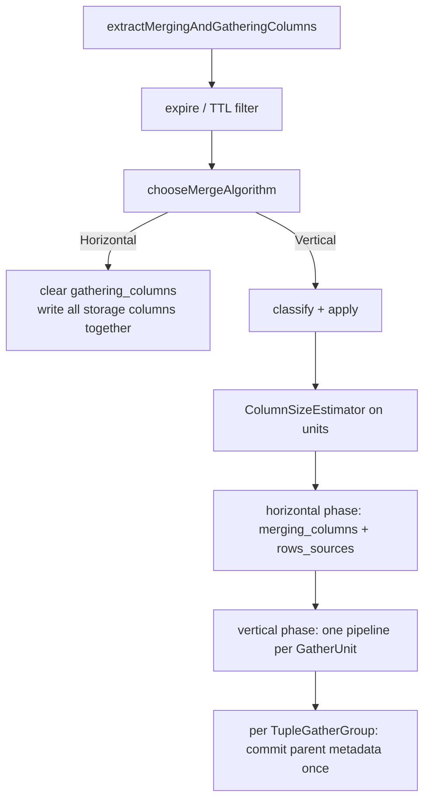
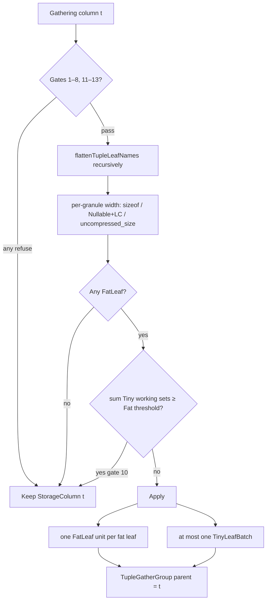
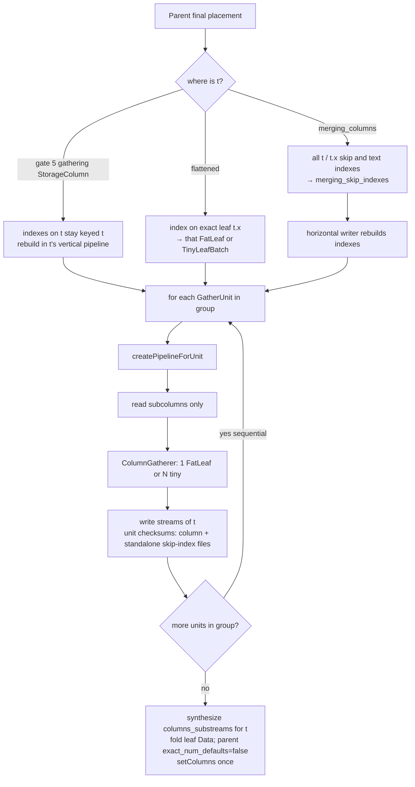

# Vertical merge of `Tuple` subcolumns

Settings (both MergeTree):

- `allow_experimental_vertical_merge_tuple_subcolumns` (`Bool`, default `false`)
- `vertical_merge_tuple_subcolumns_fat_threshold_bytes` (`UInt64`, default `10 * 1024 * 1024`). Fat/Tiny cutoff. **`0` means do not flatten** — no fallback to `merge_max_block_size_bytes` or `index_granularity_bytes`.

When `allow_experimental_vertical_merge_tuple_subcolumns` is on **and** `vertical_merge_tuple_subcolumns_fat_threshold_bytes` is not `0`, **some** flattenable `Tuple` leaves may participate in Vertical gather as stream-scheduling tasks of their parent storage column. The output part schema does not change: `columns.txt` still lists one column `t`. Flattened output must be **byte-compatible** with an unflattened Vertical write of the same `t` (no format bump; replicas may use different values of these settings). With default `10 MiB` / `8192`-row marks, a purely fixed-width tuple almost never has a `FatLeaf` (even `UInt256` is 256 KiB). The shape that actually flattens is a leaf whose **whole-column uncompressed size** is ≥ the Fat threshold (typically a fat `String` / `Array`) plus tiny siblings.

This document is the revised design after three reviews (write/metadata, read/edge cases, performance). The first sketch treated each leaf as an ordinary `gathering_columns` entry. That model writes unloadable parts and turns one wide `Tuple` into `N` full scans of `rows_sources`. Do not implement that sketch.

## 1. Core model

A leaf is a **stream-scheduling task** of storage column `t`, not a new storage column.

Vertical-stage work is a `GatherUnit`:

| Field | Meaning |
|---|---|
| `id` | Stable key for progress / prefetch / `columnWeight`. `StorageColumn` and `FatLeaf` use the (sub)column name; a `TinyLeafBatch` uses a synthetic id such as `t.#tiny` that is **not** written to the part |
| `parent` | Storage column name, e.g. `t` (equals itself for a non-`Tuple` column) |
| `columns` | `NameAndTypePair` list to read / gather / write in this unit |
| `kind` | `StorageColumn` / `FatLeaf` / `TinyLeafBatch` |

Rules:

- Ordinary column: one unit, `columns = {t}`, same as today.
- Flattened `Tuple`: split into **zero or more `FatLeaf`** units (one leaf each) plus **at most one `TinyLeafBatch`** (all tiny leaves, one pipeline).
- All units that share the same `parent` form a `TupleGatherGroup`. Files in a group may be written in sequence; **parent metadata is committed once, at group end**.

Every leaf must be a four-argument subcolumn pair. The two-argument constructor is forbidden:

```cpp
NameAndTypePair("t", "inner.c", root_tuple_type, leaf_type);
// name == "t.inner.c"
// getNameInStorage() == "t"
// type_in_storage == the root Tuple, not an intermediate Tuple
```

Use `Nested::flattenTupleLeafNames` only to list leaf names. Build the actual pair from `ColumnsDescription` / `tryGetColumn(..., withSubcolumns)` so it matches the query path (`SerializationNamed` + `TupleElement`).

Two independent corruption paths make this rule mandatory, not stylistic:

- `ISerialization::getFileNameForStream` always uses `getNameInStorage`. A two-arg pair named `t.inner.c` makes the storage name `t.inner.c`, and the part's `SerializationNamed` still pushes `TupleElement` onto the path, so the file name gains the element twice.
- `StreamFileNameSettings::share_nested_offsets` defaults to `true`. When the storage name differs from `Nested::extractTableName` of itself and the path looks like Nested offsets, the offsets stream name is folded onto the Nested table name. A four-arg pair keeps the storage name `t` (no dot), so this never fires. A two-arg pair combined with a leaf's own default serialization can route an `Array` leaf's offsets onto a shared name. This is silent, and distinct from the doubled-name case above.

## 2. When to flatten

Flatten is **two steps**, and **both** run only after Vertical has already been chosen:

1. **Classify** — evaluate the gates below and split leaves into Fat / Tiny. Produces a decision; does not touch `gathering_columns` until apply.
2. **Apply** — replace the parent entry in `gathering_columns` with its units, then build `ColumnSizeEstimator` from those units.

```
extractMergingAndGatheringColumns
  → expire / TTL filter
  → chooseMergeAlgorithm          // still sees parent gathering columns
  → [Vertical only] classify + apply → ColumnSizeEstimator
```

`chooseMergeAlgorithm` reads `gathering_columns.size()`, so flatten must not run before it — otherwise the 11-column threshold would count leaves. v1 also does **not** use FatLeaf classification to *activate* Vertical (that would be the only reason to classify earlier). Horizontal merges, including those with the setting on, pay nothing.

If the setting is `false`, classify is a no-op even on the Vertical path.

Do **not** flatten parent `t` (keep one `StorageColumn` unit) if any of the following holds:

1. The setting is `false`.
2. The type is not `Nested::tryGetFlattenableTuple` (empty `Tuple()`, custom-named types such as `Point` / `Ring`). This already rejects `Nullable(Tuple)` / `LowCardinality(Tuple)` (`typeid_cast` to `DataTypeTuple` fails).
3. Documentation only — do **not** implement as a second check. Wrapped `Nullable` / `LowCardinality` on the **parent** is gate 2. (`Nullable(Tuple)` would share one null-map stream if it were flattenable.)
4. The column is already pinned in `merging_columns` (PK / sign / version / projection / rows-TTL expressions).
5. Any skip index / text index / column statistic has a **raw** `getRequiredColumns` that contains whole `t` or a non-leaf path (e.g. `t.inner`). The parent stays an unflattened **gathering** `StorageColumn` (not moved into `merging_columns`). Indexes on a single leaf `t.x` do **not** pin by themselves; they are routed after the parent’s final placement (Section 6).
6. `t` is in `expired_columns` (expiry is by storage name; do not flatten and then `eraseNames`). Defensive: expire already runs before `chooseMergeAlgorithm` and erases `t` from `gathering_columns`, so `classify` should not see an expired column.
7. A flattened leaf name collides with a physical column (reuse the uniqueness check used by `allow_tuple_element_aggregation`).
8. **Any source part is Compact.** v1 does not flatten if any input is Compact, even when that part has substream marks (`index_granularity_info.mark_type.with_substreams`). Without marks, each leaf read deserializes the whole tuple. With marks, a leaf read seeks, but `N` FatLeaves still reopen the same `data.bin` `N` times. Refuse both. Do not read `write_marks_for_substreams_in_compact_parts` — that setting is about *future* writes, and it was introduced disabled then flipped to `true`. `chooseMergeAlgorithm` already forces Horizontal when the **output** part is not Wide, so no extra output-format gate is needed.
9. After classification there is no `FatLeaf` (all tiny) — flatten would only add `N` `rows_sources` scans and no memory win. One `TinyLeafBatch` of all tinies is the same unit count as keeping `t`.
10. After classification the **sum of tiny per-granule working sets** is itself ≥ the Fat threshold (Section 3). v1 keeps **at most one** `TinyLeafBatch`; that batch would then be as wide as a FatLeaf granule, so flatten is not worth the extra unit. This is a v1 simplification, not “recreates the whole-tuple peak” (isolating a real `FatLeaf` still lowers peak). Bin-packing tinies into `⌈sum / threshold⌉` batches is a later option.
11. **Any leaf has dynamic subcolumns** (`JSON`, `Dynamic`, `Variant(Dynamic)`, or other types whose stream set is not static). Criterion is “needs a column or deserialize state to list streams”, not the type name `Variant` alone: `SerializationVariant::enumerateStreams` lists every variant element statically. `JSON` dynamic paths are in `SerializationObject.cpp` (typed paths always; dynamic paths only with a column). `Dynamic` structure-only fallback is `SerializationDynamic.cpp`. `columns_substreams.txt` is the source of truth (`MergeTreeDataPartWide::doCheckConsistency`). Group-end synthesis from parent `enumerateStreams` without a column would drop written dynamic-path files. Assembling parent entries from each leaf writer’s real substream list is a later option.
12. **Any source part, or any patch that applies to `t`, cannot read every would-be unit as a direct subcolumn.** `injectRequiredColumnsRecursively` injects whole `t` when the part’s type lacks the requested element. Several units would then deserialize the parent repeatedly. Do not flatten; do not add a “read parent once and split” fallback in v1. **Compact patch parts:** a Compact patch that stores whole `t` can still serve `t.x` by deserializing the tuple (`MergeTreeReaderCompact`). Correctness is fine; `N` units re-read that patch `N` times. v1 **accepts** this (patches are small). Refuse only when the patch **lacks** the element (same as a Wide source).
13. `vertical_merge_tuple_subcolumns_fat_threshold_bytes` is `0`.

**Variable-width static leaves do not refuse the parent.** `String` / `Array` / `Map` / `FixedString` / `Nullable(String)` / … are classified in Section 3 (not a flatten gate):

- Never use `uncompressed_size / rows * max_mark_rows` (average, not a max chunk).
- `FixedString(N)`: `max_mark_rows * N` (exact).
- Other variable-width: whole-leaf `uncompressed_size` is an upper bound on any mark. `<` Fat threshold → Tiny (may enter `TinyLeafBatch`); `≥` threshold → **`FatLeaf` only**, never Tiny.

`JSON` / `Dynamic` / `Variant(Dynamic)` stay on **gate 11** and still refuse the whole parent.

Do not flatten `Nested` / `Array(Tuple)` / `Map` / `JSON` / `Variant` / `Dynamic` as **storage types**. The same types **inside** a flattenable `Tuple` refuse only when they have **dynamic** subcolumns (gate 11). Static `Array` / `Map` / `Nullable` / `LowCardinality` / `String` / `FixedString` leaves are classified in Section 3.

## 3. Split by working set, not by element count or total bytes

`rows_sources` is one LZ4 temp file, one byte per input row. **Each gather pipeline scans it from the start.** Scan cost does not depend on column width. Splitting `Tuple(UInt8, … × 50)` into 50 units is a regression.

**Peak vs classifier (do not conflate):**

- **True gather peak** of one unit is Θ(Σ over live source parts of one granule) plus the output block. `ColumnGathererStream` keeps a `ColumnPtr` per input; a fully consumed source is not released until the next `update`. `MergeTreeSequentialSource` reads one mark per step. Interleaved `rows_sources` (the normal case) can hold up to `RowSourcePart::MAX_PARTS` (127) granules.
- **Fat / Tiny classification** uses a **per-granule width** (max of that width over Wide source parts), **not** Σ over parts. Same scale as judging a top-level column: today’s Vertical already pays the `N_parts` multiplier on every gathering column, flattened or not. The Fat threshold is **not** a cap on `N_parts × granule`. Using Σ parts would make the same table flatten on a 64-way merge and not on a 2-way merge; v1 does not do that.

Do **not** use `min(part_uncompressed_size, merge_max_block_size_bytes)`. On a 1 GiB Wide part every `UInt8` leaf is ~1 GiB uncompressed, so that formula yields 10 MiB and marks all 20 `UInt8` leaves Fat — twenty `rows_sources` scans for ~8 KiB granules. That contradicts this section and the `Tuple(UInt8 × 20)` test.

**Per-granule working set** of a leaf, estimated without opening a reader:

1. Stream names: always `enumerateStreams` + `getFileNameForStream` on the **four-arg pair** (static leaves only; gate 11 already dropped dynamic types). If the part has `columns_substreams`, use the parent `t` entry as a **cross-check** that those names exist — do not prefix-split the parent list (element names can contain dots; escaping makes prefix-splitting ambiguous). Look names up in `checksums.files`.
2. `max_mark_rows` = the part’s largest mark (from index granularity). If marks are missing, do not flatten the parent.
3. **Plain fixed-width** (`isValueRepresentedByNumber` and no subtypes): `chunk = max_mark_rows * getSizeOfValueInMemory`.
4. **`Nullable(T)`** with `T` boundable: `chunk = max_mark_rows * 1` (null-map) + chunk of `T`. Do not call `Nullable::getSizeOfValueInMemory` (it throws).
5. **`LowCardinality(T)`** with `T` fixed-width: `chunk = max_mark_rows * getSizeOfValueInMemory(T) + max_mark_rows * 8` (dictionary upper bound + UInt64-wide index). Conservative; a granule cannot hold more than `max_mark_rows` distinct values.
6. **`FixedString(N)`**: `chunk = max_mark_rows * N` (exact).
7. **Other variable-width** (`String`, `Array`, `Map`, `Nullable(String)`, …): do **not** use `uncompressed_size / rows * max_mark_rows`. Whole-leaf `uncompressed_size` (sum of that leaf’s streams) is an upper bound on any single mark. `chunk = uncompressed_size`. Then: `chunk <` Fat threshold → Tiny (even the whole column fits); `chunk ≥` threshold → **FatLeaf only**, never Tiny. Compressed mark deltas are a future heuristic, not a decompressed bound.
8. The leaf working set is the **max** of `chunk` over Wide source parts, not the sum, and not `min(uncompressed_size, merge_max_block_size_bytes)` for fixed-width.

Do **not** call `getSubcolumnSize` or `getListOfStreamsForColumn` — the latter constructs a full `MergeTreeReaderWide`.

**Fat threshold** is only `vertical_merge_tuple_subcolumns_fat_threshold_bytes`. Default `10 MiB`. **`0` → do not flatten** (gate 13). Do not read `merge_max_block_size_bytes` or `index_granularity_bytes` for this cutoff (`index_granularity_bytes` may itself be `0`).

- **FatLeaf**: per-granule working set ≥ Fat threshold (or variable-width with `uncompressed_size ≥` threshold).
- **TinyLeaf**: per-granule working set below the threshold (including variable-width whose **whole column** is below the threshold).

With default 10 MiB / 8192-row marks, fixed-width FatLeaves are effectively unreachable (`UInt256` is 256 KiB). Positive flatten in production is a fat `String`/`Array` leaf (`uncompressed_size ≥ 10 MiB`) plus tinies. Tests that assert flattened files must lower the Fat threshold or use such a leaf (Section 10).

Strategy:

- No `FatLeaf` → do not flatten.
- Has `FatLeaf` → one unit per fat leaf (same cost model as one top-level fat column).
- All `TinyLeaf`s → **one** `TinyLeafBatch` (one read, one `rows_sources` walk, one gather), **unless** the **sum** of tiny **per-granule** working sets is itself ≥ the Fat threshold → do not flatten (gate 10). That sum is “is the batch as wide as one FatLeaf granule?”, not Σ over parts and not “whole-tuple peak”.

Forty nearly-Fat fixed-width leaves whose per-granule sum ≥ the Fat threshold still refuse (gate 10). A 1 GiB outlier `String` whose column `uncompressed_size ≥` threshold is a `FatLeaf` and must not enter `TinyLeafBatch`.

`chooseMergeAlgorithm` keeps counting **parent gathering columns** for `vertical_merge_algorithm_min_columns_to_activate`. A table with `1` PK + `1` fat `Tuple` does not switch to Vertical just because the tuple has 11 elements. v1 does **not** add a “has FatLeaf → count as enough columns” activation path. That can be a later experiment; it is the only thing that would force `classify` to run before the algorithm choice.

## 3.1 Flowcharts

### Merge placement



### Classify one gathering column `t`



### Vertical unit + group commit



## 4. Read path

Each `GatherUnit` goes through existing `createReadFromPartStep` and `getReadTaskColumnsForMerge`, with the unit's **`columns` name list**. Do not bypass inject / default / conversion / patch.

Replace `createPipelineForReadingOneColumn(name)` with `createPipelineForUnit(unit)` (or an equivalent that takes `Names`). Today's helper is one name; a `TinyLeafBatch` is not.

- `FatLeaf`: `Names{"t.x"}`. A Wide reader opens only that leaf's streams.
- `TinyLeafBatch`: request every tiny leaf name in one source. `ColumnGatherer` is single-column today and rejects a wider header; v1 must gather `N` columns in **one** `rows_sources` walk (lockstep `gather`). Do not split the tiny batch into `N` single-column pipelines. See Section 9 step 3 for what this costs.
- Forbidden incremental step: gather leaves, reconstruct a full `ColumnTuple` in memory, write it as one column. Vertical finishes one unit for all rows before the next unit; reconstruction becomes `O(whole tuple)` plus `N` extra scans.

`ALTER UPDATE` / patch parts: the pair must be a real subcolumn so `getNameInStorage` is `t` and `getPatchesForColumns` can select the patch. Required test: `ALTER UPDATE t = ...` then Vertical merge; both leaves must see the patch.

`ALTER` add/drop/modify element: **gate 12**. If any source or applicable patch cannot serve every unit as a direct subcolumn, keep `t` as one `StorageColumn`. Do not rely on `injectRequiredColumnsRecursively` injecting parent `t` and extracting the leaf — that rereads the whole tuple once per unit. A **Compact** patch that still has whole `t` is accepted (re-read per unit; patch is small). Defaults for a truly missing storage column (expired / never materialized) stay on the unflattened path. Do not claim mutations / `MATERIALIZE` flatten tuples; `MutateTask` still rewrites the whole storage column.

Pending metadata-only `RENAME t → t2`: leaf reads must resolve through the new storage name. Cover in Section 10.

## 5. Write / metadata contract (commit per group)

All units of the same `t` write different streams of `t`. Until the group ends, parent `t` is not finalized on the part.

| Step | Allowed | Forbidden |
|---|---|---|
| Construct leaf | Four-arg pair, root `type_in_storage` | Two-arg ctor; intermediate tuple as `type_in_storage` |
| Writer serialization | `part->getSerializations` or `IDataType::getSerialization(pair, parent_info)` | `leaf_type->getDefaultSerialization` |
| File names | `getFileNameForStream(getNameInStorage(), path)` → `t%2Ex.bin` | Treat `t.x` as a storage name (`t%2Ex%2Ex` or colliding `t.bin`) |
| Codec / column settings | `getNameInStorage`; `getCodecDescOrDefault` must use this | `column.name == "t.x"` (today throws `LOGICAL_ERROR`) |
| `columns_substreams` | Leaf writer returns empty; after the group, synthesize one `t` entry via parent `getSerialization("t")` + `enumerateStreams` (v1 leaves are static, so this matches a whole-tuple write) | `addColumn("t.x")`; write a partial `t` and `merge`; use `enumerateStreams` to recover `JSON` / `Dynamic` paths |
| `ColumnsSubstreams::merge` | Keep left-wins (`MutateTask` depends on it) | Change to union-by-name |
| Checksums | Split today's `fillChecksums`: a unit API returns checksums for **column streams and standalone skip-index files** this writer created, and does **not** `setColumns`. Packed `skp_idx.packed` is owned by the **horizontal** writer (`PackedFilesWriter` is shared; that writer runs `fillSkipIndicesChecksums`). The unit **contributes archive entries**; the packed-file checksum appears at horizontal finalize, as today | Call today's `fillChecksums` → `setColumns` on a leaf; drop standalone skip-index checksums; treat the unit as the producer of the `skp_idx.packed` file checksum |
| `serialization.json` | Clone the existing `SerializationInfoTuple`; fold **leaf** `Data` (`num_rows` / `num_defaults` / `exact_num_defaults`) onto `t` → `inner` → `c` element infos. Set parent and **every intermediate** `Tuple` node: `num_rows` from the gathered row count, `exact_num_defaults=false` (do not invent `num_defaults`). A parent default is the row-wise intersection of elements (`ColumnTuple::isDefaultAt`); leaf counts cannot reconstruct it. `getColumnDefaultnessStats` trusts `exact_num_defaults` and can mis-optimize `count()` | Top-level key `t.x`; assign a newly constructed tuple info; change kind stacks; copy a leaf’s `num_defaults` onto parent/`inner` with `exact_num_defaults=true` |
| Empty / expired column | Parent name `t` | `expired_columns.contains("t.x")` |
| Skip / text / stats | Section 6 | Keep using `getColumnNameInStorage` as the map key after flatten |

`delayed_streams`: today already counts **writers**, not streams (`MergeTask.cpp` pops when `delayed_streams.size() > max_delayed_streams`). With the split checksum API an early `finish` does not commit parent metadata. Still count **parent columns / units** (one writer per unit), not per-leaf stream count. Adaptive write-buffer threshold must use the **parent's full stream count** (or the group's stream count). A per-leaf writer that sees 1–3 streams must not fall back to a full 1 MiB compress buffer.

`FatLeaf` and `TinyLeafBatch` of the same group are written **sequentially**. Read-side prefetch of the next unit may overlap. Different parent columns may still finish in parallel.

A `TinyLeafBatch` is **one** `MergedColumnOnlyOutputStream` whose `columns_list` is the batch's four-arg pairs (one writer, `N` leaves). Do not open one writer per tiny leaf. Checksums from that writer are still only accumulated; parent metadata waits for group end.

After the group: synthesize the `t` entry in `columns_substreams`; fold **leaf** `Data` only; force `exact_num_defaults=false` on parent and intermediate `Tuple` nodes; `checksums.add`; `setColumns` **once** if needed. Do not change kind stacks. Streams were written using the kinds from the initial `setColumns` (before the Vertical stage). Updating kinds afterwards would make `serialization.json` disagree with the files. Maintaining a per-row parent default bitmap during gather is out of v1 (it is as expensive as rebuilding `ColumnTuple`).

The synthesized `t` entry must be identical — same stream names, same order — to what a whole-tuple write produces. Flattened files + metadata must be **byte-compatible** with unflattened Vertical output of the same `t` (no format bump; replicas may disagree on the flatten settings). Readers resolve substream positions from the entry, so a reordering is silent corruption rather than a load failure. Assert this in a test (Section 10).

### Per-unit invariants

- Keep today's `rows_written == column_elems_written` check per unit. For a `TinyLeafBatch` compare the batch total **once** to `global_ctx->rows_written`, not per column.
- Every `TinyLeafBatch` output `Block` must call `Block::checkNumberOfRows` **before** `MergedColumnOnlyOutputStream::write`. That writer does not check today (`MergedBlockOutputStream::writeImpl` does). The Wide writer builds one granule-range list from `block.rows()` and applies it to every column; sibling length mismatch can throw or drop a tail.
- A leaf's `is_result_sparse` comes from `new_data_part->getSerialization("t.x")->getKindStack()`. This resolves because `PartSerializations` includes subcolumns and the initial `setColumns` happens before the Vertical stage. Do not derive it from the parent's kind stack (a `Tuple` is never sparse itself).

### Group atomicity

A `TupleGatherGroup` is **all-or-nothing**. If any unit of the group is cancelled or throws, nothing about parent `t` may be committed: no `t` entry in `columns_substreams`, no `replaceData` into `serialization_infos`, no `setColumns`.

A failed merge discards the whole temporary part, so this is not currently observable — but the invariant has to be explicit, because the natural way to write the code (append to the parent entry after each unit finishes) violates it and only breaks once someone makes partial parts observable.

## 6. Skip indexes, text indexes, statistics, projections, TTL

**Route indexes after the parent’s final placement**, not from raw names alone.

Today `skip_indexes_by_column` is keyed by `getColumnNameInStorage`, then entries whose key sits in `key_columns` move to `merging_skip_indexes`. If `ORDER BY` or a projection pins `t` into the horizontal phase, there is no `t.x` gather unit. Keying an index on `t.x` as `"t.x"` then misses both `key_columns.contains("t")` and any vertical unit — the index is never rebuilt.

Rules:

- If the expression needs whole `t` or a non-leaf path → **gate 5**: parent stays an unflattened **gathering** `StorageColumn`. Indexes on `t` stay keyed `"t"` and are rebuilt in **`t`'s single vertical pipeline**, exactly as today (`skip_indexes_by_column["t"]`). Do **not** move them to `merging_skip_indexes` — the horizontal phase does not read `t`.
- If the parent ends in **`merging_columns`** (PK, projection, TTL, multi-column index — **not** gate 5): every skip / text index whose required columns resolve to that parent — including an index on `t.x` — goes to the **horizontal** writer (`merging_skip_indexes`). Do not leave them under `"t.x"`.
- If the parent is **flattened** into gather units: a single-column index whose required name is exactly leaf `t.x` is keyed `"t.x"` and attached to that `FatLeaf` or to the `TinyLeafBatch` that contains `t.x`. Multi-column indexes already pushed the parent into merging; they never reach this branch.

`createPipelineForUnit` looks up skip / text / stats by every name in `unit.columns`. A header that only has leaves **cannot** rebuild whole `t` to compute an index.

Attaching indexes and selecting patch parts is part of the first write-path increment (Section 9 step 2), not a later polish. Expire is gate 6 and is already decided in `classify`. The unit checksum API keeps **standalone** skip-index checksums (Section 5); packed `skp_idx.packed` stays on the horizontal writer.

`addBuildTextIndexesStep` and `addBuildStatisticsStep` already match required columns **by name** against the header — not by position 0. Text indexes: `original_header->getNameSet()` then `getColumnNameInStorage` (`MergeTask.cpp`). Statistics: `plan.getCurrentHeader()->getNameSet()` then `read_column_names.contains(column_name)`. A `TinyLeafBatch` multi-column header is therefore already valid. **Do not** treat “lift a position-0 assumption” as implementation work (not in Section 9). The remaining contract is only routing: attach a `t.x` text/stats object to the unit that actually has `t.x` in `unit.columns` (Section 6 rules above).

Projections: if any projection's `required_columns` mentions `t` or `t.*`, do not flatten (gate 4 — parent goes to `merging_columns`). Projection **part** merges go through `MergeProjectionPartsTask`, not `MergeTask`'s vertical stage; tuple columns inside projections are automatically out of scope.

Rows TTL: expression columns go through `getColumnNameInStorage` into `key_columns`, so whole `t` stays merging. Column TTL already disables Vertical TTL and does not use this gather path.

Lightweight delete: `apply_deleted_mask = !vertical_lightweight_delete` (`MergeTask.cpp`). When `isVerticalLightweightDelete` is true (Ordinary + Vertical + `vertical_merge_optimize_lightweight_delete` + `_row_exists`), the mask is applied in the merging algorithm / `rows_sources` and gather readers skip it. When false, each unit’s reader applies the mask per row. Both branches are correct for leaves; leaf width does not matter.

## 7. Progress and remote I/O

- `ColumnSizeEstimator`: key by `unit.id`. For a `FatLeaf`, use that leaf's checksum-derived **compressed** size (stream list from the four-arg `enumerateStreams` in Section 3). That size is for progress only, not for Fat/Tiny. For a `TinyLeafBatch`, use the **sum** of its leaves. For an unflattened `StorageColumn`, keep today's parent size. Compact sources are not flattened (gate 8), so Compact's stub `getSubcolumnSize` (always 0) is irrelevant.
- `columnWeight` uses `unit.id`. Do not insert a raw flattened `t.x` as size 0, and do not look up the synthetic `t.#tiny` in part checksums.
- `columns_written`: increment per **storage column / group**, or record unit count separately. Do not report one `Tuple` as 50 columns in `system.merges`.
- Wide remote: prefetch a **configurable window of upcoming sibling streams**, not only `std::next` of one leaf. Today's whole-tuple gather reaches `prefetchForColumn` once and prefetches every substream of that `Tuple` in parallel; a leaf-at-a-time design serializes those requests and can be slower on S3 even while peak memory drops. Size the window against `filesystem_prefetches_limit` (which compares against the read task's column count, so a single-column read of `t` does not currently cap sibling streams). Pick the default from measurement, not from a guess.
- Do not call `getListOfStreamsForColumn` for progress (it constructs a full Wide reader).

## 8. Out of scope

- Do not change the table schema or store `t` as top-level `t.x` / `t.y`.
- Do not turn Vertical merge into a generic serialization-stream merge.
- Do not flatten `Nested` / `Array(Tuple)` in v1 (a follow-up can reuse `written_offset_substreams`).
- Do not flatten a parent that has a dynamic-subcolumn leaf (`JSON` / `Dynamic` / `Variant(Dynamic)` / …). Do not synthesize those streams from type-only `enumerateStreams`. Plain `Variant` of static types is static; still refuse in v1 if any variant alternative is dynamic.
- Do not change `ColumnsSubstreams::merge` semantics.
- Do not ship “gather leaves → reconstruct `ColumnTuple` → write whole column” as an incremental milestone.
- `MutateTask` does not flatten tuples. Projection part merges (`MergeProjectionPartsTask`) do not flatten tuples.
- v1 does not use FatLeaf classification to activate Vertical.
- v1 does not coalesce a missing tuple element into one parent read; it refuses to flatten (gate 12).
- v1 does not estimate variable-width working set with a part-wide average. Whole-column `uncompressed_size` is an upper bound: below Fat threshold → Tiny; otherwise `FatLeaf` only.
- v1 does not reconstruct parent `num_defaults` from leaf counts; parent and intermediate `Tuple` nodes set `exact_num_defaults=false`.
- v1 does not multiply the Fat threshold by source-part count. Replicas may run different values of the flatten settings (unlike `allow_vertical_merges_from_compact_to_wide_parts`).

## 9. Suggested implementation order

Still design-only until a later change. Each step is a mergeable increment. Do not ship a half-written `t` (FatLeaves on disk, tinies still in a parent `StorageColumn` writer).

### Step 0 — settings

Register both settings in `src/Storages/MergeTree/MergeTreeSettings.cpp`, add `SettingsChangesHistory.cpp` entries to the MergeTree block (see `allow_tuple_element_aggregation`), add them to the BuzzHouse fuzz list in `src/Client/BuzzHouse/Generator/TableSettings.cpp`. Default off / 10 MiB. No merge behavior change.

### Step 1 — classify only (write path unchanged)

Add `GatherUnit` / `TupleGatherGroup`. After `chooseMergeAlgorithm` picks Vertical, run `classify` (gates 1–13 + Section 3 working set) and `apply` **or** keep apply as a dry-run that does not replace `gathering_columns`.

Write path still writes whole `t`. Purpose: lock the decision and test it.

**Ship:** logs or a test-only dump of units (parent, kind, names, Fat/Tiny widths). Assert: Compact / `JSON` / missing element / `fat_threshold_bytes=0` / all-tiny `Tuple(UInt8 × 20)` → no flatten; fat `String` + ints → 1 `FatLeaf` + tinies (apply not yet consuming them).

**Do not:** change `createPipelineForReadingOneColumn`, writers, or `gathering_columns` in a way that the Vertical loop iterates leaves.

### Step 2 — `FatLeaf` write (only all-Fat tuples flatten)

Replace the Vertical loop’s “one name” with `createPipelineForUnit`. Four-arg pairs; codec / patches via `getNameInStorage`; `is_result_sparse` from `getSerialization("t.x")`.

Split today’s `fillChecksums`: unit returns **column + standalone skip-index** checksums, no `setColumns`. Packed `skp_idx.packed` stays on the horizontal writer.

**Same step (load-bearing, not polish):**

- Route skip / text / stats **after** final parent placement (Section 6). Gate 5: indexes on `t` stay on the unflattened vertical `t` pipeline — do not send them to `merging_skip_indexes`.
- Gate 12 / Compact patch policy; expire already erased (gate 6).
- Group-end: synthesize `columns_substreams` for `t` via static `enumerateStreams`; fold leaf `SerializationInfo::Data`; parent and intermediate `Tuple` nodes `exact_num_defaults=false`; `setColumns` once; group atomicity.

`classify` **must not apply** a mix of Fat + Tiny until step 3: if any Tiny remains, keep `StorageColumn t` (same as gate 9/10 refuse). Step 2 therefore only flattens tuples whose leaves are **all** `FatLeaf` (e.g. several large `String`s). One fat `String` + small ints still does not flatten.

**Tests:** low Fat threshold or all-fat `String`s; `t%2Ex.bin`; `columns_substreams` identical to Horizontal; `serialization.json` key `t` + `exact_num_defaults=false`; skip index on `t.x` while `ORDER BY t`; `ALTER UPDATE`; ADD/DROP element does not flatten; `JSON` leaf does not flatten.

### Step 3 — `TinyLeafBatch` (the useful shape)

Lives mainly in `Processors/`. `ColumnGathererStream` is single-column today.

3a. Multi-column gather, one `rows_sources` walk: per-column `is_result_sparse` and `max_dynamic_subcolumns`; fix `source_to_fully_copy` and `onFinish`. Do **not** rewrite `addBuildTextIndexesStep` / `addBuildStatisticsStep` (already match by name).

3b. One `MergedColumnOnlyOutputStream` for the batch’s four-arg pairs. `Block::checkNumberOfRows` before every `write`. Batch row count vs `rows_written` once.

3c. `classify` may apply Fat + one Tiny batch (gate 9/10 still apply). Common shape: fat `String` + small ints.

**Tests:** default 10 MiB + fat `String` + ints → 2 units; skewed 1 GiB `String` is `FatLeaf` not Tiny; `Nullable(UInt8)` / `LowCardinality(UInt8)` / small `String` in the batch; sibling length mismatch fails; `checkPart`.

### Step 4 — I/O polish

Prefetch a measured window of upcoming sibling streams (remote). Adaptive compress buffers keyed by **parent / group** stream count, not the leaf writer’s 1–3 streams. `ColumnSizeEstimator` / `columnWeight` / `columns_written` by `unit.id` and storage column (can start in step 2 with Fat-only).

Pick the prefetch default from measurement, not from this document.

### What not to split out

- Do not land “gather leaves → rebuild `ColumnTuple` → write whole `t`” as a milestone.
- Do not flatten in `MutateTask` or `MergeProjectionPartsTask`.
- Do not use FatLeaf to activate Vertical.
- Do not implement bin-packing of Tiny batches (gate 10 stays one batch or refuse).

## 10. Tests

Add new `tests/queries/0_stateless` tests. Do not extend old ones.

**How to actually flatten.** With default `vertical_merge_tuple_subcolumns_fat_threshold_bytes = 10 MiB` and default 8192-row marks, a fixed-width leaf never becomes `FatLeaf`. Every correctness test that asserts flattened artifacts (`t%2Ex.bin`, synthesized `columns_substreams`, folded `serialization.json`) must do **one** of:

- set `vertical_merge_tuple_subcolumns_fat_threshold_bytes` low (e.g. `1`), or
- include a variable-width leaf whose stream `uncompressed_size` is ≥ the Fat threshold (typical: a fat `String`).

Otherwise the test silently exercises the unflattened path.

Correctness:

- Wide→Wide: `t Tuple(x, inner Tuple(c, d))`, Vertical vs Horizontal, `SELECT t` and `SELECT t.inner.c` match. Use a low Fat threshold or a fat `String` leaf so flatten actually runs.
- Compact (with or without substream marks) → Wide: assert **no** flatten; result still matches Horizontal.
- File names are `t%2Ex.bin`, not `t%2Ex%2Ex.bin` or `t.bin`.
- `serialization.json` has only key `t`; per-element `SPARSE` kinds match files; parent and intermediate `Tuple` nodes have `exact_num_defaults=false`. Cover leaves whose default rows **do not overlap** (`x` default on row 1, `y` on row 2): parent `num_defaults` must not be treated as exact. `checkPart` passes.
- The `t` entry in `columns_substreams` after a flattened Vertical merge is identical, including order, to the one a Horizontal merge of the same data writes.
- Skip index on `t.x`; skip index on whole `t`; text index on `t.x`.
- `ALTER UPDATE t = ...` then merge (patch parts), including a **Compact** patch that still has whole `t` (accepted; result matches).
- ADD / DROP / MODIFY element: an old Wide part that **lacks** one element must **not** flatten (gate 12); assert the parent is not read once per missing leaf.
- Pending metadata-only `RENAME t → t2`: flattened leaf reads resolve under the new name; result matches Horizontal.
- An expired `Tuple` is not resurrected by leaf defaults.
- Projection on `t.x`.
- Index on `t.x` while `ORDER BY t` or a projection pins `t`: the index is rebuilt on the horizontal writer; cover standalone and packed skip-index files.
- Lightweight delete + Vertical.
- `Nullable(Tuple)`, `Point`, empty `Tuple` are not flattened (gate 2). A flattenable parent may have `Nullable(UInt8)` / `LowCardinality(UInt8)` / `FixedString(N)` leaves (Section 3 bounds). A small `String` (`uncompressed_size` &lt; Fat threshold) is Tiny; a large `String` is `FatLeaf` and must not enter `TinyLeafBatch`.
- TinyLeafBatch sibling length mismatch: a gather that would emit columns of different row counts must fail before `MergedColumnOnlyOutputStream::write` (`checkNumberOfRows`).
- A `JSON` / `Dynamic` / `Variant(Dynamic)` leaf: parent is **not** flattened; `columns_substreams.txt`, `checkPart`, and reads after reload still match Horizontal.
- Collision of a leaf name with physical column `t.x` → do not flatten.

Performance / behavior (anti-regression):

- Large Wide parts with `Tuple(UInt8 × 20)`: **not** flattened (granule working set is KiB). Unit count equals today’s single gathering column. Prefer asserting `rows_sources` scan count (one per gathering unit).
- Highly skewed `String` leaf (one ~1 GiB row, the rest tiny) plus small integers: column `uncompressed_size ≥` Fat threshold → **`FatLeaf`**, must **not** enter `TinyLeafBatch`. Integers go to `TinyLeafBatch` if their per-granule sum is below the threshold.
- `vertical_merge_tuple_subcolumns_fat_threshold_bytes=0`: do not flatten, even if other gates pass. Setting `merge_max_block_size_bytes=0` (or `index_granularity_bytes=0`) must **not** be treated as a Fat-threshold fallback and must not by itself refuse or force flatten.
- Many near-Fat **fixed-width** tiny leaves whose working-set sum ≥ the Fat threshold: do not flatten.
- A table with only one fat `Tuple` does not unexpectedly switch to Vertical (parent-column counting; v1 has no FatLeaf activation).
- Prefetch-window default is a later named setting (step 4); pick it from measurement, not from this document.

## 11. Decisions and rationale

Relative to the first sketch, the contract is three sentences:

1. A leaf is a stream task of `t`, not a gathering column.
2. Split only `FatLeaf`s; batch tiny leaves in one unit.
3. Commit parent metadata once per group; `rows_sources`, Compact, and the activation threshold must not scale with leaf count.

The reasoning behind each, so it can be re-evaluated rather than taken on faith:

(1) follows from the write path: `columns.txt`, codecs, `expired_columns`, skip-index keys, `SerializationInfoByName`, and `ColumnsSubstreams::merge` all key on storage names. A part whose `serialization.json` contains a top-level `t.x` fails to load outright.

(2) follows from `rows_sources` being one LZ4 temp file scanned from the start by every gather pipeline. Scan cost is proportional to input rows and independent of column width, so unit count — not leaf count — is the thing to minimize. Fat vs Tiny is **per-granule width** (max over Wide parts), the same scale as a top-level column; true gather peak is still Σ parts × that width, and v1 does not fold fan-in into the threshold. A part-wide average is not a max chunk. Variable-width uses whole-leaf `uncompressed_size` as an upper bound: below threshold → Tiny; otherwise `FatLeaf` only. `Nullable` / `LowCardinality` of a boundable `T` have explicit per-granule bounds; do not call `Nullable::getSizeOfValueInMemory`. Gate 10 compares the **sum of tiny per-granule widths** to the Fat threshold (v1: one batch). The Fat cutoff is a dedicated setting; `0` means off (gate 13), not “inherit `merge_max_block_size_bytes`”. Parent `num_defaults` is a row-wise intersection (`ColumnTuple::isDefaultAt`) and is not reconstructed from leaf counters — parent and intermediate `Tuple` nodes set `exact_num_defaults=false` so `getColumnDefaultnessStats` / `count()` do not trust a wrong number. `TinyLeafBatch` must `checkNumberOfRows` because `MergedColumnOnlyOutputStream::write` does not.

(3) follows from the same two, plus Compact `data.bin` being one file: even with substream marks, `N` leaf pipelines reopen it `N` times. v1 therefore refuses all Compact **sources**. Compact **patches** that still hold `t` are accepted. Dynamic-subcolumn leaves refuse flatten because type-only parent `enumerateStreams` cannot list runtime paths (`SerializationObject` / `SerializationDynamic`); plain `Variant` of static types is a static stream set.

If a future change removes one of those constraints — for example a shared uncompressed `rows_sources` image, a cheap multi-column gatherer, Compact coalescing, or assembling `columns_substreams` from leaf writers — the corresponding rule here should be revisited with measurements rather than kept by inertia. Using FatLeaf classification to activate Vertical would also force `classify` before `chooseMergeAlgorithm`; do not add that without measuring Horizontal-path cost.
