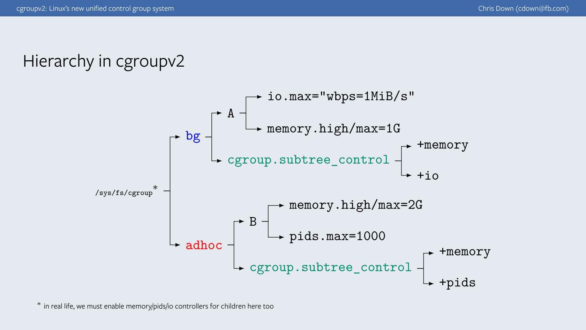

# RFC: ClickHouse Control Groups (or Resource Pools)

## Goals

Add a mechanism for flexible resource limits for query execution for a query,
a user or groups of users.

## Background

One of the challenges in operating a service acting as a (finite) shared
resource is resource isolation. We want to share available resources
according to some rules between users, different components of a system and
even between arbitrary groups of the above mentioned entities.

ClickHouse already comes with knobs for (performance) resource isolation.
Let's walk over them:

* It is a good manner to provide **global limits**, eg to stop accepting
more work when the system is overloaded; to limit the amount of work that
can be done by background components to some expected ranges so that they
don't exhaust resources needed for "real-time" queries.

    Examples of the global limits in ClickHouse: `max_concurrent_queries`,
`max_connections`, `max_thread_pool_size`, `background_pool_size`.

* With global limits in place it is also a good idea to have **per query 
limits**. Having per query limits allows the server to process multiple
"well-behaved" queries simultaneously by preventing "bad" queries causing havoc
or exhausting all available resources.

    Examples of per query limits: `max_memory_usage`, `min_execution_speed_bytes`,
`max_network_bandwidth`.

    While individual queries can be "isolated" nothing stops a single user from
sending as many "well-behaved" queries as possible (intentionally, or by
accident) rendering the system unavailable for other users.

* Enter **per user limits.** While I don't know the exact reason they were
introduced for I'm pretty sure ClickHouse at Metrica was getting popular
and started to have "adversarial" users. Examples of per user limits:
`max_concurrent_queries_for_user`, `max_memory_usage_for_user`,
`max_network_bandwidth_for_user`.

* Some per query/per user limits also have "global" variants, these are
 suffixed with `_for_all_queries` or `_for_all_users`.

* Other ways for isolating/controlling workload:
    * **Quotas** allow limiting resource usage over periods of time.
    Resource in this context means one of: queries, errors, read_rows,
    execution_time.
    
        While these have some valid use cases in general they are not very
        useful for resource isolation. Ie there is rarely a reason to limit
        someones access based on the amount of data they have read if the
        system is idle, or they are reading a lot of rows but all of them come
        from memory (ie PK).

    * **Query Priorities** allows suspending query execution if at least one
    query of higher priority is executed.

_There are also per table limits (MergeTreeSettings.h)._

### Problems

**Inconsistencies in the available resource limits.** Each new setting needs to
be defined and implemented in different ways depending on the granularity it
will operate on. One example is `max_concurrent_queries_for_user` introduced
in 2017, while the `max_concurrent_queries_for_all_users` variant was introduced
3 years later ([Add max_concurrent_queries_for_all_users setting #16154][PR-16154]).

Before writing this RFC I was very close to introducing one more _suffix_,
`_for_profile`….

**Granularity "rigidity".** Limits can be applied globally, per user and per query. 

The clusters we operate usually have multiple types of users:

* System users for gathering various metrics, `system.metrics`, `system.asynchronous_metrics`,
data based on `system.part_log`, `query_log` and so on.
    
* System users for running schema changes (DBAs might fall in this category as well).

* Service accounts for customer facing products (that would be a user querying
ClickHouse to draw a dashboard ie on Yandex Metrica, or Cloudflare Radar),
usually a few with some exceptions.

* Service accounts for internal workloads which are more tolerant to failures,
ie async ETL jobs.

* Analysts, employees running direct SQL queries.

* Service accounts similar to analysts by SLA, ie Grafana.

One elementary type of isolation needed here is ability to limit the maximum
number of concurrent queries for a group of users and to reserve some slots
for critical users (system users).

Example configuration which is not possible today:

* system users: allow max 10 concurrent queries,
* service accounts: max 100 concurrent queries,
* analysts: max 20 concurrent queries,
* and a global limit of 130+.

A more advanced one would be to accept analysts queries only if the total
concurrency is < 50, but accept at most 20 concurrent queries from analysts.

Extrapolate this to memory, cpu, network if interested.

**Implementation "inconsistency".** There is a global `max_concurrent_queries`,
which can't be adjusted at runtime and is used to set an upper limit on `ProcessList`
(stored in `Context`). `max_concurrent_queries_for_all_users` is from profile/user
settings and is compared with number of entries in the `ProcessList`.
`max_concurrent_queries_for_user` is implemented with a different data structure
called `ProcessListForUser`. [3] contains additional examples.

## Design

There are a lot of expectations from "resource pools", and different customers
have different needs. The current goal is not to address all of them but rather
lay a foundation that would allow implementing basic means for resource isolation
today and not preclude future extensions with things like statistical multiplexing
of CPU/IO/Network, preemptions based on query priorities and so on.

### What we want

We want to address the problems mentioned above. Provide flexibility for configuring
limits for a single query, for all queries of a user, for queries of a group of users
and have implementation consistency.

First thing that comes to mind in this space is [Wiki: Linux Control Groups](https://en.wikipedia.org/wiki/Cgroups)
([kernel.org: cgroup-v2.txt](https://www.kernel.org/doc/Documentation/cgroup-v2.txt)).

> cgroup is a mechanism to organize processes hierarchically and distribute
> system resources along the hierarchy in a controlled and configurable manner.
> cgroup is largely composed of two parts - the core and controllers.
>
> cgroup core is primarily responsible for hierarchically organizing processes.
>
> A cgroup controller is usually responsible for distributing a specific type of
> system resource along the hierarchy although there are utility controllers
> which serve purposes other than resource distribution.
>
> cgroups form a tree structure and every process in the system belongs to
> one and only one cgroup.

### What we have

ClickHouse already has things similar to cgroup controllers that are used to
implement various limits.

Examples: [MemoryTracker][MemoryTracker.h], Network [Throttler][Throttler.h].

[ProfileEvents][ProfileEvents.h] and thread groups hierarchies with
[ThreadProfileEvents][ThreadProfileEvents.h] could fall in this category as well
even though today only tracking is supported (rather than "controlling").
[3] has some neat ideas on how it could be possible to "bind" actions to events.

An important property to mention of the above mentioned "things" is that all of
them are hierarchical.

The missing part is that there isn't a lot of flexibility in configuring these.

### A rough sketch of how the future could look like

Let's draw some inspiration from Linux control groups and adapt the existing
"resource controllers" to achieve "resource pools".

* There should be a root control group for the system limits

* It should be possible to define control groups for background processes
and assign tables to these control groups.
    * Ie a table or a group of tables could use at most `X b/s` of disk, 
    `Y b/s` of network for replication, `Z b` of storage.
        * We could instead use writer's control group but there are things like
        Kafka engine which would need some special handling.

* It should be possible to define control groups for queries to limit eg CPU,
query concurrency, max memory usage.
    * This could help isolate writing vs reading.

* It should be possible to assign users/roles to control groups.
    * Maybe even multiple ones and allow users to choose which control groups
    should be used for operations (similar to roles today?).

* It should be possible to nest control groups to form hierarchies.

* It should be possible to configure per-user and per-query limits using control
groups in order to achieve "consistent implementation" of the limits.
    * Maybe allow something like `CREATE CONTROL GROUP TEMPLATE zzz FOR QUERY ...`,
    `CREATE CONTROL GROUP TEMPLATE zzz FOR USER` (`... FOR QUOTA KEY`?).
        * These would be applied for each query/user separately
        and automatically "nest" under the control group to which the user belongs.

### First rocks in the road

It is not very clear what the implementation of "(resource) control group" should look like.
Eg the global control group needs to know about query concurrency limits, memory limits.
Query concurrency limits in control groups for background processes hardly makes sense.

An idea would be to have "control groups" to which controllers like memory tracker,
network throttler, query concurrency (yes, make it a controller) could be attached
and configured independently.

Configuration could be inspired by [3] where for hitting limits is accompanied
by actions like "queue/wait", "throw", "evict lower priority".

To dream a bit more it should be possible to configure queuing policy,
ie LIFO policy (drop old) for "service accounts" but FIFO for ETL workloads.

### Back to present / Action needed

Hopefully all the above makes a good argument for introducing
"unified (resource control groups) hierarchy" (buzz term from cgroupsv2)
and convinces the community to start working on the implementation.

I suggest going ahead with the following steps:
(every item should be enough to be merged/released independently)

1. Agree on the rough design  (it is ok for it to be incomplete as long as
the direction looks right and doesn't preclude future development).
    
    1. Naming (eg "control groups").
    
    1. Base classes design (a class diagram?). At first, I was thinking to put them
    in Access/ similar to where quotas are defined, but if we want to extend these
    to background threads then we'd want to put them somewhere else.
    
    1. How these should be configured. For simplicity, I propose to start with
    XML configs. (scaffolding SQL AST, Parsers, Interpreters is too tedious).
    
    1. How these are propagated and accessed to/from different system components.
    I reckon propagating current "control group" via [ThreadGroupStatus][TGS]
    could be a good idea. 
        
1. Define the data structures for control groups first and implement a basic limit
for query concurrency, allow users and roles to be assigned to "control groups".

    * This is something we want in production ASAP and is the main motivation
    behind this RFC.
        * Either hard coded or with a QueryConcurrencyController (
        `TaskConcurrencyController<TaskType::Query>`).
        * In the future this could be re-implemented as a condition on
        ProfileEvents with a trigger similar to the design described in [3].
    * No support for hierarchies, overcommitting, bursting at this point .
    
1. Add support for nesting/hierarchy, add support for "control groups" templates,
hoist some existing "controllers" ie MemoryTracker.

1. Formalize when "control groups" should be resolved and what happens to
existing connections/session/queries when these are updated. This could get
complicated with hierarchies.
    
1. Whatever else community will prioritize.

## Readings

* [1]: [Minimal implementation of resource pools (RFC) #8449](https://github.com/ClickHouse/ClickHouse/issues/8449)
* [2]: [Separator the resource for Insert and Query, Keep the insert ability #3575](https://github.com/ClickHouse/ClickHouse/issues/3575)
* [3]: [Counters, metrics, and tracepoints in ClickHouse (draft) alexey-milovidov/events.md](https://translate.yandex.com/translate?lang=ru-en&url=https%3A%2F%2Fgist.github.com%2Falexey-milovidov%2Fd62d73222d83b9319dc519cbb13aeff6)

---

[PR-16154]: https://github.com/ClickHouse/ClickHouse/pull/16154
[MemoryTracker.h]: https://github.com/ClickHouse/ClickHouse/blob/master/src/Common/MemoryTracker.h
[Throttler.h]: https://github.com/ClickHouse/ClickHouse/blob/master/src/Common/Throttler.h
[ProfileEvents.h]: https://github.com/ClickHouse/ClickHouse/blob/master/src/Common/ProfileEvents.h
[ThreadProfileEvents.h]: https://github.com/ClickHouse/ClickHouse/blob/master/src/Common/ThreadProfileEvents.h
[TGS]: https://github.com/ClickHouse/ClickHouse/blob/cb4945d8b06c3f4ceaee3ef7d29e9aed14ff1885/src/Common/ThreadStatus.h#L43-L73
